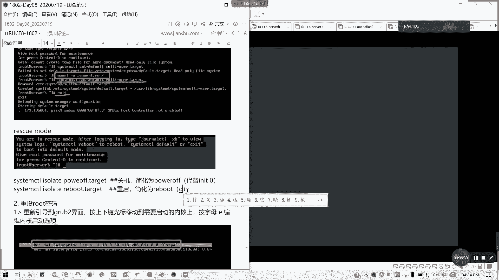
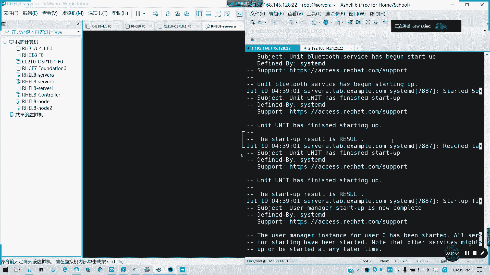
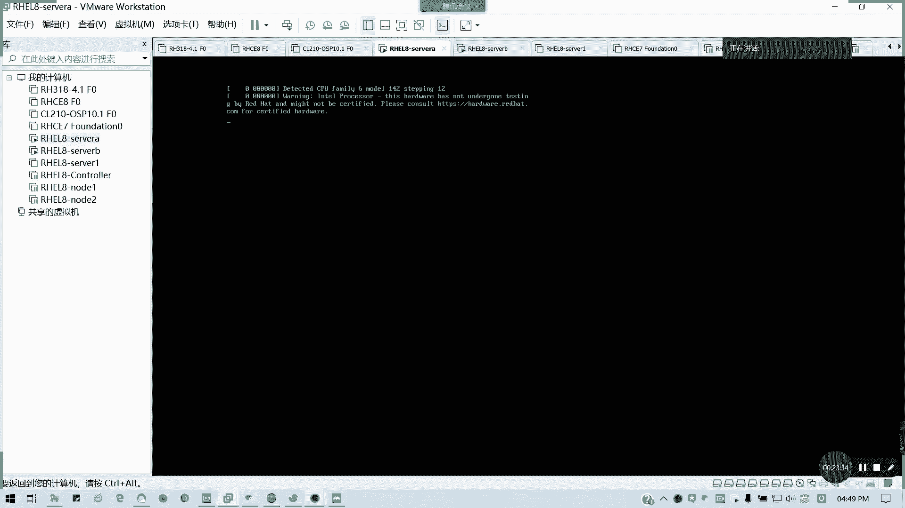

# 2021全新 RHCE8.0 红帽认证入门教程——可零基础入门学习【网络安全／Linux】 - P46：Day08_RH134_Ch10_管理启动过程 - IT老表哥 - BV1444y1h7Bx

第十章控制启动过程，我们的。我们的倒数我们书上倒数第三章，最后一章我不讲为什么。因为有些东西已经讲过了。因为有些东西我已经讲过了，所以的话我就没必要再重复了。

所以的话我们重点来讲一下我们重点讲一下那个第十章的内容啊，第十章内容。然后。看一下第一个选择启动目标。选择启动目标呢。我们。我们在前面是不是讲了第一节课第一天的课。😊，如何切换？对吧如果切换图形界面。

文本界面。还有就是那个救援救援模式以及我们的紧急模紧急救援模式，以及我们的恢复模式。对不对？我们的启动目标目前在红帽吧里面有以下4种。对不对？是吧。选择启动目标。然后常见操作是吧，临时查看。

查看超查看启后目标，然后临时如何设置默认，如临时千万都懂吧。我就不再重复了，这个我们在第一我们在讲访问命令行的时候，我一定有讲过，对不？那接下来我们看一下，如我们的啊当前。

system control啊。🎼好吧，我这个切回去root键。我当前的启动目标system control。Get default。我当年是graphal是吧，那我可以切到。切到文字文本界面啊。

Setter before。猫贴。右侧点他给。

就可以了，这个是切启动目标。

然后如果像切像有些模式是不能随便切的，像紧急模式啊，紧急模式这样你切完就不用启动了，对不对？其就是这一段一个几读系统，切通常是通通常是那个。

出现。故障的时候我们才用的对不对？平常我们不要随便去切啊。

懂吧？图形界面切换的文本界面是这样子，那emergency mode。如果不小心我切换到emergency mode，那怎么办呢？比如说我就这样就我就我就来进行这个误操作哈。那我重启。

这种是非常规操作啊，我是只想跟这大家看给大家看到。

不要学就看到这种是什么结果啊，回到我们的VMware。

看到青鹅基闻模式什么什么结果啊。

我们笔记在旁边。

很久啊。9点慢。因为 mode的话，你要把它改回来了，但它这里会比较慢啊，我看一下它现在什么情况。你看。没有a job is running就D map的映射的问题。有时要等到超时。嗯。没有。

那这个是另外一个就是改密码的问题。家庭铝过。那要等它断。

所以说我现在我就不小心我进入一个就业模式会出现怎么样。对吧。我直接是吧，那这里直接的话进入这模式，而且。我们说一遍露神密码。对吧它是一个只读的，对不对？只读，那我们怎么办呢？我们要重新去挂载。

只只能是重新去。挂载插成读显模式，我们才能操作。懂吗？我们直这里我们执执行直接执行命令是不可以的system controll。s default我们不要说这这些这里能够操作的啊。default。

然后multius target这是一个on read only five system，对不对？那我们要怎么办呢？这种形请说切换到正常模式，我们要杠Omount杠O重新挂载我们的根，对吧？

Remote。然后重新挂起成读写。然后后面再跟就可以了。然后我们这样切换，然后再reboot。

展示SIC。就直接退出，然后他就帮会设定啊启动到我们的文本界面，都明白吗？

看明白吗？在emerency model在我们的救援模式，在我们的那个。紧急模式下面我们要如何切换，我必须要将我们的那个根重新挂载。

这样我们刚重新挂载，不然的话你会出问题了。对吧。

将我们的根重新挂载remote，然后挂载成读写。这按ESC我可以看出它启动内容到底卡在哪。

然后像rescue mode的话。也是救就救救援模式正系种出问题的时候，我们才才会这样。然后还有就是我们的关机跟重启是吧？其实我们运行这两条命令，而不是以前的IIT6跟IT0了，对不对？代替。I90。

懂吧？像他现在是替代这个命令啊，这启动了好久啊。哎，又是紧离模式了，我不是切了吗？要出什么问题啊，我看一下JnoCTO杠叉B。

好像没怎么写书，哪里有问题哎。

好像没有没有没有没有怎么写出问题的。

我看一下，我退我退出看一下。

但如我经常出那基本节模式，那可能挂载啊，或者哪里出问题。这没事啊，我们在另外一台机操作都可以。这个的话其实这讲完这个的话，这台机都可以废了的啊。但是希但希望都大家不要做那个出问题的话。

我们要记得把它整回来。

我们现在的这个129还能用啊，先不影响课堂进行，我128先不管了。然后呢，我们教大家从如何重设root密码，从root密码这个考试。

我实际上可能用会比较多啊，就是说你一台机器不知道密码的时候，我要怎么去重设。

对吧我怎么重设，然后呢。在考试里面。你第零题懂吗？一开始就让你会密码，如果不会，那如果你密码不对。

零分登录了系统，这道题是属于零分的。所以的话我们这里以servB来例啊为例，soA现在已经待会我看怎么回事啊。

我们以设为必然例为例，然后我们看看怎么去修。就是说假设我们不知道啊，这个的话又是有点问题了啊，我看一下是不是挂载的问题。

呃，我看jono叉B，我看一下啊。

摸一下。sstemD没有问题。T mouth finish up。哦。那个UID是C92那个。它主要是连接那个硬盘出问题了。416C6D2那个，那我知道了，对吧？通常像我们其实进入紧急模式出问题的话。

肯定是挂载挂载为为主啊。ECFSt。C6哦，就这个我的VDo那个。懂吗？有点出问题了，我们先把它注释掉，然后再然后再起来。这种是我们排错的一种方法，明白吧？

你看起来了，对吧？看到没？就刚才我看到看到那个video出问题，它那个关它超时了，所以说我就把它关了。所以说我们设为A现在已经起来了啊，待会再看video到底什么问题。

所以我就教大家如何去排错了啊。

主要是这个C。有一个有一个机器起不来，有有一个硬盘，我们挂载点起不来，所以的话就报错了。

所以的话。这也看不到了啊还fi啊，我看下。SC newsaltore mark这个不要紧。

主要是刚才那个挂载点没起来。就那个C16的那个。这里没了。

就刚才看到这个挂载点那个起不来，所以的话我们就。通常那个日志啊，我们在十一章讲的日志是不是很有用？对不对？我们在第一本书十一章讲的这些，你要知道怎么去查。像刚才的话，我们就它有提示说用journal。

这插一题外话啊。叉B啊，我们排除启动问题的话，joCTL杠叉B。🎼然后可以看一下到底从部腿开始。从bos开始，我们从系统从系统引导开始，到底经过什么步骤，然后出了什么问题。然后我再把下一个问题解决了。

所以刚才我把FSt，我最后想注释掉。好吧，那我现在我们看一下servA如何重启改密码来。我哋过地的。思为。笔记里面都有，我就不再改了啊。好，这里。看到没？进到一个Gb界面，我们有两个选项。

一个是rescue的救援的一个界面，一个是我们正常的一个引导内核。我们要改密码，我们要进进入的是我们的救援模式，紧急救援模式，懂吗？也就我们以前俗称的叫担忧模式。从紧急确认模式切到单位模式，然后改密码。

对吧？因为我现在我假设我前提我连录ot密码我忘了。我不知道怎么登录系统的那破对不对？好，这里。看我步动杠一啊按一啊，字母上的一。这里直接到了修改内内核参数的一个界面。修改内核参数界面呢。

我们定位到linux这一行。以前我们叫linux16啊，7。0的时候叫wininux168。6linux这一行。然后按ad定位最后，然后我们。可以啊，按光标，我们定位到一个叫做。RO的地方。

因为它是加载一个尾根是吧？VM是一个尾根，然后后面再去加载一个实根的，懂吗？加载一个尾尾根，这里尾根其实它就是为什么叫尾根呢？前面我们是有一些驱动程序文件是要在系统启动前加载的。

所以它它为了放为了给这个环境，对吧？给给其系统启动提供条件，所以的话必须它要加载一个尾根，也就是一个微系统微系呢也是一个那用系统，然后用尾根去搂我们驱动之后呢。在。挂入我们的系统时根。

然后去加载我们的系统组件，对不对？你连驱动都驱不了。就是说比如说你的硬盘这些就没驱动的话，你怎么加载，对不对？对吧就系统里面是有一个尾根的，就一些驱动，你不要像网卡这些你要驱动起来的。好。

我们先谈了尾根啊，这里是加载尾根的一个环尾根环境之后呢。它这个然后我们这里移到ZR，因为我们为了加快速度，所以的话我们就不要后面的启动选项，我们按delete一直删。好，算完怎么办？

RO我们把尾根的只读啊，把把尾根只读改成RW。然后后面加上RD点break。这个就是进入我们紧急救业模式的一个入口啊。他这里为什么斜杠呢？因为是换？因为它一行显示不了，写示不下，所以都显显示了下一行。

懂我意思吗？笔记里面有好，我们这里插线改完之后，我们下面有提示price control and X controll加X to star，对吧？可能加C是最Q源命令行，然后ESC是退出修改。

我们这里修改完内容之后，按cttrol加X。看到没有？我们进入一个尾根的一个救援模式。对不对？紧急救援模式看到没？那现在我们要切换到我们的石根上面。切换到我们的系统的真实的根，因为它支持一个尾根系统。

对吧？后面的参数我们全部删掉了，就进入一个紧急救援。那我们只如何切换到1根？CH rootot对吧？全 root。杠s root对吧？但谢斯鲁特，这里是一个系统，我们系统一个1根，懂吗？

实际的根目录懂我意思吗？就我们真正的跟分区都在这里。我们现在当前是一个尾跟模式，inFS嘛？Intract就是一个尾根系统，懂我意思吧？然后进入它的基本模式回车，那出现了一个叫SH杠4。4。

这是我们所熟悉的一个叫单用户模式。也就是整个系统的话只有录的一个用户。那此时是不是我们可以改密码了？对不对？改密码pass wD或者是我们用ele直接一句话搞定。可以吧。A后。我还是叫redhead。

我假设不不知道，然后我用passWD。tay in是吧，st in是吧？全面的输出输出变成后面输入，al会root。那这样我们更新问密码。那请问。做完之后，我完了没有？没有啊。

因为当前他进入的是尾根的系统，然后它SCd是没开启的，所以的话它的那个。标签要重打啊，我们这里记得重打标签啊，重打SA60标签。因为我们进入单用模式的话，它的SA60是关闭的。如不不如果不这么操作。

你系统会起不来。因为标签不一致会导致整个内核崩掉。所以记得这一句这一句不要打错。在根目的是在我们的那个。根挂的点。杠点autoreable哈。字有点小，因为它本身就是那个对吧？Touch。

down点autoreliver也不是点干autore，懂吗？回车就这是相当于一个强制重打SEux的一个标记符系统。指定的啊。

我们linux系统指定的一个重打S inux标签的一个相当一个触发器触发条件，懂我意思吧？然后两次ESIT退出。然后开始正常引导。看到没有？SA目标策略SAnew目标策略重打标签这个。已经被要求。

对不对？出现我们熟悉的这个界面。这笔记我都有啊。

这笔记都齐了啊，懂吧？😡。

他现在重打标签，重打完我们就可以正常登录了。所以考试记得这步，不要出错。就在配网络之前，它一开始CSA的话，你在机器。你的密码不知道你的网络也没配通。首先要重置密码。第一件事情啊，我看他的要求。

他有他有给定你的，他你这个是我们这个虚拟机需要设置么密码，他会告诉你的。所以的话记得啊，从就是说重改密码，重打标签退出。很多人就是autore，很多人错了的。诶。同体了啊。我以为我那我以为那盒崩了。

那讲的。没有打就重重重置喽，就考试机马上重置，不要管了，他死就死了，你就重置就行了。因为它考试环境，我们的练习环境呢，课堂环境是课程环境是可以重置的。对，明白我意思吧？

不是在有它有一个上有一个叫做manage VM或者是叫ex VMconl。然后它里有有个窗点出来有一个窗口，就是说你可以重你对点模台虚拟机，你可以进行强制关机，开启重启重置等操作。对。明白我意思吗？

这样的话，你考试如果遇到这种问题，赶紧重置，然后接着重新来过。不要再去排什么问题了，排到来man都翻了，对不对？这部非常重要的操作，如果明白的，请打个歪，有问题请提问。

记住啊。他去。点杠autoreable啊。这个千万不要错，很多人英文水平不好，我手残的经常出错，对吧？少了点的Oto，不知道怎么拼的。对。然后我像我们的那个紧急修复系统问题。紧急修复系统问题呢。

通常来说ETCFSt里面的文件错误或损坏文件系统呢会阻止系统启动，大多数它会降级啊降级到提供路ot密码的紧急修复，也就是我们紧急救援模式是吧？损坏文件系统的UID不存在的，就是等待嘛，对不对？

就像我刚才然后挂载点不存在的，还有挂载一点错误的，像我这里提了一个例子，对不对？我故意改错的。其实刚才我就出现这个问题，对不对？所以我就把紧急就会模式中，我把对应的航线注释了。😊，对吧回到这就正常模式。

我们再进行处理，懂我意思吗？就不要管他到底我怎么为什么挂的错，你先把这一行注释了再说。FSt图不要写错啊，所以我们通常我们用冒杠A去检查，明白我意思吗？那好，这一章我们讲完了。😊，休息15分钟。

我们接下来剩下的一个小时，我们还有第15章一个呃网络安全。我们会讲一讲就是一个防火墙以及我们的。呃。以及我们的一个叫做SC list端口上下文讲完我们就整本书结束。5点05分啊。

05分左右我们讲完讲讲最后一个内容。然后至于HTTP啊，我们的HTTPD阿帕奇基础，我们留在C讲C的话，我讲这基础的，就稍微提一下，因为这个很多人可能不会。但是我们要经常用它来做例子。好吧。

那我们休息一下，稍后继续。