# RHCE8.0 红帽认证入门教程：Day09：管理资产清单

在本节课中，我们将学习 Ansible 资产清单（Inventory）的配置与管理。资产清单定义了 Ansible 控制节点需要管理的所有受控主机。我们将从基础定义开始，逐步学习如何分组、使用变量以及建立控制节点与受管主机之间的安全连接。

## 概述：资产清单的作用与考试环境说明

在 RHCE 考试环境中，网络配置和用户免密认证通常是预先设置好的。考试说明会明确指出哪些用户已经与受管主机建立了免密链接。然而，在实际工作或练习环境中，我们需要掌握从零开始配置的完整流程。本节教程将涵盖这个完整过程，确保你不仅能为考试做准备，也能在实际工作中应用。

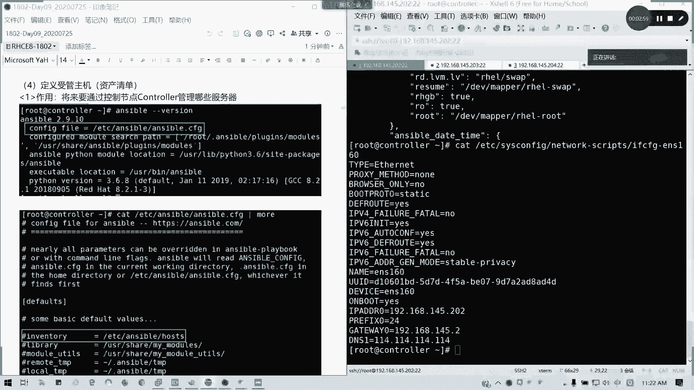

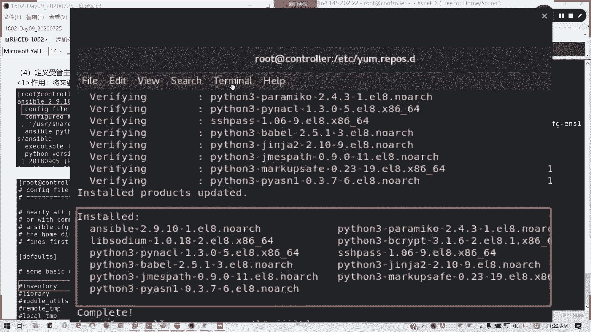

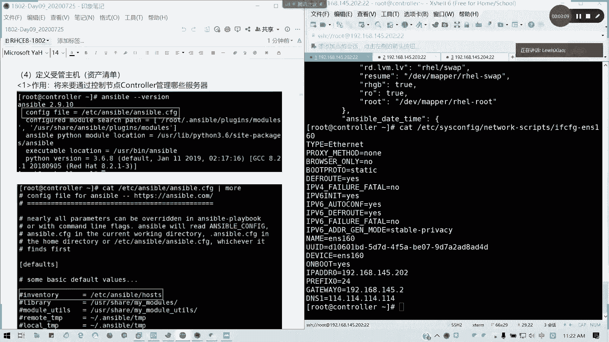

## 配置资产清单文件

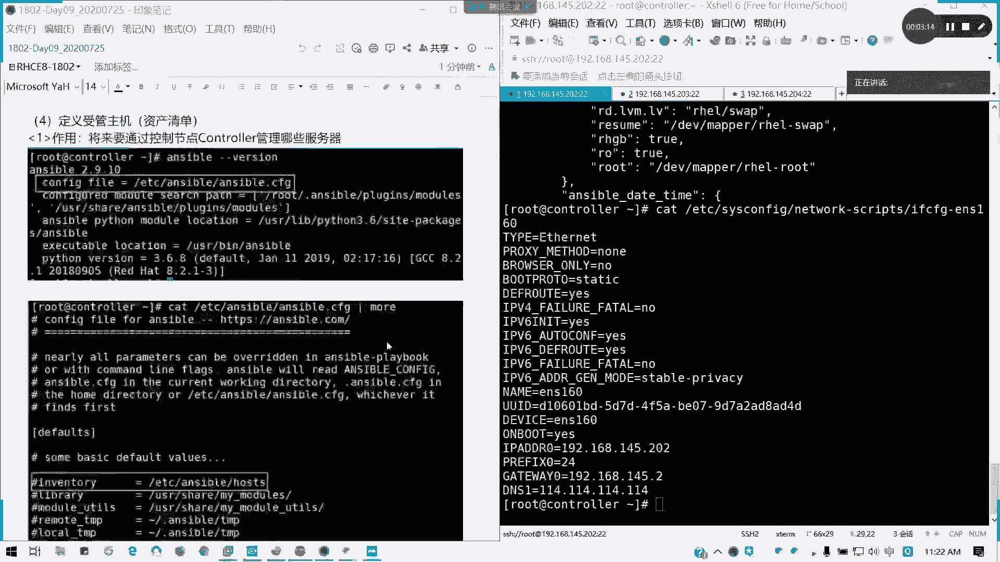

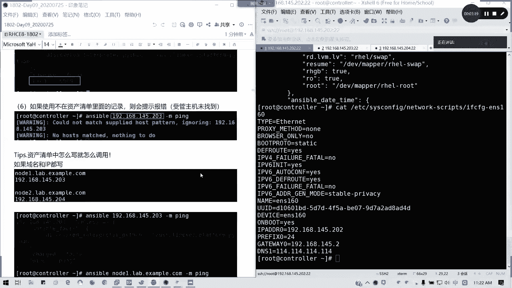

Ansible 的默认资产清单文件路径由配置文件 `/etc/ansible/ansible.cfg` 中的 `inventory` 参数定义，通常指向 `/etc/ansible/hosts`。

上一节我们介绍了 Ansible 的基本架构，本节中我们来看看如何定义受管主机。

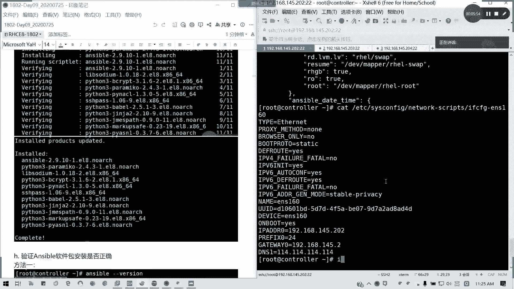

编辑默认的资产清单文件，可以看到其中包含了许多示例。这些示例说明了资产清单的几种定义方式。

以下是资产清单的几种基础定义方法：

1.  **定义未分组的主机**：直接在文件中列出主机名或 IP 地址，无需使用中括号分组。
    ```
    host1.example.com
    192.168.1.100
    ```

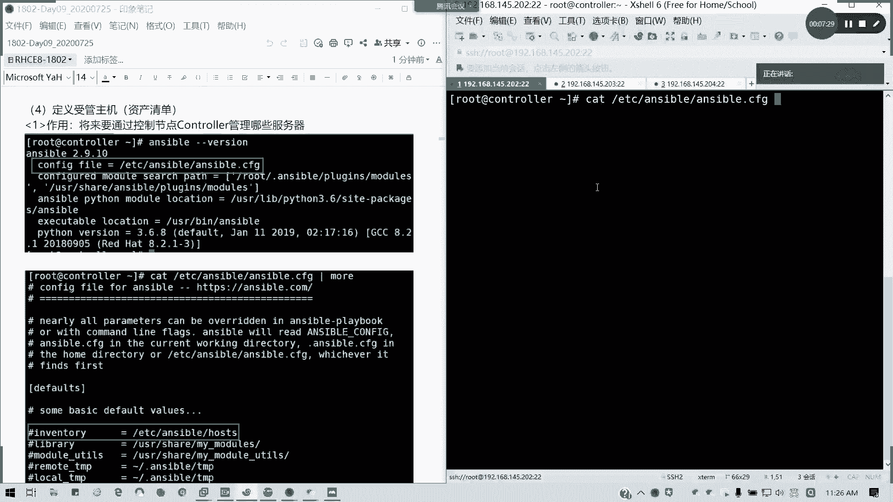

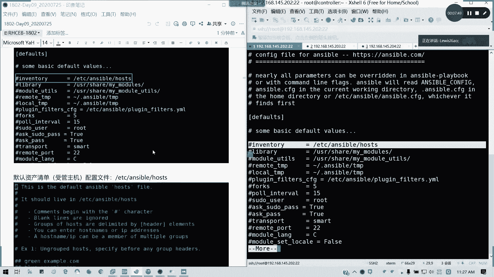

2.  **定义单个分组**：使用中括号 `[组名]` 定义一个组，下方列出属于该组的主机。
    ```
    [webservers]
    web1.example.com
    web2.example.com
    ```

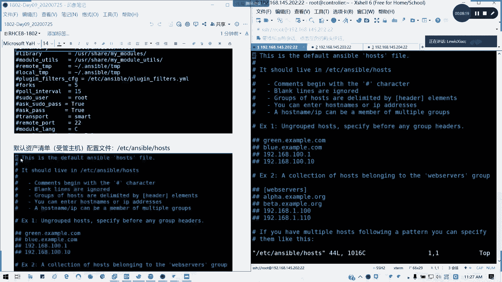

3.  **使用模式匹配简化定义**：对于有规律的主机名，可以使用数字范围或通配符。
    ```
    [webservers]
    web[01:06].example.com
    ```

## 实践：定义练习环境的主机

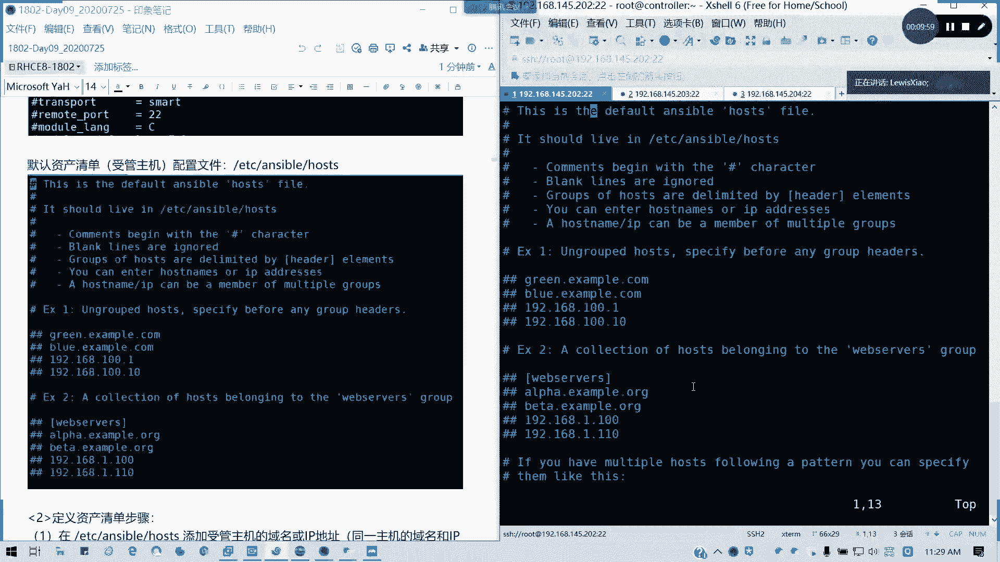

在我们的练习环境中，假设有两台受管主机：`node1` 和 `node2`。

我们需要在资产清单文件中进行定义。同时，为了能通过主机名进行解析，需要在控制节点的 `/etc/hosts` 文件中添加主机记录。

以下是配置步骤：

1.  编辑资产清单文件 `/etc/ansible/hosts`，添加主机定义。
    ```
    node1.lab.example.com
    node2 192.168.145.204
    ```
    **注意**：定义的方式（域名或IP）决定了后续调用的方式，必须保持一致。

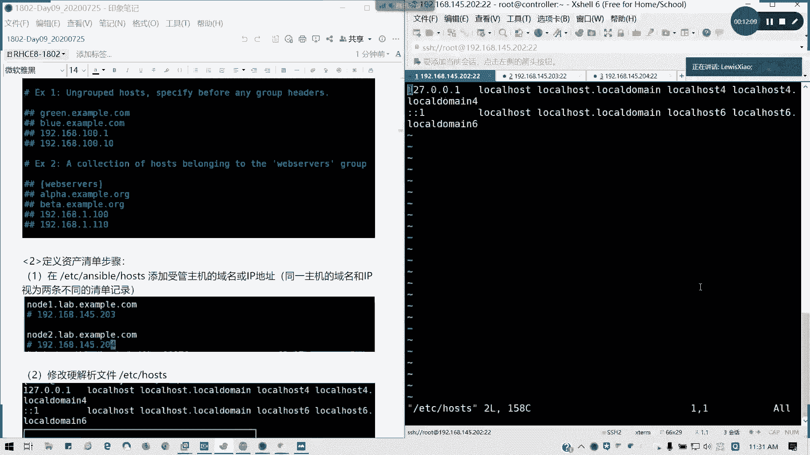

2.  编辑 `/etc/hosts` 文件，添加主机名解析记录。
    ```
    192.168.145.203 controller.lab.example.com controller
    192.168.145.203 node1.lab.example.com node1
    192.168.145.204 node2.lab.example.com node2
    ```

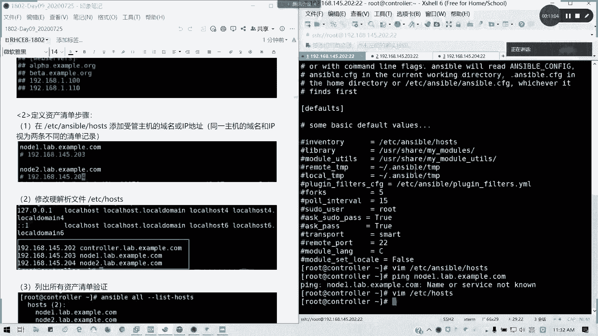

3.  使用 `ansible` 命令验证资产清单。
    ```bash
    ansible all --list-hosts
    ```

## 建立控制节点与受管主机的 SSH 免密认证

Ansible 通过 SSH 协议与受管主机通信。为了无需手动输入密码，需要在控制节点和受管主机之间建立 SSH 密钥对认证（即免密登录）。

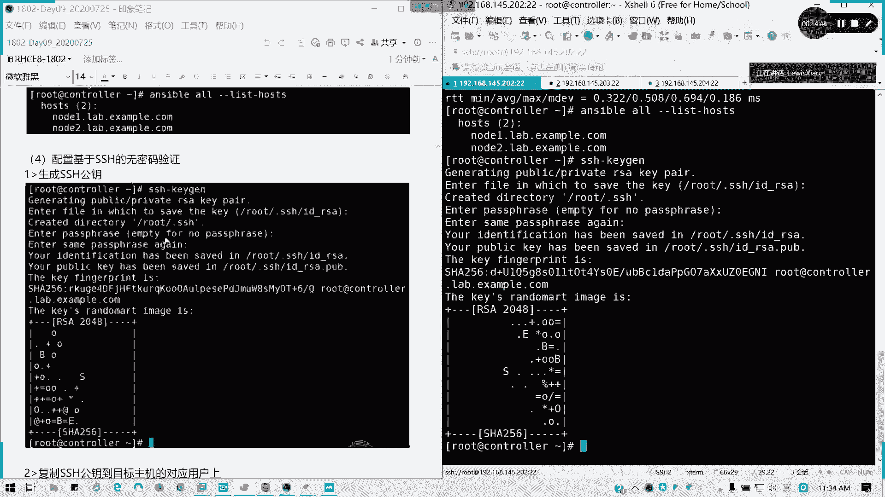

上一节我们定义了主机，本节中我们来看看如何与它们建立信任关系。

这相当于在指挥部和士兵之间建立可靠的通信渠道，之后才能顺利发号施令。

以下是建立 SSH 免密认证的步骤：

1.  **在控制节点生成 SSH 密钥对**（如果尚未生成）。
    ```bash
    ssh-keygen
    ```
    按回车接受默认选项。

2.  **将公钥复制到受管主机**。需要为每个用户（如 `root` 和 `student`）分别操作。
    ```bash
    # 以 root 用户身份复制到 node1
    ssh-copy-id root@node1.lab.example.com
    # 以 root 用户身份复制到 node2
    ssh-copy-id root@node2.lab.example.com
    # 切换到 student 用户并重复上述过程
    su - student
    ssh-keygen
    ssh-copy-id student@node1.lab.example.com
    ssh-copy-id student@node2.lab.example.com
    ```

3.  **测试连接**。建立免密认证后，可以测试 SSH 登录或使用 Ansible 的 `ping` 模块测试连通性。
    ```bash
    # 测试 SSH 登录
    ssh root@node1.lab.example.com
    # 使用 Ansible ping 模块
    ansible node1.lab.example.com -m ping
    ```

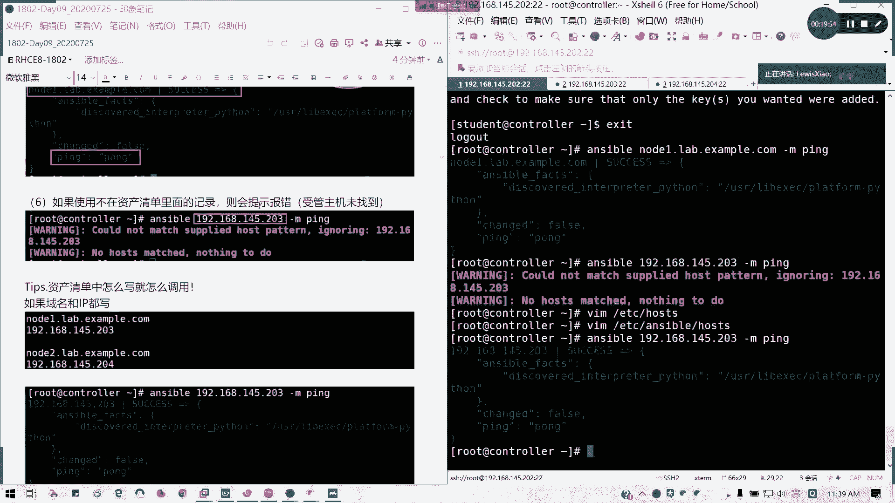

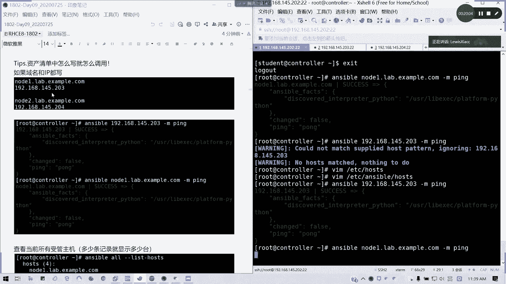

## 高级资产清单配置：分组与嵌套

合理地分组主机可以让我们更高效地管理不同角色或功能的服务器。

我们可以将主机划分为不同的组，例如 `webservers` 和 `dbservers`。

以下是定义分组的方法：

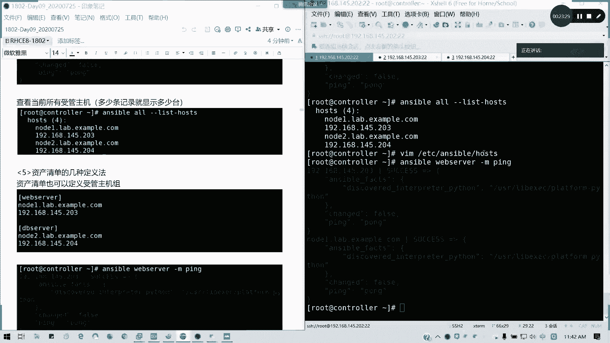

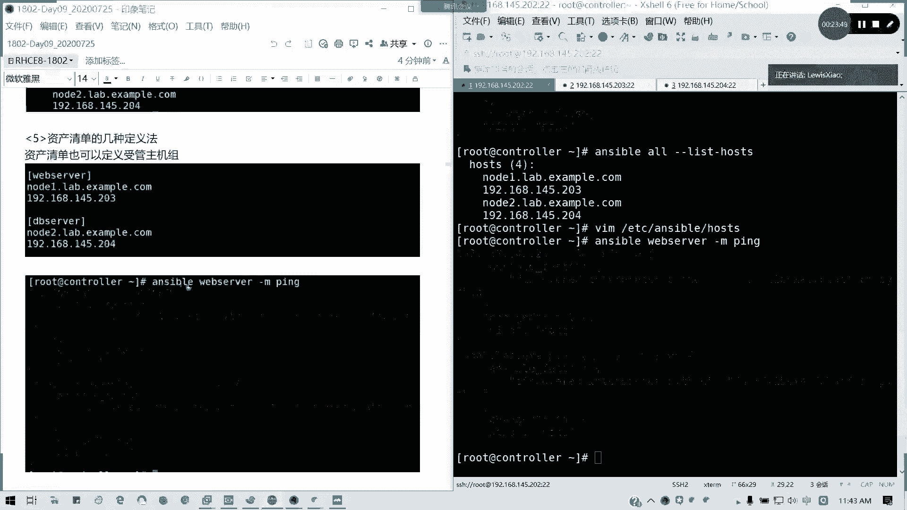

1.  **基础分组**：
    ```
    [webservers]
    node1.lab.example.com

    [dbservers]
    node2.lab.example.com
    ```
    定义后，可以使用组名来引用组内所有主机：`ansible webservers -m ping`。

2.  **使用模式匹配定义组**：
    ```
    [webservers]
    node[1:2].lab.example.com

    [dbservers]
    192.168.145.[203:204]
    ```

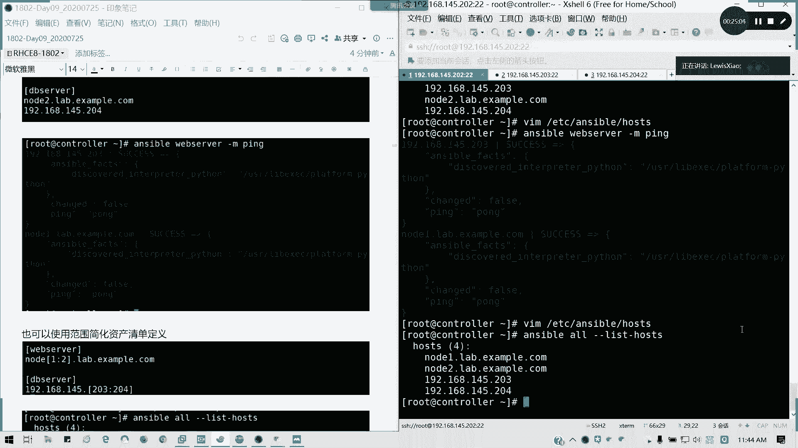

3.  **嵌套分组（父组与子组）**：可以创建包含其他组的父组，用于执行跨组操作。
    ```
    [webservers]
    node1.lab.example.com

    [dbservers]
    node2.lab.example.com

    [services:children]  # 定义父组 services，其成员是下面的子组
    webservers
    dbservers
    ```
    定义后，`services` 组包含了 `webservers` 和 `dbservers` 组中的所有主机。

## 总结

本节课中我们一起学习了 Ansible 资产清单的核心管理技能。

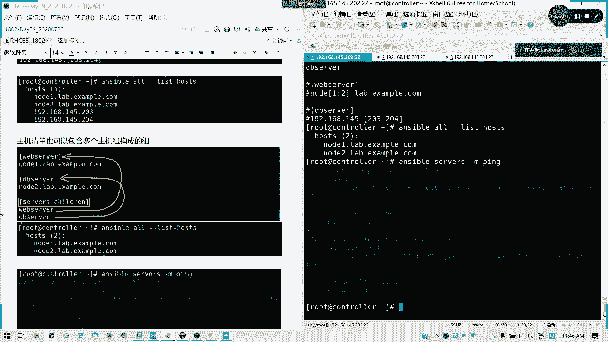

我们首先了解了资产清单文件的位置和基本语法，然后实践了如何定义主机并配置本地解析。接着，我们掌握了建立 SSH 免密认证这一关键步骤，这是 Ansible 自动化工作的基础。最后，我们学习了如何通过分组和嵌套分组来更有条理地组织受管主机，为后续编写和运行 Playbook 打下坚实基础。

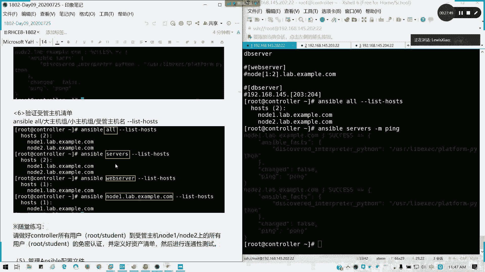

记住，在考试中部分配置可能已预先完成，但理解整个流程对于实际工作至关重要。