# 2021全新 RHCE8.0 红帽认证入门教程——可零基础入门学习【网络安全／Linux】 - P52：Day09_Ch02a_Ansible临时命令_文件模块 - IT老表哥 - BV1444y1h7Bx

好的，讲第二张临时命令，我们暂时先撇开啊，我反正穷穷啊，我了上课，我才要买这么高的哈。好了，第二张临时命令啊，临时命令我们了解一下第三部分啊。刚才我们讲配置下第三部分，临时命令，临时命令一个执行方式。

我们来看一下我们的。语法。ensible后面加上我们的主机，懂吧？就是我们的一个ho pattern，就是我们的资产切单里面定义的一个主机组。或者是你的具体的一个主机名或IP地址，懂我意思吧？

hose button。然后呢，杠M后面带我们的模块名模块其实就是我们的功能，好吧？相当于我们的一个命令，我们的一个命令，然后命令后面我带参数对吧？杠A带餐数值。然后后面如果我要特定的资产清单文件。

如果有多个的话，我们可以杠加杠I后面带我们的资产清单文件。但是通常说我们后面杠I是不用的啊，不需要的。比如说简单一个例子，我要在node一上创建个用户。

我们可以用user模块来实现user模块相当于user adduser modeuser在我们三条命令结合。懂我意思吗？普通命令啊，通命令结合。其实我们er我们可以简单理解，在学临时命令的时候。

我们把它转化为对应的需要命令，我们就可以理解了。然后初学的话，大家初学我们有几个参考途径啊，第一个我们的answible docanible它会有一内部有一个比较完善的一个英文啊。

英文的帮助人的考试可以参考练习完你可以参考啊，这个没问题，考试里面其实如果你真的不会用你ensable do都查一查，没有太多问题。第二个，我们平时用的考试，因为考试里面不给你上网啊。

我们有一个叫做docs点answible点com，也是英文的啊，就是anable documentation。

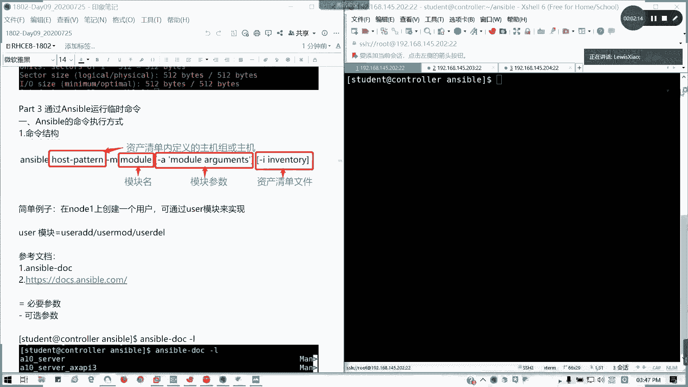

在这里可以查所有的。模块角色等等这些的一些信息全在这里可以看到。但这里我打我的网络比较慢，所以的话我就不再给大家看了啊。看一下能不能打开，哎呀，这里好慢，待会能打开再算吧，我们回到笔记来。看到没？

我们恩色波。

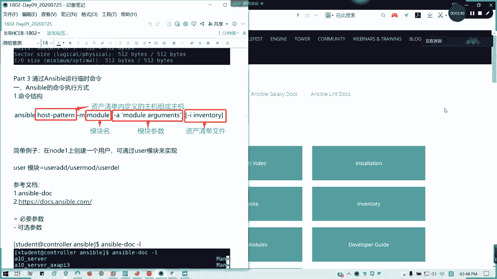

这个是吧anl projectan power ，an network等等这些galaxy它这一块呢很详细的很详细的帮我们啊帮我们理顺的啊。

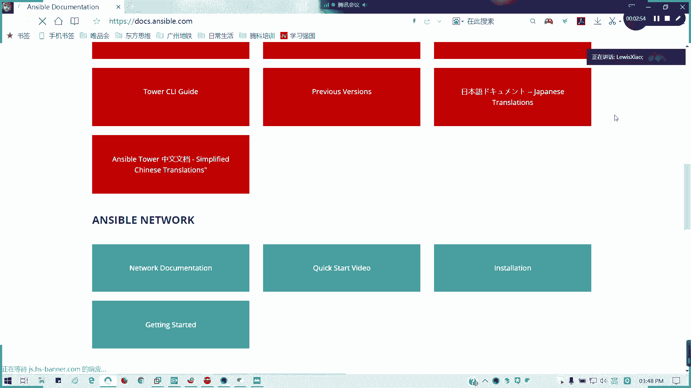

我刚拉起来，我截个图。这块就是我们安博的一个。文档中心。

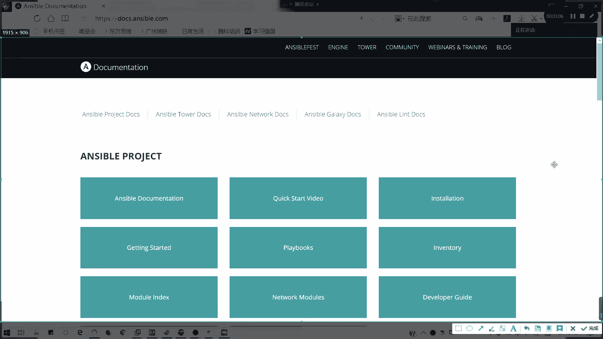

然后呢，我们主要这里我们来讲S for dog。哎，怎么倒口的？通常我们里面要注意的就是一个。可选参数跟必要参数。必要参数就是你运行这个参运行这个命令的时候，你一定要加的一个东西，对吧？可选的话。

可加可不加，根据我们的需求来。

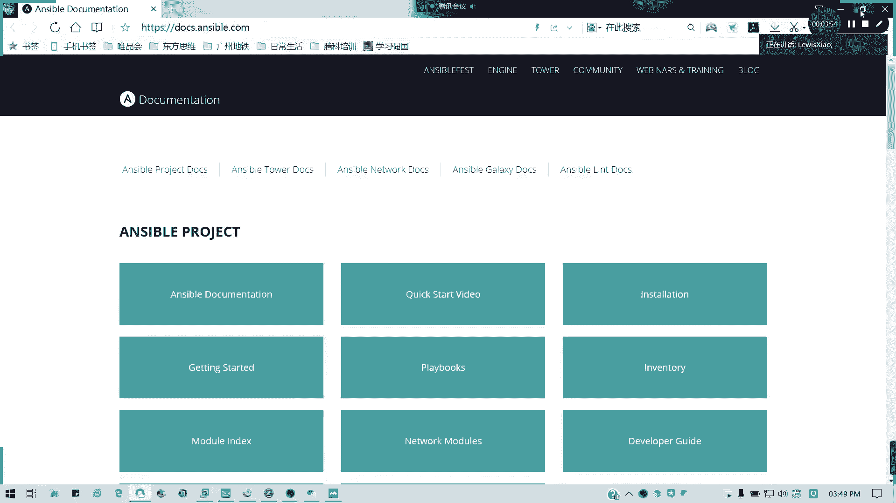

那我们现在来看一看，我们先来看一看N do。我们现在列出来它都有2800多个了。但L的话是列出它的列表。对吧它的列表就包括所有的像某一些模块等等。

包括它的内置模块已经达到2800多个包警Hwind h的语音都都有了，对不对？然后呢。我们通常我们更好的用法就是我们直接去查那个模块的参数。Anorible。

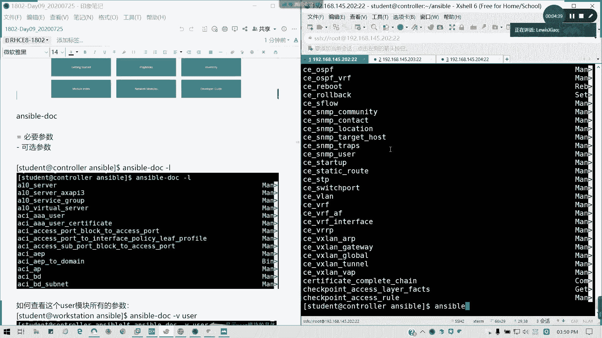

dock杠V，比如说我们 userer模块。

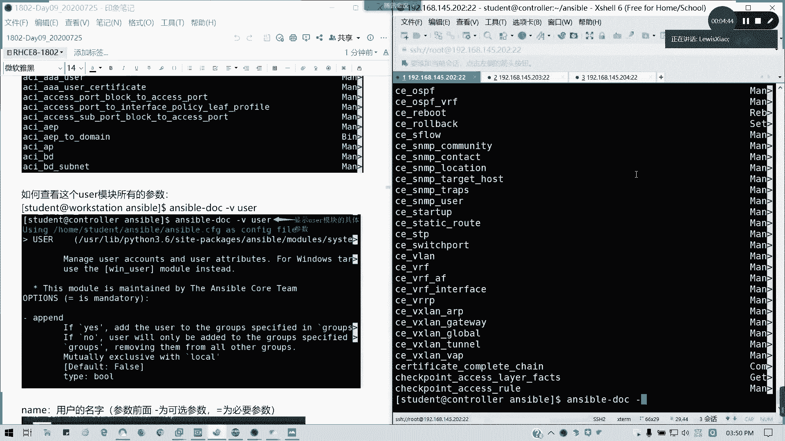

对吧user模块它前面它会列出这user模块，它的一个路径啊，它的模块的定义和路径在哪里？然后它的用途，然后它offtions对不对？就它的一个选项，也就是我们的参数。如果是像。

等于号的等于号是一个必要的。我们这也可以搜索，对不对？啊，我们像像我们的VI，我们的mo跟lesss，我们的我其实不是跟我们的lesss是一样的，好吧？它调用的一个文档。我们比如说我们看一下我们的内。

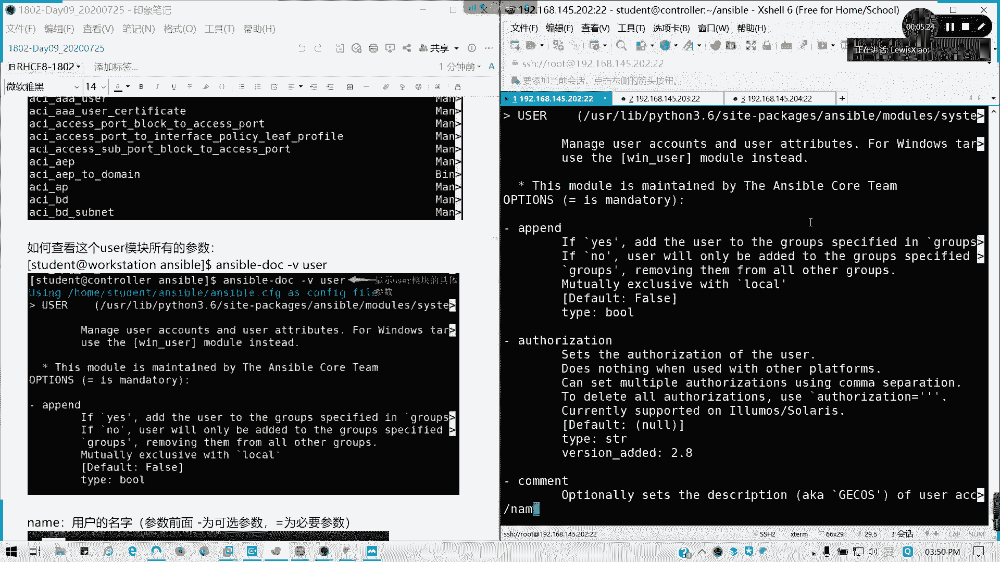

这里那的话是用户的名字，对不对？他这里已经有写了它的用法，然后别名alliaas is tous，对不对？

然后呢，它的type是一个字符串，然后看到它前面是等号没有？对问等号说明它这个模块里面这个选项一定要写。懂我意思吧？一定要写猫象。state我们做一下state么它的状态。state它默它有一个默认值。

然后它是一个布尔值，就是说这个用户这个账户存在与否啊，存在于否。然后它前面是一个减号，说明这个选项你可写可不写。懂我意思吧？因为它有个默认值。

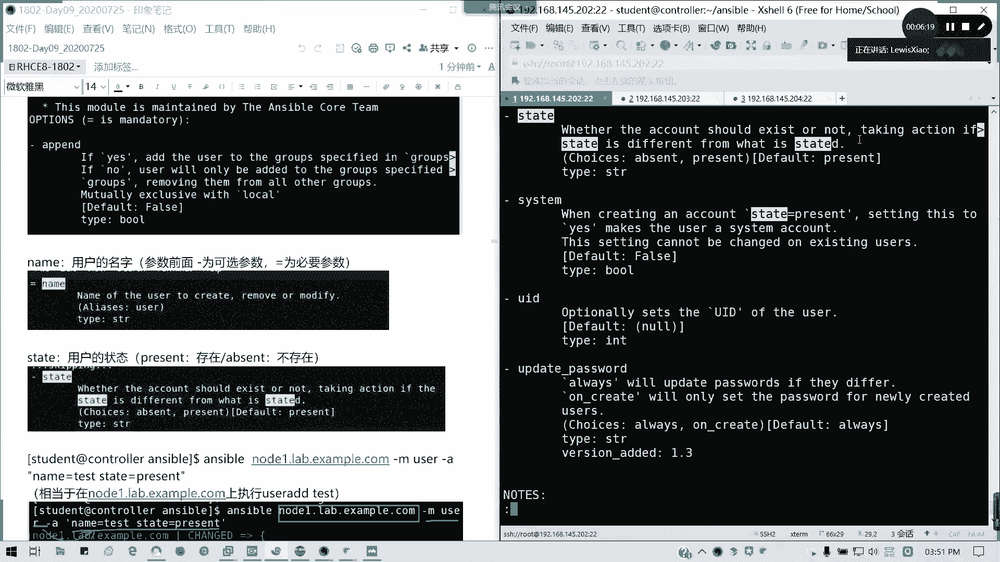

他这一些可写可不写的是有存在默认值的。懂我意思吗？就我们如何去看answerable do，懂我意思吗？这个你要去会学会去搜索啊，学会去搜索我们的那个answerable do的一个一些内容。

就考试的话，如果你忘了一个参数，或是拿到一个新的。新的一个选项，我们怎么。我们怎么写的话，就靠他了。如果真的一时半会忘记的话，我或者是我们不熟悉的话，我们可以通过他来帮我们，懂我意思吧？

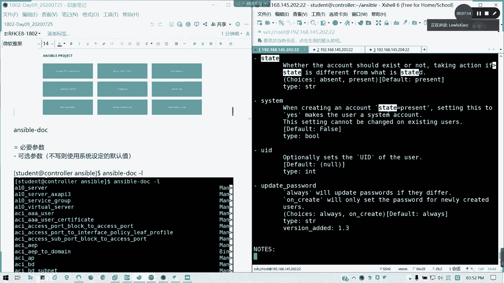

按Q退出。

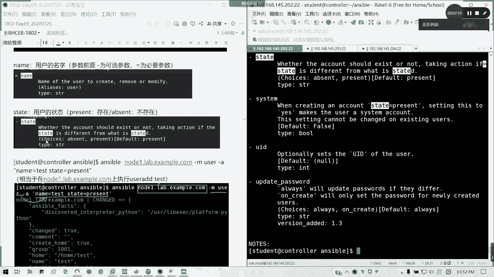

然后比如说像我们这里的话，我们。直接是吧。enssible我们运行格式给大家做一个示例啊，ansible node一点la点一赞或连com。杠A我用优色模块。A，我建一个ts用户。这里单双引号都可以。

但是我习惯用双引号。因为到时有些啊有些选项的值里面，有些参数的值里面是带有空格的那我们在选项空，我们在那个空，我们如果带这种情况的话，我们需要用单引号扣在里面。所以我们这里我们习惯用双引号。懂我意思吧？

像这里我们就创建一个用户。就相在我其实从我们一开始测试开始，其实我们就已经在用控制端在帮我们去发号设定了，懂我意思吗？那后这里的话我就在。我记得这里我就已经在那个。

我们的ser我我们通过它在弄你已经创建用户了。那我可以用临时命名验证，我就不用我就后面我这两台机我都可以关掉了，懂我意思吗？我后面或这两台机我就不用带连接，我直接在这里我用那个。需有用户都可以啊。

就通过临时命令来查看，对吧？因为我们现在我的我在控制端，我们就可以控制我其他剩余的我下面两台机器，那我何必要登录它呢，对不对？我用杠我用校有参数来直接来弄。对吧我直接执行1个ID。一样的结果，对不对？

所以先这个图就可以换掉了。

懂吗？懂我这条命令执行的意思了吧。直接在asom运行临时命令，然后我通调用shall参数去查看load一上面的ID是吧？V加D命令其实是是我已经执行过了？那说明这个我的用户是不是跟前面的是一样。

那这种状态呢就叫做密等性。ensible里面有一个非常重要概念叫密等性。什么叫密等性呢？当我们使用ensible去通过某个模块去完成某项工作的时候，就是判定我们当前的我们受管主机的一个状态。

是否达到处于S5的目标状态？就是说哎我让你完成个事情，我要达到什么效果，对不对？如果是如如果我我在做的时候，你已经是处于我的一个目标状态，也就是你已经达到我预期效果了。也就在我的预期里面了。

那我就不做任何修改。但如果不是就做相对应的修改，对吧？我叫你干什么？你现在没得没有这个条件，你达不到我状态。那好，我现在把我现在把命令推给你，你帮我完成了。好，你完成之后达到目标状态了。

那就他就返回一个chren，也就是它改变的一个东西。已经它的状态发生了改变，也就是完成了我们所下发的一些任务是吧？就通过剧本或角色或者临时命令来下发，懂我意思吗？幂等性。可以听得懂吗？听明白吗？

有问题可以随时提问啊。所以对比一下啊，我刚才创建了一个用户，创建完之后。

我现在我还是创建一个啊。同样的一个用户，那是不是他原来劝，他现在就变成success，对不对？就是我命令下发成功，但是我的range的是否状态发生了改变。这里就变成foralse了，懂吧？

因为我已经达到你所要，我我受管阻机，我已经做完你是你要求的事情了，那我就不会发生任何的改变了。因为因为正常说我们操作是不是已经操作完，那那我再进行一个重复操作，是不是多此一举啊？对不对？

那就不再进行任何的改变了，懂我意思吗？这个懂了吧。

然后接下来我们要讲自带的管理模块，这个会想比较长时间。自带的管理模块包含哪些呢？文件模块、软件包模块，这只是常用的啊，我不会全部讲有些模块可能我们在后面会提到。

这里有包含文件模块、软件包模块、系统模块以及网络工具模块。重点我们会讲文件模块里面的所有软件包模块，我们只讲样。跟一个软件仓库叫做y repository，其他你们自己看啊。

其他你用as do去看去用就可以了。其他我们不会用，不会不会说。然后呢，系统模块会讲到我们的防火墙服务以及用户。net tools模块呢？只讲下载getUIL为什么网络不讲呢？因为网络的话。

我们试验过它的功能确实比单独的MSUI还要弱级，对吧？不使用。所以的话我们这一块我们就暂时先不讲它。

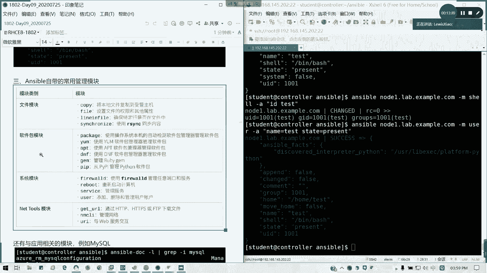

不讲他没有关系。当然它还有一个应用相关模块。比如说我里面my circleql的话也有一堆是吧？就有时候跟应用相关的，像我们的我们的那个windowsage是吧？ageure这些刚才我们看到像A10。

我们的负载均衡。

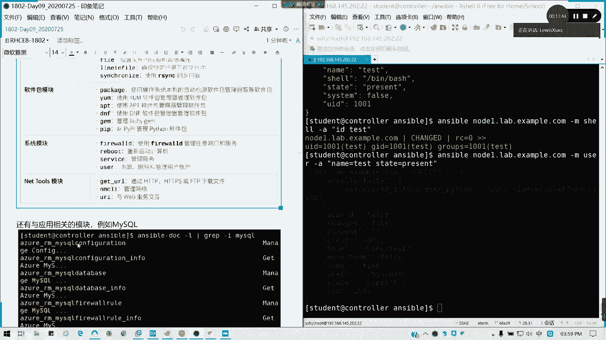

都有的对吧？所以的话其实它里面2800多个模块。现在新版本估计有超3000个了，因为新版本8。2我没去看啊，8。0的话已经是2800了。所以的话其实它的那个里面自带的模块已经非常强大。

但是我们只需要掌握里面几个或者是十来个，我们需要用到的一些东西。首先我们讲文件模块，讲完我们休息一下文件模块，这个要讲比较长的时间。首先我们copy模块看一看。

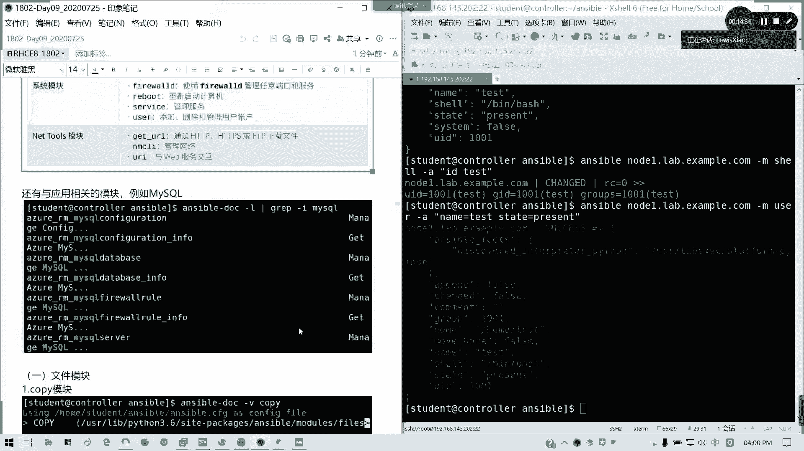

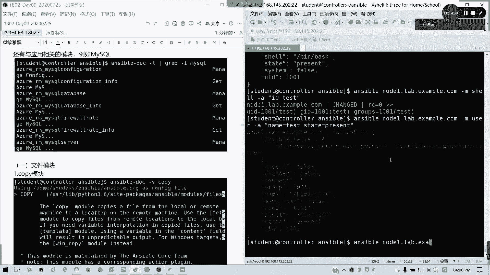

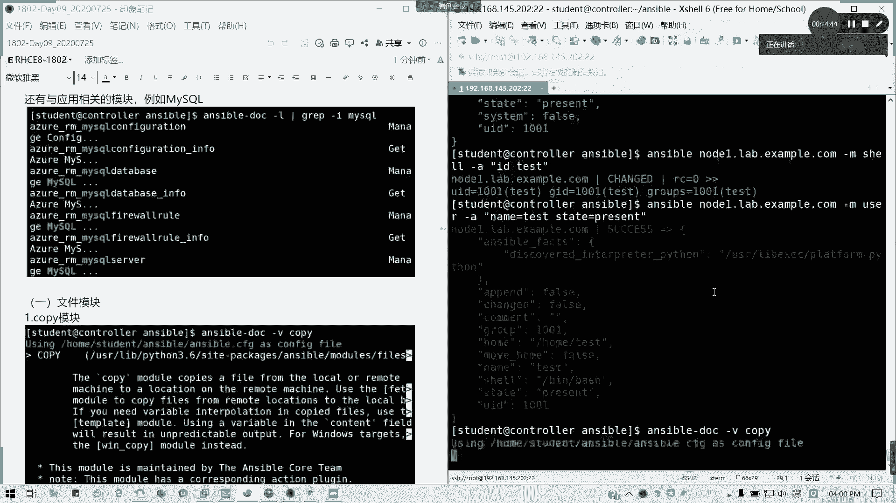

copy模块呢它是用于。将一个文件从。本地也就是我们的控制节点，或者是我们的受管主机复制到我们的远程机器，也就是我们受管主机上。然后他可以就是说如果反过来用fsh的话，它是可以将文件复制回来的啊。

就是说从远端复制到我们社官主机上。我们某我们的控制主机节点上，我们是用fsh待会会讲。然后如果啊。有很多人就他有那些啊需要变量。对吧需要变量替换的话，我们用tempate的。

那个模块tempate我们后面再讲，然后。如果呢用content啊，就如果我们在content里面用一些变量，可能会导致一些不可预料的一些输出。然后如果。是怎么使用windows系统。

就是远程是windows系统的话，我们是需要win用win copy去替换掉啊，替换掉它。这里的话我们。他这个模块呢是ensible call teamensible核新团队去开发的啊。然后呢。

我们讲常用参数。常用参数我们讲一个啊。第一个sourcece SRC。SRRC的。

SRC是本地的一个原路径，也就是我们控制节点的原路径。啊，若原路原路径，它可以是绝对路径或相对路径啊。可以是绝对或相对，他已经说了，我按N回去啊，绝对三键。如果是它是目录的话，那它是一个递归复制啊。

如果这样的话，我们要在那个路径表我面加一个加个斜杠啊，加个斜杠。就是说里面的内容他才会复制到目标，否则呢。他会将自己还有所有内容复制过去。这这个是跟那个跟我们的一个叫阿ec参数，阿ec命令是类似的。

它默认是空白啊，它的那个type它的类型，我们输入的这个它的值的类型是一个路径啊，路径。但这个参数不是必须的。因为我们还有一个另外的一个共法，就是直接在我们的授管主机上目标主机生成文件内容。

也就是我们的content。content它是只用于直接。在我们售款主机生成文件内容，也就是不做复制，直接生成啊。现当我们在这上面paushe一个文件。然后呢，就相当于我们的平常就touch啊。然后呢。

destination这个是必要选项，就是宿管主机。我这个文件要存在哪里，或者是说我这个文件我要复制到哪去，那这个路径是必须的吧。对吧。thetation我 copypy是不是要有目标啊，没目标。

我怎么复制嘛，对吧？然后呢，接下来还有一些参数，就比如说它的。modode文件权限，我们的文件读读写执行，对吧？有没有SUIDSUID等等。然后它的文件属组，它的所有者是谁？它的所属的组是哪一个？

然后它的文件是安全上下文类型，对吧？特别是如果说网页文件是不是我们这样我们之前我在上天上一天是不是就讲到那个HTPD下划线下划线cont下划线T对不对？我们就这种文件类型HTTPD系统内容类型，然后呢。

我们还有一个back up，就在附文件覆盖，特别是你有那个新的文件生成之后之后呢，它在复制之前会不会帮你生成一个备份？我们主要是讲这么多参数，这么多参数是啊我们不多说，我们来看例子，看例子我们最实在了。

好吧。

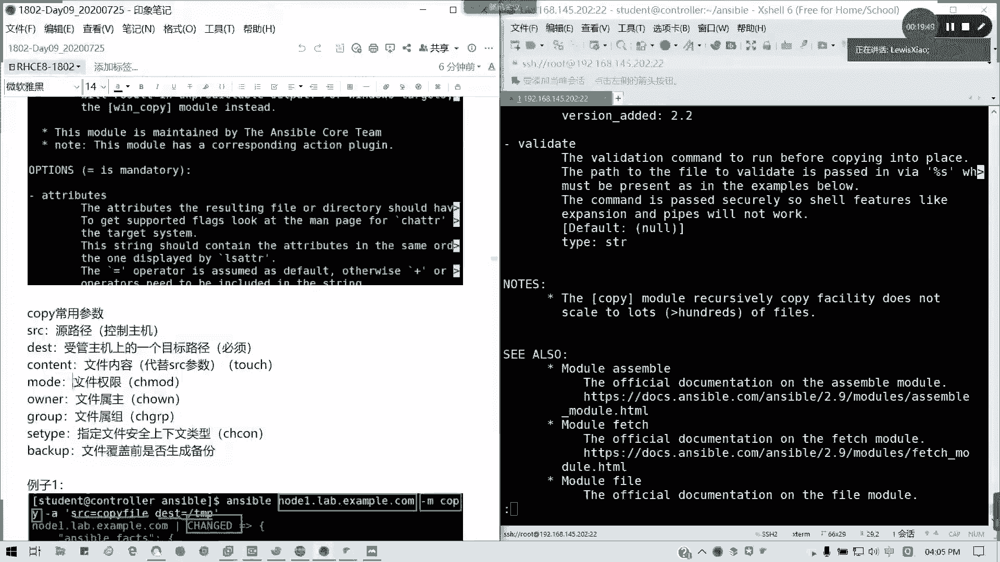

例子一，我们在n下面n一。直接付我们生成一个叫toppy find的文件。我们我们在s我们这个目录，我们生成一个叫copy find的文件。

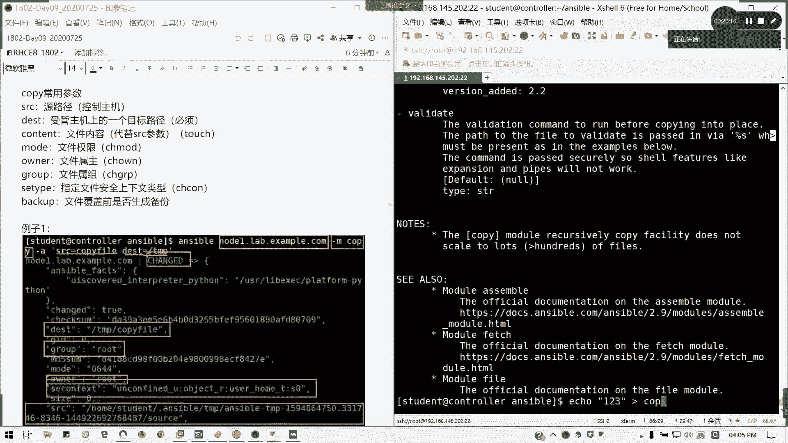

对吧我们生成一个叫copy犯什文件。那我们现在用ensible临时命令，我们复制到目标我们的node一下面的1个TMP目录下，可以吗？

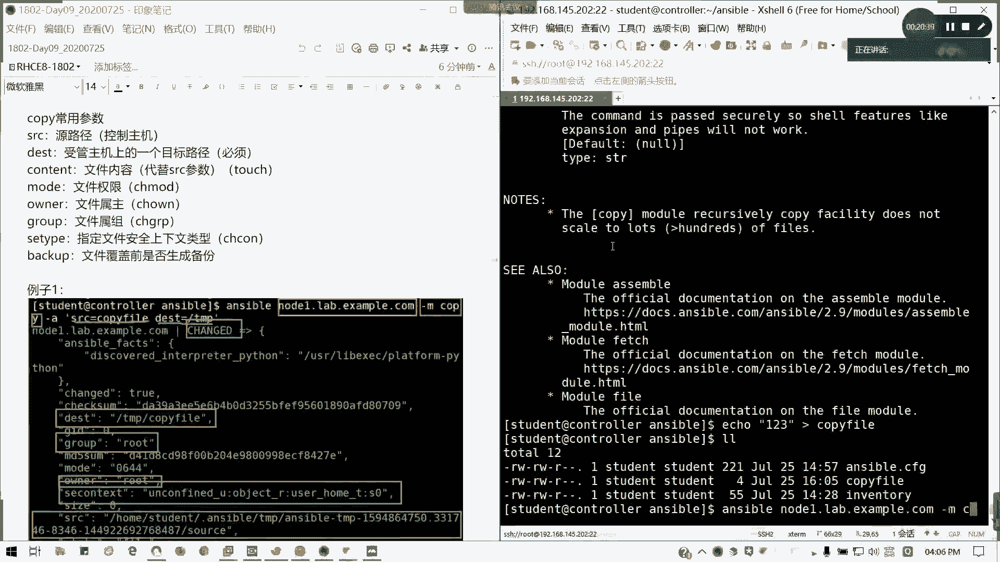

copy参数copy模块杠A参数，我们写这里写的是sourcece SRC。我们这里写的相对路径啊。Destination， TNP。

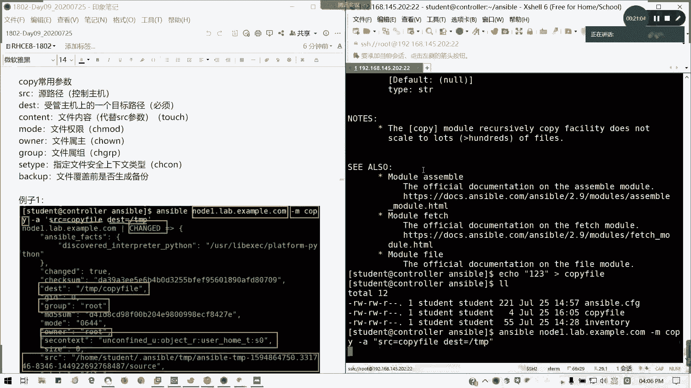

看到没有？它已经啊已经算发生改变，而且它的那个文件已经复制了过去啊。sourcece它是一个临时的。临时的一个文件复制过去了。

然后它的类型是这个包括我们权限波文组组UIDUID以及在文件档上都有显示出来。那么其实验我们可以手动的去验证。对为我们列出来的内容的话，这里啊我们需要的话是不能用那个。别名的啊都不能用我们别名的。

所以说我们用回原本的命令叫LF杠L长串输出。看到没有？我们刚才16点06分是吧，我们复制一个文件过去，看到没？可以吧。这是粒子音。例子2，我直接生成文件面的内容，我又不用source参数。

我用contact参数。这里我用双引号啊，因为里面有一个单引号的我们叫ts copy，然后后面加个换行符。然后我们生成为叫TMPF1。如果不加换行符呢，它就会跟在后面了，就就在当你显示的时候。

你会跟在后面，它没有换行，懂我意思吗？就以这里我们通常会习惯像加换行服。那我们可以我们可以看一下，看一下TMP的F一看有没有生成。有吧。对吧？直接生成一个文件，这是例子。2。例子。3。

我们可以啊设定它的就直接生成文件的时候，我们可以生成就设定它的文字，就它的属组，它的属性啊。我我可以生成以seud的用户来。对吧它这里也有提示说啊，它会持它会返回我们的anible事实。

也就是我们受管主机运行的一个目标状态，懂我意思吗？它下面显示，然后我们可以自己手动去验证，没有太大问题啊。UID它也是1000的对吧？它UID1000因为是用stu用户来做。然后呢。

我们可以指定它的安全上下文类型。我们这权限改，比如说改为755。然后后面加上SEtype。短约。对吧也它的上下类型已经发生了更改。TMPF3。然后我们用LS杠LZ。对吧。发生更改逆子五我们可以来。

🎼看一下备份啊，我们现在cat copypy一。我们把t copypy一的内容换一下，然后KPF1。但是我后面加样一个back up等于yes。它会生成一个back up文件。

back up file是吧？10后面是1个F1，然后进程进程号，然后后面是1个20200715，这是一个日期，对不对？我们就用FECC就可以查出来了。对吧它有一个新的文件是16点11分。

然后跟我们刚才16点08分是不是升成1个生成1个F一，对不对？懂我意思吗？这个模块有问题请提问，没问题，请打字母句。

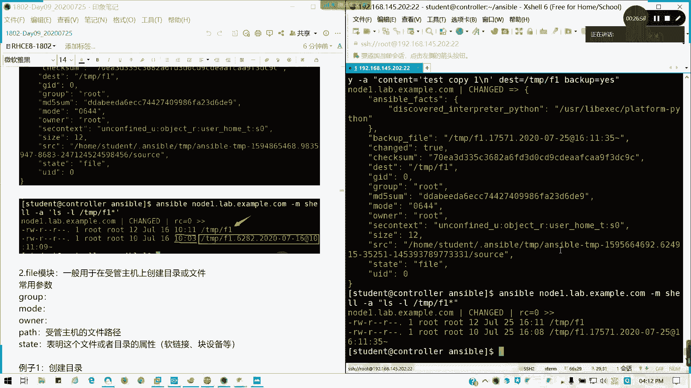

刚讲完一个copy模块啊。有问题可以提问。讲模块相当于就是讲命令了。好，这个是cooffpy模块，我们再讲一个方译模块，我们休息一下。方案模块呢主要是用于在授管主机上面创建目录或文件。

刚它是用于复制跟职业生成。那现在的话就是一个在授管主机上我们创建啊。它有常见参数，有group mode honorpass的它这里有个。pass就是我们受管主机的一个文件路径。

我要创建的文件跟目目录的路径在哪里？然后state是表明它这个文件或者是目录的一个属性。我们来看一下例子。我要在note音上面创建一个目录，叫tap DRE。我们这里改一下啊。杠F file。然后呢。

杠A啊，我们的用fire这个参数，用我们这一块这个模块参数。首先我们的首当其冲pass。路径我要创建哪TNP里面DNRE。然后我要声明，我要创建这个东西是个目录。fi state等于directy。

然后我的属主是student。他的所所啊所所属的组别是student。他的modode是755。那我的SC6类型同样是HTTBD。sscont杠题。他已经帮我们创建完一个目录了，然后然后大小是六字节。

那我们现在可以去看一下我们的目录在不在LS杠LZD。这目录是不是已经创建完了，对不对？他是一个第一，是不是打瑞特韦啊？我们的目录，然后它的上下文是不是按照我们设定的来，然后他的那个student是吧？

它的大小是六字节。都跟我们上面返回的一个安叫安什ible事实相对应。懂意思吧？这是第一个例子。第二个例子，我们来创建个文件。我们就把它这个TMP一，它我们改成fin一。

但是注意我们的文件类型不我们的类型不是fin，我们叫touch。用fi我们导致什么结果呢？我们可以看一看啊。其他我们选项不变。能创建个空文件。它的size是0。那为什么不能用state等于file呢？

比如说我要创建一个新的文件，我stay to fire会出现什么样问题呢？Stay file呢它会报错，就是说你的文件不存在，你不能继续了。懂吗？所以的话我们创建空文件，我们要touch，懂我意思吧？

在我们的常用参数不带有stay等于叉叉叉的时候，我们要自己改变这个文件和mod录的一个属性。这个是我们要提示给大家。第三个，我们要创建一个链接文件。我们说到软硬链接啊，这里我们就分别做一个示例。

我们现在方案一文件已经存已经存在。那我们现在。我们创这个软链接link。我们我们设定我们假定我们创建fire2是fi一的软链接。哎，为什么不行呢？哦，我两个pass不，我ss啊，我源头TMP是范一。

写错了啊，只要pass是pass是我们的生成的一个目标，目标是fire2。然后呢，我们可以看一下LOS。

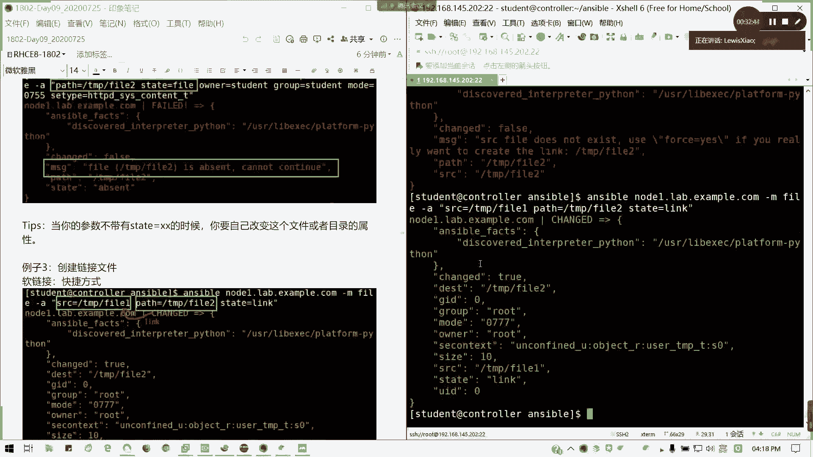

战LTNPfi2。哎，我我打papa3干什么？

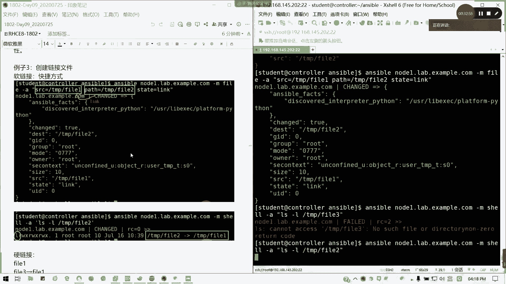

它返回个值是吧？它这里是不是一个软件接啊，读写执行都有，然后它是L，对不对？然后我创建个fi尔3是范尔一的硬链接，也就是像一个相指向相同的Io值。我们之前讲过。

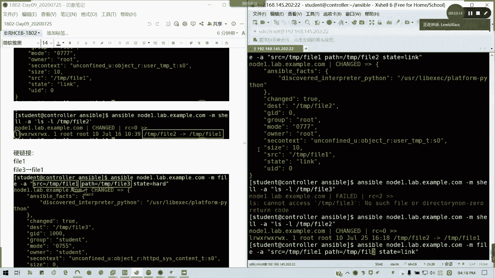

对吧那这是它的它是一个硬链贴，也就像它是指向一个相同的i know值。

它这按note时，我们再看一下我们的发3。

他是一个。硬链接属于普通文件，对不对？这应该懂了啊。所以我们看一下用LI，我们的io显示io编号就非常清楚了。它是同样指向的一个Io那说明这这一面接没跑了。懂我意思吧？可以懂吗？

那后接下来啊这个如果明白的话，请打H。我们的文件的话就讲到这儿。明白，请打A去。然后我们刚才讲到copy，我们有顺便提到一个叫做fetch。flash模块呢就从受管主机上我们拉文件到控制节点，常见参数。

一个是destination，一个sourcece，对吧？还有一个flat。diation呢就是控制节点的一个保存路径。sourcece呢就是我们受管节你要拉取文件的一个路径啊，原路径一个是目标。

一个是原。然后最后一个ft是直接保存的目标或路径，而不是存在于受管主机名下的文件路径。我们来看一下例子。我们把受我们把受管主机note一里面的TMP find英我们拉回来。

拉到home student S5目录下面。我们看到它是已经保存到我们的那个。主机名命名的，然后它是一个绝对路径，对不对？就后面他会带我们的那一个。做管主系这个目标路径，懂我意思吧？可以明白吗？

它的拉取如果不带这不带那个ft等y的话，它就会带带上我们的那个受管主机的一个个主机名的文件夹。然后它下面的一个路径，懂我意思吗？如果就是说我不加ft，yes就是这样。他是不是也也有个node一？对不对？

然后我如果加我要确定具体的保存位置，比如说我这里我要保存一个发一，然后我后面加一个ft。等于yes。对吧他就直接保存到这个目录这个文件了，这个文件就直接保存在这个这个路径下了，它就不会再创建了。

不会再保存在我们这里了。懂我意思吗？可以懂不？拉取文件就讲这么多，如果没问题，请打I。好，打爱之后我们稍微休息一下，稍后我们在35分或4分钟我们讲。接下来的line in fire，还有一个。

Ithink啊I think模块就讲这两个。然后我们还有个练习给大家稍作休息，稍后继续。好的，我们就休息一片刻之后呢，我们继续讲我们的文件模块。文件模块还有两个，一个是。L in fire。

对吧一个lineing file，一个是schronize同步啊。首先我们来看一下line in file。lineing file呢主要是用来以行单位为单位做流式处理，来修改我们文件的内容啊。

修改我们文件内容，注意它是以行为单位，它是按行为处理，不是按字符来处理的啊。好，我们看到它的一个模块是也是在s package里面啊，python3。6。

所以更加证明它我们的S5工具是基于python去开发的，对吧？好，我们来看一看它的一个常见参数。常见参数有几个，一个是back up。在若文件更新的时候，创建备份的一个副本。

in在指定的位置下一行插入我们需要的内容in before呢是在上一行去插入line呢是按行写入我修改后的内容，就是修改后，我到底要要加什么内容呢？

请在line里面写正则表达式regular expressionREGEXP。IGEP啊。IGSP的话，它是通过正则表达式正则表达式啊。哦，抱歉。好了好了，我们刚才有两分钟的空白啊，6分分钟的空白。

我刚才没有那个。刚才没有那个开声音，我们接下来会把听到声音了吧？各位。刚才没有开车啊。okK了啊，谢谢刘宇香的提醒啊。我们接下来会把两个呃我把我们会把lineing five会和sle讲完。

我们会有一个随堂练习。😊，随堂练习啊，各哥随堂练习，我们来看一看lineing five模块。lineing file模块呢增加和修改文件内容，它是以行为单位做一个流式处理。流逝处理啊，然后呢。

我们看到它是以python啊，以pyython作为一个。它是在放在python模块，python的库里面的一个ensible的模块，所以更加印证了我们s是用python开发开发的一个自动化工具。

我们常见参数看一下，首先back up若文件更新时候创建备份副本，也就是跟我们刚才的放一样，我们的copy一样。是不是它会创建一个副本，就在修改之前修改之生效前，它会复制个副本啊。然后呢。

接下来我们的iner after inserter after inserter插入in在后面插入啊，后面的话它因为它是以行作为流失处理。

所以的话是它是在指定位置的下一行进行插入inser before在上一行插入，然后我要抄什么内容呢？修改后的内容在line里面line的参数进行写啊，里面写，然后呢。我们如何去定位这个位置。

我们用regular expression啊，我们的正则表达式，我们之前是不是是友已经学过正则表达式，我们可以类似的通过regular expression，我们得参数名叫REGEXP进行我们的定位。

然后pass我们是不是我们要对文件进行流失处理。那文件的话，我们是要是不是要知道我们的文件的路径啊？对吧。我们文件路径。然后呢。还有啊。还有它的state，它的文件修改状态到底是生效呢，还是失效呢？

对不对？移除失效或添加生效啊，这一个的话我们是需要注意的。常见模块就讲这么多，我们直接按例子来看。假设前提我们先实现一下。将我们控制节点的。控制节点的ETCScon这个文件呢，我们复制到我们的售管主机。

我们复制我们的受管主机node一点lab点ex example点com，然后另存为。tap目录下面的SElinux。文件。我先复制一个文件出来先。这怎么写的吧。这样写还记得吗？

我们刚才讲我们刚刚讲过的一个copy模块。整copy模块好回车。然后呢，我们来看一看啊，我这文件存在。那我们因为为什么为要复制出来呢？要复制出来的目的就是因为这个是个系统文件，对不对？

那所以不要乱去修改，不要直接在原位置去修改这个文件啊。所以的话我建议大家直接去。哎，就直接复直复制出来，然后我们做例子就算了。好吧，那接下来我们。验证我们就验证验证一下。啊，哎，我看一下有问题啊。

复制有问题啊。S宝。杠M copypy，我看下ETC哦，哎，我打错了，抱歉啊。对对对，好了，复制完成复制完成之后呢，我们来看一下这个文件到底存不存在。我们看一下这个文件存不存在啊。我来看看。

Anerible。node一点let点点com，然后呢杠A。Sure。杠A我们ca。对吧。这文件它的内容都知道吧，SE型for型对不对？好了，那我们现在我们要那个修改它的文件内容。我们修改文件呢。

我们考虑两个部分。第一个我的文件要修改哪里？第二个我要修改成什么内容，那行，我们来做一个例子。第一个我们修改SElinux开头的一个行，将它的内容更新为diable，就相当于我们改这个S的配置。

有没问题，我来写一下。An色ible。note一是吧，杠M。呃，lying fire我们的模块lying fire。杠A。它的参数啊，首先我们的文件是TMP里面的SAlinux。然后呢。

我们的定位我们是要将SD6开头的行，我们要进行一个修改，对不对？SE定先开头修改呢，我们就按你里面输一个引号啊，然后开头是不是上千括号，对不对？然后SElinux。等于对吧。他我们作为一个定位啦。那好。

line我们要修改什么内容呢？最要成什么内容？SElinux等于diable。🎼好，我们就修改成这个内容。然后呢，我们敲面加个双引号回车。它这里已经提示了啊，劝阻我们已经的状态发生改变。

而且这行已经被替换。那么看一下，再看一下这个文件。是不是改了？对不对？它是以行为单位做一个流式处理，懂吗？能明白吗？这个例子。替换的啊，然后呢。好，这个是第一个例子。第二个我们增加文件内容。

我们要考虑个一两个问题，一个是增我要增加什么内容？第二个。我要增加在每个位置，上一行还是下一行。那我们现在这样我们来加一个注释，好不好？在SD6子开头行，我加一个注释，并且应为生效。我们把ra。

regular expression我们改成iner after。我们在下一行插入，懂吧？它的定位是SE开头行，在下一行出插入。然后line我就写一个叫做diable的SEin。我叫井号是加注释。好。

回车。是吧。chrange值等于处，然后line。Add是吧？我的行已经被添加了。那我们再看一下这个文件，我们此时再看一下它。说在这里我已经加了一行注释了，懂吗？可以看到变化吗？然后往前加就是。

in the before啊in the before这个我就不再演示了，这是第二个。第三个，我们来讲如何删除文件内容，删除文件内容。我们来看一看，删除就是把我们的例子就把这一行去去掉。那我们直接。第。

正则表达式进行定位。我定位就是以。两个井号DISA开头的一个行，然后我们的state。等于F就可以了。one它找到一行，然后one lines remove。我们再看一下。这行是不是不见了？懂吗？

然后还有一个备份文件，就刚才我加这一个文件的一个行。我用银色be吧。然后呢，我加一行之后，我要加一个back up等于yes。然后state等于present。而且他还会帮我们备份一个文件。

在这里一个进程号，然后后面是日期，然后我们看一下。我们先看一下文件内容。然后呢，我们看一下这个文件。对吧。啊，不是ETC啊，是TMP。是不是有一个备份文件在了，我刚改了。对不对？好，这一块如果没问题。

请打字母勾啊J。like in five这个问题请打字母J。然后呢，我们接下来我们会讲一个叫schroize同步模块。同步模块呢相当我们以前的叫asthink，我们有讲过了，叫asthink。

啊think呢我们来看一下长景参数，一个相一个控制节的源路径，我们就用相对路径就可以了。然后destination是受管主机的一个目标路径。对吧然后还有delete的话，这个是同步完之后。

我的目标不存在，就删除目标但这个比较少用啊。我们来看一下我们的例子啊。比如说我要把那个。t这文件我要同步到去，其实跟我们的复制差不多的。no answer临时命令。synralize啊，自己手打。

我要复制到目标的home student同步过去。成功了成功的话，他这己用usthink去做的，然后用熟度的方法，对不对？然后呢，注意啊，它授权主义remouser对我们的dedestination。

我们所指定的路径必须要写权限，否则它写不进去了。然后在我们看一下LS杠L就知道了。对吧我们有的太s，这文件在了，对吧？然后如果是deele的yes呢，这个会同，就相当于我会加一个参数。

如果后面如果这个文件不存在，它会删除，然后记得要加一个rerusive。Recursive等yes。汝瓜哈。这国创建一个testno cycle才行。这个如果是后面啊后面如果这文件不同步。

就不同步的时候，我们会删除。但这个我们暂时试不出来。所以的话我就做一个例子给大家啊，这些参数其实我们可以通过ensible do可以去做一个做做一个查看啊。好，我们讲这么多，把文件模块已经讲完。

现在大家做一个随堂练习。带给大家。15分钟到20分钟时间做一个随堂练习，好吧，随练习在另外一次我们临时命令完成以下要求啊，在node一上面创建一个d off。它的那个左主组是d ups。

然后我们这里的话建议啊建议。创建一个用户。大bo。此处啊，建议创建对用户带box。然后权限我已经行列明了，所有者还有特殊权限以及我符号链接以及它的一些内容啊。这也可以利用它做一下内容。如果刚才明白的话。

可以打一下。字母K啊，如果刚才这块明白的话，打一下字母K。这个练习提供给大家，然，我们稍作休息，稍后继续测讲软件包模块。

