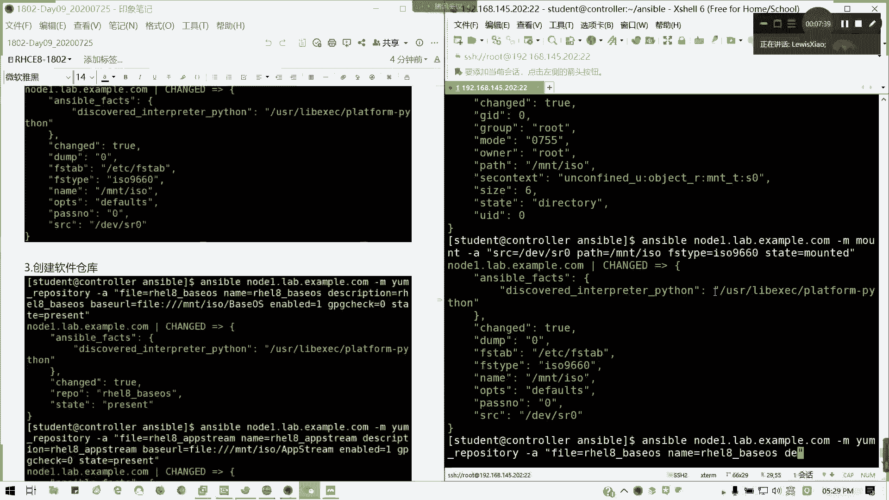
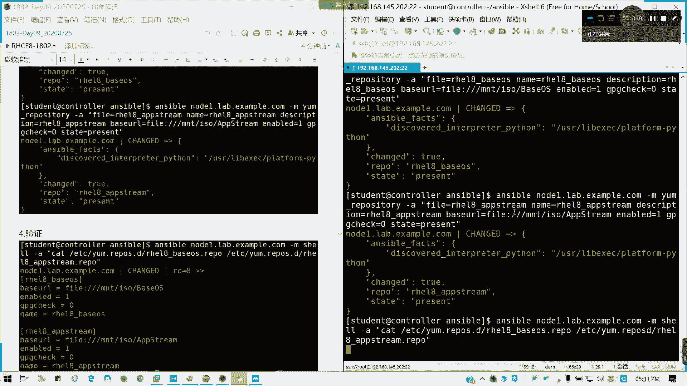

# 2021全新 RHCE8.0 红帽认证入门教程——可零基础入门学习【网络安全／Linux】 - P53：Day09_Ch02b_Ansible临时命令_软件包模 - IT老表哥 - BV1444y1h7Bx

来，我们来看一下软件包模块。软件包模块它的一个主要作用呢就是安装或者卸载软件包。前提是软件仓库肯定要存在的，对不对？

所仓仓股肯定要存在，然后呢。重点讲起一个东西啊，软件仓库yngreitory这一个我们考试里面会有考的啊。考试里面会有考的。好。这个是软件仓库模块。好呃，我们的手我们手动方法是不是直接在ETC。

然后样点report点D里面，然后建一个叉叉叉点report这文件，这这名字不是可以自己定义的，对不对？这个没有问题啊，但是我们现在到了ensible，那我们不可能啊，每台机都直接去复制去敲。

但如果你可以。复制啊，你可以复制粘贴，我这个不反对，没问题啊。但是说我们还是用自动化的方法，考试有一道题，用shall脚本来写你的那个受管主机软件仓库啊。好，我们来看一看啊，如何来。

如何来啊如何来创我们来先看一下ra rap啊 youngng repository的常用参数，其实是不是跟我们的那个样某文件啊，样某文件差不多，对不对？我们的样么文件的baseL软件仓库地址。

软件仓库地址，然后还有呢我们的description我的描述，对不对？enable的是吧。启就我们的启用我们软件仓库啊。启用，然后呢，fire是保存的文件名。通常它我们是叉叉叉点reple。

然后前面的叉叉叉对不对？然后GPG track就是否进行一个完整性的认证啊验证。GPGK呢就提供我们的完整性的密钥啊，它的这个密钥是一个文件来的。通常我们GPG等于tck等于一的时候，我们才需要。

我们这是我们的常用的一个参数啊，是不是跟我们的那个。跟我是不是跟我们的那个rappper文件有点像，对不对？那好，我们来看一下例子啊，在红帽8里面。

我们是记得我们说过是不是有两个软件仓库的一个baseOS，一个FG，对不对？在在7里面就只有一个。好，那我们以八为例子啊。我们这里的话在node一里面，我们来创建跟挂载软件仓库。首先我们创建挂载点啊。

我们就从无到有啊考试它是有给你指定的一个软件仓库地址，你直接写就写需要脚本挂就把它加上就可以了。那么们这里的话我们模拟一个过程就是挂本地软件仓库来。Anible。node一我就以note一的例子。

note2待会留给时间啊，给给时间给自己做啊，你你们自己做啊，example点comnode一点l点 examplele点com杠M用fi是吧？我们生成一个目录。State。等于directory。

对不对？我建一个目录，然后我要挂在一个镜像，我看看我的note一啊，我note一，我这里我有没有挂先啊？

确认一下。可以看到上面有个光盘，我就知道肯定挂了的。我们这里还是要确认一下，自己弄的时候，还是要确认一下，对吧？这个光盘还挂在这这里呢，对吧？我们的note一。好，那我们回来回到这个地方。

然后还有我们的一个插来。

蓝色包。我们用mot的方法啊，mot这个模块mo模块呢它参数的话我简单讲一讲，就是我们的sourcece pass以及FS type以及state就可以了。这个我们待会不会再讲，但是我这里会说一遍。

mountote模块杠A。fourth我们的来源就等同于我们的冒t命令，懂我意思吧？其实这个临时命令，我们用模块用参数，我们是不是可以转化成我们的一个。需要命令啊，懂我意思吧？

那我们的source呢是我们的光驱DEVS20。我们的pass就是我们的挂载的目标，是MNTIO跟我们刚才创建的一个目录。然后呢，我们的FStype要加上去啊，我们光盘的文件类型。是ISO9660。

这是光盘的一个权限文件系统啊叫ISO9660，懂吧？他是一个标准来的。然后state。等于moted。stateate等于mty。

那么这样我们就把它挂上了啊，然后他也写到了FSt里面啊，他有一会帮我们写到FSt里面。看到没有？它的FSt他会帮我们写。

好。那我们接下来我要我要创建软件仓库。

同样是node1。6点扎破点com我们。

模块ymrepoitory啊，不要拼错啊，repoitory啊。然后呢。添加，比如说我要添加一个baaseOS个F dream。其实我们试过，就是说我们后面可以连续添加几个，没问题。

但我这里为了保险啊一个个来添加来。我就添加几个啊，红帽八的baseOS。然后呢，description描述信息。

BaseUL我们的基础UL。BUYL就是我们的一个样元的地址。B1L。fi我们用文件协议。MMTISO里面的BOS我们挂了本地源。然后呢， enableable。的等于1GPG track。

等于你。State。

等于present。

回车。

就帮我们已经创建了一个软件仓库，report名字已经看到了，对不对？

好，我们再把这个改把我们相关的描述改成FG。

因为我们红帽吧有两件两个软件仓库的。

这里啊注意FG，它的目录是有区分大小写的。

好，创建完成，然后验证是不是？

我们验证我们看一下，用cat命我们来验证。

ETC。y点reports点D。然后呢，I18倍。OS点rapport。然ETCym点res点D。HEL8。Fs dream。点外号。

看一下师傅有没有写错。no such fun director我怎么写的？ICL8。哦，少了个点。都有了是吧？都有了OK那我们证明我们的软件仓库已经写了成已经写成功了。

这个点如果OK的话啊，这点如果okK的话，请打L。young repository如果明白问题的，还有这个考试会考这道题的。就大就加到shall脚本里面就可以了，懂我意思吗？考试一模拟题面。

包括正式题组这个配文仓库的题目。

那我们也可以做走一个认证啊，我们验证的话也可以走一个啊。但是他会用y的话，我们有一个方法的。但是我这里的话我暂时找不到要yre list。我记得有加个低吧。

有这个地的en的它这里的话，它又要模块要模块去做啊，要模块我们可以查一查。可以验证的啊。李栋阳什么问题啊？嗯。分开两个文件里，我可以同时查看这两个文件的内容啊，懂我意思吗？Okay。这里什么意思啊？

我看下。你是SIE吧。他应该是SRE吧。渲读更选close。他应该是那个你是光驱应该是SRE吧，我记得是呃改了是吧，SR里的哦。猫贴 permission denied。没有权限写FStab啊。

你这个FSt是没权限，你看一下你的提权设置。我这个样的话，我们是有一个啊我们有一我们有一个样模块，我们是可以看的啊。我看一下啊，用ens do。杠V。いや。我们可以看我们的那个rapport list。

没有啊。

他我他既然提示了。Enable vehicle，我看一下。

这是一个启用的。

list是可以的。

Exclusive is named。

我试一下啊。我就不用用y list了，用样模块。杠A。list等于。Rs。看对不对啊？他要模块的话，它是有那个列出来的一个。

哦，有了有了。这样也行啊。

通常我们验证啊，我这里加一个。

对吧验证的话，我们可以这么验证的啊，list等于report，这个是更规范的。如果你直接用那个shall名，它会给你警告啊。能明白吗？在验证啊。

好，这一块明白的话，我们讲一样啊，讲完的话，我们今天也差不多了，讲完样差不多。系统模块，我们明天讲时间差不多了。

然后呢。我们来看一看。

我们来看看一个啊样么样么我模块，我们来安装卸载更新主安装和升级都可以用它。然后呢。样么模块我们主要参数是name。state两个参数name但后面加软件吧名称state是它的状态。是更新啊。

更新啊、安装啊还是版本啊。还是卸载啊，对不对？对吧我们的状态我们的那个样的话，我们可以state里面可以这么多。那我们现在来为note一做一下例子，待会儿留璇给大家做note2，好吧。

首先我们给note一安装HTTPD服务啊，HTTPD这个考试肯定会有的啊。来，我们开始ensible。

我们前提有力配完样源啊，前提你要配完样面，你才要安装啊，不然的话你更有点麻麻烦的啊。来Sible。node一点lab点一张破点comM。

杠M我们用要模块杠A带参数name等于HTTPD。State。等于present。它就会自动帮我们装了，懂吗？你前提你样配完啊，你的样棉配完，他就可以帮我们装了。我们等等稍等一下看状态。

其实通过ens fat，通过我们的事实，他会反馈跟我们结果。你们看看是吧？它的已经状态已经发生改变，达到目标态。然后它的result，他安装了哪些包，他都会告诉你懂我意思吗？所以这个其实是不是很方便啊？

我们所有节理我推下去一次性都以安装完，而且我不需要一台一台去敲，懂我意思吧？一条命令通所，这是ensswible的一个好处。然后呢，卸载。就F头相当于我们DNF杠Yremove，对不对？

卸载我们把刚才装的东西删掉。我反悔了，我不装罪壶了来。也要等一定时间了啊。然后他你会发现他只剩两个包，因为跟他不相关的，他都不会去动。他只删了一个modHTTP two，还有HTTPD这两个软件包。好。

这是卸载，能明白吗？第三个，我们的主安装，也就是我们要装整个包对吧？考试也会有涉及啊，我们就装一个像merryDB。

记得我们的组安装，这里是name，这里我们加个引号，这就是我们为什么前面要加双引号，外面装加双引号的原因啊，marriiel DB。记得在组前面组名前面加样一个at，然后用引号括起来。

然后我这里是写prepreent的意思就存在生效的意思。

它就是里面啊包含的merDB所有的组件，它都含不了，全部都装上来啊。看到没有？所有的modulemer DB全部装完。这么多东西对吧？然后更新。更新啊，我就像在DNF杠Y update。

我们用latetates就可以了。啊，如果说他题目有要求说啊考试题目，如果说题目有要求说我所有软件都更新到最新版本。那我们这里的话用通配符新。对吧然后sate等于lateates。就可以了。

然后他就会帮我们所有安装RPM所有的包安把它更新到最新。为什么现在拉新图 do呢？所有软件都最新的了。对吧如果像内核这些的话，如果你连接到一个，比如说我们8。2的样源啊，像这58。0，对不对？

如果它有8。2的话，它肯定会有更新的，懂我意思吗？如果这个明白的话，请按M。好，接下来一个随上练习，最后时间我不讲，不讲其他了啊，系统模块明天讲。啊，学堂练习我刚才在node一做了。

现在请你在node2做。在note2配置样软件仓库，然后试一下安装可以吗？今天我们内容先到这儿啊，就不再讲，但是笔记我已经提供了。笔就已经提供，我再保存一个副本啊。包括撞冇喺嗰度冇喺嗰个。擂台啊。

你看看整天掉坑。是吧。你看那个。啊。好，我把笔记共享一下。然后视频的晚点啊视频晚点啊，剩下时间给大家做练习，有疑问可以提问啊。今天我就不再讲了。然后明天开始我们还有3天的时间，还有3天时间。

我们的课程是到5点结束啊，今天是到6点，明天是到5点的哈，所以剩下时间给大家做练习，两点习题，有疑问可以问，好不好？

今天先讲到这儿，因为我怕大家晒的东西太多了。还有一个用户模块。又就我们的系统模块，还有一个那个我们的UIL模块没讲，然后明天才有明天讲的主要是几个内容，也爷是把我们第二章讲完。

还有就是我们的paybook。对啊，我们的剧本的写法，还有一个就变量事实。明天内容就这这么多，两张多的是两张多内容都是重点啊。那接下来请大家做练习，有疑问可以提。

