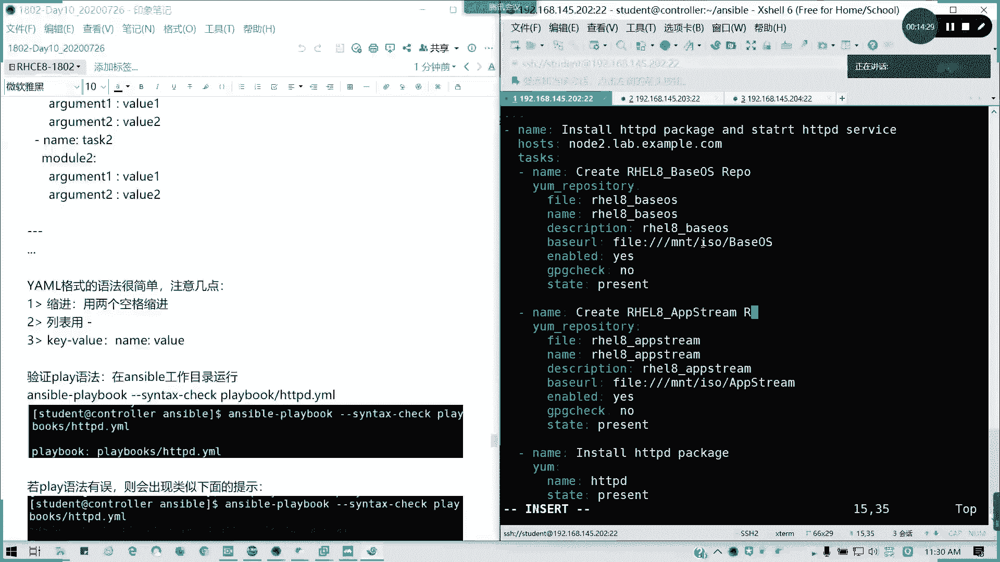
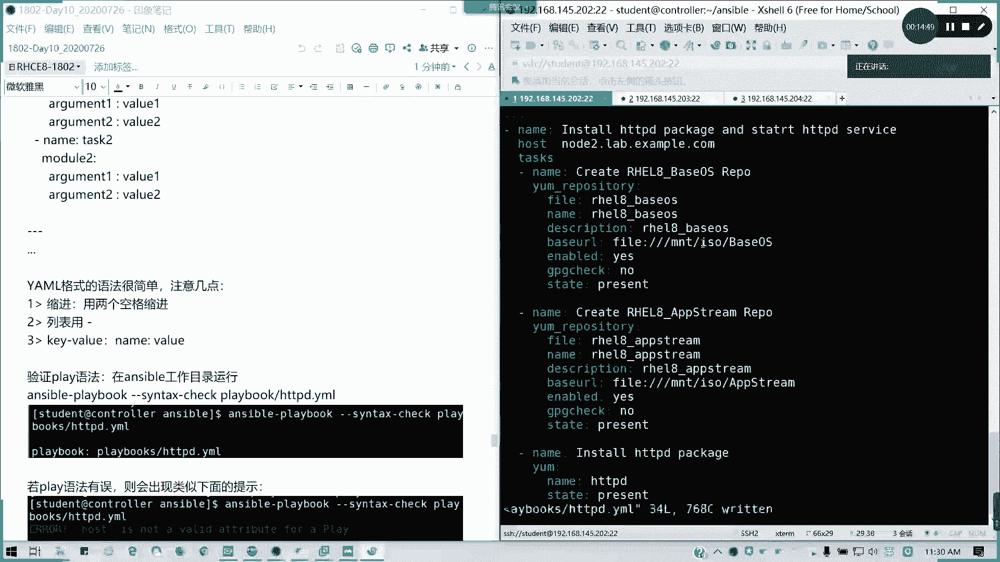
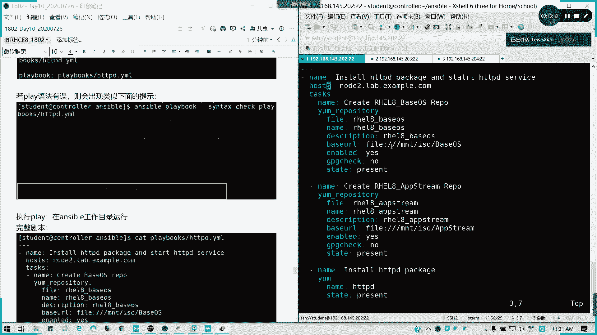
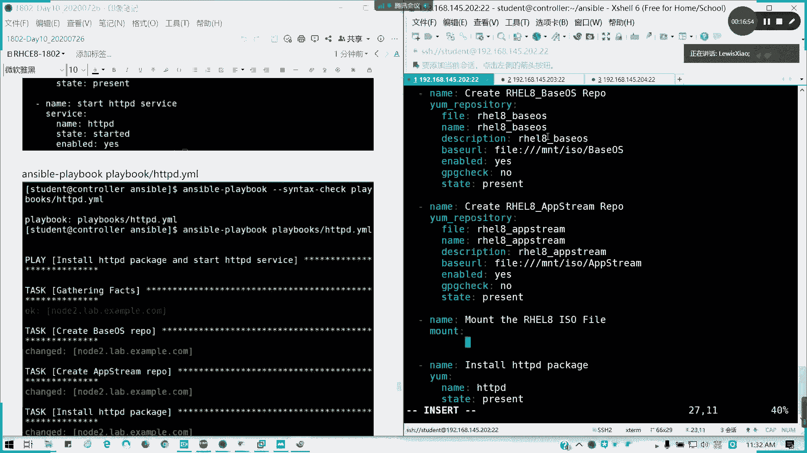
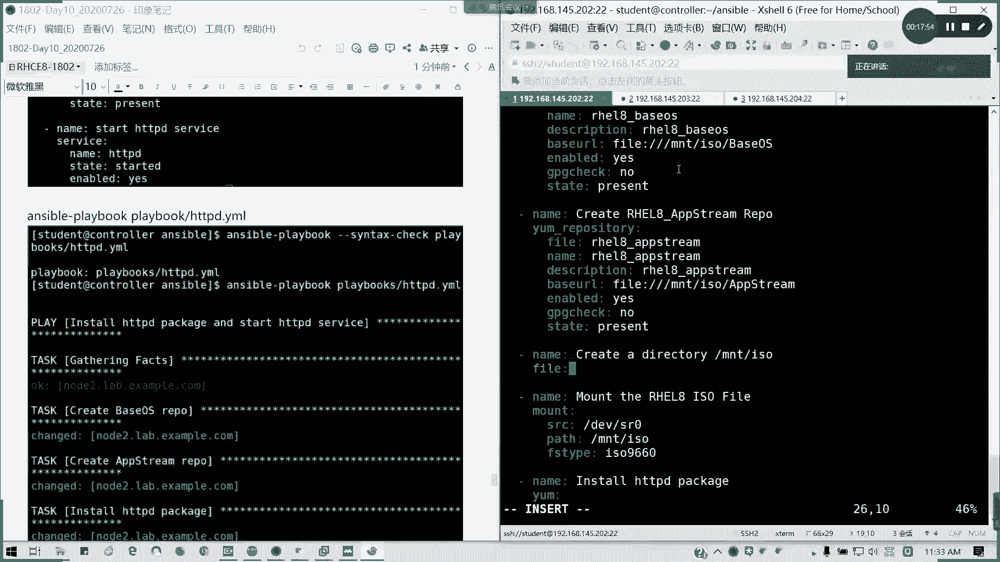
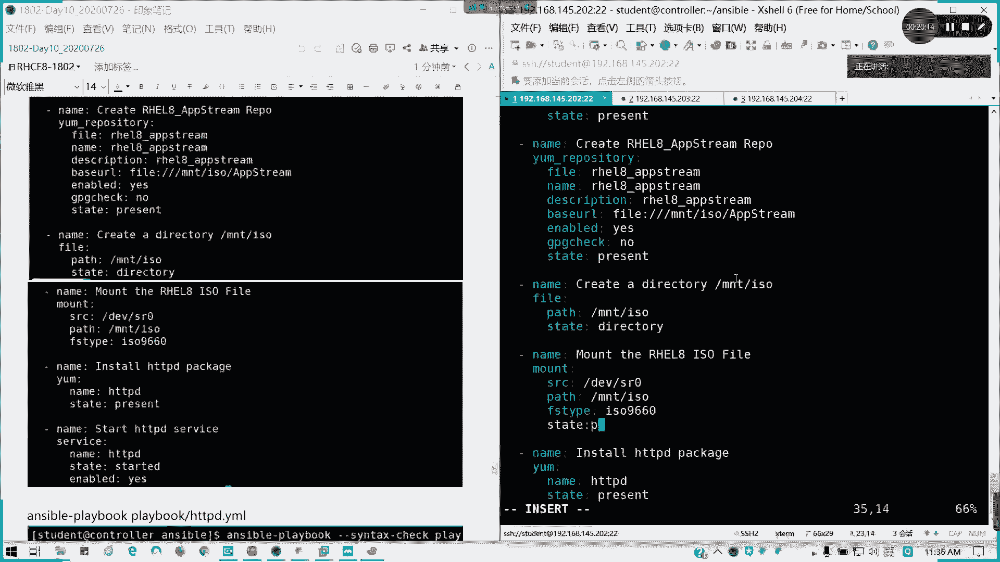
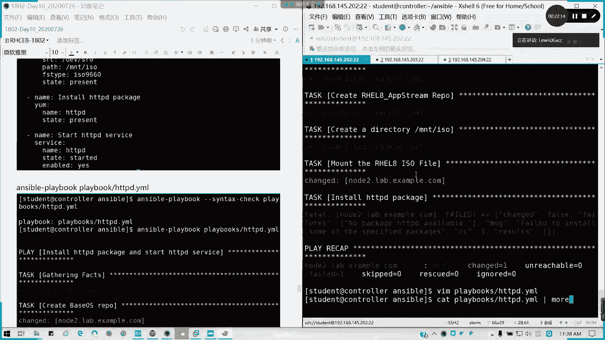

# 2021全新 RHCE8.0 红帽认证入门教程——可零基础入门学习【网络安全／Linux】 - P56：Day10_Ch03a_Ansible Playbook - IT老表哥 - BV1444y1h7Bx

好的，那我们现在开始讲我们从临时命令切换到我们的剧本。N第三章anible play book。要掌握三个问题。第一个我如何编写？如何校业？如何运行？其实在对于我们的playbook最重要。

最烦就是什么呢？一个样母格式YAML啊，所以所以现在我们要把我们的剧本转化成我们的样母格式。样么格式其实也它也是基于python去去写的，好吧，像S我是基于python里面开发的一个字化工具。

那我们就遵照它的亚某语言来写就可以了。好，我们为了方便我们在那个anerible里面创建一个。プライボックスモード。用于存放剧本。然后我切到我我不我不切里面。因为当前公众目录啊，为了保证我S模是生效的。

所以我就不切公众目录了。我直接我按按照一个例子啊。按照一个例子，我来写一下啊，我边写边给大家说讲解，然后大家可以容容易理解一点。play books里面的HTTPD点妖么YAAL或是YML都可以。啊。

都支持啊，这个看具体的考试要求啊，考试我们练习的要求，看具体我们实际环境生产的要求，他要让你。学什么文件，我们就写什么文件，懂吗？好。回车我们怎么写剧本？剧本你固然要。我这个剧本我要干嘛的？

我要作用在哪里？那我的任务，我分配的一个任务是什么？对吧我要写清楚。那好，我们开始。首先声明这个剧本三个横杠，不是破折号，三个横杠开头回车。第一行第二行开始，我们这里是相当于一个。项目我们的一个列表。

一个是一个一个项目列表，所以没用。一个横杠空格就证明它是同一个列表层级里面的对吧？它是有层级的结构。那好，第一个我们写namename列明这个剧本的用途。懂吗？这个剧本用途可以自己定义。

但是通常来说我们建议啊就跟我们写注释一样，要因为你这个剧本你不只要自己用的，你要给别人用的。所以的话是不是我们要写明这个用途，但这个的话你怎么写都行，只要你要看得懂，对吧？instled。

我要安装HTTB服务，对不对？我是不是我这里我要启用安装并启用HTTPD那我把这个用途写写下去，不要用中文哈。不要用中文啊。好了没，那样吧，写明这个剧本的用途。第二行我的作用与我的在哪里运行，对吧？

Host。走吧。空格啊，记得我们这里。参数我们的选项。冒号空格后面带价值，这里很容易犯错的，或者是你在这个列表里面你少了个空格也不对，这里少一个空格也不对，这里用拳角的冒号也不对啊，注意。

这里我写作用域，如果是所有主机，我写哦。如果是多台主机，我可以用列表的形式，就是在这里我缩进空两格是吧？我可以这样空格空格，这样列表下来，没有问题。但我这一台的话，我就跟在后面啊，懂吗？我这样讲能懂告。

我来看看啊。接下来我们的受管主记我们要写啊。node2点L点点COM。就别记得啊这里怎么定义就怎么引用。怎么应怎么定义做怎么引用啊。好了，接下来。我要写什么任务啊，对吧？

task记得这里我们host跟task这周有一个S的。回车，因为任务多，我们不可能跟在后面直接堆在一起，难看的要死，对不对？那我们接下来它是一个tsaskk里面的一个子向，那我们就用缩进啊。

样么文件格式是有两个空格缩进可以了，没不需要一个tab4个空格或怎么样，我们两个空格进缩进。好，我们第一个任务。任务的名字。是吧。第一个任务是不是我要这个包我是要先安装，对不对？好吧。

名字先写不用写作用语了，因为它是一个任务。然后接下来我要写模块。我这个任我要调什么模块，模块里面要写什么参数？对吧好，我这里模块用一样的。对吧嗯。如果我这里没有配软件仓库怎么办？

我昨天我是不止他配了个弄的一。那我这里我可以改一下啊。对吧我这里完整写啊，用。

我自己创建一个软件仓库吧。yreitory。对吧然后我们参数是什么？也是空两个，因为它属于这个模块里面的内容。啊，好，我这里的话ypoitory。单本飞这这这头尾文怎么写的，我来看一看啊。😊，首先。

nve。对吧我们的fire，我们先写我们的文件。同样也是冒号啊。FL8。被OSOS。对不对？那我们的n。就是我们的方框里面有。description这里我可以不写。描述啊。我写没问题啊。

反正练习里面你他有要求，就我们就写呗。faceURL，我这是完整版的啊。因为我们我们例子里面是一个就是已经配完软件仓库的。就其实就把我们等号换成冒号。空格懂我意思吗？

base啊ISO然后里面的baseOS。然后后面。enable的这一我换的yes，对不对？或是te或 falsese都可以。triing check我写no对不？对。Present。对不对？

然后我可以重复再应用这几这些参数。我这里12345677YY。Pi。对吧我把它分隔开来，这里我们改成F dream。我们是不是要创建软件仓库先啊，对不对？就把我其实把昨天题目已经讲了。就已经在讲了。

只不过我换成剧本的形式而已。Apps stream。懂吧？好，这是第一个任务已经完成。那我们通常我们我按我的习惯哈，我们的每个任务任务之间，我们用空格空行分开。其实这样是不是我们有层次有条理？对不对？

不要多一在一块啊，nap第二。5。Inスstore。STDPD。Package。好。你们用什么的要么。对吧。然后呢，我们的。软件包名字叫HTTPD。其实我们用VIM机很好的。如果你写对了。

它会有颜色提示的对吧？选项。蓝色值就我们参数是蓝色值白色。对吧。然后state。Present。这是第二个任务。第三个我要启动服务了那start。HTTPD service。

我们调用的是service模块。刚刚讲的新切罗瑞个samp。😊，HDDVD。State。in study对不对？我要启动。En labelable。But， yes。那我们剧本是不是写完了？😊。

很长啊，我这里有复制给大家啊。

这是完整版的一个剧本。仅供参考。

然后呢，写完剧本啊。

其实呢我们prebook是将我们临时命令啊划分层级区块，想用缩进样式来识别。建议大家啊给我们一行一行写就非常好了，对不对？我们的参数一行一行写，对吧？排错也简单，一个简单的一个句母模型实。

我这里不用再讲了吧。然后你如果多个比如写一个剧本，两个剧本，你可以在一个文件里面写多个剧本都没问题。但是通常我们是一个文件写一个剧本，为者区分它的用途。

鸭某膜得式其实不仅不难啊，很简单，注意。缩进两个空格，每个层就有两个空格，列表用横杠一个一个减号，然后空格隔开。key value呢我们就leb后面有一个空格的哈。

然后呢，我们来进行验证，我们来验证我们的语法。验证语法呢，我们执行playbook的命令叫answ playbook，对吧？记得这你当前的工作目录。answ play book。

然后杠杠fin text check。语法验证啊，那么对吧？然后呢，play books里面的HTPD点m看有没有问题。哎，有啊。

当pre kid啊，他有一个 warning而已。

第七行，我这里是不是我我这里是写了两个重复的啊，所以它会有提示。

我这里我可以啊，我可以分开两个，它就不会有提示了。就是我这里我在那个。引用同时引用两个就可以了。

这样应该就没问题了吧，看一下。单配K。young repository use defined value only啊。他是发现两个重复的那我们其实我们更好的就是。隔开。对吧文这可不可以得开啊？

你要为了保险就会隔开呗。

好了，我们再看一下sentt check，没有问题了，有问题我们就把这些 warningning消掉。懂吧。

然后呢，如果确实有问题，比如说我这里我突然少了个S。他虽然是高亮的啊。

看到没？Hot is not a very attribute for play。

然后他会指明你这个位置到底在哪？

通常在下一行或上一行。好吧。所以这里我们要改正啊。

他只会应验证我的。

语法但是不会去验证我们的逻辑，懂吧？逻辑怎么样，他不管。

他只要保证你语法正确，懂我意思吧？好。

改完之后再颜色一遍，没有问题啊。没有问题，那好，怎么运行？ansible。完整剧本啊，这里我不是写了吗？完整剧本好。

我anible。干playbook。G杠fin tax。那不用塞 textex了，我们检查过了，我们就直接play books里面的HTDBD。点一冇。这是在你的攻通度下跑啊。好了。

首先他的配啊一个play就有人开始。

收集事实，然后创建我们的样源，他每个列都列出来。好了，有错误了。

n package为什么？那我没挂着呀。

对吧。我没挂载啊，我这个牌没挂上去，对不对？懂吧？没挂上去，那我们就就执行一个临时命令喽，我或者我在剧本里面写喽。这个剧本我还缺那么一丢丢东西啊。

在这里我要挂载一个光盘，对不对？

네。

猫铁。帽子。对RHEL8ISO five对吧？没有momount模块参数。

So对吧？

DEVF20。好吧，他的。destination或者叫pass都可以。叫做MNTISO。

那前期我们要创建1个IO，对不对？那我们的FS type它会写到我们的那个ETCFS type里面呢。

ISO9660。

对吧。那在前面我又要创建一个目录。

这我把我把这个剧本再完整化。

老文发呀，对呗？

对吧。네。

叫做。呃，我想想啊。name啊，我们想想啊，我们怎么写我们创建一个目录。快尔模块啊。方案模块我们可以这样子啊。Pass。PATH。就我们把等号换成冒号空格pass我们叫做MNTSOstate。

directory对不对？

就可以了。

这才是一个完整剧本啊。我把完成作用贴给大家吧，就整个步骤你对吧？

完整剧本应该是这样子的，这样就是一条龙服务，对不对？

好，这里。

哎，怎么滚下去了？

好。这里啊。

这个才是一个完整的剧本。

懂了吧。

好了，那我们现在执行一遍。

我们前面已经配了样棉软件仓库，所以他就OK的。chan置哎 requirementforse啊。

missing of state，我漏了一个state。

回ゼ咯。

漏了就补嘛。

好，我们来看一下我们的运行情况。

冒子也成功了，开始装。

诶。

为什么呢？哪里有问题呢？我们看一下。

我看一下它这里是提示说那个state。

在帽子那里。state哦，哎，我错了啊，我错了啊，state不是写present，应该是写mountit。

对吧。懂我意思吗？

懂吗？tay应该是猫腿，我要挂载。

我先执行一遍，看有没么问题先。

申报图没写完，没有错啊。

成功装。

对吧装完。成功了吧。

所以这些就怕你们漏了。这者是不是写剧本，你整天会怕这东西啊？对吧整天会怕漏东西，然后呢。就我把完整剧本贴给大家。那我再看一下。对了啊，你们现在我觉得你们不玩精灵了啊。

这才是一个完整的一个过程。

懂了没？

好。明白了吧，这这个还没写完的啊，这个没写完，然后真正的。

真正的剧本要这么长。对吧所以我们在做一个任务，做一个剧本的时候，我们要方方面面我们有考虑到，对吧？我完成这个我要缺什么东西？

说明是吧我说明的话，像我们运行一个剧本，首先你要不要你有没有连接上收管主机，这是什我么and get effect这个做的，具体我们在管理变量事实里面会讲，然后剧本执行任务一任务2，对不对？

如果是连不上。如果如果我们这样收组连不上的话，它fa会等于一，对不对？然后看然有没有执行，如果成功做有做改变，那就是chch，如果是O就是绿色。也就是说你的状态没有发生改变，对吧？然后呢。

后面他会一个统计，对吧？懂了没？然后如果连上这台机器，就是fd等于1，然后是否正常执行任务，对不对？在pre request里面，这个OK它的技术是这样子记的。

然后我们可以提高任务的一个输出程度。比如说我可以干一。是吧通常我们杠V就够了。然后杠VVB的话，你V太多的话，你这一屏就显示不完的。除非你要在来调试，像我们杠V就足够了。

对吧他要把每个任务的一个这种结果都列出来，就不是单一行写就OK了。因为现在我们已经创建完了这猫，所以的话它就是全部绿色。然后杠VB的话，你看。连这种结果跟这种配置都会显示，懂吗？就是连哪一行跑。

他都告诉你。然后VBB呢就是跟寿官属连接信息。那这样的那你看滚平了，开始滚平了，对吧？太多东西了。其实我觉得没必要。杠V就可以了，然后看4个V呢，啥额外啥的强度，哇去你看。对啊，最详细的4个V。

你就用于调试的时候，我可以用。但是通常我们用一个B就可以了，对吧？一个B最多两个B。对啊，很多啊，你可以存在lo里面，你自己看吧。

但是我们通常用一个B就可以了。空运行。杠C不会实际运行，就是它会显示你的预期的一个结果。但是你它不会真正跑在主机上。好吗？它这是一个预期的结果会显示啊。但是他这是空运型。懂我意思吗？好。

那这个明白的话啊，请打字母一，然后我们做下面一个剧本练习。做下面一个剧本练习啊。我都发下来。我们装了1个HDDP服务，那我们接着往下做。对吧这就留给大家。那现在我们休息一会儿啊，这个任务就给大家现在做。

可以吗？

