# Ansible入门教程：第四章：管理变量和事实

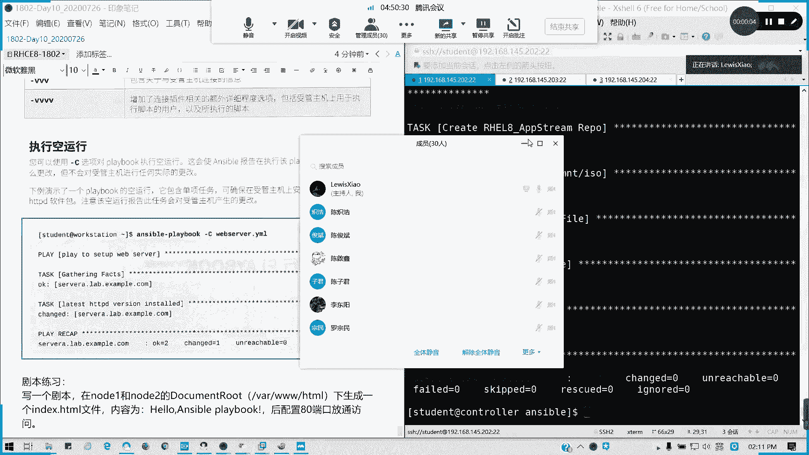


在本节课中，我们将要学习Ansible中变量的定义、引用和管理方法，以及如何利用系统收集的“事实”信息。变量是自动化任务中存储和复用动态值的关键。

## 变量简介与命名规则

Ansible支持利用变量来存储数值，例如用户名、密码或软件包列表。使用变量可以简化项目的创建和维护，并减少错误数量。

变量命名需遵循以下规则：
*   支持字母、数字和下划线。
*   不能以数字开头。
*   变量名中不能包含空格、点（`.`）或其他特殊符号（如`$`）。

以下是有效和无效变量名的示例：

**有效变量名示例**
*   `web_server`
*   `file_name`
*   `remote_port1`

**无效变量名示例**
*   `web server` （包含空格）
*   `remote.port` （包含点号）
*   `1st_file` （以数字开头）
*   `$filename` （包含特殊符号）

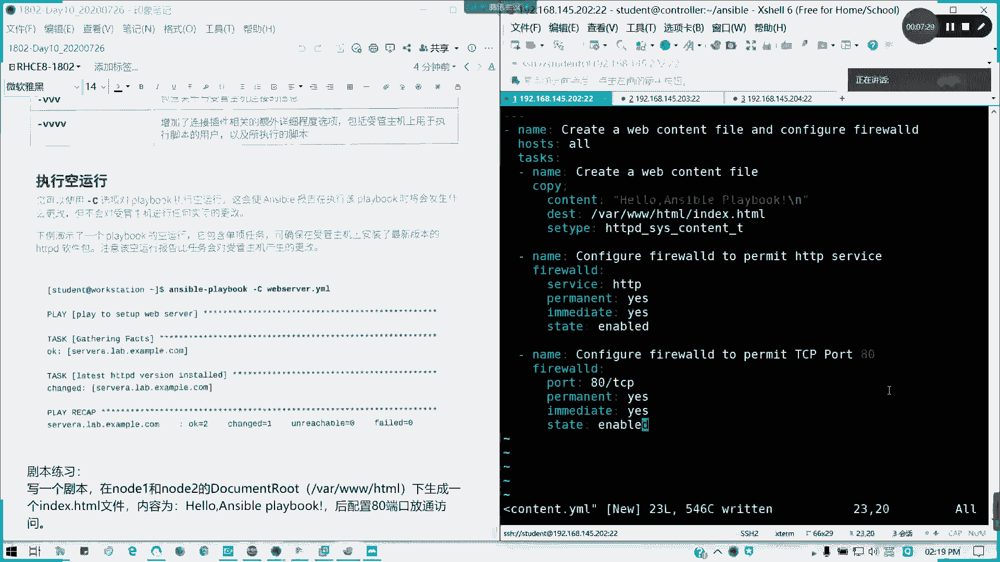

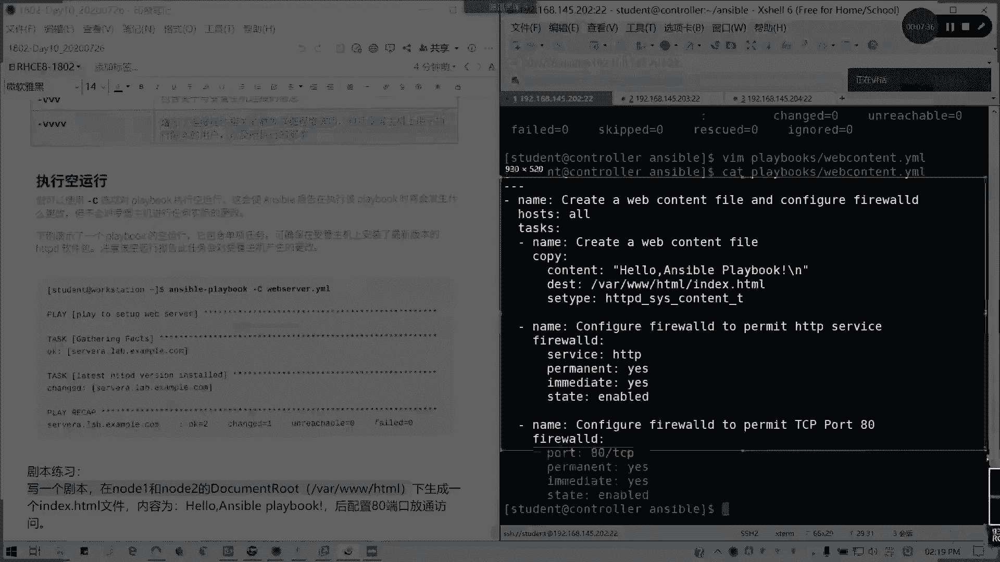

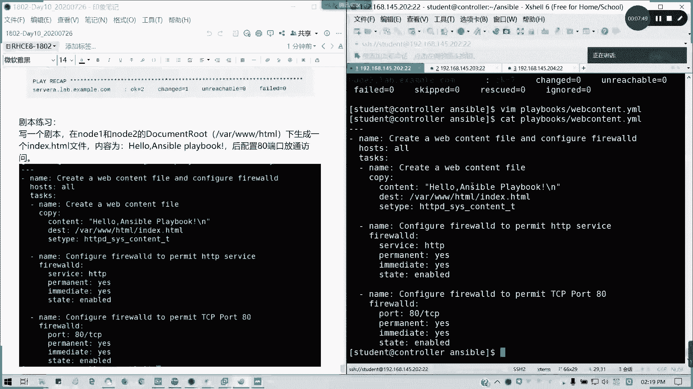

## 变量的定义位置与引用方法

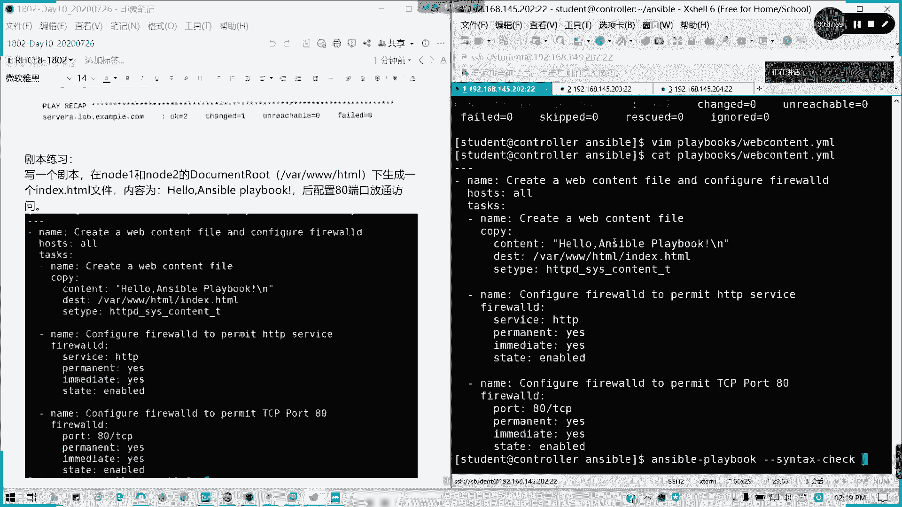

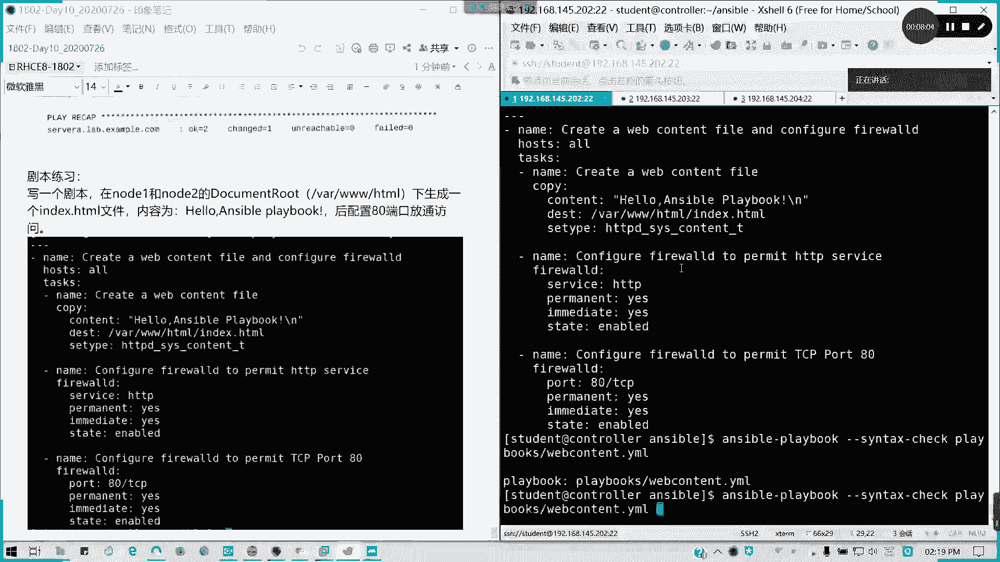

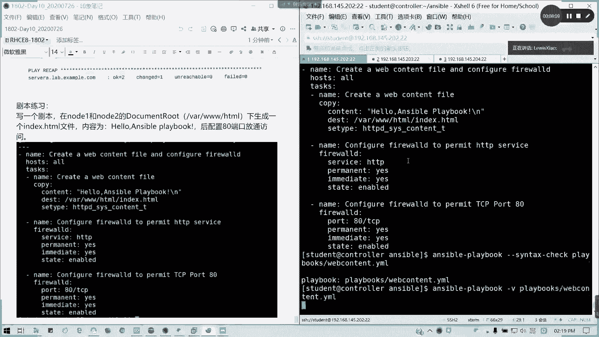

变量可以在多个位置定义，其生效范围也不同。无论在哪里定义，在Playbook中引用变量值的基本语法都是 `{{ 变量名 }}`，注意花括号内需保留空格。

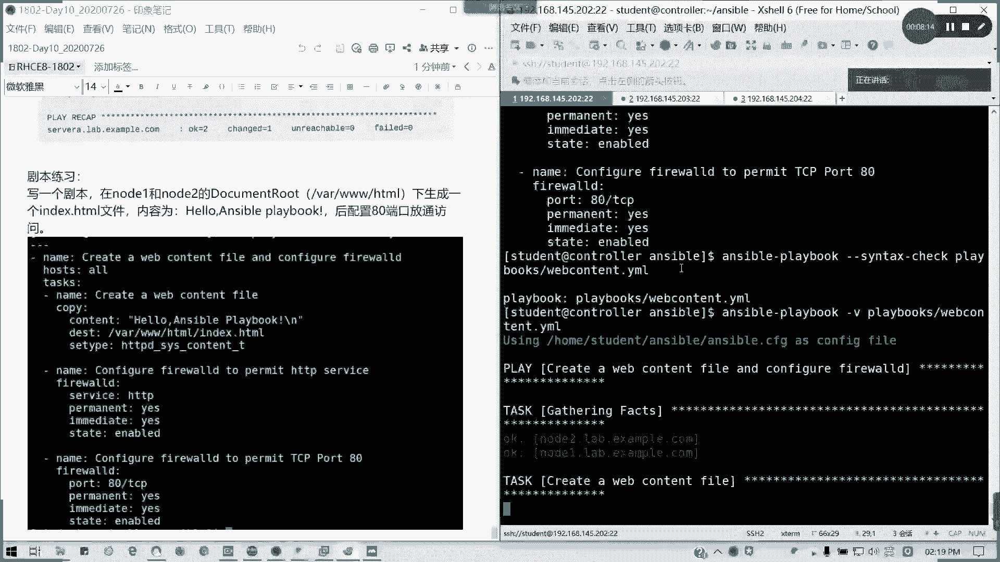

上一节我们介绍了变量的基本概念，本节中我们来看看变量具体可以在哪些地方定义。

### 1. 在独立的变量文件中定义

我们可以将变量定义在独立的YAML文件中，然后在Playbook中通过 `vars_files` 选项加载。

以下是具体步骤：

首先，创建一个变量文件，例如 `vars_file.yml`：
```yaml
username: test_user1
```

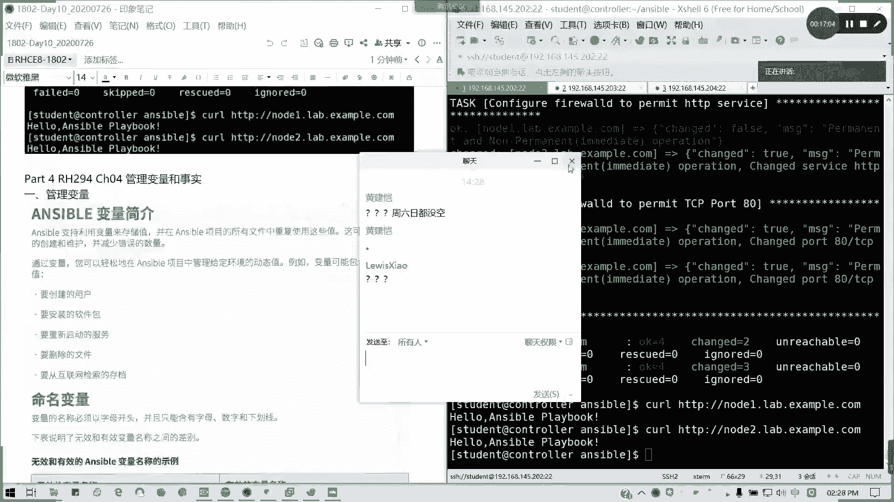

接着，编写一个引用该变量的Playbook `test_var.yml`：
```yaml
---
- name: Test variable file
  hosts: all
  vars_files:
    - ./vars_file.yml
  tasks:
    - name: Create user via variable file
      user:
        name: "{{ username }}"
        state: present
```
执行此Playbook将在所有主机上创建用户 `test_user1`。

### 2. 在资产清单文件中定义

变量可以直接在资产清单文件（inventory）中定义，可以针对单个主机或整个主机组。

**在主机级别定义变量**
在清单文件中为主机直接附加变量：
```ini
node1 ansible_host=192.168.1.101 username=test_user2
node2 ansible_host=192.168.1.102
```
使用此清单运行上面的Playbook（需移除`vars_files`部分），则只在 `node1` 上创建用户 `test_user2`，`node2` 会因变量未定义而报错。

**在主机组级别定义变量**
在清单文件中为整个主机组定义变量：
```ini
[webservers]
node1 ansible_host=192.168.1.101
node2 ansible_host=192.168.1.102

[webservers:vars]
username=test_user3
```
这样，`webservers` 组下的所有主机（node1和node2）都会应用变量 `username=test_user3`。

### 3. 使用特殊的目录结构定义

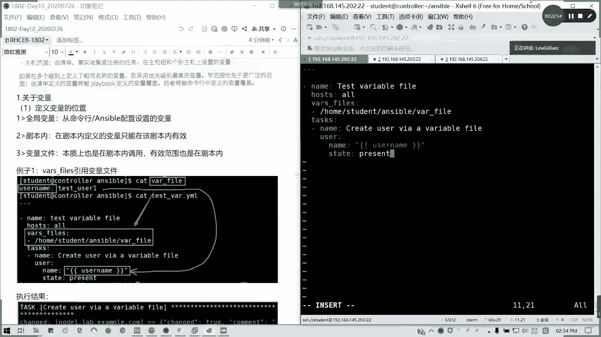

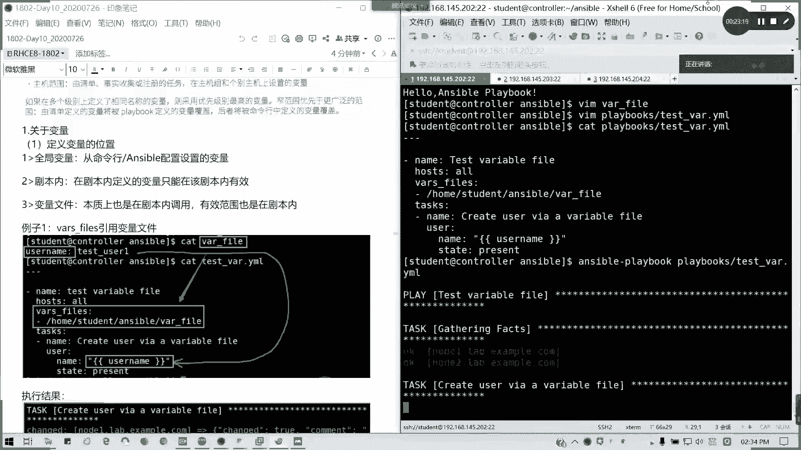

Ansible支持通过特定的目录结构自动加载变量文件，这有助于管理复杂的变量。

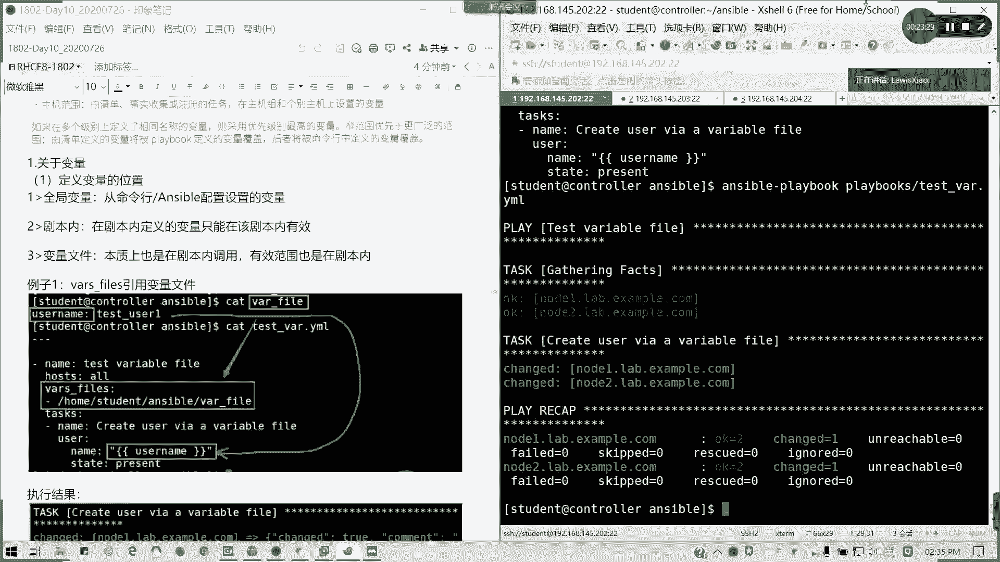

**主机组变量目录**
创建 `group_vars/` 目录，并在其中创建以主机组名命名的YAML文件（如 `webservers.yml`）来定义该组的变量。
```yaml
# group_vars/webservers.yml 内容
username: test_user4
```

**主机变量目录**
创建 `host_vars/` 目录，并在其中创建以主机名命名的YAML文件（如 `node1.yml`）来定义该主机的变量。
```yaml
# host_vars/node1.yml 内容
username: test_user5
```

### 4. 通过命令行传递变量

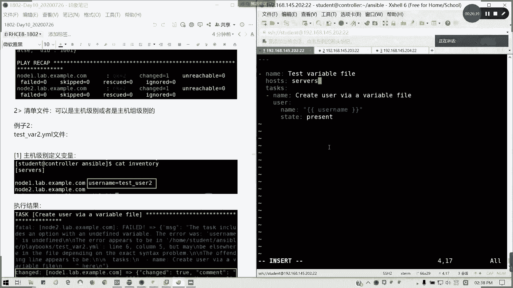

在执行 `ansible-playbook` 命令时，可以使用 `-e` 或 `--extra-vars` 选项直接传递变量。
```bash
ansible-playbook test_var.yml -e "username=test_user6"
```
此方法定义的变量优先级很高，适用于临时覆盖其他位置定义的变量值。

## 变量定义位置小结

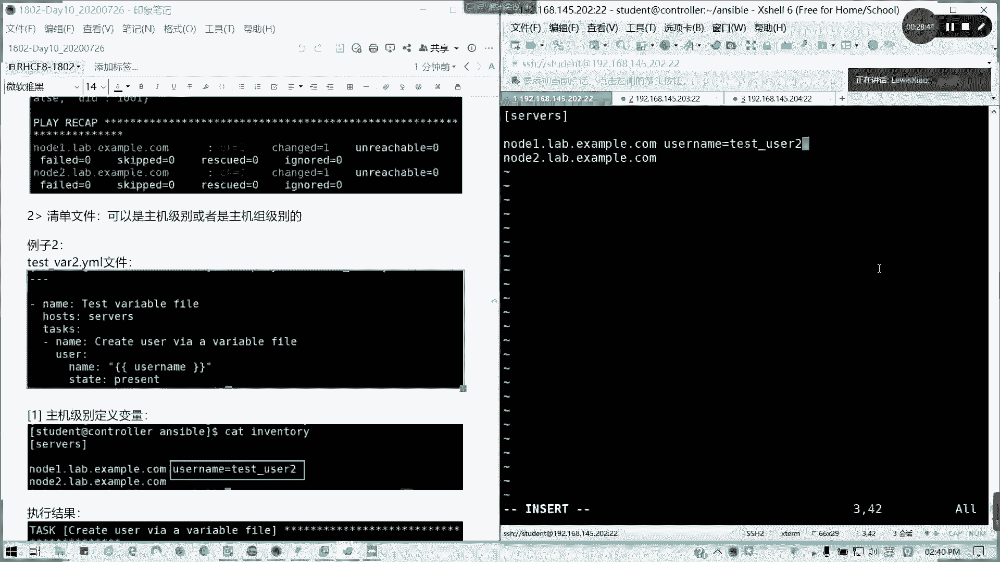

以下是变量定义的主要位置及其特点：
*   **独立变量文件 (`vars_files`)**：在Playbook内声明加载，结构清晰，便于复用。
*   **资产清单文件 (inventory)**：可直接在主机或主机组后定义，管理集中。
*   **特殊目录 (`group_vars/`, `host_vars/`)**: Ansible自动加载，适合按组或主机管理大量变量。
*   **命令行参数 (`-e`)**：优先级最高，用于临时测试或覆盖。

## 系统事实的收集与使用

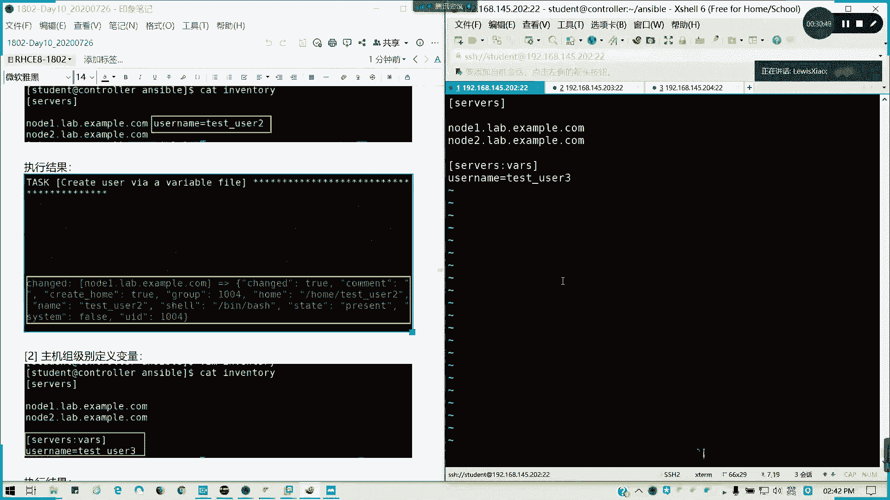

除了自定义变量，Ansible还能在任务执行前自动从受控主机收集系统信息，这些信息称为“Facts”（事实）。它们以变量的形式提供，包含了主机名、IP地址、操作系统、磁盘空间等详细信息。

要收集事实，可以在Playbook中使用 `gather_facts: yes`（默认值）选项。收集到的事实可以通过 `ansible_facts` 字典或直接使用 `{{ ansible_主机名 }}` 等形式引用。

以下是一个使用事实的Playbook示例：
```yaml
---
- name: Display system information
  hosts: all
  gather_facts: yes
  tasks:
    - name: Print the OS family and hostname
      debug:
        msg: >
          This host is {{ ansible_facts['os_family'] }}.
          Its hostname is {{ ansible_facts['hostname'] }}.
```

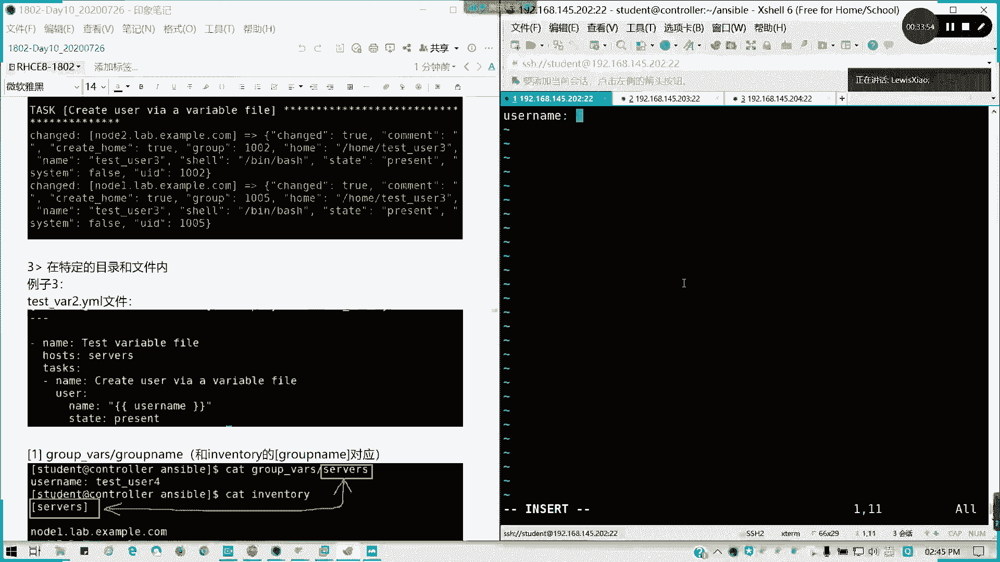

执行此Playbook，会输出每个主机的操作系统系列和主机名。

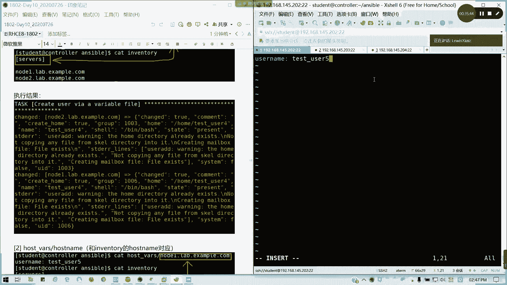

如果不需要事实信息以加快Playbook执行速度，可以设置 `gather_facts: no`。

## 本节课总结

本节课中我们一起学习了Ansible变量的核心知识：
1.  **变量的作用与命名规则**：变量用于存储动态值，命名需使用字母、数字、下划线且不以数字开头。
2.  **变量的多种定义位置**：包括变量文件、资产清单、`group_vars`/`host_vars`目录以及命令行，并掌握了引用变量的 `{{ variable_name }}` 语法。
3.  **系统事实的利用**：了解了Ansible如何自动收集主机信息（Facts），并学会在任务中引用这些信息来实现更智能的配置。

合理使用变量和事实，能够使你的Ansible Playbook更加灵活、强大和易于维护。