# 2021全新 RHCE8.0 红帽认证入门教程——可零基础入门学习【网络安全／Linux】 - P5：Day02_Day01课程回顾 - IT老表哥 - BV1444y1h7Bx

<该字幕由算法自动生成> 好那我们今天开始，我是小陆师兄，我们先回顾一下我们昨天啊昨天讲了一天能看到屏幕啊，都能啊，好包括远程的都可以啊，那行那我们回顾一下昨天内容，昨天呢我们主要是第一个把大家引入门。

对不对，那领入门我们讲了红帽课程的一个学习的一个作用对吧，现在很多开源，包括我们的一些国产化，对不对，国产化还有一些设备基本操作那个系统，而且而且他有一个安全高效多用运行的特点。

所以的话现在很受我们的企业用户的一个青睐，对不对，然后第二个我们讲了红帽认证体，系就我们七跟八区别在哪，对不对，我们八主要是讲什么呢，这不就是说重点放在自动化里面，前面的基础还是要讲没有变。

但是后面我们是讲了accel自动化运维这一块的话，我们在第十到第13天啊，如果昨天没有来的同学，应该知我就给大家再说一遍啊，昨天没有来的同学，即使我们的那个我们的环境呢是不需要用的。

暂时我们要新装一台ri八点的一个虚拟机，然后复制完整克隆才出来就可以了，玩复啊，所以我们用两台自己的机器，我们都可以做，但是课上的练习我不会讲，因为课上的都是那些选择一个概念的节目。

那跟我们我们考试我说过了，我们考试是实操啊，实操的题目，那我觉得这块的话大家概念懂就可以，我们重点放在我们操作上面，好大家这里看到我们八跟七的不同的啊，七主要下下午是考服务，对不对。

这期的话你看那个截止时间了，我们的那个考试截止时间是2018年的二幺，2020年的8月份啊，20208月份之后呢，你就考不了七了对吧，考不了七了，所以的话现在学霸政治时候啊。

虽然企业现在大规模还在停留在六跟七的阶段，其实八的话有一点点区别，我会说啊，以后有一些命令的话，八跟七怎么用，包括像我们重启网卡服务对吧，这个就是其中一个不同啊，然后我们考试时间。

考试时间呢就大家学完考前辅导做的大概一两个月之内就安排，然后呢上午两个半钟头考cs a考我们前两本书的东西，下午四个小时全部讲，全部考完，直播啊，四个小时，所以的话难度比七会有所增加，会有所增加。

也就是说你s b的话，你们剧本你的那个模板，还有这个角色你也很熟练，然后你的鸡因为他是excel呢是依靠，其实如果后面我们学起来，我们都是依靠我们的基础的对吧，我们基础命令熟的话。

我们n这波其实没有任何问题啊，像c a的话，目前我至少知道有三个方向，而且现在设计十几名认证啊，十几门认证，然后呢，我是十几门认证呢，然后呢我这边啊我们主要在这边，我们有五个方。

就有一个云方向是没有开的课程啊，云方向我们有开的课程，然后呢重点呢对吧，重点呢就是我们学完这个基础，和我们原来我们answer able呢是在那个ca里面的，一门叫d o407 对吧，然后从八点开始。

它下放了30%到50%的内容放在我们的c一上面，所以的话其实安卓博的话基础知识没有变，只不过后面的大应用可能减少了一点对吧，但在后面我们大家会讲啊，然后记得如果大家要报ca的话，想报c的话。

那这让你的证书我们有效期3年，现在全球有有效期的ca是1200，1300左右，全球的有效期内搭，因为如果你拿其实你先拿着的话，你到时学完你有没有效的话，大家都认得对不对，只不过你如果更新有效期的话。

你要跟红帽再考一门新的课或者重考之前的课啊，然后呢全国呢也就是600人，差不多，600人差不多，然后呢全球的c一多少人呢，全球7万多有效期内，然后全国3万左右，3万多，这是去年的一个数据啊。

我是我们讲的是有效期内的，也就是你的证书，你还在红帽，就是我们的我们其实现在证书都没有标有效期，但是他现在红帽子的做法就是那个你是你是你拿到考试通过那天起，3年内都是有效的。

所以他的有他的那个失效日期呢，是在我们的拿到有红帽最新的一个日期之后的3年内啊，所以的话大家其实c的话只是一个皮毛，只是一个基本啊，所以的话就我希望大家还是就是说拿完之后，我们可以往更好的方向去走。

这是我想说的，然后呢接下来我们还讲了一个是不是我们如何装红帽，八点，我们昨天手把手，而且中间我还翻了车啊，因为主要是那个ip获取的一个问题，所以中间我下午又花了一个小时重整了一遍啊。

主要是再次组合在vm www station pro里面创建虚拟机，然后安装系统对吧，系统的步骤，我在第一天的一个我的昨天笔记已经是完完整整的说明了啊，哪怕小白也会弄，对不对，然后呢我们还插了一句。

就是我们rhea sentence的异同，其实一个字企业应用，一个是社区版啊，也就是一个是靠技术支持跟订阅啊，订阅，然后这方面我们要获取服务，要要要钱啊，也是说白了就是要钱。

然后呢cs呢主要是做社区反应是主要是那些呃开就完全开源，然后你你想那个企业如果说那种要确实完全免费，然后想尝试新的一些东西的话，那其实用c to s那两者的命令一模一样。

只不过一个就是每支持一个有对不对，然后一个是稳定版，一个是可能有些新的八二新的特性，它会提前下放，但它通常版本上呢3s瑞亚先出对吧，最成熟的rk先出，出了之后半年才会出cs。

所以这个rap最新的版本是8。28。2，2020年4月18号出的8。2的版本，但我们现在考试通常是考八点，他就是功能或者是bug修正的，其他没什么区别啊，然后我们还讲了如何远程的连接，远程连接虚拟机。

是不是我们通过虚拟网络配置配置是吧，然后我们跟我们的那个用alt的方式，只要联通的话，就像我们这样，我们就可以用xxl或者是用那个呃，用其他的ccca c i t c工具大家都有哈。

其实如果他做过运维的话，都有对吧，连虚拟机，然后我们昨天下午我们讲的第二章内容叫访问命令行，对不对，方便您好，我们讲了一个linux的基本框架，主要是他由内核跟sh组，成对不对，内核还有其他组件。

它是linux一个和勾不构成整个linux系统一个一个核心对吧，但是我们人如何跟我们的linux系统交互呢，我们不可能是直接去访问它的东西，对不对，不能直接通过，因为你就相当于我们跟台电脑一样。

我们是通是不是要通过操作系统，对不对，我们要通过一个界面，你不可能就直接去读取对吧，像我们就就比如我们再组一举一个通俗例子，什么人与人是不是都通过一个语言的媒介，就知道你不可能说直接动动手动脚，对不对。

你语言都不通，那那怎么交流，对不对，就叫linux一样，我们通过一个shell的外壳，他这个外壳呢提供了我们的一个命令行的一个交互方式，或是或者是我们甚至现在演变成了有一就对于小白来说，也就同行见面嘛。

但这里我就不不讲不太多去涉及的图形界面东西啊，因为我们在实际的生产环境里面，是不是大家真的不要用命哈，谁用图形面面在windows上指指点点啊对吧。

主要windows它的那个它不过它现在power shell，特别是现在新版本，因为它主要是你要随大就随大潮流嘛，也也融入了，那个是妮妮好对不对，像现在的1590。

好像我记得是1909版本开始就是跟lin，它是有一个linux命令行的模块，也就是说我们在windows上也可以跑linux命令对吧，他提供杀枪环境给我们，所以到现在历史其实是大行其道对吧。

很因为windows有些像有些它的地缘，第一个第二个它会有时候蓝屏啊，这些不稳定的特性对不对，所以的话其实我们利用力值还是蛮多的啊，呃我们既然讲到了那个shell，那我们讲到了linux命令行。

是不是我们在提示符是不是一个p c的变量，对不对，对吧，这个格式还记得吗，括号括起来，它提示模式，括号括起来，大家自己做笔记啊，可以自己做笔记啊，这是昨天的一个回顾，我刚才我昨天也说了。

这一段自己做笔记，不要再看录我录屏或者是我的笔记，这样我讲的东西还是我自己的懂吗，你们自己掌握，你们自己练出来的东西才是你们自己的啊，这个皮字符我们是不是这样用一个括号括起来，前面是用户app主机。

然后空格工作目录后面是一个陈师傅，对不对，它斜杠它是它是反斜杠，它是一个转移啊，就是那个转移的话，就显示它的那个原本的一个功能，然后对于我们的root用户，它的后面是一个对吧，它后面是一个井号为普通后。

它是一个多了，然后如果是他在在用户的所在的工作目录，就例如我们windows下的我的文档，对不对，它就是一个波浪线啊，那个波浪线我我的缺陷缺少一点，不然就冷死我，然后还有一个我们的pass变量。

pass变量这里面写明了我们执行就是我们可执行文件通常的存放路径，然后呢如果你要新建你的你新建编辑的软件的话，如果你要直接不通过绝对的进行执行对吧，你就可以把你的软件里面定义的一个路径。

写到我们pass变量里面就可以了啊，具体的笔记昨天有，然后第三个我们讲终端，终端的话，常见的是不是图形界面，还有文本界面，对不对，图形文本两种界面如何切换，对吧懂吧，键盘切换临时的，还有命令切换。

分零食跟永久两种，具体比也是昨天有什么叫控制台，也就是我们什么叫控制台，什么叫字符终端，什么叫虚拟终端，应该都知道啊，控制台相当，我们就直接我拿一个拿一个键盘鼠标，我接一个服务器，还有显示器。

这样我们直接控制就是控制台，我们的cs日服终端就是我们从我们那个直接我们的终端，然后我们切到我们的文本界面啊，此时我们不通过任何的那个终端啊，不通过我们的任何的一个终端，我先把它拉过来啊。

等不要挡到我们任何终端是吧，字符界面，只要是字符界面，它都是t t y，然后我们从其他的从其他的终端访问我们这个linux系统，这个linux终端，那它就是一个虚拟终端，因为它是通过英联网对吧。

通过网络建立一个虚拟的一个通道对吧，就有通道，但是这个通道呢如果你就装了一个插值，然后后面加载图形界面，它也能传，对不对，这b n c他也能传，是命令界面是字符啊，那个图形界面，但通常我们来说。

我们通过叉叉l或者是通过cq和c加t，这些我们连过来的都是文本界面，其实我们无论如何，我们用文本基本足够在七里面，可能我们在ldl的服务，如果大家有了解过，就是那些轻量级啊，轻量级那个授权访问。

就那个数量级访问协，那目录访问协议是吧，就我们linux的玉啊，如果是简单配饰，我们这种图形化的会方便一点，但是我后来我也发现了诶，我没有命令好，对不对，所以我在八里面全部命令行啊，全部命令行接住。

所以字符界面你们就相当于我们一开始装完之后，我们就算了啊，然后怎么远程怎么退出对吧，都都有啊，怎么远程他怎么退出都还记得啊，这里我有剪掉血，然后接下来讲我们的best sh啊，best shell呢。

我们命令之间的一个逻辑分号，或与反斜杠，怎么用啊，知道怎么用吗，分号你连续运行多条命令，中间用分号隔开，然后前后用空格，不要堆在一块，就堆在一块，确实你看着眼都花对吧，我们用分号啊。

分号来隔开顺序执行对吧，或两个两个pp啊，我们就一个管道，他是前一条命令执行失败的情况下，它的运行结果不是正常情况下，他才执行后面的命令与两个n，它是两命，前面命令执行成功的情况下，我才执行下一条命令。

反斜杠，如果你一条命令，你一行显示不完，或者是我要值，比如说我要打开多个文件是吧，银行显示不完，我可以在一行就是说在命令一个分命令结束之后，我们用斜杠反斜杠回车对吧，他就是这样，然后他有个尖括号啊。

一个提示符，就是你可以第四节，然后也有多个分命令，多行命令你可以用多个分号，然后回车间隔出来，然后总出完一串命坐回车对吧，就是多行命令懂吗，封号啊，这种全能型我们实际上可能不常用。

但是如大家一定要知道啊，就是我们四种提示符，然后他有tab命令补全，对不对，tab命令补全，我们涉及到如果在最小化的安装里面，可能没有叫没有一个叫做pass completion的一个包啊。

bh自动补成一个包，然后我们如果在最小安装里面，我们通过补这个包，我们就可以实现针对于命令选项文件的一个补全，如果你是这个股权，它是有唯一性的，按一个tab就可以了，如果没有按两下，它会列出来一个列表。

对不对，比如说我这里啊。

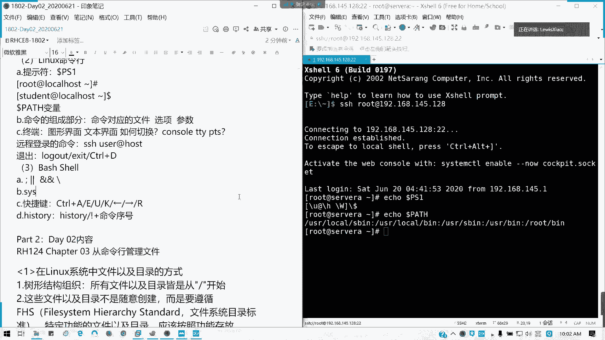

对吧，我这模式时它列出来列列表，对不对，如果我我确定只有一个命令的，他会不会帮你补全一次就搞定，对不对。

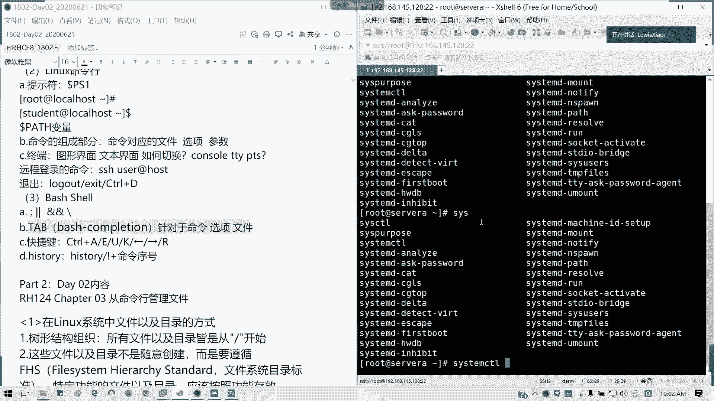

包括选项对吧，这么多，然后还对于一些不全的文件及目录，同样道理对吧，不这样讲都不能清楚啊，好然后还有快捷键，我们的ctrl加a e u k左右r，还记得他做什么用吗，ctrl加a移到最开始。

以命令最开始ctrl加e移到最命令的末尾，ctrl加e，如果你在命令的末尾的话，如果它就删去前面的内容，如果你在命令，我现在这行就清空了，ctrl加k就是你锁在光标后面内容去掉，ctrl加左方向键。

也就是它移到前一个字，一个单词的一个开头，右一个单词的末尾，而我直接查找啊，查找命令的关键字，它会给出最近的一条命令的一个结果，然后你ok的话，按回车啊就可以执行，然后还有我们讲到一个history。

对不对，我们的历史记录对吧，历史记录我们可以查看最近的1000条啊，对吧，我们这里有90几条，然后如果我要执行我的某条命令，那我用叹号跟上我区号就可以了对吧，然后我们昨天还讲了一个linux。

一个我们开篇啊，从命令和管理文件，我们讲到了存在linux里面，我们那个文件及目录的一个构建的一个呃我们的一个框架啊，文件目录的方式，一个框架啊，访问方式，这里我补充两个字啊，可能我有些笔记里面有错。

别是我如果你们有看到的话，提醒我，我会直接改过来，然后我们的linux我们是以一个树形，一个倒数形的结构是吧，最顶端是一个根挂载点，然后往下就是一层层目录，然后一直到你的文件为止，对不对。

就像windows是一个盘符盘符，然后一层层目录下了下来，这些文件呢不是随意创建的啊，它是要遵循我们一个叫做文件系统的目录标准。

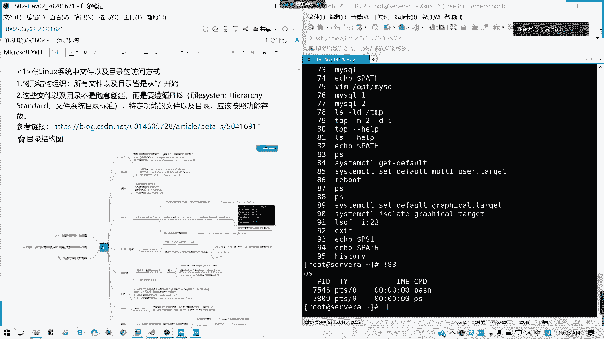

然后特定的文件根目录它要按照一个功能存放，我们这里给了一个链接，对不对，我们给了一个链接，c s d n里面他讲的比较全，就是一些啊f s h f s s是什么回事，就是我们的文件文件系统的目录标准。

它是一个怎么一回事啊，c s d n有这篇文章，就它这个价这个组织，它会规定我们的一个到底我们的这个文件它要怎么存，所以linux的话它是linux的linux系统啊，它是遵循这种方式。

但这里的话好像我这个网络问题有点没法打开哈。

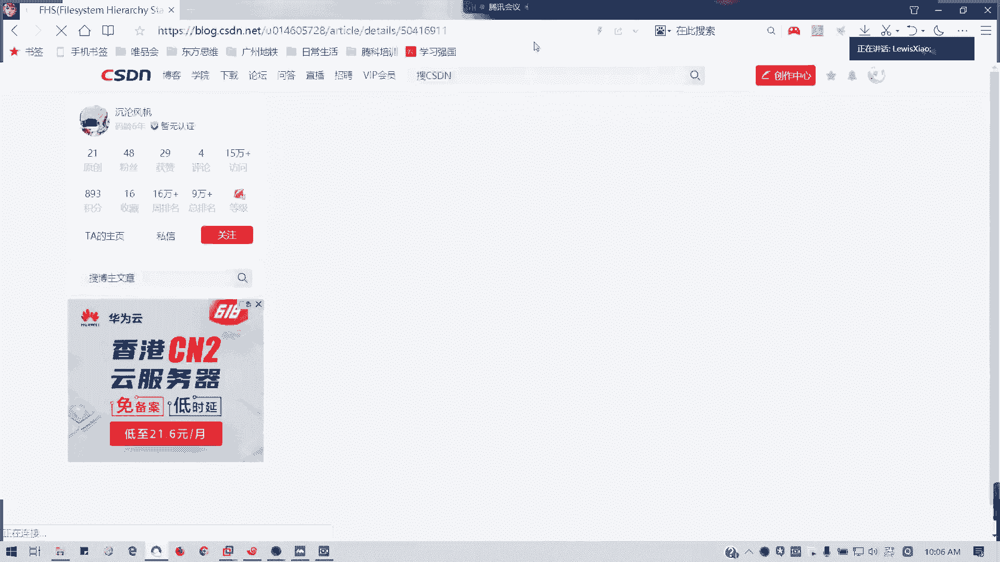

就是说可能那等一等啊，这个文章诶，我看一下应该能漏的开了对吧。

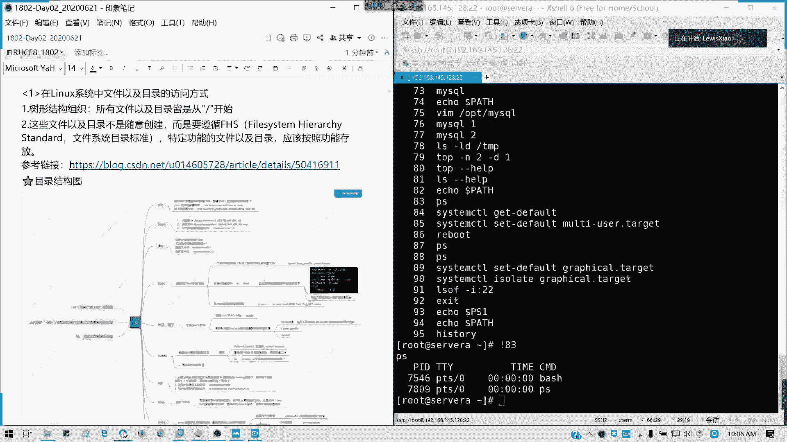

我们的f h s的，我们的目录规则，有人卡哈，因为他现在flash组件的问题，但是现在flash我这边看到一个消息，可能国外的这些的话，基本上flash都停用了，但是对于中国大陆的话。

它是启动是继续提供支持啊对吧，flash基本在国外已经国外已经相当于是落后了，已经是被其他的一个技术所取代，但这个我已经画面已经卡了，我就不不不讲不讲这个了啊。

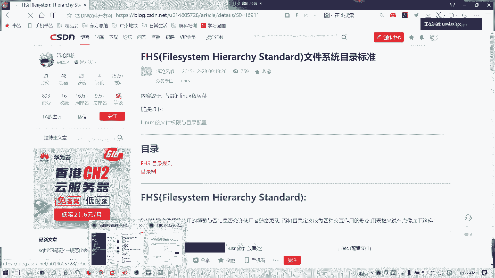

然后我们昨天呢我们还讲到了一个对吧。

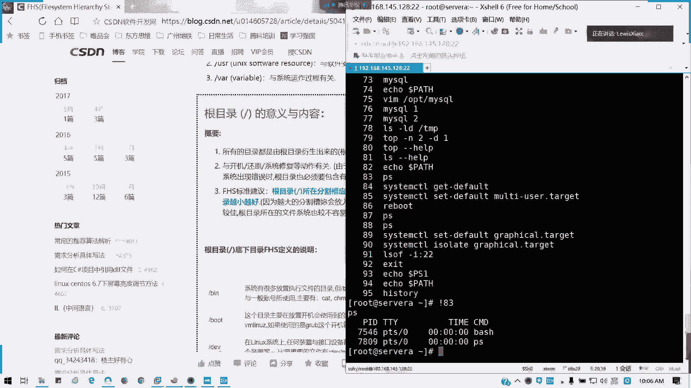

他这里啊fh s定义的一个说明，对不对，有一个说明对不对，对吧，这个网页里面就说明这个根目录它的一个内容，对不对，所有的目录都是从根目录衍生出来，然后与开机还原系统修复的动作有关。

然后他在这个分区朝我们的分割草，就是我们的分区越小越好，对不对，然后安装的软件呢跟着要跟跟目录不要堆在一块，不然你跟不爆的话，你的系统就真的是废了了，就像我们的windows c盘一样对吧。

然后根目录底下f hs我们的文件标准的文件目录定义标准，它的一个定义的说明，就像病我，我昨天是不是用了用了我们那个思维导图，对不对，用思维导图讲了所有我们基本常见的一些目录了，里面的一些用法。

像比如我们没讲到的，像media是吧，它是放移除装置，像m t是挂额外的挂载装置，我们这里是没有讲的，但我们讲的重要的一些对吧，做一些目录，然后还有一些项目就是说非常重要的，就是虚拟的文件系统。

我们的内存里面对不对，还有包括我们loss for是不是犯错误的时候，他一些仪式片段放在这里，然后还有就是pro跟six的话，它是虚拟文件系统，它其实在数据在内存里面，所以我们是如果这些访问的话。

我们就是不能直接访问里面的内容的，当我们的进程对不对，进程也临时信息对吧，还有一些我们cpu内存一些信息，它都不是直接放在硬盘，放到我们的硬盘存储里面，它是放在内存里面的，对不对。

然后还有就是不可跟根目录分开的目录就跟开机过程有关系啊对吧，就这几个你一定要跟你的根在一块，通常我们画我们在分区的时候呢，我们第一个我们在企业里面，如果你学过电子，应该知道我们首先分一个boot啊。

没事切一下倒啊，我们是分我们分区的时候，我们先分一下boot，对不对，boot就是引导的，我们通常说现在新的系统分一个区，以前的分256对吧，然后接下来就是我们的交换分区。

就是内内存跟我就是我说玩万一我们的内存空间使用爆的情况，我们可以通过硬盘就我们的硬盘一部分，然后提供给系统作为一个内存交换，当然这个速度呢肯定比内存慢得多对吧，但通常这个分区呢一般人家做。

如果你的服务器，我们的机器性能够好，你这个sweep根本可以不用建，这个不是必备的对吧，如果你的机器比如说你超过128，256g以上内存，然后你运行的是运行的那个占用率。

你远远不会超过你内存的占用量的话，你基本上是不可以不用的，不用的对吧，但不准一定要它通常是放内存引导吗，如果你这个步骤坏的话，你整个系统是不是起不来对吧，还有一个跟分区，就是我们像一些配置文件啊。

重要执行文件啊对吧，还有什么库啊，我的设备的一些文件我都放在这里，那个分区呢通常的话都是画一个单独给它四五，比如说我们通常说50区100g对不对，然后接下来就是我们一些目录。

比如说像比如说我们这样分出来，我们比如说像一些用户的家目录像home，我们是不是可以单独画出来我们的英文sr，就我们放一些本，我们那些啊可分享的或不可变动的一些文件是吧，因为没有文件。

然后还有些软件系统的软件资源，它的全称叫做unix software resource，不叫user和这里叫做软unix系统软件资源，我们装个软件，是不是我们可以放到这里对吧，默契好像我们开放到这里。

所以这一个我们我通常不读成user，很多人都读错，以为这是一个user，一个用户目录，其实不然，它是一个叫做linus软件系统软件资源懂吗，就装软件，我们可以放在这里对吧，下面的user logo。

对不对，然后还有呢就是我们的v i r，我们的日志存放目录，或者是我们数据库的存放目录，这也可以单独划开了，懂我意思吗，v r o p t也是一样，但我们在默认我们在驾驶软件里面。

我们是全部堆在根分区好了，因为我们实际上我们占用并不大，所以的话我只给了最基本的20g空间啊，懂我意思吗，然后这个是这个文档，都建议大家去看一看，这个文档其实写的挺好的啊。

就关于我们的那我们的那个每个目录架构及那就以及内容都有，不过他这里是用了一个就是台湾地区的中文。

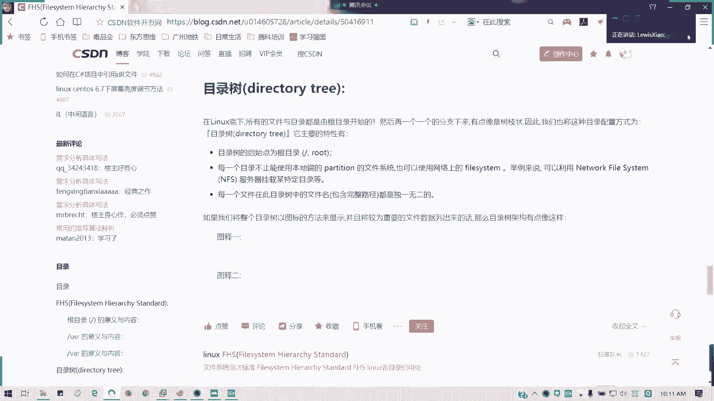

所以的话他他的话就有些像分区了。

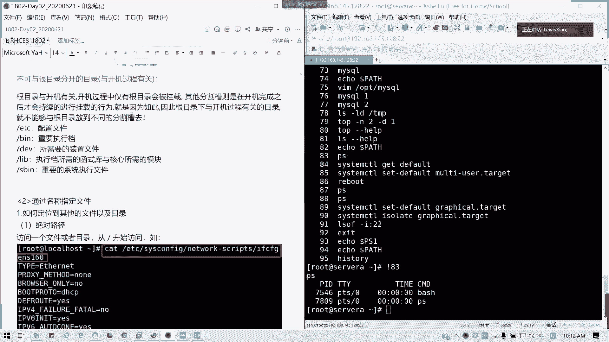

它叫做分割草，对不对，所以这里的话我们就啊我们就变成一个分区就可以了好吧。

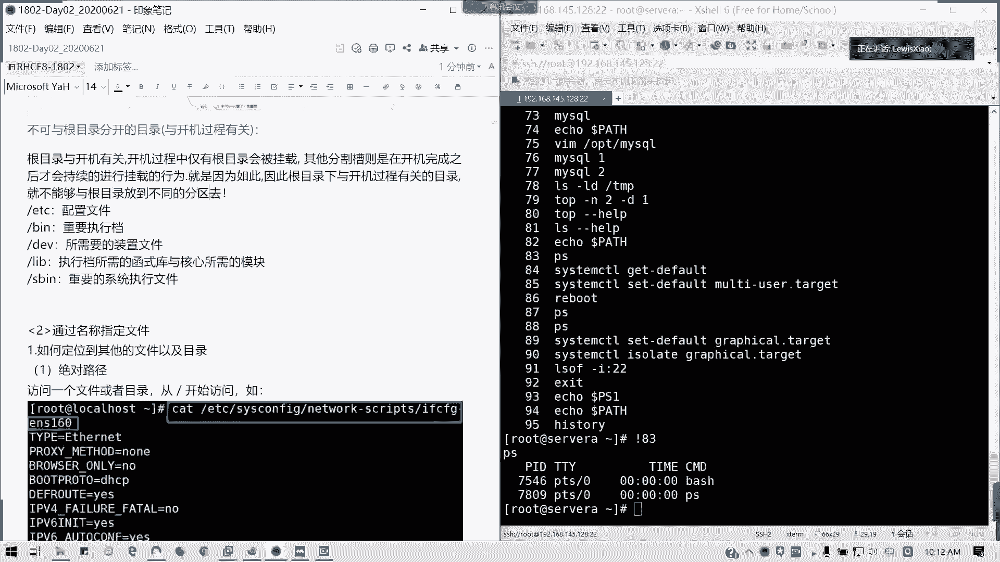

那我们先休息十分钟，大家如果刚来的话啊，把我们的那个环境给打开来，然后我们接下来大概在25分或30分左右，我们会讲第二个部分，通过名称去指定文件，也是我们如何去定义文件啊，如何去访问它好吧。

我们这个我们今天的话每讲一节我会停止录屏啊，停录屏，然后待会我们继续好吧，给大家消化梳理。

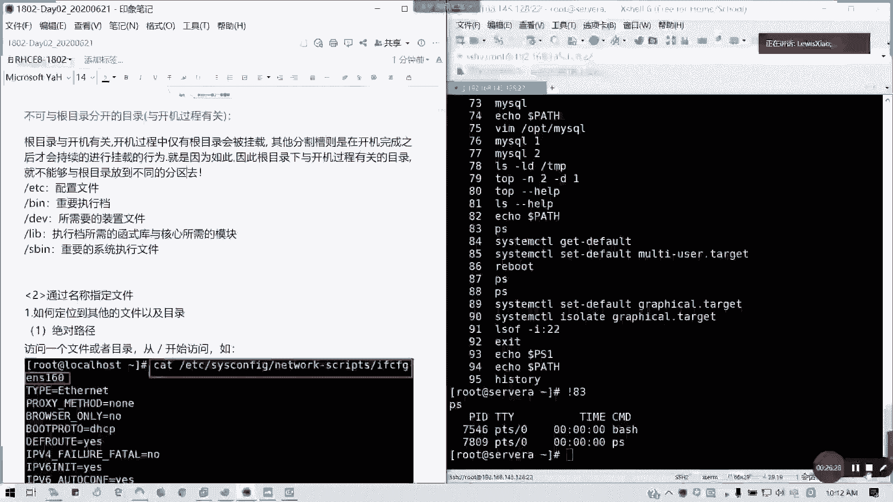