# RHCE8.0红帽认证入门教程：P5：Day02_Day01课程回顾 📚

在本节课中，我们将回顾第一天的核心内容，包括红帽系统的基础概念、命令行访问方式以及Linux文件系统的基本结构。这有助于我们巩固基础，为后续学习做好准备。

## 课程回顾概述

上一节我们介绍了红帽认证体系与Linux入门知识。本节中，我们将系统地回顾第一天课程的重点内容，确保大家对基础概念有清晰的理解。

## 红帽认证与系统介绍

我们首先回顾了红帽课程的学习价值。红帽系统因其开源、安全、高效和多用途的特点，在企业中受到广泛青睐。国产化趋势也进一步推动了其应用。

关于红帽认证体系，RHCE 8.0与7.0的主要区别在于，8.0版本将重点放在了自动化运维（Ansible）上。基础部分保持不变，但新增了自动化相关内容，这部分将在课程第10至13天详细讲解。

**考试信息**：
*   RHCE 7.0的考试已于2020年8月截止。
*   RHCE 8.0考试分为两部分：上午2.5小时考察基础（CSA内容），下午4小时考察自动化（Ansible内容）。整体难度有所增加。
*   认证有效期为3年。全球范围内有效期内持有RHCE证书的人数约为7万，国内约为3万。

## 系统安装与远程连接

我们回顾了在VMware Workstation Pro中安装RHEL 8.0系统的完整步骤。安装过程需要注意IP地址的获取与配置。

系统安装完成后，我们学习了如何配置虚拟网络，以便使用SSH等工具（如Xshell、SecureCRT）远程连接和管理虚拟机。这是实际运维工作中的常用方式。

我们还简要比较了RHEL（红帽企业Linux）和CentOS的异同：
*   **RHEL**：企业版，提供商业技术支持与订阅服务。
*   **CentOS**：社区版，完全免费开源，通常作为RHEL新特性的试验场。两者命令基本一致，但RHEL版本更稳定。

## 访问命令行

人与Linux系统交互需要通过一个“外壳”，即Shell。它提供了命令行交互界面。在实际生产环境中，主要使用命令行进行操作。

以下是关于命令行环境的关键概念回顾：

**Shell提示符**  
提示符的格式由 `PS1` 变量定义，通常为 `[用户名@主机名 工作目录]$`。例如：
*   根用户（root）：`[root@server ~]#`
*   普通用户：`[user@server ~]$`
*   波浪线 `~` 代表当前用户的家目录（如 `/home/user`）。

**PATH变量**  
`PATH` 变量定义了系统查找可执行文件的路径。当输入一个命令时，系统会按 `PATH` 中列出的目录顺序进行查找。如果需要直接运行自己编写的脚本，可以将其所在目录添加到 `PATH` 变量中。

**终端类型**  
主要有两种终端界面：
1.  **图形界面**：提供可视化操作环境。
2.  **文本（字符）界面**：纯命令行操作环境。
两者可以通过快捷键（如 `Ctrl+Alt+F2` 切换到文本终端，`Ctrl+Alt+F1` 或 `startx` 命令切回图形界面）或修改系统配置进行切换。

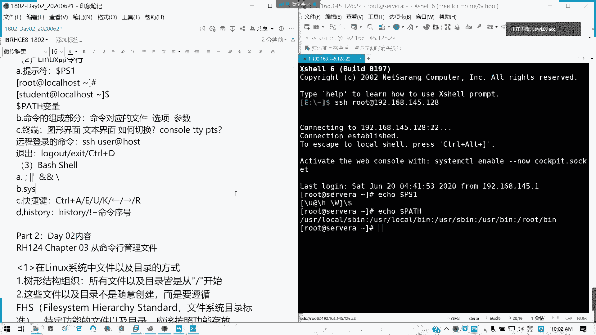

**终端概念辨析**：
*   **控制台**：直接连接在服务器上的键盘、鼠标和显示器。
*   **字符终端**：在文本界面下操作的终端。
*   **虚拟终端**：通过网络（如SSH）远程连接过来的终端会话。

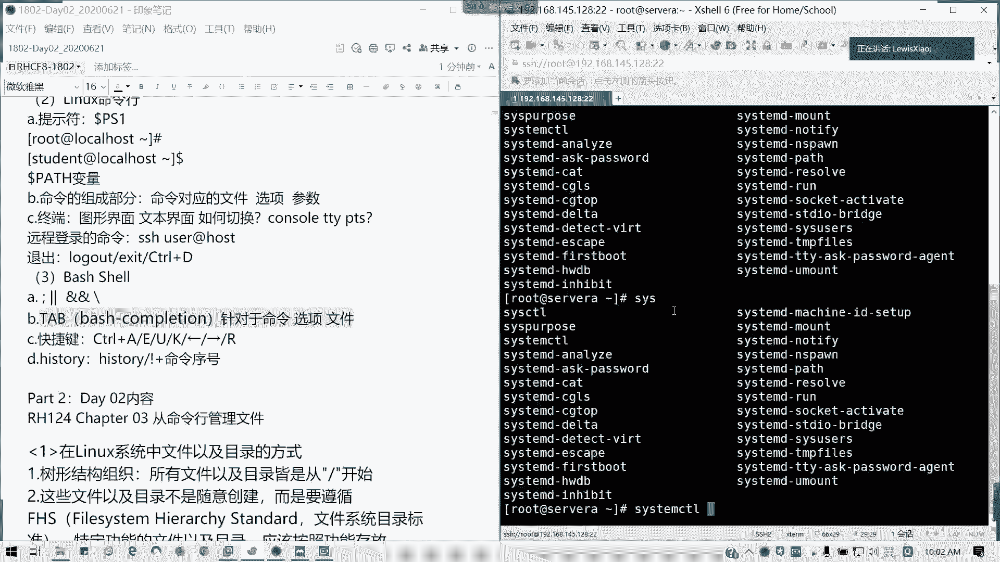

## Shell基础与高效操作

我们学习了Bash Shell的一些基础语法和高效操作技巧。

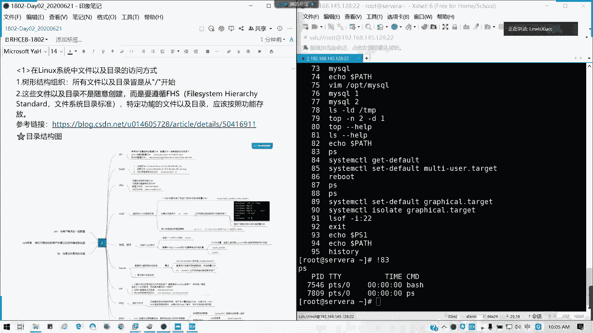

**命令逻辑操作符**：
*   **分号 `;`**：顺序执行多条命令。例如：`command1; command2`
*   **或 `||`**：只有前一条命令执行失败（返回非0状态码）时，才执行后一条命令。
*   **与 `&&`**：只有前一条命令执行成功（返回0状态码）时，才执行后一条命令。
*   **反斜杠 `\`**：用于在命令行中换行，输入长命令。

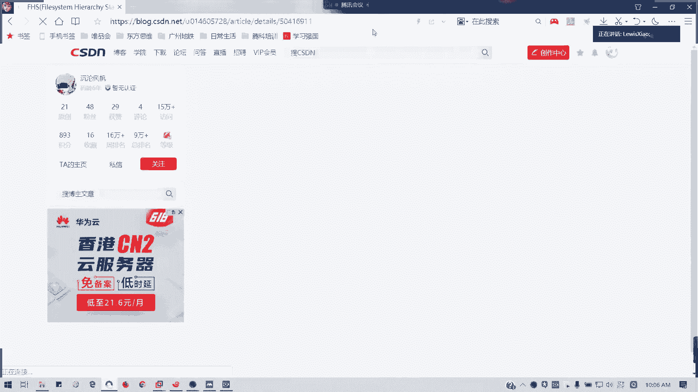

**Tab键补全**  
Tab键可以自动补全命令、选项、文件名和目录名。
*   如果补全项唯一，按一次 `Tab` 键即可补全。
*   如果补全项不唯一，按两次 `Tab` 键会列出所有可能的选项。

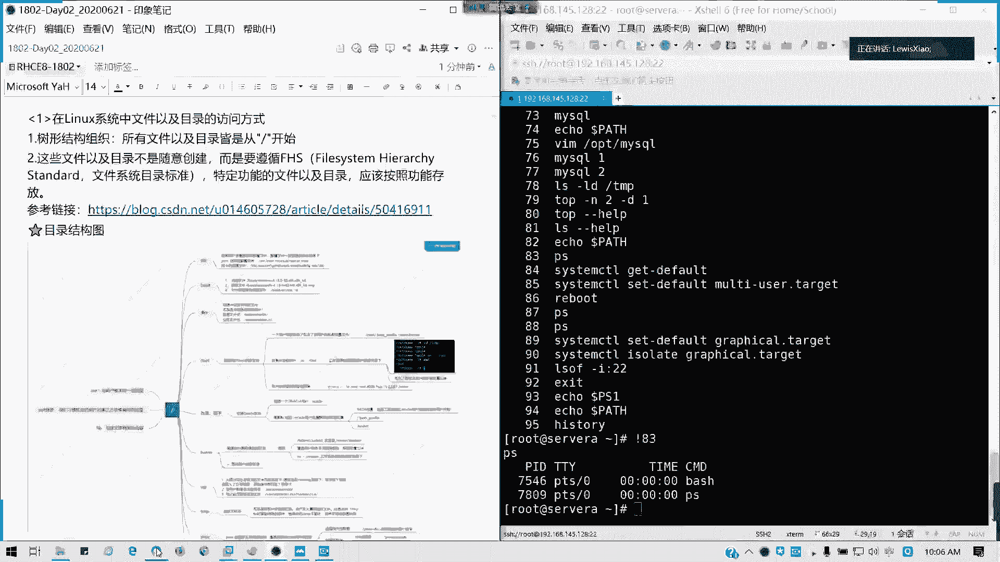

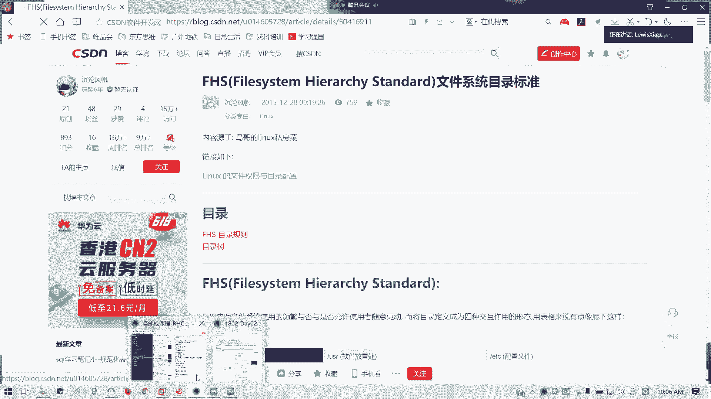

**常用快捷键**：
*   `Ctrl + A`：移动光标到行首。
*   `Ctrl + E`：移动光标到行尾。
*   `Ctrl + U`：删除光标之前的所有内容。
*   `Ctrl + K`：删除光标之后的所有内容。
*   `Ctrl + 左/右方向键`：以单词为单位移动光标。
*   `Ctrl + R`：反向搜索历史命令。

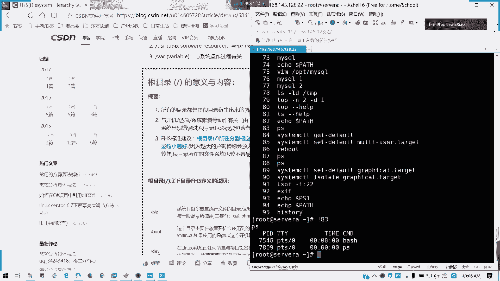

**历史命令**  
使用 `history` 命令可以查看最近执行过的命令（默认保存约1000条）。可以通过 `!序号` 的形式快速执行历史记录中的某条命令。

## Linux文件系统层次结构

Linux文件系统采用树形倒置结构，最顶端是根目录 `/`，所有其他目录和文件都从根目录衍生出来。

这种结构遵循 **FHS（文件系统层次结构标准）** 的规范，特定功能的文件需要存放在规定的目录中。以下是一些核心目录及其用途：

*   `/boot`：存放系统启动所需的引导文件。此分区损坏可能导致系统无法启动。
*   `/`（根分区）：存放系统核心文件、配置文件、重要可执行文件、库文件等。
*   `/home`：普通用户的家目录所在地，通常可以独立分区。
*   `/usr`：全称为“Unix System Resources”，用于存放系统软件资源、应用程序和只读数据。
*   `/var`：存放经常变化的文件，如日志、数据库文件等，通常可以独立分区。
*   `/opt`：用于安装第三方可选应用程序。
*   `/proc` 与 `/sys`：虚拟文件系统，其内容存在于内存中，反映了系统内核和进程的实时信息。
*   `/dev`：存放设备文件。
*   `/tmp`：临时文件目录。
*   `/mnt` 与 `/media`：用于临时挂载文件系统或可移动设备。

在企业环境中，通常会将 `/boot`、`/`、`/home`、`/var` 等目录单独分区，以提高安全性和管理灵活性。例如，为 `/` 分配50-100GB，为 `/home` 根据用户数量分配空间等。

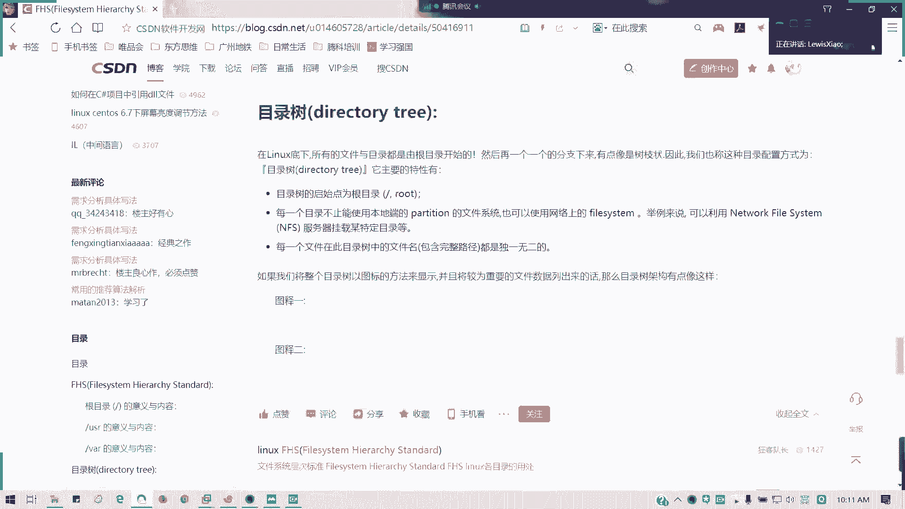

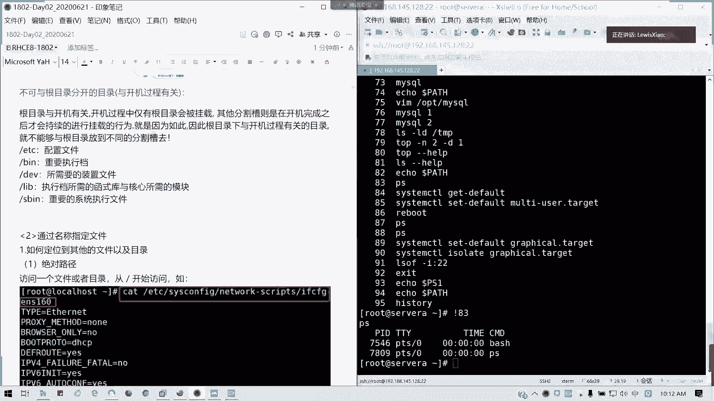

## 总结

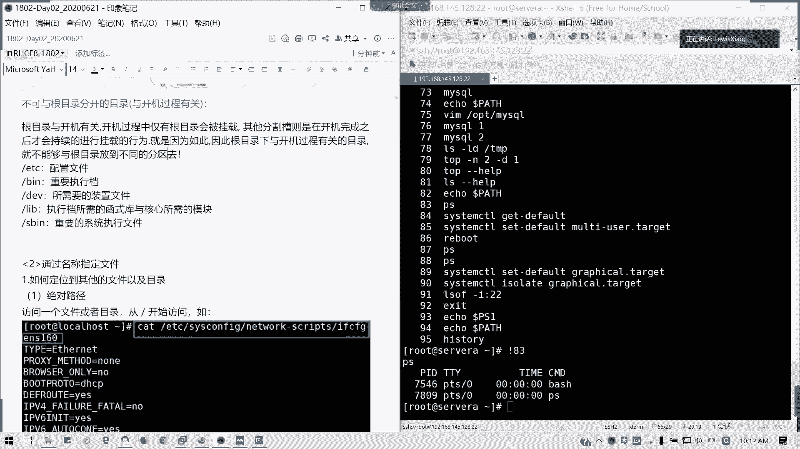

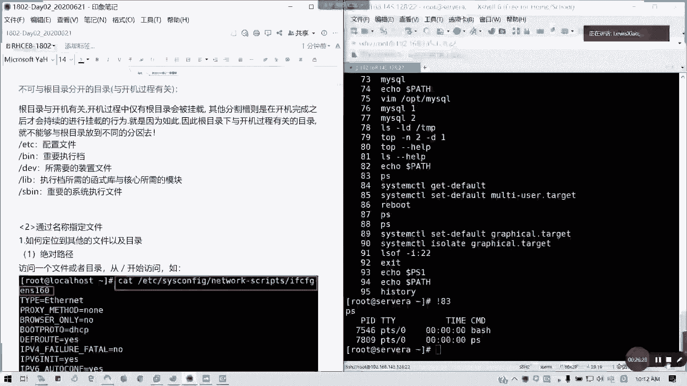

本节课中我们一起回顾了第一天学习的关键内容。我们涵盖了红帽认证的概况、RHEL 8.0系统的安装与远程连接、命令行访问的基本原理、Shell的高效使用技巧，以及Linux文件系统的标准层次结构。理解这些基础概念是后续深入学习Linux系统管理和自动化运维的基石。接下来，我们将开始学习如何通过名称指定和访问文件。