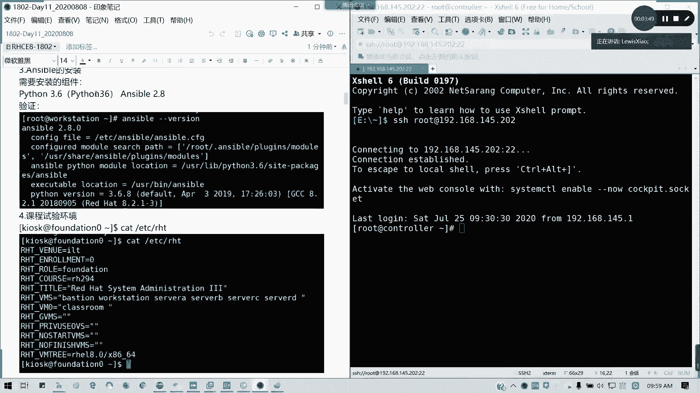
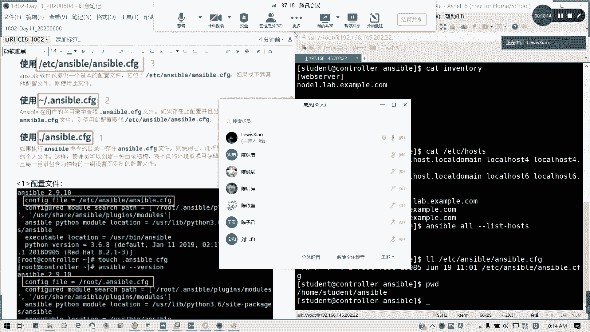

# 2021全新 RHCE8.0 红帽认证入门教程——可零基础入门学习【网络安全／Linux】 - P61：Day11_Day09+Day10回顾01 - IT老表哥 - BV1444y1h7Bx

<该字幕由算法自动生成> 09：56，我们开始录屏啊，开录屏，那我们现在开始我们的课程啊，首先我们sb我们讲了两天了，对不对，我们讲了两天，然后呢，可能我们现在隔得比较久哈，隔的比较久。

我们开始来重新给大家梳理一下我们的一个思路好吧，所以说一下思路，首先ancible是什么，n l用来干嘛的，asap其实是一个自动linux的一个自动化的一个运维工具啊，策划运营工具，我们通过这个图啊。

这个图我们书上的这个图可以来进行啊，说这个图我们来可以进来开，进行一个，可以通过书上的图来进行我们的一个回顾哈，一个回顾书上的图是什么呢，里面啊我们的控制节点对不对，我们控制节点。

然后呢通过发号施令方式，相当于我们一个指挥部哈，下一个指挥部，然后呢我里面跟我躲在那个下面的下属，我的士兵啊，士兵，然后那个建立了新的关系，通过我们的sh我们的一个无密钥连接，对不对。

通过我们的无妙连接，然后去建立新的关系，相当于哎我认识你啊，我知道你是好人，那我以后我连接我这来我这个客户端的时候，我就不需要去进行一个验证了对吗，那就一个验证了。

所以的话然后呢我跟你取得了信任关系之后，我是不是可以就是说哎我问了，我就我知道你是一个好人好了，我可以发号指令对吧，发号施令，然后是去直同步一一台机或者是多台机可以执行我们的一个任务对吧。

但是执行任务呢我们有讲到起点哈，讲到几点，第一个我们的控制节点是干嘛的对吧，空节点主要是承担我们的任务的一个，比如发起方对吧，一个指令的一个提供方好，然后呢宿管主机呢宿管主机主要是我们的客户端。

或者是我们的被控端，可以这么讲哈，一个客户端，一个被控端，然后呢资产清单对吧，资产清单也就是我们的受控主机的一个列表，可以明白吗，受控主机的一个列表，这剧本呢剧本是什么。

剧本就是我们的一系列的任务或者是命令，对吧，ok那接下来我们既然，我们既然要完成这个东西啊，完成这个东西呢，那我们是要来看一下啊，我们来我们来看一下就是如何安装对吧，如何安装，如何去配置我们的环境。

我们来看到我们的屏幕啊。

还有屏幕这里的iso安装，我们这里的话是用三我们这ri 8来进行。

用了ai进行呢，我们首先是不是我们的那个亚语要配好，然后我们是有一个叫做e p l的啊，e p l我们的一个环境啊，e p l我们的一个extra package，我的一个安装包对吧。

但这个课程实验环境呢，我们这里可以如果大家有运行到我们的课程实验环境的话。

那大家的话会看我们可以切到294，但是呢如果我不是我们像我们上次说的一个独立安装的一个环境，就不需要了，懂我意思吧，课程我们的可我们的实验环境呢通常是在考前辅导。

我们接下来的9月6号13号我们会进行两天的考前辅导，也是我讲的哈，考前辅导的话主要是主要就是真的是针对我们的，我们应该说综合练习吧对吧，综合练习综合练习也就是针对我们学的东西。

然后结合我们一个模拟试题来进行我们的一个练习，到时候我们才用到我们的实验环境。

现在呢我们就按照我们的一个自己搭的一个东西啊。

自己搭自己搭的一套环境，我们来进行就可以了。

这一块的话大家安装跟配置都知道怎么办啊，嗯因为其实像上次我们教大家如何去手动的去配置的话。

其实更好，为什么，因为呢你手动去安装配置过了对吧，手动去安装配置过了，那你知那也至少哎我这个应用范围是不是更大的，对不对，所以我把这这些地方我重新复制过来，因为这些的话才是我上周更新的一个内容对吧。

我这个地方先复制过来哈，因为我刚才贴过的地方，那那些知识对那些还是我之前啊，之前就通过我们的一个实验环境来进行的。

这是第三点哈，第三点安装跟配饰颜色，不然后呢，接下来第四点，按住x不知道吧，然后第四点呢，我们的一个初始化配置对吧，初始化配置资产清单，刚才说的我们的一个受管主机一个列表哦，收款组建一个列表。

我们默认的配置文件是在我们看一下ancible，刚刚分手，对不对，按照刚刚分手的话，我们这里是装了二点09：10，现在最新的版本貌似是有2。91了啊，然后呢我们的默认配置文件是在e d c s5 s。

c f g里面，但是我们后面呢关我们的真实考试，或是我们综合练习呢，我们都是会切到普通用户，我们是自定义一个就是以工作目录为单位的一个配置文件，懂我意思吗，以工作目录为配置为单位的一个配置文件。

然后呢我们这个资产清单我现在切到student用户上面，我现在的iso我刚刚分手，是不是已经我们之前是不是在建，已经建立过了，在s在s目录下面，共同目录下面的一个s5 的cg，对不对好。

然后呢我们看一下资产清单，我们自定义的叫做inventory，limitory呢，这里我可以如何，我们怎么去定义我们的资产清单，首先我们是不是可以可以说不分组的单条记录。

不分组单条记录我就直接写域名或者是ip地址，注意域名跟ip地址它是两条不同的记录，在资产清单里面会视为两条不同记录，能明白我意思吗，然后如果是域名的话，麻烦请做好硬解析，域名请做好运解析。

在我们实验的环境里面，因为我们的node一跟note 2我们是没有对外提供服务的对吧，只在局部里面，所以的话我们必须要在etc下面的host这个文件，在这里。

我们把硬件c3 每台机的三台三个域名跟ip全部填到里面，而且这个是不需要去重启服务的，即时生效啊，然后呢说到单项记录，我们还有分组分组的话，比如说像我这个note一是在web server组。

note 2是在db server组，对不对，db sb组，然后分组的话下面就写各自的成员，然后我们还可以通过范围来指定我们主机，比如说note 1 note 2是吧，no一冒号二是吧，或是点点点点。

那点点的范围是更大，冒号都可以啊，一般我们说冒号两个点的话，也就有这个范围的，可以可以明白吗，你这样的话有屏幕的话就一边看一边操作，一边看一边操作。

ok然后呢接下来就是我们还有一个就是祖宗有组我们的大组，对不对，我们大组比如说这里我web server是note 1 d1 ，b server是note 2。

然后我service里面还有我可以把它汇总成一个大service service，冒号球人，对不对，service major，然后后面的话是web service跟dv server对吧。

然后接下来我们会提到一个叫做免密要认证，对吧，免费认证，这这这个地方呢我们是不是在124我们的第十章已经讲过了，我们在这里的话可以按照默认选项来进行处理，但这里我给大家说一下，我们在练习综合练习里面。

或者是我们的真实的考试环境里面呢，是这样子，它会告诉你哪个用户已经做完了，就已经就我这几台机器考，我们的真实考试应该是六台机器练习，我们综合练习我们的我们的一个模拟环境的数舞台，其中也是六台。

但是七台吧，但是有两台我们是不需要去动它的，因为一台classroom destation是不需要去动它的，考试呢是真实考试，我记得是一台啊，有这一台我叫ctrl。

然后其他的serva到server 1，作为a到c为一，然后呢他已经说了，有几台用，就几个用户已经做做了免密的关系啊，所以的话就记得我们是需要去对应的用户，就是像我这里的student一样。

就有些最近的一些啊测试的反馈呢，有些学为什么只得了11分，有些人为什么能过，有些人做到此作，哎这些题目我会啊，这题目我会啊，但是为什么只拿了11分，就是因为他没看清楚的考试说明没看清楚。

到底我这个asible，我这个控制端是要去哪儿做的，懂我意思吧，就具体用户你要知道，而不是说你在root下面乱吃，不是乱敲一通，你经全部做一遍诶，我剧本也能跑，也能正常运行，但就是没分对吧。

s5 用十个部分，待会会告诉大家了啊，12部分我上次也估计有提过，我们30号的话，我们是有那个在在这边跟广州这边是有第二场的考试，而且我看大家考的效果还不错啊，比第一次要好，我们宣城自己公司要做呢。

我们是不是通过copy id对吧。

我是通过copy i d，然后把它对应的密钥复制到记得是对应的用户上啊，对应的用户上啊，待会跟大家互动一下啊，我们负责对应的用户上，然后这样的话我们是不是可以实现免费登录，然后如果是双向的。

那是不是要反过来做，我们现在做的免密是单向的，懂我意思吗，比如说我现在的我是ctrl，我们现在模拟的目的呢就是发号单向发号施令，那我就做单项就可以了，那如果我们以我们有双向的场合呢。

那是不是要两边都要做，比如说我从note 2，我复制文件的note 1，那是如何做双向认证，但这个在我们的练习文件，在我们考试是不需要去操心的，然后如何验证我们的主机列表，and erable。

这哦host对不对，this host对不对，不用干干o啊，我用主机写在前面的，对吧，我们当前只写了两台，其实上如果你i p跟我们的域名啊，跟我们域名是他会认成四台的啊，我们现在只有两台，对不对。

正直之，真实情况下只有两台，我们现在总共四台啊，总共是两台机器而已，我们实际上就是note 1 note 2，如果大家把ip跟域名分开写的话，是有四台的好，接下来我们来看配置文件。

配置文件呢我们说过三个优先级，一个sp环境呢不可能没有配置文件对吧，不可能没有配置文件，那优先级最低的呢就是全局的配置了，全剧的配置文件在哪改一个目录啊。

在answer ec c s目录下面的安全点cf g，如果我们没有为用户或者是没有为工作目录创建配置文件的话，我们默认就在这里了，懂我意思吗，好它当然里面是有个完整的视频，我们怎么可以这么文件怎么写呢。

就在这里面写，ok然后接下来还有一个就是用户主目录，我们刚才我们的全局的生效范围是整个系统好，我们的如果我们在用户的加入里面，任何用户啊不仅仅是root啊，我在里面如果新建一个叫做按点按s或者cf区。

注意这里有个点，因为它是一个隐藏文件对吧，隐藏文件，然后这里建立了之后呢，如果存在此配置，而且当前工作目录也没有我们的ns和cf区的话，就用拉链取代，也就是说它的作用范围是当前用户，当前互动生效。

然后最优先级最高的话就是我们现在的情况，我们现在是不是在home student目录下面膜啊对吧，在这个墓里面生效，优先级最高，它是在它的生效范围仅限于我们的当前目录，但这有个好处，有个好处。

什么好处呢，好这只这样的好处呢是在我们的我们可以应用在多场景，对不对，比如说我这里我ns目录我可以管理，当我吉他111234，我弄得一，诺得二，像我以后就能弄出三栋四，我不同项目了。

我可以再建立工作目录，再放一个配置文件，那这样的话我可以不会互相影响，每次每个工作目录的受管主机都是相同的啊，不同的啊，都是不同的，那这样的话我们是不是可以那个每个角度啊。

就这样是不是我们可以进行一个多任务的配置啊，对吧，多任务我们可以适应多环境的配置好，那这样的话我们讲完我们的配置文件的一个优先级啊。

现在好像还有同学刚进来啊，我看今天是32个人，还有在抖音直播间能够看到啊，看到其他的一些朋友进来，能欢迎一个各位。

然后接下来我们来看一看我们的一个配置文件，这个配置优先级我不能再说了，接下来我们来看一下我们的配置文件的结构啊，配置结构，首先default配置节是会有的吧，配饰鞋，有的话。

我们接下来配置节里面主要写什么东西呢，首先我们的一个资产信贷，有资产清单啊，一个资产清单，然后呢资产清单里面定义了我们的宿管主机的一个路径啊，受管组件的路径，然后接下来我连接受管主机的时候。

需不需要输入密码对吧，税收到输入密码，然后呢还有的就是我们的宿管主机的一个远程端口号对吧，默认我们是通过22来进行我们的远程，那如果我端口发生改变呢，那是不是这里要改对吧，跟我们的一个一个配置文件啊。

在我的跟我们的e t c s s s s s s h d。com贝，跟这里有关哈，跟这里有关，s s ssd。configure，然后我grp一下，井号port对不对，看一下哦，我这里也要打个括号。

因为减号是一个特殊字符，没有啊，这里对不对，跟这里有关系，跟这有关系，如果你受管主机的端口改了，你记得把远程的端口号对应改了，然后还有我们的远程的，我们的宿管主机的登录用户对吧。

做馆主机登录用户就看到底我们是用哪个用户了，但记住我们还是习惯性的不要用root，用普通用户就可以了，用普通用户，这里我们我们记得用普通用户啊。

然后呢接下来接下来就是一个一个什么呢，提前对吧，如果我们用普通用户的话，我们通常来说有些权限也是没办法去执行的，有些权限我是没办法执行的，比如说像我们上次演示的叫f d，对不对，像i disk。

我们就没办法去执行我们所有的命令，那我们怎么办呢，配置，推荐啊他在综合练习，我拿到模拟题里面，它是有一个配置，就是说你用户用户之间是通过哪一种方法来进行提前，通常建议大家用尺度啊。

s u d o用s u的话其实也不不太稳妥，因为你要把整个我们的普通用户我们加到u vivo组里面对吧，加到系统用户组里面权限太大，还不如属度来的。

实在对吧。