# Ansible入门教程：01：Ansible核心概念与环境配置回顾

在本节课中，我们将回顾Ansible的核心概念、安装配置以及基础环境搭建。通过本次学习，你将清晰地理解Ansible的工作原理和基本操作流程。

上一节我们介绍了课程的整体安排，本节中我们来看看Ansible的基础知识回顾。

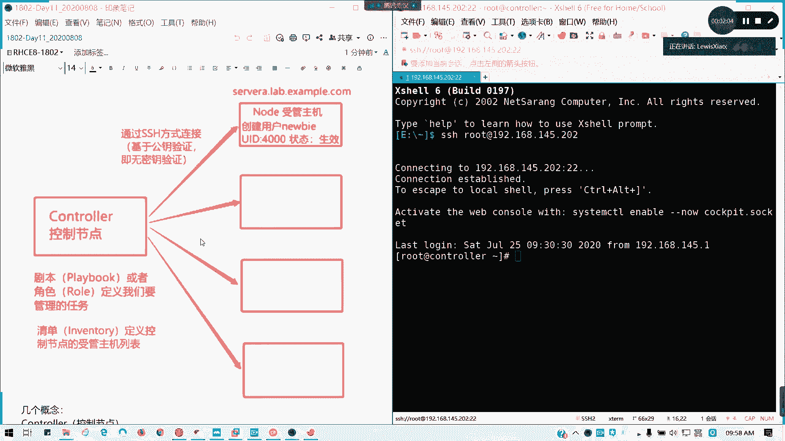

## Ansible是什么？

Ansible是一个Linux自动化运维工具。我们可以通过下图来理解其架构。


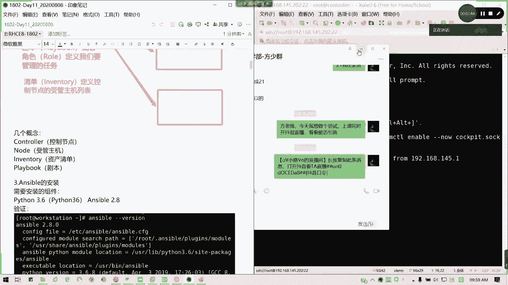

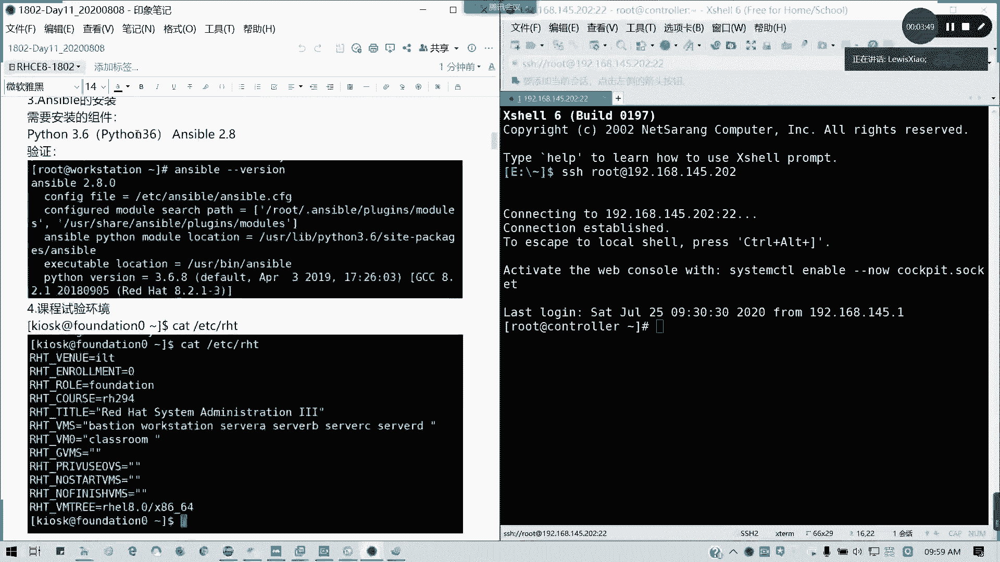

控制节点相当于指挥部，受管主机相当于士兵。两者之间通过SSH无密钥连接建立信任关系。建立信任后，控制节点可以向一台或多台受管主机发送指令并执行任务。

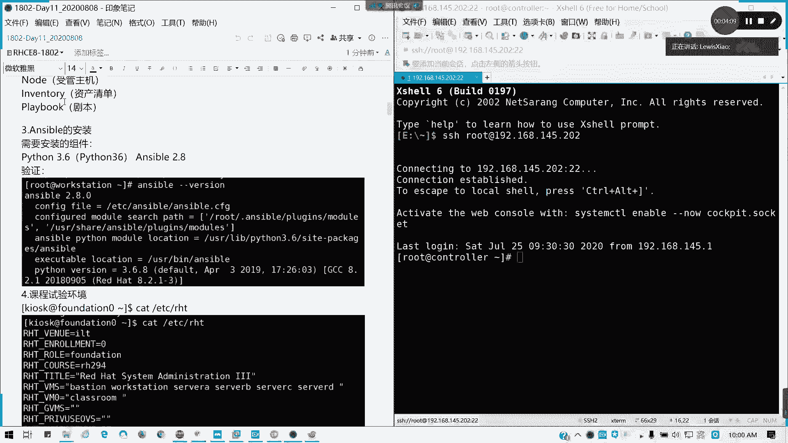

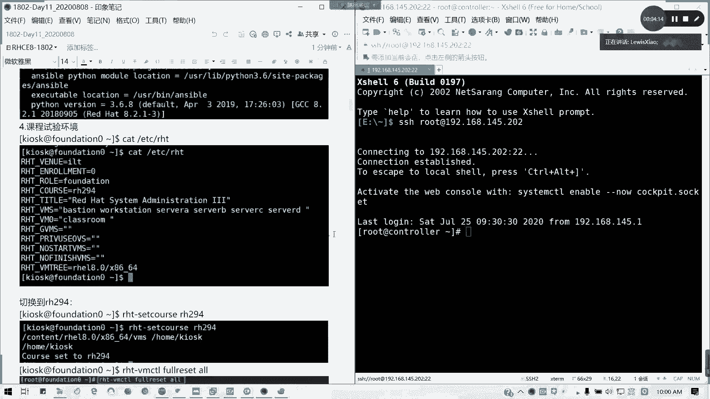

## Ansible核心组件

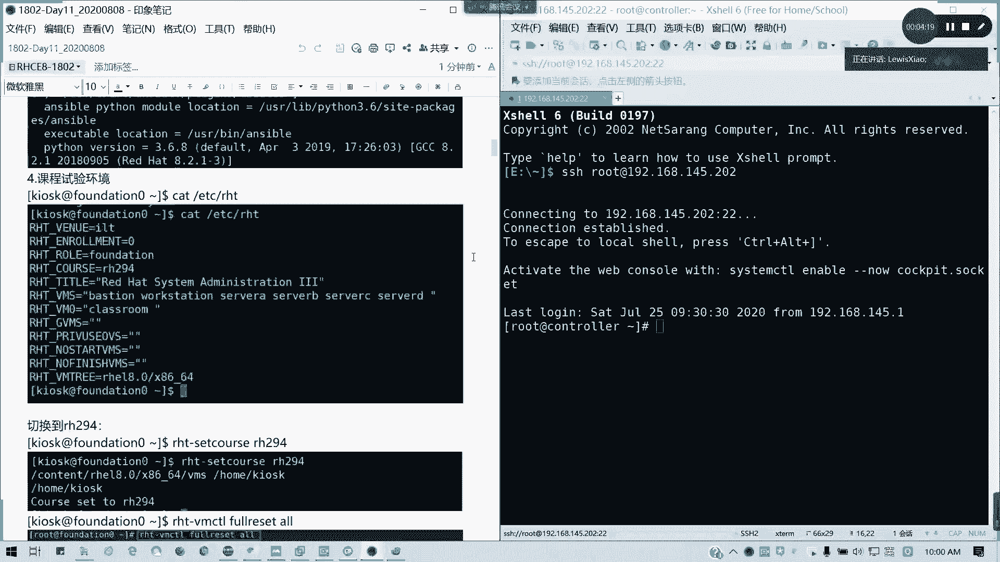

以下是Ansible的核心组件及其作用：

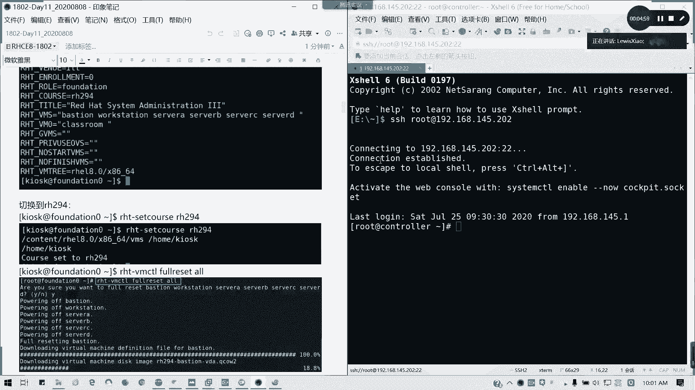

*   **控制节点**：任务的发起方，指令的提供方。
*   **受管主机**：客户端或被控端，接收并执行指令。
*   **资产清单**：受管主机的列表。
*   **剧本**：由一系列任务或命令组成的脚本。

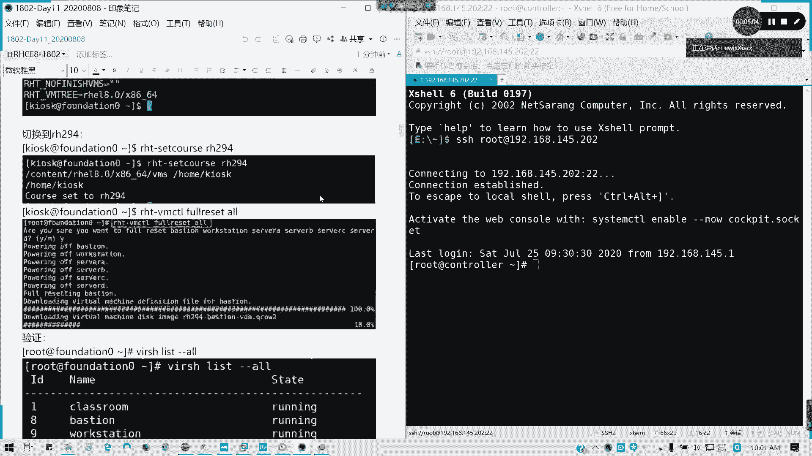

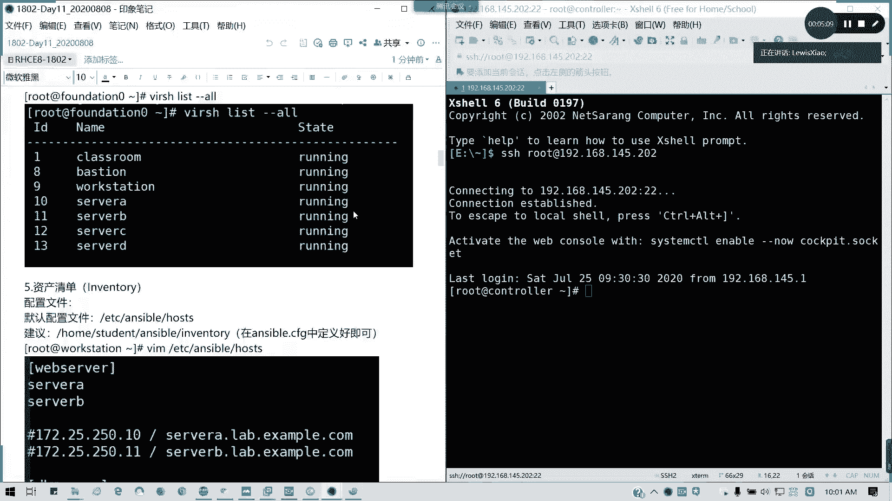

## 安装与环境配置

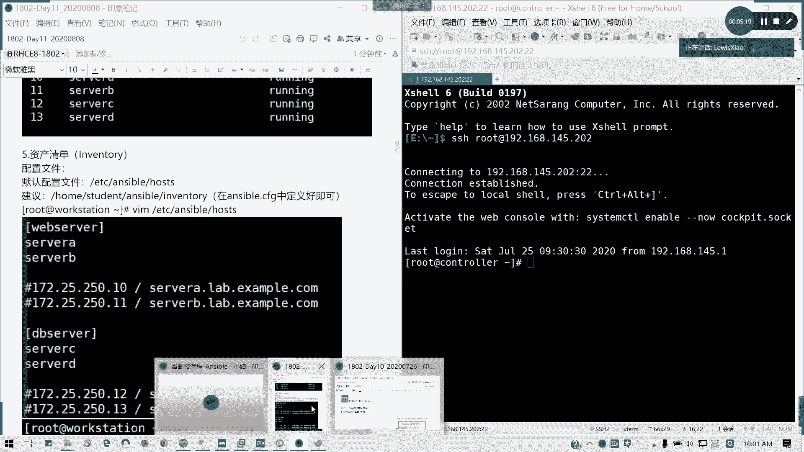

我们既然要使用Ansible，就需要知道如何安装和配置环境。

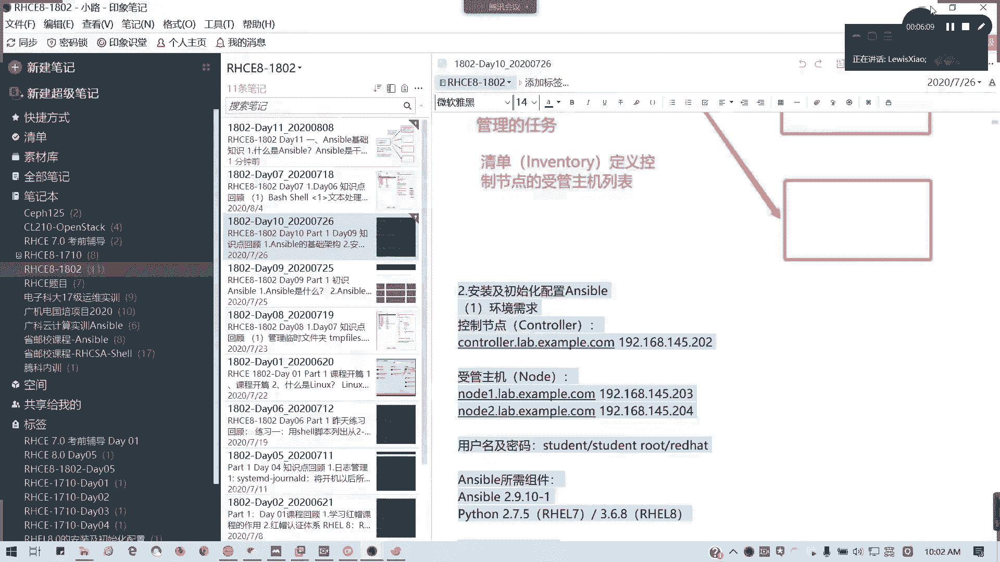

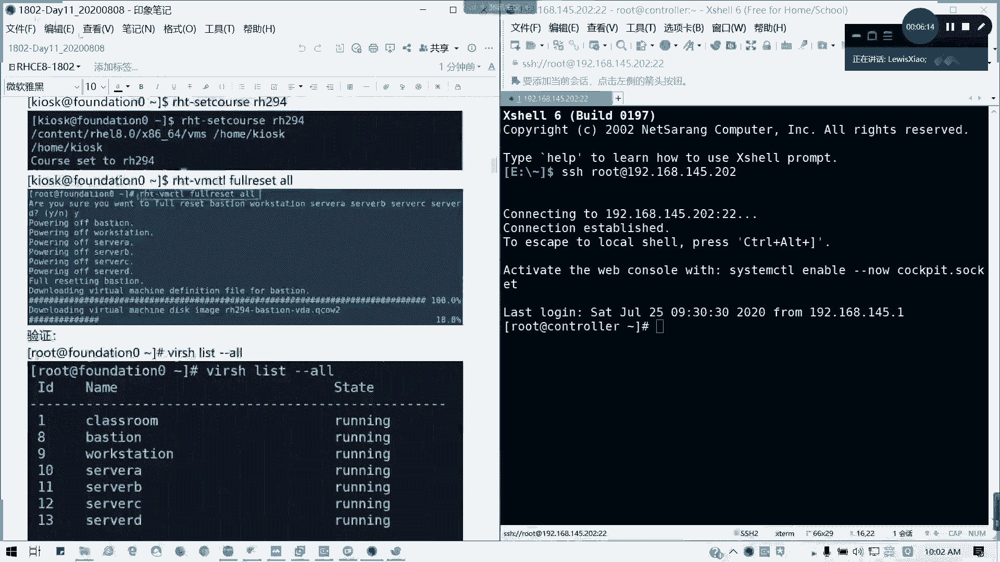


我们使用RHEL 8系统进行安装。首先需要配置好Yum源，并启用EPEL（Extra Packages for Enterprise Linux）仓库来获取额外的安装包。


课程实验环境通常在考前辅导或综合练习时使用。目前，我们按照自己搭建的一套独立环境进行操作。


手动安装和配置环境是更好的学习方式，因为它能让你更深入地理解应用范围。

## 初始化配置与资产清单

接下来是第四点，初始化配置，主要是配置资产清单。资产清单即受管主机的列表。

Ansible的默认全局配置文件位于 `/etc/ansible/ansible.cfg`。但在实际考试或练习中，我们通常会在普通用户的工作目录下创建自定义的配置文件。

例如，切换到 `student` 用户，在其工作目录下创建 `ansible.cfg` 文件。

以下是定义资产清单文件（通常命名为 `inventory`）的几种方式：

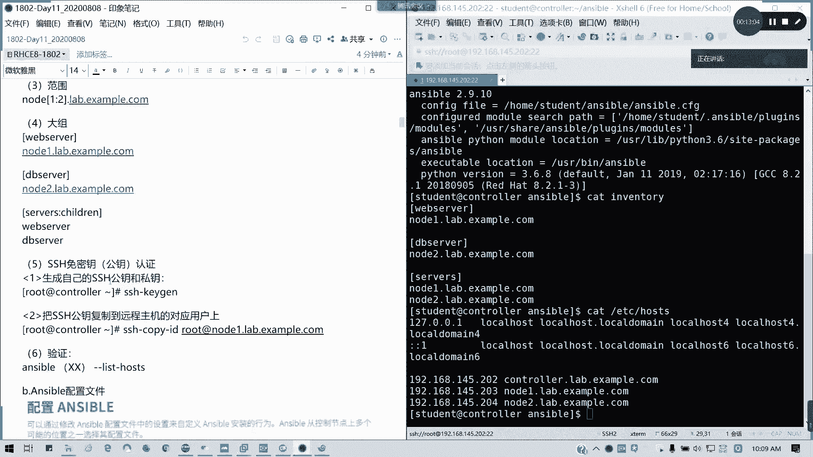

*   **不分组的单条记录**：直接写域名或IP地址。注意，域名和IP地址在资产清单中会被视为两条不同的记录。使用域名时，请确保已做好主机名解析（如在 `/etc/hosts` 文件中添加记录）。
*   **分组记录**：将主机按组划分。例如：
    ```
    [webserver]
    node1
    [dbserver]
    node2
    ```
*   **使用范围指定主机**：例如 `node[1:2]` 或 `node1:node2`。
*   **组中包含组**：可以定义一个大组来包含其他小组。例如：
    ```
    [services:children]
    webserver
    dbserver
    ```

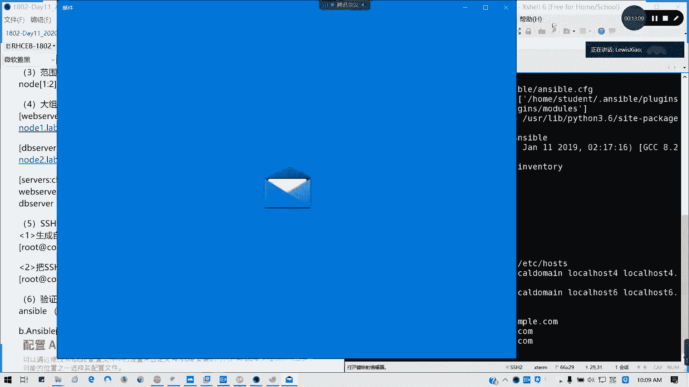

## 免密钥认证

接下来是免密钥认证。这部分内容在之前的SSH章节已经讲过。

在综合练习或真实考试环境中，题目会明确说明哪个用户已经完成了免密配置。你必须使用指定的用户进行操作，否则即使剧本能正常运行也可能无法得分。

我们通常使用 `ssh-copy-id` 命令将公钥复制到对应用户的 `~/.ssh/authorized_keys` 文件中，以实现单向免密登录。

如果需要双向免密，则需要在两端都执行此操作。考试中通常不需要操心双向认证。

可以使用以下命令验证资产清单中的主机：
```bash
ansible all --list-hosts
```

## 配置文件优先级

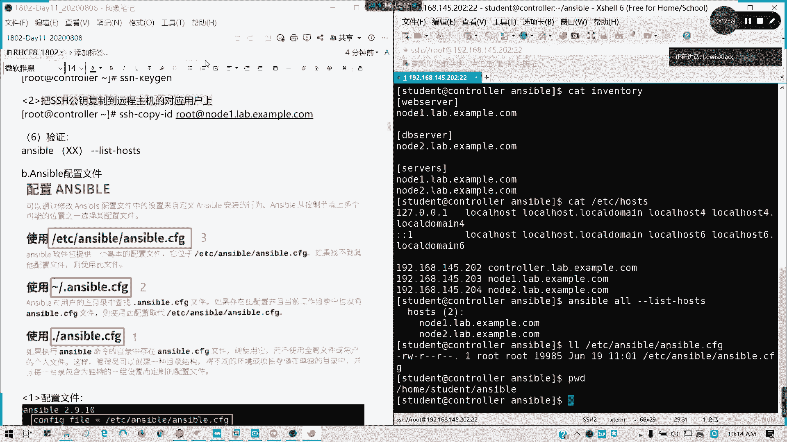

Ansible不可能没有配置文件。其配置文件有三个优先级，从低到高依次为：

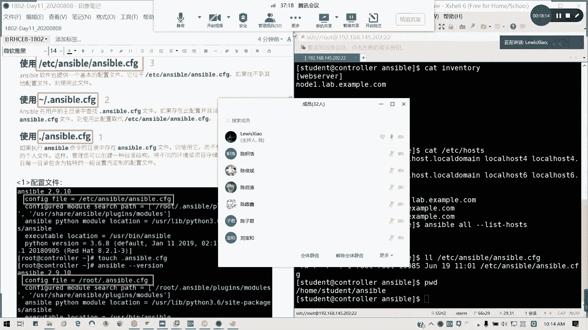

1.  **全局配置**：`/etc/ansible/ansible.cfg`。如果没有为用户或工作目录创建配置文件，则默认使用此文件。
2.  **用户主目录配置**：在用户主目录下创建 `.ansible.cfg` 文件。如果存在此配置且当前工作目录没有 `ansible.cfg`，则使用它。其作用范围是当前用户会话。
3.  **工作目录配置**：在当前工作目录下创建 `ansible.cfg` 文件。优先级最高，作用范围仅限于当前目录。这种方式的好处是可以适应多项目、多环境的需求，不同工作目录的配置互不影响。

## 配置文件结构

现在，我们来看看配置文件的结构。

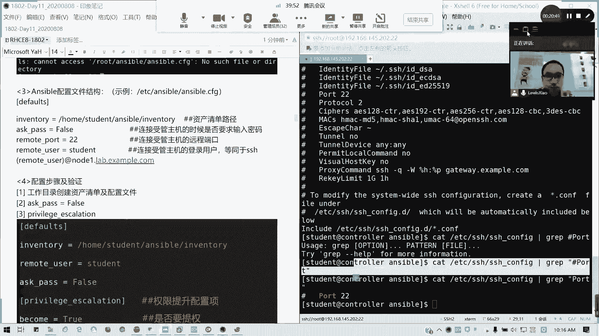

配置文件通常包含 `[defaults]` 配置节。在该节中，主要配置以下内容：

*   **`inventory`**：指定资产清单文件的路径。
*   **`remote_user`**：连接受管主机时使用的登录用户。建议使用普通用户而非root用户。
*   **`ask_pass`**：连接时是否需要输入密码（设置为 `False` 以实现免密）。
*   **`remote_port`**：连接受管主机的SSH端口号，默认为22。如果受管主机修改了SSH端口，此处需对应修改。
*   **`become`、`become_method`、`become_user`、`become_ask_pass`**：权限提升相关配置。当普通用户需要执行特权命令时（如使用 `fdisk`），需要进行提权。在综合练习中，通常建议使用 `sudo` 方法进行提权。

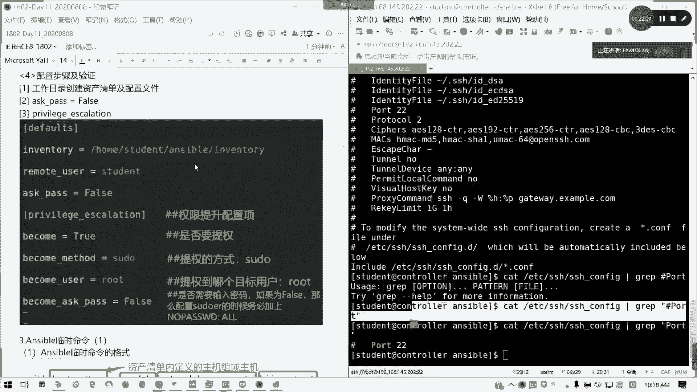

本节课中我们一起学习了Ansible的核心概念、安装配置、资产清单定义、免密认证以及配置文件的优先级与结构。掌握这些基础知识是后续编写和运行Ansible剧本的前提。