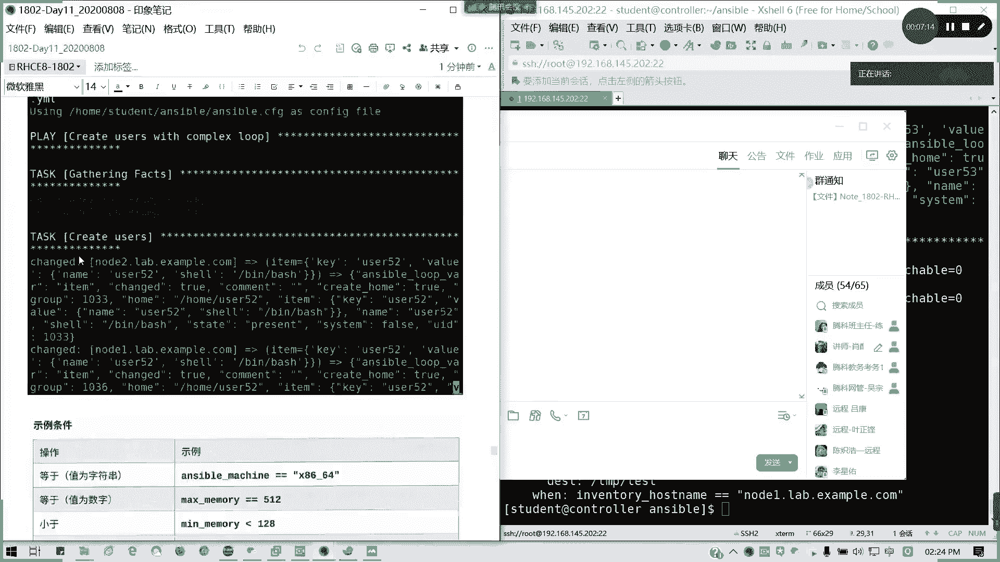
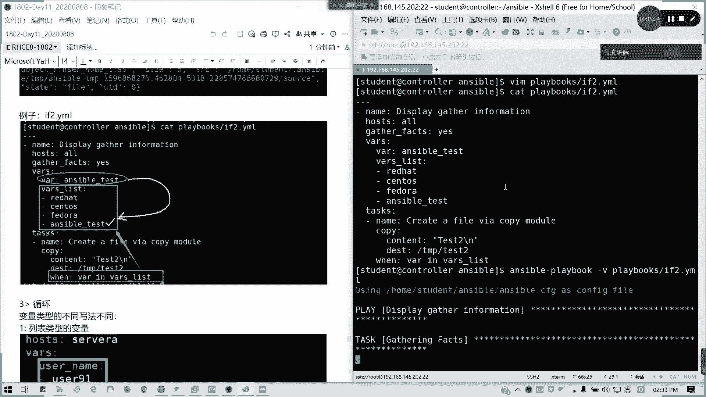
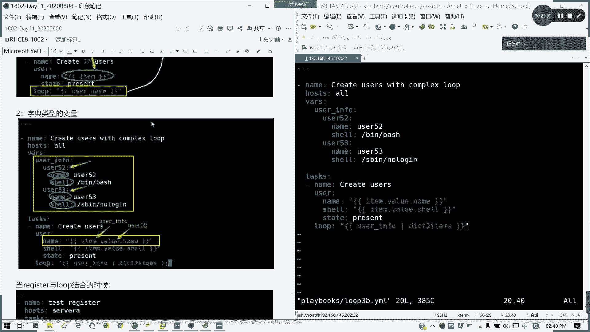
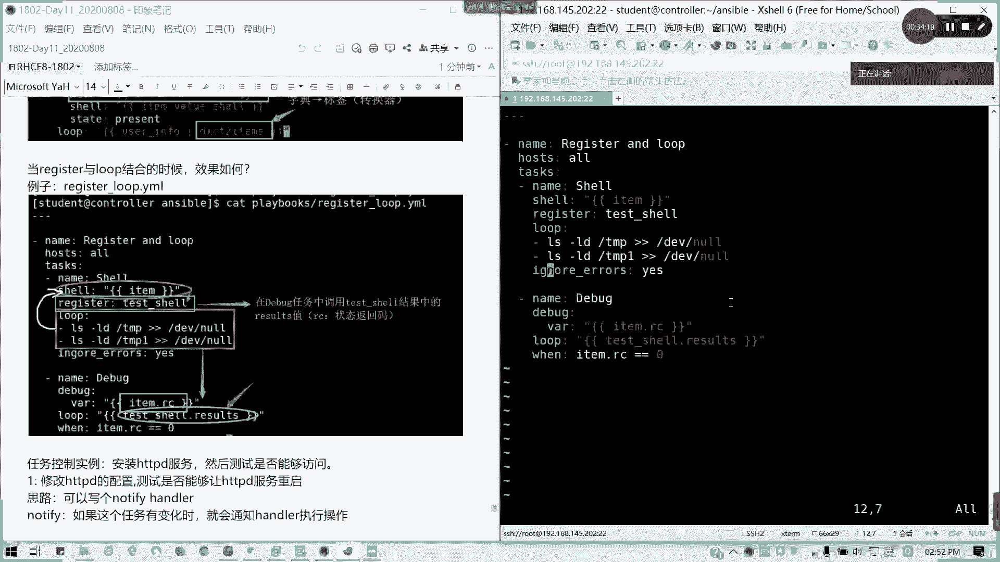
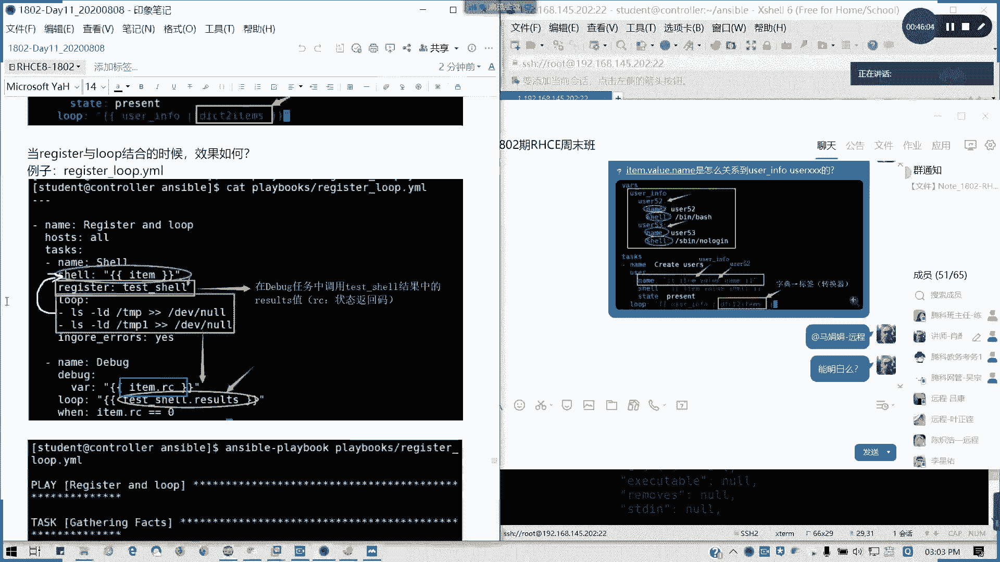
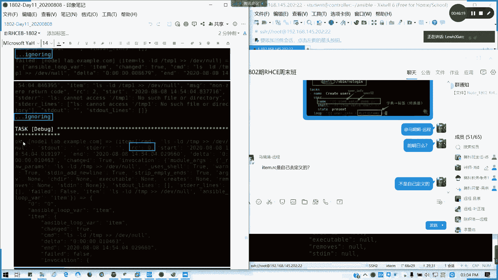

# 2021全新 RHCE8.0 红帽认证入门教程——可零基础入门学习【网络安全／Linux】 - P64：Day11_RH294_Ch05_判断任务控制 - IT老表哥 - BV1444y1h7Bx

好，那我们现在准备开始啊准备开始。然后上午呢我们讲到了一个，我们上午是把1到4章就把前面两天内容我们把它复习了一遍，对吧？复一遍之后呢，我们讲到了一个判，就我就我们的一个判断哈，讲讲到了我们的。

任务控制里面的一个循环，不是判断啊，讲到一个循环。循环的话，像我们简单例子，比如说一次性我创建10个用户是吧？10个用户，然后或者是装进多个软件包，我们是不是可以类似于shall脚本一样。

我们在enssible自动化里面，我们也可以按照我们的我们也可以使用录，对吧？那录，然后。相当于做一个任务控制的一个循环来做。如果他的话，相当于我们脚本在在任务里面，或者是在变量里面定义我们的。

定义我们的那个就是循环里面，我们的列表啊，定义列表，也就是我简单说就是跟需要一样的求值，对不对？就定义定义它的值，然后只读每次读取它的值执行循环体。像这里我是用的最多的就是我们的创建用户啊，创建我们的。

比如说我一次性创建10个用户，我这里然后或者是一次性我装多少个软件包等等的。这些我们循环用的比较多的一个场合啊。像在上午讲的最快，大家应该能明白，有问题的话可以随时提问。然后呢，接下来我们来看一看。

判断啊。看判断啊，判断的话。在这里。写法呢就是你全你全部语句，你的全部剧本写完之后呢，后面用when带出判断条件。我们这里我来讲一个。If1点1某，我们注一下左图所示的脚本。

因为这里有刚刚诗英同学可能就不知道，我大概讲一下，也就个脚本也知道怎么写了，对吧？通常我们剧本啊剧本跟脚本类似，只不过它是用来。哎，您知道你怎么在干什么的吗？呃，知道88号施令吗？对对嗯。发到司令吧。

我们这里的话已经讲到了剧本，也就是多具体的一个任务的内容。那我们这里要开看一看anerible呢这这里给大家再回顾一下anerible这里是我我们剧本有用三，因为是采用样本文件YAML也是类似于拍摄的。

因为其实enser这己拍成开发的啊。基于开始语言开放的，然后它是那个一开我们语句开头是三个。横杠啊，不是破折号啊，在一个横杠开头代表一个剧本的开始。然后呢，接下来我们来看一看啊。

我们之前其实也我们在那个上上周，我们在上两周上节课，我们其实讲到变量事实的时候，是已经。说过说过了是吧？我们在收集事实的时候。discribe in information的时候，我这里hoss它写哦。

然后呢。通常从我们这里的话是不是要收集事实，对吧？注以事实，然后到我们任务呢是什么呢？任务的名称。嗯。那叫做。通过copy。模块来产生生成一个文件。然后呢，我们使用copy模块。内容呢我就直接写一个。

换行服啊，还记得吧？在contentit后面画完符要加一个。杠N的哈大家杠恩。然后我们的目标位置，我们比如说我写在TMP。对。太色。文件里面，然后我记得我上次已已经讲到这个文，对吧？喂。

Inventory。夏滑县ho snap。这个是一个万能变量，对不对？因看魔法变量。就它的一个资转清单，资产清单名称里面有一个叫做node一。点lab点 example点com。

啊。系。

这是其中一个例子。

我备列名我会直接写啊，不需要加引号。如果是那个我们的值。

是字符串的话，那就需要。加引号对吧？这可以理解不？我这里我我我用那个我把图替换的，然把它圈起来啊。我变亮名。在这里。然后我们直在这里。

能明白吧。判断的话，前面的变量名不需要加样引号。

然后还有第二个例子。

大家。

第个例子，比如说我这里我可以判断列表中的东西啊。

列表中的东西我们可以用。关键字应。列表名册里面。可以吧？我来看一下。同样有这个脚本，我来试一下啊。我copy一下好了。

这也是一个叫做例子啊，if一点YL。同样是这个。然后我这然后然后这里呢get facts还是一样。然后我这里定义个变量啊。

mas对吧？定义变量，然后变量里面是列表，是我们可以定义成字典。比如说我叫。万一。然后我叫做呃。Anser protest。毛は。对吧one list里面我列是一个列表。

比如说我这列表里面有什么redhead啊。它的内容啊sOS，然后还有一个叫做。安色宝。Test。比如说这样，然后呢，下面我还是同样的一个任务。

然后这里我就为了跟前面隐私区别，对吧？我就把。这里不没有变，但是我的判断条件我可以这么写了。我可以写叫做。Test。因。哇。List。这里我加一个S啊。这代表什么意思呢？

这里我定一个变量。这里个是个列表。对吧。我把我把它标标些颜色好一点。这是我定一个发变量，然后下面是我定义的列表。然后我现在的这个条件呢。when test in什么意思呢？相当于我。在这里找啊。

我这个变量在这里找，然后呢。

啊，不对啊。我这个应该写错了啊。应该是它定义的变量，而不是它的关键字，就是它的变量名变量名在组里面应该是这么写才对的啊。

就我们的一个变量一个一个变量，这是一个变量组。然后他的一个。条件when v invest list代表什么意思呢？有一张这个它这个变量在我这里查找怎么符合的，他才。输出对不对？懂我意思吧？

他这里刚好有是吧？

懂我意思吗？当判当条件为真的时候，他才会。

执行我们的命令。我们这我我们下面这一串命令。懂我意思不？如果为甲，他就不会执行。我们来看一下上面两两个脚本执行的结果。我们验证我们先验证它的脚本写法没有问题。看一下。

对吧他的第一第一个的话是不是被ki掉了，对吧？我们的note2已经被跳过了，所以它只在note一。

它只在note一上面生成这生成一个叫做TMP。test文件。对吧叫做条件结果。是假，他这里有说了。对吧所以我我我只在那个node一上面执行我们的需要的一个结果。

能听写吗？这是第一个剧本告诉我们的。第二个剧本呢我们来看一看。看一下。都是force啊，我看是什么意思啊。我想想。这一头啊。And support parameters for copy model。

哦，我知道了。我这个文写错了位置哈。因为。这里很多人会犯着是一个错误啊。对吧。文应该是写在这里的，为什么会错呢？很多人在特别是在。我们综合练习，或者是我们后面进行红包官方考试的时候。

很多人真的会弄错位置了。

看一下是不是生成了，生成一个t2，对不对？因为条件成立懂吧？条件成立，那我把这个图重新截一下，因为这个才是正确的。

这个我还记得是跟我们的模块这里平行啊。我这里可能要过家画条横线，对不对？嗯。能听得懂吗？能大概听得懂吗。对啊，因为这个的话是要有那个安ible的基础的。但其实是不是跟我们shall的脚本差不多？

只不过换了一种形式的表达，而且这个是用于自动化。用么这个变量的话，它是网址。哦，这里的。

因为条件成立，所以他会帮我们出他他就执行我们。我们的任务的内容。对吧。因为条件成立哈，所以的话它下面的内容就帮我们创建了。第三个，我们想变亮那些写法。这也不是循环，是变量类型的写法哈。变类写法的话。

变量类型因变量类型不同。其写法也不一样。刚才我们讲了一个列表类型啊，列表类型。列表类型变量。比如说我刚才的那个。我在之前讲的那个列表类型的变量在哪呢？

这是列表类型的辩论，对吗？

列表类型变了的话，这些法是这样子的啊，你在ro前面啊。那我怎么引用呢？

哎，好像不在，我看一下。

这个好像有音不太对，等一下我看一看。

嗯说ね我知道了。我这也是把那个任务写在我我把变量写在前面了。

看一下我的衣服一的那个lo一。

对吧我们把这种是列表，对吧？我们把列表字列表写在前面，把列表写在前面，然后呢。我怎么引用是吧？我这里怎么引用它用。item标签对吧？拉om去引用它变量。然后。循执行循环呢是在。这里。

然后这里在我们喜欢解释因执行上面的这个内容。

这属于列表类型的一个变量哈。列表类型变量的话。能理解吗？

列表类型引用的是item啊。

然后像字典类型的，我们刚才在那个。路ote3。B那种那那那个例子里面。字典类型呢。

这里我们创建字典类型的变量。一个又是52。6453。里面是有name跟shall不同的东西，对吧？它的不同的一个属性。然后怎么引用呢？就是iteer点value点vol，然后后面是有元素。

我们这里iteen volume呢，我可以简单理解成就是一个。它只是转换过转换过来的啊，它指的是什么？我要写一下在这里。我用黄色字标一下好一点，因为因为如果白色的话，以为是命令啊。

然后我们还需要使用一个叫d two items啊，就是使用那个字典。我们在循环的时候呢，我们使用那个叫做。字典转换为。元素的转换器。看不到字。4点。转换为。

这典类型变量的话，必须使用我们的d to items啊。我们上面讲到到一个叫做变量转换器。就字典元素转换成变量哈。

然后当register跟loop结合的时候呢，我们可以这样，就就相当于我可以这样子，我先写一个叫做register跟lo结合的一个例子啊。有没有问题有问题可以提啊？register跟路结合的话。

我们可以写这样一个例子。Register and loop。然后呢，我的。

Host。还是写所有吧。作用域啊，我们的作用主机。所有所所有所有主机都会运行这些命令。然后什么任务呢？🎼我们这里是局部范围的一个循环啊，ro里我我name的话，我可以用。So。然后呢。我们采用。

需ll模块，然后执行。这有横着写，没没太大问题啊。需有模块，然后这里的话我看一下。执行里面所有命令。但这里我们采用变量的形式iteom对不对？然后呢，我将。

上面执行的结果啊存到我们这叫一个叫tttra的变量里面。然后它的循环铁，它的变量，它的那个。变量来自哪呢？我喜欢以下两个命令，LS杠LD。TMP。然后把它丢掉，对吧？然后呢，还有1个LS杠LD。

我们可以写一个。不存在的目录啊。T比如TMP1到DV now。然后呢，这里我可以。我可以加一句忽略所有错误。因为如果他碰到错误的话，他不会往下执行。但忽略错误。这个的话。

我们后面会讲啊ignore errors。就无论你你遇到错误的话，下面还只要啊我们的剧本还会往下执行，这是第一个剧本。我是我已经存register，我们存到了tex shell里面。然后呢。

接下来我们第二个剧本叫做debug输出啊。debug个模块，然后通过变量的方法。我们来可以调用我们。命令里面他有一个。RC值我们是不是我们有一个。任务推我们的一个状态返围嘛，return code。

再写一个几个学员条件。循环的标签啊，循环标签里面写什么呢？t shell，然后我要返回一个result的一个结果。它其实我们要引用的就是result这一个。这个值而已啊。然后在这里加一个when。

当我们的。RC值等于0，也就是任务正常执行的时候，它才会输出。

这结合这将当就是这个只要这个剧本呢就相当于我们一个register跟我们循环去结合一个例子。我上面把它存为这个变量。然后循环体做这个哈。执行下面两条命令，然后返回它的IRC值。

我这里写错了啊。不CR是VNR哈，这样他。用他VR的一个。

参数。

我将这个结果存起来。同样这里我们使用一个循环。

例子叫做register。下划线。骆吧。点鸭猛。我们看一下执行结果。有问题啊，看一下。哦，云诺写错了。

他这如果不写inno errors呢，他这个任务应该就停止了。它这里的话，第一个是执行成note一note2是不是执行成功的对吧？它的第一个就TMP我列出来东西，我话是不是成功的，它的RC值是不是零啊？

对吧他最后执行成功，然后他把sll。你们register到一个变量里面，那输出的时候是不是一个。就是说我会以调它的输出结果，对吧？当的IRC值等于0输出它结果，然后note2倍。他他的那个。

第一个第二个结果是被忽略掉了。我们用杠V，所以说看的会比较详细一点啊。如简略的结果呢，我可以看一下，我这里不加杠V，看看什么结果。不钢V可能会好一点，不然的话看不出来。

你看第第二个它就显示强示售货信息嘛，它这个已经被跳过了。第一个没问题吧。这我们的ite它作为一个元素在这里啊。所以为什么我们引用是艾特吗？对吧？然后他用debug是输出我们刚才正确的一个。

就是说刚才RC等于零的一个结果。那后这个已经被跳过了。我这样打啊note2。DV nowus shell等于数，我看一下啊。哇，截图还是尽量保存全一点。

它里面已经有标明说。到底我我跳过是哪些部分？对吧。就他的他把那个RC值非零的部分。已经跳过了。懂我意思吗？所以它执行很长，因为我们调用。

我们将显示我们将命令执行结果已经存到了我们的一个tex show变量，然后将RC等于零部分进行输出。

然后我们这里我们现在可以啊。用现在我们的一个。我们学到东西啊，现在可学到东西。我们现在学到掌握知识点，我们可以来参考一下写这样一个任务啊。item是吧。艾特怎么使用。

后面都可以跟什么叫阿RC怎么定义出来哈。

刚才刚才那个。保证那可以问的这个问题。我这里关门扣了它item是怎么定义定义出来，item是循环里面。定义的每个元素哈每个元素我这里的话，我是这是错误的哈，这里是一个no，我要我要把它改一改。

在ite特里面。在我们循环体每一个都称之为。艾特吧。在循环体。ro中。定义的每一。每一个项。都称之为。艾特。然后iteam后面。包含的内容。要根据。每个循环体。艾om的元素。是不同的。像我这一个循环铁。

我们上面这循环铁，它的item是这个。对吧它itom是命令，但我下面的循环铁呢。

他的item就是一个执行的结果啦，好吧。是不一样的对吗？那我们看一下调，我们看一下模式之后，它这里它需啊它需要它的item是这个。这先撤销啊，然撤回一个消息。

然后在下面的ite特呢。就相当于我命令执行的一个结果了。我这样拆分能够清楚吗？我这样能拆分我这样拆分过来，它的item能清楚吗？这里的item是等于什么？等于这一大块的东西。

那像U怎么关联到user叉叉叉的是吧？item点value点n就是我上面的这一部分。

它是将字典转化为变量。我把这个问题我把它把它贴过来就清楚了。能看清楚吗？在补这边。马娟娟能可吗？这样看就清楚了吧，特别是你看你运行面执行结果，它的iteom到底定义在哪的，对吧？

我们所有循环体都可以用iteom来调用。

就用用Iite来调用我们每一个lo loop里面定义的内容。但是每一次的调用的元素，你要看具体。具体的执行结果而定，而不是就是单一这个内容。

比如说这里的ite刚才说这里的item是每条命令啊，嗯对啊？我丢掉它的lo里面的每一条都是item，对不对？但是到了我们我们把那个结果存到了一个test变量之后呢。

它的item它的循环铁的item点result又不又不一样了，对不对？他来他是执行这么个多东西。懂我意思吧？说不一样了，完全就不一样了。我问一下他啊，可以理解不？

能懂吧？

那如果OK的话，我们来看一下。不是自己定义的。

不是自己定义的啊。看到这里有个阿C直媒。

他命令的结执行结果必然有它的状态返回码。

对吧每个命令的执行结果是不是必然有它的状态返回嘛，这个值不是随便去定义的。我刚才我为什么把结果存在里面变量，对吧？他这有1个RC等于0嘛。对吧或者下面这里也可以看到吧。

对吧我们的命令的状态反而状态码等于0，所以的话不是自己去定义的，是根据我返回的内容，我们debug是不是可以返回到命令的返回我们变量的内容，是不是？然后在里面挑元素啊。

所以它是它这个IRC值是作为item的其中一个指向。懂我意思吗？可能比较难理解啊，可能会可能出可能对这个不太熟悉的。过刚听到的话会比较难理解，会不会有人绕。但其实让你个百分把它把命列出来一看。

把命令的执行结果列出来看它是不是这个RC是不是ite里面的一个内容。他都大瓜破起来了。懂我意思吗？所以我直接调用它，为什么我后面加一个判断条件，这个语句的作用就是当这个I这当我执行的命令的结果。

返回的里面的一个返回状态嘛，元素的值为0，也就是我命令正常执行的时候，把命令的结果把命令运行的整个结果。导出来，如果非零则跳过。

能理解吗？对。用点。可以这样两种写法。艾特点2C。就是它的指向嘛，还有一还有或者。Item。然后这样。都对。两种写法。我们就相当于一个叫做aner fat。如果你知道anser fat的话。

再看一下过程啊，来。

I多保了。

纸项啊。相当于啊艾特点net point它里面的一个指向，是不是相当于我们里面的一个字典啦？就相当于我user。info里面的。优法52里面的一个。name值。对吧。可以理解吗？两两个点就是它的往下嘛。

往往往下对不对？我们这里就可以看得清楚了。这是字典啊。有没有问题春娟那边？其他人有没有问题，有问题可以提问，没有问题请扣2。有问题吗？我这里少打两个字，应该叫变量转换器会好一点。

哎，怎么贴失败了。

过程啊哦，你要看过程。

我看一下这个啊。我看一手，我2跟53在哪里？

等要看是这里是吧。item是这个，然后其中的一个vole。然后其中的然后vol里面是不是点代吗？或者是我们看下面item的值点就是。Item。他这里我们可以看得更清楚一点。

一切都是看我们的一个执行结果，用杠V来看执行结果我就很清楚了。就为什么字典里面是item，然后后面是取volume的值。对吧。你能看清楚吗？面。对取一个字典里面。

就我取一个就变量组里面一个字典的一个值嘛。如果看这个执行结果就应该很清楚了。就看这个券子的，刚才我可能可能没没详细去去分析哈，那这个的话应该就很清楚了。

这5253好，理解了一些是吧？我就把这个图我再我贴过来吧。但会好理解一点。item点vol。点n是什么意思？

其实这个就是我们第四章讲的内容。这是关完了。关就关书的。哎，怎么截图为什么会变成这样？やすか。对啊，也这是哦看官网的，其实也是可以这么理解。我就截过来吧，iteon volume的 name。

然后这里的话。这是一个叫做item点RC哈。我发现我的复制粘贴功能是怪怪的，番茄之那个这照片是直是坏掉的。好，我们讲这么长时间，我们来。

那家写这个例子吧，我们先不看讲义上内容，我们来考虑这个例子，好吧，安装HTDP服务，然后我要测试能不能访问。比然后思路，比如说我这里的话，我要加一个思路啊。变体。

大家可以写一下吗？试一下，动不动手做一下练习。然后我们趁现在也休息一段时间，好吧，OK。