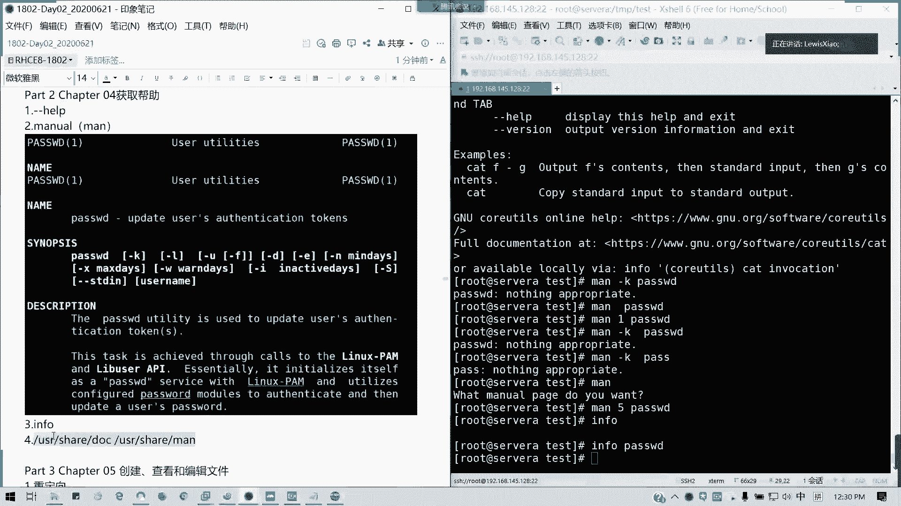

# 2021全新 RHCE8.0 红帽认证入门教程——可零基础入门学习【网络安全／Linux】 - P7：Day02_Ch03c_Ch04_获取帮助 - IT老表哥 - BV1444y1h7Bx

补充一点啊，刚才那个toto我刚才说错了，不是文件数啊，它是一个文件总共的大小。然后如果干全里面的话，用DU是可以统计每一个的啊，每一个文件这个是没有问题的啊。啊，每个都有多多嘢啊，不括就碰到零了嘛。

文件夹一般都是零嘛，一般都是零，它是只是一个就一个相当于一个特殊的一个文件。对。

就是说你们如果今天刚来啊，刚来的话，就像环庆的话啊，可以各位同学，如果能够帮的话，也帮一下他好吧。因为我们昨天笔记已经说过了，对吧？然后呢，那个如果是说电脑电脑配置不足的话，可以问我他到底要需要哪些。

我们在昨天的配接昨天的笔记里面也有，至少16G内存，然后最好有固态硬盘，然后CPU的话，这个重要性倒不大，因为CPU基本上现在过剩，对不对？好，我们讲软硬链接啊，制作链接文件链接文件。我们其实呢。

你类似的东西，就winowwindow我们的快捷方式，对不对？但快捷方式有区别哦。简单两句话我可以搞定啊，这个原理的话有点复杂哈，这个原理的话就这怎么怎么访问啊，我会待会会稍微解释一下。

软链接完完全全跟windows快捷方式是一模一样的。也就是说它只是一个指向，对吧？它这个文件并不含有任何内容，只是一个指向，指向你需要访问的一个文件。但是我的那个访问文件不存在。

那是不是我的纸箱都失掉了？能理解吗？这是快捷方式，是不是快捷方式，我们是windows快捷方式，是不是指向到一个文件。然后这个文件我删除的时候，是不是提示说那个快捷方式指向的文件已删除，不能访问。

这就是我们linux里面的软链接一模一样。但是有一些硬链接。音链接呢。相当于说它是两个文件同时指向一个区块。同一个区块对吧？只要区块的内容。不被删除，你哪怕你一个文件，你哪怕两个文件你删掉一个。

你还能照常。懂吗？这是简单解释都懂了吗？这样子。一个是快捷方式，纯指针，一个是两个文件，你指向是同一个区域块内容。然后你只要区域块内容没有，你你修改任一个文件，它你。的那内容你修改成另你修改另外一个。

你你看另外一个是不是也跟着改变，对吧？然后你其中一个文件不存在你另外一个还你这个文，你的内容还在，对不对？懂我意思吗？除非你所有的人都没有了。那我们怎么做呢？比如说我们的那个passWD是吧？

我们做转链接是吧，IN杠S passWD。

s对不对？我们这次做一个软件接，然后硬链接呢就是直接LNLN命令它是linkLINK的接线。

好的。

对吧我们看一下。看一下我们的这个硬链接，它是没有指向的一个箭头的，但它的一个。

文件的对应的一个数目。是不是并为二啊，对不对？两个文件指向同一个区块，对吧？然后shop这个就还是一，因为它是一个新的文件，对吧？新文件，然后它只存粹指向。那好，我现在我把。我把文件改一下。

我把它改一下名好不好？就改一改名，我们就看得出效果了，对不对？我们看一下发WD。是是这个文件对不对？OK我把我此时把passw改一下名。看一下。这标的红色。那我们还能乱反问呢。没有了，对不对？

它指向的一个iod，它的文件名就不见了，那是不是它软它的那个软件就已经失效了，现在快捷方式也就找不到目标了，对不对？但是我看一下had。还是有对吧？所以我们看一下那个。我们看一下In就知道了。杠I啊。

但I才看挨弄的。你看它的passWD2跟。pa的iod是不是一样？那是不是证明它指向的同一个文件，同一个区块，我访问的都是这个内容，对不对？只不过他文他只要这个区块在你这个文它记住文件名，对吧？

它记个文件名，他什么无所谓，对不对？但是这个shop呢它的是另外一个。对吧我安卓执已经发生了改变。然后我现在这个文件已经不存在了，那是不是它的指向就没了，懂我意思吗？这是简单的理解。

然后我们文件的访问原理是吧？硬链接其实它是创建多一个指向，也就是条条道路抽龙马嘛。比如说我我A路径，我可以访问它，那我是不是创建一个B路径啊，对吧？都指向同一个东西。然后只要这个区外不变，我我A路径。

我这个我现在修路，我不要了，那我B路径是不是照常能通达，就是硬链接的一个原点。然后呢。软链接就这快捷方式对吧？快捷快捷方式。就是说我只我就是相当于我在别的地方，我我写一下牌。比如说我这里是腾科是吧？

我就在我我比如说我在那个天河体育中心，我指向一这个牌叫腾科，对吧？那腾科这个东这个地方如果不见了，那他的指向是不是没变，他只有个提示牌的内容是不是没变，那在地点就不存在了，对不对？是不是一样的道理？

因电接学校相相对创建一个。多一个访问方式啊，你可以看一下下面的访问原理啊，我们的。这层文件通常。首先是不是我们访问他的。他的那个连接是怎么访问的？说首先是看我们他是首先啊就看我们的那个根号。

就我们根本就in，然后访问的根本就brolock，对不对？根据我们in它的一个索引去访问我们的内容，对不对？然后内容里面内内容找到，那我们要访问TMP的pawD怎么访问呢？

TMP test pass pass它的路径是这样子啊。先访问根是吧，从根开始变历，对不对？是不是对不对？我们所有的文件系统是从跟开始的跟你看到它它的那个in值，然后指向它的brolock就访问它区块。

它区域块是不是列出会列出我所有的文件的文件夹或文件的内容，对不对？好区域块，然后找到TMP的那个in为2，那是不是进入它的idode，对不对？上面是brolock，上面是区块，下面是我们的索引。

然后访问到iode里面的tab的属性，对吧？属性，然后里面它有一个属性里面就包含我们下一个文件的，对不对？可以这么理解啊，因为它只相对于快捷方式，然后一个是硬年级指向nod，这个是可以这么理解的。

其实我这两句话就简单给搞定了。只不过对初学者我们还是要讲一下过程，对不对？然后iod，我这边我看到它block里面是不是列了test跟test一这文件，对不对？文件夹，对不对？那他的test3。

然后它是iod是，那我们访问三就又到test这个iod对不对？然后网上这样子下来，然后它的属性里其实就是上面拥有者啊，什么属性，对不对？然后一直访问到pasWD，它显示这的内容，我们一个访问就结束了。

明白吧？这是正常访问，然后加的软件这些链接呢。像在这样啊。我们这里没有变，然后到这里我们是一个创建一个硬件接，一个软链接，对不对？懂吗？我们硬链接呢它还是那条路，对不对？还是那条路径。

因为它指向的io对不对？指向的那个hard的io，然后这里可以就指向一个同一个iode，它就直接访问他w这内容。对不对？然后对于软链接呢，它是指向个soft一个它是访问一个新的文件，叫soft，对不对？

soft这个软链接我们创建出来的，它会指向soft的那个Iod，然后它的属性对吧？也有它属性，然后它访问的里面的一个从定位重新定位到TMP testest passWD。明白我意思吗？

它就相当于一个链接重定位哦，我这个文件我是指向一个另外一个文件重新指向。但是我们我们的那个had硬年接就相当于我们的同一个I就直接访问到了，懂我意思吧？像sft这我们的软链接，它就是到这条路来了。

然后看到这个PPpasW，那这个我又要重新遍历一遍，对吧？重新遍历一遍。然后我们把pasw删除了，它是不是文件就找不到了，对不对？但是硬链接不一样，硬接它还是指向同个Iod。

那哪怕这个pas w这个标记删掉之后，我的文件I know是不是还在我的区块人我的iod，我的这个文件的区块跟我们的属性是不是还在，那是不是就可以访问了，对不对？也就是理解为我硬件接两条路，我都指向他。

然后我这条路我在修路，我我这条路走不通，我是另外一条路可以走。如果是硬件软件接，我就相当于贴了个指示牌。然后这个地我如果没了，OK抱歉，找不到，对吧？能理解吗？能理解举个手，简单的理解啊，有疑问可以提。

而且下面我就讲了。这么复杂的一个流程啊，其实就是我刚才简简单写了写了两句话，这是我的理解啊，懂我意思吗？下面是。怎么样去找block，找他的I know的信息，然后如何去访问他的文件。好。

就下面我们笔记里面，我待会中午的话，什么时候用那些文书做软件接啊，你看实际情况哦，对吧？如果你要做软，你要做文件多重的副本。多重的同样访问副本，你是可以用链接。软链接通常说就是我们的一个快捷方式，对吧？

你要隐藏掉你的。原本的文件对吧？你就做快计方式，那就可以用软链接。像我们的AAC就是说我要提供多个访问渠道，但是你不会就是说。不用直接修改到语言文件，对吧？如果你是要通过多条。就是说文件多个。

但是他只访问一个内容的话，你是可以用音链接的就两种情况。所以它的特性呢，软链接可以针对目录，但硬链接不可以，联硬链接的话，你多多个目录怎么办？对不对？你多个文件是可以，你指向一个文件是可以。

但指向一个目录是不行的对吧？因为它有那个它。不能跨分区啊，软件硬件接它指向一个Io，对不对？它是不能跨分区的。像软件接我它是可以重新便历的，所以的话它是可以指向一个目录的。然后软链接可以跨跨越个分区。

但硬链接不可以，对不对？你软链机比如说我在根目，我在一这个分区，然后我指向另外一个分区是不是可以的。但硬链间你是同一个I know那是不是意味着你在同一个分区，你一个同一个分区内是吧？你跨分区。

你的I know就不一样了。挂载肯定有区别，挂载是你的现有镜像或文件，然后你挂到上面，然后去访问啊，这是不一样的。这个只是说我们的一个快捷方式，快捷方式跟挂载一样吗？

快捷方式跟跟一个多多重访问那个区别就在这里了。挂载只是把你现有的一个镜像或是一个设备，你挂上去，然后你访问他这个虚拟路径里面的内容，直接访问到就是你的设备里面的东西，这是不一样的哈。然后这里啊就第三个。

你看原文这边删除一年软件就不可以用，一年就可以。能知道吗？能理解吗？可以理解啊，是三个特性，你记住的话就知道软硬链接怎么做了。好，最后一个讲通配符，通配符呢可以帮助我们更方便的找查找文件跟目录。

通过模糊匹配方式去查找。然后它主要是用关键字跟特殊符号去结合。

比如说我们这里用星号。对吧。这个我要复制一下啊，这个软年特性啊。CP的一个文件，你所你索引是变了的，因为你是新的文件啊，CP对吧？CP你是创立了新的文件了，但所哎索引不变的话就是硬链接。对。

这是银链机啊。对对对，没有错啊。最简单理解，毕绍文这种理解是对的。一个指向n一个指向文件名，对不对？node里我们可以指向多个文件名，这不我作为多个我可以一个n唯一的一个文件，我可以多个指向它。

然后我一找不到你软链接就没了，对不对？软链接是另外一个了，它只是一个快捷方式，懂我意思吗？就刚才我说门牌号是一样的道理，对不对？

可以可以这么理解啊，你这个太溜了啊。然后讲通位符讲完我们中午下课，第三章就结束了。通位符像星号懂吗？任意字符算问号一个字符，然后还有括起的啊。

是吧星号问号我们看下面啊是不是这样，这里比如说我建立的F1F11，然后我星号是不是可以列出来，然后一个问号呢只能代表一个字符，懂吗？

然后如果括号的话，那就。在括号这个位置呢，在这里我们写一个范围，对不对？但范围呢只能有一个字符，而不是任意的，就在里面的一个懂吗？比如说呢0到9A到Z，我们可以看我们如果搜搜F1的话，是不是？

然后如果是带肩，就是取反。也就是里面范围除外的。

然后还有一个冒号，阿尔法就是代表大小写，就两个冒号中间一个阿尔法，然后括起来。

lower小写字母upper大写字母digit数字，space空格pch。

他是除了。那个什么特殊符号之类的，就是井号啊，多的这些特殊百分号啊、尖啊、叹号杠这些就是带有特殊转译之类的其他的可打印字符啊，这个我就直接过了哈，然后大括号扩展是吧？大括号就是。

我可以搜索到任意一个。懂吧？说我我里面指定范围，然后有带任一个的全部出来，懂我意思吗？大括号，然后里面写一个选项，懂我意思吗？

然后这思考题的话，我们就不说了，因为这里已经讲过了啊，然后最后讲一个帮助，我们下午讲VIV可学吗？下午讲VIV我讲帮助怎么获取帮助几个方式，我们就这么简单，一个你的命令。

看杠当 help her。对吧他会列出一个简单的一个指引。他都会列出一个简单的指引，对不对？你的用法，你的参数，你的你的选项啊，你的选项对不对？

然后还有一个就是我的man man手册。我们以前老师给我们讲过一个口诀，是男人，就要man一下。

在那种史上。你如果真的不会，你就man一下嘛，对吧？MAN menu手册，如果我们查找关键字，比如说man杠K，我们要查找一个pasWD，我们改密码的命 link是吧？

没有啊，man干paWD它是在pass WD是一哈，它是在第一章，它面的话是有那个章节的啊。然后这里很详细的用法，考试里面man是跟help是允许使用的。

是允许使用的。

对帮你干K为什么不能用哦，没没没匹配不上啊。

那其实后面man的话，它是有章节的，对不对？manu page相当有章节，对不对？像man pass wD我它是通常我们看第一章跟第五章，第一章主要讲的命令的用法。第五章是讲实力啊。

所以的话我们可以man，比如说man5不知道有没有啊pasD它有些帮助文件的话，看pasw，这是个它是讲配置文件的man五是讲配置文件了，对不对？man一的话是讲它命令的用法，所以其他章节我们暂时忽略。

不不管，对吧？就一跟5章，然后大家如果这个考试这不会的话，我们随时man一下，随时那个随时help一下，是不是我们有些忘记的东西就出来了，对不对？还有一个inform。

info的话是可以也是相当于调用面手册啊，相当于调用面手册，这是另外一个命令。还有就是我们查这两个文件夹USUSR我们的用户软件资源里面的share目录里面dock。

还有userUSR share里面的man这两个目录呢。

user share doc官方文档啊，对不对？官方文档啊，所有命令所有组建的官方文档全在这里。

卖手册对吧？但是通常我们通常都是直接去用妹妹妹就调用。这个考试我跟大家继续说啊，考试你们不要怕说好像像斯科华为或者是oracle一样，这是封闭的对吧？是一个模拟环境，但只让我们考试实打实的真环境。

所以的话我们如果真的忘了一条命令，或你们不用去什么带小抄，没命令会帮你解解决。但是前几你英文阅读能力要好，行吧？那我们上午先聊到这，下午我们进入到一个。重点的部分VIM还有标准输出。

也就是我们重定向跟VIM。然后还有就是文件权限这块内容啊，文权限跟组的用户组这一块内容。那好，我们中午先休息，2点10分啊，我们待我我们两点的话给大家先醒一下时间，然后2点10分我们正式开讲。好吧。

那我们下午就到这里下课。