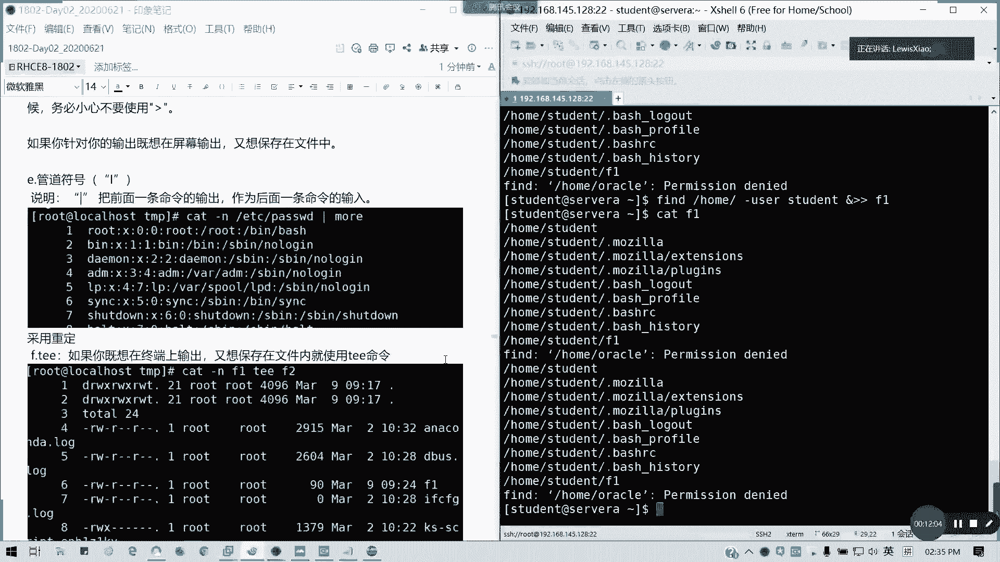
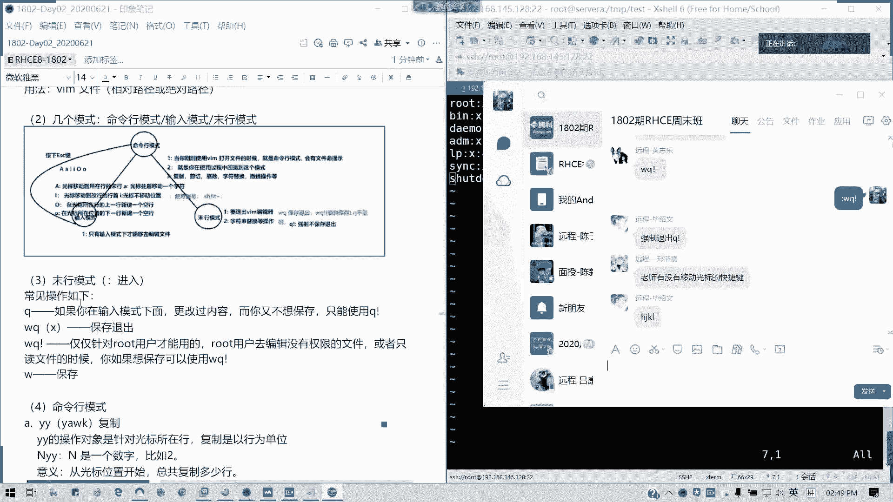
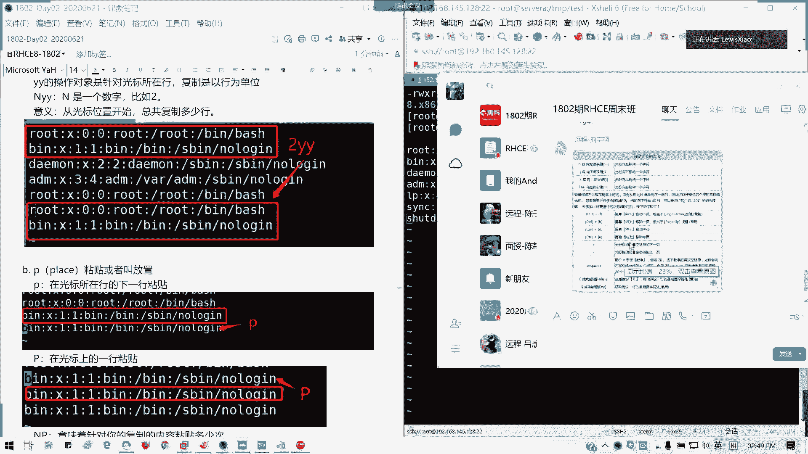
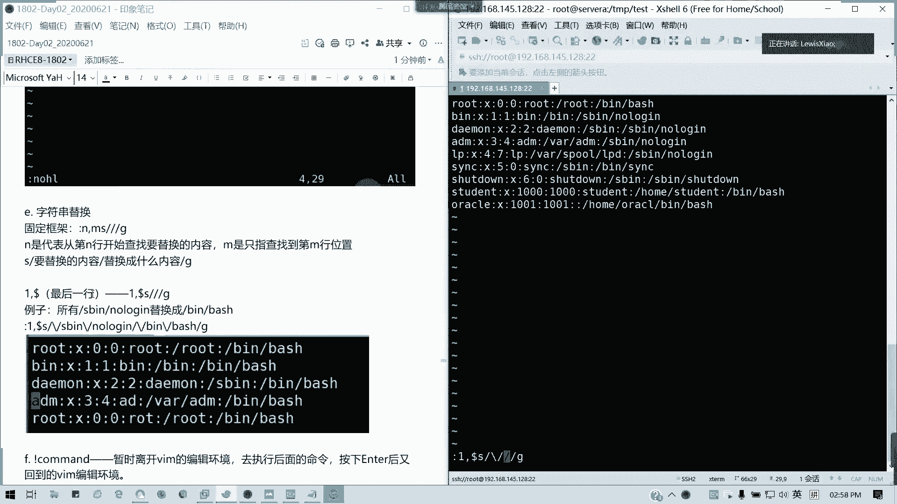
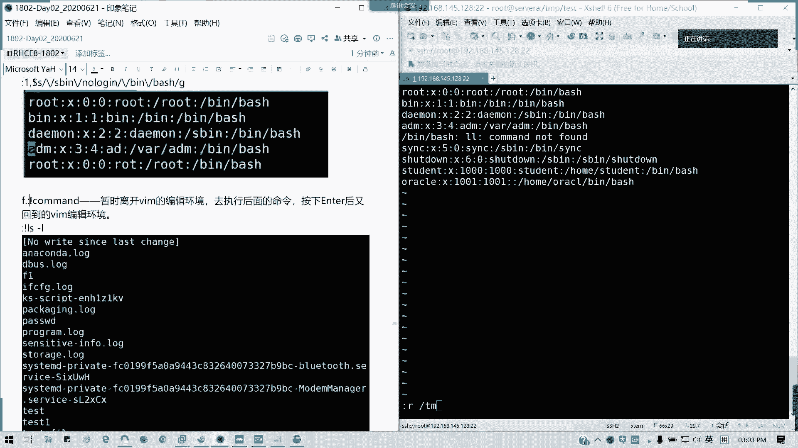
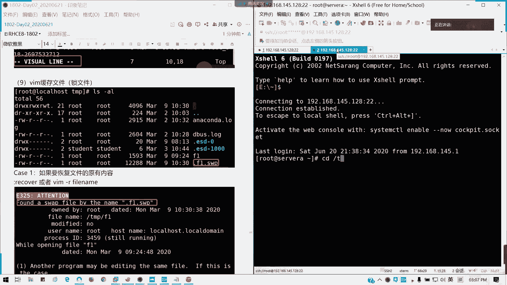
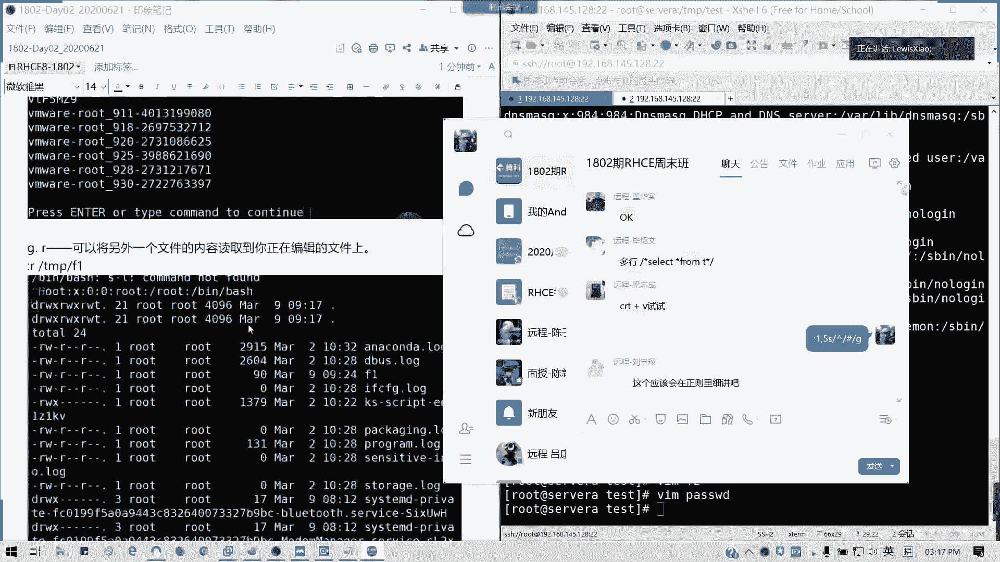

# 2021全新 RHCE8.0 红帽认证入门教程——可零基础入门学习【网络安全／Linux】 - P8：Day02_Ch05_重定向和vim编辑器 - IT老表哥 - BV1444y1h7Bx

好，经过刚才给大家的一个温习之后呢，我们开始讲第五章。第五章的内容是关于啊创建查看，还有编辑文件。在讲这个编辑器之前，我们先来看一下重定向。重定向是什么意思呢？比如说我们执行一下命令。

那默认输出结果是不是在屏幕上的呀？对不对？我们默认的输出结果是在终端，我们屏幕上默认终端的屏幕，对不对？但我们也可以通过啊。从定向的方式来输将输出的终端结果导入到文件里面，对不对？

这种情况应主要应用什么呢？我们的日志收集对不对？通常用为排错，对吗？这些东西，因为输出屏幕上的东西稍顺即逝，有时候刷一刷就刷没了，对不对？但是我们有时候就真的要get一些日志，特别是一些错误信息。

那么此时我们的一个重庆的很重要或者很重要。当然如果你这认为这些这些信息是没有价值的那你可以把它丢弃了垃圾桶，对不对？就相当于我们看看过之后，好像有这些废纸一张，那我就扔垃圾桶。但垃圾桶呢在我们的。

红帽里面有一个设有一个设备叫n设备啊，NULL就把那些输出的结果我可以丢弃掉啊。我们先看一个例子啊，比如说我们把我们通常我们在TNP目录下面，对吧？TNP目录，我们LS杠L的结果是不是输出的屏幕这么多。

对不对？那我可以把结果重定向到一个文件。

对吧TMPF1。不是啊，这应该是我们要加个。几个右这大于号，也就是一个右肩过号啊。让我们看一下。TMP。F一的内容是不是我们屏幕的输出结果啊？是吧这就是一个重定向的一个简单的例子。那么们要搞清楚重定向。

那我们要知道我们结果的一个类型，对吧？我们通常说我们在linux系统啊，在这个系统一样，我们通常说一个是正确的输出结果。也就是说我正常运行文件是吧？正常运行命令或者是我编辑文件等等这些那我正确的操作。

那务必肯定是正确的结果，对不对？我们只要按规范流程操作话，都是正确结果。那一条命令呢，它的正常输出结果也就未知正确的输出结果。针对于正确的输出结果，我们可以用。一个右一个右肩括号或者是两个右肩括号。

这里一般我们不说大于号啊，一个右肩或两个右肩进行重进项。比如说刚才我们的。是吧LS杠LD然后TNP是吧？T杠TMT的F1是吧，我们也是相当重新一下一个间括号呢，是不是刚才内容被覆盖掉了，对不对？

一个间括号呢是为覆盖原文件啊，然后如果是两个间括号代表是在我们的原文件的后面一行开始追加。那我们看一下。是不是我们原来的文件在这里啊，原来的KTNPF1对吧？我们会以在后面追加一行。

就这一行我看一下有没。就这行他是那个目录，对不对？刚才然后后面是不是追加这个？对吧。这个懂啊，不用再强调啊，一个接号是覆盖，两个是追加。所以的话我们一般如果日志不断生成日志，我们要重定向的话。

那我们通常是追加，对不对？你覆盖的话，那就除非你是一天结束，然后备份文件出来，然后再追加，在在这个写一个新的文件进去。所以这个其实对于我们日志输出，我们对于我们运维管理的话是非常有用的。

当然我们除了正确的输出结果，我们还有一类似叫做错误的输出结果，也就是一条命令的异常输出结果。比如说。我命令没找到，我找不到这个用户是吧，或者是权限不够，对吧？

permissionion抵待这些非正常的运行输出结果，我们统称为错误的输出结果，对吧？比如说。我在stu用户下，我切换到not加目录，这明显是。权限不够，对不对？因为root加mo录的话。

它只有他所有，对不对？是不是旁边圈抵代啊？那我们要怎么去做我们的错误输出呢？那我们是错误的话，我们通常正确的输出结果，它的给的值是一啊，就它有三种，还有一种是输入输入是0啊。然后那个正确的输结果。

它的那个值是一，错误的是2，也就是我们的从定向只有这三种啊，那我输出错误的输出输出错误的结果呢，比如说我就把刚才这命令CD向完 rootot是吧？然后呢我从定把错误输出结果从定向到。嗯。

FE这个文件我在我现在当前是在stuuddent的家目录啊。那我们看一下cat。F一是不是把错误的结果出来了，对吧？如果正确的结果会怎么样呢？你可以看一下F一是没有的，因为它这条命令没有正确的执行。

也就是他这命令是发生异常的。所以他我们要凑着输结果就是这样。然后如果追加就是二两个监括号，对吧？我追加几行，你看一下对吧？这是异常的输结果，能明白吗？上面两个例子呢都是从定向到文件里面。

我们也可以从定向不保存，也就是定位到我们的DV的n设备，相当于丢弃啊。就是有些他输出的东西我们觉得没有必要，或是我们用不着的，我们是不是得以丢掉啊，特别一些什么乱七八糟的，或者是什么鬼是吧？

比如说我们这样。CD是吧，我重新再再录一遍是吧，然后二是吧，2两二两个经过代表醉驾，然后丢弃到D一B闹里面。那就相当于我这结果就不在屏幕上输出，而且这个结果就立即被丢弃。懂吗？

我们的空设备就相当一个垃圾桶。针对于这两种不同的输出结果呢，重定向的方式不同。一般我们在写脚本时候用到，比如说我们也可以同时重定向是吧？同时重定向，那我们同时重定向，我们用在什么地方呢？一条命令。

它既有正确结果，又有错误的结果，那我们可以用N是吧？N右键括号或者哎两个右先括号来实现同时重定向。比如说我就切到。这一个是吧。我刚才我现在就个student用户，那我就不用再切了。

我们比如说我们要找home目录下面的user，我们的用户名为student的所有文件。这个命令是我简单讲泛命令啊，后面会讲。

5。comme目录下面是吧，然后因我们找home这个目录下面。他的用户这也就他的所有者为student的所有文件。然后我从定向。到。F1这个这个文件里面，哎，我咋说命令了啊？F I N T。好。

我们看一下。对吧既有正确的输出。又有错误的输出。对吧因为我们新我们所昨天的时候新建了一个oracle的用户。但oracle用户呢，你普通户你是打不开的，对不对？我们的加户是不是他有权特定的权限，对吧？

普通用是打不开的，所以的话他有错误的输出在这里，懂我意思吗？特别说明啊。当你采用重定向的时候啊。

尤其要将输出内容啊，输内容放到一个重要文件的时候，请不要使用单一个监括号。我们宁愿用两个监括去追加还好过。

对吧我们再看一下是不是把他欠确跟授权的结果全部追加到后面来了。

我看一下大家问题，杠user呢find这个命令我先讲啊，find home是吧？泡沫录下，杠user是查找。这个命令的意思就是查找home目录下，干home目录下所文件所有者为student的所有文件。

然后输出到屏幕上，懂吗？这个命令能明白吗？陈志军。好像有我一个旧同事的名字啊，旧同事的名字也叫这个名字。我不不信他是一个旧同事，是不是不是啊？然后呢，这个啊如果我们针对于那个。お。

输出内容我们宁愿用追加，也不要用覆盖。好吧，为什么？因为一覆盖的话，你中的东西全没了，对吧？特别是我们我刚才说的，如果你针对于我们的日志，我们要排错的话，用追加，你去筛选。

还好或者说直接把上一条记录给刷没了。有时候真的上一条记录就是问题的起因，对吧？

那我们看日式也是可以这么筛选的，懂我意思吗？看日式或者操作，我们在复合操命令复合的时候，可以这么筛选。但是还有一个什么22跟一合并输出，我们书上有讲，就是也就把错误的反而前面然后跟一合并出出。

这个是跟N是一样的，两种写法一模一样，书上有讲啊，但是我这里我就不再翻书了。这是第一个我们的追加跟覆盖。然后如果是左肩括号呢，就代表是。从定向输入啊，左边的话，比如说我们要导入一个数据库，对吧？

mylr口那个，那我们就可以在密堂下面是不是可以用是吧？可以用这左间固号从文件里面导入数据库啊，对吧？或者是从键盘里面输入密码，对不对？就从一个文件里面导出内容，然后输入密码，对不对？都可以。

明白我意思吗？这是左边啊，然后右肩的话就分为正确跟错误。你们自你们根据情况来进行操作。然后我们接下来讲一个管道。

管道呢。就是把前面一个命一条命的输出作为后面命的输入。比如说。

对，有个例子啊。我已你退出回到root。然后呢，比如说我按行号输出我们ETC pass这个文件，这个是我们待会第五第六章我们会讲到用户跟组，它这是存放我们用户里面的相关配置的一个文件哈。

比如说我看一下啊。

WC对WC也是就是统计行号。比如说我这里的话，我后面加个more是吧？加个more的话，也就是相当于我前面输出的结果，我再按行去输出，对吧？前面的结果，它会相当一个前后面的一个输入，对吧？

他的意思把前面的我们输出这个结果再暗页显示，还有比如说刚刚才有同学提到的WC是吧？我们要统计行号。对吧。WC杠L那我们统计到我们这个ETC杠pasWD这个文件里面有46哈。这应用很广啊，对吧？

前面输出代表着后面的输入。然后呢，还有一个命令叫T命令啊。还有一个命令叫T命令啊。T命令的话就是如果你要在屏你要在啊终端上输出，又在文保存文件内的话，那我们就用T啊。比如说我们这里。cat。

杠我们再回到TNP目录cat杠NFE是吧？我们执行有这么个结果是吧？那我们又要终端要保存的文件，我要保存F2，那我就会用T啊。我看一下。天侬 South八调一条雨啊。我这里扫应该是我少了一个管道啊。

少了一个管道，这这才正常的。我K的一下F2。对吧我这里的截图我少了一个管道啊，这我如果直接打的话，你T的话是有问题的。哎，也可以了。刚才是为什么不行，我看一下有什么差别。哦。

这个GFI文件你要存在还可以。这个啊这如果用证命的话，你F2文件要存在，懂吗？刚才不存在的话，它就报错了。在我前面的话有报错，但是你的文件存在的话，它就既。保存文件又又在屏幕上输出，这是T命令。

但是我们很少用啊，说实在这个命令很少用，我现在基本上百年就100次就用不了一次。这个只是说两个都输出，但是我们一般的话，我们重进项只要一个就够了。那我们看一下下面的一个图，这是我们书上截出来的对不对？

刚才讲的东西对不对？我们看笔记啊。不要看书，看笔记。像2N1的话，也是附加同一个文件。其实这个覆盖的同一个文件也更附加这两个其实效效果等同。相相当于只不过它它是将它的原理呢，就是一个是同时输出。

一个是将错误的输出附加到正确的输出。然后再合并啊，就原理不一样，但结果差不多，懂吧？这个从定向能理解的请打个A啊，现场有没有有问题请提问，没问题，请举手。从定向这一块。一个两个能理解吗？三个你呢？

能是吧？哦，现场都OK，我看一下远程的情况。同一项能理解的话，那么其实我们这样的话，我们进度稍微稍微快一点的啊。从镜向的理解，我们来讲VIM编辑器。这里就是一个区别了啊。

Where where I am。它是VI的VIM是VI的增强版，叫VIM enhance它相比VI的话，一些参数重要的参数跟选项的话，它是会有颜色标注，对不对？我VI的话是不是全部一片白？

对吧所以通常VIM的话，我们在标准的运行，我们标准安装的时候就全部带了VIM如果没有的话。如果没有啊。如果只能用VI，那么我们我们可以执行。

我们在我们的那个用户，我们的目录下。我们可以在我们的命令行，我们执行一个转件安装包。就我们的DNF我们后面讲的样啊。杠Yinstore VIM enhance就我们配好那个样源的时候。

我们配好我们的软件源的软件仓库的时候，我们可以执行这条命令。对。也就是我在最小化安装的时候，我们可以把VIM装上去。但是通常我们在标准安装的情况下，我们不需要啊眼镜戴了。

好，我们接下来看一下VIMVIM我们这里先了解我们VIM有几种模式。几种状态啊。等一下。比如说我VIM1个范医。喂它的格式是VIM。然后。用法。到时候我更新笔记后，我再发一遍的啊。

VIM然后后面跟文件文件可以是绝对路径，也可以是相对路径。然后是不是我们打开这个编辑器的界面，对不对？然后它是一个新文件的话，它会提示new file啊。然后这里是一个行号跟字符的所在位置。

好我们现在先了解几个模式，命令行模式，输入模式以及默行模式。我们一开始呢进入VM之后，它会处于一个命令行模式。命令模式啊。他有一个文件名提示，对不对？就下面啊没明提示。然后呢，使用过程中呢。

我们始终呢都要切回到这个模式，然后它进行下一步操作。然后还有就是我们的对文件的一些快捷编辑操作，比如说像复制剪切删除字符替换以及撤销操作都是在命令行进行的啊，就我们这个模式啊。这是命令行模式，懂吗？

然后还有一种叫插入模式。插入模式，我们怎么进呢？有6我们其实说白了就是AIO啊，在命令行模式按AIO只不过大小写的功能有区别。比如说。大A大A啊，我们看到这个图啊。能看清楚吗？

比如说大A它是光标移动到所在行的末行。比如说我K一下那个这样吧，我K一下有。呃，CD test那我看一下那个passWD吧，就VIM。嗯，没有东西吗？XWD哦，我改一下名。

owV我们打开给我内容文件吧。好吧，我们现在这里是一个命令模式。那如何进入插入的模式呢？比如说我它你这里有6个键分别是大小写的AIO啊，那AIO有有什么区别呢？我们按大A它是移光标移动的所在行的末尾。

开始编辑，这是大A。然后呢。比如说我自己开始小A。它是往后移动一个字符，开始编辑。然后还有就是。我移到我朋友移到这里大I。移到行首开始编辑。小爱。当前位置不变。

还有就是大欧小欧。大O看一看啊，在上一行。有有行那个新行开始编辑。

小O下一行，对吧？也就这是一个插入模式啊，只有插入模式，也就是我们输入模式才能编辑文件，对吧？这是插入模式，懂我意思吗？然后如何退出杀入模式按ESC。就就回到命令行模式了。还有一个就。还有一个就是那个。

我看下ship不掉冒号。哦，不对，这个是墨行模式啊，墨行模式也就是尾行模式，也就是说要保存啊，退出啊。

也就是莫行怎么来呢？因为就是你的下面有显示审失命令。这是墨行模式啊，通常冒号开头，我们就是shift加分号，这冒号就有一个冒号出来，这这种模式叫墨号模式。通常它用于什么呢？第一个。退出VM变辑器。

比如说我退出的话有3快捷键，一个是WQ是吧？冒号WQ保存退出。然后如果冒号WQ探强制保存，然后如果Q不保存，Q叹强制不保存退出4种啊，应该知道吧？然后有一种就是字符替换。P量的字符替换。

就也就是我们一个文本留的一个操作。这个待会我们会讲。

如何进行一个文本替换？对于三种公式有疑问吗？有疑问可以提。回问可以举手啊。呃。如果呃远程的包括现场没有案请，在群里面打个B啊。好，大家没有问题的话，我们看一下各三种模式下常见的用法。

常这用法我们看一下啊。

命令航模式，比如说。我们就把那个前面我们我们这里太多行了，我们我们删到那个operator这里，好不好？我们先把它删到这里啊，我就留留这几行就行了。那这是我们拷贝出来文件，所以不会影响系统的正常运作啊。

比如说我们留这几行。首先我们看一下YY。

到比QQ叹冒号到比QQ叹啊。记得我们这种墨寒模式，记得记得前面带个冒号。

木尔模式知道吧？就是冒号进入啊，刚才讲的这些都知道吧，WQ也是等于X啊。WQ碳的话，我们通常是root啊。然后只保存了到底额。待会就讲你用光方会计先我讲。不用急。你看有些人都很熟，对吧？

VI变捷性用多了。

好，我们讲一下命描模式的快捷键。

像这里啊，我看下啊，你看这个这个这个就挺好的啊。

人家发这个都挺好的。

我们会讲啊。

🎼比如说我们把这个行，我们就去到，我们就剩这么六七行文件，六七行的的内容。好吧，因为我个把把它删掉了。然后我们比如说我要复制啊。

针对光标所在行进行复制，用YY，然后它是以行为单位，我们也可以用NYY，对不对？比如说我前面这2YY，那说那我要复制两行，那就2YY喽。比如说这里。在命令行模式下啊，不是在墨行默墨行会操作啊2YY。

等一下啊，我这边。2Y喂。然后呢，我在后面P是吧？懂吧？粘放置，我们叫放弃或者粘贴Pise啊。那YY是用可复制啊，比如说这里YYY是不是我把这个下面的两行复制下来了，对吧？P。

是上一行粘贴。如果在上下一行张贴啊，如果是大批。是不是上一行上上面粘贴P是下面懂吗？

NP。

我可以粘贴多少次？对吧。NYY也是一样，我可以复制多少行。然后MP我可以复，我可以粘多少次。

对不对？

这个就知道吧。然后。就YY rootot这一行，然后然后我就可以4P是吧？我刚才就5P了，是不是这么多，对吧？然后滴滴剪切是吧，以行为单位，整行剪切。

NDD是吧，NDD减切多少行，但它也是可以P的啊，对吧？它也是可以放置的，对不对？但如果你滴滴是吧，比如说5滴滴，我我这里我这里1滴滴吧。

它下面会显示啊词滴滴是吧？我舌剪切掉ten feel，那就少掉了十行。如果你剪切，你又不粘粘贴的话，是不是等于删除？

对吧。

然后还有就是字符替这个三个都知道吧，对吧？YYP跟DD知道吧？然后接下来就是一个R。R的话是可用于单个字符的替换。注意它只用于一个字符一个字符啊，比如说我们这里。root是吧，这里的话我们移到零这地方。

我们呢R，然后按我们替换后的字符。是吧是不是零变成一了？对吧。在我们它是针对单个字符的，如果你要替换的话，你就不进入操作模式，那我们就按R，然后输入我们新的替换字符就可以了。然后还有U。撤销上一次操作。

我们刚才是不是把零改了一是吧？按U是不是改回来了before是吧？完 beforefo我第5次步操作，然后就这个一个改变，然后它是26秒钟的时间的事情。然后我按多次U是不是全部回滚了？对吧。

然后接下来我们讲到删除一个字符，比如说X。删除一个字符。比如说我要。到这里。我光标这里我X。删除所在位置的字符。大X删除前面的一位。能懂吗？这快捷键可能比较繁多，但是大家就希望能够可以做一个表格。

稍微记一下啊。然后继续我的鼠标怎么又动不了啊，继续。

然后呢，还有就是我们跳开头跳结跳开头跳结尾。劝得进。区区不是挂了哈，区区是吧，跳到行首开头首行开头。大G跳要到墨行开头。都是常用快捷键啊。然后输入方式哦输入模式AI5不讲了，刚才已经讲过。

然后还有墨航模式，刚才就除了一个保，还有一个剧列本操作，就是刚刚保存退出，对不对？我们墨行模式，对吧？还有其他操作，比如说。我们显示行号冒号set空格NU。是不是前面就显示了几行几行，对吧？

第几行第几行就出来。如果不显示set no N u no number嘛。

N就 number啊，你看。回到正常状态，然后跳转到指定的行号，在默完模式下冒号输入一个数字，它就会跳到所在行。比如说冒号3。

冒号8。对吧。要跳转到指定行，就是冒号，然后后面跟一个数字。能理解吧？

接下来搜索很多用到的对吧？搜索斜杠。在命令模式下面啊，命令行模式不是墨行啊，修搜索就斜杠加关键字。比如说搜索nolow in，它会把搜索的结果高量显示。那如果。

然后我们可以按我们定义它会定位到我们第一个关键字上面。然后我要搜索第二个是吧？第三按按小N对吧？然后按大N就是回退到上一个关键字，取消高量noHLno high就可以了。对吧。

字符串替换这个就比较多比较常见了。比如说我要整行替换对吧？固定框架啊就是在木行模式下N。诶。F然后三个横杠区代表什么意思吗？也就是说，我们从第N行。替换到DM行的位置，对吧？

然后S代表NS到G的话就是一个star是吧？开始替换，然后后面输入要替换的内容，对不对？要替换内容。然后到那一个，然后替换成什么内容，对吧？我们这个用法是很很多的。比如说我们这里的话。

比如说一到最后一堂的话的话就是一到多了S，这是最后一就从第一行替换到从一开始退换替换到末尾，对不对？如果所有的话就直接这样就行了。那我们现在有一个例子啊，在这里我们这个pas w我们更改后文件。

本我们把S并 not in，我们替换成并b，怎么替换呢？我们所有的替换啊冒号进入默幻模式，然后从第一行到多的行，也就是到末尾，对不对？到末尾，然后我们替换什么呢？这里为什么要一个斜杠啊？

为什么一个反斜为什么一个反斜杠知道吗？因为它的那个反斜杠它是有。他的斜杠是有特殊含义的。有特殊含义的，我们用反斜杠取消转页，用回它原本的功能。

对吧就原本的这怎么输怎么输出。所以的话这里我们记得在斜斜杠的时候，我们要加个反斜杠，取消转页，输出它原本的，懂吗？所以这个S定，所以右反斜杠再斜杠。no log in。

所以这里看起来好像是1个BBB这样子，对不对？但是实际上它是一个取消转移的一个用法。如果你摘斜杠的话，你你替换不了的。你不不信你现在可以试试啊。我现在可以试试啊，就是直接pin是吧？病。

你看这个就很难看了啊，对吧？对里面的no no in。然后我替换成。Spin。并办事对吧？怎么退换呢？对吧。那我们正确的做法冒号啊。他是替换不了吧，就这样呃，一第一行到多少行到最后，然后这里是呃。

死病in。然后取消转页no log in。然后替换成。水消转移。并在学校转移这个斜杠。Best。然后最后是G啊，从开始到末哈，从开开始要结束回撤。拍成的画啊哦，我这己打错了。嗯，重新来过一。多了S。

S病。no烙 in。然替换成。呃，并。Best。杠G对吧？所有的pin no in全部被替换。能明白明明白吗？记到这里，因为我们的斜杠是有特殊含义的，所以的话我们必须要转译啊。

转译成取消转页变成普通的符号，能明白我意思吗？

我看一下其他人。no no in这里我们就讲到用户的sha有类型。那么东西是不能使用交互税啊。S spin多因我们在用作主的时候，我们也讲到这个。然后我们还有一个用法，就是叹号后面加命令。

他是暂时离开我们的VIM，然后运行我们的。

后面命令对不对？比如说我们这里叹号回到回到命令模式，然后叹号LL。等一下啊。

叹号啊，我看一下叹号后面加con。木航模式啊木尔模式叹号LS杠L。对吧他会临临时。离开我们的VIM，然后执行相应命令，然后回然然后又回车又回来。懂我意思吧？就在墨行模式下面啊，就这里扫这里的话是这样啊。

冒号。叹号是吧。比如说我要执行一个caEDC。passWD是不是临时执行命令，然后按回车或者是太 command慢的。

就就回车的话，我们就回来，懂我意思吗？

然后还有个R一个R是吧？

我们可以读取另外一个内容，加将另外一个内容读取到你正在编辑文件上。那比如说冒号R。

对我扫扫掉一个，这样就可以了。好了，然后我们要编辑一个T读取到1个TNPFE的文件，对不对？杠read的嘛，冒号read的嘛。

你看是不是读取当前我就是读取我们的另外一个文件下来了。懂吧？然后也可以读取命令，也就把命令的一个结果。

是吧。

啊，因个命令结果我们可以是不可以可以读到上面来？冒号啊。然后后面跟。我们的命令啊。

我们是不是把F2的结果读过来了，就命令它执行的结果多过来了，对不对？

冒号R，然后空格叹号，然后后面跟命令懂吗？

我。

え。有人是不是没关麦哦，两件衫是吧？

那这个的话我们就常用法是这些，那后我们也可以让它弄分屏。

分屏是吧，我们VIM杠大O是吧，要水平跟垂直分屏。比如说我们编辑同时编辑两个文件。

从这里退出啊。如果我们同时编辑两个文件，那我们的VIM杠大O2两个分屏，这是垂直分屏F1跟F2。对吧。说两个分屏了。

然要水平分平呢？我要退出的话两次啊，水平分明就是一个小哦。对吧。同时编辑两个文件。

然后文件间里我要复制粘贴呢，就是比如说我这里123。我要复制下面对吧？我要怎么复制粘贴呢？YY。然后cttrol加W。然后水平的垂直是按右键，水平按下键，对不对？然后P。好吧？这个是水平的方式啊。

如果是那个垂直，话就按右键就相当切换窗口，然后我可以我可以两个文件中间中间复制粘贴，对不对？能明白吧？好。

🎼然后还有一种可视化模式，就一个快操作啊，快操作我们退出啊。到这里退出的到F2。我们比如说我们快计设备的话，我们可以用cttrol加V，它会写这个visual block，然后我们可以通过。

拉动鼠标可以进行一个整个快的操作，对吧？可以整个快的YY或者是P，对吧？整个快的。左用快捷也可以操作visual block，然后ship加V就是那它这个模式，它就是那个行模式，我们叫ship加V啊。

比如说123，我这里456。

789，比如说我编辑这些文件，然后我用shift加V。就变成一个行选中模式了，对吧？如果是contrl加V数快选中，对吧？

是吧。

然后还有一个我们的缓存文件，我们现在先打开一个绘画。我们现在在在编辑我们TMPF2。

是是我们现在我们是不是在编辑那个我在点，有没有这个点啊。这现在我在编辑一个FO的文件。现在是F2啊，我们太TPtestF2对不对？我们现在重新打开一下F2这个文件，然后呢我们看一下test的目录。

是不是有一个缓存文件叫做F2点SWP啊？就我们在一边打开VI编辑器的时候，我们再另外开一个窗口，是不是我们看到它当前目录下，如果正在编辑，它会产生一个web的文件。它是一个锁文件哈。

如果要如如果我们同我们现在打开。再打开编辑F2，他会告诉你说我找到一个缓存文件，然后我正在被随编辑，对不对？正在被随编辑。然后呢，我现在我要做什么操作，对不对？他这个缓存定行存在，他我告诉你说。

如果它的其他程序可能在编辑这个文件，如果它是一个案例的话，你记得不不不要说那个就不要进入两个就是说同样文件，然后不要不要打开两个不同窗口，然后它有提示，然后如果是那个这个文件，你在编辑的时候它它挂掉了。

就我们程序挂掉的话，如果是这样，那我们就可以用冒号recover，对吧？恢复到原本文件状态，或者是VIM杠R了恢复到原始状态，就是它编它那个编编辑前，这就那个在编辑的时候，也就是我们保存前的状态。

我现在没保存，对不对？比如说我这里我在编辑。是吧我在编辑上456是吧，我现在在编辑OK。我们这里的话我们可以冒号。可以用冒号recover啊，就用默完模式，这样在read only啊。

冒号recover。他就会说那一个回复到我们现最新的一个编辑，或者是应该不是回到回退到最初啊，就回复到一个他会更新到最新的一个编辑模式。刚才不是只有123吗，对不对？

回退就也也是说我们原有内容我们已经是那个插入，然后保存了，应该是更新到最新状态啊。然后如果呢。或者是有我们直接。对吧。这现在是只读的啊。Recover。no right啊，可以用t号。

它现在就original five recovercover complete就他已经回恢复到原有内容，不是更像最新啊。然后呢，还有一种就是我可以直接删除掉这个文件，对吧？如果我觉得我们不需要的，那。

我们可以直接删除这个文件。我现在再打开，是不是这这是这样，对吧？我现在我编辑的145123，对不对？

我现在我可以按。

好了 recovercover。你开口的话，是它回恢复到一个最新状态里面啊，恢复没文件的现有的编辑内容啊。不是恢复原有啊，就现有变成证，我是刷了个145，对不对？所以它会恢复到现有的编辑内容。

然后我们这里可以保存，对不对？然后我们然后还有呢，比如说我这边我再打开一次，对吧？它还有一个swepe，对不对？它设外盘还是，只要它一边打开也是正常存在的。然后如果我们VIM杠R的F2。

对吧它会恢复到我们现有编辑状态。然后如果你不需要这个文件。那就把它删除，对吧？就可以了。但是他现在的话就是。对吧。

就是最新的一个状态了。如果你不需要的话啊，绘画文件这现有编辑的一个状态，也就是它一个缓存的状态是可以的那这个呢所有内容有人像睡觉是吧？这个所有内容就是我们VIN的常用的功能啊，专务功能。明白了。

请打C有问题请提问，现场有问题可以举手。ZZZZZZ是什么意思啊？这样应该很简单了吧，原来VIM真的要讲至少讲两节课的，但现在VIM的话很快就想睡觉。多个文件切换是这样子，我回到这里啊。

我们可说化辩界。

垂直跟水平是吧？这里。早师有没有每次单独的出车很忙，什么意思啊？多行注释每次测试单独测试的时候都很烦。没有这里我们是讲讲了很多的一些例子啊，但是我不知道你的多行测试是什么意思啊。你们知道吗？哦。

多航叫井号啊。一边的编辑，一边把缓存删除了，他那个也不会保存不了啊，你现在还在编辑状态，只不过它low着你最新的一个状态而已，对吧？你要保存照常能保存。多含加紧啊，这个这个简单来。

你要多行加减数话，我编辑回那个paWD好不好？这个先保存多行加减这个简单，你看。

他这个有一个文件在被编辑，那我就按Y就可以保存了，对不对？这种就是你在抢抢资源情况下，那我们现在我们边WD我要多写注释是吧？来。

比如说我从。第一行到末尾。

或是有百分号代表所有对吧？百分号代表所有，然后呢，S是吧？

先一开始是吧，一开头我们正则表达式。

多行写数式啊，接。

然后开头，然后景区。是不是这样？我这里就刚好38个全部显出示了。🎼也可以啊，s phone啊，这样子也是可以的。但是一般我们在VM变辑器里面讲星号啊，就比如说我要全部我要多好几次，比如说我。

这样子啊就是那个冒号一是吧？到那个。五行我1到5行，我写注释是吧？S就开替换开头。然后好，我先号先开头，然后就是每行开头，然后井号。区是吧，就这样懂我意思吗？这个很常用的。

这补充算补充吧。多行注释啊。我撤销掉操作先。比如说这里我就是1到5行。接。静猪。我就写到替换这里啊。那的结果。嗯。是这样啊，1到5。我说一到。这这样。减括号。警居。我就所有行我加上注释。

我是不是三十8行全家了？对吧这个是不是很实用？一次性一次编辑，全家安全家安心啊。好，还有没有问题？没有问题，请没有问题。请这个正则表达式会会讲。但是这个正则表达式后面再讲。

但这个就是说我们在需校里面正则表达是专门有讲这个东西的。我就加这些内容，待会笔记会更新啊。然后如果没有问题，我们休息20分钟，然后待会儿15点40分，我们讲用户跟走这这段进度可以吗？讲的快不快，不会吧。

休息20分钟，40分钟开始讲。

