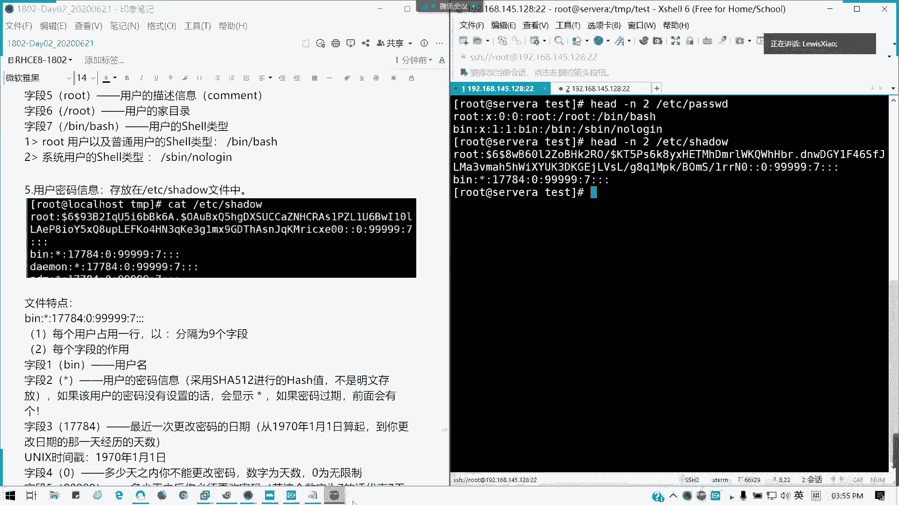
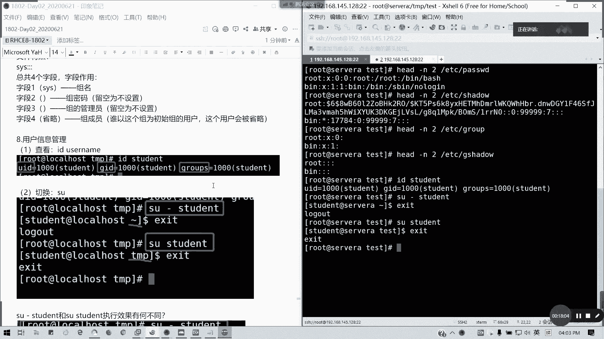
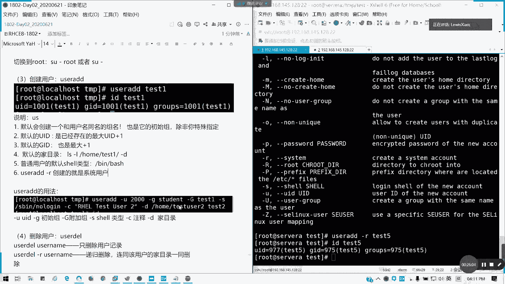

# 2021全新 RHCE8.0 红帽认证入门教程——可零基础入门学习【网络安全／Linux】 - P9：Day02_Ch06a_管理用户和组 - IT老表哥 - BV1444y1h7Bx

我们录屏开始，我们讲第六章第六章管理用户跟组描述用户跟组啊。我们linux的特点呢是它是一个多用户的系统，对不对？多用户多任务系统，所以的话用户的话肯定是是有存，就是用户的话肯定是多个的。

你不可能说你因为系统只有一个用户，对不对？那这样的话，你的早期的你可能系统就只有一个用户才操作。那这个很正常。那现在基本上都是多用户了。然后呢，我们用户的分类啊，用户的分类分几种。首先老大超级管理员。

对不对？像windows administratorimist，对不对？但animminist的权限呢还不你可以去掉的，其实对不对？但root的话，你这个也用这个用户必须存在。

他是1个UID等于零的超级管理员，杀人放火啊，那个提前关机，什么都可以干啊。就是说考试坏事他都可以干，权限最大对吧？无所不作。第二类系统用户，也就是提供系统服务的用户。比如说像阿帕奇。是吧。

对吧阿帕奇是不是就是他有这样一个系统用户啊，对不对？还有一个什么叫mycleoracle等oracle还是普通用户来的，像myacqcle这些的话是一个系统级的用户。系统这些用户呢比如说。

他他是可以要不就给系统调用，要不就是。以部署安装服务调用。特点呢它是需ll类型都是不可登录的。然后他UID的范围是1到999系统用户啊，他通常都是不提供直接的交互界面，只供系统或软件调用，明白我意思吗？

然后呢，第三类就是我们的普通用户，也就是UID1000打后的对吧？在我们以前的6版本呢，就是0到499，是系统用户，500以后是那个普通用户，对不对？但是我们在7以后呢。

都是把系统用户扩展到了1到999。然后普通公司1000，我们在实际的生产环境里面呢，系统管理员一般是采用普通用户去管理啊，这个也是为了审计需要安全的需要。

谁去如果你直接你去到一个单位或者是直接去个项目里面，直接人家那个老大把，就已经搭建好这个环境，你直接把root丢给你，那肯定他是没有做这种配置的。懂吧？肯定没有做任何的基线的，很危险啊。

直接你个那个root交到一个外行跟外面的那个手里面，就相当于你相当于用身杀大权一把刀，对吧？

他危险了。好，那我们看接下来。

UID是什么东西呢？叫做user identification，对不对？ID哈。无缘无故的唯一身份挑食，它是一个数字啊。linux呢它不是通过用户名来识别用户，我们windows对不对？

我们windows就通过用户名直接辨别你是不是管理员，对不对？但linux不是哈，它是通过UID来进行识别。我们userID哈。所以每个用户呢它都有个特定的ID这懂吗？比如说我们的我们这里是吧。

我们看我们这个文件代委会经常打交道。

我的student的ID是不是1000呢？我们的oracle，我们上次见的是不是1001呀，对不对？懂我意思吧？然后说让用户就说要组是吧？我们用户是多个用户，是不是可以并成一个组？对吧就包含在一个组内。

当然一个用户也可以在自己的组内没有问题。特点我刚才已经说了，一个组内可以包含多个用户，一个用户可属于属于多个组。然后他还有一个初始组，也是主要的组跟附加组的概念啊。比如说这里一个优色2用户啊。

初始组跟附加组它是有它我们group一，我们user一是属于group一的组，对不对？那user2它是可以同时属于group一它是group二是主要组。group一是属于附加组。那原因有什么呢？

我们看这个图，初始组的最大特点啊，当你一个用户去创建一个文件或者目录的时候，这个文件的一个数组就是一不是数组啊，是数组属于的那个数啊，数组就是文件的初这个用户的初始组。最初的对不对？

我新建一个用户他的初始组是不是他自己啊，对不对？自己名字的，然后GID是往下排的。然后一个初始组呢。一个用户只能属于一个主要初始组，但是他可以。属于多个附加组，这主要的只能有一个。啊。

但是这个不能用那个皇帝的那个三妻四四妾的那个跟正势来比喻啊，不能这么这么弄的啊。但是其实情况很类似，对不对？所以我们组里面呢是有可以一个主要加多个附加，然后呢，它也有唯一的一个主ID。

我去2000个桌子录密码你都能记得啊。

是吧这个主ID叫做group identification啊。第四个用户账户信息。我们接下来我们讲这个重要的文件叫做ETCpaswD。我们的本地用户信息我们是放在这里的那这个文件呢有什么特点呢？

我们看一下前面的这两行啊，我们只留意这两行，我们cat。我们就显示head杠N2EDCpaWD我先清掉啊，这里的话屏幕太杂了。head。杠N2EDC我们显示前两行，我们看对比一下看什么用途啊，好吧。

我们以第一行root为例啊，首它是以7个字，以冒号看到这里没有？冒号分为了7个字段。它每个字段都有特定的用途啊，每个用字段都有特定用途用途是不是我们总共是数了是不是6个冒号。

12345是123456是吧？6个冒号分为7个字段，对不对？那每个字段有什么用途呢？第一，我们每个用户是占一行的啊，每这个配置里面我们一般不直接修改，我们是通过生成用户或者是生生成用户的方式。

它来生成这个记度，我们不直接改这个文件，好吧？

通常我们不直接改这个文件啊。所以我要写一个注释，通常我们不直接改。然后。

每个字段重用第一个字段看到这里root用户名。第二个字段，用户密码。但是这里呢你直接放铭文密码可以吗？不行吧，那你不能加密吧，加密码直接放这里很危险，对不对？所以它通常用一个X来代替，然后呢。

密码是通过SHA512加密存放在另外一个文件文件叫做ETC下的shadow里面啊。所以这里我们只存放用户信息，我们就不放密码了，所以这里用一个叉来代替。第三位，他的UID。像root是不是零啊。

像并是不是一呀，对不对？第四位，他的初始初始组也是主要组的ID它的root组是不是零啊，对吧？第五个描述信息。也就说明我我为这个用户加一段说明，对吧？这说明就是一个common，一个注释，懂我意思吗？

第六个，他的加目录到底在哪里？对吧它的加目录这里说明加目录是杠 rootot，对不对？像并的加目录就杠并，对不对？第七个它的sha类型像并b的话，它是有支持交互式的shall。

也就是我们可以通过人机去敲命令去跟我们的系统内核交互。像我们的并，它是一个系统用户。它的交互类型是并 no in，也就是你不能通过登录并这用户来获取我们的shall命令提示符跟系统交互，懂我意思吗？

对吧我们这里root以及普通用户的类需类型是并b。系统用户的性能类型通常是space not in。能明白吗？能明白哪一个A。这我们有4个文件啊四个文件关用户跟组的四个文件，我这一个一个讲啊。

能明白打个A，有问题可以提问。

现场有没有问题？好。多些基础知识啊。

接下来我们看一下密码信息，密码信息单独。保存在ETCsha那里。

影子啊。看一下啊密码它总共啊，它是以冒号分隔为9个字段，对吧？8个冒号分为9个字段，每个用户同样占一行。那我们先来看一下ETCsha的作用。首先。

我们看这一行啊，这一行太长了吧，你们看并这一行好不好？首先用户名。对吧第二个。密码它是通过512位的SHA啊，是啊512位进加密得到的一个哈希值，不是明文存放的，这里的密码不是明文存放。

如果没有设置像病的用户。是不是写这个心？没有设置密码的话，这里会微新。作为代替，如果用密码过期，就在密码前面。比如说我这串我root密码过期了，这串是不是root密码，对吧？如果过期了。

它前面会加一个叹号，就证明你的密码被锁定了，过期不能用，懂我意思吗？第3个，17784。

从呃它是代表是最近一次更改密码日期，这里采用是unix时间戳。也就是我们昨天提到的1970年1月1号，从这天开始经历的天数。懂吗？就是最后一次更改密码日期是多少？像我们root的话，它这里是留空白。

对不对？留空白，我们因为我们昨天刚搞完密码。

第四个字段，0多少天之内你不能更改密码，数字为天数，0为无限制，是不是这里啊，我可以更改密码，对不对？这里也是啊。第五个字段，我们通常会看到5个9。多少天之后你必须更改密码。如果这个数字为7的话。

代表7天后，如果是5个9，代表无需更改。因为5个9的话已经超过了不了100年，还是多少，是吧？就就嗯100年就36500天嘛，然后你这是3333五00年不用改密码。

其实这个系统我不知道三五0年还是以后还在不在，对不对？所以5个9代表是无限期，对吧？永远都不会更改掉。第六个字，7。提前多少天提示你改密码？如果比如说这为7的话，提前7天会提示。

但是这里我们已经设五个9了，所以它永远不会提示的。第七个默认为空啊，第七个，这里冒号是默认为空的，对不对？默认为空的，对不对？它是代表密码宽限的天数，也就是到了改密码时间之后，有多少天的宽限期。

就是你比如说我7天之后忘我要改密码，我7天之后密码到期，那我这里我再写个三，那是不是我可以再用三天，然后三三天之后，我这个密码如果还再不改的话，我原密码就失效了，所以我们这两边密码这前面就加个叹号。

懂吗？第七个字段，第八个账号失效日啊，但它的密码账号失效日，账号失效跟密码失效不是同一回事啊，对吧？密码失效是你没改密码的时候，它就密码就会你就不能用。但你不代表你的账户不能用，懂我意思吧？

如果账户失效的话，你账户就不能登，你就完全的登录不行哪怕你有sll，对不对？第九个字段保留。默认是空。

你看这个图就很明显，是不是？我22号总天数1970年1月1日是吧，比如说我这里。是吧我是我是我232第四天23号是不是多点就不能改，对不对？这个图就很简单的吧，宽限天数是吧？你要改密码。

然后你的宽限天数3天，那也就是2号，对不对？这个图应该很清晰啊。就刚才我讲了之后，这个图结合这个图来理解，应该就很清晰，明白吗？如果没问题，请打B小写B哈，我看看这四个文件大家有没有问题。

有问题可提问。这四文件我们经常接触到啊，特别是我们加减用户的时候。

好，没问题。我们看第三个。用户主账号信息。他所在的一个组啊。我们同样ca head，然后ETC group。一个一个看啊。这里我们只显示两个就可以了。好吧，用户组它是分为四个字段，有三个冒号。

同样一个组一行。四个字段。第一个。走媒。对不对？符合名字，第二个组密码和密码就是一个叉，因为为了安全性，它保存在ETC居shaow里面。如果组你有设置密码的话，是保存在这里的。第三个字段，组ID。

第四个字段组成员。通常是省略哈，如果他是一个初。初始组啊初始组的，他是初始组也是这个用户的话，只有这个用户会被省略。如果你副你你有其他的成员的话，他会写在后面，懂我意思吗？

这字段啊，我我就连军蟹头一起讲啊，因为不多啊，军蟹头我们看一下。来也是四个字段。第一个组名。第二个密码留空不设置。第三个组的管理员就他哪个用户管这个组，留空不设置。第四个也是组成员。对吧。

这个如果明白的话，请打C啊，这两个没办法，请打数字母C。

好，大家都明白了，现场也是啊。

接下来我们来看具体命令。首先，如何查看跟用户的信息ID。对吧比如说st等于后，它这里会显示三项信息，一个是我们的UID。用户ID还有后面名字，还有。主ID是吧。序号以及他名字，还有我的所属的组，对吧？

那目前只有一个组，对不对？懂吗？这个是ID这个命令大家可以跟着操作一遍啊。还有切换用户switch user简称SU。当然有些人有些老师讲的是对吧？SU但SU的话，我们这里啊有区别的啊。

我们看一下SU带杠跟不带杠有什么区别。我切一下啊。那我退出来，我再切一个不带杠的。区别知道吗？

在下面哈。如果不带杠的话，它是不会不会读取我们用户的环境变量的。比如说我们一些别名是吧？它的加目录，它的一些特殊的设置，它是不会读取的。所以的话我们在运维里面我们完完全全切到一个用户的话，请采用SU。

空格杠后在空格后面带用户懂吗？如果不带，那就我们这些你看我们刚才啊带的话，它是不是切到加木度去了？

如果不带的话，他是不是在原来目录，也就是他的环境病量没带好。我看一下大家有没有问题啊。

对啊，以root选是带环境面料，这是对的啊。但是root的话，如果切到root，我们SU可以省略SU杠后面我可以不写了。

如果切换到root啊。我们通常可以SU杠root或者SU杠结束。懂吧。

这个没问题啊，就带国在环境变的一个问题，还有一些特别选项的特殊选项的一个问题。那接下来讲第三点，user add。

user add用于添加用户。比如说我这里添加一个t一。

test一这个用户对吧？然后我们ID test一看一下，他创建的，他默认会创建一个跟我们的用户名同名的一个组名，对不对？

对吧。他的他的那个组的组是不是tt一啊，用户名是t一是我们指定的。然后他的一个他他的主要成员是不是他自己啊，对不对？group他他所属的一个组就是他主要组嘛，对不对？默认他会创建一个与用户名同名的组名。

也是他初始组，对不对？除非你特殊指定，对吧？他才他才会改变。默认GID呢就是以当前是已经存在的最大UID。

加一啊，它是一直接加上去的，它不会覆盖的，懂吗？除非你指定UID。如果你这个用户删除之后，如果啊我提提问一下啊，如果我这个t一删除之后，我下一个用户是从哪里开始？

下一个用户我创建的话，我的UID是多少？

不要我删除了这个用户，假如我把这个用户我不要了，我删除了，那我再创建一个新的test2，它的UID是多少？

错了，1003。

因为他是这个已经被占用了，被被占之后，他删除之后，在这个ID会自动留空。

你可以试一下。删除命令叫us色DL啊。

好。

我再创建一个testt2。新用户啊。哎，没放的啊。还是1002，它是最大的啊，102是对的啊。如果你不是最大那一个，比如说我这里我再创建一个t3。是吧。我想说明是一个问题啊。type3。

然后我我把我把t4删掉。对吧我我把t4删掉，然后我再创立一个t4。我我看现在的太色。

是不是变成104了？然后我现在catEDC passWD。

102是没了，它不会帮你补这个位置的，它就是你的当前最大的UID啊，删除也还在。因为它是最大的UID加一啊，就当前它最后要记录最大的UID加一。所以刚才我们创建一个test test2的时候。

是不是1002啊，对吧？但是这里的话，我中间比如说103104，我创建之后呢，我把就我刚才把test2给删除了，就102这释放。那我创建一个新的t4，它不会用1002这个ID的。往后继续加。あもしあの。

对啊，但是你如果啊。指定可以啊，杠U啊。但他这个他的home directory，就是他的那个他他协商只是删这用户，但他没有删除他的加目录，没有把加目带走，也没这这就是一个原因了。他没有把加目录带走。

也没有那个邮箱，他每个用户都有带一个就系统的一个接收邮件的地方一个一个位置，他没有带走，所以的话他占那个位置了，对吧？但是我们可以指定回来。懂吗？可以指定用它，所以这个懂了吗？了解了啊。能明白吗？这个。

就是我们一般默认就最大UID加1最大UID加1GID也是一样，最大GID加1，除非你指定回来，但指那你要删的话，你要删彻底。但像刚刚才我直接user是删的是不彻底的，只是把这条ET个记录删除。

但是我们没并没有并没有将他的加目录跟我们他的邮箱邮箱带走。所以说刚才说它并不会创建我们的那个我们加目录是有个模板的叫做scale是吧？scale。ETC里面的scalell这这是一个加目录的一个模板。

为什么他会有自这种提示？因为我每次创建加目录，他都会从这个目录里面复制所有动，是所有的内容到你的加目录上。这才是这就是他每个用户创建完我们加上一条用户信息之后，他会添加了三个东西。

一个是你的加目的文件夹。就两个东西吧，一个是用户的记录，一个是加入的文件夹，一个是邮件。那一个是那个本地邮箱的记录。每个用户就相当于是有一个接收信息的一个邮箱。就无论系统报错啊。

这些东话都有都都有一个mbox在那里了，懂我意思吗？但是我们只能直接简单粗暴的userd，我们不但这个参数，只是把这条记录给抹掉。但是我们创建的东西都还在，所以他就默认就占坑了，对吧？明白了啊。

都明白了啊。这这有时候真的是对吧？那默认加目录的话，我们通常啊都是那个L杠LD是吧？我们的test一在这里啊，然后普通用的摄小类型就bech，对不对？我们刚才看到我们刚才创建这个条目，对吧？b对吧？

交互式。然后如果是加盖杠R啊，那就是一个创建就是一个系统用户。不是不啊杠啊，不不是在UID哈。对吧test5，然后他的ID test5，它是一个系统用户。你看977跟975的在1000以内的，对不对？

它就是一个系统用户的。懂我意思吗？usered的用法我们归纳成这么多，这是一个完整的usered。比如说我创建一个stuuddent用户，然后是U它的UID是2000，对吧？它的组是tudent。

然后它的附属组是tC大居是附属组啊，附加组，对吧？我们一个用户属于只能属于一个主要组，但是可以属于多个附加组，对不对？就在多个组里面我可以用它除了自己除外，然后杠S指定所有类型，杠C写注释杠D加目录。

明白。完整用法。

然后userd呢只删除用户记录，就刚才我们直接只删除一条记录而已。但是如果要完全删除它。user air杠大R。有说dll啊。递归删除，比如说我删除一个t5，对吧？因为它是系统用户，所以他也没有交互。

所以他这两个目录就没有了，对吧？他的邮用户本身的邮件目录就没有了。因为他系统用户是不创建这两个东西了。如果是普通用户，他就有啊，比如说是像删除删除四跟三，对不对？那我们看一下。说没有了，江木都没了。

对吧？😡，我的 VR usto。就存放用户邮件的地方。没了是吧。应该是他那那是一个文本文件啊，错了啊，ETC where us spoil mail是吧？它是每个用户都会创建一个文本文件。

专门传存放给系统发过来的邮件。所以test三是不是没了，我们刚才只有一个test一跟test2，对吧？能明白吗？递规删除啊。如果没有递归删除，你会出现结果，就是说可没损抵了，对不对？没有递归删除。

然后你再创建一个test5的话，你就它会出现那个找官的目录。懂我意思吧？就那些你没删干净啊，然后后面创建的话，你不一定权限是对的。这个是用户信息管理。接天我们讲主信息管理。主信息管理呢。

group add跟groupele。懂吗？这个这个很简单吧，添加删除组啊。Pa group。对吧我说创建我我就那个。🎼他是user啊，应该是。怎么样这个组的话，我们不看不了的，就创建一个组。

然后我们删除这组就group there啊，跌。对吧。然后如何将将一个用户添加组，就添加到组里面。比如说我居。pass WD，然后杠A我添加一个t一的用户到student组里面。我t一这个也不在。

我们就加一个test2吧。对吧加以t2，然后我们IDt2。是不是他他他是有一个附加组的对吧？他只能有一个主要组，所以新加的必定是附加组。对吧也就是他拥有的两这两个组的权限，他两个组赋予什么权限的话。

他就有都有，对吧？然后从从组里面移除一个用户G passWD这这个用户这这个命令比较少用啊，G passWD杠D。我我把刚才加的移除移除掉。对吧那我们再看一下是不是。接下来我们讲一下。修改用户信息。

user mode啊，user mode，那我们怎么修改呢？我觉得我们user add命令也可以在usermod使用。比如说我要改他的UID，对不对？这里user mode。我们改test2的UID。

比如说我改成2000202020是吧？t2。那我们ID一下。对吧。我们的UID是不是发生了更改？那我们也可以改他的其他信息啊，这类的我们就不再演示了，都明白啊。然后设置登录密码设置登录密码啊。

pass WD这个命令，然后后面带上用户。但这个用户的话，如果不带是修改自身的密码啊，对吧？这里注意，只有怕只有root用户才能去修改其他用户登录密码，因为root权限最大，它可以统领权统领3G。

对不对？只有他才能去修改其他用户登录密码。普通用户呢只能修改他自己的，就你的你的范围多大，你就是多大。用普通用户在输入密修改自己密码的时候啊，必须要提供原始密码。

而且密码复杂度必须提供要不复杂啊那个必须要符合要求，但是root不需要，哪怕是你如果密码你都能设置，我们是不是在安装时候们已经试过了。修改密码两种方式，比如说我要修改别人的密码，叫passWD。

t2是吧，我们给t2设置密码。然后呢，比如说我这里设置成叫做ts。2at2020。对吧他说那个名字可就有些跟那个用户名相同，对不对？哦，我刚才这里不行啊。重新来遍。EQAZ艾特WX叉是吧？他这里的话。

他这这个也是弱密码了啊，所谓的EQAZ呃在SWS它这个是弱密码了。但是我们照常输入。对吧也是是要修改成功。但你普通用户就修改绝对不成功的。我们可以试一下。对吧我再修改自己的密码。这是可以修改的。

我是变得31DC了啊，就不连续在一块，它就可以修改，对吧？我们只是修能修改自己。然后还有一种方法呢，在录纸下面，我们如果要修改的话，我们是不是可以用标准输入输出，我们用管道对不对？可比如说我echo。

我直接一句话可以搞定，是吧？一句话可以搞定。比如说我修改密码叫阿西莫夫。我可以这有可以用银行过节，也可以不用。🎼对吧引号不算的啊，然后呢用管道是吧？passWD。standard in标准输入。

test2对不对？明白什么意思吗？就把echo到屏幕这个结果作为我输密码的一个输入啊，就相当于把这个值付给了我们passWD，然后修改我们这个test2用户的密码标准输入，懂吗？通过管道传输。对吧。

成功了。所以以后如果修改密码，你只要一句话就可以了。如果就是铭文。懂吧？看明白不？那我们也可以查看密码信息啊，passWD杠大S，然后后面跟用户名，对吧？它密码信息是。

PS这重的终这是我们的虚拟终端修改的。然后修改日期2020是吧，6月10号距离我们之前0天，然后9999不那个是吧，7天。然后-一是吧，他的他那个负一的话，自己看一看什么选项啊。

就是说不他的用户是不过期的啊，那秒是不过期的。那锁定密码是吧，锁定密码就是你密密码失效paWD杠L。Test2。锁密码了。好。我现在。我切到stud用户，因为你录ot切过去，你是不需要输入密码的。

我切到stuud用户，然后我就切到它。对吧我就输一个。没有不对啊，我刚才修改了AIMOV。它会出现验证错误的，对不对？我密码已经被锁定了，懂我意思吗？如果我们在我们一种情况是试不出来的啊。

重我重新连一下。一种情况是输不出来的，就是直接直接root登到test2，但是肯定可以登录的。因为它相当于是一个价级用户，所以直接做了一个免密认证啊，所以的话我们一定要在普通用户程，我们才设得出效果。

现在我已经把这个密码锁定了，然后解锁passWD杠U。

pl2是吧，这样就解了。然后还有我们改我们这个chan age啊。

CHAGE我们这个是密码时间修改，它可以，比如说我但这个我们很少用，比如说。

有文字，就就比如说你可以设定多少天之内不能更改密码，多少天之后必须要更改密码，提前多少天告警宽限天数以及账号失效日。

对吧圈H这个你们大家可以去试一下，但是基本上我们很少用。

小结一下啊，我们刚才讲的就是用户类型。然后区分一个用户频据呢，是用UID。然后我们有4个文件，对不对？

pass password shadow居居group还有gsha每一个文件的每一个含义必须要清楚啊。然后还有组的概念，我们有主要组初始组啊跟附加组如何创建用户user add是吧？

修改user mode删除user downgroup add跟group there我们也少用。然后G pass four就是添加这个用户到已经存在组里面，对吧？杠A杠M修改啊，删除是杠D。

然后ID是查看用户切换就是SU跟SU杠设置密码passWD那我们这张明白的话，请打6。

这个是第六章，这张是我明白的话，请打6。

有问题可以问。那我们还有时间我们第七章权限可以讲了？啊，还有半个小时，我们讲到4点50分，然后剩下的给大家啊给大家提问。

稳静度可以稍微加快一点点啊。

我我们还没这章其实还没讲完呢啊，还有第二部分呢。我们就把第二部分讲完好不好？讲完差不多了，也就是一个尺度啊。第二部分讲完就第六章，第六章还没讲完的啊。还有最后部分一个损度啊。

可能今天要读东西会稍微多一点。我们第二部分啊，我们要不要休息一下，大概10分钟左右。然后我们讲速度啊，速度这个东西就是我要我的我的一个提权，普通用户权限提升。我们休息10分钟啊，然后4点35分。

我们讲速度内容讲完我们下课可以吗？

普通用户的权限提升，这个也是属于用户跟组的管理内容。然后大家可以稍微消消化一下，我们16点35分我们讲是多内内容。好吧，讲完我们先讲完这个我们就第六章结束，我们下课。

