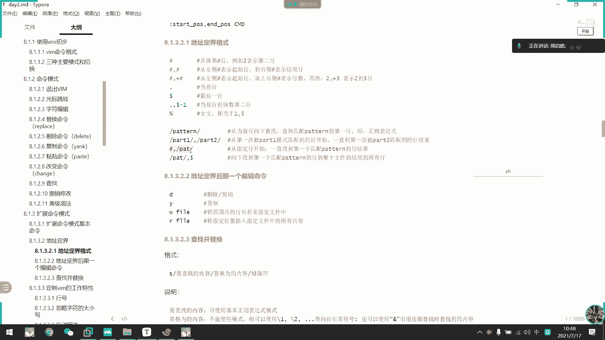
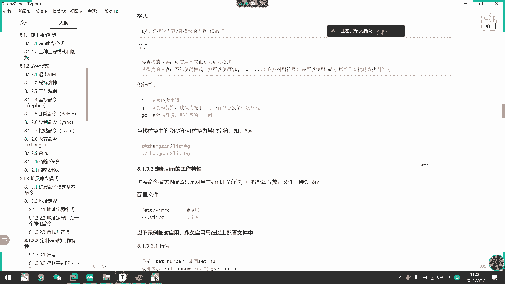
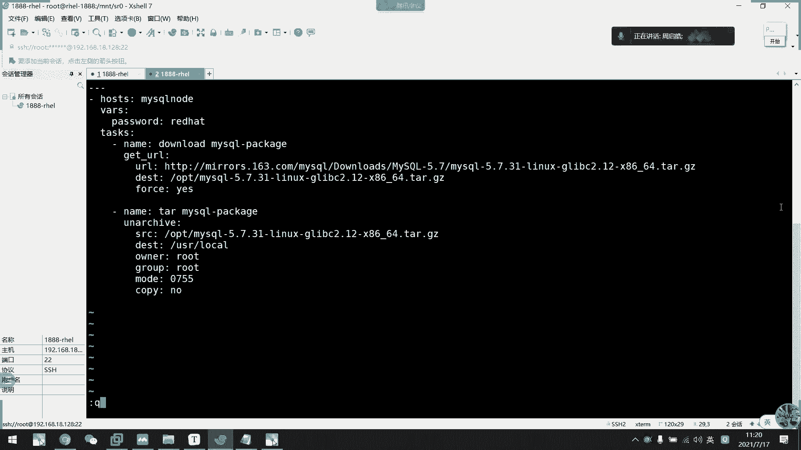

# 2021年7月新版-----RHCE8.2 RH124 RH134 RH294 认证课程 - P10：day3-2 vim末行模式1 - bili_15701050454 - BV1Gy4y1T7ug

来，我们看一下默幻模式啊。啊，我们输入冒号呢可以进入我们的一个墨寒模式，创建一个命令提示符。然后呢，它是位于我们的一个底部啊，底部的一个屏幕尺啊，看到没有啊，注意啊，注意左下角。

啊，这里。注意啊，这里。按一下啊，它就有个一号，我们可以再去输入命令啊。

说明力然后呢。常用的啊W还有WQ啊，说过了，W是保存，然后呢，WQ是保存退出啊，然后一样可以用小X啊，小X。

啊，也是一个保存退出操作啊，但是呢我不建议用这个东西啊，不建议。为什么呢？啊有时候人啊输入多一个符号。就可以多0。1秒的时候啊的时间修思思考啊。到底是不是真的要保存退出啊？

O。啊，要是大写的X是给文档加密啊，大写X。

要后输入啊，比如说wi啊。啊，你看退出，然后我现在打开。诶。Okay。你保存到了。啊，可以啊。对啊这个文件加密啊，然后要输入刚才那个密码才可以。

O。然后是啊Q退出Q烫啊，是强制退出啊，强制退出。密码忘了就。

没了。😊，没了忘了就没有了。在这个个清控密码。哎，走了起不不了。怎么清空不了密码？F。诶，这是不行。改不了密码。Xian。打开。He先。哦，冒号。maha help。Xian。看一下请密码怎么清。

可以删了，但是我不知道为什么刚才操作不行啊。看一下。我觉得直接空格就可以了呀。Q。9。大学X。回车回车。退出。嗯。😊，打死一个好嘅。退出试一下。啊，可以啊，行了啊。看到没有去哪。啊，直接空呃。

回回射两下就可以了啊。马号大写X搜密码。啊，然后是保存退出啊。这有密要输密码。然后其密码的。直接。回车回车。

这就可以了。啊，忘记的话就没有了。啊，这个是不无法破解的啊，无法破解啊，当然肯定有工具可以破解啊，现在黑科那么厉害啊，然后。

那我现在。把这些都删了啊。好，然后呢，我现在写两个问件哈。😊，F1啊F1这里写1888啊，坦科。好，再写1个F2。啊，写个hello。Rd。好。然后呢，我们先在打开F1啊，然后啊。

同时想把F2的追加过来啊，我们要RF2。啊，你看就把F2的内容给追加过来了，看到没有？撤销一下啊，冒号阿lo空格啊，记得要空格，然后是文件名啊或者是绝对路径。发表。嗯。阿楼啊，然后是ETC下的pas。

看到没有？就把啊指定文件内容追加到当前文件中啊。

都R了吧啊。蛮好啊啊。好，然后。把当前的文件内容呢写入一个新的文件。

啊，比如说W啊WF3。WK啊。啊，记得一定要保留退出啊。他刚刚是打开了一个新文件啊，打开了一个新文件啊。啊，我看一下能不能追加到。F2里面啊。不行的啊，你看。或者是。

强制。强制是可以的，我记得啊。

不行。看一下行不行。

不行啊。他只能弄一个新文件。ok。啊，然后探加命令啊，探加命令可以执行一个命令啊啊，但是有所不同的啊比如说啊比如说我在这里。

在编辑文本的时候呢。拿了个任务啊拿了个任务。啊，需要我去看一下啊外网通不通，那么我们就可以直接啊。品百多。看到了有？但那个。呃，占用了我们的前端执行下一个命令。然后当这个命令结束了啊，他才会回到这里。

才不在这里。然后呢啊啊叹号命令呢，可以把那个呃。

命令的输入呃给保留下来啊。比如说我也是。阿龙他。LROOT你看。把结果写入到里面来啊把结果写入到里面来。其实这个。我觉得没什么用吧。还不如重新下路，对不对？

充明一下不就好了吗？可以也可以啊，自己看一下。啊小女来噶。记得啊，t加命令可以执行命令啊。Rt加命令，可以把命令结果呃写入到我们的一个文本当中。好。这些都是呃比较基本的东西啊。

下面呢才是一些比较高级的用法。首先是我们的一个地址定界啊，地址定界啊，冒号是开始。的模式，然后到结束模式，然后是我们的一个命令啊。呃。这个。首先我们来看一下啊。是几号的话呢啊是表示第几行啊。

然后第几行开始第几行结束啊，他一般要加一些那个编辑命令的啊，要加一个编辑命令啊，不然啊敲不出效果来的啊，敲不出效果来的啊，比如说。

啊。Would where passport。先回到第一行。嗯，冒号。怎弄下咯打 o t。一三。D啊一3D顶啊，我是杀杀了三个。然后P。是不是伤痕？撤销看一下啊。细看啊撤销是ro bin的。

还有电mo吧上看。对不对？

啊Ro big table。他就是要加一个。操作啊下一个操作。啊，比如说。呃，这个加啊加是第几行的。比如说我现在是啊第二行啊，第二行是不是我的病啊，然后我要第五行呃。

第五行是LB，对不对？那不。逗号哎。呃，逗号。哎呀，输错了啊。输错输错输叔。2逗号加3。标示。D哦，我知道什么问题了。啊，没进入啊没进入，我们的不好模式啊。啊。2。加3。第一。

所以啊我们是O到5行上除啊。我都话。是不是？是不是杀的四行，2到5还是不四行啊，二三45嘛，对不对？我先把那个行号给出来啊。说的晚了。2。加3。第啊。大家是并到LB都杀了，然后下一还是SYMC啊新的。

对对。这不是 world到性格吗。

剪去了。然后加点回来啊。

诶加个周合吧。然后是点代表大金行啊啊，点代表大金行。

别。啥时候到家？然后是多少啊，代表最后一行啊。多少大概这样，他跟我们的有。呃，密利哈博斯又不一样了，密哈呃密哈博斯大局代表最后一样。然后呢，莫罕博斯呢多人代表最后一行。

修养。但然我们平常用的不是这样用吧。等一下可以告诉你们是怎么用的。🎼全杀了，对不对？E到多了，是不是E到最后压啊，所以全杀了。

好。然后是当前行到多少减一，是不是倒数第二行啊啊，代表倒数第二行啊，比如说呃我再跳一下。

去到第十行吧。第十啊啊跳往下跳十行，往下下十一行嘛，对不对？然后呢，单前行输不是十一行？到倒数第二行就多了减一。28。然后删除。对不对？11行。啊。

往下讲到多了倒倒倒数倒数第二行是不是呃st倒数第一行啊，倒数第一行，他删除到倒数第二行嘛，所以是保留了最后一行啊。这是我们。装系统时候创建，所以它是放在最后了啊。我条件。说的最后一样嘛，对不对？

然后是百分号啊，是代表全文啊代表全文。啊，后是呃模式这个的话呢，我们先了解一下就可以了。啊，因为他是用的是这个表达师啊，这款是我们还没有学啊，还没有学这个表师，所以先了解一下就可以了。

啊，这个表示最简单的一种方式是什么呢？啊，就直接。再创啊下去啊直个下去。嗯。就到第二行吧。这个不行。

ROT啊，然后是第二行。诶，为什么不行？嗯，他要两个模式啊，只只有航道模式才可以啊。

是。那么我们啊就直接匹配啊。这个表是最简单的一种表示方式。他上到哪一下。🎼它要往下啊，这一行不包括啊这一行不包括，所以不行。呃，比如说我就把它移到第二行吧。滴滴。O那么我们来。匹配。冒号ROT。啊。

然后是。不加了，直接删除。Co别。在光标所在还往下匹配啊往下匹配。然后匹配到第一个呢，就进行操作啊，匹配到第一个啊，比如说我现在再来一遍啊，再来一遍。啊你看rD。只要匹配到那里。要就删掉啊要就删掉。

对不对？整一行删掉啊。

O。

14啊模式直接匹配啊模式之接匹配啊，比如说我现在。抽你合文。把这里。可以。他地行始终。有点问题。啊，我在这里。然后呢啊我现在搜第一个bech。然后到第一个loging，我删除啊。

从brsh到第一个匹配到roing我删除掉了。怎么说啊，就RTroot然后是。啊老罗给。啊然后毕。是不伤的很。是杀到兵，从rod杀到兵了，对不对？是不是？怎么粘贴下来了？能看出效果吗？同学们。啊。

有没有看到效果啊？呃，是不是在干啥？再来一遍啊。啊，没办法。啊，不是录的，是be。belash，然后是。啊，注意啊。我觉在。第一个匹配。小一点吧。第一个匹位是我的besh哎。这不是黑色。

第一个比配是我的。He。什么东西？Yeah。啊，第一个匹配s on the best，对不对？所以呢它会在唉关标了。算了啊，先看我当前的光标所在行，在第二行啊，确认我们的光标所在行啊。那。

现在再重新开始。首先是说一个bash，然后逗号。啊，楼了平。这叫做啊完全匹配啊完全匹配。开始好。我们可以看到啊。第一个匹配模式是besch，第二个匹配是lologing。刚刚说了啊。

从光标所在行开始往下搜索，往下搜索啊，往下搜索它匹配到第一个就是我们bes。然后呢，范围内从bessh到lology，是不是这两行。啊。匹配到第一个啊，注意是第一个，然后匹配到第一个。

就开始匹配第二个了啊，从关标锁这上开始啊哇。往下匹配第二个模式。如果当当呃范围匹配呃匹配到了以后呢，从第一个到第二个模式匹配到了他们两个之间有多少行直接删除。这里可能效果不太好哎。给开了。他。

又杀出两个哎。没没我没输那个啊没输那个。美术那个操作啊。第啊删除。能看出效果了吗？现在是不是没有人root还有B啊啊，root和并，对不对？呃，可能这样子效果不太好啊，我改一下啊，直接是匹配模式啊。

root。呃，root然后到我们的helen吧啊。H ALP。第就是说我从word啊一直删到这里。意说到这里，那么我们等一下就是demo跟mail了，对不对？

得我更没有。是不是。能看出效果了吧，这意思。范围比较大了，对不对？范围比较大，那应该能看出效果了，是吧？好。那么继续往下啊。

就往下。呃，就是数字加模式啊，数字加模式其个。

是一样的。那我就直接第一行，对不对？第一行到我们的hel了。对。啊，是不是剩下没有了？最后就是我们匹配的模式加。最后一行。多ra啊多了是不是最后一样，刚才说了啊，是莫涵嘛，对不对？有了都了。学他文啊。

🎼跟那个密桃模式啊，一些操作都是一样的啊，看自己喜欢。但是它这种啊通常不是用于来用于删除的啊，主要是它的一个 command慢啊， command慢。我们后面会说到一个叫做搜索替代啊，搜索替代。

等一下再讲。

现在了解一下，就是他可以接一下可曼啊，接壳曼。然后呢，W跟L啊也是跟刚才是一样的啊。好。刚说了我们这个comman啊。好吗？其实常用于是我们的一个搜索替代啊，搜索替代看查找并替换。啊，他格哥什么了？是。

呃，S然后呢三个斜杠，然后加修饰符。修饰符呢我们一般有IG还有GC啊，但是常用的还是G啊，采用的还是G。然后呢他呃默认情况下，其实每一还只替换第一帧数线，但是其实它已经是全局替换了啊，全局替换啊。

比如说。

什么叫缩索替代？我们来这样子。是不是被搜出一个啊全文搜出一个指定的单呃指定的字符，是不是啊？比如我这里刚刚说的word，他是收到word啊，对不对？要了。我现在把它低代了啊。比如呃刚刚说的一个定界啊。

比如说一刀多是不是全文的意思啊，是不是全文的意思，然后加T代修饰符啊，我们说S。干干干。均好。啊刚刚说了其师傅有I呀、G呀。还有主持，对不对？我看一下。他们的效果。比如说我现在在这里。啊，复制一行吧。

然后在这里打印出来。把它改成大写。好把改大些。这款。O。那么我们先第一行开始，一定一直到末尾1S看看看II是不是哭了大少钱啊。

哎呀，酷略大这险。先把格写下来啊，先把格格写下来。🤧看。那么我这里就写一个root，然后把它改成什么了啊，改成什么好，改成我的名字吧啊，别结文好不好？看掉。为什么要先把它格式写下来呢？

你看这里刚好是一个匹配空间，对不对？两个根号之间。一个匹配啊，我匹配不，然后呢。最后后面啊从第二个根号跟第三个根号之间。啊，把它改成我要替代的内容啊，替我的内容不要规程，看到没有？啊。

但是呢他默认是修改了那一行第一个搜索到的。支付。匹配的啊，不是不是字符啊，是第第一个匹配到的呃字符串那个。这里这里。这里然后是忽略大家行了是吧？啊，刚刚这里是大写的ro，对不对？这是小写的root。

这是他后面那些没有改，对不对？后面那些没有改。谁没有改，那我现在再看一下。啊，改成G。可以啊。全跨了啊。忽略大小哦，没有忽略大小。啊，全快了啊，就小写了全快了，对不对？小写全快了。回去。先先回退了。

然后最后据C。啊，这个就。一个一个来了啊。一个一个来。主席。啊，所以我们是不是可以先看一下能不能对先回收一下。啊。呃，冒浩。GI。全局忽略大小写，是不是？呵呵。😊，全局忽略大小姐。

啊，G的意思虽然他说。呃，每一行只替换第一次去出现啊。但是呢他是这样子的。

啊，他先换了一个，然后往下匹配啊，又匹配到了，又下一个啊往下匹配又又下一个啊，其实它是匹配到同一行，它它匹配到就一直往下跳啊一直往下跳。

O。😊，然后呢，这里。嗯。我看一下。后效已用这里我们先不说啊，后效已用我先不说。到时候我们讲到set的时候就一起讲了啊，一起讲。我们现在只了解它可以搜索替代就可以了。

然后呢，为什么要先把这一个格式写出来呢？我先回退一下。这里还是要大写。还是你一行大写。为什么要先把它写出来啊，比如说。同学们，我现在。要替换的不是一个单词，不仅仅是一个单词了啊。

我现在要看的是把beanb。改成 speed lock。那么怎么写啊，同学们写一下出来，怎么写。我要把。Good luck beb。解咗 speed度 lock。啊，同学们写一下好不。我看一下。

我看现有多少个同学理解了。Come on。给一分钟啊给一分钟写一下。啊，1点01分啊，没有的话，我我我我我来说。继续啊。😊，加酸以后是吧？再说以后这个方式我还没试过，试一下行不行？

但是你那个说以后放的位置是不是不对？嗯。But but。现在行不行？是啊。那让你写的怎么不写？😡，这个要练习哈。睡下行不行啊？啊，小俊的意思是这样子，是不是？啊，是不是？啊。替换的内容啊。啊。

要用引号引起来啊，代表引用啊，试一下行不行？嘿嘿。😊，直接啊。😊，啊，是没有搜索到这个该字符串啊。啊，所以呢要怎么做？为什么要先把格子写下来？你看如果是这样子。是不是很乱呢？很明乱啊，对不对？很明乱啊。

这里还少了一个根号。啊，没有没有没有跟他。这里有没有很少。啊，是不是？那么我们需要转移啊。其实两个根号之间是一个模式匹配啊，因为我们没有学校正在表达式，其实它跟我们刚刚的一个模式是一样的。

里面的内容是它相匹配的内容。如果这样搜啊，的确是可以收到beanbsh。啊，但是他到底是哪一个才是啊作为它的一个分割符了啊，是它的分割符哪一个？而且。在匹配当中呢。他把根号啊就当成是我们格式类的根号。

你看我们现在敲行不行啊，是不行的，对不对？啊，他把它当成根号了。所以说啊它那个语法是有错误的。所以我们要把替换的内容啊进行转译啊，把它当成是一个普通的字符转译啊。我们说过了。

直接用一个反斜杠把我们的一个。制服转移对不对？最少了个。那不就搞定了吗，对不对？看到没有？啊，他把最后这里替代了啊，这里本来是beb嘛，对不对？再看一次。到最后样了。直接看到这一个效果吧啊。

直接开这一个效果。搜索替代啊，把并b搜出来，改成视频入平的。但是。所以呢我往这里看是不是很凌乱啊，是不是很凌乱。啊，所以建议先把格式写下来。当然。啊，这是一种方式而已啊，这是一种方式而已。

我们的分割服啊。其实。我把它。根号不作为跟分割符不就不用转移了吗，对不对？对，没错，be ba。然后是视频多，我现在是没有分客服，对不对？我们把分个符改一下就好了。那是不是就不需要转移了嘛，对不对？

刘乐杰。是不是。其他家收不到啊。し。不。他食。15分钟啊15分钟左右。好，再来。嗯。😊，这个还没讲到啊，不要提前问。啊，你看是不是可以了。啊，我们不把根号作为风格符就好了，对不对？

那么就不需要转移了嘛啊，让我们的VIM啊，包浩博士知道我的分割符是几号，那么我的根号就是一个字符而已啊，就不需要转移了，对不对啊，他没有其他意义了。原来的话啊，它的11455的分割，所以需要转移。

对不对？那么我现在用极了，它是不不用转移了啊，大家用艾也可以了，用艾也可以。但是他现在说不到，再来个，现在有必备去了。他就收到了，对不对？好，看大家喜欢吧啊，我个人认呃我个人觉得呢能用。

啊，能用斜杠去做分割符，就用斜杠去分割符。啊。要学会转移啊，转移那个在我们系统中是经常用的。但是如果你说真的很长很长的话呢啊你用这个我也没话好说，对不对？也没话好说啊。

但是一定要注意一下我们的一个分割符就好了。啊，注意一下我们的转移的用途就好了。因为转移的话呢啊在现有代都是采用的。

转移的意义是什么呢？呃，说的这么明显，还不知道都说了啊，在正常情况下。我原来的格式。呃。是这样子吧，然后呢，我在这条命令行语呃，在这个这块语句中啊，这块语句中啊不是命令这块语句中。我。

斜杠的意义是不是用来做分割的啊，是不是是用来做模式匹配的，对不对？那么如果我继续敲beb。那么系统是不知道你这个根号到底是干嘛的啊，不知道你里面的根号是干嘛的。那么我们是不是需要转移啊？啊。

把它作为一个字符。啊，要告诉系统，这个就是一个字符，这叫做这就叫做转移啊。啊，不是固定格式，刚刚都说了。大家都说了，可以用井号啊。啊，但是。S然后分割区是一个固定格式来的啊，是固定格式。

一多了的话不是固定格式啊，是我们的位置定界啊啊，一多了是我们的位置定界。所以。我刚才说了啊，先先跟你们说位置定界为什么要先说位置定界了啊，就是要用到这个搜索替代用的，最常用的是诉索替台啊，并不是说这个。

呃，然后加加一些什么删除复制啊，我们在命令行模式已经可以做到了，是不是啊，在命令函模式已经可以做到了。从第几行复制到第几行。完全没有问题，对不对？他查的还是缩索替代啊，用于搜索替代。

好。

那么我们过了啊，然后。呃，一些。啊，蓝点就在这里了啊，蓝点就在这里了。过了两点以后呢，就是我们一个工作特性啊，定制个人的工作体醒啊特性啊。定制个人的工作特性。啊，比如说。

刚刚那个行号显示啊啊，我们要默号模式set MU显示行号啊，set low NU撤销。是。能看到。呃，看明白是吧？好。然后啊是set。list啊list啊，这个是什么呢？可以把显示我们当前。

当前文本中所有的字符都打印出来，都显示出来啊。比如说多了夸幅啊，这些本来应该是隐藏的啊。比如说我这里。先撤销。L list。loglist那么比如说我现在是。这样子。和这样子。同学不能看出区别吗？啊。

能看到区别吗？如果不是光边透洞。能个有区别吗？🎼啊，是不是都以为他是有8风格啊，提示护养啊。一个是我们的table制表符啊，一个是我们的空格。如果。我写的这样啊，PP文件写的这样，有时候。

GOD是读取不出来的。🎼啊，字表符跟空格是不一样的啊，字表符跟空格是不一样的。你看这就是我们的table字表符啊。虽然说啊一般来说我会把字表符给啊就是table这个字表符给关掉啊，改成我们的宫格啊。

一般来说都是这样做啊，因为写脚本啊，它很呃脚本一般都不读取字表符的，会会照着错误的。然后多少是我们的框行符啊。

啊，一般都是这个啊一般都是这个。好。然后是酷略大造险。啊，回到写的话就用于搜索而已，了解一下就可以啊。然后是自动缩进啊，什么叫自动缩进呢？啊，比如说我现在。

嗯。比如说我现在写了一行。ABC啊，你看这样子就没有自动缩进了啊，这样子就叫没有自动缩性。那么我们开开起来啊。set they are呀。ABC。不是AI吗？所以呀。挖了红壳，这就叫做自动锁性，对不对？

这这是一些语法的。啊，有有时候写脚本啊，或者是我们到后面写啊呃剧本的时候就要用到这种啊自动锁紧啊，就比较方便一点。

不要发微一点。🤧好，然后继续往下啊，刚刚说了啊，解释宽符，还有治疗符啊。Sa least。

啊，要是啊这个也重要啊，就保留复制格式啊。あれ不是です。我看一下现在能不能做出来。我看一下。呃。

我打开一个版本睡下。

嗯。

啊，这也是我们的一个剧本的写法。

呃，了解一下行，说不行。不用这个打开了。他把它转转换了。还是我们的。记术本打开吧。啊，这是我们的剧本啊，我看一下现在复制过来会不会那个。

随便复。啊他。那他现在又又不乱了。啊，没有了保留了复制格式。嗯。怎么样才能让他不保留呢？还是这么整齐，我也不知道为什么。

哦，我知道了啊，他这里少了一个框行。啊，windows的一个文本格式跟我们的一个linux文本格式不一样。但是我现在。我随便负一段。

呃。

看下行不行。好饭。啊还是这样子啊，那不管。我本来想想说他这样子复制的话呢。啊，可能会。

呃，格式会有变化。看一下有没有放力。就是有时候会。呃。格式不对呀，有时候格式又给对呀。所便找一个。那这些。😔。

是不行？还是对齐。啊我也不知道为什么。啊。啊，反正你们遇到了。嗯，我吧。那时开起来开下行不行？啊，不行，那说了啊，反正如果你们遇到了它粘过来的话呢啊是一直这样子呃缩剂啊，一直有缩计。

一直有缩计保留的话呢啊会变成一个斜陷下来的啊。是这样子。比如说这里一行数据啊，然后它本来有空格的话，这里一行数据啊，有空格的话，这里一行数据，这里一行数据，这里一行数据它格式会非成这样子的。

会非常凌乱啊，会会会非常凌落。所以呢我们需要啊。Se别。PT。突然间忘记VP了。T。啊，是这个啊这个叫做啊，你看我现在采用模式，它会显示这个PST啊，叫做保留复制格式啊，保保留粘贴格式啊。

所以说你遇到刚才那个情况的话，那我们就输这个啊，让他保留复制格式就好。

哎。

我遇遇不到这个，现在不知道为什么，有时候遇到有时候遇不到。

好难受啊。好好，我可能是这样。🎼把他拉进来看一下是行不行。

把它导进来看一下行不行。怎没有装。做一下。离仓库啊。嗯。

嗯。😊，说什么了？Base OS。有问题吗？嗯。😊，老 medium老饭。没挂盘。

重装了唉，没办盘。重装了没光盘。哦，对他现在变成E盘了，重中了它反了。把地发俾佢。

Yipang。O。所以说这个把它拉进来看一下行不行。

嗯。哦。

在哪儿去？

看行不行。再不行就算了。嗯。嗯，怎么没有。哎呀。

再重一次啊。

看一下行不行。哎，复制不了了。

好烦啊，现在从做了以后都就这个。怎么又有同学可以开麦嘞？

啊。复制一下看一下行不行啊。还是不行。还是不行，那就算了啊。大家遇到的时候。知道要怎么做就好了。是因为我没有CI嘛。啊，可以了。嗯。这样情况下，他们两者只能共存一个啊啊，一个是缩进啊啊一个是缩进啊。啊。

如果开了说机，自动缩机的话，它就变成这样子啊。然后呢。啊，撤销掉。然后我们这里sPSST啊。保留粘贴格式。这就可了。强制要保留。

走说可以啊。好。然后刚刚才搜索默认是开启的就不用说了啊，语法高亮啊，也是默认开启的就不用说了啊啊，要t on啊。然后呢是先休息吧。这个文言格式，我等一下详细跟你们讲一下。

让你们了解一下。现在就行。