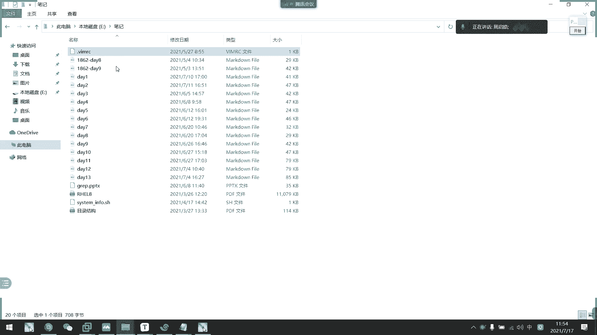
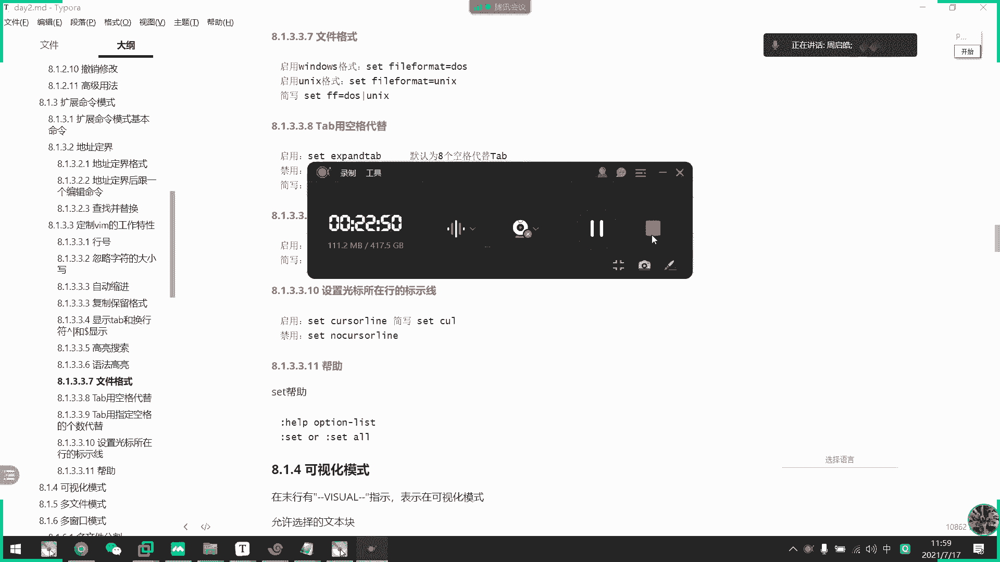

# 2021年7月新版-----RHCE8.2 RH124 RH134 RH294 认证课程 - P11：day3-3 vim末行模式2 - bili_15701050454 - BV1Gy4y1T7ug

啊。改一下名字啊，就说太死了。好，我现在把它。嗯，操作失败。在是里呢？は。不好意思啊。好，把一一下。啊，把它发过来，然后呢。我们来看一下。啊，这样子是看不出效果的呀。啊，这以你看不出效果。那么。

我们就看一下fial啊这个命令，然后看一下我们t。呃，这里。好。然后是20个码的一个文件，然后是。包含了我们的CIF看完。然后我们来看一下fireo。随便一个吧。我们呃。

linux啊unux里面的一个文件。这看。啊，windows。是这样子的。unux或者U是这样子的。啊，做说明。我们游理。或者是linux啊，是不一样。虽然他们都是阿阿斯克玛编制啊，阿斯格韦编制啊。

有开放技术的同学应该知道什么叫阿格斯玛。好，可以看到啊。我们这里先看一下这个表啊啊，这是我们的阿克斯曼表啊阿克斯马表。然后呢啊我们主要关注这个十六进制啊，十六进制。啊，16乘4，然后。

刚刚是不是有1个CR什么来着？啊，虾啊。啊，CIF啊啊它代表的就这个。我们的一个干肉啊干肉。🤧咳。这什么了？这代表我们windows里面的一个回车符啊回车。然后呢，在我们的linux里面呢，它跨行只有。

啊，M啊，这个话是0A啊，注业0A，还有1个0D。我们来看一下怎么看。Human depths。然后是看我们的刚刚那个testTST。这里可以看到。啊，6261。看下6261。嗯，找找啊。62。啊。

这个。62。啊，是不是我们的逼？啊，6亿是不是我A呀啊，626亿。要继续往下。诶。啊，在隔壁啊。啊，然后注意啊，有1个0D6363是我们司机嘛，所以我们第一行是不是ABC。啊，然后再加1个6D啊。

0D啊，0D0D是什么呢？我们看一下啊。云地。是不是我们的国学符啊啊，这就是我们的windows的啊windows的一个文件格式啊，window式。所以呢虽然我们看不见。

但是如果我们在windows上面写了脚本以后。移过来。他每一块都有一个CR。会导致我们的脚本执行失败的啊，会导致脚本执行失败，识别不了CR。然后我们看一下。lin的。算了，再写一个吧。打的复议。啊。

也是一样ABC，然后是ABC。各者我们继续。看一下啊，然后是什么。刚刚这里是第一个啊，然后这里是610A是是不是我们的A呀？L是BC这样子的。后面带个编制，我也。还没还没分析啊，然后我们现在看一下H。

啊，HEXDMPR，然后是F1。这里可以看到也是。62610A63啊，注意是0A630A是什么呢？0A是不是我们的呃杠恩，对不对？就是新新函嘛。所以windows呢啊它的一个框行是0A加0D啊。

0A加0D。看下是不是啊。0D，然后是0A啊0A加0D。DA你D嘛，对不对？狂寒了。嗯， ok。然后呢啊我们unix的文件啊是这样子啊，你看。ABC0A框行啊，然后是啊A换行B换行C换行，对不对？啊。

这就是啊你们那边字。当然。也不是说在windows上面。写了文件啊，在unic上面就用不了了啊，也不是这样说，我们可以转框啊，但是要装一个工具啊，叫做。呃，dos。To unique。啊，不对。

好inst没有了。那sinto do啊，那就已经有了啊，我们图形框安装已经有了，那么呃怎么做呢？就直接doss。tto un啊，然后是我们的test test。啊，这就是切换的啊这就是切换了。

然后我们再fi一下fi。Test TST。看到没有？这边成阿克斯开，然后再Q。不求呃大。然后是test点。这里看到了啊，他把CR没有了啊，CR都没有了，对不对？0D啊是0D都没有了，0D都没有了。

是不是变成跟我们F1是一样的？看到没有？他的编码已经是一样了。02610A63一模一样，对不对？这就是两种。文档呃文档的区别啊，它是通过我们阿克斯马编制的啊，阿克斯马编制啊，这一点要注意一下。

那么在我们的呃。里面呢也是可以这样子临时切换啊，临时切换啊，原用哪哪种格式啊，比如说啊我现在。嗯。有填写。

好，我们看一下。呃。啊，把它切回去啊，切回去反过来unux。Two dos。Test theDD啊。这样子切回来了。看到没有？然后我们现在打开。这个文件啊，然后冒号sFF等于unux。你看是不是切块了？

啊，是不喜欢啊？啊，其实这个没什么用。啊，知道就好了知道就好。就是说这以我们平常写脚本的话，我建议都是在unixux上面写啊，写完再导出啊，写完再导出。

好。啊，然后是一些比较重要的啊重要的这两个啊。是我们那个table啊，用通空格代替啊。刚刚说了，我们table键是呃制表服务，对不对？

这个就这个啊哎。好，我先把它写出来，s list。然后呢，我们现在输入一个制表符table啊，你看它是一个啊。托支付哎啊代表人。然后空格啊就是空格了啊，空格就是空格。合适。法个书。那么。😡。

如果我们想用table。啊，来代替空格，我们一般怎么做呢？一般我们不需要这个制表服务，但是呢用tableable作为我们几个空格啊的一个快捷键，我们就直接。先把这些删掉。这直接都跳回前面去了。

🎼真的难受。好，我们就set。呃，ET啊。是的一定你啊。你看这里我们一回头就知道了，一回头就知道啊，是一空格来的，对不对？好，再打开一个set list。🎼啊，我现在是按table啊ontable啊。

它就变成8个空格了，默认是8个空格，我数一下12345678，对不对？八个空格啊，8个空格。啊真啲唔包噶。🤧咳。啊，这是啊把table作为。空格。🎼table我作为同个。好，那么。

🎼想要控制多少个啊想要控制多少个，我们就直接set TS啊等于2啊，这就可以控制我们的一个。啊，一个table等于多少个空格，看到两个。啊TS啊TS。两个对不对？两个。好，那么我们可以看一下。

刚刚说到了。我们后面要选剧本。会不面要写剧本？大家可以注意到啊，我们的剧本格式啊是不啊这个叫做样本格式啊。所以我们要写的时候是不是原用这个很方便啊啊，你看它每一层绩都有一个缩紧啊。

每一个成绩都有缩紧啊缩紧。我说紧。所以呢我们写这个的时候呢，就很方便了啊，直接什么回车。说。回车啊啊，这里有那个啥。老皮啊。啊，他刚刚有那个什么来着？有那个。这都说近啊。还是有这种说性啊。啊，不管他。

反正我们写的时候啊，他正常要就是说。就是有就是说应该也调到调到这里才对啊，贴到这里啊。然后我们table。啊，这里没事了。啊，刚刚是临时的。said。呃，什么来着？嗯，你提啊。表示TS等于4啊。

再把AI也开起来。哎，回车。他怎么去到那里去啊，这里啊这里是正常的啊，然后呢是个table啊，然后杠内。回车啊，是不是啊有缩金吗？对不对啊，然后是get。问号。他怎么。有问题啊哦，我知道了。啊。

是个t啊，没问题啊。啊，那不管他啊，我们知道就可以了。到时候我们写写这个，我总动写一个吧。就演示而已了，我们到时候要写的，就这样。什么hosice啊。啊，然后是Task3。好，然后是什么？金拎啊。

但这里没有改。哦，我改了4个。现在开起来啊，哎啊，它这这样缩进步就到这里嘛，然后我们缩新一下啊，然后这里写模块啊，比如是debu啊。你看他。又出问题了。啊，算了。我这个有问题。

啊，就反正这个很方便，我就把空格啊，把把table改成空格啊。所以说TS等于几。这个要记住啊，然后啊这个也很好的一个东西啊，叫做呃标志线表现什么呢？

啊，比如说。呃，我现在。打开password啊，是不是很多东西啊，有时候我不想看我光标再来一行。Sa。看到没有？是不是很清晰的看到我自己在哪一行了。对不对？啊，然后我再找光标就好了。啊，最后显科。

好。啊，最后是一个帮助啊啊帮助啊，一些更加多的东西刚刚也用过了。

M。这点关注啊，就是我刚刚说那些，其实这里都有啊。但是也不是很会看这个东西。会跳转，不可跳转。不对啊，应该是。T。不是。好，这里。啊，就是我刚才那些个。嗯 know。啊，这些都一些解释啊。没有。嗯。

那算了。

帮助。好。🤧。那么。啊，我们刚刚所做的所有东西，除了系统默认的了，它是临时性的。

标识线是不是没有了啊，我再开呃下。这样才有先，到时退出。回又没有了，对不对？所以啊我们需要把它给永久保存啊，作为我们自己个人的特性啊。西怎么做呢？个人的啊跟我们的点baRC是一样的。

但是我们这里要显示VMRC啊VMRC。呃，要写在加目录啊。比如说 set。修L。一批。TS等于2。ASTE。其实这两个。同时开应该也没有问题啊。东去吧。啊，可以了。我是VI password。

吃保留下来了。保留下来。这里就不提问了啊。啊，就是我们学在加布录的话是个人的啊，是个人的。我们协欢他st用不起的。看又没有了。啊，是个人的。🤧Well。看到没有？啊，当然的话还有一些其他语法啊，比如说。

呃，笔记没有，但是后面会呃讲到那个啥呃。S。F。Style。No。一样。这是要写。哦，不对。嗯。是不是这样写忘记了。啊，出事了。Yeah。还要等于啊。对呀哎，怎么这样子？啊，忘记这个怎么写了。

它指定指定执径文件格式啊，就是它结尾啊是啊是样么文档啊，是样本文档。

我这里有一个例子。呃，这里有个例子，但是他是用判断的语法去写的。

有点复杂。就写的有点复杂，又会用判断啊，但是他为了啊要扩展，就一定要用判断啊这里啊。这个哎说了。呃，拉到。

是我这个删了。嗯，好。Hm。刚刚出事啊，你看他是分开写而已啊，这些分开写我们是可以啊，像我刚才一行把他写的，主要是这里啊。啊，他这里是做了一个命令判断啊啊，相当于是说如果啊自动自动一个命令行啊。

然后如果新建文件呢，是以呃点SS结尾的话呢啊就输出以下内容啊。啊，输出以下内由。啊，是这样子，然后是函数啊，你看他说冒号其实是读了一个命令啊，call啊，call读了一个命令，然后是这个函数啊。

读这个函数。然后这个函数什么呢？啊，这样子，如果他说结尾啊，结尾是SHH啊，是SH啊，然后呢就写什么东西呢？啊，就这是这么几行，然后呢是结束函数啊，然后是什么。呃。这个不用管。

这这这一句跟上面已经没关系啊。是普通文件什么之类的。我们现在把这个啊。复制过去啊。覆盖掉，然后我现在写一个。呃。脚本啊。刚刚说了点SS取结尾的，你看它就会有自动有这些了啊，自动这些。

什么读了我们的一个文件名啊，什么创建日期啊。等等。然后呢，这里写作者信息啊啊，联系方式啊，QQ啊，这也可以加啊，这也可以加。这也可以加啊。主要是自己加进去而已，我这里没有加，因为是一个模板啊。

是一个模板。那么我们到时候以后学到写脚本了，我们就可以直接用这个啊，直接用这个。好，就知道这己什么时候写了个脚本啊，然后保留下来啊。啊，这要是于什么手候写的？对不对啊，可以知道这己是什么时候写了。

然后啊三年后回头一看，哎呀。我以前写的这个这么恶心的剧这么恶心的脚本啊，都都都是呃有BUG的脚本，是不是有没有看过一个。呃，视频是怎么的？就说啊。呃，程序员看到3年前自己的。呃，那个叫什么叫叫叫做什么？

三年前自己写的什么呢？代码啊是说一个呃敷着面膜的肥胖女人，然后走过镜子，然后自己把自己也吓倒了。有没有看过那个啊。好，这个了解一下就可以了，我也会发给大家这个我也会发给大家。一都差不多啊，对。

不写注释啊，所以啊写注释是一个比较好的习惯啊。

好，然后。刚刚说了是个人的啊，所以是写要加目录像啊。如果是全局呢啊跟我们的呃bech啊是一样的啊，也是写在EDC下ED下啊，然后VIM点RC啊EVIM啊。

行其实他有的。他有我们为什么会有语法高呢？其实他在这里已经有定义过了。就第一个了。我们看一下能不能找到点H7这个东西。啊，没有。也没有。Where am in。啊，没有，所以他应该用了一个条件判断。

把它给。覆盖了，所以要找也不好找。反正他有一个读取顺序吧，才能预测。啊，算找不到也没关系啊，我们直接写到最后啊。哎呀，妈了个屁。🎼不小心按错了，按了个P键。恶魔在这里写。嗯。什么 set的。Sure。

加个线吧。然后我现在切换了s。VF1吧，你看是不是有个线了？啊，这个叫全局啊。

全局啊，跟我们beRC是一样的啊。好。呃，那么我们的一个。嗯。默罕模式啊。也讲到这里了。啊摩模式。那么我就。

