# RHCE认证课程：3-3：Vim末行模式（第二部分）

在本节课中，我们将继续深入学习Vim编辑器的末行模式，重点探讨文件格式转换、缩进设置、光标辅助以及个性化配置等高级功能。这些知识对于编写和维护脚本文件至关重要。

---

上一节我们介绍了Vim末行模式的基本操作，本节中我们来看看如何处理不同操作系统下的文件格式差异。

## 文件格式：Windows与Linux的区别

在Windows和Linux/Unix系统中，文本文件的行尾标识符是不同的。这可能导致在Windows上创建的脚本文件在Linux系统中无法正常执行。

*   **Windows系统**：使用回车符（CR，`\r`，ASCII码`0D`）和换行符（LF，`\n`，ASCII码`0A`）的组合（`CRLF`）来表示一行的结束。
*   **Linux/Unix系统**：仅使用换行符（LF，`\n`，ASCII码`0A`）来表示一行的结束。

我们可以使用`hexdump -C`命令查看文件的原始十六进制内容来验证这一点。

**查看Windows格式文件示例：**
```bash
hexdump -C test_win.txt
```
输出中可能会看到`0D 0A`序列。

**查看Linux格式文件示例：**
```bash
hexdump -C test_linux.txt
```
输出中只会看到`0A`。

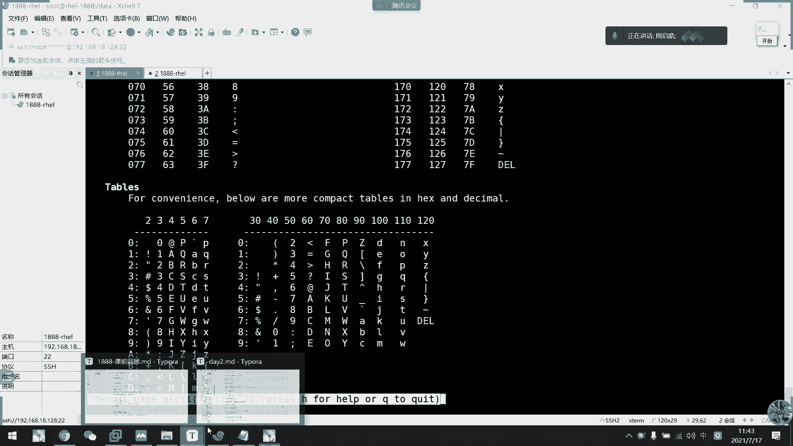

## 文件格式转换

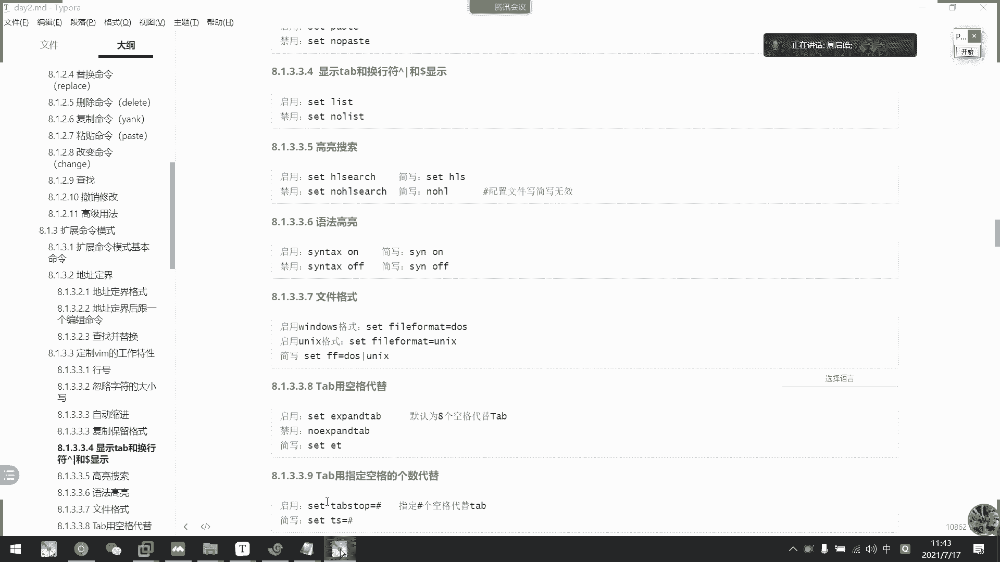

为了解决格式不兼容的问题，可以使用`dos2unix`和`unix2dos`命令进行转换。

**将Windows格式转换为Linux格式：**
```bash
dos2unix test_win.txt
```

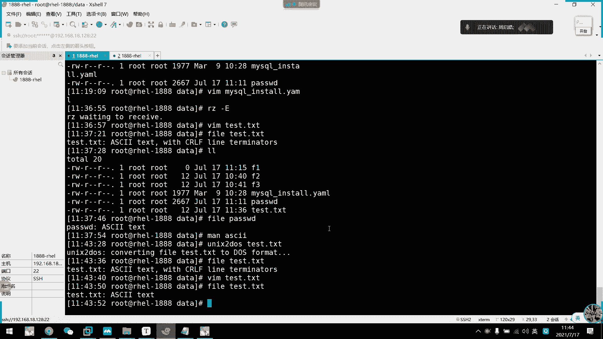

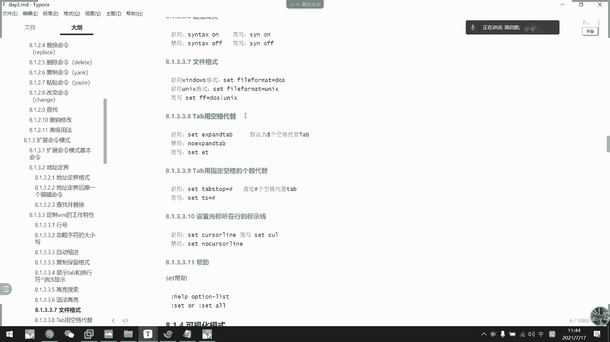

**将Linux格式转换为Windows格式：**
```bash
unix2dos test_linux.txt
```

在Vim的末行模式中，也可以临时指定或转换文件格式：
*   `:set ff=dos` 将当前缓冲区视为DOS/Windows格式。
*   `:set ff=unix` 将当前缓冲区视为Unix/Linux格式。

---

了解了文件格式后，我们来看看如何优化Vim的编辑体验，特别是对于编写需要严格缩进的代码（如Shell脚本、Python脚本）时。

## 缩进与制表符设置

默认情况下，按下Tab键会插入一个制表符（`\t`）。在协作或要求使用空格缩进的项目中，我们可以将Tab键映射为指定数量的空格。

以下是相关的末行模式设置命令：

*   `:set list`：显示不可见字符（如制表符显示为`^I`，行尾显示为`$`）。
*   `:set expandtab` 或 `:set et`：启用后，按Tab键将插入空格而非制表符。
*   `:set tabstop=4` 或 `:set ts=4`：设置一个Tab键在屏幕上显示的宽度为4个字符（仅影响显示）。
*   `:set softtabstop=4` 或 `:set sts=4`：设置按Tab键时插入的空格数量为4（配合`expandtab`使用）。
*   `:set shiftwidth=4` 或 `:set sw=4`：设置使用`>>`、`<<`或自动缩进时的缩进量为4个空格。

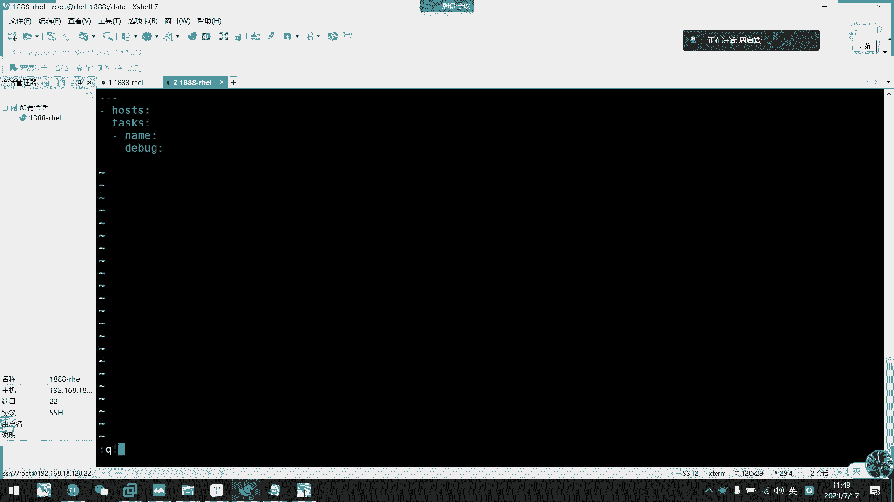

一个常见的配置组合是，让Tab键产生4个空格，并且缩进也是4个空格：
```vim
:set et ts=4 sts=4 sw=4
```

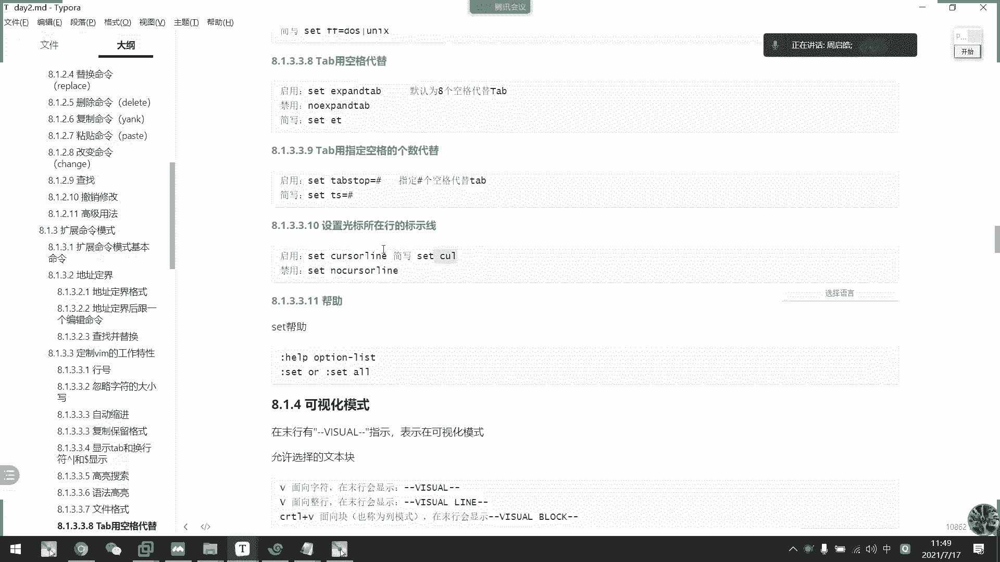

## 光标行高亮与标尺线

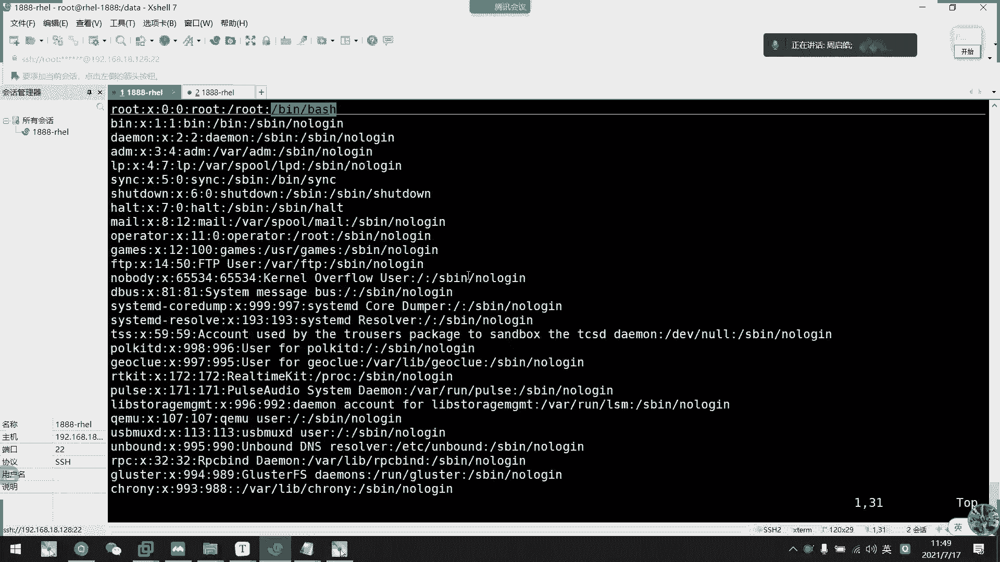

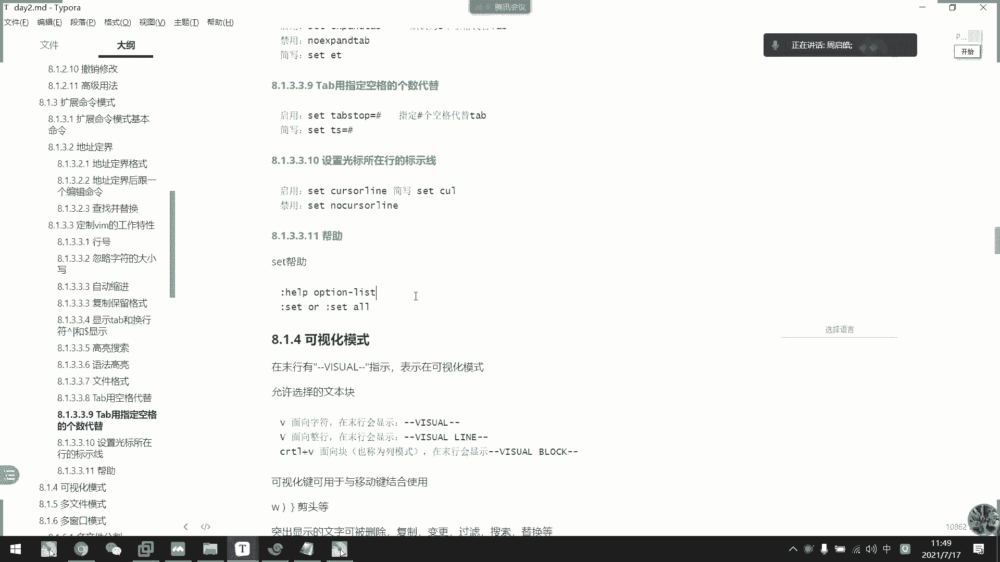

在编辑大文件时，快速定位光标所在行很有帮助。

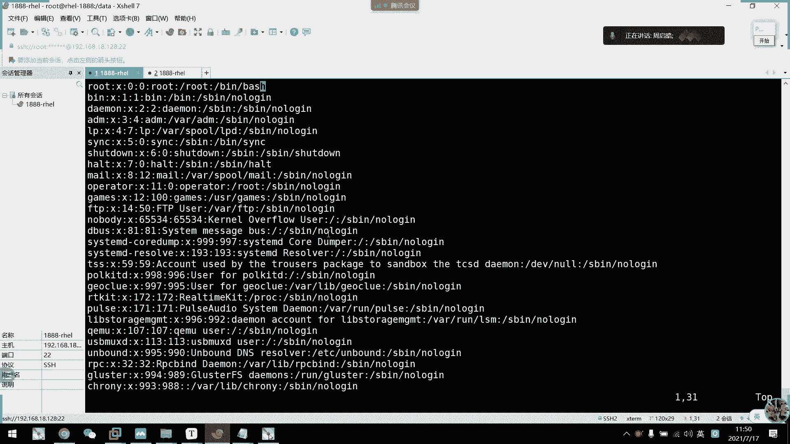

*   `:set cursorline` 或 `:set cul`：高亮显示光标所在的行。
*   `:set cursorcolumn` 或 `:set cuc`：高亮显示光标所在的列。

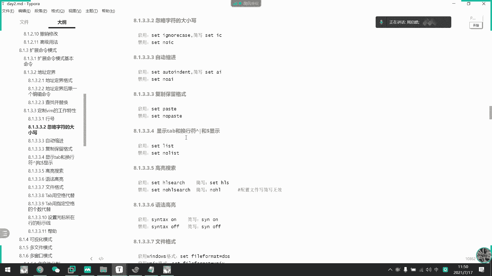

此外，可以设置标尺线来辅助对齐：
*   `:set colorcolumn=80`：在第80列显示一条垂直标尺线，常用于提醒代码行宽。

---

以上设置通常在单次Vim会话中有效。接下来，我们学习如何将这些偏好设置永久保存。

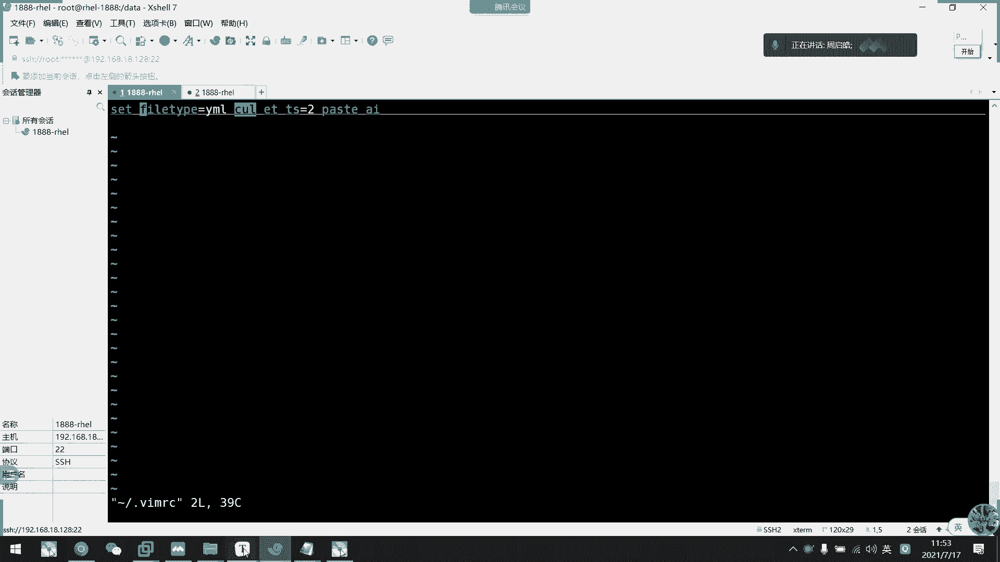

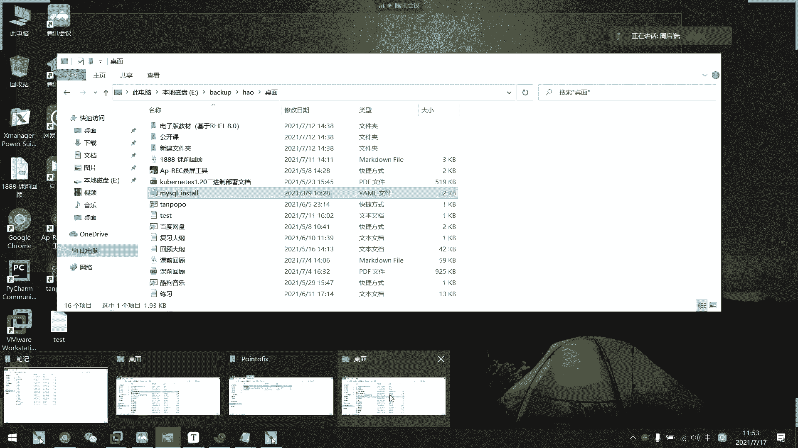

## 永久保存个人配置

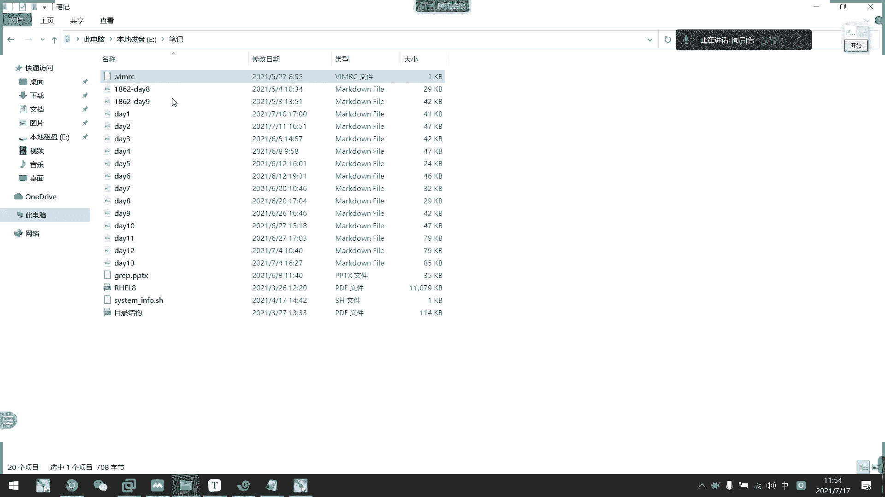

Vim在启动时会读取配置文件来应用个人设置。配置文件分为用户级和系统级。

**1. 用户级配置（仅影响当前用户）**
配置文件位于用户的家目录下：`~/.vimrc`
将你喜欢的设置写入该文件即可，例如：
```vim
set expandtab
set tabstop=4
set softtabstop=4
set shiftwidth=4
set cursorline
syntax on
```

**2. 系统级配置（影响所有用户）**
全局配置文件通常位于：`/etc/vimrc` 或 `/etc/vim/vimrc`
修改此文件需要管理员权限（使用`sudo`）。一般建议优先使用用户级配置。

**3. 高级配置示例：自动添加文件头**
你可以在`~/.vimrc`中添加函数，让Vim在创建特定类型文件（如Shell脚本）时自动生成模板。以下是一个简化示例：
```vim
function! AutoHeader()
    if expand('%:e') == 'sh'
        call setline(1, '#!/bin/bash')
        call append(1, '# Author: Your Name')
        call append(2, '# Created: ' . strftime('%Y-%m-%d'))
        call append(3, '# Description: ')
        call append(4, '')
    endif
endfunction
autocmd BufNewFile * call AutoHeader()
```
这段代码会在新建以`.sh`结尾的文件时，自动插入Shebang、作者、创建日期和描述等行。

---

## 帮助系统

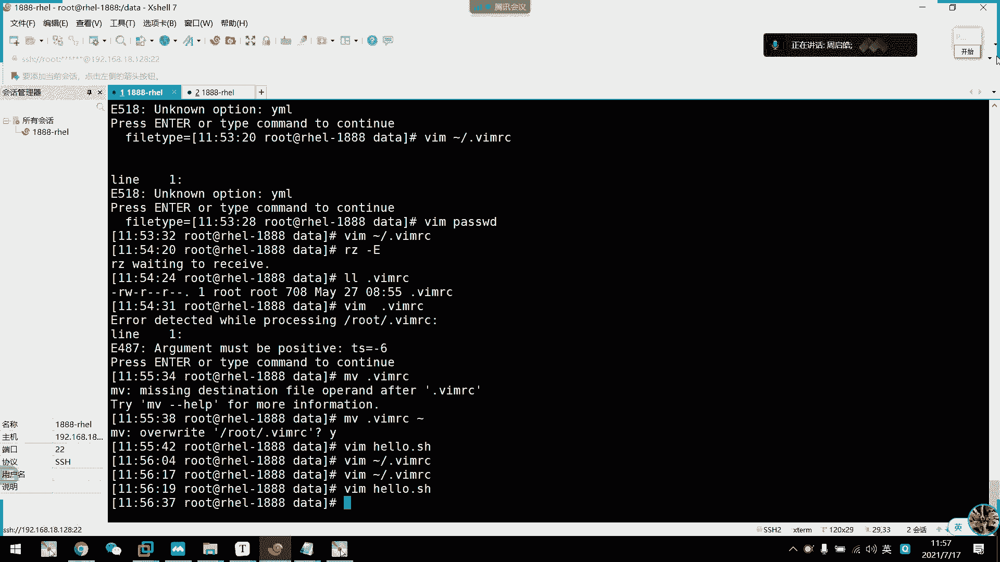

Vim拥有非常强大的内置帮助。当你忘记某个命令或想深入了解时，可以随时查阅。

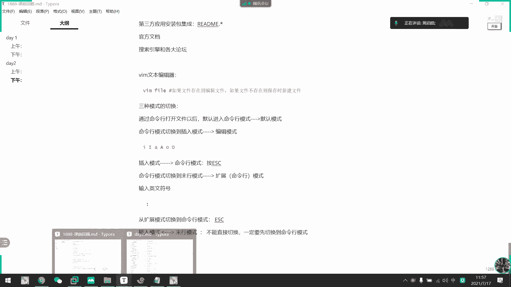

*   `:help`：打开帮助文档的主页。
*   `:help option-list`：查看所有可设置选项的列表。
*   `:help ‘cursorline’`：查看关于`cursorline`选项的详细帮助（注意选项名需要加单引号）。
*   在帮助页面中，使用`Ctrl-]`跳转到超链接，使用`Ctrl-T`或`Ctrl-O`返回。

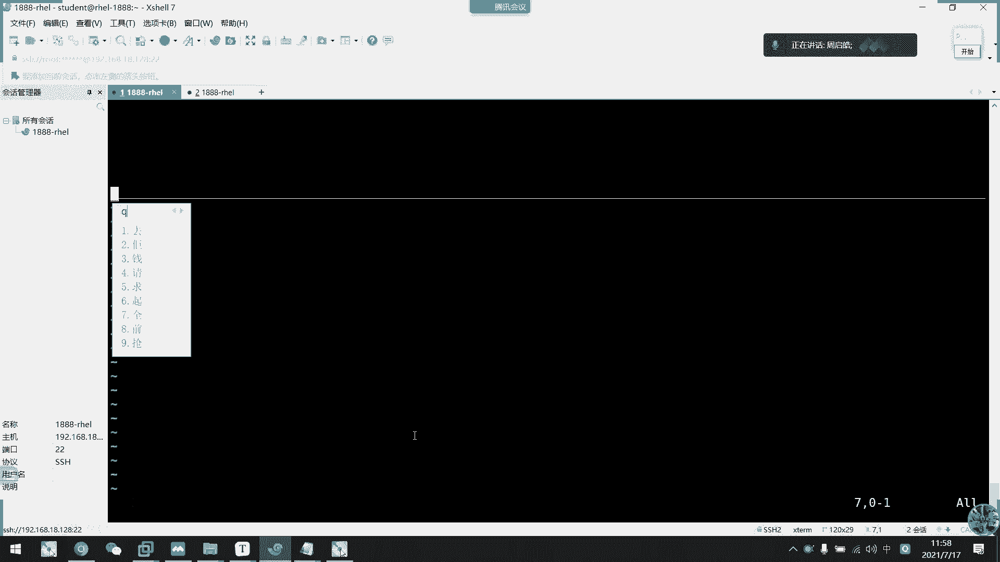

---

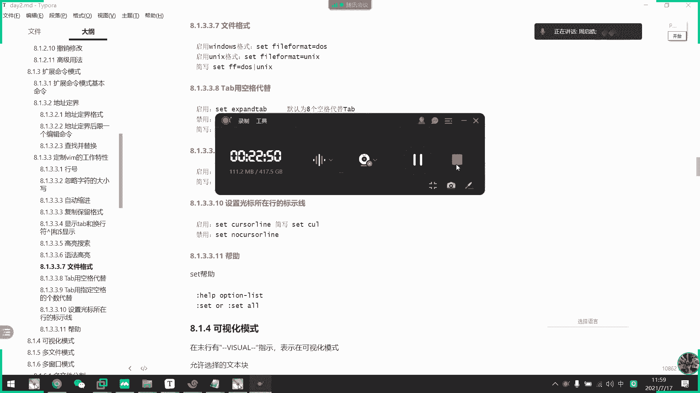

本节课中我们一起学习了Vim末行模式的进阶功能。我们探讨了不同操作系统文件格式的区别与转换方法，学习了如何配置Tab键和缩进来满足编程规范，掌握了高亮光标行和使用标尺线等辅助编辑技巧，最后了解了如何通过`~/.vimrc`文件永久保存个人配置，甚至实现自动添加文件头等高级功能。熟练运用这些配置，将极大提升你在Linux环境下使用Vim进行文本编辑和脚本编写的效率与舒适度。