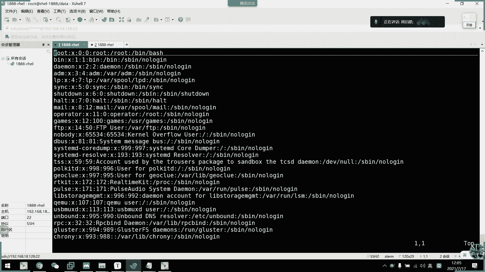
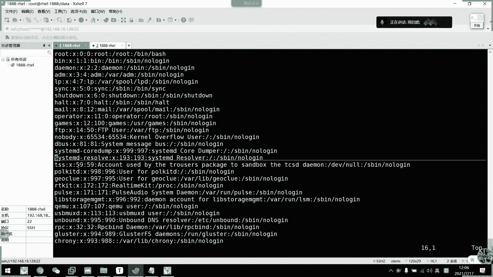
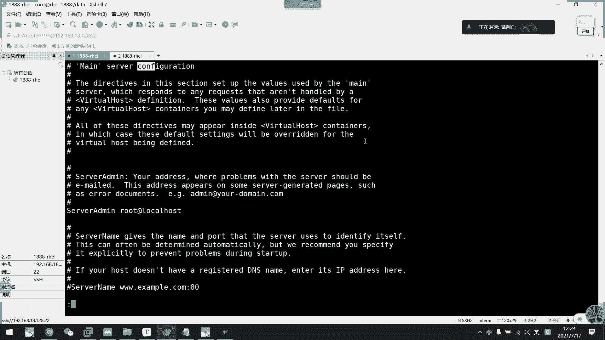

# 2021年7月新版-----RHCE8.2 RH124 RH134 RH294 认证课程 - P12：day3-4 文本处理工具 - bili_15701050454 - BV1Gy4y1T7ug

好，那么接下来。啊，就是我们一些。呃，其他的东西啊啊刚刚说了，其实我们VIM是有4种模式啊，最后一种叫做可视化模式啊，可视化模式就是我们的一个叫做快操作啊，快。啊，不是快慢的快啊，是呃一块2块啊。

快快操作。快操作。好，那么我们进入这个模式呢有三种方式啊啊，首先是一个小V啊，叫做面向字符。我们看一下。

打开个。Where。怕死我。啊，我们数输一下小米啊，你看它就会在这里显示一个啊vis模式啊，vis模式。然后呢呃我在这个模式下移动光标。啊，大家看这个有点像什么啊，同学们这个像什么？

这是不是有点像我们windows里面啊，快速处理文本啊，用鼠标。给描了一下啊，到时在这里啊不一样的啊。是一定要这样子描才有啊，我用手标描描是没有的，用手标描是没有的。这选中了。然后呢。

它是啊小V是含操作啊。🎼啊，其实是叫做猎啊猎操作它啊如果在同一行这样子移动的话呢，它是选中的是。每一列啊每一列啊，但是如果我从这里开始啊。🎼啊，从第一个开始往下啊，你看一行一行啊，所以它叫做啊含操作啊。

含操作。把整台都选住了。啊，O这是小V啊，然后大V啊面向整行啊。大明。但大于步常用啊大微步常用。到维不想用采用的是什么呢？ctrol加密。啊，这个。看着是不是没什么区别。但是我现在往下就不一样了。

对不对？往下。他不会简而选中啊，但是注意啊。对角线。啊，所以我采用的是这一个啊我采用的是这一个。要我们选中以后呢啊可以用我们上面命令和模式的一些操作啊，比如说删除。啊D啊按一下D删除，对不对？

一样的复制也是一样的。复制了LOP。阿啊。诶。🎼Hey， whats he。Why。看到没有？因它只只有只有呃函锁啊，它这种复制只有函锁啊，不行。反正我一般也不会用它去做这些事情。他事情是。

他要做的事情什么了？快速注释啊，看到了啊，我们现在进入ra手模式。然后呢，我要把啊这里啊从root到。第81行。我要快速输入给。啊，注释怎么做呢？啊，怎么做？这里。用我们刚才的那个高级操作啊。

但是小I没有用啊，我们要通过大I。才能进入这个隐射的模式啊。然后呢，输一个井号，输一个回车。看到没有？啊，看到没有？删除啊更简单了就不用了，直接扫下去删除就可以了。啊，明白吗？同学们。

啊这是我们的快页操作啊。还要做。啊，没看清啊。啊。跟高级高级操作一样啊，你看我这在说小I是没有用的啊，说小I切换不了去插入模式。所以呢我们要输一个大写的I呀大写的I。你看插入进来啊，然后我们输据个几套。

然后再按ESC。看清了没有？开个交易啊，删除啊，直接选中删除就可以了。

啊，这些是我们的一个高预操作啊，然后呃它这里可以结合一些按键跳动啊啊，按键跳动啊，比如说。

喂。

看到没有？Mh。

啊，是夸括号这个啊刚才说的是夸括号，他到最后一行。

啊，可以看到我们这边选用了什么好吧，就这。

他选中呃最短的那一个啊。也不是，我也不知道他他什么意思啊，算了。因为我很少用这个东西啊，我都是用刚才那种啊快速注释而已啊。我都是用快速煮食的。其他的话你们自己去发掘吧。

跳动。啊，什么挑挑最一行啊，他也一样支持的啊。

就是他支持跳动了，对。大小区啊大小区对不对？啊，或者是我兄弟行要挑第十行，十五行吧。啊，一样一样一样可以的一样可以的。好，下线都十5行，所以下线是十6行，刚才。大家都46吧。O。

看这里有啊拿手插入那个井号啊，最后要按ESC啊。好，O。好。接下来是我们的一个。多文件模式啊多文件模式。这个也其实。

没啥用了。😀H呵。😊，给你们讲一些没啥用的东西啊，但是啊总有时候要用啊，存在即盒里啊，你看啊直接打开多个文件就可以了。行，我现在是F一，对不对？啊，要后输入lex。啊，MX下一个list啊，现在是F2。

看到没有？然后再直接list。啊，又下一个啊，然后输入first。Yeah。

啊，又回到第一个啊。嗯，这里啊有一些。呃，跳转的啊。let下一个price删删一个啊，然后first第一个啊last最后一个啊啊，然后注意啊是这些，如果我要保存三个都编辑过啊，都要保存。如果我只是WQ。

所以W就。诶，怎么全退了？🎼啊，因为我没有修改，不行啊，这里改一下。叫个。呃，低吧。然后跳到下一个了。哎，没有吗？我只打开一个而已。啊，他不要我切。他要礼盒用啊。但他不要我切。音量保存的307。

那我要礼盒用的。啊，没有。

哦，试一下了。

不是啊，加他是O。我这个不是，看一下。呃，改一下。还有个删了。toOY覆盖它已经保存了。没用的。试一下，lets他。啊，可以啊，别s坦可以。啊，是less再加一个汤啊，像我们WQ他，像我们WQ他。好。

要后再list。啊，把它修改一下吧OA。啊，然后如果要保存。

退出。啊，他怎么直接可以全退了？以前试过是不可以的，一定要加这个哦。我以前是不可以的，打开三个是不可以的。要一个一个退的。我也不知道他他他这里做了什么东西，居然可以一次过把他退了。

哎，我受不了。

😀H。😊，行。Fero， too。It did。啊，这这两周给你们讲，我月样都出了很多事情，很多事故啊啊，算了，不管了啊，不重要啊不重要。主要的是。继续看下一个吧。峰歌啊峰割。

比如说我现在是啊要打开2个F1F2。啊，杠水平分割啊，上面这个是F1的啊，下面那个是F2，下面啊这里是F2，可以可以看到啊。这样子可以同时编辑两个文本啊，就说呃我这里编辑一啊。把0。就剩下二了啊。

这个是2了。这是就要一个一个退出啊，但是啊。呃，W。Q2就可以了啊，两个一起退出啊。啊，这就不一样水平啊这个水平啊，大小欧就是垂直啊，大小。那么我们怎么切换到F2，就说我现在F1还没想退出啊。

然后就要过去编辑F2怎么做啊，按一下cttrol加W，然后释放。然后再按方向键做。🎼这样方向走里啊，看到没有？先ctrl加W啊，两个是组合键来的啊，然后方向键走里。看到没有啊，注意到我关标位置没有？

给W方射键啊给W方射键。左右啊就左右吧。给要W别的组合键啊啊2外要释放啊，2外要释放。

🤧好，然后。这呃大西欧只有我们VIM有啊。啊，窗口切划这里有啊，可能加W，然后是发生电话。好，然后一个文件啊。

切换一个文件的切换啊posts么啊，比如说。呃，肯tro加S。

哎，不对。哦，可能要加一起是锁。没呀。

哎，钥匙。吓死我了。

录屏。他是录屏的快捷键。可要加W啊可要加W啊，然后再S。

不行了。卡住了。

我现在按不了，改如下Q啊，它组合键连住了。设置一下。

快捷件。这里。

不要了。要说。锁住了。可以解锁了。要是ctrol加W在。开始。啊，把它水平切了一个出来啊，再切一个。我要按住了。啊，又切了一个QW，然后再按ES啊。他切了三个啊，切了三个了，看到没有？

给个W发向件给个W发向件啊。跳了。跳了。

然后还有啊。水平啊水平还什么了，我都忘记了水瓶。

啊，锤子啊锤子按V啊按V。啊，弹州WV。有。可W不。下啊，然后再 controllWV啊。啊，是不是很酷炫啊，开那么多啊，这个是什么呢？用途不大，对，用途不大，就是要高大上一点啊。

让人家不知道你在做什么，对不对？是不是看起好高大上啊啊，是不是看着好高大上啊，我先把它退出啊Q2。😊。

啊，我们来打开ETC下的pas。啊，有语法了啊有语法啊，对，有语法了。😊，啊。嗯。哎，按错了。是的。啊，给给人家一个很高大上的感觉。😀呵呵。😊，是不是。诶，又按错了。Control W week啊。

搞定。啊，对啊，其实开两个就主意了。其实他用来做做什么呢？是用来对比的啊，用来对比的。一个对比。开了么多没有用的。🎼很高大上的是吧？所以我一般啊就是用来做对比的啊，不不用不用不用感觉啊。

它就是用来做对比的。哎，但是它是同一个文件对比啊，就修改修改前修改后啊，修改前和修改后。啊，对啊，修改前修改后。但是呢。嗯。实际情况下。我们不是用这个的。呃，使用 beef啊。退出的也是Q号就可以了。

全部退出啊。呃，所以情况下我们要用杠D啊。两个文件对比吧。🎼是这样子对的，他们现在没有没有差别啊，他们现在没有差别，所以是没问题啊。他还有一个VI地。啊，不会是FEF。对。🎼啊。

一般来说我们这呃留一个做备份啊，就是前一个配置跟后一个配置，我们做对比，有有是呃去查看它有什么区别的啊。这个知道就可以了。啊，干壁啊干逼。好。大家刚才那一种呢。呃，直接打开两个也可以。啊，到时啊加个。

对呀，是不是？这样子对比也可以啊，两个文件啊在同一个分屏上面啊做对比。就可以啊对啊。啊，所以啊看自己习惯啊，两个足以了啊，两个足以啊，退出的话就是Q2就可以直接退出。如果想退哪一个啊，单独退一个啊。

比如说我现在要想退F2，我就先把它切到F2去啊，然后把它退出。

一样的，保存也是一样的啊啊，这个知道就可以了。嗯。说了。啊，然后是。简单讲一下我们这个。呃，常见的文本处理工具吧啊，还有15分钟该够时间把它讲完。因为上次我们也讲过一点点啊啊。

虽然说我们要ca啊查看文本内容啊，我们用cat喵喵。

比如说要查个F1的这个。啊，他直接打印出来吧，把我们。那个文本里面的内容给打印到终端上啊，打印到终端上。

啊，就查看的啊秘密查看。然后呢，它有一些强弱选项啊。呃，杠一显示结束符啊，然后是杠A显示所有的控制符杠N呢啊就显示行号啊，杠B呢就对飞空的行。呃，给编辑呃，就呃编号啊。

然后是该始的把连续的空行压缩为一行啊，我们来看一下它的效果啊，我先编辑一下。

啊说了，写个pass work啊，写这个文文档吧呃，删一下。DA。第一大句啊。O。先保出一下。好，然后我这里。I。啊，弄一些空海出来。12345就这样吧。W。好OK我们现在看圆形。啊。

开源型啊是这样子的。诶。呃。先把这个。删掉吧。在写统东西。啊，他不能注视啊。注视无效。那直接杀了吧。我这里加再加一点字表符进去啊，这里加空r。在这里加点空格进去。好，O。那么我们现在看原形。

是啊这些空行啊没看出区别啊，然后呢，我们看t。单一显示啊结尾符号，那么我们就可以查看到，其实我们这里是有空格的啊。啊，有时候啊也是桥本的问题啊，脚本或者是配置文件啊，它多了个空格就会错误了。然后呢。

你不把它写出来，你翻一天，你就翻不出你你你你到底哪里有错误啊。然后啊历史一下，我们就看到啊，或者是Kt杠A，我们就看到了啊有问题，然后把它给删除掉就可以啊，这只显示了呃结束符啊，结束符。

那么我们常用的还是杠A啊，杠A可以显示所有啊，你看。这里就把它给写出来啊，包括刚才空行是没有显示，对不对啊，这里又全部都显示啊，可以。然后是刚A。显示行号啊啊编号他会把空卡也会编编号啊啊，扣卡也编号啊。

然后是。看什么来着？咁 b 啊非空行必号啊非空行别号你看。没有空啊那他就编号啊，12345啊，2678。901112。这子编号，然后最后是一个S。把连续空调压缩成一行，然后这接进行编号。啊。

没有编号啊没有编号啊，只是把连续的空号压缩成一样，然后输据出来啊。要如果要编号的话，就加个B呗。这个逼呗。OK啊，这就是我的凯达。

好。然后呢。啊，第二个。啊，叫做M1啊，下当于是我们的kind钢笔啊，这里其实没什么意义啊。M1。

LL是password。

啊，就是搞逼没有压缩啊，没有压缩。好，然后是TAC啊，我们cat是查看啊，TAC也是查看，但是啊它跟我们cat是一样的。cat是顺数过来的can cat CAAD然后我把这个单词反过来啊。

它也把内容反过来，是不是啊，我看一下。

啊。呃。算了，不杀了。啊说来是伤了。我不想顶这些东西啊，不要要。呃，12345。喂F2。EDC比A。123。就这两个文件啊，那么我们先K一下F1。12345没问题啊。TAC。Have。就被这53个亿了。

就把它反过来显示而已啊，然后啊。catF2。12345没问题是吧。TA。把它只导打住了啊，哎，我记得有一个横向啊，这里啊是RREV啊，是REV啊REV。

啊，其实这两个都不强用嘛，但是我给你们提一下而已REV。就是ABCD1啊，然后是53个1。

ok。提一下就同一行啊，这个是同一啊，是是是一每一列都吊吊转啊，然后是在行泪吊爪，行泪吊转。好，然后啊morgan less啊mgan less上次都讲过了这两个啊。

他说我们讲广告的时候是讲过这两个东西的，对吧？啊，但是呢我这里啊建议大家用less啊，小肉末都用less，为什么呢？我们来看一下它们之些区别。

呃，我这里。装一个东西。拿个比较大的文本。是。那个比较大的啊。好，然后我们来。看一下这个ED下的HTT。P。下的。co吓的。就这个吧。啊，对。啊，你看内有很多是吧？啊，可能还显示不全呢。

可能他已经超出了。可能没超出啊，那么我们现在看一下。先看莫斯 more啊，我们啊通过管道啊来把它。呃，ca的内容传输给下一个命令去处理，对不对啊，我上次说过了啊，重钉上啊more。嗯，你看。

它从首行开始一直往下，然后把它给分页显示了啊，然后我们按。空格键啊就可以放进按，空格键放进空格键放间啊，一直发发发发发发发到末尾。直接退出了啊，直接就退出了。然后呢，不网可以加个杠D选项啊。他就谁。

它就提示了一个啊怎么退出啊，怎么提前退出，就按个Q嘛，对退出出来啊。有了我看下赖死。那你看。它发页也是一样的，我们现在发到最后啊，它就提示一个end的啊，它不会自动退出，而且呢它有一个搜索功能啊。

你看它有一个冒号，是不是相当于是我们的。嗯，莫罕莫斯对不对啊，但是他只能搜索搜索啊，比如比如说我要搜索一个co啊，你看他高量搜索了。还可以翻译的，对不对？

它的快捷键跟我们啊搜索的话捷键跟我们那个是一样的啊，跟VIM是一样的。大一下I要是高端搜索出来啊。啊，这是方便很多，对不对？

啊，O。啊，这是我们less啊，然后它搜索是一样的啊，搜索是一样的。所以呢建议。

什么出现页码。呃，没有啊，没有。🎼哦记得16。哦，没有，百分比的是在VAM里面才。

Le。好呃。就有两个啊就有两个。啊，一个是headd。一个是跳啊，在上周我们也讲过啊啊，这两个也做过演示啊，就是说我怎么获取IP地址，对不对？

啊，上周我是不是用了这个例子啊，来把它那个截举出来啊，我们啊还是用这个例子来解释啊，首先是if callEX160。啊，我还是用管道啊。那什么。呃。不是说 had。啊，亏神啊，这里看不出效果啊哦。

还有啊刚才木啊木。默啊也可以直接接文件的。比如说HTP。呃。HTGB它也一样啊，这里可以显示它百分比啊，显示它分比。看完就退出lesss是一样的，直接接文件就可以了。看自己喜欢就可以了。开到。啊。

不行的，看到没有？它只有搜索功能的。那么我们啊head啊也是用用回这个文件啊。好，不用啊不用直接呃。阔be。啊，copy一下DTC pass什么过来。没加。OK那么我就在。Pass。啊。能看看区别吗？

啊，这个head。默认显示啊默认输出我们文件类的内容的前十行，默认啊默认是前十行。

默切实哈，然后我们看一下选项啊啊，这里C是获取前几个字节啊，前几个字节啊，比如说我现在是headd。

杠C101后4pass我。啊，他那他就会截约到这里啊，12345。678910会有到0了，看到是不是。是不是？啊，归道里。对不对？这就是啊这就是。我们的一个啊会有前十个质检。

然后呢啊刚恩。

啊，是截取指定截取多少行啊，默认是死行，对不对？刚刚说了，默认是死行，那么我这里指定一下。刚嗯。十五行行不行？行，当然。一行行不行？行啊，对个是指定多少。然后呢，N是可以忽略的啊。可以过来，看到没？

15。但是可以过れ了。

打11号。啊，这就是我的head啊，然后呢。啊，然后呢。啊，我也有slight test free啊。

啊，然后呢是我们的跳啊。跳。我们看一下跳啊，跳跟head是一样的啊，但是他反过来啊。呃，跳，然后pass。呀它是默认输出。

我们的末尾多少行？末尾斯哈末尾输叔末尾四哈啊诶。

怎么哦，刚刚装了啊装了啊，刚刚装了个APP我说怎么多了个APP取就是。好，他不会死他啊。然后呢也是一样的啊，但恩。对，刚5他就输啊，倒数五行倒数五行是不是啊？

12345。

他本来算一个是死他嘛，所以我这里数啊12345也是12345是一样的。

好，然后。啊，这个也可以忽略啊，-5就可以了。倒数多多长？那么同学我问一下，杠C啊也是一啊一样厚多少个字符。那么我们现在啊十2啊呃不要那么多，就10个吧。我们来数一下啊，12345678910啊。

它数据是不是到这个I啊，同学们。我来想一下，他说的是不是到这个I。是吧。想都不想哥。呃，说了时间关系啊。

啊，他输出是到N啊，他说到这个L。为什么呢？啊，对啊对啊对对对对对。啊啊，小卷妞那个嗅觉就比较灵敏一点啊，他知道后面还有一个多尔福啊。因为上周我们讲课我说了一个hello，我说了多少个字节啊。

那个大小对吧？比如说说5个，其实是6个。这里不是说过吗？好，然后呢。

我们这最常用的其实跳啊跳最常用的是什么呢？

虽然它也可以这样子查看啊，不可以这样子查看，但是它最常用的是监梯啊，监梯盖。什么要监梯吧。鉴定呃，比如说呃我们来跳杠F哇喽。啊，不先先不要F。

你看啊它是可以看到我们日志的最后题啊。那么啊对啊，用来说新数据啊，那么我们经常用于来看我们的日志啊，日志我们做一个操作，它都不一样啊。比如我这里树干st。

切换用户行啊，刚才我最最后一还是这个什么leve service，对不对？我们再看一下，是不是你看不是，对不对？

都说student去通过。啊，在ro的BATTS呃PDSE上面呢登录到sdent了啊。那么我们来。啊，没理由，一直都是这样子看啊。如果他有连续的消息哎。有连累。有连续的消息。

我是不是不是要要要坚辑一个日志啊，我是不是可以通过这样子，比如说我这里。

啊，在。看到没有？这有个叹号。我们插下有个他什么意思？就是说它这个窗口有消息到了啊，有消息刷新。又坚挺了。退出。SYTSRestar。St的。啊，这是你看他又有了，看到没？我启动个服务啊。

mess也有啊也有也有也有日子啊。Start the HB service。哇，怎么回事？开个我没改过位置，开了那么久。感觉开不起来。好，他说开了啊。收入啊，然后是鉴定帮你弄走了，对不对？他会告诉我。

啊，这就是我们的一个。啊，他说在今080多啊已经有了啊，这是我们的一个呃跳GF的一个采用功能啊啊，它比ha可能还要强一些啊，虽然它啊默认情况下ha跟跳都用来截取啊，但是跳的话，它有一个监听功能啊。

那么啊我们文本处理啊就讲到这里啊，文本处理。

I will处理。哦，我早上少了点内容，我下午一起总结吧啊，少了个重庆箱，我就说刚刚讲着讲的重庆下，怎么好像少了点东西。好，行，不没关系，我下午再重新总结一遍。那么我们本篇就到这里啊。

早上的课也到这里啊，我们来啊午休啊午休啊。

