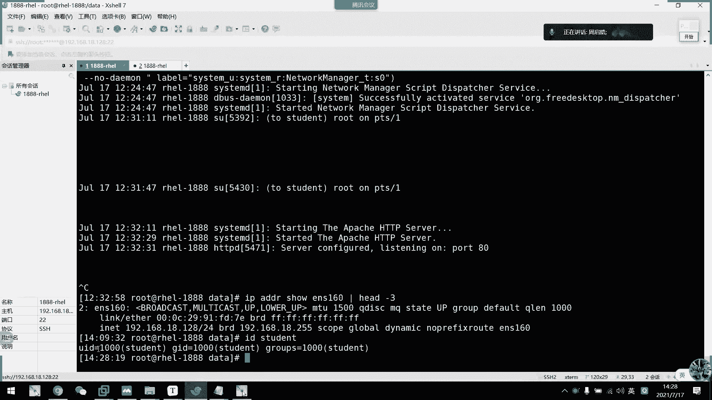

# 2021年7月新版-----RHCE8.2 RH124 RH134 RH294 认证课程 - P13：day3-5 管理用户和组1相关配置 - bili_15701050454 - BV1Gy4y1T7ug

好，我回顾一下啊。假如说呃。回顾少了一点内容啊，就是我们的一个。嗯，重电下。从第一下。啊，咱们重庆现有三种啊啊也不是说啊可以说是三种吧。啊，不是不是啊，重新下两种啊，应该是说重新向之前啊要了解一下啊。

🤧嗯。啊，咱们。系统中呃有两种。输出。呃，一种。输输入啊。分别叫做啊标准。输出。啊，一个是标准。错误输出。啊，还有一种是标准输入。啊，他有我们的。🤧咳。快设被收呃快速被控制啊啊。

不要输输入是我们的ting。啊，ting啊。和我们的。一啊有没有输错误输出的啊，是tay2啊。啊，是我们的二控制啊。啊，第三种是呃输入是呃不对。啊，这也是t out啊。好要输入是stating啊。

有我们的0。零控制啊，然后呢标准输出啊，什么叫标准输出呢？啊，我们通过啊命令。返回。正确的。结果。并打印。到。终端上啊。的标准输出啊，命令。返回错误结果。并打印到中端上来。🤧好，不要输入啊，就是说。

命令。等待输入指令。啊，从而。得出。结果。后标准输出。啊，要后是重定向啊重定向呃。我分为。呃，标准。输出。重定向。怎么叫重一下啊。呃，将。输出或者。输入的内容。重新。定位到文件中。到。充电下有两种啊。

又是啊。替代。啊，又是。追加。🤧咳。啊，然后是标准输索一下替代。啊，是用箭头表示啊箭头表示，比如是我们一口一个hello。啊。到我们的test中。那么。Ts。的内容。喂。Hello。

这是标准输入重新下啊标准。错误重定向。输叔什么意思？一口啊，不是LOS叉叉叉叉叉叉叉叉叉。啊，这种没有的。存到dess里面啊，然后test的内容。喂呃。什么。I叉叉叉叉叉。呃，然后是什么no such。

Fl or diory。啊，这个是错误了啊。啊像是。追加。追加啊。追加。就是两个箭头啊，这里又不重新演示了啊，然后是输入。重定向。啊，比如是说啊我们开一个文件啊，KBC点lockg。啊。

里面的内容有什么呢？啊，比如说一加1啊1加1。然后呢，我们通过标准输重定向啊，比如说BC。啊，然后是我们的BC lock。浪子得出的结果就是2啊。啊后是多行重定向。啊，它的意味着呢。其实他做了两步骤啊。

一个是。标有写法。EOF。然后是文件哎。我这里要转移下E呀。好，O。啊，L后是f。啊，也可以写成ca。Friile link。然后是UF8。注意的是啊啊EOF为。结束福报结束。好。

这也是我们的一个多少雄印象啊。啊。还有要注意的是什么呢啊？嗯。输出。从定向。啊。一。代表。替矿。代表。呃，追加啊。啊，也一样的啊。注意这两个符号啊注意这两个符。好像是管道啊。就是管大。所有管道啊呃。向。

像流水线一样。多个。工序处理。啊，就是说呃把上一个。上一个命令的标准。输出啊一定要注意啊，一说到这里啊，这里差了一个东西啊。拆的东西啊。标准。错误。啊以及。这里加个正确吧。啊，标准正确啊，错误。输出。

从定下。怎么做啊啊，用我们的呃。Come on。也不试试。怎么说呢啊，比如说一口hello吧。啊然后不有。L存在的目录啊。啊，还有不存在的目录，然后通过end这样子。从第向到文件当中啊。

把上一个命令的标准输出啊，作为。通过管道。作为下一个。命令的标准输入。啊，比如说啊我们的ifcom。错了。IP。B滴啊。啊，这里写完整一点啊，然后管道符为我们的竖线啊，这样子。下一个病例要做什么处理呢？

啊，比如说gradere。啊烟。S160。等会。这里没讲过啊。说了我们用早上讲过的内容啊，IPAADDR showENS160，然后是hat。杠3。

我看一下结果是什么。我看一下结果的什么。

看到没啊，就到IP这一行了啊。作为下一个命令的。输。O好。然后呢我来啊回顾一下上午的内容。好，上午呃咱们。主要讲述了啊两种模式。其实是三种模式啊啊三个模式还有加一些文件处理工具啊，文本处理工具啊啊。

首先是VIM的。呃，普通模式啊或者是叫做命令行模式。快捷。操作啊这边啊讲述一下它的一个常用啊啊，首先是退出。不保存退出啊。用大写的ECQ啊，保存退出。啊要大写的意色一些。删除制符。I X。加密。要打X。

光标跳动。旁边这度啊，这边就不多讲了啊，数字加。呃，方向。OK然后是呃剪切。啊，用D加呃各种com了。然后呢，复制。用Y。加各种comment。啊，然后是粘贴。有P或者是大P。有什么了啊。

普通模式还有什么要讲的呢？啊，没什么了也。那就这样吧。好，然后是VM。对。墨寒模式。啊，合模式有很多种啊啊，重点啊是我们的一个搜索替代啊，搜索替代啊格式。格式。是我们的一个呃。位置并界。然后是S。

刚尴尬啊，然后是修饰符。随讼费。啊，举例。主啲。比如是说呃从。第一行。到最后一行。A bar。比如说说我们的一个pass过的啊，一定要拷贝出来，这个文件啊一定要拷贝出来。从第一行到最后一行，然后啊把。

Wd。修改。喂。HO啊怎么做呢？啊，一。多了。你多了S。大主来啊。Ro。不就。ok。O。啊，这是我们的个搜索替代啊。如果不明白的话呢，回头看一下啊，回头看一下啊，或者是到我们学到set的时候呢。

这个还是要用到的set的时候还是要用到的啊。主要还是啊要了解一下我们墨合模式啊。莫寒模式的。啊，地址丁界啊。这也回头看。回头看。呃，莫罕模斯啊，还有定制。个人。5IM。特性。啊，比如说啊set。

这也写一是采用了setCOL啊。嗯。关标。所在行。显示下划线。I要是s。A you。显示行号。啊，赛的。A i。呃，自动缩进。啊 said。ET。好爸。Table。转换成。空格。默认一个table。

等于8个空格。然后 set。呃，TS等于几？啊。设定。一个table。Wei。醒个。Her。Yeah。好。还有什么呢？呃，常用的还有什么呢？我想想啊。然，后有个赛。List。显示。啊，所有字符啊。好。

 ok。嗯。好。如果啊。呵呵。😊，以上。呃，设置。可。需要永久保存。需要写入到。文件。啊，所以是全局。全局的话呢是我们的。ETC下的。一天下的VIMRC。要是个人。啊，是加目录。下的点VM2RC啊。

一定要注意啊。家务录像。当然啊老师希望你们是写个人的啊。不去写我们的一个啊全局。定制自己个人的就可以了。好。那么。不好模式啊，这里就差不多了啊差不多了。啊，还有一个读还有写而已啊。啊，自己可看一下。

那熟练使用就可以了。好，接下来是。啊， we。不会拼的。啊，可塑化。操作。啊，有我们的一个小V。大V。Control。加V啊。我们称之为啊。快操作。系啊种。那么还有什么呢？早上。啊，还有一个。呃。文本。

窗口分割。或多文件处理啊。啊，比如说VIM杠O。说了。谢谢小欧啊，是水平分割。大是垂直分割。好。比如VIM杠刀。然后是F1。发友谊吧。I fri。这样就给打开两个了，然后呢文件。中跳动。我中了。

我就肩挑动啊。啊，用我们的CT。control加W。然后加方向键。ok。整体操作啊。退出所有。QO。保存。退出所有。就是WQO。ok。还有什么文本。处理工具啊。啊，比如说我们的cap。查看文本内容。

打印到终端。啊，常用水下。我不全不写了啊，一个是杠A啊，显示所有字符。杠B。啊，钢原版。显示行号啊。呃。同时。同时。同时。输出行号。啊，杠B。呃，致。只给非空行。定义行号。啊，刚开始。8。Lianu。

的空行对。压缩成为一个。ok。啊，然后是我们的L啊L等于。啊等于 cat 跟 b 啊。这个就不说了啊，然后是反过来写的TAC啊。啊，倒叙输出。理u。然后是REV啊。呃，将。含泪的内容到。输出。好。

就这些啊，然后是mo。分页显示。Morera。呃， less。啊，老师建议使用less。啊，末耳了啊会显示。百分比。看完。自动退出。提前退出。输入。Q。啊，那s啊。啊，不显示。百分比。啊，不会自动退出。

可。使用。搜索。好。就呃。文件。So。我不对。嗯。算了，我不要道怎么解释这个哈啊。Head。还有跳。啊，headd。默认显示文本。前十行。啊，常用选项。小小行有的什么了啊。有杠C啊。指定输出文本。

钱ian。说这价个。嗯吧。N个字符。好。啊，然后是杠M。指定输出前number行。啊，杠。Number。ok。然后是跳。默认显示文本。后。十行。茶水下。同讯。僵尸啊。😊，乐ber。指定输出文本。

Home number。各支付。好要是赣N。Number。指定输出文本。H。都不好。还要干。Number。头上。然后呢，重点啊杠F。可以监听文件。啊。通常。喂。Jianing。日志。啊，O啊。

找出来内容啊，主要是这些啊。但是肯定不止这些一些关于工作上的一些快捷VIM的一些快捷处理啊，厂商都说了啊，大家可以回头去看一下啊。虽然我截了这么多，我记了多少就写多少出来，是不是啊。

我自己常用的不置钉阶那些，我肯定不会再花时间啊。复习的啊，不然讲一节课都不行。对不对啊，讲示5分钟都不够啊。那么我们来看一下下午的内容啊啊，下午内容那么。我们其实对于系统的一些基础啊。

操作已经差不多了啊。后面的话呢我们就学深入一点的东西啊啊，我们前面说了linux框架啊。电子框架是由呃用户。来定的啊，一种是root用户，一个是普通户，对不对？我那天也讲过了。

普通用户其实我们分为两类啊。啊两类一类是系统用户，一类是可登录用户啊，早上有个同学问我啊。Blash。跟老 lock。有什么区别啊，你们看一下。按照单词来看一下他们是什么意思。按照当词来看。

他们是什么密思。Yeah。啊，我们按照当时来看fsh是不是我们的销类型啊？就说。这个用户登录以后呢，它的类型是为我们的小啊。可以如我们需要提供它的一个命令啊。处理进程，然后搂到底呢是什么意思？拆开。

locking是什么意思？登录对不对？登录，要不加个low了。就是无法登录。就不登录的意思啊，无法登录。而，我们这种呢。用户类型划分两类，一类是管理员用户，一类是普通户。然后呢。

我们的用户呢是由UID来标识的啊，所以名字不重要啊名字不重要，重要的是它的UID啊。就是我们的身份证啊，可能你改了名字。系啦。大家改名字啊，比如是张三。他。有个身份证号啊，是比如是说123456啊。

这是在公安局上面有登记的编号，对不对？周生。那么他去公安局申请改名字的，叫做张四的。他身份证号会改吗？不会改了嘛，对不对？所以呢。就像我们身份证一样，我们身份号才是我们身份的唯一标识啊。啊。

然后管理员用户啊为0。其实它可以不是ro啊，只要它是零，他就是管理员啊，他可以不是ro啊，只要是它是零，它就是root。第二种啊叫普通用户啊，是1到6万啊，1到6万。呃。然后呢。不用库我们分为两类啊。

一个系统用户，一个是登录用户啊，系统用户呢啊从六以前啊可以说是7以前吧，不包括7嘛，对不对啊，是1到499。然后期以后呢是1到999，然后补充用户呢啊补充用户以前是500。现在是1000以后啊。啊。

就vi7以后是1000。所以呢我们创建了第一个任务啊，记不记得是哪一个啊是 student。啊，这是我们装系统的时候，顺便创建了一个啊，顺手创建的它是附带的啊，一个普通用户，对不对？业5的用户。

他的ID我们看一下是不是1000。

啊，我们可以通过ID这个去查看啊这CODENT看到没有？就是1000。

UID1000。所以啊是从一00开始，然后系统用户呢是1到999啊，1到999。啊，这就是我们的啊用户啊用户。然后是有用过跟都能用过的区别了啊，我们现在先不讲。啊，我们知道就可以了。

知道这回是这个保留着信用库。好，接下来我们来看一下啊用户组啊用户组。然后呢。呃，用户我没有用户。那么如果用户数量多了，我们是不是要通过主。来给他们啊做管理啊。啊，所以就有了用户组这个概念了啊。

所以是啊linux中可以将一个或者多个用户加入到用户组。然后呢，用户组是通过GID来唯一标识的啊，由管理员组啊，管理员组啊啊视为0。然后普通组也是分为系统组跟普通普通组啊啊也是一样，1到999。

还有1000家。啊，是给。用户用的，然后系统组啊是给我们所库进程或的资源进行全身分配的啊。我们可以看一下刚刚还是刚刚的student。

他GID啊，这就是他GID啊。g这个东西呢我们稍后再讲，这个叫做附加组啊，我们了解一下就可以了。啊，目前了解一下就可以了。我们先管前面的啊，一个是他的一个用户ID还有它的一个主ID啊，它属于哪个组？好。

接着往下。

啊，然后用户和主的关系啊，首先用户的主主要组，我们叫主组啊。啊，叫组组。所以呢用户必须属于一个，且只有一个主组啊，它只有一个主组啊，然后是默认创建用户的时候呢，会自动创建和用户名同名的组。所以我们st。

当时我们只是创建了个用户。啊，没有创建个组啊，为什么出现了一个死裂组啊？就是这个原因啊，我创建一个用户啊，我创建个用户，他就会如果我没有指定他是哪一个组为他的主组呢，他就会默认建一个组啊。

默认建一个组为他的主组啊，而且以他的啊啊用户名为名字建的一个组名啊。

O。好。然后呢，一个用户啊可以属于零个或者是多个。辅助组啊，我们叫做附属主啊，或者是叫附加组啊附加组。啊即系啊 i啲 student 啊 i d bicycle 相信。

通过ID命令可以看到它的一个信息啊啊，就是主信息。然后呢。其实它这个有相关于一个linux安全上下文啊，就conttains啊，就是我们后面说的SClinux啊。他在目前还没选。

然后运行系用的进啊程序啊，就是我们那个进程啊。啊，以进程的发行者的身份运行，进程能够访问资源的权限取决于进程的一个运行者的身份啊，这个的话先了解一下这句话就可以了。到时候我们学到进程啊，应该是在下周。

我们学到进程。啊，就知道这句话到底是什么意思。啊，他意思就是说我们执行一个命令。啊，我们就算是word啊，这是一个命令呢。但是。呃，它会运行一个程序嘛，但是那个程序不一定是啊为root的所有啊。

root所有不一定的啊。所以有了系统用户这个划分啊。啊，这里有啊一部通用户啊，普通用户啊，身份运行啊KR或者是啊KKK这个文件啊得到的一个结果是不同的。然后呢，资源能否被访问呢，是由运营者的身份决定的。

并非我们程序分散。

啊，这个我们来看一下吧。

EDC学的。啊，这里可以看到，然后我们切换到stud看一下。咳。Kt。呃，一地下的血斗。看到没有啊，权限被拒绝权限被拒绝。

O。那么好往下看一下啊，我们首先。了解了有用户，还有主的一个概念。那么在linux当中。我们的一个理念叫什么呢？我问李论是什么了？一切皆不见，对不对？一切接文件。那么其实。呃，好像数据库一样。

我们啊新建一个用户，它是不是有一个记录啊，在数据库当中有一个记录啊，就是说呃有用户名啊、密码，然后还有其他什么信息之类的啊。或者是可登录的一个hos之类的啊，这是数据库里面。

那么数据库里面的一个记录也是文件数据，对不对？那么啊我们linux。啊，也是类似的一个操作啊，类似一个操作。它是把我们的用户，还有他的信息存放在我们的ETC passwordsword里面啊。

虽然看这里password是不是感觉是密码啊，但是它存放的并不是密码，存放的密码是我们ETCsha啊啊，首先我们来了解这两个文件啊，是我们用户的。账号配置信息的一个配置文件啊，就这两个文件。

我们先看EDC发啊，这个文件我们不陌生啊，对不对？我们不陌生。因为早上啊老师打开过很多遍。

是不是？啊，可以看。好，再打开。🎼啊，就可以看到其实它存放在我们这里EDC下了4种语法的啊啊，它是一个特定的一个命令啊啊，它特特特定一个文件啊，只要我们自己打开啊，首先我们可以注意到啊。其他不用管啊。

先管冒号冒号冒号冒号冒号冒号什么意思啊，就说这个文件。它每一行记录啊都是啊每行记录都是每一个用户的信息，然后每种信息啊分为一个字段，用冒号分割啊，用冒号分割。

那么接下来我们先看一下这个文件各个字段代表了一个什么含义啊。

首先我们看一下啊password文件格式。首先啊这里老师截取了一个student的出来了啊，这里出来了。首先是我们的一个登录名啊，叫做loging第一个字段啊，第一个字段login。登录户名啊。

就好像我们登录什么网站一样啊，不是先有一个用户名吗？就指这个啊，包括我们登录终端啊，登录终端。

他不是要我们先locky嘛，对不对？然后我们输入用户名嘛，这个root也是用户名，对不对？然后是输入密码嘛。他只是分开存放而已啊，其实也没有说分开存放啊。第一个知道是他的密码信息啊，密码信息。

其实就是它的密码，只是加密而已啊啊，其实就是他的密码，只是加密而已。好，然后。啊，其实也不是。它这个是指向摔斗的啊，这个是指向摔抖的。然后第三个字段是我们的UID。第四个字段是GID。

第五个知道是我们的一个负类啊负类。啊，我们装系统的时候不是有一个复类吗？啊，老师说填不填都可以啊，实际是只是对这个用户的一个描述而已啊啊。第几个字段五个了啊，第六个字段是它的一个加目录路径啊。

加目录路径。好，最后一个字段啊，beb是它的一个笑类型啊。默认啊用户默认的效类型啊，你看我这里是定义了bebesh，对不对？啊， ok。呃，等我一下，我把图片都弄回来去。都没有图片了。对一下。

重做的系统就是麻烦。还会有备份。放在哪里了去。他不是显示所有了吗？查看。要是哪个？T， Y， P I。嗯。Useer image。在这里。然后。it。怎么没有。X Peng。Imaging。

还没有这个目录嘞。复制过来。啊，可以了，都出来了啊。O。😊，好，刚刚是我们那个pass的一个文件格式啊。那么接下来我们看一下密码噱抖的一个文件格式啊，这个比较复杂。看起来复杂。

其实我们不需要通过配置文件定义的啊，都是通过命令上定义的。但是我们要了解它一个呃信息。首先呢我们需了文件格式，我们看一下啊。

啊，VIMEPC下的噱斗。对呀，这就是它的一个啊经过易扩的密码，它是它密码怎么来的，这个底层原理我就不跟你们说了啊，所啊就简单解一下吧，它是通过b64啊。然后再加了一个密码头啊，然后把它变成一个随机。

密码。就说你可以通过base64把它给解密了，但是啊它有个密码头。大概是这么多啊，到这里啊，密码头。啊，所以你是解不了了，就算你得到了这一串，你都解不了你啊，你不知道我用的是哪个头，对不对？

那这个底薪原理我就不跟你们说了啊。就了解一下就行了。好，行，那么。

呃，虚弱格式我们刚刚看到了，你看也是跟我们E pass一样。我拿一个没有定义密码的东西啊，就比如这个你看它其实啊也是以漫号分割各个字段。那么我们现在看一下。他这个字段有什么意义啊？有很多都没定义啊。

因为我这里呃新装的就没什么意义，我就没有定义过啊，没有定义过。包括斯的也有这个。呃student的那个。也不一样的，其实他们密码是一样，但是他们得到的值是不一样的，对不对？

是不是啊得的知识不一样，但是它们密码是一样的。所以啊给你这些串你都不会加密啊，它是用呃SHA呃512加密的啊。好，首先是第一个字段啊，我们是一共几个字段啊，几个字段。啊，第一个制作是我们的登录用品啊。

其实也是一个相当于是用用户的跟跟paword的文件一个映射而已啊。好，第二知道是我们的用户密码啊，用户密码。第三个字段啊是从。1970年1月1日呃，1月1日起密码，最近一次被更改的时间啊。啊。

就是最近更改时间的时间啊，但是我们要呃减减下来以后呢啊得到了值。有点麻烦，其实我们不用手动记的，不用手动刷。好，接下来是密码。下一个就到了这里啊。私密码再过几天才可以被更改啊啊，零是随时可以啊。

就就比如说随时可以被更改啊，随时可以被更改。然后密码过几天必须被更改啊，就是说如果是999就永不过期，其实这个密码过期啊，密码过期的意思。然后呢，密码过去几天后，系统会提醒用户啊，好不。啊。

还有多多多少天密码会过期，然后系统开始提止用过啊，一般啊默认为一周就这个期啊，就提前一个信息告诉你，你的密码快要过期了啊，请更快呃，请请尽快更换密码。好，然后密码过期几天后，账号会被锁定。啊。

就锁死了也登录不了了，只能找管理员把它给。老哥，然后。多少天后账号会失效啊啊，当然失效也是对用户而而言啊，也是对用户而言啊，管理员还是可以把它激活起来啊。你你把它当成是锁定的就好了。

然后第九个字段是保留字段啊，保留字段啊，你不能说这里没有字段啊，它是有字段的啊，也不能说它没意义啊，它的意义在于还没开发，它的意义还在于没开发，那要等待开发。那我们先看一下这个图啊。好，刚刚说了这些。

什么时间啊啊。可能有点虚，我们看一下这个图。啊，首先。这个时间点。这是我们最后一次改密码的时间。这个时间，然后。是1970年。1月。一日。到这里的时间啊，多少天啊，多少天一共多少天。然后呢。呃。

miny days是。不能。改密码的时间。不能更改。嗯。runund days，我想想。他是声。啊，对，这个是呃就是这一个提示时间。提示时间。

那么我们正常情况下可以使用密码的时间是是不是啊最大天数为啊更改密码的时间啊，然后到呃提示时间的末尾啊，这常时间是我们啊使用密码的时间，对不对？啊，这个密码有效期是呃的时间。啊，但是呢。它还有一个宽限期。

虽然我密码过期了，是登录不了，无法登录的，但是它有一个宽限期，这个就是宽限期啊，宽限期。啊，只要过了关系，这个就叫做过期了啊啊不是过期啊，是锁定。这个点就锁定。呃，我们这个过期时间其实是自己定的啊。

比如说我要定在这里定在这里过期的啊，过期，那么后面那些都没意义了啊，都没意义了，他过去就过期啊。啊，失效啊应该说是失效啊，账会失效。我定着这个时间点失效。那么我不管你啊，到底密码要过期没有。

反正失效了啊，你就不能再登录了啊，不能再登录了。啊，就这个啊就是这个时间表。其实啊我们密码最大有效时间啊是这么长啊，密码最大有效时间。啊，明白吗？同学们。明白吗？嘿。😊，啊，先了解一下个图就啊就可以了。

没没什么关系。我们等一下讲到创建用户的时候啊，就可以更加的去了解它的一个。异议啊。好，然后呢我们默认是512加密啊，呃呃哈西512加密啊，然后可以改改成是我们的1个呃256啊，但是没必要啊，没必要改啊。

不用管了，这里就提示一下而已。然后呢啊密码的安全策略啊，首先是密码安全率啊，所以是要足够强呢啊足够强。然后呢是需要使用数字大写写字母啊，可还有特殊字符的三种啊，讲到这里，我想问大家。

有没有玩过windows的AD预控啊？啊，同学们。其实他那个密码效率跟那个是一样的。有没有玩过啊AD预控。啊听过未啊过啊。啊，它的密码序列是一样的啊。如果玩过那个，其实这个很好理解。啊。

就算我没有配置过呃，你有你有预账号的话，它是不是快要过期的时候了，会啊或者是应该是定义在14天前，然后一直在这里。哎呦呀弹窗弹个气泡，说你的密码还要多少钱过期啊，请尽快更改密码，对不对？

然后它的密码策略也是这样子，要求一定有三种变化一定有三种变化。啊，然后呢。策略的话呢啊。就尽量使用随机密码，然后要定期更换啊，不要使用最近曾经使用过的密码，就一直轮框了啊，五六个一直轮框这样子。然后呢。

我这里提供了一下生成随机密码的方式啊。O谢谢啊啊，这就是我们的一个呃。

通过贝64截贝利是不是加密，它是转换啊，贝60，然后是9位啊，我说要截取9位。就这几位啊，这个ra啊是一个随机啊。学习。呃，出现一个随机数。然后呢。我这里不定义9。还不会输出，说了，还要写个9的。哦。

我知道了啊，但range不是要range才是rawinow。Red。不代表范围吧，应该是9个啊9个范围。然后呢就呃。让他输出通过999个数字，然后就通过我们的b6是直接加密啊。啊，这个是。啊。

随机随机啊，直接用这个做密码就没问题了啊。到是这里好像啊一一样会出现加加加号等号那些。啊，因为他那个原理忘记怎么怎么样了，反正是他。呃，是这样子的，一。二进制样子，然后1234。然后如果这里是12的话。

那它不够的话，要补要补要补齐，要用用你补齐啊，要用你补齐补齐的话，它会出现等号的啊，等号或者加号那。我也忘记怎么说。可能是这个意思啊。啊，正常是没有符号的，正常是没有符号，1六进制来的。

其实它是十六进制来的。ok。开发的话就比较懂这个开发啊倍是64，那是。

啊，OK这是我们的密码策略啊，没确定。然后呢还提供一个网站啊，提供一个网站。啊，这里也可以自己选啊什么。什么酒位啊。还加特殊支付设置密码。这不出来了吗？啊，曾经。呃。

以前管御控的时候跟跟同事开玩笑比较熟啊，开玩笑，然后我就用excel啊，或者是直接在这里生成了1个32位的随就数给他一个做了一个预账号的密码，一发给他，把他给吓死。他说什么鬼？给大家开玩笑。

然后我马上给他改了就好了。好，那我们先休息一会儿啊，这就是我们啊用户的两个备注文件啊，用户的呃密码信息的一个两个备置文件。先了解一下，我们到时候啊改属性的时候，再再过来重新看一下这个文件啊。

就可以明白了啊。然后接下来我们休息回来就看一下组的啊，上关组的。我，先休息。啊，3点钟3个啊。

