# Linux用户与组管理：P13：管理用户和组配置

在本节课中，我们将要学习Linux系统中用户和组管理的基础知识，包括用户和组的概念、相关的配置文件格式以及密码安全策略。通过本节课的学习，你将能够理解系统如何识别和管理用户身份。

## 回顾：标准输入/输出与重定向

上一节我们介绍了文本编辑工具，本节中我们来看看系统输入/输出和重定向的基础概念。

系统中存在三种标准输入/输出流。
*   标准输出：命令返回正确的结果并打印到终端上。
*   标准错误输出：命令返回错误的结果并打印到终端上。
*   标准输入：命令等待输入指令，从而得出结果。

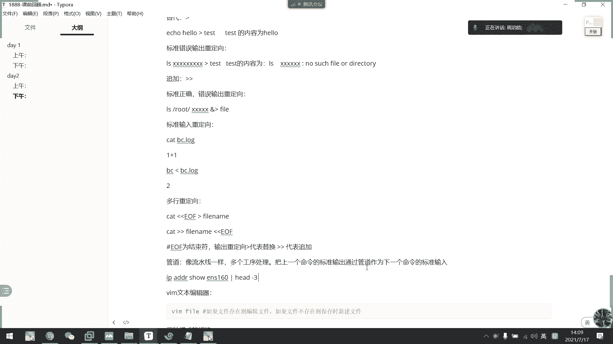

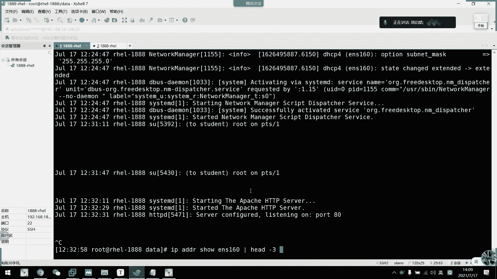

它们的文件描述符分别是：
*   标准输入：`0`
*   标准输出：`1`
*   标准错误输出：`2`

重定向意味着将输出或者输入的内容重新定位到文件中。重定向有两种主要操作：替代和追加。

以下是标准输出重定向的示例：
*   替代：`echo hello > test.txt`，文件内容变为 `hello`。
*   追加：`echo world >> test.txt`，文件内容变为 `hello` 和 `world`。

标准错误重定向示例：`ls /nonexistent 2> error.txt`，错误信息会被保存到 `error.txt` 文件中。

输入重定向示例：创建一个 `bc.log` 文件，内容为 `1+1`，然后执行 `bc < bc.log`，得出的结果是 `2`。

多行重定向的写法如下：
```
cat > file.txt << EOF
第一行内容
第二行内容
EOF
```
其中 `EOF` 为结束符号。

管道符 `|` 像流水线一样，用于多个工序处理。它将上一个命令的标准输出，作为下一个命令的标准输入。例如：`ip addr show ens160 | grep -E “inet “` 可以过滤出IP地址所在的行。

## 回顾：VIM编辑器与文本工具

上一节我们介绍了重定向，本节中我们回顾上午学习的VIM编辑器和文本处理工具。

首先是VIM的普通模式（命令行模式），用于快捷操作。
以下是常用操作列表：
*   退出不保存：`:q!`
*   保存退出：`:wq`
*   删除字符：`x`
*   光标跳动：方向键或 `h`, `j`, `k`, `l`
*   剪切：`d` 配合各种移动命令（如 `dd` 剪切整行）
*   复制：`y` 配合各种移动命令（如 `yy` 复制整行）
*   粘贴：`p`（在光标后粘贴）或 `P`（在光标前粘贴）

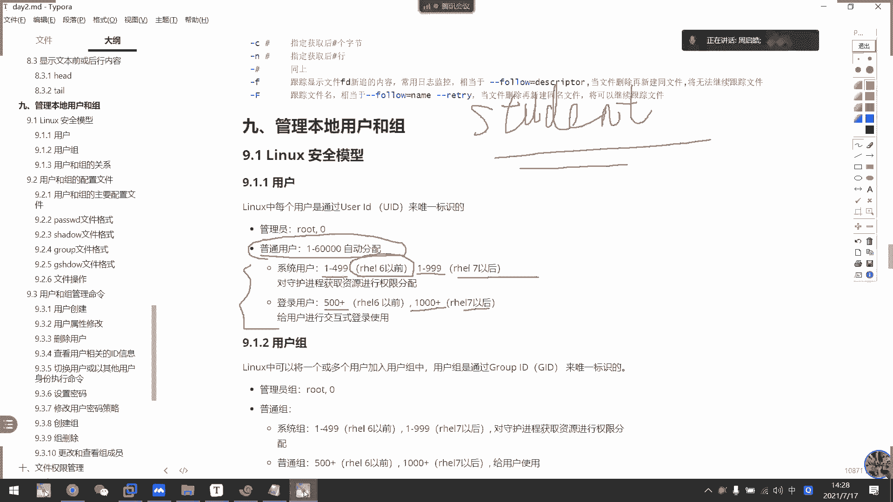

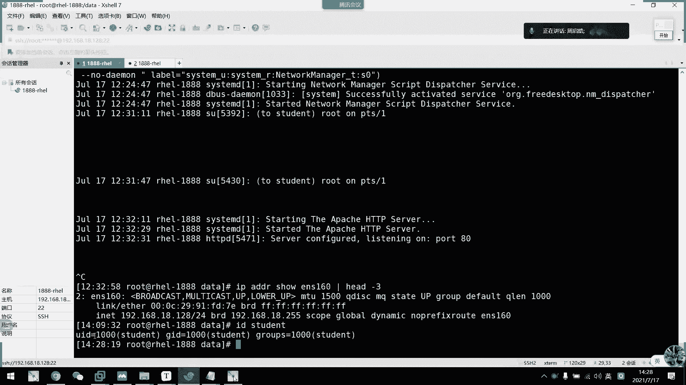

接下来是VIM的命令模式，用于搜索、替代等操作。
搜索替代的格式为：`:[地址边界]s/搜索模式/替换内容/[修饰符]`。
举例：将第1行到最后一行中所有的 `root` 替换为 `admin`，命令为：`:1,$ s/root/admin/g`。

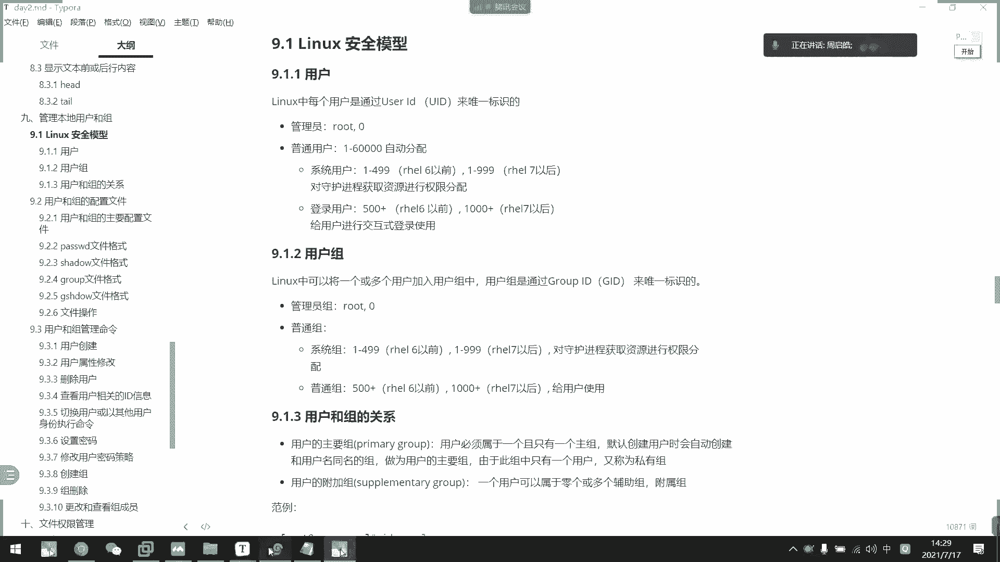

VIM命令模式中，地址边界用于指定操作范围。我们可以定制个人VIM特性，通过 `:set` 命令实现。
以下是常用设置列表：
*   `:set cursorline`：为光标所在行显示下划线。
*   `:set number`：显示行号。
*   `:set autoindent`：启用自动缩进。
*   `:set expandtab`：将Tab键转换成空格，默认一个Tab等于8个空格。
*   `:set tabstop=4`：设定一个Tab键等于4个空格。
*   `:set list`：显示所有字符（如制表符、行尾符）。

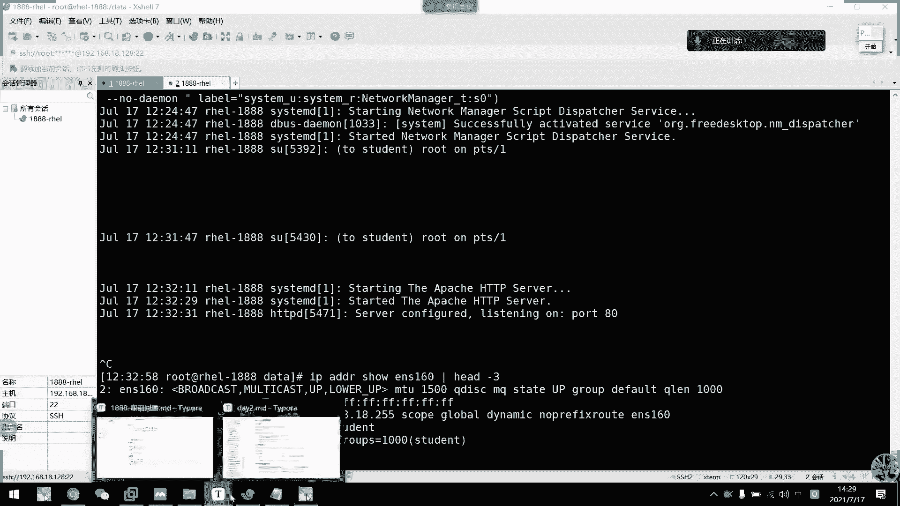

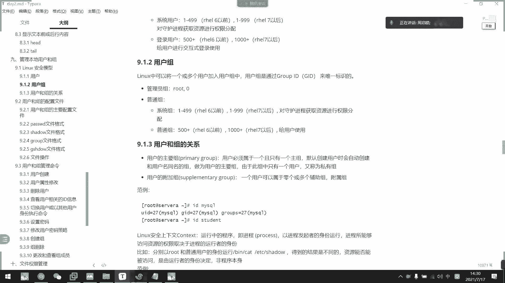

若希望以上设置永久保存，需要写入配置文件。
*   全局配置文件：`/etc/vimrc`
*   个人配置文件：`~/.vimrc`

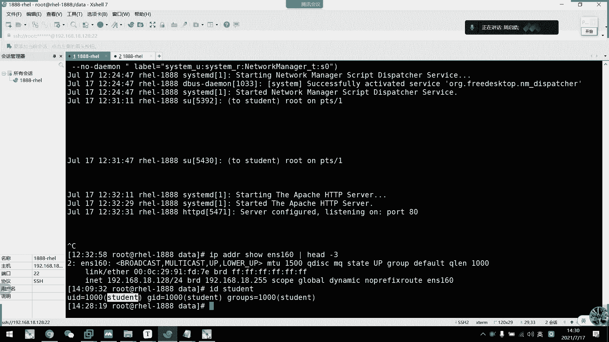

建议将配置写入个人文件。VIM还支持可视化操作和窗口分割。
*   可视化操作：`v`（字符可视）、`V`（行可视）、`Ctrl+v`（块可视）。
*   多文件处理：
    *   水平分割：`vim -o file1 file2`
    *   垂直分割：`vim -O file1 file2`
*   在窗口间跳转：`Ctrl+w` 加方向键。
*   退出所有窗口：`:qall`
*   保存并退出所有窗口：`:wqall`

最后，我们回顾几个常用的文本处理工具。
*   `cat`：查看文本内容，打印到终端。
    *   `-A`：显示所有字符。
    *   `-n`：显示行号（所有行）。
    *   `-b`：显示行号（仅非空行）。
    *   `-s`：将多个空行压缩成为一个。
*   `tac`：倒序输出文件内容。
*   `rev`：将每行内容反向输出。
*   `more` / `less`：分页显示文本。建议使用 `less`，它支持搜索且不会自动退出。
*   `head`：默认显示文本前十行。
    *   `-c n`：指定输出前n个字符。
    *   `-n n`：指定输出前n行。
*   `tail`：默认显示文本后十行。
    *   `-c n`：指定输出后n个字符。
    *   `-n n`：指定输出后n行。
    *   `-f`：可以监听文件变化，常用于跟踪日志。

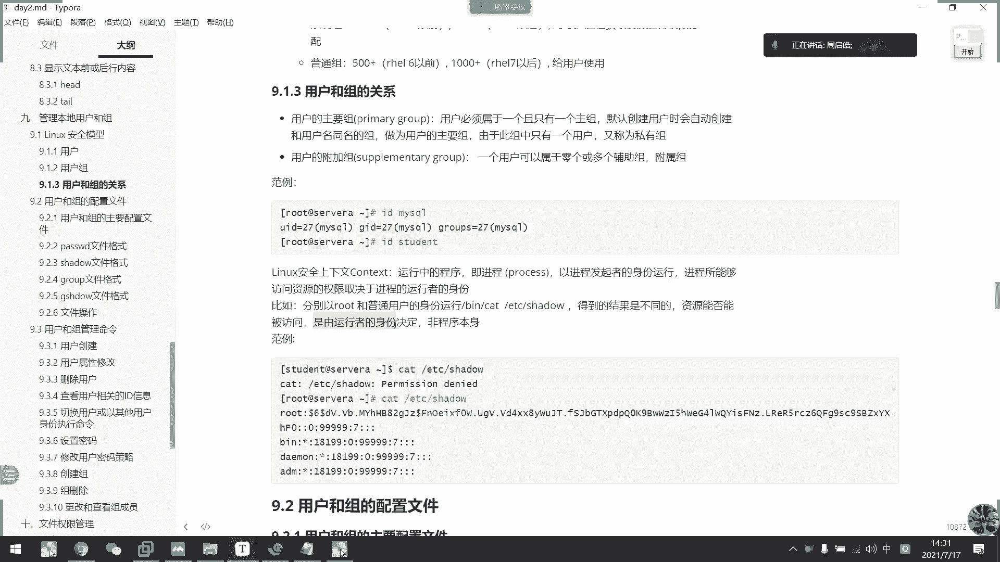

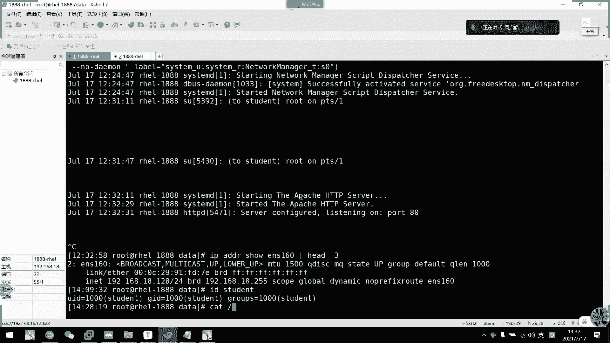

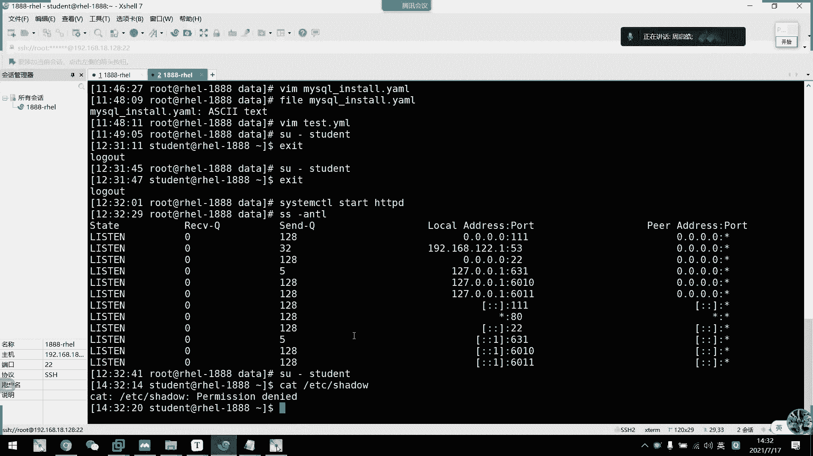

## 用户与组的基本概念

上一节我们回顾了系统操作基础，本节中我们深入探讨Linux用户与组的管理框架。

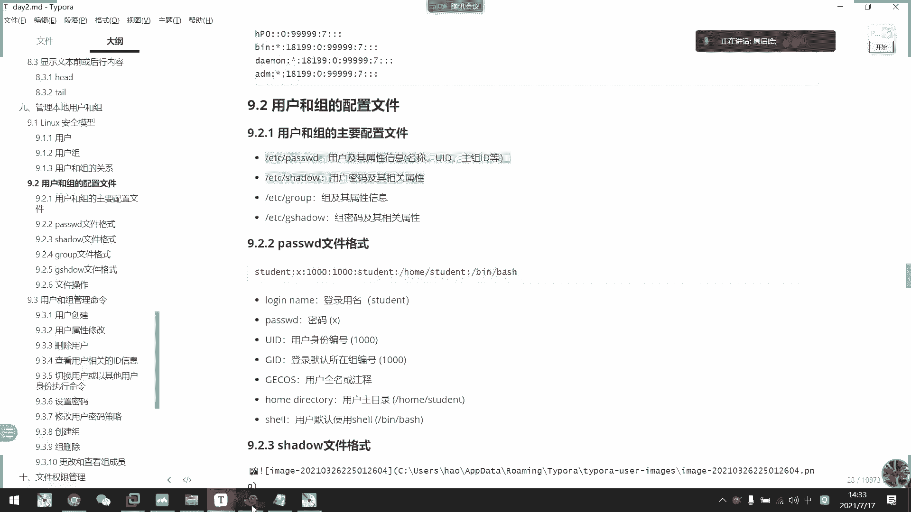

Linux用户主要分为两类：管理员用户（root）和普通用户。
普通用户又可细分为两类：系统用户（用于运行系统服务）和可登录用户。
*   系统用户的shell通常为 `/sbin/nologin`，表示无法登录。
*   可登录用户的shell为 `/bin/bash` 等。


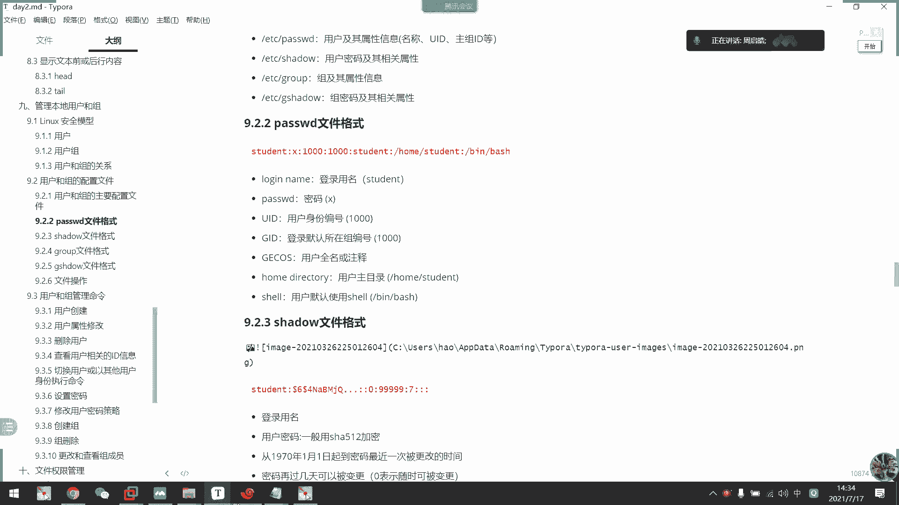

用户由UID唯一标识，类似于身份证号。
*   管理员用户UID为 `0`。
*   普通用户UID范围为 `1-60000`。
    *   系统用户：在RHEL7以后，UID范围为 `1-999`。
    *   可登录用户：在RHEL7以后，UID从 `1000` 开始。

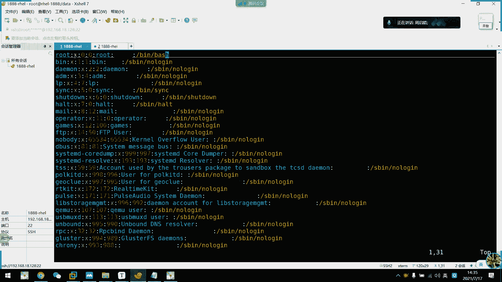

使用 `id` 命令可以查看用户信息，例如 `id student` 会显示其UID和所属组。

用户组用于简化对多个用户的管理。用户组由GID唯一标识。
*   管理员组GID为 `0`。
*   普通组GID范围与用户类似，也分为系统组（`1-999`）和普通组（`1000`以后）。

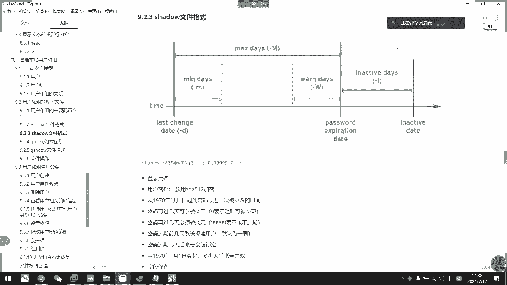

用户和组的关系如下：
*   主要组：用户必须属于且仅属于一个主要组。创建用户时，默认会创建一个与用户名同名的组作为其主要组。
*   附加组：一个用户可以属于零个或多个附加组。

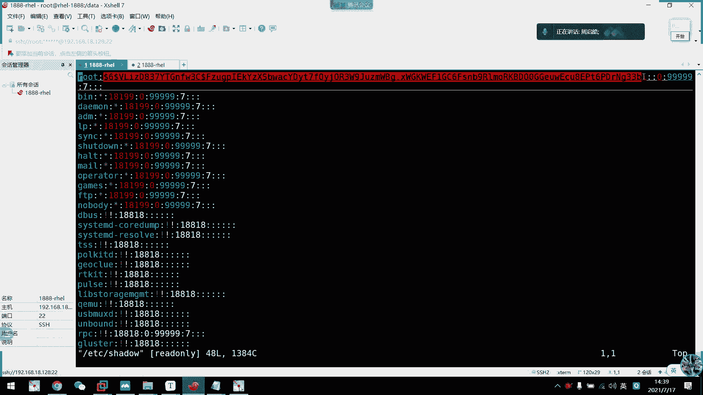

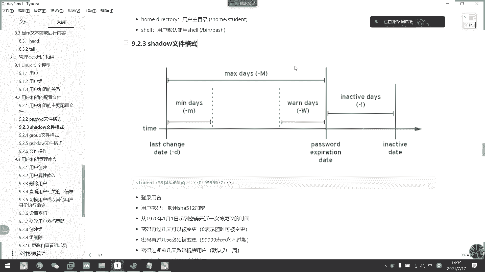

Linux的安全上下文规定：运行用户的进程，其能够访问资源的权限取决于进程运行者的身份，而非程序文件本身的所有者。例如，普通用户 `student` 尝试查看 `/etc/shadow` 文件时，会因权限不足被拒绝。

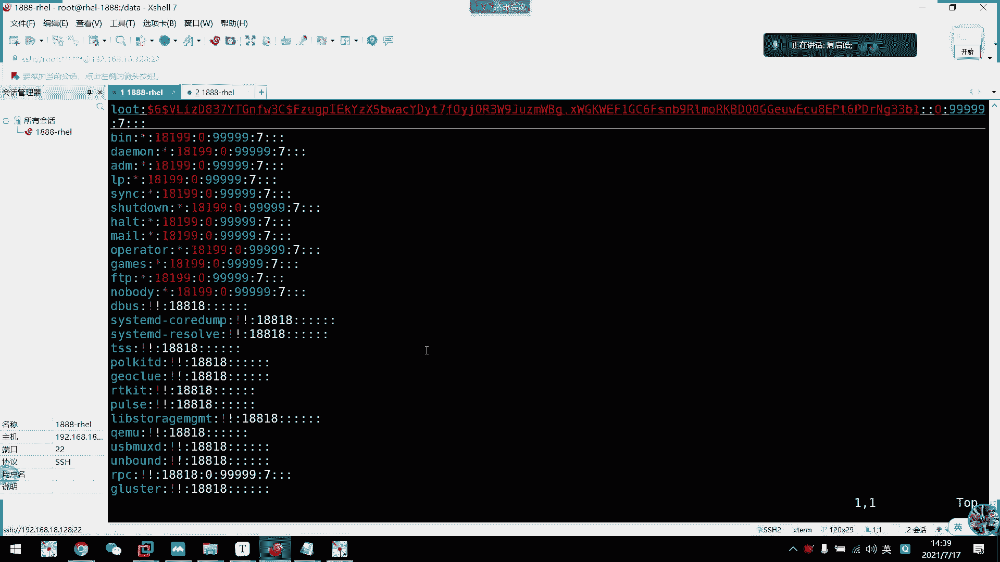

## 用户配置文件解析

上一节我们了解了用户与组的概念，本节中我们来看看存储这些信息的配置文件。

Linux中“一切皆文件”，用户账户信息也存储在特定配置文件中。主要涉及两个文件：`/etc/passwd` 和 `/etc/shadow`。

`/etc/passwd` 文件存储用户的基本信息。每一行代表一个用户，各字段用冒号 `:` 分割。
以下是各字段的含义：
1.  **登录名**：用户登录时使用的用户名。
2.  **密码占位符**：历史上这里存放加密密码，现在通常为 `x`，表示密码实际存放在 `/etc/shadow` 中。
3.  **UID**：用户ID。
4.  **GID**：主要组ID。
5.  **描述信息**：用户的注释或全名。
6.  **家目录**：用户登录后的初始工作目录。
7.  **登录Shell**：用户登录后启动的Shell程序路径。

`/etc/shadow` 文件存储用户的密码和账户有效期等信息，权限更为严格。其格式同样使用冒号 `:` 分割字段。
以下是各字段的含义：
1.  **登录名**。
2.  **加密密码**：使用SHA-512等算法加密的密码。如果为 `!!` 或 `*`，表示账户被锁定。
3.  **最近更改密码的日期**：从1970年1月1日到上次修改密码的天数。
4.  **密码不可更改的天数**：密码修改后，多少天内不能再次修改。`0` 表示随时可改。
5.  **密码必须更改的天数**：密码多少天后必须更改。`99999` 通常表示永不过期。
6.  **密码过期前警告天数**：密码到期前多少天开始警告用户。
7.  **密码过期后宽限天数**：密码过期后，账户还可以宽限使用的天数。
8.  **账户失效日期**：从1970年1月1日起，账户失效的天数。
9.  **保留字段**。

密码的安全策略至关重要，建议：
*   使用足够强度的密码，混合大小写字母、数字和特殊字符。
*   定期更换密码。
*   避免使用近期用过的密码。

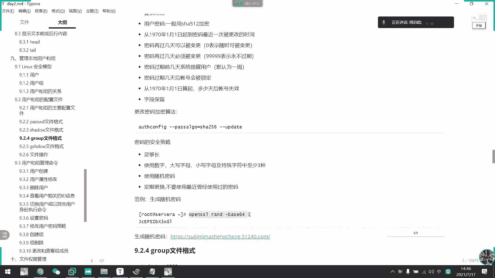

可以使用以下命令生成随机密码：
```bash
echo “$RANDOM” | md5sum | head -c 12
```
或者使用在线随机密码生成工具。

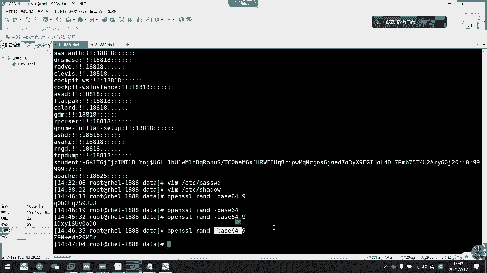

## 总结

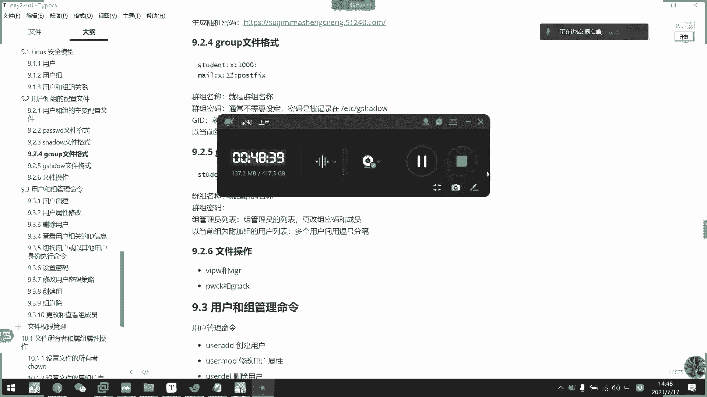

本节课中我们一起学习了Linux用户与组管理的核心知识。我们回顾了标准输入/输出和重定向操作，复习了VIM编辑器及常用文本工具。接着，我们深入探讨了用户与组的基本概念、分类及关系。最后，我们详细解析了存储用户信息的两个关键配置文件 `/etc/passwd` 和 `/etc/shadow` 的格式与含义，并了解了密码安全策略。掌握这些内容是进行系统用户管理的基础。