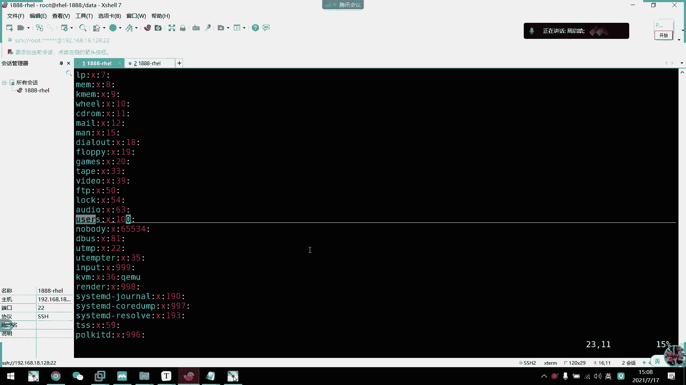
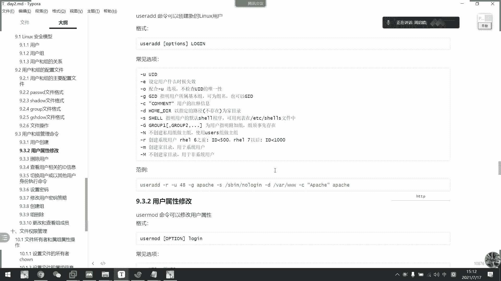
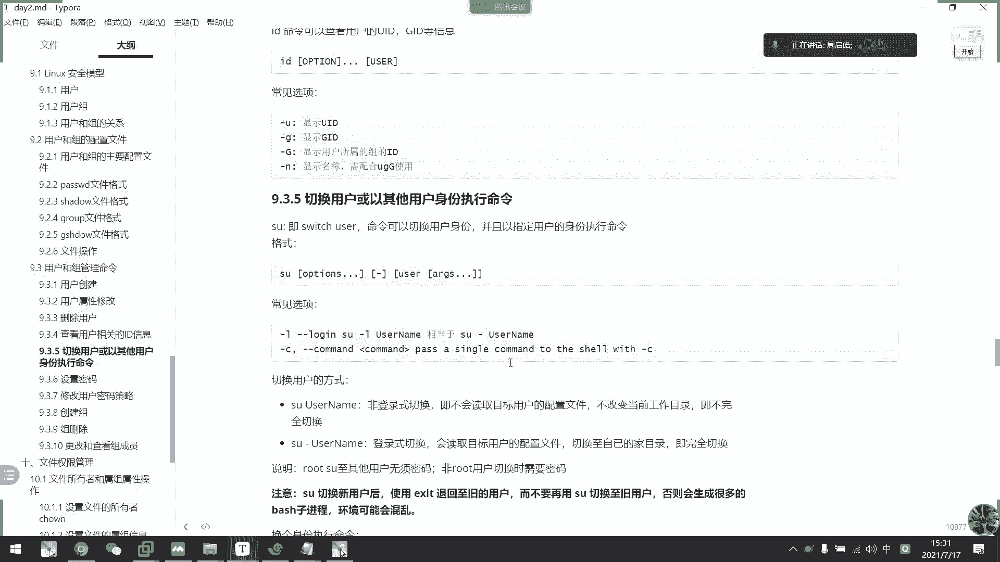

# 2021年7月新版-----RHCE8.2 RH124 RH134 RH294 认证课程 - P14：day3-6 管理用户和组2命令行配置 - bili_15701050454 - BV1Gy4y1T7ug

好，刚才上一节课呢我们来了解了关于用户的一个配置文件。接下来我们来看一下关于啊组的一个配置文件。其实组的配置文件呢我们很少修改，也很少会设置啊，有看很少设置这个。主的密码我们了解一下就可以了啊。然后呢。

组的配置文件有两个啊，一个是我们的。

呃。EDC。狙一血斗。啊，一个是我们的。Group。两个文件啊也是一样的。首先我们来看一下VMEDC group。啊，你看这就是我们那个主信息。是一样的，它自动比较少，四个字段四个字动。第一个字动。

我看看。嗯，这个是group人家。第一个字段啊是我们的一个用户名。第二知段呢是主密码信息。第三个字段是主ID啊，第四个字段我想想啊。啊，是是以这个组为附加组的一个用户列表。你这个组为附加组的入库列表。

啊，我刚刚想说这个是傅家族的。啊，不对啊啊，是附加组的用户列表。啊，这就是我们的啊group的一个文件啊，然后是我们的一个局宣的文件格式啊啊也是四个字段啊，也是四个字段。第一个是我们主名啊，主名。

第二个是主密码啊，第三个是主管理员列表。它是可以更改主密码和省员的啊。然后第四个字段是以当前组为附加组的用户列表啊，也是一样的啊，跟这个是一样的。我们看一下，比如说我现在。

呃。更改一下。有什么的，然后是。更橘。啊啊，不行，这个不行。呃。哎后我们现在ID丢了。看到没？好，我们这里负位组就变成了一个两个组了。然后我们看一下啊呃VM。EV下的group。啊。

你看这里是不是多了个tudent了啊，多了个t，然后我们再看shaow啊。啊，继蟹懂着。这不就多了吗，对不对？啊，这也是我们的一个主啊，所以呢。

这两个文件其实我们采用的还是军训啊据啊还有呃这个group啊啊，一般用于什么呢？用来查组有没有建起来的，就个查我们有什么组啊啊，还有它的主ID。

啊，就这样用的啊，没有什么特殊的用途啊，然后是关于文件操作啊，也没什么。他都要说了，直接我们还是直接看文件也可以啊，就是它这些是一个滑解键。

p w c k 啊。

很少用这个啊，我不知道是干嘛用的。路劝局。

然后是VIPW啊，这个是看呃password了啊，看pasword，我接到一个快捷键来的，看到没？

没什么用。好，然后呢我们的重点是什么呢？啊？是关于用户和组的一个管理命令啊。首先我们看一下用户的用户相关的啊，用户管理的命令呢。有3个啊，一个是创建用户，一个是修改用户属性啊，一个是删除用户啊。

删除用户。组也是一样的啊，创建组修改属性啊，还有三种组三种啊，所以是一共6个命令。但是这6个命令呢啊我们要记很多啊，要记很多个选项啊，很多个选项啊，但是也不用怕，用多了就熟悉了啊，用多了就熟悉了。

首先是我们的user adduser add创建用户啊，创建用户呢，直接最简单方式usERADD啊，user add。然后比如说我要创建一个user认为userE的用户啊，搞定创建出来了，对不对？

然后IDuserE。

好的。这就创建了用户了啊，聊后了可以登录的啊，速杠U一。可避。啊，但是同学们，我们现在。这个用户。他没有密码，我们可以在这里登录吗？啊。他没有密码信息，我应该输输什么才能登录。啊。啊，没有密码的话。

我们输什么都登录不了啊，输什么都登录不了。所以它只能啊SA呃通过啊我们的数啊通过数来切换啊，但是数这个东西啊还没讲到，我们了解一下就可以了啊，到时候后面我们会详细讲解啊这个东西。

那么我们现在看一下呃VM。先ID吧ID。61。可以看到具D刚才说了啊，如果我没有指定他的一个主组，那么他就会啊以他的用户名生成一个。组啊设成一个组，以他的用户名作为主名，那生成一个新的组啊。

作为他的主组。啊，包括附加组也是一样的啊，它只有一个组，所以是同时这个组为它的附加组。

好。那么我们UCL呢有什么呢？啊，可以杠U指定它的UID杠一啊设定用户什么时候失效啊失效。杠O配合杠U损项啊，就不检查UID的唯一性啊这个。怎么说呢？啊，不要用了，尽量不要用了。呃，如果不检查的话呢。

我们就会可能。

虽然应该不会创建。一模一样的，看一下会不会啊。杠UO。

呃，1001这种62。对。

OU啊。Yeah。我们IDU侧看一下。对。有什。看一下U手一还在不在呀。对已经不在了。说实话，他已经不在了。啊，备褥是二给替代了啊。那我能树杠入手音吗？啊，也是可以。快递。所以啊这个尽量不要用啊。

其实它。不管你是6手又是2，他。在意的。只是你的UID啊，下一的只是你的UID。所以我们尽量不要用这一个。

要杠G啊，可以指定他的GID啊，刚刚哦CHmo的时候啊，用了大句啊，算了啊，要是杠C就是增加注释，就是我们的一个负联的一个字段啊，第五个字段啊啊杠D指定它的一个加目录啊指定它的一个加目录。而且是。

不存在的啊不存在的存在的是M啊是M。创建加目录啊。好，然后刚开始啊指定它的校类型啊，它是不能登录啊，我可以通过刚开始来指定啊，它能不能登录。然后是杠G啊，指定它的附加组。啊。

干大N可以不创建私用组为主组啊，使用user组为主组啊。

啊，我们这里系统组。も了か。系统默认的组啊。有一个优势组。啊，就通常情况下。是把他们呢存包在我们user里面了。这。Ei。啊，目前没有啊，要创建出来才有啊啊，在这里啊注设是啊，在这里100。啊。

所以而且100那个值比较小，权限比较高，所以不建议啊。

我们啊权限大小是按数字划分的，它系统有一些内置的啊内置的就是。权限就按我们的ID划分。虽然我们可能找不到，但是很危险。啊，然是杠R啊，就创建系统入户啊，指定创建系统用库。啊，刚刚刚才说了。

春前将木路啊啊，所以说实话其实我们也。

这个东西很多选项也不是常用的。U add。啊，比如说我要创建一个myC口用户啊，首要是买C口用户是我们的一个数据库管理的系统用户啊，所以干R对不对？买C口。啊，杠C啊杠C。

啊说呃 Mexicoical process。我视频错了pro。来，说。やし込れ。Let's个 road吧。Mxiical manager。没问题啊，然后是杠M啊，我们新龙新龙户它通常是没有加目录的啊。

通常没有加目录的啊。1后是。盖面的话呢自自动会在我们的home下面创建目录的啊，所以我们不用管它。该始啊，比如说给他一个beb。嗯。😊，杠G指定他的主组啊。

比如说我现在是USer一为主组杠大GUSer2。啊，为副加组。刚刚我们创节入02的时候，创建了一个入手2组啊，有没有发现啊大家。好，ok然后是。干UID啊指定它的1个UID吧啊，比如说我这边创一个。呃。

999。这里先把这个Y系口删掉吧。放到最后吧放到最后吧。🎼然后弄个暖气狗出来。喂。已经有吗？999哎。看一下。还真的有那就换一个。6月6万。啊，还有。没有啊。嗯。什么意思？In外的 userID为ID。

杠R系统绒库。肖利息。描述。UID。

嗯哪里出问题了？哦，加U啊啊，写错了。

O。瞧这么创建出来了ID。M系 go。看到没？主组。附手一附加组。又是一又是2。他必须以主组为负债组儿，然后是又是2。看到没。好，接下来是他的UID啊，我指定的是666，对不对？

然后呢啊它是一个新用户对呗啊呃，MEDC。看到没有？啊，这是他的信息啊，然后这个是啊myci managerage，是不是第五个字段啊，刚刚定义了啊C，然后加目录，弄了个杠M，对不对？杠M。

所以呢他就会在我们的加目录下创建的该用户的加目录了啊，然指定的销类型并me，所以它是可以可以登录的。

啊可的好的。啊，树干墨西康。看到没有？还要加目录了。

ok。这就是我们的创建啊创建。用酷啊这用。好。😊，用户刚刚就已经举例了。那么我们来。

先看一下。呃，薛董。行我们看一下马气口这个用户啊。看一下第一个自动第二个自动。这是第三个字段。没改过密码啊。为什么他有个时间呢？我没开过密码。对。没搞过密码，为什么会有时间啊，不管。有就有了啊。

然后还没呃给密码，所以这里后面的字段都没有啊。

O。那么我们怎么修改它的确列呢？就有一个修改原物属性啊。修文物属性叫做user mode啊，其实它就是user modify的意思啊，user modify。啊，所以是user mode啊。好。

格式啊就是我们的usermo加选项，然后加它的登录名啊，比如说。

我现在要改这个mysco。的东西了啊，主要是user mode。

然后。看一下有什么选项，可以更改它的GG啊UID可以更改它的GID啊，也可以。添加复复数组啊添加复数组。如果呢啊它它通常一个G的话呢，是用新的附加组来覆盖原来的附加组。所以原来那个附加组会不保留。

但是要保留的话呢，我们要可以通过杠A选项来保留啊。啊，要是刚开始指定它了一个新的效类型啊，杠C可以改它的一个注释啊，杠低。呃，就指定他一个新的加目录啊，指定一个新的加目录。啊。

要看L就可以改那个登录名啊，改登录名也可以的啊，看L就。锁定用户啊锁定啊，让它不能登录啊，就是说啊意义就在于密码密码栏改成叹号就啊改成叹号，然后杠小如啊就解锁啊，解锁啊，然后主要是这个杠一啊。

杠一指定我们一个账号过期的时间啊，账号过期的时间啊，然后杠F就是设定非活动期限就是框限期啊，就是我们这个时间啊，这个时间框限期。就他密码虽然过期了，但是啊还可以让他改啊，还可以让他改。哦。

好像不能让他让他改啊，是也是给系统系统管理员改吧，因为他登录不了了，他密码过去了就登录不了。

好。那我们看一下，比如我现在要把这个。呃。马市口这个用户改一下啊。杠R还是杠R，然后是杠S下类型，我们要改成 spining。

然后。咁。不能撤销他的加目录啊。呃，撤销他讲目录。撤销不了就没办法了吧，没办法。嗯。

呃，先。弄个杠衣吧。啊，比如说明天过期啊。2021年。7月17日。再加1个杠F。跨线期。2021年。

7月。21日吧。啊什 Mexico系。诶，哪里出问题了？呃，杠R啊哦，他这里没有杠R，不能指定用户类型啊。O。然后我们来看一下，哎，这是存的还是不存的？不成。稍点。嗯。他关键期不能比。那个时间长了。

到这里改成21吧。这里改成明天吧。诶，这个不行吗。我看下。哦，我知道了我知道我知道了。是。14天啊OK。他不是指定日期啊，是指定天数啊指定天数。那我们现在看一下啊，VEDC好，先看password吧。

🎼看一下它有什么变化啊，目前这里没什么变化，就变了一个sp lock，看到没有？

Its been look。sre lucky啊，变成呃。

哎，好烦啊。变化以后呢，我们就不能登录了啊，看下呃，myxil。对。不德多。🤧好，接着是我们的一个密码。看一下变成什么样子。啊，是的。目前这里还是两个仓螂，因为我还没给他密码，对不对？啊。

然后这里换迎时间变14天了，然后呢。锁定就账号过期时间就这个。啊，所以是。🎼他的意思就是说多少天后。就会过期。其实是明天啊，就是这个数啊，我们减去啊11970年1月1月，但是我也懒得给你算了，对不对？

懒得给你算。

好，我们现在。啊，给他改一下密码，改一码就用password。晚这个。嗯，比如说刚刚外地孩子吧。要不再看一下这个信息。啊，没变块也就多了个密码。

两个怎么。改不起来了。

我看下。啊，也是我们先看一下这两个啊，锁定用户啊，锁定用户啊。user mode杠L啊 Mexico。锁定了，然后我们看一下。你看多了个叹号，对不对？多了个叹号。所以他就不能用了啊解锁。但觉。M。

找不到又是ID。哦，不对，大于。

看到没有？叹号撤销了。好小下等下我这里啊是大写路来的，有个小写路。

哎呀，这里那两个时间怎么加不了？Ling。嗯。看一下。过期时间。过期时间是。明天。其实不是啊哦，这里改了7月21，对不对啊，所以是啊要加4天。对，4天后啊，刚刚刚刚指定的是7月21啊，不是明天。

不是7月18，我们把它改成7月18看一下。呃。杠一啊。2021年。07。有吧。🎼，看到没有啊，就变这26了啊26。啊，这就是我们今天啊今天。

嗯。然后。啊他要手动更改，不可能的，看一下啊。

Useer mode。刚干he。看下有没有。F。Gli。幕录呃移动加目录。P password。嗯。秀类型啊，还真没有哎。啊，这是改他的SE6标签。啊，没有啊没有。那就这里定制不了啊定制不了。那么。

应该可以手动更改啊。应该可以手动更改。直接修改配置文件啊。这里。这个字段。多少天后才能更改密码，比如说5天。然后。最有时间这里就是我现在写的就是最有时间。这还有两个字动。嗯。😊，我。Jujuu。嗯。

9天。然后这个这都是拿什么来着？Qi。啊，这是one time啊。这个是引Y的太啊。这是问态。密码过期时间。

看下。可以改啊，看应该有W跟M啊。杠M试一下。

先不保存了。刚刚help有没有出现啊，小M。

没有啊。还有啊，幕控而已啊，移用加目录。

啊，这是哦，我知道了我知道啊，这个不是这里设的啊，我们先不管它啊，不是这里设的啊，这里设的只能设我们的一个呃。过期的日期还有一个宽限期啊。啊，还有锁地。我先知道这里啊，它只能指定这两个啊啊。

我知道两个什么了，那那两个是密码策略啊，是通过其他命令行来更改的啊。好，那么我们接下来看下一个啊，叫做删除用户啊。啊，上次是不是说过，我们运维的是增善改强啊，我们这里又增善改强了啊。好的。😊，O。😊。

上用过啊，我们就user delete就可以了啊，userdll了userdll。呃，我们三建议啊啊不是只建议啊。还是要加个al啊，加个al为什么呢？啊，比如说呃我现在在创业用户啊。

user adduser3哎。

会说不行啊，这个用户不行。

user adduser3啊user3。那么我现在就有一个user3嘛，对不对？ID63。🤧，好。然后呢，我这它是有一个加目录的啊。右手。对不对？然后呢，我现在把这个用户给删掉啊。63。什么也不讲。

那么。他交步落一依然存在啊交步落依然存在。呃，那么我现在还可以创建Uode3吗？我们试一下能不能创建。你看他会说我们wordote3已存在了啊，word3已存在。我们还可以再删一遍吗？加个杠R。

看一下能不能删啊。这些。啊，他说6。3啊，是不存在是不存在。他有是哦刚刚是用了迪例啊。啊，不好意思啊。啊，你看。他说他装加目录已经存在了，所以他不让我创建这一个用户啊，不让我创建这个用户，那怎么办呢？

啊，那怎么办呢？我的确是想用这个入3啊。对不对？加个F行唔行？啊，也不行。多少个曲啊。加个强制上素。睇震。后右手伤还在不在？没有了。没有了。加盖法全是删除。

啊，一定把R加上把R加成什么东西呢？R的话呢是可以删除它的一个相关的加目录，还有邮箱配置啊，配置啊杠R。

然后盖服就强制删除，就算它没有啊，就还还会依然按照这个名字就删除它的一个加目录。那么我们再来us是ad。右手3。对呀，可以了。这就是删除啊，所以呢我们要习惯性的加格啊。ho。63。对。

OK这是删除用库啊，删除用库比较简单。好，接下来就是我们的一个。查看信息啊，刚刚已经说了啊ID呃这个。

讲一下吧。就是采用的还是ID加就说另个一样的就说。说了。他们三关吧，5是开。有色的。嗯。还不行。啊，没有了吧。🎼啊，大家千万不要这样玩，很乱的。所以我是说一定要。呃，不要跳过UID唯信检查，很乱的。

你看他伤成这样子，有是一有是2。都不知道提示什么东西了。啊，g又2啊，not because啊哦哦，他说呃，我刚刚指定的一个附加组啊。啊，G是的。给哪个用户啊，root哎，这个是student啊。啊。

没关系啊。UCU是2还在啊，因为买C口以它为附加主啊，不行。

呃，像这个。等一下删吧，刚好要讲到呃我们的一个等一下，我们会讲到主操作啊，主操作我们先看ID现在我先创建一个啊不创建了，直接ID吧，马系口啊。

看到没有啊，这样解子可以看到我们用户器UIDGID还有葫斯啊，然后呢加个杠U选项。就直接显示它的1个UID啊干G。不能不能同时。啊。啊，不是同时啊，看到他那个主组啊，大狙行不行啊？看他的附加组的。

决I地。啊，最后是杠M。刚年的话要入局大局。

嗯。😊，怎么用啊？

哦，我知道了。只能显示一个啊，这样子可以显示它的一个主名啊啊，用户名主名啊，还有附叫组名。就其实N之把数字转化为。

名称啊。这是我们的ID啊，其实直接我1个ID加用户名就好了啊。

啊，当然可以什么都不加啊，什么不加就查看我当前用户啊，查看我当前用户。而且他还可以给给出我们那个conense啊ense。

OK这就是查看。然后呢切换用户，或者以其他用户身份来执行命令。啊，我们切换用户呢有数啊数啊，什么意思？叫switch user就加换用户啊，交换用户啊，这个命令可以切换我们的用户身份啊。

并且以指定用户身份执行命令。然后呢是数offion，然后是user。啊，或者是列表也可以啊。好，潜水项是杠L，还有杠C。

啊，比如说我这里要切。喂，student。这是完全切换啊。你看我迁换回来啊，它使用的是我们student的。环境变量，而且工作目录切换到它的一个加目录啊，加目录。然后我们先看一下。啊。

数 student。目前。不是使用它的环境面量啊，而且工众目录为data啊，就是我从哪里来，它就登录到哪里啊。

不完全切换，这个叫做啊不完全切矿啊，这里有解释啊。就非登录式切换，然后就是不会读取目标用户的配置文件。主要啊不改变当前工作目录啊，既不完全切换。如果是书干呢。

它是读取目标文字的呃呃目标用户的这个配置文件啊，然后呢会切换至自己的加目录，然后是完全切换。然后呢，wordot呢切换到其他用户呢，不需要密码。然后呢，其他用户切换到任何用户，他都需要密码。

比如说我现在竖杠丢的。

啊，不需要密码，对不对？那么我stuan。树杠回味，你看就要密码了，对不对？或者说我现在没有其他用户啊，管信个行不行啊，你看还是提示密码啊，就算他是。楼 locking的他还是需要密码。我看一下是不是。

你看。好，然后是杠C啊，杠C让它呃输出一个命令结果，执行一个任务任务啊，输杠修。

Yes hours。所有间事。特别。这显示的啊显示的是我们student的加目录啊，或者我加个杠L。一起。那，你看是不是是我们student讲不出来的。有全全都是student的，所有啊。

全为stuuddent所有啊。啊， ok。这是啊切换录录啊，还有一个以其他用户的身份执行命密啊。好。啊，然后呢注意一点就是呢我们啊如果是切换到期用户呢，一定要想要回到旧础用户呢。

一定要is用呃is退出啊，不要再树干切换旧用户啊，然后不然的话生成很多紫禁城呢。

然后越来越多的话，可能会导致我们系统混乱。比如这样。对不对？我看一下这里有没有权限。这可以看到嗯。P的P。啊。你看这里。是我们wordot登录的终端，然后呢速。命令是指禁城。紫禁城以后呢。

它生成一个stdent的终端。然后我们继续往下。苏干。不。再来。点家。那进程一直增加一直增加啊，到后面可能会造成混乱啊，会造成混乱。所以呢我们要ea退出意。LPS7。嗯，对对。呀刚刚说了。

我就是在这个终端，我word就入这个终端嘛，对不对？

，回不去了。HTV太多现成了啊，ok。这是我们的一个树啊树。好O。😊，最后一个。啊，用户相关的最后一个啊设置密码。顺便我们用pasword。他说他说然后加选项，然后是U申领的。首先是杠D啊。

可以删除指定用户的密码啊，杠L可以锁定用户啊，杠U可以解锁用户啊，这个跟我们usermo是一样的啊，杠一可以强制用户下次登录修改密码，该强制操作。这里啊刚才说了。那几个数字啊。这几个数字就这里了啊。

最短使用期限。其实这里最要使用期间，就是说我改了这个密码以后，我最少要用这个密码多少天，所以。就刚刚说的多少天内不能修怀育嘛，是不是这个时段，对不对？这个制段。好，然后是最大的使用期限啊。

那不是总共多少天吗？比如说我这里设置它30天，他30天天天可以用，然后呢，3天内不能改密码啊，然后提前多少天警告啊。嗯。不。I非活动期限啊，这个也是我们的一个啊跟刚才F是一样的，就是最后一个宽限期嘛。

对不对？啊，不对，就活动时间非活动时间。啊应该。他是哪里？已经是后面的是了。我们改一下这个就知道了。啊，先来看一下呃。

Password。呃，杠M。Free。Micyclco。好，然后我们来看一下EDC pass word。唉，不对，学的吧。是不是这里。就自动了啊，3天，然后。继续呃。

M吧，是不是？呃X。

最大使用时间。最要使用时间30天。好，再看。30吧，对不对？晒一天我过去。打1射7。诶。呃。W。7天啊14天吧。11天过期前10天，就两个星期提示过期。🎼14吧啊，知道这种满了啊。至尊就满了嘛，对不对？

要是非活动时间。刚海。商点。可的。改到哪里？好，这里。好像有还有一个知道。啊，这里被告的这里商点。

我还不知道这个非活动时间是什么。看一下。这里好像没有鞋。呃，薛斗大家知道。薛懂。这里12。Thanks0。6789。

嗯。锁定。我现在刚开始改的那个是这个。

宽线，然后是旺泰，旺泰后面那个。

这是9999，这个是问态啊，这个是旺态啊。问他是在这里。

Wanttaai。锁定账号啊。过几天啊过去几天会锁进去哦，我知道就是他。其实就是。哦，刚刚这里是。啊。因为对讲讲敢矮啊敢爱。啊，就是就就是这个。这个然后刚刚那个F啊是这一个是这一个账号失效啊。

账号失效啊。看错了，张后是小甘。这个。也不是。我都搞乱了。かあ。Intriive。国东。那没错，其实就是他的一个。一个 truth。in a chief days啊一样的同一个时间。

它F应该不是F应该是最后一个字段，我们看一下。

嗯。C move。写出冇。🤧嗯。啊，对，就。什么CH mode有什 mode啊，干F。啊，比如说。刚刚是26，就明天嘛。改成3天啊两天。有点没这个。嗯，然后我们看一下策略。的确是改了这个时间。

看到没有啊，的确是改了这个时间。

啊，第下是改这的时好，刚刚那个时间是杠一-一控制的啊，这个是杠一控制，我们再改一下。

啊，用pas说啊，改成3啊，改为3。啊，那就没错了啊，第八个字段还是这一个。这个是。最近也是改密码的时间啊，减去啊我们的1970年1月1日啊，有多少天。然后这里啊是我们改密码以后多少天不能再改密码啊。

然后这里是呃账号的过期时间啊有效期相当于是用呃密码有效期啊，账号有效期，然后啊密码密码密码密码有效期密码间那就就是我们的me time啊 miss time。啊。

然后这里啊就是过密码过去前多少天发邮件通知啊，我这里是14天，然后这里是啊宽限期啊宽限期。🎼好，然后是啊这个就是我们的账号过期时间啊，账号过期时间。

对，那就没问题了。啊， ok。好，那么感应嘛啊我们有。

刚才说了pasword。啊。moote用户。跟你们说啊，只有boot用户可以修改别人的密码，只有沃ot用户可以修改别人的密码，这个一定这个一定要注意啊。啊，比如说还是改。Student。嗯，改成。

123456哎。123456。啊，输错了那他至少要8个。1234567812345678。说这是否看到没有？那我们现在。嗯，没其交用户哎。都是A一个吧。哎，刚刚是不是Uer上来了？啊，对。

这个是US3啊ID。又不是这是 studentdent的。那算了。我们树杠右手上。然后呢诶。删了吗？啊他说都是爱吧。我先切到入手上啊。啊。然后。再去student。呃，说需要密码，123456。O。

错了哦，12345678啊。12345678。等录过来了啊，ID。啊，其实看到这里，你知道我在studen了。那么。我们修等。可以更改别人的密码吧。不行啊，他说了只有wordroot用户可以更改啊。

可以可以在pas word后面加入索令啊。又说那看到没有？普通过了只能更改自己的密码。看到没有啊，改为外head。这个。诶，饿死。为什么？REDHAT。Get you。哦，我知道了。呃。那没办法。

那一D学T它太短了太短了。那么我们先看一下用标准输入的方法行不行啊，这是我们。

这是我们。weitehead里面的一个。

里面的一个功能啊，木班头没有这个选项了啊。来后我们看一下一口不会弹。然后是pass word啊，杠杠sting。嗯，自己是。只有啊也是只有root可以做啊，那就不行。那么我们试一下。啊，一口。不得。

然后是password。刚刚steing。然后是丢的呢。好。直接实时实时福利啊，实时福利。然后我们现在。再退回来。啊，再登录过去输新密码。看到没有？直接登录了啊，直接登录了。ok。

啊，这就是我们的。更改密码策略啊更改密码策略。这里有返利啊这里有翻利。好，这里还有一个命令，也是可以更改我们的一个用户密码策略啊。因为刚刚那个呢是我们创建密码的时候第义个策略啊，如果改了密码以后啊。

你想用这个就用我们的chan啊CHAN呃CHHE啊chan。也是一样的啊。更改预用的时间。啊，指定个少密码时间，然后是啊最小时间最大时间啊，然后是ro态啊，杠I就是宽限期啊，杠杠一就是用户的有效期啊。

刚L可以显示我们密码确里啊。

呃，HE杠L。关系可。看到没有？最后更改。今天对不对？呃。3个月以后啊。然后宽限期啊，是不是三天，对不对？三天嘛。啊。7月18。啊，这里是我们定义的啊，3天3014啊，对不对？

我设了明天失效嘛啊，这个是失效时间嘛？

ok。把这个记得就好了。这里有房顶。好。啊，这里还可以设定我们啊下次登录必须更改密码啊，比如说我这里改成是student。

，那么我现在登录看一下速干st。啊也点去，你看一登录就要改改密码了。但我这里现在改不了。所以他退出出啊，退出来看到没？

所以他都出来。好。😊，我们讲完这里吧，好不好？讲完这里。呃，这个讲快一点吧。首先是创建组啊创建组我们用group add啊group add。然后它选项比较少，一个是G，一个是R。

R的话指定它是一个系统组啊。啊，然后杠G的话指定它的1个GID啊，指定GID。如果不加的话呢，就按流水啊，按流水创新下去。

好。呵呵。😊，密码序列啊，刚刚讲的是密码序列，现在是讲的是创建组啊。You said growth data。啊，赣G啊，666。指定一个租给他。然后是主名是啊是系统主，要主名是马西克啊。O。

让我们看一下。那算了，还是。Group。看到没有啊，这是马奇狗。那么我们现在。快啲 my。是不是可以把他的主主给移回了？Useer mode。杠G。啊不对啊，是钢橘没错，666。I啲 bicycle。

搞定了，是不是？O。啊。就这样就这样三组组啊三个组就加个F强列上去就可以了。就是说如果如果是组组啊也可以。强制删除啊，但是不建议用啊不建议用。啊，不对。group呃修改组还没讲啊，修改组信息啊。

其实就是。

改一下信息而已，modode啊，它可以改名啊，改M，比如说myxico一改成myxico。开辩。アディーマシク。啊这边咗马sco一啊，这边有买思co一。表示VIMEDC血斗。group。

就没有买C口一样，没有买C口，就改名而已啊啊，还可以重新指定它的1个GID也可以了。赣G667。快递。

说的1个667啊。啊，这个是修改它的一个。苏性啊。然后呢，删除组啊。上组啊也不多啊，你错过的也不多，就是一些密码策略而已啊。

🎼啊，到时也要回头看一下，是转需要入P。啊，比如说呃。删除62吧。他是可以直接删除的。因为我们现在没有入手2了，对不对？有。G。等一下是没有啊，没有了。然后把用手机也删了吧。不是以。仲有啥。

然后我们能上student组嘛。删不了啊，你说他说了啊有有有用户student这个用户呢以这个组为主组啊，所以删不了。🎼啊，但是如果删的话呢，我们可以加一个强制删除啊。比如说我不删这个删入手删啊。

我们先看ID啊，ID右手删。对呀，他是不是有一个啊右3作为它的一个主组啊？那我删这个。上不了，对不对？然后加改强制删除。然后在ID user上。这个依然在他的ID依然在等等待我们把这个1003。

这个GID创建一个系的组，它就会直接挂上去啊，直接挂上去啊。比如说我现在group。哎。赣G1003啊，改成是ABC这个组，然后我们ID右上看一下。就比APC。

所以强制相处好。各上组，然后最后啊是有个gluomments啊，gments啊，可以查看啊管理我们附加组成员的关系啊。呃。grments有一个杠G选项呢啊更改为指令组啊，这是wo可以啊。

然后杠A可以增加一个用户到这个组啊，作为附加组杠D就从这个组删除啊，然后是杠P啊，清除所有成员啊干L啊，就是显示成员列表。比如说我们现在看一下呃ETC group。

🎼啊，我们现在st用过是不是以我们ro作为附加组啊，ID student。看到是不是，那我们就通过group。闷子。呃，杠LROD。

呃。嗯，为什么不行？显示我看一下。嗯，grroom干哦哦哦哦哦要赣狙指定哪个组啊？

看句子类的是吧，这就可以显示它的一个附驾组成员。然后我现在再加1个OUP。Ms。杠Auser3也是加到我们word去啊。再来一次。对是不是多了1个63？A就是ad的意思嘛，然后删除啊。

我把student删除，从这个主移出去。月底。再来看。IDU student。你看。他的gs是没有的，那么IDU手上呢？

来做阿里word为它的一个附加授。

没什么要讲的了啊。啊，直接清除啊，杠P，先把死粉加过去啊。Studdent。好，然后再看一下啊，有两个对不对？直接杠笔。没有了这样就没有了。

这是副驾组管理啊副驾组管理。O。就这个啊可以查看用户主关系啊，g啊g。

嗯，没什么东东好讲这个其实也是。Cruuce。Student。等一下，他就是12等在1字点组啊，12点在1字点组啊。比如说我现在把它加到word里面去啊，再看一次。它就显示有多少个主呀。O。

那么我们先休息啊先休息。学到4点05分吧。

