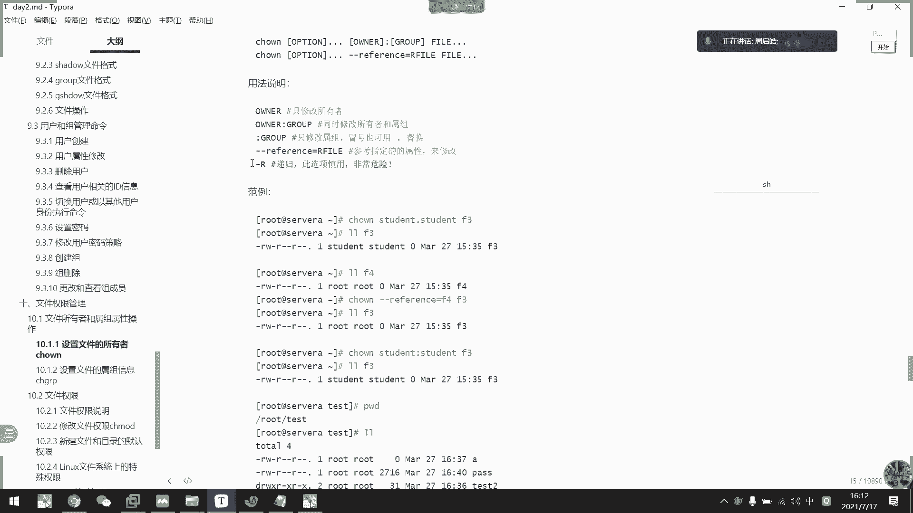
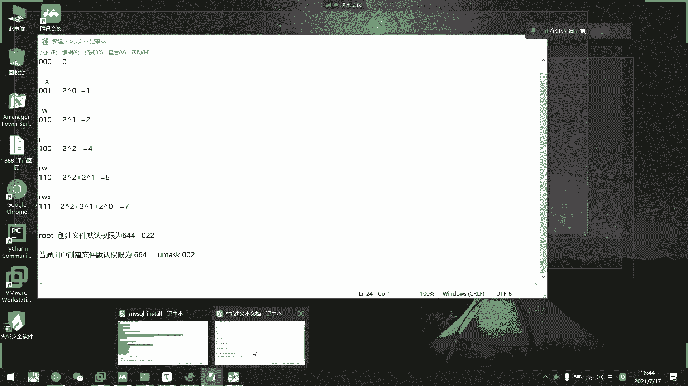
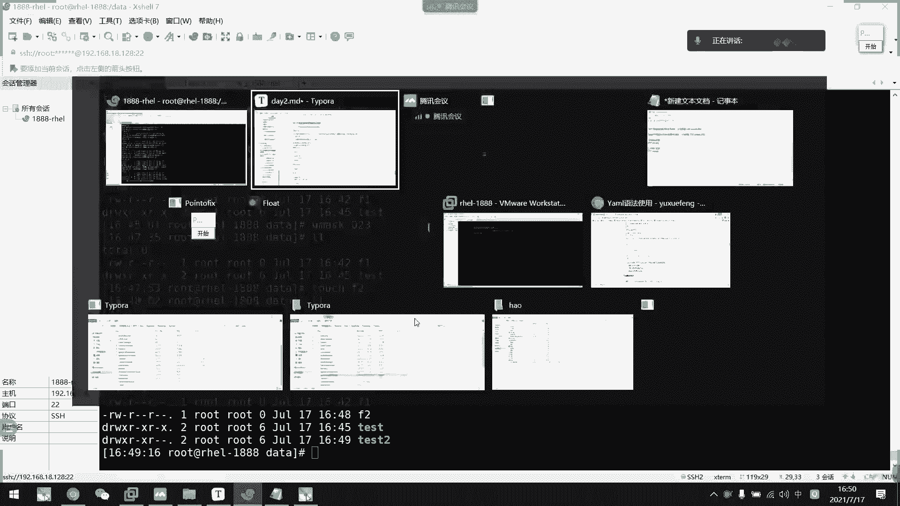
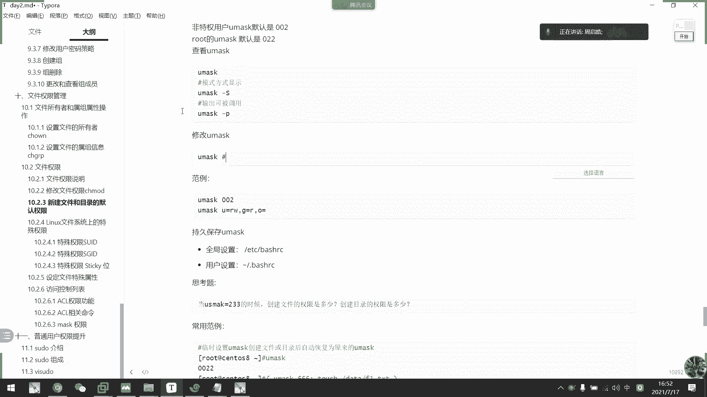

# 2021年7月新版-----RHCE8.2 RH124 RH134 RH294 认证课程 - P15：day3-7 文件权限管理1 - bili_15701050454 - BV1Gy4y1T7ug

啊，接下重点。啊，是我们的一个文件权限相关。文件权限管理啊，我们来看一下。

前面我们讲链接的时候说过了。我的文件。一共有11个字段有11个字段。那么第一个字段是我们的文件类型。啊，然后这里是附加权限。然后中间几个字段啊，就是代表我们的一个文件权限啊，文件权限。

我们文件全限有什么呢？

有。说了。有我们的RW，然后还有一个叫做X啊。RWX。写上面句啊。RWX。为什么三个字段呢？每三个字段啊不为什么九个字段呢？几个字段。都可分为3个RWX啊啊都可以分为3个RWX。

首先我来解释一下are stop with。刻读。可多啊。然后W代表Y。啊，代表和谐。X。呃，忘记什么，反正是可执行啊可执行。啊，所以我们一般。二进制或者是命令或者是呃或者是脚本啊，都要加一个X权限。

它可以才以才还才可以执行啊。才可执行，然后呢。分为三个字段啊啊不分为9个字段，然后每三个字段为。一个整体啊。啊，每一个每三个字动为一个ar啊，首先这前三个。啊，我这样写吧。RW X RW x。

RWSR前面三个字道是我们的优势。所谓的所有者。啊，第二个组状是我们的group。这是我们的主所有。第三个字段是阿的。OTHEROTHE阿和其他人。一共几个多长啊。分别是什么呢？

首先前面三个字段我们来定义它other是满权限的意思。那么这个user。比如说我们这个user是root嘛，那么它就可以对这个文件修改。修改内容。然后执行也可以啊。我们修改就包括可读可写的，对不对？啊。

我们。开灯就是可读嘛。那么我们要修改是不是VIM。等工具或者是一口。E口是可以可以没有R啊可以没有R，但是一定有W啊追加啊追到里面去。然后第二个是主。这个所属组锁组。那么组内的成员。就由后面。

三个周段的控制。然后呢，什么叫其他人？其他人。对于这个文件来说，它是属于root组啊，wordword也属于root组。那么如果是root组类的人员都可以。对他用第二个字段来修改。啊。

那么其他人就不是所有者，也不属于这个组，那么他就是其他人啊，那就是其他人阿德。那么比如是说我们现在这个文件啊是RW杠RW杠。那么就是说root对这个文件有可读可写的权限啊，然后是。组内的成员只能读。

其他人也只能读。比如说。

我们看一下。修改文件权限的一个属性操作啊，是用我们CHOW。啊，我们通过这个命令来修改一下它的一个。属性啊。呃，4点05分啊4。05分。好。啊，这个是哦不对吧，CHOWM啊是修改它的一个所有者。

还有所有组啊啊所有者和所有组。

比如说。我现在这个文件啊是属于ro的吧啊，我们就改F一啊，以F一为例啊。啊，可以CHOWM把它改成student的。好，我们就一个命令搞搞定了。加一个点啊加一个点。🤧或者是冒号。啊，后面先不输入啊。

改F1，我们现在看一看，你看是不是都改成student了。Student。那我就先反过来。把seon写在啊，不是。把word写在。后面。大家猜一下现在变成什么样子了。嗯，现在变成什么样子？啊，对啊。

是该组。是该主。所以呢我们就一个命令搞定它。其实前面冒号前面是所有者。🎼那后面是所属主啊，如果。没有写的，他以。呃，缩诊为我们的一个。控制把所指也改成跟我们所有者一样啊。当然指定的就不一样了啊。这样改。

说以反过来了啊。确定。啊，这就是修改我们文文件的所有者啊，还有搜住。

啊，奢求。好。啊，这里有解释啊。可以用点啊。啊，可以用点。这实我喜欢用点的，这个给你们也是用了用了冒号就标准一点。然后呢，还有一个呃杠杠。We frozen we frozen。

这个怎么用呢？啊，就是以其他文件的。说着说着来做。呃，参照，然后修改我当前这个文件啊。比如说我现在先把F一啊都改成是student的。啊，都改成student。然后呢，我现在以F2为参照啊。

看着CHO5。要是刚刚V。Fro。然后是F2啊，然后指定F1。看到没有？啊，都变成无独了，跟我们F2是一样的，对不对？好，然后是杠L啊，杠L是递归的意思啊，这个要慎用的，很危险。如果要用的话呢。

一用它就把。

目录里面的所有文件啊一直到。最最里最里面的子目录啊，它都会改，把把把它那个搜索改了。比如说我现在在data下创建一个。

sStill呃随便吧，贴死吧。然后呢，在。再创建一个吧。他是ぎ。好，然后是touch。F1啊，我这是F1啊。叫T一吧。我在t始里面创建1个TE。创建1个T1。

然后在tests里面的t一下面也创建1个T2啊。啊，不对，去。Yes。可以看到LL。还是进去吧。可以看到他们都是root，对不对？他们都是root。里面更不用说了啊，里面更不用说，然后我这个CHO。啊。

干R student。对 student。可表。这个目录。说着分开。然后我们进到里面去啊。你所有文件。他都变了啊。看到没有？所有都变了。那么。本来我们student作为其他人，他的权限只是可读。

那么此时此刻，student对这个文件已经有一个可可读可写的一个权限了，对不对？是不是很危险啊？对于一些重要配置来说是不是很危险？

啊，所以地柜一定要慎用啊一定慎用。好，接下来啊这个了解一下就可以了，只只更改我们那个主型息啊。所以呃还是CHM的一个命令就够了啊，没必要再多记一个啊，没必要多记一个啊，这个只只改组啊CH。

GRP啊。CHGRP。啊，比如说ro，然后是我们的test。

我在这里面啊。他有几个组啊几个组。第一个命令就够了啊。几个命令就够了。好，体验着啊是我们刚刚说的一个文件权限啊，文件权限。刚才说了嗯。us者啊Uuser，然后是group啊Ggroup啊。

other其他人O啊O。几个字段，每三个字段代表一个。然后是啊这里有啊iscuber。A curve。 It's cur。

那么刚刚我们介绍这个权限以后呢，我我说了啊，我们修改是用我们的一个s mode啊s mode。那么我们改它权限有几种方法呢啊。

呃，有三种啊应该有三种。首先是。呃。直接指定呃，然后是第二种是数字法，第三种呢是加减法啊是加减法。

啊，比如说我现在是呃。CD给我们da塔吧。还是以F一为例啊。啊还是FE为0。我先看一下stuuddent。他是啊注意啊它是wordorld的啊，它它他它是wordld组里面的啊。在ID一下右手上。

他没有啊，它不是。那么我们先入手3。啊，既不是root，也不是root组里面的人员。所以他对于这个文件来说，他是其他人，对不对？他其他人，那么我们切换到右手上。现在已经是了啊已经是有手上了。

那么我们来看一下呃CD到。别塔下。L啊然后是我们caF1。能看啊能看对不对？VIM。F1。你看这里显示一个re only制度，那我们做修改啊，你看。他就直接说无法保存的啊。打针烫。WQ他行吗？也不行吧。

这强制退出。啊，这就是他自有制度。那么我们现在切换到student啊。好。我们 student。啊，他是ros组类的成员啊，ro组类成员。那么。呃。那么。他对于这个文件啊也是只有直读操作啊。

也是只有直读操作。啊，比如说。啊KF1。啊，VIMF1我这边就不演不演示了，这里写的制读啊，这里已经写制读了。OK那么我们现在修改一下属性啊。现在首先用我们的命令啊CH modeCH mode。

然后刚刚说了。三个字段，一个是U，一个是G，一个是O。如果我只改。G我们可以用。算方法一个是等等等于啊，一个是等于或者是加减法。可能是。RW。然后F1。看到没有啊，就变成RW了啊，主列人员可以RW。

那么我们试一下可启乎，你看已经没有Von了。对不对？3啊就这样吧。可以保了可以保存了啊，KF1对不对？那么。我们这里右手三可以吗？你看。它依然是read only啊read only依然是制度。

因为它对于文件来说，它是其他人啊，他对这个文件来说还是其他人，然后其他人只有一个R跟啊R选项的制度。那么同学们我问一下HH mode。哦。等于W。F1。那么。呃。我们现在user商可以对它做修改吗？

可以对这个文件做修改吗？啊，同学们可以用VIM去编辑它吗？啊，同学们。可以不？可以不可以。Hello。别发懵了。啊，我们可以用R样去修改吗？有呢有呢。可以吗？跟着啊不要犯困了，更着思考。应该吧。啊。

都觉得可以啊。可写是吧。你看permission decline啊，promission decline全然拒绝，因为他看都看不了，他怎么编辑，对不对？啊，这个文件它已经不可看了啊不可读了。能保存吗？

啊，对啊，没有权限。你看它只有一个可写。那么。Eco， hello。能追加到F一里面去吗？所以问。不喜吗？可以。好，我们看一下可不可以啊。没报错啊没报错。那么我们看一下有没有追加进去啊。哎。

发现啊的确修改了。越为他有可心。但是同学，你觉你们觉得这样有意义吗？啊，这个样子工作是不是一点意义都没有，他只有。追加的权限啊。然后又看不了这个文件，我一点修改了。东西都没有。就说。

这样修改一点意义都没有，我看不了。根本不知道自己有没有做对啊。呵呵。😊，对。对呀。啊，我这还还好没保存啊。啊，后这个。啊，我这个命令啊。他的意思是把最后一一行删掉啊。那么我们这里可以删吗？嗯。

你们觉得这里可以上吗？我也不知道可不可以。S the命令。他过程。是不行了。杀不了嘿嘿。到时候我们学到C的时候再讲解啊啊再讲解我们的一个行编机器啊。到时候再解你。对对对对对对对。

他是要把我们的每一行逐行都需要丢到啊，通过查看，然后丢到去内存空间啊，到时候我们再来。到时候我们学到那个再那个啊再再再来再来再来再来讲讲述嗯s一个工作模式啊。

好。

呃，所以呢。我们对于一个文件的操作。最小权限。是二楼。有意义的最远权限是L啊，只有一个W是不行的。包括可执行啊。啊，包括就行啊。比如说我现在写一个剧呃脚本啊。直接把F一改一下吧。啊，写写一个脚本。はい。

はい。宾雨干。简单一点，就一口哈喽。好，然后呢CH mode。O加。F复一。啊，很正常啊。好。哎，刚刚就多了一个东东了啊，刚刚就刚好讲到一种呃模式化啊。第二种第二种方式就是说。它只有W情况下。

我这里O加一个啊加一个。最后说指定加一个权限啊。就加减法所谓的加减法就以说我要给他一个执行权限，我就加啊加。那么同学们我们现在可以执行这个。找我吗？啊，我们右手上可以执行吗？可以吗？我觉得不可以。

我没试过，我觉得不可以。😊，因为他。先要读再执行。他读里面的内容在执行。所以。对于脚本而言，最小权限是啊。最小选项是RX。啊，一定要读才能执行。他都不知道里面的利用怎么执行啊，对不对？O。好。

这就是我们的一个。文件的一个权限啊，然后第三种修改方式啊，修改方式CH mode。第三种叫数字法。数字法。啊，比如说。777。77。第一个期代表。优势。第二个代表G，第三个代表O77就是满卷啊。

XW这个怎么来呢？我们看一下这个表怎么来的。

可读四可写2执行一。啊，它是通过呃二进制来的啊，我们看一下啊二进制。首先刚刚干啊，是三个权限，对不对？不论这样说直不直观啊，他们都各有用题啊，各有用途。那么首先是可执行权限杠杠X。啊。

有代表一啊有代表1001，对不对？14杠W。干。这个是010。啊，尴尬。0呃100对不对？那么我们来算一下。全都没有000。那他。苏不是等一明。而姐这大家会吗？然后这里啊是。204方嘛，对不对？

20是吧。所以说等于一嘛？所等于议。然后这里。啊。是二的1次方吗？第啊。好，最后。是二的平方。是不是这个思啊？啊，所以怎么来呢？R等于是W等于2X等于1。那么RW杠是是代表110。10。等于二的平方。

家。都的意思方，对不对？25于6啊。所以满权啊满权RWX。Yiyi。是不是二的平方？加二的一次方。再加二的0次方。等于7啊，所以满权等于7啊，满权等于7啊，输入法要这样来的，输入法。

以三个自动为单位啊以三个字动为单位啊。OK这个就不细讲了，我直接指定数据就可以了。那么。我们上方式啊。

刚刚就等于数字法啊，还有加减。那么他们除了UG。呃，UGO还有1个A啊A比如说我现在满全了，对不对？A减。OK的。看到没？A代表O啊所有所有。但是呃A等于。听阿龙。就等于二鲁了。啊。

就这个数字法数字法就不能了啊，数字法可以等于。直接啊一定要三V的写码啊，三位的写码。700。或是。64。搞定。

其实这个不难啊，要理解好权限的一个。控制就好了啊，你讲样随现的控制就好了好。关于全限控制哦，等等。刚刚讲的是啊文件的。啊，刚才讲的是文件的权限啊，那我们接下来看一下目录的权限啊，目录的。

L杠。这是我们啊所以我们。🤧data的权限啊，那么我们root啊是满全的，然后是。书主跟其他人都是可读可呃，可渡可执行。那我同学们给你们看一下啊。我用个ts这个组啊。呃，特特出个目录啊为例啊，本来。

先把它。改成root吧。因为我root的话，有没有全身都能进去了CH梦。谢取蹦。嗯。Rote。干2吧。先全改回来。O全改啊。那么我现在s mode。🤧嗯。哦。减X。那么。

我现在user上能访问到ts里面的内容吗？啊。能进去不？对吧。啊，不行。可以。啊，不行。啊，是不行的啊。对于目录来说，我们可执行啊。对对于目录来说，我们可执行权限是。指定用户是否能够进入到里面去。对啊。

有al，我们看一下。看到没有？好。al，就是他对这个目录是可读的，那么他只能读取。啊，只能读取这个目录里面的。利容。然后呢，他们的原数据都看不到。数去看不到，只能看到里面有什么东西。这个里面没有送东西。

没有试下线连，它的一个元素据访问不了，目录的元素据访问不了。好，所以呢我们的目录最小权限是什么呢？目录最小权限是啊。X才是有意义的啊，这是目录最小权限。好，那么我要再改一下啊。呃。CH mode。

O加X test。然后这里可以进去没有。是不能访问呢？能把握到。啊，这就是我们的。啊，目录权限啊，当然没有那么简单啊。但然没那么简单。我们现在。其待对这个目录。啊，只能进去和查看，对不对？

我们能不能删文件？能不能删哦，不对，还没进去啊。好，8元杠2。提议。能删吗？这个文件。有吗？😀嘿。😊，不行啊，不能删。不能3。那么。🤧咳。呃。我现在把。这个T1。提议。的权限。啊，加码啊加码。呃。

O等于。啊。WX。那就说其他人可以对他做很多操作，对不对？和写可读可写可。可读性。好，那么。再来我能删吗？这个文件我右手删就是对他来说取消言。我对这个文件的权限是满的啊。我对这个文件有权认是吗？

我这一回能删到删掉这个文件吗？啊，同学们。可以。可以吗？啊，都怕我挖坑了是吧？可以吗？😊，看一下可不可以啊。哎呀。还是被拒绝。还是被拒绝。啊，再来再来。呃，先把目录。啊，不用。Student。啊，不行。

不要问他。mo头。跟他没关系的。Use sir。呃。我现在把这个T一啊。第一。C H o w n。改成是user3。不是3。Test。提议。嗯。谢谢我的表爱。然后呢。嗯。特是。好，OK那么我现在提。

他的权限。呃再几码吧，好吧，再几码。啊，我现在应该可以对这个文件操作了。这是路T。啊，应该也不行啊。就等于8。W。啊，不行。直接来个A吧。O完全。然后诶。没改到。没有他收着。提啊。诶，怎么没改到？呃。

Inventusus3。什么意思？我现在不是登录663吗？嗯m。嗯，没关系啊，点我说了点是可以用的。我跟你说呃，我说了点是可以用的，我习惯用点。是重的。Hm。😊，C曲蹦。绿色3。So so。

I usersさ。存在啊这个用户。瞬間？没问题。改一下改丢了改一下。诶。感觉stu又可以哦。那没关系。那就改stud嘛，那我们用stud嘛。I student。要把他。哦，可能是哦没那个组啊，没那个组。

对对对对，没那个组啊。那就随便吧啊，我们改一下吧啊CH。O的。啊，没那个主。user3点t啊就。St嘛。对，没那过举。那么啊。哦现在右手上。啊，是这个。文件的。是这个文件的。所有者，那么我现在可以删吗？

I杠FT能上吗？朋学们可以上吗？

想想能不能删？刚刚我是作为其他人啊。然后现在。是作为所有者可以删吗？

可以吗？我们看一下。还是不行，嘿嘿。啊，这说明什么呢？说明我们对目录。里面的数据。啊，好好。我们对目录里面的数据。进行啊呃里面的记录进行删除，跟文件本身的权限无关，只跟目录本身的权限有关啊。我这个组。

啊，这个文件属于。所有者是road。所属主是wo。所以我们看这里的权限就可以了。我看这里选这边，那么我user对于这个组依然还是其他人，它只有可读可执行，就只能进入到里面还有查看里面的内容啊。

并没有读写操啊，没有写的操作。写的操作对于目录来说就是删除跟创建啊。比如说我现在。C h mode。O加。帮你讲对象。现在就有可进经确了，对不对？你再看。现在能散步？啊，最后一次机会现在能散步。😊。

Hello。同学们。好。冷了啊。😊，终于猜终终于答对了一次，连续回答了3次，终于把它给删除掉了，对不对？啊，记住啊。我们目录的最小权限是RX啊RX啊，最最最小有意义权限是RX啊。然后呢。

如果对目录里面的文件。进行操作最小呃，不是进行操作跟文件本身的权限没无关啊，跟文件本身权限无关，跟目录的权限有关啊跟目录权限有关。只要他对这个目录有背辑权限，它才能删或者是真增加里面的。

在里面增加内容啊，比如说啊他。踢的。所以跟。文件本身的权限无关啊。记住这一点啊，记这点。当然这个对root是没有做限制的，root是没有限制的。

好，这是我们的文件选择。然后还有个大X啊，大X。什么来着？大克是。哦哦哦不用管了，大个是没想到啊。在特殊全生位了。好。关于权限啊。就是普通的一个权限，我就讲到这里啊，普通权限啊。记得是普通学限。嗯。O。

然后。呃，关于我们新建文件，还有目录的一个默认权限啊，我们可以看一下。它是由我们系统中U max值来。做控制的啊做控制的用max。

You mustす。啊，是这里显示的4个数字，但是呢我们只看后三位就可以了。真正用m是后三位啊。啊，用么这个后三位00呃022啊022。这是ro驼的啊，普通用户呢啊4002啊。啊，是002啊。

互能不4002。所以呢他们。创建文件跟目录的权限是不一样的啊。我们先看一下。啊，比如说我要是rootR杠把清空的不要了都不要了。我们先是ros，对不对啊，我先套取一个新文件。

你看它的默认权限是呃644啊。啊，对对对对，跟文件所属目录权限有关啊。好。我们看啊。我们不署用户默认创建。4644啊，看一下大家能不能猜到啊。

说记在这里吧。嗯。B。是。创建。文件默认。全限会。644。接下来。

看普通过啊。CD到自己家目录吧。套uch。有不异议。不良裤。

不一样啊，是664。

普通用户。创建。文件。默认权限为。664。然后U must字。002。呃，那个。啊，大家看这里。能看到什么吗？啊，能看能干出什么吗？能看出什么吗？😊，兄弟们。同学们能看到什么吗？看不出啊。

看不出我们再来一个。

啊，不通库创建文件夹。嗯。还是开始吧。诶，那给DR啊。目录权限。775775。

对龙个。M。775。

然后是。先KDR啊root的啊。呃，还是开始吧。是多少？

755。啊。能看到他与Umus之间关系没有啊？啊，同学们。😀呵。😊，相橙。往三减。什么跟什么讲啊。嘿其实也差不多了。😊，其实也差不多啊，也不是相遇啊也不是相雨。嗯。可以。既然搜百度。好，我来说吧好。😊。

啊，目录啊不文件。呃。文件不安权限啊。文件默认权限。文全问没事啊，是。666点you must。目录默认权限。啊，是777减you must。你们说一下是不是一样呢？给说一下。还有。发言了。啊，对。啊。

原来嗯。我同学有在这里发言啊啊，我们尽量不要在这里发言啊，我看不到了看不到了。因为他说说说到里面去了不在那里发言了。竟然在我们微信群上面发言啊。好OK啊，这同学。答对了啊。啊，我也不知道。啊。

系统内定啊系统类定啊，其实其实应该跟他说的啊，是八进制啊，是八进制。啊，不一样啊不一样。你把它当成是遮挡就好了，把它当成是遮挡就好了。好。😊，那么。

you must值啊是可以修改的啊。比如说我这里you must。呃。0啊，不是。就023吧。你告3。啊，对啊，文件不一定要执行。对啊，刚才说了啊，最要权限啊是啊有R啊，是有R。对对对对对啊。

然后目录啊一定要有RX啊。😊，也不是说一定要有他有意议的话，一定要阿而已啊，现在是023。那么同学们回一下，现在他取一个。文件。啊，他这个文件F会。那么同学们可以告诉我他的一个部分权限是什么吗？😡，啊。

023。他人不安权限。嗯。😊，63。有其他答案吗？嗯。🤧K。有没有其他答案？看有没有人猜也猜对。能能直接答对了，我觉得是有基础的同学，但是猜的话。啊，培员你是猜出来的吗？啊，这个纸怎么来的？

看来这同学有基础。😊，那这个词怎么来的？啊，对啊，奇数加一没错啊。当我们相减以后啊，得到的。如果是基数加一啊，这对于文件来说。对目录啊好像没有这个限制啊。我们看一下啊。对目录有没有？没有啊。

不要问我为啥，我也不知道，你问我也不知道，因为。😊，啊，只有升请文件啊。目录目录没所谓啊目录没所谓啊，只有新的问题，因为基数。

权限。嗯。他为5。要变成6。默认不给执行权限啊默认不给执行权限。

因为文件啊都是默认不给中新权限，所以它有基数的话。有接束的话，那肯定是可执行的，对不对？默认不给自行权限的文件啊。这样子可以理解吗？可以明白吗？所以它基数也要加一啊，基数要加一啊，目录没有这个限制啊。

目录没有这个限制。因文件全都给了执行权限还不得了啊啊不得了的啊，这东西不得了的。

而且还是给在了我们的啊，而也不是说啊要看是哪个技术啊，如果不小心就就就是啊不小心就是这个。

啊，微信，就是这个文件啊。就基数加一嘛，刚刚说的数字法啊数字法。

啊，对。对啊是减后加一啊，减后加一得出的结果啊，然后加一啊，反正遇到奇数就要加一啊啊，这是对文件而言啊，对于目录而言不是啊啊，对目录而言不是。

好。😊，呃。

看一下。港S。你看。这是U must字的一个。总况啊。6万丝的转换。啊，023减完以后。就这样子嘛，对不对？啊，这是对目录而言的啊对目录而言的。啊机械啊干屁。有啊有 mask。等皮。

又不是1023啊。打出来啊。好。

要修改它，就直接像我刚才那样子啊，但是这是临时的啊，这是临时的，我们退出中端再进来。

再时看一下。他要返回啊，0022啊00。

然后普通用户呢。他022。其实也不是说只是普通过，它是这样子算的，我们可以看一下啊BRC。他是在这里定义的。去哪里了啊，这里啊这里你看这里它是GRD啊，我UIDUID。大于。啊，199。并且。

他的呃用户名等于主名啊，用户名等于主名。符合这个条件，首先是大于199啊。然后中国名等于主名。所以它的这个输入这1个0002啊002。呢个。啊，然后否则就是022，其实他这样判断过来的，这样判断过来的。

啊，所以不并不是说普通用户啊，只要他是大于199啊，他说这样子。比如说。我看一下ID马co。看不到看看不看到看一下。UID然后是。等于吗？啊不等于改一下了。这推一下吧。嗯。Cuse。Moode。

跟 m my e改咗 my。嗯。反过来了啊。I d my。好，退一下。听清了。速干马系扣。嗯啊，对他登录不了。改一下。Uer mode。刚开始。Bingbesh。树干马西个。更不进了。然后我们看一下。

他现在是用户名的一主名，但是ID可能不一样。我看一下它得出的值。执行一下。麦嘛，对唔对？然后这里执行一下。哎，怎么是U手删呢？哦，对。也是 Mexicosco。然后他也大于199。

那么我看一下他UUm值是多少。你那个对不对？厘米2。那呃把他那个组再改一下啊。呃，某。GrupP mode。🤧杠Mmy一my。对。他没他没权限。诶。😊，讨厌。啊，改过来了。他现在主不等于主民了啊。我在。

重新看一下这两个命令。感觉。不等于了，对不对？那么我们看一下它的U mask。是不是就变成022了啊，就跟我们这个条件是一样的，对不对？离额了，他不他现在是不满足这个条件，所以离额了。

所以这个实际上是控制不了，实际上是控制不了呃，root跟。那个啊普通用户的默认mussask啊。啊，我们知道这个就可以了。好。

那么。我们怎样保存它呢？啊。首先是一个全员配置啊，在bechRC上面定义啊，一个是在啊点bechRC上面定义啊。

啊，我看一下。保证他。嗯，比如说VIM点。Be。这里写一定要这上面写。有 mask。044吧。because。寄回一下。塑钢。那么you must。看到没有？144啊144。啊，这样就可以保存下来了。

改这里。有时候不会生效啊。比如说这己改成。3。跟下。我们来点。E啲C。不需2是。开一下。ます。你看。有时候不生效，我也不知道为什么。重登也不行。从那不行。重启好像也不行。看一下。

再看一下you must。你看没修改过来，我也不知道为什么。嗯。我看一下。这里。树干。点别。欲しい。就把这个删掉啊。保分一。看一下这个有没有出来。啊，被看。都不行的。都不行。真的不知道为什么。

好奇 why。明字是最定义的。都他改不了。那这里改成023。异议。对。Bし。Youマスク。还是002啊。或是。干绿色3。You must。你看。比如说。嗯，这里再推一个再来。M no。没变化。

我也不知道为什么。所以呢如果到时候我们考试啊。他可能会有一个U体啊，我们就写到它的一个。呃。我们就写到一个自己的啊。点别是阿心里面去啊。对不是。啊，记得一定要写在这上面啊，因为它有一个读取读取顺序啊。

我之前说过了啊，读取顺序。啊，如果只要在后面他是先读取我们EDC batch的，但默认现在啊我这里没写的话，它肯定是读取这个啊EDC batch。但是我就不知道为什么它读不出来啊。有么。0。嗯嗯。有。

那额。搞定。嗯。哎，他本来就02，改成002吧。😊，给你那个。看一下能不能这样子激活。重新加载。啊，可以的。

看到吗？ok。啊，这是Um啊这个。呃，讲完这个呃算了不讲。这个回去敲一下吧，因为这个超干了啊，还没讲到这些。应该也说没有讲啊，没有讲到这些，看结果。没关系啊，我们呃下课吧，然后。回去复习一下。

然后这些特权限我们下周再讲啊。特权限以及ACL权限控制啊第四个字段啊，我们下周再讲。哦，明天再讲的，是不下周真的是。下课啊。

哎呀，有个很重要。