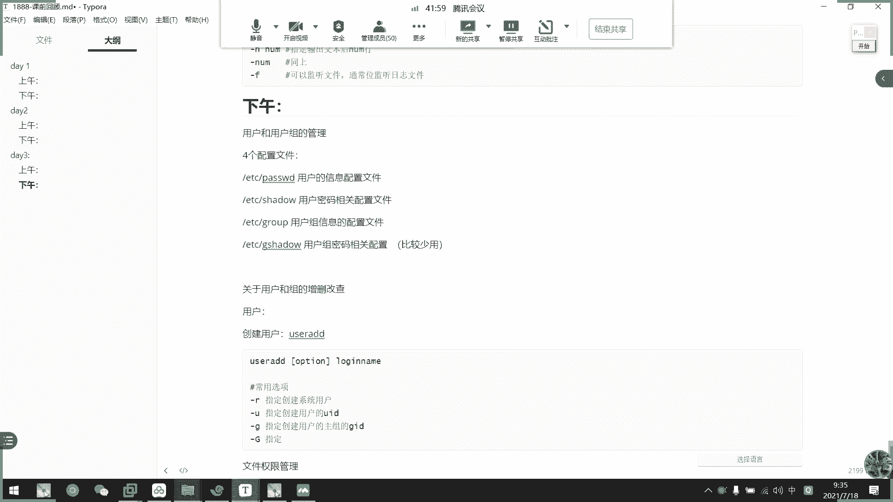
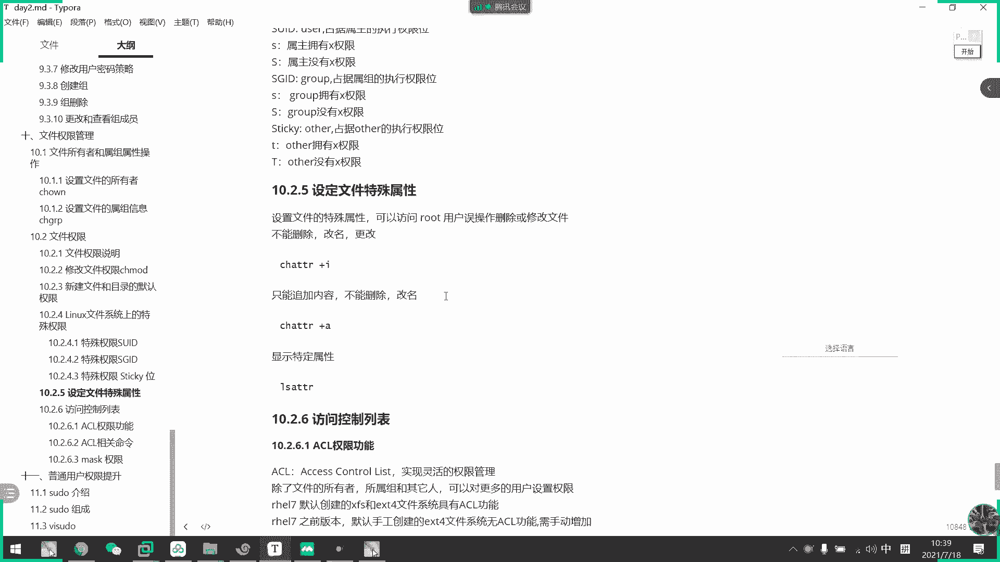

# 2021年7月新版-----RHCE8.2 RH124 RH134 RH294 认证课程 - P16：day4-1 文件的特殊权限以及acl控制 - bili_15701050454 - BV1Gy4y1T7ug

昨天下午的。科睡啊。啊，昨天下午嗯。我们主要讲的是什么呢？啊，关于用户和。用不足啊。😊，的一些呃。管理。而且。文件权限法。🤧好。好，关于用户和用户组的管理了啊，首先呃我们这边就不详细讲了啊。

就划分4个文件啊。四个配置文件。好。分别是我什么呢？啊ETC下的。他是我的。啊，这个是。用户的。再绍一下。回过信息吧。配置文件好，然后是ETCshadow。用户密码。相关配置。然后是ET下的group。

嗯。1。使用物主用物主信息。配置文件。ADC血懂啊，继血懂。肉不煮。密码。相关配置。啊，这个比较少用啊。🤧嗯。😊，但是如果你们公司要求给主改密码的话啊，也是要用到的啊好。然后关于。So真可的。

关于用户和。增三改。中部。创建。用户。我们用user。诶。这键盘。动不了吧。嗯，命令格式是我们的user。对的，加我。加我们的。不雨的。常用选项。🤧啊杠啊。呃，指定。换建。系统如果。啊，赣U。指定。

创建用户的。UI呃不UID。更据。指定。创建。用户的。🤧嗯。足组。的GID。这大去啊。指令哎，等等。我看一下有没有这个。

呃。因为创建他不一定可以指定互加组吧。我看一下。有没有大局啊，有啊也有。

创建用户的。富家族。GID。嗯。有什么？嗯。杠L。指定。项目。刚S。指定用户的效类型。但是。添加。表述。嗯。啊，一般常用的就是这些，还有一个杠低啊，不需不要不要加目录什么之类的。然后。先写删除用库吧。

タジほど。Uer定。有手。给例。不北省。罗经你。嗯。🤧嗯。采用选项。呃，一个是戴尔。必归删除。加目录。邮箱。如果不加。则只删除。呃。嗯。保留。用户相关。工据が。呃，改了啊。修改。用户属性。叫信息吧。

我们用user mode。就 user modify。U说 mode。就。我没事。啊，用到这个的话呢。啊，注意这里没有中过号。意味着这不是缺身的。你要你要改啊，就要加选项了啊。啊，一样的。啊用水是。

赣U。修改用户的OID。赣据。修改。中厚的。没据。这大去。修改或。增加。用户的。都不道。不家住。嗯。大概是。修改。用户的。消类型。常用的就这些啊。加布录那个也可以。改其实他们也是类似的。

两个命令是类似的，但是常用的就这些啊，常用啊，还可以改名的改名字啊。

就是 mode。改屏我看一下。呃，应该是刚M吧，没有没有另。刚P可以指定密码也可以啊。没看到。改不了名字。改不了名字。我就可以改。然后这组可以改名。我觉得用户名也是可以改的。找不到。有了吗。

有了说lock啊。小姚哦，对哦，新的登录名啊小瑶啊。

啊，刘文。Of the lobbying。眼睛真好啊，眼神好。这加一个吧，杠1。修改用户的。密吧。

更衣嗰个。

Gyi。Their car is specifically。

用户账号的。有效。不要补。修改周度。密码。黄angxi。画一线。花谢实。O。然后是主声。读完毕了。创建组。嗯，葫芦。🤧嗯。嗯。🤢，Group at the。Ged。人生。我ose林。我觉得这个有说必要。

加什么选项的？没什么常用学项。那就。干啥吧。指定的。创建组。四同节。🤧啊。309吧。3除组。G。这类的。就。没し了。公司认个。🤧嗯。采用选项。Yeah。就即时。有用户以。该组。为辅组。也可以。强制删除。

是。修改主信息。有什么了？修改主信息。我。Moode。加。でしょし。这个点点。因为两有时候是两个名字啊。啊，比如说。嗯。Gth mode。港N。更改。署名。要注名啊，就是group。Moode。感恩。

然后是。哪一个组，原有的哪一个组。原有的。欧的。那个。要6。其实么好像没没多少。啊。那这个组没什么。要改一般都是改改改改组名啊啊，就是查啊。查阅。密码相关吧。写上面去吧。嗯。修改用户密码。にし？

Youong。写上面去吧。他说的。🤧嗯。这是pa。我。迷你行。对。有设这个。注意这里是。Ro only。仅仅是root，可以改别人的密码。其他用户。直接。🤧咳。执行。不ラ。🤧呵呵。到。

选项也是60欧里啊。修改别人的密码策略啊。这里也是楼。复制过来吧。对。不对。算下来。修改密码。随时搞给我吧。可用。对。标准出入。Jin。适用。嗯。个系列。啊，怎么说呢？比如说一口。然后。他说。这。

管到啊，要是。尴尬决定。有是那。对。嗯。修改密码策略啊。肝癌。修改。密码的。过期。过期。O的。发线。时间。🤧嗯。呃。杠M吧。修改密码的。

这个是最强还是最短的现人。呃。看看啊。S的。的那个口。Pa what him。

啊，最少多少天可以更改密码。多少。后。跟。刚X。即系咩。

Ma dayss， a can bear days。

🤧嗯。呃，密码最大。使用。提示。啊，刚到不。密码。设置密码过期。钱。多少天？告知。用户。这的就是这些啊。对。真的难受。嗯。查看。说写的最后吧。查个用户信息。ID。只是。快啲。就是那个。没有什么好讲的。

这个。哎有差多了。瞧瞧了。不家族。是不认。叫做group。我是不认识。

A mess。

不子。呃， groupru。Ms。加选下啊。O， B， T， I O M。主要是煮面。财务水箱。差选项杠A啊。增加。指定。到。Thank you。该组。对。不答对。看第2删除。指定。从。该。附加族。

删除。移出吧。呃。

什么是清空来着？干什么情工啊？

清空啊干屁啊。星空。异议。该组。喂。附加组。对。3L啊。抢了看了。该组。异议。该组为。附加族。用で。赣据啊。指定。注明。来了。哪个组啊？好。啊基本上就这么多了。然后是文件权限管理。🤧嗯。首先。

欢先生管理哦呃，2块啊，一个是。文件。归属。啊，我也归属有我们的。所有者。还有。楚啊。🤧嗯。🤧嗯嗯CH。C许我都不知道。可以。修改。的呃这个文件的。不手续。比如说1HOWN。全是欧的啊，然后是。绿色对。

么好。5。要是否。这个不细讲了，就不这样。好，然后是文件的。普通权限。权限是。三。也是。You。所有枕。W。嗯，我觉得别啊主。所属。权限。欧款。其他人。🤧嗯。好。修改。权限。是我CH梦的。然后是。

必要が。权限的。三种方式啊。所以是C。呃。指定指定吧。我叫指定法而已啊啊，是等于是。给个范例啊CH mode。这就是。由。等于。啊W对这里加一下。然后。每种。权限打入。分为。三类啊。这加一下。啊，可读。

W。和谐。要开始啊。可执行。如等一下啊或是G等于。呃。刚刚合是O等于。🤧嗯。啊，刚才开始。还有其他的啊什么UG等于啊。然后是加减法。U加。用是X吧，一般都是U在。我是居家。🤧嗯。W。哦。

忘了这个能不能同时加两个，我试一下啊。

同时加2个。但二啦四十啊写咗部。O加。W F。

啊，可以的。

二是 o加。W的或是A加X。还有是。A减X是吧？然后是A加W。自己去实验一下啊，要是数字法。数这个。比如说R等于4啊，W等于2X等于1。啊，这个自己回去看一下怎么来的啊。然后就是什么66664。

有七七更噶。啊 ok。我们权限就讲了这么多啊，我们权限讲了这么多。那我们看一下。是不是就讲了这么多，看一下有没有要补充的。As呃。还有Um。啊，关于。新建文件。默认。表线。Your must。啊。

查看用m。就直接输入。直接输。好。然后。修改。临时临时临时临时修改you must。就是U。封面加。事是不合适这样子。加U must的字就好了。嗯。永久修改啊。需要写到。配置文件做了。有我们的。AC。

H啊，这步叫配配中结。呃，加目录下的对，这选要C啊。需要。系统。交我的。好。在这里加吧。新建文件。默认。本身。等于666减U must。Xin建。我。默认。有一些。777Jyou must。可以。ok。

啊，这就真的没有没有的再增加了啊。那么来今开始一下今天的内容啊，45分钟我们来。讲一下啊。特殊权限啊特殊权限。刚说了啊，回顾的时候已经说了，我们讲的RWX啊是我们那一个普通权限啊。那我们看一下。

什么叫特殊权限啊？特殊权限。首先。我们特有权限有三种啊，一个叫做SUID一个叫SGID，还有一个叫做张志伟ty啊。好。我们先看一下什么叫SUID。呃，前提是啊我们的一个进程有鼠主，还有鼠主啊。

然后文件也有鼠主，还有鼠主啊。这个比较out口啊。就就是就也要看他啊进程有他的一个所有者啊，文件有他的所有者就好这啊，然后。任何一个可及时文件呢，能不能启动为进程。

取决于发起者对这个文件是否拥有执行权限啊。第二个呢是启动为进程后呢，这个进程的属主是发起者。然后。进程的属主也是发起者的属主。第三个啊，如果是进程访问文件的时候的权限取决于进程的一个发起者。好。

他这种呢是一个比较标准的，然后呢。根据我们UUID然后执行以后呢。我运行这个。呃，程序的用户啊不一定是这个进程的所有者啊啊，这个就叫做SUID了。然后呢。

我比较明显的一个是我们的一个pass这个二进制文件啊。我们看一下格少B啊pa。啊看啊，还个是红色的。你看呃大家有没有发现有什么不同啊，这个文件啊。我这个文件有什么不懂啊？Hello。啊，红色。还有吗？

两个地方啊两个地方。啊，对啊。是所有者的权限啊，它执行位为XS啊啊，这是我们的SUID啊SUID。好，我们来看一下。我先复制一个可款啊。我先。再复制多一个了。这个。丢了。啊。

我们这里执行一个password啊。不说，然后呢我们来看一下啊PS杠A。

Yeah。啊，这里我们看一下password啊，你看当前这个进程啊，是我root。

执行了这个。啊。

执行了这个二进制程序，然后呢，所以它称啊它的它的那个进程啊也是我们的ro。那么我们接下来在这里。

Student。啊，也执行。那么。他这个进程啊。可以看到啊，也是属于我们root啊，所以它这个就是SUID的一个特特点了啊。

正常来说，进程的发起者。等于发起者本身嘛，但是有了SUID以后呢啊虽然是我其他用户执行的，但实际上这个进程的所有者啊，进程的所有者啊是root是root。

相当于是啊stuud等用户临时使用了word身份去运行的这个文件啊，所以叫SUID啊，明白吗？大家。

嗯。同学们明白吗？这叫我们自己写出来对难写。因为我们写的脚本都是调用一些命令的。呃，不能说跟速度一个意思啊，速度跟这个不一样啊，速度不一样。所以说他是可以执行多个命令啊。

说的是临时提全，但是他是直接对这个这个这个程序呢有了一个执行权限啊，就临时可执行，明白吗？没有可知性。速度的话呢，它执行以后还那个进程还是属于stuuddent的啊。它SUID的话呢。

它它它打开以后进程是属于我们的word的啊不一样的。

他是真的以wordot的身份去执行的那个二进制文件。

好，这是我们的USSUID啊。那么SUID怎么做呢？

他需要在我们。二进制文件中。呃，有。啊，U的权限啊有有可执行权限啊，比如。我们现在去。好，可以看到。我随便弄一个。CH modeU看一下直接加S行不行啊。U是S8。合不。可是可以的啊。

但是呢它这个会变成大写的啊，大家注意啊会变成大写大写的意思是什么呢？啊，就是说我原来这个这个对这个文件啊。对应的权限位了它没有执行可执行权限啊，搭起S。用用小写的，我们看一下呃，先给。

U加S到呃不U加给到F2啊。好，我可以看到了F已经有一个可进行设线了啊，要后 search mode。嗯，优加S给我们一个。对。这是他们的一个大小写的一个区别啊。就他原来有什么权限而已啊。好。

这就是我们的1个SUYD啊，SUID这个知道就可以了。我们很少用到啊啊也不是很少用到我们。

怎么说呢？我们自己写的脚本也做不了这个啊，就做不了这一个了。就了解一下我们呃文件当中啊，有一些程有哪个程序是这样子的就可以了。好。接下来啊这个是我们真正可以使用到的啊。嗯，这正可以使用的啊。

叫SGID啊SGID。SGID是我们的一个。二进制的可执行文件上的一个主主的一个超级权限啊，但是它也有不同啊，它有不同。啊，这是文件上啊，不好意思啊，我说错了啊，SID分分为两列啊，一个是一个是目录。

一个是文件啊，一个是目录，一个是文件啊。如果是文件的话呢，就像刚才一样的啊，跟刚才是一样的。啊，就是以那个。

你那个。

组的管理啊。就是真正有权限的。那个用户。去执行啊，以那个这种权有有有权限的用户去执行这个。去执行这个二进制文件啊，但是我们主要用的还是这个啊目录上的SGID功能啊，SGID的权限功能。我们看一下。

HRD。如果创建在目录上啊是什么样的啊，比如我现在把。HHOWM啊，把这个test吧啊，tests的所有者改成stder。是的对 still的。然后是。把它说子改了。然后呢。呃。在在这个。上面啊加一个。

就S。T。再一个。特加一个加一个呃SSSHGID啊SGID。要我们进去里面看看。啊，现在插取一个文件。然后有lessGID以后呢，我们看一下这个文件，你看。特殊性。大家注意到没有？啊。

同学们注意到了没有？接下来SGID这个目录有了SGID那么它里面生成的子文件子目录呢。他的主啊都会强制。以我们的父母的主。作为他的。锁住啊。我们啊创建一个目录看一下。啊，看到没有。

都是 student的都是s student。而且呢啊他还继承了啊上面的。S呃GID啊不SGIDSGID啊。总是说错啊总是说错。所以大家知道这个SGID有什么用的没有？아 더 좋아。就就是用于。

控制这一个呃。目录。以下的文件啊都归属于同一个啊都归属于同一个。诶。组啊啊对对呀对对。好像别人创建文件以后呢，在这个这个这个目录里面呢，都强制于所这个主让他去作为管理啊。啊，对。也不是这样说SUID。

作用于二进制的程序文件啊，所以我们写不出来。就用ID就用ID也可以执行于文件啊，它两种都可以啊。但但是它的一个作用在文件里面呢，是跟我们呃S呃SUID是一样的啊。

SUID是一样的啊，我们可以控制的话是就呃是目录上的GID功能啊。是我们常用的这个是常用的。明白吗？可以明白不？啊，然后特殊权限位这里啊先讲完吧。啊，最后一个啊是我们的张志卫啊，张志卫张志卫呢啊他。

只要这个目录呢，他啊不这个用户对这个目录有写权限呢，他都可以删除目录中的任何文件啊，对不对？昨天说过嘛，有W，他就可以对我们这个目录里面的文件进行操作，对不对？好，然后呢。

只但是如果我们加了stickway啊。Stick away。那么只有这个文件的所有者或者是root才可以删除文件啊，word者这个比较特殊啊，我也不想说它。他他他就是这么牛逼啊，可以删除别人的文件。啊。

我们有一个特呃有一个默认有tick位的目录的，这个目录叫什么呢？

叫te。这就是我们。默认有的一个展示位的文件夹啊目录。啊，比如说。呃。我现在。Bao。c d 佢低头。好，我现在把这个data。感觉7DT选项啊7DT选限。机器选项。

那么这意味着我们所有人都可以在里面创建文件，对不对啊，比如说st。那么我弄个什么出来好了。随便吧。好的。我看一下能不能删这些问题啊。要不一对。啊，目前他是可以删的啊，那么我再他取一个文章。开出了。

然后呢，我登个user3。啊，灯录手上好，然后也是一到data，看一下它有没有操作权限啊。啊，还是有的，对不对？还是有的。那么我们啊在私的那里创唉，把它创建回来啊，穿回来。然后呢我把。这个。呃。

data加一个。张志伟啊张志伟就是我们其他人权限啊，加个T啊加T。呃。对。L 加 l d。看到没有啊？这就是我们张志伟啊，他是放在我们其他人的权限上的啊，其他人的执行权限下。吓，可啦。

然后刚刚我们预手上是可以删除student的。F一文件对不对？然后我们再试一下。啊看到没有？而且它的一个它的一个暴装性息是什么呢？是啊选项被拒绝啊，选项被拒绝。啊，通过选项啊通过选项权限和被拒绝了。啊。

这就是我们展志位啊，除了文件所有者啊，以及以及modode1Y2，其他都是删不了。大家啊word还是可以删除，看到没有？

啊，这就是我们张志伟啊，最后要说的一个是什么特殊权限位。如果用数字法啊，如果要数字法，我们要在普通权限前面呢啊加一个数字啊，就是说。一个是。呃。GUID好吧，SSUIDSUID为6，然后GUID为2啊。

然后占这位为一啊为一啊，比如说我们用数字法，首先我们先把它都。

关了啊。就是说我现在t。他这个目录有啊。search mode。好的数字法0。6哦不0755。诶，不行啊。Yinqiu。不行，他减不行，加可以。那就先剪掉了。G减X。就这样。O。现在075啊。

然后如果要给他加上，我们可以用275啊。895。看到未。他就变成SL他就变S，看到没有？啊，如果要把它加个张智位啊，我们可以改成1755。可以吧。那就有专置位了，那就有专座位。

但是有张志位他没有W诠身没什么意义啊，没有W权身没什么意义。最后啊是。6755。那9看到吧。我就。啊，他有他有SUID跟张志卫不能同时存在啊啊，SSUID可以跟SUID同时存在。

但是跟张志卫不能同时存在啊。是我的货啊。那就改这个吧啊一。644。被合。That。而且我这里啊。啊，有也没有本来有没有职女权限，所以呢它又是一个大写的T啊。

就说如果他是大写的话呢啊我们要知道他原来没有执女权限就可以了啊啊OK。

啊，这是我们的特殊权身位啊。这全实会的作用啊。听明白了吗？同学们。还有没有什么故意买的？啊，后听明白了，我们就休息一下，好不好。啊，现在到10点半了。啊。刚才我们介绍了三种特殊损项位。然后呢。还有一种。

特殊权呃特殊权限，但是它这种特殊权限是隐藏的啊，我们可以通过。

呃，LATTR查看啊。对样啊，他目前。是全都是杠的，大家看到，但是我们这个隐藏属性呢啊只占一位啊。比如说我们的。需的文件。对，所的我就无说。啊，还没有。好了就没有了，那有没有好。😊，呃。

你要说现有两种啊，一种是A，一种是I啊。我们看一下他们分别是有什么样子啊，我们先创建一个新的文件嘛啊。啊，然后在这个文件写有东西吧。写个hello吧。hell我。然后呢，怎么样给他们设定特殊权限呢？

我们来看一下啊，用我们的CHATTR啊CHATTR然后这里。有两种啊，一个是A。一个是I。我们先看一下A啊，看一下A。啊，这就加上去了啊，这就加上去了，但是我看不出什么效果啊，看不什么效果。

我们来看一下能不能写。啊，能不能写？呃。ABC啊。啊，你看发现我们写完以后呢，它是不能。啊，不能保存的，所以说啊加了A以后呢，它不能。修改啊或者修改。然后呢，我们看一下能不能删。啊，也是不能删。

看到没有？啊，不能被删除啊不能被删除。嗯，怎么多了个备份出来？啊，这个没有特殊权限的。啊，我们继续只管F1这个文件。那么不能删也不能改，我们看一下能不能追加啊，看一下能不能追加啊。A b c。睡觉。

到我们F一的啊发现。可以追加啊。可以追加，那么可以替换吗？啊，同学们，你们觉得可以替换吗？同学们。我们这个替换可以吗？刚刚追加是可以了。啊。啊，不行。也可以的。啊，这是替换，刚刚追加是可以的。

刚刚追加是可以的啊。现在这个是直接覆盖啊，直接覆盖。一般这么说就是不了。哎呀，大话骰都让你看到我的骰子了，是吧？猜到骰子了。啊，对啊，它是不能不能覆盖内啊，不能覆盖流啊，所以我们的这个结论呢就是。A。

A权限。隐藏。真下啊。不可以。修改。不可以编辑修改。没有。但可以所以讲。通过重定向。追加。啊，而且。不能删除。啊，这是我们的A啊这是我们的A。I。AR。我们可以看到啊，你看他这里就有个A啊，就有个A。

那我们现在现在改一下啊，现在改一下。直接选ATDR。14加I。呃不议。搜回。输错了难怪。一点儿。然后我们AATDR。要复议系啊。哎，那个A没被删除了，我们把A删一下啊。他们两个不能同时要，不能同时。

现在是I啊现在是I。那么。对。啊，我看一下。现在我这个I我们能不能写了啊？啊，能不能写？同学们。这里又看到了。提示啊直接是为懂米啊，只读啊是只读。哎呀直接跟。改改是能改，但是他还是会报错啊，不能报错。

对不对？啊，直接说这个是指示文件啊。好，那么我们能追加吗？呃。你们觉得I权限能追加吗？追加啊追加。😀呵。😊，呃，你们今天就一直引用那一句就是了是吧？啊，对啊，也是选项被拒绝啊，选项被拒绝。

选项不被允许啊。选项不被允许。好，那能删除这个文件吗？啊，再给你们看看能上到这个文件吗？看来我要问一个方法问才行。对啊，来是不然。所以啊我们得出一个结论啊得出一个结论。啊，大家覆盖也是不行的。啊。

到这个结论。啊，就是。I。隐藏属性。文件不能被删除。不能被修。不能追加。不改。那说明什么呢？如果我贴加的安全键，那么这个文件就被保护的死死的了。被保护的支死了不会被误删除啊，也不会被误修改。

所以大家有没有发现？我这个用户可是root。我就用work是rootroot对我们系统啊基本上。已经有了，看到没有？安杠F。看到没有？root这个用户对我们的系统啊基本上拥有的是是。所有的。所有的权限。

对。这是保直接保护，所有用户都不能对它进行修改啊。当然如果真的要删除它的话，可以修改它这个。对不对？把它剪了就好。是不是？啊，如果实在是要修改删除啊，直接。啊，把那个营销数性改一。おと三十。看到没。

那不删了吗？这两个属性啊。

大家注意一下。A可以被追加S不能呃，I不能追加啊，A不能追加。I不认这 that。这。啊，改名都不行啊。就移动它都不行啊，移动它都不行。

复制应该可以。我复制看一下行不行。呃。🤧嗯。加I。嗯。😊，有写错。我看一下能不能复制。都点。反正复制是可以，那F我可以写吗？F2就可以修改了。可以复制啊可以复制。那行。

啊，OK那么我们直接往下啊往下。啊，这是我们。第11个第11个。这段啊AC1。访问控制列表。我们通过ACL来让它。呃。设定一些额外的。权限啊不能权限。就是说除了文件所有者所有者，还有其他人。

还可以对更大更加多的用户来额外来设置他的一个权限啊。然后是vi7的话呢，默认创建的叉FS啊，还有E叉T4文件系统就具有ACL功能了。然后7版本之前呢，默认的手工创建的E叉T4系统啊是没有ACR功能了。

需要自己手动添加，这里有个添加的。啊，这里有个添加的。方法了解一下就可以了。我也希望你们用不到六的系统啊，用不到六个系统。好，然后呢我们先看一下SL怎么做啊。我们就一个命令，啊就stFACL啊。

sFACL。啊，然后获取的话用get FSL。嗯。我们开始放定。他选下啊杠M就是modify的意思啊，modify，然后是指定哪个用户啊啊，可以用户可以自主，或者是其他人也可以啊。UGO啊。

这里啊UGO然后冒号指定是哪一个用户或者组或者是啊就用户或者组啊。O没什么意义，说实话啊，O是没没没什么意义了。OO的话，它会跟我们文件属性差不多，但是它有一个musask组啊，我们等一下再说那一个。

然后后面再加一个冒号，然后指定他的一个权限。比如说。

呃。A哦，对，删都删不了。呃。H去AT。谢谢。这是一。好那行了，反正都剪了，留留留在这里吧，就用这个做实验吧。好吧。好，我们现在可以追意到10个字段。主要是U是RWR是。啊不呃，G4只有R啊O也只有R。

然后最后是一个点啊，最后是一个点。那么我们试一下。呃，比如说我现在其他人user入er。user三这个用户啊user三用这个用户对于这个文件呢，就是其他人的权限啊，只有读了啊，只有读了。

我们来看一下VMB啊，看到没有啊，sweet only啊只有读。那么我们通过FHL来给user3。加一个修改权限啊，加一个可可写的权限啊。好，怎么做呢？s。FACL。杠MLU。锁定为右手3。啊，L是A。

然后呢，这里指定一个权限，呃也跟我们那个是一样的，直接加加一个W也可以啊。不行啊不行了啊，那就RW吧啊，那就可以了。😊，啊，他不能加不能加，只能写。权限是怎样的，或者是如果没有权限，就写看看啊啊。

大家注意到我第11个字字段这里就变成加号了，变成加号了。好，那么我们现在看一下右手上对于这个文件到底有没有写权限啊，你看。有没有注意到？我们左下角这个已经没有re only了。

已经没有read only了。啊，A美景。嗯，你看。诶。你看我们入手商对于这个。权限啊啊，这对于这个文件已经有了写权限。但是我这里其他人依然是阿龙啊。比如说。呃，我要在创建一个新的容馆。呃。就是哎。

有色。一然后呢，我们这里。速干有。优势议。那么我现在入手一依然。对，这个文件是其他人，对不对？那么我们看一下他能不能做，你看是不是懂你的。所以我们这个ACL啊通常是用于啊给特定的用户作为。

给特地用户修改这一个文件。或者是指定文件的一些权限啊。就更加方便的管理了。我不想让他拥有我们root的权限，也不想让他加入到我们这个组吧。因为他在这个组不一定，那就不一定只对这个文件了，对不对？啊。

说比如说我有一些文件呢是主可读，其他就不可读啊，就让他不可写也好，对不对啊，但是都可读啊，但是我其他人是不可读啊，什么权限也没有。那么如果我把它加入这个组，他不在这个组群用，我，我其他人就限制不了了。

对不对？对不对？啊，但是我现在既可以在其他文件上限制了其他人的权限啊，也可以直接让他仅对这个文件有一个修改权限。就指定了一个。权限给他啊，这就是我们的ACL功能了。然后呢查看就get。FA啊。啊。

这就是我们的FACR功能。啊，下面呢这里是讲述一下我们的一个。FA啊，不是啊，这个F一的文件文件文件信息啊，它的所有者所输入出来，然后是它原有的啊user。然后呢，主。好的，然后呢我们添加一个。

HL以后呢，它就会多了一个musask组啊，mus组。啊 must斯作为RW。啊，那么我现在。同学们啊，我们来看一下啊。把猪。マスク？改成我们的阿楼。喂。マスク。怎么改不了。

Can M quantify5。Set a。

也是我记错了吗。Yeah。这个用户这里改一下。那下。musk组怎么改不了？哦，这接是哦钢 mask，他他不需要加族啊。

我知道了我知道了，记错了，mo的这个是限制所有的。我这里改成阿杠杠啊，大家注意一下，看着。可出。然我现再 gett f a。也可以。注意到了没有？追到了没有？mus斯科呢是控制。其他的。权限的。

首先我们这里啊把mask改成RW啊，改成R了啊，改成R了。那么我们刚刚加了一个us侧商。Does A。那个权是超过这个就超过这个。所以呢。他。会把我们的一个权限啊给。压缩遮掩，把这个W给遮掩掉了。

所以呢它这里有一个。啊，有一个。注释啊，比如说他一个真实的权限，其实是啊杠杠啊啊杠杠什么意思啊mus。这个词的意思是什么？就遮挡嘛，对不对？啊，要做挡。这个就遮挡了。

所以呢它就用于用来控制我们这个呃最大权限了最大权限啊，但是。他可以根据我们的指令来变化啊来变化啊，通过我们的变化而变化。所非我真的手动把它给压缩下来了啊，把它给压缩下来了。

他就会把超出的啊他就会把超出的那些。权限啊也给遮挡下来啊。这样下来把把他们变成他同意了。那我现在看一下右手上对这个文件还有没有权限。很容易去测试到这个东西的。我们VIMF1。看到没有？아 더 좀看到没？

就是微抖你啊。看到吧。就是说我们mus已经作用起来了，已经作用起来了。好，那么我们看一下。嗯。比如说我这里居。呃，弄个。入手一吧。这个图。アドル。啊。那么我再改一下。看到没有？最大的没有左右。啊。

同学们注意到没有？我们这个musask。一成阿W吧。比还都。那我现在看一下。呃，他。导致它的最大等于我们的原原原有最大。所以它啊我们右手三又有又有回这个了啊，这是没有被遮掩了，已经没有被遮掩。

他们已经评级了，已经评级了，所以没有被遮掩。所以我这个右手三的全身已经被恢，哎，被恢复了啊，被恢复了。然后呢，右手一这个组我看一下现在有没有。啊，W了小姐。看到表。我这里就不修改。

因为我们注意这里就可以了，注意这里就可以。这是我们的一个mus。然后呢，我们这里啊还可以加一个低档，加做默认权限哎。嗯。哦，就就目录出来吧目录出来吧，我也确认。就目录前啊，那个就不管了，知道就可以了。

我这里加个ca。啊仲冇录佢啊做魔人出城啊，就佢就做魔人。啊，知道就可以。好。然后我现在。这里啊两个都有W不了，现在我把那个。呃。63等下这RWX。然后。😊，我把master。也是改为制度。那么同学们。

我问大家。现在优是三和U是一。这个组啊右手一这个组还有右手上这个用户对这个文件。有什么权限？啊，有同学见。阿刚干对吧？啊，看看。对啊那个。那就说明你们已经明白了这个muss的用途了。

只要我是事后单独设置这一个，它就会遮掩掉啊，就会遮掩掉。比如说我现在在改。打W。那么同学们。啊，问一下，先在U水三，还有U水一什么权限？还有musask啊mask这个主线是什么选的？

啊mus斯科这个什么权限？这三个组合什么权限呢？啊，这三个角色啊不是说。63右手一这个组呃，musk组现在是什么权限？因为是R吗？对啊，是RW。我点一下就知道。8。W。这说明什么呢？啊，这说明什么呢？

啊，就好像一个水桶啊，这是所谓的水桶效应啊，水桶效应啊，我ms就好像水桶上面一个洞啊啊，水桶我本来是满满的水啊，就好像这里。首先这里是啊，比如这里是R，然后这里是RW了啊，这个水位啊RW。

然后呢外面是这个mask，这里是个洞啊。啊，如果我手动打了一个洞，在这里打了一个洞在这里，那么它的水是不是会流走？所以所有的啊所有的。呃，额外添加ACL的那些用户，他们是不是要把水位都降到跟他一样？嗯。

要么学位要降到跟他一样。所以呢W就没有了。然后呢。我。第二次。啊，强制动随便一个啊动随便一个。要得有。最高权限啊，只要比呃mus高就可以了啊。比如说我们musask是阿，我们随便弄一个比他高啊，比他高。

就是说如果满水是RWX啊。啊，我倒满水了啊，就RWK。倒水。啊，为了不让水流走，那么我们mus就补这个洞。然后呢，mus就可以跟它一样的大小。明白吗？明白这个什么意思吗？还是说。我通过ACL。

设定user或者是呃或者是。诶。有是或者是。嗯，然后通过ACL。😊，设定主。录了录了。用户或者组。的权限。然后呢。只要ACL控制的比。大于 mask卡。我们mus。的默认值啊。就会提升到啊自动提全啊。

提全到最高啊，优过居这个最高啊。就最高如果是RWX。啊，就他就会提到RWW8，如果是RW，他就提到RW。如果是R提到R。明白吗？但是如果我手动设置，就相当于是我自己手动打洞了，那水就会流走啊。

水就会流走。就刚才水桶消移了。

OK这是我的m。有没有。其他问题。啊，有没有其要问题同学们。用的多啊。AC1肯定用的多啊。ACL肯定用的多，不用想。这个不用选。嗯，这里怎么变？这个。这边这样子。UerWW user色。怕看出问题。

我是说怎么那么奇怪？好，没问题了。替换一下。我就啥。怎么。这里。关于文件权限，我们就讲完了。

