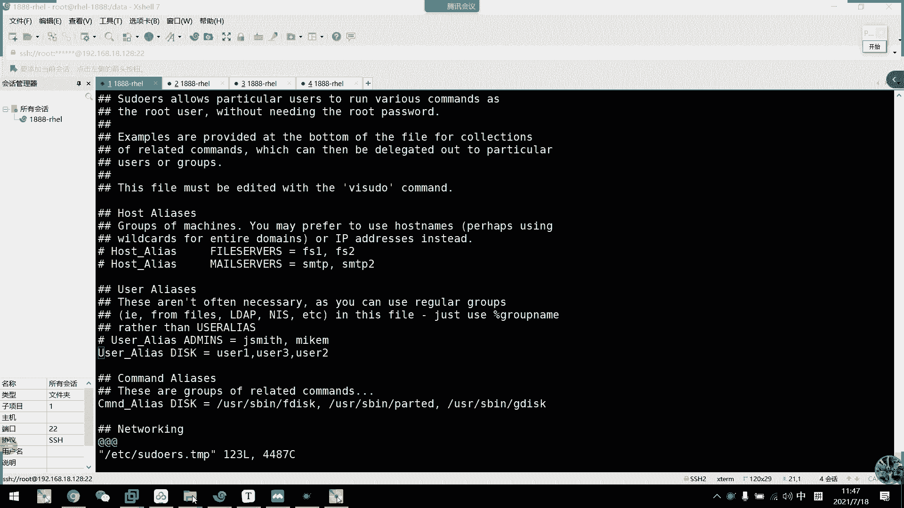
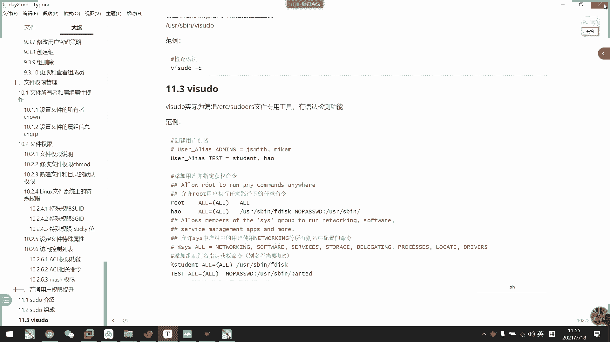

# 2021年7月新版-----RHCE8.2 RH124 RH134 RH294 认证课程 - P17：day4-2 sudo提权配置 - bili_15701050454 - BV1Gy4y1T7ug

接在我们继续完上看一下啊。啊，关于我们普通用户的一个权限提升啊，关于我们那个普通用户的权限提升啊，我们这里啊主要讲的是速度提全啊，速度提全啊，速度啊就是我们的superus度啊啊。

这就是刚刚同学们啊一位同学提到的。速度就啊以普通用户的身份临时获取到我们的啊沃头用户的权限啊。临时过来到我们。不能库的权限。然后呢。通过我们的一个root的在相关配置文件中设定好啊，它可以有什么权限啊。

或者是全部啊啊，是否需要密码啊，是否需要密码。但是注意一点是什么呢？它所谓的密码呢？是输入我们用户本身的密码，而不是输入我们root密码。如果输入root密码的话啊，我觉得这个速度已经没有必要了啊。

已经没有必要了啊，所以。他只是输入自己的密码，为什么要这样做呢？啊，他只是要记录这个身份执行啊。证明你是这个用户本本人啊啊，就是终端前的用户是本人啊。但是如果你自己个人流失了密码啊。

也是自己的一个责任啊，也是这个责任。那么我们。这个。验证过后呢啊或者是设置了无无需验证啊，反正是。相关验证过后，你可以对该。命令或者是所有命令啊，有了。执行的权限啊，可以执行。然后呢。

默认为5分钟啊默认为5分钟，5分钟后呢啊可能又要重新输入密码。如果真的是设了不需要密码的话呢啊那就。那就那就那就。啊，一直都可以使用啊。那么。我们来看一下啊，我们都有什么特性啊。

比如我们的速度呢能够授权指定用户呢，在指定主主题下运行某些命令啊。然后如果没有授权的用户才能使用速度呢，会提示会呃，需要联系管理员啊，联系管理员。要是多了提供了丰富的日志啊。

假设记录每个用户记录做了什么东西啊。所以你们如果要是度啊商户了，你就。啊，也推卸不了给别人了。啊，它会通过我们的一个服务啊，传传传到我们的日志服务器啊，或者是直接是主题主题上面的服呃的的的的日子啊。啊。

然后呢。都使用时间戳文件呢来执行类似的一个检票系统啊。然后呢，当我们。用户的调度，并且输入他的密码的时候，用户就可以获得一张。纯播期为5分钟的票啊。啊最后。有两个配置文件啊，一个是我们的tus啊ts啊。

一个是啊其实啊在一个是我们的include啊tus点D下面的配置文件，然后呢属性要为044啊，044。只有。呃，管理员可以修改他，就管理员可以修改他了。啊，0440才对，0440。然后呢。

它有一个特殊的机制啊，就是说如果我要要编辑这个stus啊啊sts，我们不需要直接修改这个文件啊，它有一个专用的工具啊，叫做VI速啊VI速度。然后他这个工具呢，我们。还提供了一个语法检测功能啊。

语法检测功能啊，也不用我们去敲任何命令啊，只是我们保存的时候，它会提醒你语法有错误啊，是否要确认要修改啊。啊，确认是呃确认是否要保存呢，还是返回修改等等啊。

啊，我们不需要去做预防检测啊。啊，比如说我现在打开一个随便打开啊。🎼这是我的吧VI速。啊，比如说我这里随便写一个。呃。就这个。比如说啊willO。Student。哦等于啊，这里不加括号。要是low。

他s。我。冒号，这里不加空格，可以的。能不能保？对。他他还告诉我语法错误啊，t克伊恩奈尔111行就大概在111啊出现错误啊。Now按一下可撤，然后是一可以继续可修改。然后呢，X。啊，可以退出。

不保存退出啊不保存退出。without saving train to snow fire，然后Q啊Q是。保存。并退出啊，本位退出啊，这里说了是危险的，语法有错误，你把它退出它是一个危险的操作。

所以我们现在回去一修改。嗯，我修改一下啊，比如说给他一个。括号。有。啊，这个保律退出了，对吗？好了，我们看一下现在st有的权限没有啊。啊。都啊我们执行啊。比如说他诶这这这这不是丢。Thatどし。

速干 studentdent。这CUEEM啊 studentdent然后呢。啊，我们现在看一下啊，执行一个F disk。改了。目前还是全程被拒绝。然后呢如果他要执行的话呢啊要使用到速度的话呢，我们就度。

加命令。都。直接不需要输密码，因为我刚才啊写了写了写了呃，写了nope word。写个都盘我。我这写的位置不对。不要写在vi主下不要写在vi主下。确这。小姐啊。我这里改一下。呃。可以给他。做哎。啊。

怎么来着？对解。所有给你啊，这也是所有给你的意思。呃，诶。啊，你看我这里就需要需要输入密码，看到没有？我先取消啊。再继证。啊，我们继续读啊，也是这个命令啊，这个命令呢啊是查看我们磁盘的。

所以它一定要有权限才能才能才能才能才能使用的才能使用的啊。这需有我们wordot用户才能使用这个。要输啊，别看我这回就是需要密码了啊，这回就需要密码了。그래요。那么我现在输student的密码。诶。

就后变成改密码了。😊，什么意思？会的。You说 for。只有输密码的意思，他这里也没有提示，为什么我要改密码？这里啊。依口我得下。最后。他说尴尬弟弟。不是。嗯。这回直接可以。诶。刚才不是这里执吗。

这里执行，然后我现在执行得了。现在只行的，他现在退然呃后面反馈给呃user，就是我们刚刚说的we的密码。哦，我先不管他了。先不管。然后呢，这个VS度还可以做什么呢？还了什么。🎼啊，我这里是orR。

是所有的意思。那么我可这样。再加一个user3。哦，这里是控制主机的啊，我们一般。按实际工知就可以了。这个可以选一下就好了。啊，把它做括号里面的改成hosse就可以了。呃，比如说no。Password。

嗯。嗯准备好了。发律走吧。系。然后。作以发到最后。加一个。哦。所以再加一个。嗯，这有有个问题。哦知道了。都系。嗯。为什么呢？哦，我知道了。是说。这里不能空格，只能再写一遍啊。63。这个应该没问题了。诶。

好有问题。No pass word。哦。我觉得不用加。就如说。就是。私が。还真的要。还真的要绝对路径啊，命令的绝对路径啊。那我现在。我要这行。把他改成逗号是不行的。那我看一下U者上啊，啊右上面有密码。

右手上面有密码。啊也给他一个位啊。那我现在啊都。F disc好不。嗯。からよ？对呀他提示我输入密码。行，刚刚。呃呃，同学说让我输入root密码，其实这里有提示了，他说2 four的us3啊。

输入us三的密码是指定用户密码。那么我们现在FD个需要密码，然后我看一下。好像取消了啊。比如说我这里呃。6一个。不是。啊，刚刚我指定了一个party的啊。快的这个命令对不对？Yeah。啊。

他没有权限是不能做的，也是permission delay看到没？permission delay。那我看一下，我给 userer商指定的不需要密码，然后其他需要密码，看一下能不能行啊。对。判决。

直接可以直接可以。看到没？不大一。打印也没问题，对不对？结说了诶。然后呢，我们在FD看一下。依然是需要密码，然后我输。呃，63的密码。那就打印出来了，然后后面又。拿到了。5分钟的票，对不对？

我到了5分钟的票啊。看一下。あから。看下行不行啊。3。不要。VIMETC下载hos。看一下能不能写。可以写的，对吧？不需要密码，我们不熟多的时候，看一下能不能写。啊，你看稍微懂你吧。

那么就是说我做其他编辑的时候啊，也不需要啊输密码，还是5分钟啊，还是5分钟。除了pali啊除了p。快点是我们指令啊，是可以的啊，出了快点。是我们指定是可以直接美密了。这的是没病。继续看一下啊。

先看一下VS度。啊，其实我们看配用文件啊，也能看懂很多东西啊。然后我们这里看啊。呃，我们user啊，我建议大家是写在user下面啊。如果是user是用户，我们就写在user这一行下面。要是主的。

我们就写在看一下有没有bllus。TheDo我。这里是说一大巴是。A those people in the group will to run。主我们就写在这里吧。坐就是在这里。

但是最后一行记得要注释掉啊，这一行把它注释掉。我们不要给will主。权限啊。因为我写在这里的话，如果是will主啊，它就相当于是我获取的will主的学校。will主它ID是很很很很很低的啊。

就是说他权限是比较高的。嗯。应该不用速吧。我们看一下标要组。这ID是1。系下。我们。那个编号越低，它权限是越高的。虽然我不知道它作用在哪里，但是他肯定有它一个相关的权限啊，所以我们啊。

把这一行给注释掉啊，通常把这一行给注释掉。啊，这是家族啊家族。比如说我现在是。注册掉了。加一个什么。呃，有所一米要加嘛，对不对？加主注意啊，先加百分号啊，加主啊。优势优势12。但是对。就是哦等于。

jo啊也是一个哦。啊，它意味着我们右手一。累的。组成员啊全都可以啊全都可以用速度啊。と？嗯。还有这个吧，但是我没有密码，再给他一个密码。那那我这些啊，你们说。它是入手的密码。

那我这一次就改一个不一样的密码。不行。因为我ro者也是外啊，你们可能会误解。把这里改成，我等一下123。主啊。我觉得。😊，你看我现在敲的是不是等一下。这不行啊。不的。对。123。这个。

所以啊这里是正式的窝。要敲的是我们用户自己的密码，用户自己的密码。他的组成员都可以啊，组成员啊，比如说我现在。五。有了速度以后很好用的？s啊UC。啊，就是艾又是呃。然后指定副加组啊。

副加组为我们的右手一组啊。快啲。有了啊。对吧有了，那么我们现在是。再给621个密码啊，也是一样的。给你说一个密码，那么我们切换到入手啊。说感。哦。好，那么我们来toF disk。看到吧有？看到没有？啊。

这是啊直接添加一个组，组列成员都有这个权限啊，组列成员都这个权限。呃。这个天加煮啊这个天加煮。百分号加主名啊，然后哦等有，所以它注释上面也有啊，就是这把这个单子放低就好了，等那个单子放进就好了。

然后下面呢放低就是啊不需要密码，所以它也注释掉了，也注册掉了。木头那个就不用管它了，我们也不要写在物子上面，也不要写物上面。啊用过时用过上么。我们先休息一下吧，等一下还有一些其他要讲。

阿克。去上课。好。啊，这里有些放例啊，大家可以看一下。发的不多。

诶。让我们来看一下刚刚。我们来做了已经做了。主啊还有用户的主，还有用户的杜权限的添加。然后呢，我们可以看配置文件啊。这他没软件。他。除了给主给用户了，还可以添加用户的别名啊，其实也是一个别名组来啊。

是一个别名组。然后呢，也可以给我们的命令进做别名啊。什么网络啊全国网络的。相关。服务的啊什么之类的啊。我们这里可以改一下写一下。比如说这里。弄一个什么了哈？呃，哎。优色。誰ですか？

然后我们也叫ADMIM吧。就ADNA嘛。啊有等于什么呢？啊，如所以。有是。给个风格吧。63。62。然后呢。Com慢这里。也给个别名啊。就说。Com慢。那です。嗯，这里写一个什么好了啊。di个嘛。啊。

di等于什么F哦，不对。找一下这个文件在哪里啊。Use spin a disk。就在这里。再来一个。规去。叫什么来着？他那。再给一个，但这个要装啊这个要装。唔问。慢的。BVSR0。挂载到我们的MMP。

这十月。嗯。然后是速 do1R杠YinstoreG地址。嗯，已经有了。图形块已经装了啊。那么我就再位取一下。You just spin。啊，这是我们啊磁盘相关的命令啊。那么我们接下来。Jia。嗯。

煮的啊在这里。我们别民啊也就在这里。啊，我刚刚叫什么呢？他的M对不对？是哦等于。然后是。什么来着？直接low pass我。nope，然后是刚刚的，别名是什么了？disk是吧，是不是dis小写还是大写。

其交哪里啊。在谁这里。就di到这里。空一下，然后把其他删掉啊，先把其他删掉。这个稍个。这个保留吧。那这刚概有吧。不这。就O。嗯。😊，2125。应该是刚刚那两行。21。啊，所以我哦这里呢。Bei。为什么？

25还有什么问题？哦，这里。21。这个大写。主机啊，刚刚不是说了吗？P post。Use。把下面的别名那里也改一下。Warning， it is as unus。这个哦不能用这个名字啊。呃。那我们就叫。

取他吧。Con出了。CD can修恩。Ci。CTOL啊。Conttroler。です。好像是有点长了像。学到。M dis吧啊理 manager的意思啊。在这里改。在里？D disk。嗯，怎么不行呢？

Unus。Use A L I A S。这名字有什么问题吗？还说不用这个。不行，就不用这个。什么问题吗？USE啊。嗯M这是狗为什么不行。Hello。有S结尾。不行啊。很奇怪，怎么改不了别名呢？

Please discuss users。是刚刚这里不匹配吗？跟di。还是不行吗。什么鬼？难道要写这里？Discus users。第四个。坏了。你用不了这个别名。然道不友把分我记得要的。对，直接注事了。

Your its New。呃，没有定义。他定义了，他又不会给我用，真的是。再这个百不号。嗰啲。这个。为什么呢？格式没错啊。US E I uses。这是右手一。6362。有问题吗？呃。看见了不？风格有啊。

1236。神奇的一批啊。空给没问题。多号峰科。嗯，这个没关系啊这个没关系。是名字不能。这样子么。嗯テ。又不行。Running。W is Alice test。就跟他是一样嘛。那为什么不行呢？

我这里是已有的用户名啊。试一下行不行吧。先试一下吧。都。对。密码输错了。那不行啊。啊奇怪哟。别名出事了啊，主机别名也可以啊，这家可以看到主机别名也可以。这格式不是E样优势。在利。嗯。

ADMIMS这是他的名字啊这个。是他的那个别名啊，要等于什么吗？他说三个用户我都有啊，都是U2U3。呵呵。😊，咁我去都可。不行。嗯。And you say you。之前都可以。我看一下。

要不要我们看一下下一期的视频？无线套啊。

我先套。看一下这里有没有。我记得我这里没有啊，有啊呀。我不对。对啊。没问题呀。为什么这里又出事？呃，ts这里不用放号吗？啊，退出不用百本号。

嗯。啊，还真的。一个月。还真的很。是不用百分号啊，是不用百分号。那我再来一遍啊。啊，应该可以了。可以了。然后是studen不行，觉得。右手3啊。我们看一下do gdi啊，当L。你一个命你的。嗯。😊。

什么意思啊？Proper opening L。哦，这个没关系啊，不他不能用杠L，应该是。他是没问题的。这个。呃，他是我Gdi的问题啊，这个不用管它啊，那我们试一下part。杜。你看没问题的没问题。啊。

还有一个useruser机啊，user2然后user24。不是里。取水机啊。61啊也是一样啊，试一下都part你的。哎我说的老us是我吗？好像是哦。我看一下我们别名啊，对，是lopeus果，你看。

那么他们执行这三个命令都不需要输输入密码啊，这是我们啊命令的别名，还有用户的别名啊。啊，那就可以做。设定一个设定页的别名组啊，设定一个别名组。当然他还有其他可以别名啊，什么，你看主机主别名也可以啊。

主机组别名。🎼啊，那个or呢就是输入这个的啊，我or就代表所有。但是我现在。集群只有这一台呀，集群只有这一台，他做不了管理啊。他说我直接输给我。啊L mini的边名啊，没有主边名啊，注意啊。

没有主边名的啊。没有租给你还有没没有9给你。O。咳。啊，即系。还可以设置默认的环境配量。呃，这个很很很少用啊，这个很少用。🎼就别名啊，命令别名比用的比较多啊，我们把它。我正都上挂。嗯。还有哪里有？

没有了啊。然后这里我这些就是不能反问的啊。这些都不能说。那么我们可以把用户啊写到文件中啊，刚刚有同学问到了啊CD啊EDC。下得do。第一个。现在是没有文件，我们写一个啊63。嗯，对。呃。63。

然后是O等于。哦。🎼然后是直接弄个lookcus word。懂啊。可下行不行？那输有啥呗。这个可以了吗？诶这已可以执行了。退出来了。啊，这就是写对应的配置文件。带下鞋主行不行啊？百分之。user一。

这是哦。等于。哦。L pass。那我们试一下右手音。看一下鞋主行不行。我真没去过。可以了，发表有。啊，我就是二的组是以入审一为附加组的啊，朋友。这就是我们的啊通过自己自定义的配置文件啊。

🎼来写那个名字不一定要叫这个，只是里面定义了就可以了。它包含的里面那啊，估计是在我们EDCdoer上面的。St。主机呀。😊，主机。所有的主机。这。看一下有没有B。To定。set dis。Quurta。

Stura ports。 Studio， S， O。套解释文件的。那是模块了。他没有在这里定义，我也不知道在哪里定义了。ちょっと？这水都注释掉了。我们也不用管。我也会吧，要不管的。我该。

你们到这个都啊里面是hos，我看一下有没有范例啊，在我们的这里，因为我也。少做了个实验。翻力也没有啊。大家可以上网找一下吧，它中间那个是代表啊主机啊，这选择主机的啊。啊，这选于主机的。

这里前面是主机主啊，然后等于哪一台主机啊。那我现在把这诶。呃，说这些没没有没有用到啊，没用到，那就把它删了。注事吧注事吧。他就不报错了，然后我们把这个里面的删掉吧。那我们这些就全部没有权限了。马上生效。

啊，这是我们的速度啊。

そ的 수도。啊，一定要知道怎么给用户提权啊。啊，我们sible后面选的sible啊，就是要用到do的啊一定要知道怎么给用户提选啊，给用户提选。对笔记放例不多啊，但是够用啊已经够用。记住啊。

我们不要写在物上面啊不要写word上面啊，写在写在Uer上面。这也看看看那个范围啊，有写啊什么user什么什么什么的，就写了，那你下面一个以，其实这样写没问题。但不太好啊。我们我们按照他他给我们分类了。

我们就分类啊，他给我们分类了，我们就分类了。那我是都讲完了啊。

