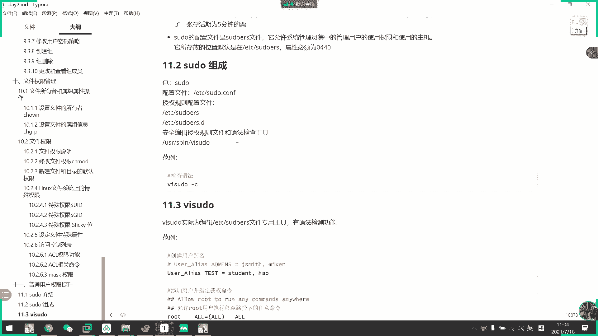
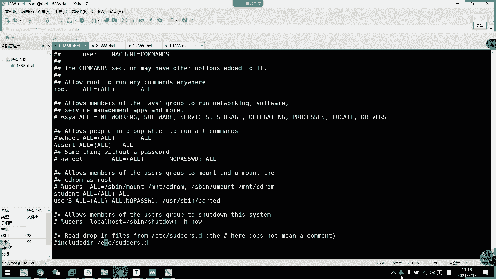
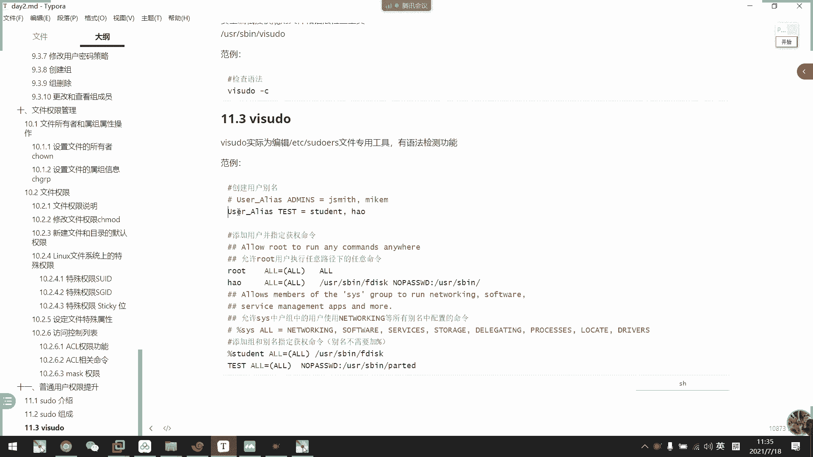
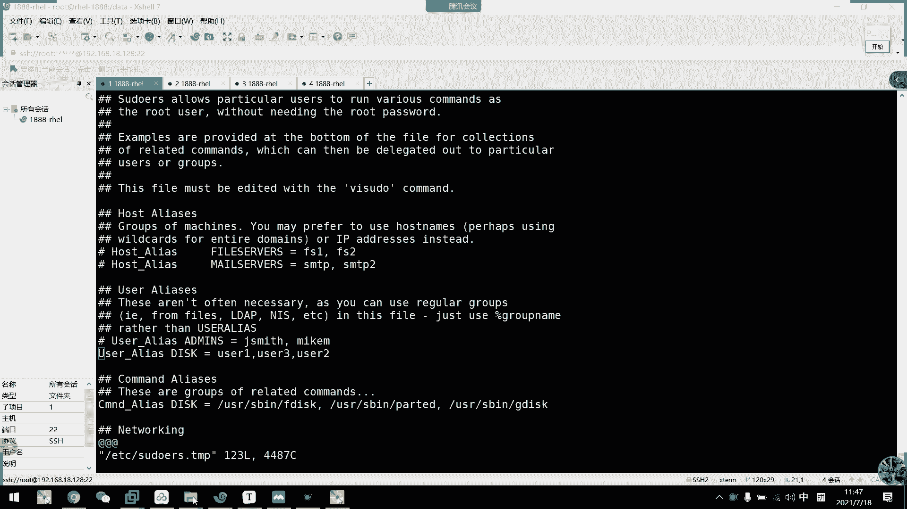
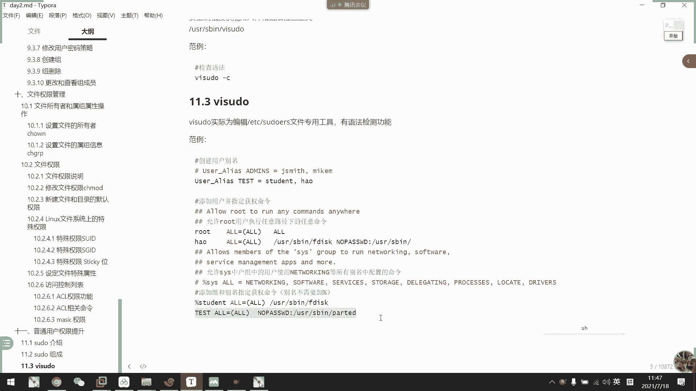
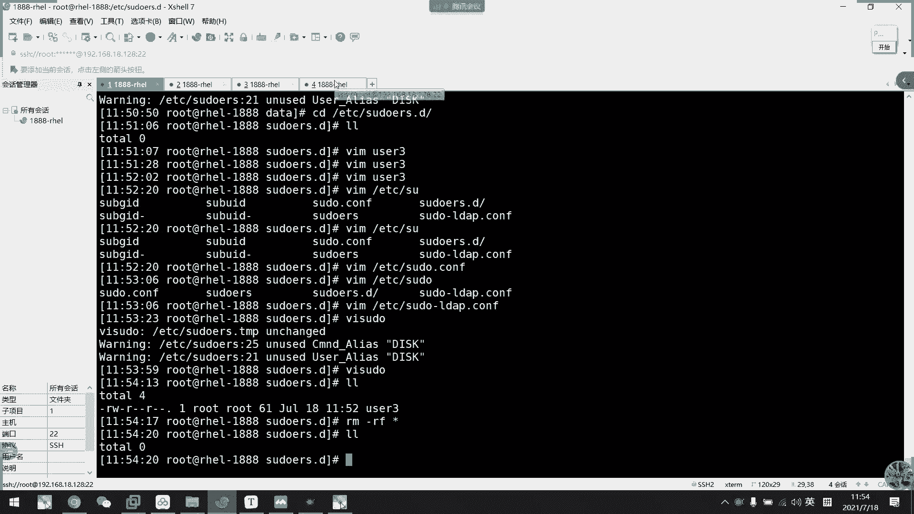
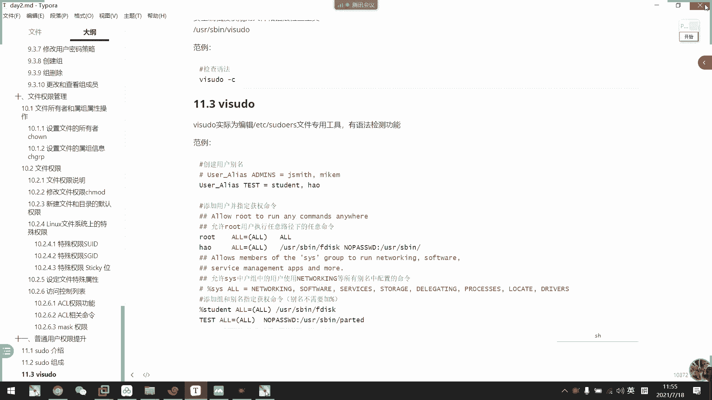
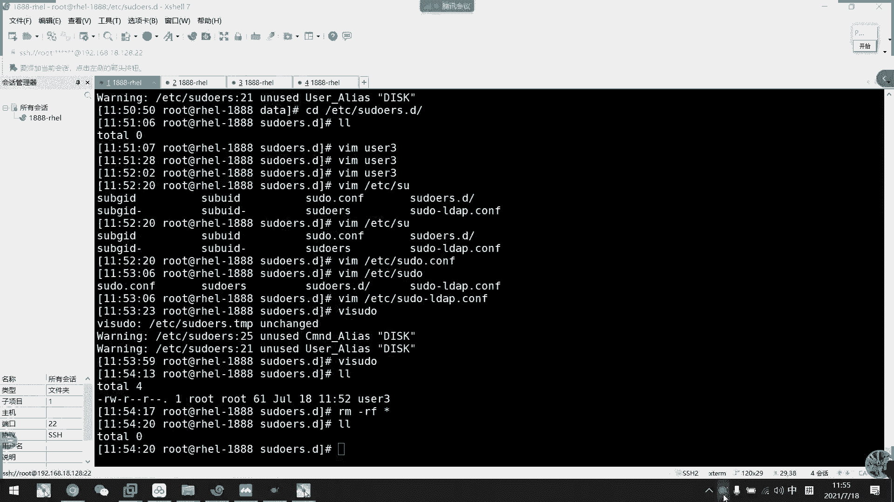

# RHCE认证课程：P17：sudo提权配置 🔧

在本节课中，我们将要学习如何通过配置 `sudo` 命令，为普通用户授予临时的管理员权限。这是一种安全且可控的权限提升方式，能够记录用户的操作，并允许管理员精确控制用户可以执行的命令。

---

## 什么是sudo？🔑

上一节我们介绍了权限管理的基本概念，本节中我们来看看 `sudo` 这个核心工具。`sudo` 的全称是 “superuser do”，它允许普通用户以 `root` 用户或其他用户的身份临时执行命令。

它的核心特性包括：
*   **临时提权**：用户执行命令时临时获得更高权限，默认有效期为 **5分钟**。
*   **密码验证**：通常需要输入**用户自己的密码**进行验证，而非 `root` 密码，以此确认是用户本人操作。
*   **精细控制**：管理员可以在配置文件中精确指定哪个用户、在哪个主机上、可以以谁的身份、运行哪些命令。
*   **完整日志**：所有 `sudo` 操作都会被记录，便于审计和追溯。



---

## sudo的配置文件与编辑工具 📝

`sudo` 的配置主要通过 `/etc/sudoers` 文件及其包含的 `/etc/sudoers.d/` 目录下的文件实现。这些文件的权限必须为 **0440**，确保只有 `root` 用户可以修改。

**重要**：不要直接使用普通文本编辑器（如 `vi`）修改 `/etc/sudoers` 文件，因为语法错误可能导致所有用户无法使用 `sudo`。必须使用专用的 `visudo` 命令进行编辑。

`visudo` 工具会在保存时自动检查语法。如果发现错误，它会阻止保存并提示你修改，这是一个重要的安全机制。

```bash
# 使用 visudo 编辑配置文件
sudo visudo
```

---

## 如何配置sudo权限 ⚙️

了解了基本概念和工具后，我们来看看如何具体配置。`/etc/sudoers` 文件中的基本配置格式如下：

```
用户或用户组 主机=(以谁的身份) 可执行的命令 [NOPASSWD:]
```

以下是配置时常用的几种语法示例：

**1. 授予单个用户所有权限（需要密码）**
```
student    ALL=(ALL)       ALL
```
这条规则允许 `student` 用户在任何主机上，以任何用户（包括 `root`）的身份，执行任何命令。执行命令前需要输入 `student` 自己的密码。

**2. 授予单个用户所有权限（无需密码）**
```
user3      ALL=(ALL)       NOPASSWD: ALL
```
这条规则允许 `user3` 用户在任何主机上，以任何用户的身份，执行任何命令，且**不需要输入密码**。

**3. 授予用户组所有成员权限**
```
%wheel     ALL=(ALL)       ALL
```
这条规则允许属于 `wheel` 用户组的所有成员，在任何主机上，以任何用户的身份，执行任何命令。配置组时，组名前需要加 `%` 符号。

**4. 授予用户执行特定命令的权限**
```
user2      ALL=(ALL)       /usr/sbin/fdisk
```
这条规则允许 `user2` 用户在任何主机上，以任何用户的身份，执行 `/usr/sbin/fdisk` 这一特定命令。命令必须使用**绝对路径**。





---

## 使用别名进行高级配置 🏷️

为了更清晰地管理大量用户或命令，`sudo` 支持使用别名。常见的别名有：用户别名 (`User_Alias`)、主机别名 (`Host_Alias`)、命令别名 (`Cmnd_Alias`) 和运行身份别名 (`Runas_Alias`)。

以下是配置别名的步骤：

1.  **定义用户别名和命令别名**：在 `/etc/sudoers` 文件中，可以定义别名组。
    ```
    User_Alias      ADMINS = user2, user3
    Cmnd_Alias      DISK_CMDS = /usr/sbin/fdisk, /usr/sbin/parted
    ```

2.  **应用别名进行授权**：使用定义好的别名来简化授权规则。
    ```
    ADMINS          ALL=(ALL)       NOPASSWD: DISK_CMDS
    ```
    这条规则表示 `ADMINS` 别名下的所有用户 (`user2`, `user3`)，可以在任何主机上，以任何用户的身份，无需密码地执行 `DISK_CMDS` 别名下的所有磁盘管理命令。

---

## 使用/etc/sudoers.d/目录管理配置 📁



除了直接修改主配置文件，更推荐的做法是在 `/etc/sudoers.d/` 目录下为不同的用户或用途创建独立的配置文件。这种方法更模块化，也更容易管理。



例如，为 `user3` 创建一个专属的提权文件：

```bash
# 1. 创建并编辑配置文件
sudo visudo -f /etc/sudoers.d/user3-privileges

# 2. 在文件中写入规则，例如：
user3 ALL=(ALL) NOPASSWD: ALL

# 3. 保存退出。visudo 会自动检查这个独立文件的语法。
```
创建在 `sudoers.d` 目录下的文件同样会被 `sudo` 读取并生效，且文件权限会自动设置为正确的值。

---

## 总结与最佳实践 ✅

本节课中我们一起学习了 `sudo` 提权配置的核心知识。我们来回顾一下重点：



1.  **核心目的**：`sudo` 用于安全、可控地提升普通用户权限，并记录操作日志。
2.  **配置工具**：必须使用 `visudo` 命令来编辑 `sudo` 相关配置，以防止语法错误。
3.  **配置方法**：
    *   可以直接在 `/etc/sudoers` 文件中为用户、用户组授权。
    *   可以使用 `User_Alias`, `Cmnd_Alias` 等别名来简化管理。
    *   推荐在 `/etc/sudoers.d/` 目录下创建独立的配置文件。
4.  **安全准则**：
    *   **避免使用 `ALL=(ALL) NOPASSWD: ALL`** 这种过于宽松的授权，应遵循最小权限原则。
    *   命令必须使用**绝对路径**。
    *   不要轻易配置 `NOPASSWD`（无需密码），除非有充分的理由。
    *   默认的 `wheel` 组权限行通常被注释，如需使用请谨慎评估。





掌握 `sudo` 的配置是系统管理员的基本功，也是在后续学习 Ansible 等自动化工具时管理权限的基础。请务必理解每条规则的含义，并在实验环境中多加练习。