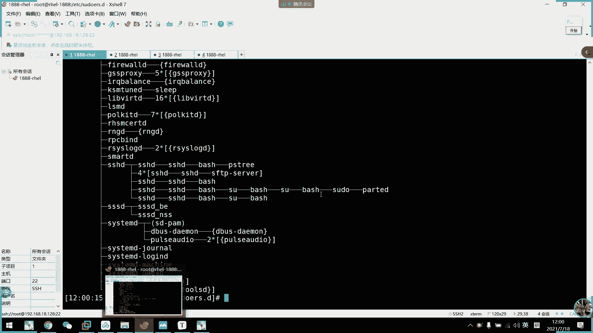

# 2021年7月新版-----RHCE8.2 RH124 RH134 RH294 认证课程 - P18：day4-3 进程介绍 - bili_15701050454 - BV1Gy4y1T7ug

好，那，我们直接开始学习进程了。半个小时的话，我们先了解一下什么叫进程就好了啊。啊，首先。看一下什么叫进程啊啊进程我们英文叫pos啊啊。不es啊。然后呢，它是在运行中的程序的一个副本啊。

是被载入内存的一个指令集合，是智能分配的一个单位啊，智能分配的一个单位。然后呢，我们进程主要要了解到的一个是进程的ID啊，进程ID。然后呢，这个ID呢是被标记各个进程的啊。用来标记割个镜子。

然后呢啊相关业用IDGID还有我们SClinux的一个语境决定了文件系统的一个存储和访问权限。紧接着是我们通常从执行进程的用户来计承。通常。为什么说同学？我们刚刚不是遇到了一个呃SUID嘛，对不对？

然后进程存在生命周期啊，就是说我打开。好啊，我打开一个进程。

它就会运行着啊，比如说我拼百度啊。然后呢，我们这里。

呃，PS。啊，就可以看到这个。就可以看到这个。拼的程序在这里一直在运行着。然后呢，当我把它给结束掉。我们看一下是这个是4347啊。呀设时器啊，包括P啊，已经没有了已经没有了啊，这就是。

所谓的生命周期啊，它存在着啊生命周期性。只要我退出了，它就死了，相当于是死亡啊，相当于是死亡好。

紧接着啊我们的一个关于进程的创建啊，首先。我们的系统。呃，vi7以前啊它是由in去控制的，in的去控制的啊，in是我们呃vi6前面的第一个进程它。开始改进了我们的系统开机以后的一个呃竞争并发啊。

所以开机速度有所提升啊，可开速度有提有所有所提升。但是呢它依然不是说。是唯一进程的唯一进程。就是不是所有程序啊，没有不是所有进程的守候进程。所以呢。也有可能我们先开一个硬的。就是说可能啊Iin的。

然后呢。它可以控制的好几个子禁程。直径乘一啊直径乘2。资金整散同时开启。但是呢。他可能有其他进程啊，比比如说pro3，然后呢，它又依赖于这个紫进城商，要等紫禁神商开启来了，他才可以开开启这一个。然后呢。

它也控制着啊，还有几个进程的。然后一个进程的。呃，并并行。啊，所以呢他就需要等待啊，虽然他改进了这一个东西啊，但是他依然可能啊有一些。并行性啊需要优化。但是除了呃但是到期里以后呢，我们就把。🤧咳。

第一个进程啊就改成我们是等地啊，它控制了所有子进程的并发性啊啊并行性啊。我们可以看一下啊PSS区啊。

我可以看一下，你看我这里第一个进的就是C冷兵啊。它就是我们进程的根啊进程的根。没有跟他是同一个级别的啊，所以。这样子呢我们可以系统它有更好的一个并行性啊，而且不会浪费太多的资源。

也不需要啊说等待太多呃呃等等待等待IO啊，等待一些GIO。啊，所以我们啊从七八那个开机就快很多了啊快很多了。

O。然后呢，我们进程的一个特性啊，是由我们的一个附进城来创建的啊，这个是我们的一个fork函数啊，就是由fok函数来控制的进程的一个启用啊。然后呢进程存在着父子关系。

父子关系之间呢啊有一个叫做写实复制的机制啊，写实复制的机制。什么叫写实复制的机制呢？啊，首先我们了解一下进程了。呃，这个呢从我们的弗洛伊曼体系说起啊。很多疑问で。啊，服摸联网体系说起啊。

首先是我们的一个。IO设备。L后4到内存。然后呢，这里是。CP u 啊。CPU当我内存啊给他一个计算集合啊，呃计算集合或者是指令。由CPU计送完以后呢，反馈给我们的内存。然后内存呢再给到硬盘。

输出啊这个输出设备啊也是IO版。他他的一个过程是这样子的。所以呢当我们。要新建一个指令就的时候，就在这个指令啊，下面再开一个指令，对不对？再开一个指令。从这个体系说起来啊，它是需要获取啊。

就是我们把它丢到丢到这里去。首先从IO开始啊，从IO开始，那么它要变成一个进程啊，那我是不是需要。这个只难说啊，里面还有一个叫做寄存器的东西啊，寄存器或者缓存器啊，寄存器。

🤧这个是用于等待的啊用来等待啊等待。所以先到计算器呃，然后再到CPU的。所以到CPU占满的时候呢，它就不能直接执行啊，会放在计算器中或者收款人去用。然后呢。😊，我们只营呃，首先是一个进程。

先说一个进程寄录过来他这个。他这个他这个这个这个状态啊是要等待，是不是要等待内存资源内存资源啊，还有我们的CPU资源啊，CPU资源啊，只要。我们CPU跟内存呢释放到资源给他以后呢。

它才可以进入到我们的一个运算当中啊，就是运行起来了，就是运行起来，所以有资源了。但是运行起来以后呢，它里面还要创建一个新的指禁程啊，新的子禁程。那是不是它又要获取内存？还有CPU空间啊，是不是有资源啊。

是不是也要获取这两个资源，那么他又要等待了啊又要等待。所以呢。你要创建一个新的指令层。他一开始啊CPU是无法给你直接分配啊，直接分配资源的啊，CPU跟内存无法直接给你分配资源啊，他会给你一个显示复制。

就按照你负进程。申请的那个资源。我再复制一份给你啊再复制一份给你，我不知道你要多少吧，我就按照你的附近层。🤧的一个状态啊，直接给你相同的啊给你相同的。然后呢。把执行层运行起来。

然后在当CPU有多域的资源空闲给他的时候呢，他又释放出来，把相对的资源分给给我们的负印，或者是把它分给给我们内存或者CPU啊，这要显示复制啊，这个比较底层的，我们不理解没关系啊。啊，说实话。

我们运维起来可能都不会管进程到底有多少啊，是不是啊不会不会不会太太过在意他。的一个内容占用占用率，还有CPU的资源使用率啊，可能不会太在意。只有当我们开始到到CPU资源100%的时候。

可能会看一下为什么会死机，是不是不会在意这个底层到底是逻辑是什么。但是我们还是要了解一下，这个是计算机寄出来的。好。有了。进程啊是通过一个静态的程序触发的，然后静态的程序变成一个动态的程序啊。

就好比如啊我们刚才这个pin啊这个pin我们。

微许一下。你看其实它是一个静态的文件，对不对？他只是一个5个。这个他就是一个文件而已。这是一个文件。然后呢。文件肯定是静态了，对不对？我们执行起来，它就变成一个动态了嘛，对不对？把它执行起来。

那那么他就变成个动态了。这就是所谓的进程动态。我们这里可能看不出来什么东西啊，我们可能看不出来什么东西。

那么我们就返回到我们最熟悉的windows上面啊。打开任户放动器啊。然后。呃，实案信息。那我这里。写的明明白白啊，进城啊写的明明白白啊。就这进程。有了我们就可以看到。我所有的程序都是静态的，对不对啊。

所有的所所都是静态的。你看。就算我百度它不动了。不用了。啊，他依然有时候还会有1%的啊资源占用率啊，资源占用率。而且它是所有的直径层，真正的都是占用了内存空间的啊，占用了内存的。他没有跑，他就。

静态的环境下呢可能就是说。也不是静态的环境，就是他不怎么跑，就不怎么用它的时候，他可能会进行一个呃会转入到一个叫做停止态或者睡眠态的那些状态啊，导致它CPU利用率比较少。但是刚刚我们也看到了，有0。

1呃0。2，对不对啊，证明它还是会保持着运行状态啊，态，所以它还是一个动态的，然后我们这个录屏就更加不用说了啊，一直在动啊。因为我一直在录屏，对不对？有了。他们的打开的工具啊都是静态的文件，对不对？

啊，比如说我现在打开1个CND控作台。

啊，命令给师傅，你看马上就多出来一个，然后一连上。

没有了。我们打开它啊，它就一个窗口，因为是虚拟化啊肯定有一个紫进程啊，虚拟出来的东西啊，肯定有个紫进程。

然了我们再拼百度。

他又多了一个指命令。直金转，又多了个直金。哎哦，对。

他平时是不会。这个问题还在吃水平了。

你看但是他这个动作啊对CPU来说，它占用的不多啊。可能我的CPU太牛啊，这个要看CPU性能啊，我倒也不是很很好，就4700而已，1700啊，但是拼的话真的不太占用啊。

所以它说实话就没有太大的啊CPU资源稍好啊。就不会需要你太多的师歌资源。

对他一直在动。那么我们拼这个命令。它不就是一个静态的嘛啊一样是静态的，包括我们这个框啊，包括我们这个框。

呃。嗯。对，我们命令提示服其实呃这个CND其实也就是一个静态文器，对不对？啊，所以我运气起来就变成一个动态的竞展啊，就这样的意思。啊了其实啊拿lin说可能说不清楚啊，一看windows啊，我们就了解了。

对不对？嗯。系统底层啊都是一样的，有进程啊都是由进程过来的。这里发译跟我刚才说的是一致的。然了我们可以。看一下啊进程，我们一般来统计什么统计什么东西呢？一个是。CPU。我们看下CPU。啊。

首先是CPU它一直在跳动，就是它呃windows做的一个优化就就是一个CPU的使动态啊，使用动态的一个波浪图。哦，当然我们inux也有啊，inux也有啊，比如说一些。监控有这个比如jaPS啊。

他都可以做成这样子。然后呢，我们主要还是要注意一下利用率啊，然后是它的一个速率啊。啊，把最主要的是一个进程的数量，进程的数量。这个数量。啊，包括我们的一个县城啊县城县城的话，我们这里不怎么提啊。

不怎么提，主要还是进城。要款的这个我就不说了，啊我什么款就那么差的。😀呵呵呵。😊，啊，O。😊，往下走，那么。我们。为ows统计这些数啊，特别所有这些东西，那么lininux肯定也要给统计这些东西。

对不对？

所以我们有一个呃类似的一个。

类似于用户管理器的一个页面叫做top啊，叫top。这是一个文本的动态中断叫。

这是他动态啊呃一直在刷新的，看到没有？诶，再说新的。啊，有在说醒的。注意他已在跳了，那个时间也在跳了。靠。然后呢，这里啊有一些其他信息啊，什么CPU利用率啊。啊，什么总共有多少个进争。

你看啊总共271个嘛，然后多少个在运行中啊，多少个在睡眠态多少个停止，多少个僵死啊。啊，然后这个是CPU什么5秒15秒啊，5秒1515秒忘记了。的一个负载情况啊，登录了多少个终端啊。

你看4个入手登录进来了嘛，对不对？哎后开机了多少个时间啊，多少个小时啊，3个小时都。有这里啊是内存，然后下面是我们的加换分区。🤧咳。啊，都是一目了然的。然后上面的这些都是进程的，上面都是进程。

可以通过法案件可以翻译一下进程。但是也不需要注意太多，这是动态的它一直会跳动的。我们往后面会详细讲一下这个top啊。

继续往下。这个也是一个方言也是一样的。跟我刚刚说的，其实用拼用拼来表达是一样的好。赢了。😊，第二个我们要注意一下，进行的拥入制啊，进入拥入者。进程啊，在读取或者写入文件的时候呢，是采用这种。

用用者身份的读取和写入的。所以针对于需要读取和写入这个用入者必须要有权限啊。所以只就是我们的一个自体权限，自行权限就除了SUID除了SUID。啊，所以呢突常情况下呢，我们竞争的拥有者就是执行者。比如说。

不行。脚本是不行的。呃试过的脚文是不行。

因为脚本它预习那个脚本以后呢，它是以那个。里面的东西呀。比如我这里写1个PDS群，我看一下吧，好吧。哎。直接啊PW点CM。啊，然后是鞋H mode。呃，A加X所有人都能支出来。嗯，哎。

写说未知19啊191919。诶以。分享啊这个品啊，大大家都有自意表钱，对不对？然后呢，我这里就执行一下啊。啊，然后我们注意一下进程。哦，那就还是有的有的3。完了。那就没问题了，那就没问题。那还好。啊。

就是谁执行啊，那个竞争属于谁了，就除了我们的pas啊，pas比较特别啊，pas比较特别啊，它有SUID对不对啊，它有SUID。

ok然后呢。所以呢我们很多服务啊。他通常那个进程的拥入者啊都会在配置文件中指定啊为该服务的一个系统用户啊啊，所以我们很多服务啊用编辑安装的时候呢，我们需要安装啊，是需需要需要新建一个指定的用户啊。

跟他的一个相匹配啊相匹配。不然的话这个进程就啊这个这个这个。服务就用不了了。啊，刚才说的GUID。这个是注意到他的一个啊竞争的拥用者的一个相关概念啊。然后呢，进的资源占用量，我们刚才说了就百分之多少啊。

百分号memory啊就是内存的，然后是百分号CPU就是CPU的占用量啊，内存的用量和CPU占用量啊，就这两个形式了就一下就可以了。好。然让我们来了解一下啊，竞天的状态啊，首先这是我们。呃。

内存呃不进程的一开始的第一种。啊，概念状态啊概念状态。啊，它是以这个为模板一直优化下去的啊，一直扩展下去。首先是刚刚说的啊，创建就说我要申请。啊，就我IO设备删内存啊。可呃CPU。啊。

内存发生个啊像内存发生个指令，然后指令呢到了CPU那么这这个这个状态嘛，对不对啊，得到了CPU的许可以后呢，它就会进入一个旧绪态啊，就是说到了寄存器或者是款存器啊。捐几或者是朋友区，就等待吧。啊。

等待CPU跟内存分布资源给他啊，一旦分配完成了，他就会CPU就会进行调度啊。进行调度调度以后呢就会执行，执行以后就会释放终止啊，就好像我们的windows里面的拼啊，我们windows拼不设定它的话呢。

就它就拼4次嘛，4配就结束嘛。从开始到结束。这个是我们没有定义的，它就会自动结束啊。然后呢，如果有一些持续运行的进程呢。持续运行的进程，它是一直是这样子的啊，创建许可，然后有资源，然后它执行啊。

它是这样子的，他它持续进行啊12有个队列啊，345这样子啊，当然这个队列呢依然包括了其他啊，比如说我这个是运行一个bech啊，这个是运行一个拼啊。然后这个也是拼的啊，就同一个程啊同一个程序。

因为我拼啊在列个中，我们拼是一直拼下去的嘛，对不对？所以它有一个队联，比如说我这个bech执行完了，直接终止。然后。啊，这里再差差一点啊啊，然后我就拼了拼拼拼啊，拼，然后调度啊。

它的时间片用完了就要又要回到技术态等待资源的分配。等到资源分配下来了，就三这个也运行结束了，把资源释放了，他四就扩得资源，那就持需执行啊，一直等到他执行结束为止。啊，这个是我们的一个呃。呃。

时间片的一个准确度啊，然后。还有一个主塞肽啊还有一个主塞肽。对吧。执行到一半的时候。呃，需要等待系统IO。死。就特定的。说比如说我要开启一个服务啊。开始一个服务，比如说我要开启一个。叫什么号？

我不要这什么好。这一个服务。不要简单说。举个例子，我也不知道讲什么好了，就就说我有一个服务啊。servicevic。So， we see Y。他在执行过程中。他有很多个步骤嘛啊他有很很多个步骤嘛。

然后呢。它要依赖于SVC2启用了。他给他自呃给他一些特定的东西，就有依赖啊，所谓的依赖。它依赖于SVC2。那么他如果是123455个步骤起来，然后他1二都不需要依赖。第三个就是依赖于S呃SVC2。

那么他要这再来这里啊到这里。呃，时间费用完一次两次，然后他就等待IO就进行一个主塞态。然后呢又要等待我们的SVC2的创建啊SVC2的创建。然后SVC2也一直在等待支援我，对不对？当他有资源了以后呢。

执行执行呢，那么就激活了它的一个条件嘛。把IO给他，然后IO完成了IO完成。然后就呃我们的SVC又回到就业态，等待支援，资源来了他就执行，然后服务就启动了。这就是我们的一个进程的基本状态啊啊。

这里可以啊有一些文字表识啊。文件表示。大家可以回头看一下回头看一下。啊，然后呢。刚刚说的这些啊都是我们的一个进争的基本状态。后面啊有更多的状态啊，也是从这个图衍生出来的啊。

比如说运型态运态呢就是它掉落完成在执行过程中啊，一就执行过程。的状态。从执行到执行结束啊，就像是运行态。然后呢睡眠态分为两种，还有是可以中断的啊，就是我们可以发一个信号，它。这读的呃。

等待时间片那个就叫做啊这就是它就叫做睡眠嘛啊叫做睡眠嘛。啊，然后他就有两种状态，一种是可以啊，或者是他等待等待IO的时候，也也也也叫也叫睡眠态的，也也有一个睡眠态的啊，就是他这种。不可中断的啊。

就是肯定它肯定是一个阻塞啊，肯定是一个阻塞。他要一直一直在等待IO请求，而且我还不能手动停止它啊，不能手动停止它，只能等待那个IO请求。完成啊，它才会进入运行啊进入运行。啊，就叫睡眠台啊，这就叫睡眠它。

要是停止它啊，暂停在内内存不会被被调度啊啊，除非除非我去手动去把它经行起来。啊，最后是一个僵尸态僵尸态啊，这个就比较。呃，这个是比较特殊的一个状态啊，特殊啊比较透时的一个状态。啊，我们。它是这样子的。

我们正常的一个进程状态是怎么样的呢？呃，首先是我这里开了一个副进程，对不对？负进程，1后附进城开了个子进程。星神。然后指行层结束以后呢。责任结束，他要把资源。

释放给CPU那么这个资源是由我们附近城市回收的啊。就我们附近也是回以收的。那么加热赛出现什么呢？我指禁城结束之前，附进城已经挂掉了。啊，复议声已经挂掉了。那么。🤧。我紫禁城结束以后，就没有人给他收尸啊。

然后死而不僵，那不就成了僵尸嘛，对不对啊？是不是法律也是规定啊，家属去收尸嘛，对不对？啊，他就是这样子的。那么我们可以看一下。江苏赛其实也不是说特别。异常的状态啊，其实我们也可以不管它。

因为他一点资源都不会占用啊，不会占资源不会占用资源，可以不管它啊。但是如果看着不舒服的话，想干掉它啊，还是可以干掉的。

啊，比如说我们来演示一下怎么来获取一个僵尸态啊。啊，比如说我这里。先退出吧。还是回到路吧。呃，多余的也关掉了。啊，其实不关也行，我们来。看一下PSP。我看一下现在有多少啊，应该有4个SSD下的俊展。

有4个。CCD4个。是没准，但是有个负载负载。如果复杂了，看试试哪一个啊，是这一个啊。对吧？OK那么这个进点就没有了。俾你个少。啊，左右边有三个了。F。So。奇怪。我关一下吧。不不好看。这个就关掉。

不需要。啊，就留有一个去看近者，一个去做操作嘛。呃呃。先看一下呃这个IP。剩下你一个两个背血嘛，对不对？两个背血。我们主要注意bes就可以了。be鼠。啊，be就是我们现在的啊笑消笑嘛。

所以它命令行中端是依赖于我们的笑啊，所以是be。啊，我们看一下我当前在哪一个，我们有一个内置啊，所内置变的叫bshPID啊。啊，可以看到我现在当前这个终端是28呃2528啊，2585255。

那么我们这个就是23212312嘛，对不对？232，那我们就在这个继续往下啊，那么我现在开启一个pat进程啊，我直接敲一个背选，就可以开着一个新的pat水进程，看到没有？呃。

比如说我这里继续一个PS区啊。一个。给你看一下，你看本来是2585嘛，然后下面有个指金线叫做呃。4677对不对？然后4677，我现在来拼百度。

啊，苹板络C为，然后我们这边PS7。From you。

那么这是不是啊我们拼的附进城啊，然后这个贝水也是这个贝的附进城，对不对？这。这是它呃的一个就这4677的直径绳啊，这个是4703，就是我们4467的直径绳。那么我现在先把这个呃给停止掉停止掉。

比如说Q杠19吧，应该是。4677。对等一下啊，PS。

看下他状态啊，4699。是不是4699，我忘了。那个be停止了，sbe停止了。就是他附近的亭子。但是他那个直接还是在运行着，我看下。刚看是多少来着。4677，对不对？我记得是44677，应该是4677。

啊，对，四的信息啊，我看一下四的信息现在现在什么状态啊。来4677。

啊，原后是T啊T我们刚才说的是停止台。T一定要注意啊。我们看到S不是stop。不是stop，不是停止他，他是睡眠他的实力吧。还有一个呃低D滴，我忘记什么低的低的那个状态，是这是我不可中断的状态啊。

然后运行是R啊，运行是R。T的它是T啊T。我刚刚把它锁停止啊，那个Q啊，也不用担心，我们后面会讲，我们没讲到信号。但是我现在是手动把它提示掉。然后我现在杀死几一层啊，杀死几个层。

呃。直接结束。啊，还解束不了，看到没？还接束不了呃，那我直接也是用Q啊。Q。多少47。

听楚了没有？听歌Q了。而且。中东可以示放出来了。然后呢我们看一下它的状态。

对。正常我们Q掉，它镜程就要释放出来。然后呢他现在没有人给他收尸啊，没有给他收尸。就僵持在这里了。啊将在这个非成以线江时台。对以你先僵速它。好，那么我们现在来把belash恢复啊。就是说他可能。

比如说还是刚才那个例子，刚才说了啊。啊，儿子死了，父亲收尸，对不对？儿子死了，父亲收尸，那父亲来不了，他就会死而不僵啊，成为僵尸了。啊，可能是他爸进医院的啊，就所谓的停止进医院了。

那么我先恢复他Q杠18。4677。啊，之前你看这里还有个叹号，看到没？有消息到看看什么消息。

删除删除的意思啊。然了我们再看一下进展。4677应该在，但是我们的。

呃，P已经没有了，看到没有？増やし。啊。那个终端也挂掉了。呃，PS。对不对？那个中到一把的了。

就这样啊，姜子太。

啊，这个只是一个演色江速态的。也教是他的一个。啊，两个方法杀死附近城也可以啊。把他两个都杀死了，然然后让他爷爷过来收拾啊，让他爷爷过来收拾，对不对？就这个意思啊，让爷爷过来收拾。这个规矩可以看一下。啊。

那么我们上午啊先介绍到这里啊，我们下午就开始讲那些呃进程相关的一些工具啊。查看进行的一个相关工具啊OK我们下午就先在讲到这里啊。

O。

