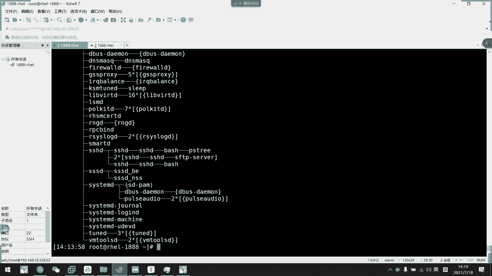
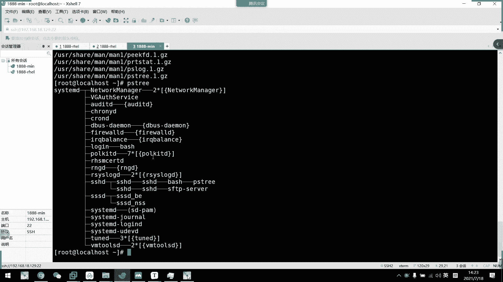
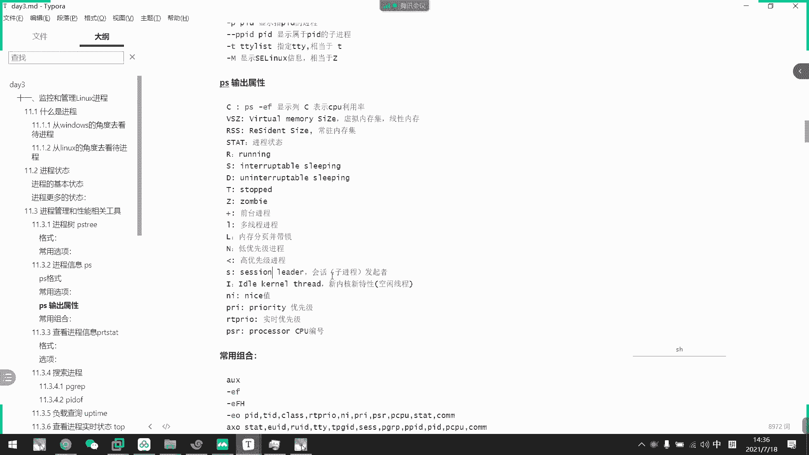
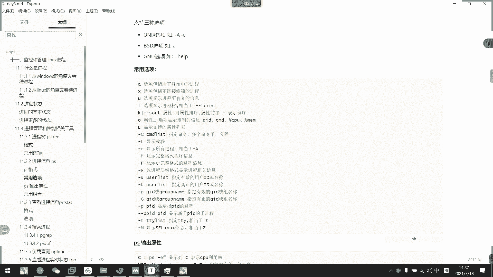
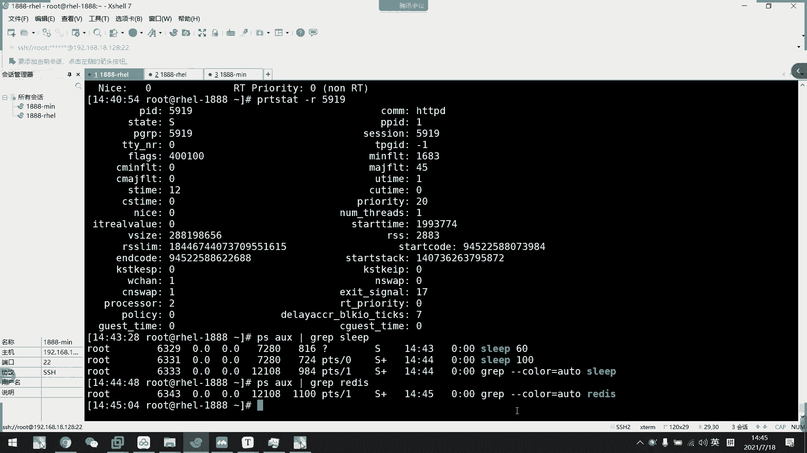
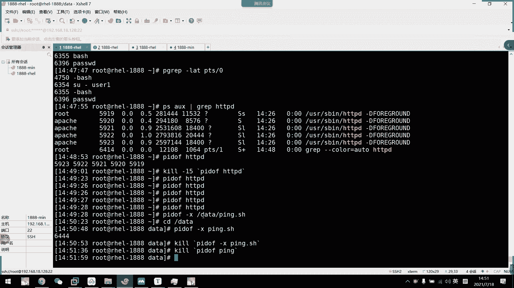
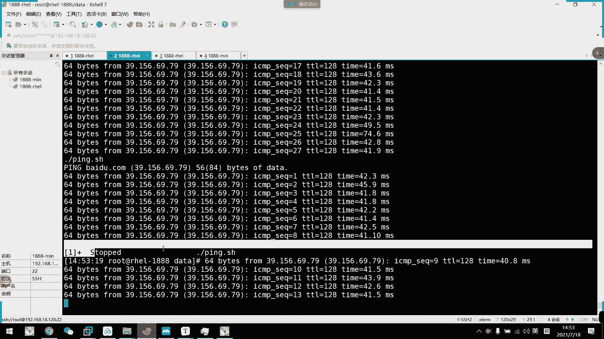
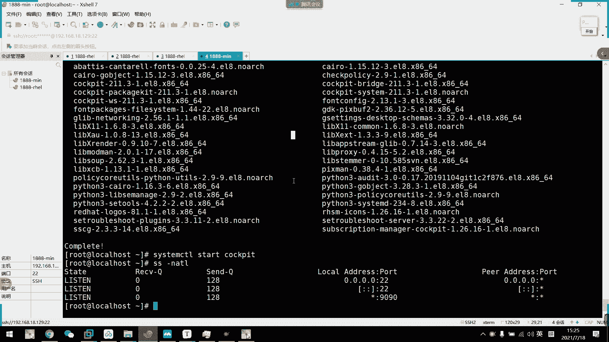

# 2021年7月新版-----RHCE8.2 RH124 RH134 RH294 认证课程 - P19：day4-4 进程管理工具以及cockpit - bili_15701050454 - BV1Gy4y1T7ug

好，先回顾一下昨呃早上的内容啊。

我看一下。第四天的啊。啊，第四天。上午。So。咱们主要讲了一下特殊。权限位啊。然后是。权限。关定。你笑。隐城。诶。确定。现长。权限。呃，然后还有呃。普通用户。提全。主要是。进城的。介绍。

这个权现会有什么呢？啊，有我们的SUID。啊，SGID。啊，还有我们的ticket。怎么拼啊？Yes。7。是威。是不是细。应该差不多。O看瞄一眼瞄一眼。

呃，叫什么来着？Stick it。Sticky。

嗯。是。STICKY啊没错啊。S T I C， K Y hell。啊，这个就不多说了。直接是。呃，数字法。对。U加S吧。U加S，然后是数字返围2。啊。我是六刚刚干嘛。好，然后SGID就是G加S。

然后输入法是2，看看看。是不是多了一个？啊，多了一个。好，sticky啊是O加T啊O加T。是一刚刚杠啊说字法好，OK语音出线。有A和I。查看。现开始啊LATDR。然后是。设置。CHADD。TT2。是。

加A或者加I。然后呢，A。不能删除，不能。移动。不能。编辑。可以追加。啊，哎。不能删除。不能移动。不能编辑。不能追加。O。然后是全限管理SL啊。好。查看文件的是否。配次。A。我们的。Se啊不。

Gap FACR吧。然后呢，设置。A些。这是我们的set。FA。嗯，然后是杠Lmod，然后是。放例子。邮吧。哟要是有森那啊。要后是权限啊啊，看看在这。表食翻。或者是里边隔壁啊。🤧好，然后呢。嗯。

说了写一下。复实一下。G。group那个。然后还有呃musask。我是个族。手动。配置。マスク？那么。呃，其他。这是要。嗯。权限高于musk。权限。则会。被遮挡。啊，如果手动配置ACL。权限。教于。

マスク。则。まスか？可。呃，自动。提高。マスク。1是速度啊。So。提全。我们主要是呃。配置。っと。工具。啊，是我们的VI50度啊VS度。啊，这个工具呢。VI store啊。具有语法。检测功能。是。更改。

E t c。と？工具。否则。嗯。该文件。权限。不足以。劳动修改。都编辑吧。呃被诉。被熟的位。好。然后呢。格式。格式是我们的优色。那然后是哦。等于。哦。哦，这里是代表主机啊，然后呢是。Com慢。그慢。是。

可以速。提全的命令。提交 the meaning。啊，可以配置。无需密码。注一点是啊。密码是输入。该用户的密码。并不是ro。毕了。啊。哦的话嗯。配置哦。则。所有。文件。都能。通过。然后是主吧。

主就百分号加。呃B。然后后面也是一样的。可呀。嗯，头厌。好，O。啊，然后是。啊，写在。8。提全文件啊。也在。ETC。と。很低。格式。上面。我要进行了介绍啊。我进行了介算。啊，我们说了啊，进程是由。一个。

静态。的文件。执行后变成。动态的。这就要进程。然后呢。是。进存的。说你。创建。就绪。运行。中止。呃。主三。这种状态，然后呢。进存的。更多。状态。有。运形态。啊。呃。睡眠态。S或者D。嗯，停止太。

还呦僵尸太。就这形态。江停。Jiang。い下。啊，咱们主要是介绍了这么多的东西啊，就这么多东西。但是。啊，这是一个简单的概括啊。错过的同学或者是没有听清楚的同学啊，回头再听一下啊，回头再听一下。

复试一下。

我改一下我输入法。明明是数列的呀。竖排，那怎么刚刚不是竖排呀？去。啊，说管了。

那么继续往下面讲我们的内容。好，早上我们呢介绍了。早上我们介绍了一个进进程的一些基本中大家还有进程怎么来的一些。非常底层的。关于我们计算机原理啊，或者是操作系统原理的一些东西啊。

那么我们下面呢就来看一下我们一些。查看管理进程的一些工具啊，查看进程的管理的一些工具。好，首先我们看一下啊。第一个工具呢叫做进程数啊，进程数。我们说了linux是以单根的数形结构。所以呢。我们在里面呢。

在这个系统里面，基本上全部东西都可以看成是一个输输形结构的，所以是进程。啊，然后呃首先是我们的目录。啊，然后是进城啊。这些的这些等等啊，都是可以看作是一个进程数。然后咱上都说了。

第一个进程是CemD啊啊cemD啊，不是啊，应该是MD啊，不是sCL吧。

我们来看一下啊PS去这个目录啊，就会看看出来我们进程啊的一个树形结构啊，这个是树根啊，然后这些树干啊，然后开去扇叶啊，它的紫进程就是它的一个啊枝叶啊，枝叶的等。把把把他们看成成这样就可以了啊，然后呢。

呃，我们这些用夸括号表示的是现存啊，是现存。谢谢长。是现城的医思，但是我这边呢不。啊，现成就不不不多做聊呃介绍了啊，或者是我这样子讲解一下吧啊，我们可以这样子想啊，这个概念可以这样想。

对对。我登录一下话筒。

현这 카드。稍等一下。水。嗯。嗯。网络通不痛？好，我们看一下这里呃有个宽度。大家可以。穿呃按照这个地址来创建给自己发一些网络拓普图也挺好用的。这里。各种画图啊，首先我们来画一下。啊，这里面。🎼啊。

我们可以把。我们的系统。看做是一个公司。啊，还有是一个公司。M。然后呢。咱们的进程。进存一。Yeah。我就写两个进城啊。啊，这样子。把这里改一下，最后。系统。🎼看作是公司，然后呢。

进程一或进程二都看作是部门。好。怎么在公司里面啊？一看。每个部门之间，他们的一个职能是不是都不一样的？啊，他们工作都是不一样的，所以啊可以这样子想。我们部门与部门之间存在着隔离性啊，这就叫进程隔离。啊。

所以两个技神是互不相干的，互不相干。🎼好，然后呢有时候他们也有一些相关联的，就是说我呃这个部门可能要依赖于第二个部门生产出来些东西啊，作为优化也也不一定啊，所以只只是一个部门的相关性啊，合作啊。

他们存在合作，但是。工作上还是互相隔离的。然后呢，这是进城的内部空间啊，进城的内部空间。这是我们所谓的。好的记得。不我部门下面的是不是很可以划分成很多个小组？我了现成。小组。很多个。

虽然他们每个小组都在做自己的一个工作，但是。他们的工作都是一样，就是服务的人不一样啊，好像啊我卖房子啊卖房子啊销售。呃，房地产销售他们也很多个销售，对不对？他们都属于这个销售部门的。然后呢。

他们工作都是所谓的卖房啊，卖方就面对客户啊，做的都是同一个事情。所以呢他们之间有也有可能有合作性啊，但是他们每个县人可能会单独对一个任务啊。这就是我们用公司部门来。简述呃。

简述一下这个什么叫进程和县城之间的关系啊。啊，能理解吗？这个图是不是能能理解？啊，如果不好理解的话，我下次不画这个图了。😀呵呵呵。😊，啊，同学们。啊，按照这个图能。呃。啊，能理解吗？啊。

这是我们进程与现成还有系统之间的关系啊。好。没有人。给我打个分呢。😊，那这个事能说几去好，那没人打断就算了，我觉得我讲明白了，我觉得我讲明白了。好。

我来看一下PS7这个啊这个工具它是来自于我们的MSmiss包啊啊PSMS8啊。

呃，最小化安装是没有这个工具的啊，这个是图形化，所以它有啊，我们打开一下我一个最小化安装的。

不知道有没有问题啊。呃地址是129。

Mm。离开机忆。あた。

哎，不要叮咚了。ok。系咪好。129没错啊，19201680129。192。168。18。129。能通话吧。太可怕了，基本人还没连上。所我这边趁现在啊先写一个仓库文件啊。呃。PC。一点。啊。

EPO点S点D啊。写个DVD的IEPO。Base voice。都是阴类。ペストはす。要是。Base URL。S20。稍等。Base。不意。还有是PP去。下一个。提8。那个。对于。然后是。嗯。

MKDRMMT下的SRD。慢的DEV。SR0到我们的MMTSR0。看下了你没有，我从仓库都配好了吧。可以的。好，连下来嗯，把字体放大一点。14吧是应该差不多。那么我现在啊看一下PS区啊。

啊看啊这个命令是没有的，所以我们要安装这个包。啊，你说。P， I S。然后他带了呃，这也没看到啊。特别菜，就就说呃找到了安装了运行。那我们可以虽然没讲到啊，没学到啊杠QL，然后是嗯PS。MIN啊。

可以看一下它里面有什么东西啊，你看它里面呢啊包括我们的一个m文档啊m文档。

然后呢，我们主要看一下它里面有什么东西啊，有有一个我们后面讲到这个QO，然后还有一个后面讲到的呃state啊，看进程状态的东西啊，一个是log啊区啊等等。啊，这三个我们后面都会讲到啊这三个。啊。

目前就讲到这一个吧啊，PH那么我们现在装了就可以用了啊。咩。就可以看到了。

O。这个先看着啊，如果能看着操作就可以操作，不能跟着的话，我们到应该是下周就会赶讲到那个一样啊。啊，先过了啊。好。要么我们P区呢可以直接输入啊，然后把它给列出来就可以了。然后呢。

加一下选项就是啊一个P可以显示它的PID啊啊P啊PS。

Xi。单品啊，那显示PID。啊，就是进程的ID啊进程IDPID啊，现成的ID时能看到啊。到。然后接着呢是我们的。大T啊不显示现程啊，只显示进程啊，可以加个P。把他的1个PID都露出来啊。不行的进程。

这个大T不显示竞程。好，然后是H指定相关的。PID。你看。它就会高量显示出来啊高量显示出来。

嗯，应该可以加一个。哦，H啊是H。

大写H选。不多的消息。这样子啊他就可以把啊整个目录呃整个进常数入列出来，然后呢高量显示啊，把它的附进程都列出来啊，我们可以加个P啊。系的诶。系嘅。刚了就是。所谓的高亮就是呃颜色高了一点点。

并并没有变成彩色啊啊，但是很明显的那个加粗了啊加粗了。

这是。用啊可以显示一个用户的切换啊，用户的切换。比如说我们这边。

嗯。这样吧。我看一下。🎼这里PS有没有啊，没有开，我们来开一下啊，我装了呃这个这个系统装了1个HTVD的服务啊。啊，这是一个服务啊，我们说的服务啊，一般来说它都有它的一个对应的用户去管理啊，去使用它啊。

所以我们第一个进程是我的，后面的进程就是属于我们的阿帕奇了。我们看一下。嗝屁。这里面呃还有甘油啊。看一下有没有。有没有显示名称呢？啊，这个是显示的，帮我们找一下我们的阿巴奇啊。你看啊，这里显示287了。

看到没有？3化器，然后。PPT啊，这里没有显示啊，代表它是root的啊代表它是root。然后呢，我们开了几个现场啊。啊，这这几个紫禁程啊，HDPD默认有几个紫禁城啊，这是它一个并发的一个模呃。

那个叫什么模型来的啊啊，如果有兴趣，你们就自己去学一下阿玛奇啊，阿奇有几个工作模型啊，就是说开了几个进程，但是它的并发量太啊啊到现现大来就满足不了，所以人家都是用呃eng啊啊eng啊。

了解一下就可以了啊，你看都是阿帕奇。就是说除了第一个进程，是属于我们的。啊，root以外呢啊，其他镜程都是属于我们阿帕器的。啊，自行车都是阿玛7，这这就是我们的一个用户的转况啊，用户的总况看到没有啊。

虽然sro啊虽先都是阿玛7的。

所以我们通过杠U了可以显示一个用户的切法。这是我们的PSH区啊。这种我的别曲。好。😊。

第二个呢啊就是关于我们技争信息PS。

啊，PS这个命令呢有点特殊，我们可以直接抄PS回以测，什么选项都不加。那么我们就可以看到啊，我们第一天没有讲的东西。跟TTY是差不多，对不对？他可以看到啊，我当前的bech是哪一个终端。

然呃呃呃bech是哪一个的PID是哪一个啊，然后那个。终多是哪一个啊，然后是运时时间啊，然后是哪一个命令啊啊，然后我敲了个PS嘛，所以他是就有一个紫禁城啊，在这里。啊，这就是我们的PS。然后呢。

我们加一下选选项啊，它有点特殊，真的有点特殊啊，它既支持我们的unux风格啊，也支持我们的捐优风格，最后还支持我们的BSD风格啊，但是啊。

也不是一模一样。呃，但是也相差无几。比如说PSA。FA啊，这样子我们就可以看到啊它的1个PID啊。啊，在哪个终端啊，它的状态呀，约时间啊，还有命令啊，还有命令。然后我们杠一看一下。翻你。

你看他TTY全是问号的，看到没有？问号的话基本上就是与中端无关啊，其实他也不是说他其实所有都有，他就把与中中端无关的进程都列出来了，这是杠一啊杠一。然后呢我们再看下一个。我们来个AU。睇下。啊。

这个更加详细的啊呃。把它的一些CPU利用率，还有内存应用率，还有用户，这些都列出来了啊，这个先不用管了先不用管。呃，直直接说不用管不有钱不用管。啊。这样就U啊更加详细列出了我们的需呃需要的信息啊。

然后呢，我们一这里啊加1个杠F。他也有你看用户。但是他列出的这些与众都无关的，然后是PID啊什么，然后这是PPID附近程啊，附近程。会诊啊，然后是终端啊，然后是运营时间啊，我这个才是运营时时间。

然后是执行了哪个命令啊，这个进程啊，我我们说过了，他是通过呃。

程序过来的嘛，对不对？啊，通过静态程序过来，静态文件过来的嘛啊，所以截这命令的话就是执行的啊，执行这个文件的啊。

有些人就喜欢PSEF啊。我我就比较喜欢啊。刚刚杠加个杠AOX啊。啊，老师最喜欢AR。I guess。我们看一下X啊，X多了。这个了啊与众东无关了啊，与众东无关。啊，其实也差不多。

两个命令其实也差不多的啊，看自己喜欢啊，我的习惯性按AUX而已。

啊，然后这里选项也有解释的啊，选项解束其实也是一样的。就水项包括所有终端的一个进程啊，然后是选项进程所有者的信息。然后F呃一呢啊写的所有进程啊，相当于是杠A然F呢水上显示进程数嘛。啊。

就就就把他的那个附近程也呃附近城的PPID也显示出来了，对不对啊，X。不连接终端的程序反，正就是说与终端无关嘛，对不对？与终端无关。所以。两个方式都一样啊，看自己喜欢看哪一个啊。

然后呢，AU的话乐，我喜欢他，为什么呢？啊，因为他。还有一个功能叫做。AUO啊AUO。他现在没东西出来，是因为我们还要加个杠K啊。刚然后是百分号。小诶。Pierce。呃哦，我的是A叉O啊。诶。嗯。😊。

我看一下你怎么不信，属性。HO啊没错啊。

先不叫钢可可以好，可以。哦，我知道了。刚K啊，因为我只有一个啊，因为我只有一个，你看我就可以截局只有CPU的，截取CPU啊，就相当于是自定义的一种输出风格。哦。你看又不行。输错一了。对呀。

我会只让它显示这个CPU还有内存利用率。然后啊继续这里加个user。最后。或者是在这里加个com慢啊。啊，你看我会以反过来显示出来啊，反过来显示出来。看到没。我们这样子是不是更加直观？啊。

就我想看什么就列出什么啊，或者是再加一个啊。啊，在最后加。对还可以看到他们的状态啊，是不是很直观啊，非常直观。或者是再加个PID。在这里加。我可以去呃。自己去定义它列出的一个呃格式啊，列出的一个格式。

那个头啊自定义。特定。啊，这就是我们的PS啊。

然后。啊，这些可以回去看一下，其实没没呃，其他的没多大意义了啊，其他的没多大意义啊，主要是往下看啊它一个输出的属性啊，输入属性。首先是啊比如是我们的1个PS杠1F啊，显示的是列息。

表示我们的CPU的一个利用率啊。CPU利用率。然后呢，刚刚看到的啊VSEC啊，就是虚理内存级啊，先示内存，然后是RSS啊，就是常用内存级。啊，然后是SDAD是我们计算状态啊。

这是我们要特别关注的一个东西啊。SDAD啊。

啊，就是这些，然后呢，它里面有很多种啊，有S啊，S有I啊。嗯。就如果我们有停止态的话呢，它在这里会有一个T啊啊，然后有。呃，不可不可不可中断的。停止态了啊，睡眠态了，那就低呀，对不对啊，还有个运行态啊。

就是我们正在这个嗯。然后呢，第二个小的我们先不用管它，我们啊状态就是大的这一个就是大的这一个小的我们那先不管它。

不用管了啊，看就是这些，然后呢，加号是前台进程。啊，如个L楼啊，就是他小L楼啊。啊，这个啊就是多线程啊多线程。刚刚讲的大了，这些就是小刚刚小的那些啊，刚刚这小的那些啊，这些是小的啊，除这个。

II是我们八的一个型号性来的八是型号型来啊，其实它就就这有空间啊空闲的线程，你把它当做是睡眠胎就可以了，当做是睡眠胎就可以了。好，我们看一下刚刚小的呢，首先有加加我们看到最后一个，对不对啊，前台进程。

然后呢，L啊到线程，我们看到appach这个等等。

L楼目前没看到内存分页并待锁，然后是M。

呃，代表我们的优先级进程了，看一下有没有。什没有哎。还有。然后呢，这个是高优先级竞争。啊，也有啊，看到没？高度先级。高薪级就是他可以优先执行啊，优先执行，优先分配资源而已。优先。

1S啊就是有seaession啊，session就是啊有紫禁层发起者啊。

刚刚有一个小S啊，所以我们只有大的那个第一个才是它的一个状态啊。

S啊。好，OK了解一下就可以了。然后是NX为n值啊，nice值我们后面会讲，就呃相当于是进程优化吧，其实也。作用没多大作用没多大，了解一下就可以了。到时候我们了解一下就可以啊，L4PI优先级。啊。

L是实时优先级啊，还有1个CPU编号啊，这个没所谓。

好，我们主要的还是要看这些信息就可以了啊啊，一个是我们的userPID啊com啊啊CPU的利用率，还有内存利用率，还有它的一个状态啊，我主要主主要还是需要了解这些东西。Okay。😊，我们继续往下啊。

啊，这是我们PS。然后呢，PS刚刚还有一个选项应该叫做。刚key。啊，对哦，不是杠K是4KS，是K，我说怎么会这样子？

啊，可以就控制它倒呃的一个排度序而已啊啊，应该是唉。Avo X。そか。说话提。那为什么不行的呢？😔，Whatち go。

K。这控制他的一个排序啊，我不加减号也没所谓啊。

手滑梯也不行。直播的。不该车。嗯 B S Don格。Yua。BSD语法。A U X。难道是放在最后面？也不是。炸了炸了炸了。Good呵。

我看一下有没有范例啊，应该有。AF。HRO。哦哦哦哦哦，我知道啊，K是指定里面的一个啊1111。

里面的一个进行排序啊，比如说我这里直接之CPU啊。首都 ok。真的是。那我现在就以CPU利用率去排序了啊，但是我们这边看不出来。啊，全都是你。那我改成内存吧。看到没有？倒叙的啊，你看从低到高啊。

从低到高。啊，加个减号就可以让它相反了，先高到低了。仲加多啲。嗯。OK啊，这是杠K的功能的。然后还有一个。H是O。嗯。不是这个。

呃。Okay therefore。F就可以显示它的一个执行权啊，执行权啊，让他有一个父子关系啊，让他有一个父子关系。OK啊，这是我们的PS啊常用的信息。啊，传个信息。直接知道组合就可以了。

知道组合就可以了。这里应该财能组合，老是都给的。啊，主要还是关注一下啊，它输出的东西是什么东西就行啊。PID啊com on啊啊，然后是内存利用率啊，CPU利用率啊，这些一定要知道啊，这些一定要知道。好。

那我继续往下啊下一个工具啊，就是我们的一个。呃，竞争状态FPST啊PRTSDAD啊也是这个包，我们刚才就看过了，对不对？我们刚才已经看过了啊，然后呢。他。直接是。调用一个进程，然后过来看它一个状态啊。

我看一下啊。

PR。T。都吧。TAT吧。来补权一下啊，PRTSTAT啊PRTSTAT然后我随便选一个进程啊，比如说我们阿巴奇的。5919啊。919他要接的是我们的PID啊，接的是PID啊，后这里可以看到信息啊。

所以他。啊，是晋城市HTVD。啊，是睡眠态。然后呢啊现在挂在我们的CPU3。CPU3，我们不是呃创建的时我这边创建了。两盒两物嘛，对不对？

嗯。

两油们4个嘛啊相当于4个嘛啊，所以它就0123啊，最好是0123啊，这个呃它没有绑死的啊，我们呃我们进程。

啊，运行的时候呢，它随时会跳的，会切换资源，切换CPU但是这样子并不好啊并不好啊。所以and卓是他们有一个叫做清元性啊，系不清元性的东西啊，让它绑在哪个CPU上啊，一般来说经程没有绑。如果它。

完成工作了退出了，然后又要重新启动了啊，又是不是要重新缓存了？所以那个工作是比较低的。然后我们H1是一个高并发的。呃，web应用嘛，所以它比较需要我们的1个CPU亲和性啊，让它。呃。

就摆在这个CPU上不释放缓存了，就不不不不需要重新缓存了。好，O。然后呢，这里可以看到我们的PID啊。然后这个进程。呃，GID。啊，这是ID。反正家了解一下就行。嗯，然后哪些是要看的，看一下。

调度信息啊会普通啊。还后这是个我们的1个CPU的运行时啊啊这呃等一下这几个数字会另外讲，就是讲CPU的时候另外讲。啊，这就是我们的一个。PRTSTATD啊。A statedating。

技争状态的一些查看啊，指定的啊指定的。因他没有资金存。因为他后面的进程都是由我们的一个。嗯。

阿玛提去管理了。好，行。我们继续啊杠R可以有RAAW风格显示啊。

这个风格是什么呢？就是一个我们平常看的一些啊文本类的。风格看到没有？啊，什么PR店全部分类了，全部分类了。这种。就比较一目了然，但是也有时候不太清晰啊，有时候不太清晰。

O。那我们继续往下啊。这就是我们的采看路单。然后然后我们要查找进程，搜索进程。他说敬腾。有多少种方式呢呃。大概。有两三种，我们先来看一下为什么要搜索进程啊，首先是啊通过grave来搜啊。

这个是比较灵活的啊。然后呢呃这是我们接下来要讲的一个p grade啊，按预定的呃按预定义的一个模式来搜索啊。然后最后是1个BID of啊，也是个工具来的啊，也是个工具来的。嗯。

我们等一下也会讲到这两个啊。

首先我们看一下graravePSSAUX。然后呢，比如说我要看这个存不存活。啊，比如说我这边在执行一个任务啊。啊，比如说sep。Sleep呃10。还是100100秒，那么我这边就可以说一下有没有。

在执行的。啊，这个与中东无关的，是它一直在运行的，与我们无关啊，我们主要是看这个啊PPD0。这样子就能收到了。那么如果他收了一个不存活的进程呢，比如说我是要收一个Vds啊。你看那就没有了，大家注意啊。

它肯定有一列输出啊，当然那个输出是什么呢？是我们的brave啊，一定要注意这一个是我们的brave，一定要注意它的口码。他肯定有一个输出啊，因为我们搜索他肯他他它输出出来啊。

在这个里面呢肯定会有这个进限，然后一输啊，那就说到这一个啊，这个并不是我们要的结果啊，只有这一条信息的话，说明啊我们这个要输的机神并没有启动起来啊。

啊。然后第二个。这是我们的工具的啊，首先第一个工具叫pre grape啊。P grape。啊，首先p grape，然后加加一个模式啊，再加一个模式。比如说。呃，我们的选项呢？

可以干U差的成效者啊，比如说我这里P grape。杠Uro啊，它就列出ro相关的所有进程。再比如我们搜阿87。就这么多了，对不对？啊。或这样吧，我们这里速干成user一，然后user一过来拼。百度。好。

然后我们想查看U水一有什么进程，我们这边是不是可以。

啊，就两个嘛啊一个bech。啊，一个屁，对不对？让他先拼着吧。然后呢啊加一个杠1可以显示我们精程病啊。

所以我刚才说了一个是bech，一个是P，我们看一下啊。验证一下是不是。

不说一个是be，一个是 pink。没错吧。卡要。好，然是大U。真正的。

发起者啊真正的发起者。呃，比如说我这边。敲一个pas死。我的。他说然后呢，我们这里。大度。啊即最嚟。看到没有？文化sword。啊，前面又说了pasword。无论是谁运行。

它这个进程的归属啊都是我们的root，对不对？不是入。然后呢我们就可以通过大陆可以查到到底是谁在执行这个passport，真正的执行者。

好，然后是杠T啊，特别有相关的啊。

呃。杠T。呃，PTS。在众多参观。

一样也可以加个L啊一样可以加个L。

可以的。A完整格式的精程病。那价个诶。看到没有？就是他执行了什么命令啊，执行了什么命令。这就是我们的啊这就是我们的P grape。这个也不是很常用。

常用的还是我们下一个PPID off啊PID off。呃，说他常用也不是很常用。怎么说呢？啊，我们有时候呃就进成明，我我们想要找到他的1个PID啊，就要通过这一个了。所以我们通常都是用一个复合命令啊。

符合命令就让他输出个结果给下一个命令做做处理的啊。比如说刚刚我做了HTVD啊，我们看一下啊呃。

诶。Yes， A U， I guess。然后是VHDVD。它里面其实有这么多进程，然后呢，我们可以通过PID哦。HDV的通过进程名称啊，可以说到我们有什么进程号在这里。啊，所以他如果多有多了。多个的话。

也不行啊。也不行，因为我比如说我要发个信号把他们停着掉。呃。14。PID哦。且第规定。有有你看我们有关掉吗？啊，还真光掉了。先关掉了。啊，这就是不了虎的一个啊通常中用通它它的一个通常作用啊。

它的通常作用啊就就这样子。然后呢，加一个杠X啊，可以按照脚本名称去查找我们PID啊。比如说。

啊，我早上写了个脚本，对不对？啊，就拼点SH。那么我们现在执行一下啊呃。Yeah。偏点。拼给S啊，我们执行一下。那么我现在想要找这个pin啊。嗯。那么我们来PID哦。Gang。た。然后是data下的。

近点的社区。

诶这输出。看下。就么没输出。又开始这样了吗？

怎么可能没有进城出来？嗯。他要在那个脚本的目录下才可以啊。要在找我的目录下，对他要收到我们拼的这个进程的啊，我们看一下是不是这个进程。PS。AU。呃，找一下P。64。6456444。

6444就是我们的。脚本嘛，对不对？他下面执行的是什么东西？

所以啊就这样子找到了。啊，比如说我们现在终止一下这个进程。🎼嗯，还是Q啊。9。看一下这里有什么情况啊，是不是跟早上的僵尸他一样啊。对不对？是不跟找到僵尸他一样，我们看一下。

继续在这里看啊一个。嗯，看一下啊，这个没有停，所以它还没有僵持它啊，把它也停掉啊，把它也停掉。

他停咗了啊停咗。有啥说菜吗？P不见了。把，他直接把它给删掉了，我这个停止。

啊，把它给删掉了。那就没办法。弄不出来。啊，这个Q拼的话，因为他拼。上面这个也包含聘，所以他一起杀了一起杀了。刚才如果不是这样子做的话，就不会这样了。要不我们再试一下。我们讲完这个例子就休息啊。那停着。

停止。就这样不行啊，哦我知道什么问题了，因为我附近城已经被已经被我杀死了，附近城已经杀死了。我们要停止它的附进程才对啊。啊，所以。把调掉啊。在执行。啊再出先。刚刚杀死了，我们要用19啊，星号19。

现水那就不一样啊，这边是到了，刚刚是to明的，t敏的删除了啊。

然后现在在停掉这个。P。停掉了啊，然后我们再来第二。那不就变成僵尸态嘛，然后G啊这个脚本是不是呃是不是我们的一个什么来着？呃，停止态啊停止态。那么。我再把它变成18。那就完成。加热菜收司。工作啊没有了。

对吧？没有。O。这个是我们的进程的一些。

静态管理工具啊静态管理工具。好，我们先休息一会先休息一会。睡到3点10分啊。那么我们接下来继续往下看啊。好，然后这里是我们的一个负载均和up time啊up time。呃，它是由我们的POC提供过来的。

然后呢。它包括两个词，一个是系统。启动的时长，一个是空前进程的一个时长啊。按我们的总的CPU核数来算的啊，并不是说单个啊，我们看一下嗯。

U time。你看两个市场。这当天时间。然后这里开了6个多小时啊，肯我我们现在肯定没有开6个小时啊，所以他是按照4个。4个呃CPU来算的啊这个时间。然后目前我们登录了三个路上。

啊，然后这里啊load originalrange。我们看下。嗯。随着当年时间啊，系统已启供时间，然后是当年上诉元素啊，就刚刚是我们的logo range啊，就是系统平均负载。

这里显示的是啊1分钟5分钟、15分钟的一个平均负载，一般不会超过一啊，注意啊，一般不会超过一。如如果超过5的话，就要实音警报了啊。实音警报。就通过其他方式啊，比如是邮件方式啊什么之类的等等。啊。

 ok k 。然后这里我我们的一个系统平均负载的一个介绍啊，所以是在。特定的时间间隔类运行队列中的平均进程数。然后呢，通常每个CPU核的当前活动进程数不大于3，那么系统性能就非常良好了啊，说是良好了啊。

如果每个CPU内核任务数大于5的话呢，那么这个主机性能就有严重的问题。啊，ipad我们再了解一下可以了。然后呢，我们这里可以。查看实时的状态啊，top啊，早上已经啊已经有演示过这个top了。

我们来看一下top有很多内置的命令了啊。

top。啊，即系。对，有一个动态的。好像默认缩新为5秒啊，那个。34。啊，5秒啊，对，没错完，5秒刷新一次。啊，目前的话我们有。264个。

进程啊，这些我们早上都介绍过了，我就不一一重新介绍了啊。我们看一下它一些类似的。

类置的命令啊。可是过去关助啊，可以输H或者是问号啊。

我们说H，哎呀这个又可以进到我们的。关注页面啊，然后这些都是输入指令啊，有什么用啊？啊，什么ECces颜色啊，be broad啊。一啊什么是summary。

tsask memoryory schedule。啊，这些。这些不是很常用的，然后我把常用的那些都给大家介绍一下。首先我们推出呃退出帮助按Q啊按Q。Okay。

啊，然后接下来继续往下看啊。主要是排序啊。排序我们输一个大P，那么它就以占据CPU的百分比啊，这是我们的百分之CPU。

我们来大批啊，看到没有？啊特别嗰月。

啊，比如说我现在执行一个命令啊，这个滴滴。BD呃IF等于。第一位。0。要是额外补。DV not。要是。BS等于。依照。看。

依据啊。啊那可很快哦，去。我们滴啲。算了。然后它的CPU占用率啊98。7%啊，98。7。然后内存占用率啊是1%啊1%。

啊，O。

好，接下来啊是M啊，是内存的一个百分比啊。

这子就可以降去了啊，再敲一下大M。再敲一下WM啊。啊，一样是这样子。它没有调，它就是降水啊。

啊，没什么，他就是这样学啊。然后是还有一个T啊，就是占据CPU的时长啊。

铁啊。那这个这们呃我们的。VM toast司。啊，就这了20分钟了，有这个5分钟是吗？排序。啊，所以如果我要查。啊，所以我们要查CPU调用率呢，我们就只看这个。あ、スPオ。啊，不啊是CPUP啊P。

🤧咳。OK继续往下啊，然后呢可以修改一下我们的一个锁部风格啊，锁部风格啊，比如说呃隐藏我们up太信息啊，L。

他远。

你才上显示啊。然后是我们那个taskk，还有CPU信息啊，T这不隐藏啊，这不是隐藏。

啊，这个改一下这个风格。低日嘅现长塔。这风格啊，你看切换到。什么命令啊，然后0啊，我们执再执行一遍这个命令。系呀那 c p u 慢慢只飙升啊慢慢只飙升。但是它只能到之百25%啊，因为啊他没有超CPU啊。

也没有说再给他1个CPU资源啊，所以它最大就一个CPU的占用率99%啊，99%。所以我们四个他99%的话，这边不就是25%嘛，对不对？啊，继续按一个小T啊。啊，可以变成这样子。再按隐藏啊，然后按下来。

这子就可以看到1个CPU的。直接竖值方式啊竖值方式显示啊。

这就是我们的T啊，然后数字一啊数字一分别显示CPU1看到没有？

啊或者是再切换一下T啊，看到。啊，可以看到我们这个。当前的呃滴滴这个命令呢是运行在我们的LCPU上面啊。我们可以查一下。え要だけす。아했어。啊，然后我们找上滴滴啊，滴滴是6777。然后呢。

我们通过PST啊PRTSTAD。L后是677。啊回来了，是不是这里。随个你嘛对不对。

然后呢。往下就是我们内存风格了啊，内存风格有M mini你啊，小M啊小M。

嗯，好的。也可以改成这样子。啊现场啦。然后再一。好。啊，这是我们的top，然后退出topom了，可以按一下Q啊，按一下Q，那就退出来了。

好。接下来我们执行前可以修改。啊，不是在里面啊修改他们一个缩音间隔，修改缩音间隔啊，比如说按S，你看这里就。

一行了啊，你看啊3秒3秒原来是3秒，感一秒，一秒刷新一次一。一。对，说清速就改了。然后是终指指定的镜头啊，Q啊K啊，我按一下，先按一下，看一下，你看它会。提供一个啊消耗资源最大的进程进来啊。

就是我们的我目前肯定是我们的一个滴滴进程，对不对？他说啊默认就是这个6717，如果不输的话，我直接回去。啊，这里是要我们发信号啊，信号的话我们等一下会讲，他说呃建议我们输15啊。当时我也是默认。

我恰敲一下，你看他又停了，看到没有？他停了。

Hello。被被删掉。这是我们的K，要后它保存到文件啊，W。

W。

说吧。

退出反到文件。当然我们不需要真个动态的，不需要保存好。

然后呢，我们。继续往下看一下它的一个简介啊US啊。US。用户空间。SY内核空间，然后NI是我们的nice时间啊，ID是空闲的啊空闲。

要90多个同学得职啊。然后呢，WA是等待IO的时间啊，等待IO时间啊，HI硬中断SI软中断啊ST是虚拟机偷走的时间啊，虚拟机。好，紧接着呢是我们to口的命令行的一些选项啊，杠D啊可以调整间隔啊。

杠B可以显示所有进程杠N啊，就是说指定刷新多少之后退出啊，比如说我们这边。

top杠低5秒啊，然后杠刷新5次后退出啊，刷新55次后退出。还有一个什么来着？杠B啊，谁要时候进城亏损。

那些说入要后让他说清，说清5折，目前说是第一次啊，现在是第二次啊。这是第二次，你看这次显示的话就不好，对不对？应该说了三次了，刚刚跳跳了。444啊。5次退出，看到没有？

这我们命令上控制啊O。好。啊，刚刚那个就是我们的top。关top啊，大家后面还会讲其他东西啊，后面还会讲其他东西啊，我们先了解一下top的一些信息就可以了。好，然后呢。我们讲到一个呃关于竞争的东西的话。

我们讲一个啊相关的新特性啊啊vivo8才有的叫做cooked的ced啊，它是一个服务，然后提供了一个rapb界面啊，web界面。然后呢对我们的系统提供了一个系统化图呃，系统的图形化处理啊。然后呢。

他可以看到很多信息，这个信息我就不一一讲述了。我们来看一下这个应用啊，这个应用我们先安装起来了。

安装的话呢，我们先。要写。我们的。要全过啊，先把我们的光盘挂载上去，然后写一下这一个东西。啊，你们抄啊，你们截图抄一下啊。我们还没讲仓库，所以这个我就不先先不细讲这个仓库的原理啊。你改一下。啊。

你们可以截一下图。这个嫩了有没有都没关系啊。如果没有的话，就会爆错，效果拉到子的。我就不想报错，所以就写一下，你们可以截一下图写一下。啊，路径啊路径就这就这个路径这个啊，叫什么名字没所谓啊。

一定是IEPO结尾就可以了。IEPO结尾。讲好做了没有？可以截图啊可以截图。好，这边我就不等了啊。我到你们接了啊，都这么久了啊。好OK然后呢呃。还有两个还有一个要把它挂在上啊。首先我们要在。

NKDIR下面创建一个。目录叫MMDSR0啊，我要把光盘挂载到这里，你们也接一下啊，两两个命令哦，这里打个备注，我把下一个命令也敲出来啊，两个命令啊，一个是呃挂载了。呃，还有一个挂件慢的。DVS20。

啊要是。A n t s r。啊，这个也截一下。这个结绍。没有呃。写仓库文件或呃和挂载没有没有没有没有没有主册之分了，可以先做这一步啊，再做这一步也可以，没所谓的啊。没所谓的。啊，截一下啊。

🎼好可以加到群上面也没关系啊啊，记得对着抄，不要抄错啊，一定要对着啊。如果他报错肯定是抄错了。好，然后我们就装啊，装装的命令是y杠Yinstore pocketetCO。

PT。Cookie。

COCKPIT啊COCKPIT。坐上来。哦，拖气块工具已经帮我们装上了，那我们就装我们的一个。嗯。最少发的啊呃。Install。有 c机。PIT。啊，再做一下。啊，就这个。做不做也可以啊。

但是我要给你们讲，因为这是新车型。然后呢我们启动服务啊。呃，start。CCKPI。

启动啊启动起来就可以。然后呢，我们就可以通过啊web去访问了啊。比如说呃我那个是192。点168。18。18点多少来着？

得29。然后端口看一下啊。都口应该是9090啊。呃。

啊，49090。So you do。可以看到啊，由于我们这里是没有证书的，而且它是HTTPS的，所以它是不安全的。所以呢我们浏览器会提示啊，然后。呃，如果是其他浏览器呢，它也有一样什么继续访问之类的。

如果是像我一样是谷歌浏览器的话，我们直接点高基，然后这里继续前往。

这样子我就可以登录到我们的一个web界面了。喂喂呃，被成封以后呢，我们用户名就直接登录我们的root就可以了。啊，输有word的账号还有密码要登录。

登录进来啊，大家可以看到。我们的一个信息了，你看CPU利用率，内存利用率。啊，CPU跟内存的利用率。好，然后呢设主机名，我们直接可以在这里改主机名就可以了。即系感呢面都系啦。啊。

然后这个独独面的先不用管它了啊，然后这里是它一个新的配析档案啊，我们后面会讲这个优化，但是虽然这个优化没什么用啊，这个优化没什么用啊。嗯。😊，什么这不是报错啊，这是警告啊这是警告，这不是报错啊。好。

然后呢这里有我们的一个系统型号啊。然后机器编号啊，这些都不用管它，但是实际生产就有需要了，然后还可以操作它重启还是关机的。啊，接下来啊还可以在这里查看日志啊查看日志。开个筛选。筛选。啊，错误以上级别。

但是没有。是没有的。那直接说有吧。啊，可以在这里查个日子。然后呢网络啊可以看到我们的一个网络流量啊，网络流量。哪个网卡，然后网卡的IP啊网卡IP。还有一个网卡的一个日志啊，网络日志。不是网的日子啊。

是网络相关的日子啊。好，然后这里有一个账户啊，可以管理我们的一个用户啊。比如说我这里创建一个呃，比如说user一。有密码IEDHATT啊IEDH。重建。密码太简单了，他说不行。呵呵。😊，呃。

看一下只是8位行不行。啊，不行，太简单了。那我们就。呃，大写的RBDJT123。开谢了啊你你。还是不行，呃，密码还是太过简单了。Dy world。密码。我就用我平常的。这就可以了。对啊。

我就用大小写加制服了。现在。

啊，这个U手机，那么我们看一下是不是有U手机了。看到没有？这就串理出来。我们可以通过这个页面。进行创建。

用 거 아니。也是服务啊。这服务啊一般还是日志，我们装不了服务在这里。然后是订阅啊，订阅的话，我们可以通过这里注册啊，但是要钱啊，但是要钱。啊然后应用啊啊购买应用啊去商店上面购买购购买应用啊。

终端啊，你看还可以在线给我们一个命令提示符务，对不对？给我给了我们一个中刀啊，那个在这里鸣。他可以执行的啊呃PS。とわ。

都可以的。啊，这就是我们的新道型啊，叫互ki的。sds8可能会出问题啊，我试过装。啊，搜果装sows18，然后打开它可以到到页面啊，到登录页面。但是呢我输入root，它死活登不上啊，我登录root。

它死活登不上。我也不知道为什么。

注销然6登录这里死活登不上。啊，这是我们的cookies啊cies。

啊，有兴趣自己装一下，上去看一下就好了。O。继着往下啊。好。嗯。

再填上。