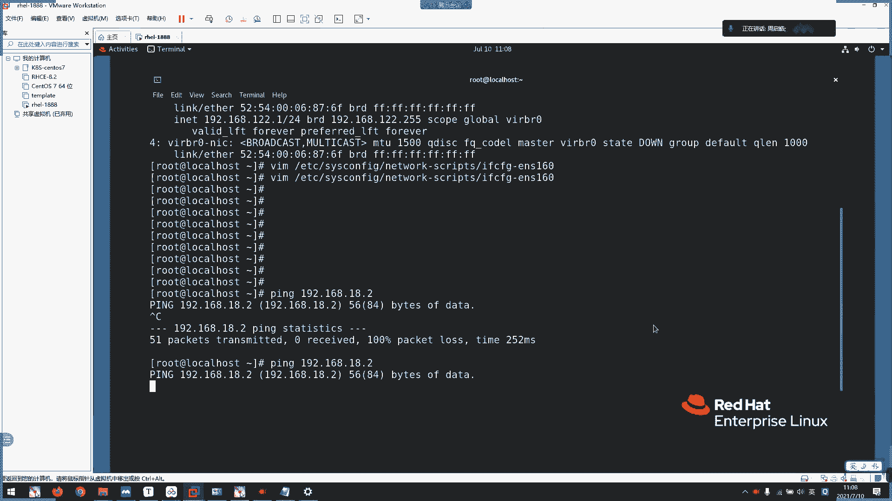

# 2021年7月新版-----RHCE8.2 RH124 RH134 RH294 认证课程 - P1：day1-1序章以及系统介绍1 - bili_15701050454 - BV1Gy4y1T7ug

在开课以前，我们先来了解一下我们啊HC18和HC7的一个异同之处啊。啊，我们之前HC17呢是三门课程啊，分别是啊HH124H134，还有H254254。然后呢，angable。

Sible啊是我们IC8的内容啊，叫做294啊。一门课呢啊是我们之前CA啊CA下放下来的一门啊，所以它这个。能力要求也。算高，但是其实一点都不难的啊啊，大家不用怕啊。啊，到时候我们讲到那里了啊。

然后再去根据。呃，综合练习来做的话呢，就比较适合于我们的生产。然后呢，熟练以后呢就没什么问题了，没什么问题了。啊，今天。ible的话呢啊是我们HTA的407门啊407这门课程啊，然后。洪帽把他在去年。

去呃，应该是去的。去年12月啊去年12月就刚好今年就把它完全的。在CA取消了44年级这门课程了，四星期考的是。二点。2。7的版本的。2。7的版本。然后我们现在学的是2。8的版本啊。

但是它的题目是一模一样的一模一样。啊，然后呢，294它现在有中文题目提供啊，有中文题目提供。但是呢我也不建议去看中文题目啊，然后呢因为他那个翻译实在是太蹩脚了，太蹩脚。

然后我们学习的话呢啊系统语言啊还是以英语为主啊，我也不建议大家去把它安装成中文啊。因为在实际环环境中啊实际环境中。啊，也很少会使用到我们的一个中文系统啊，很少使用到我们中文系统啊，然后呃我们上门课程。

有中文啊有中文，我们CSA跟CE啊都有中文啊，都有中文。啊，CA的话呢呃基本上都是英文了，但是他现在慢慢更新，都有一些课程有中文的。那是CA的话，你们之后再了解吧。好，然后呢，HC8。

这个HC17134，还有124两门课程呢啊是我们CSA的内容。啊，更新的话呢其实也不太多啊，对于CSA来说不太多。然后。到是目前的啊而且C8。2啊，增加了一个容器题目啊，然后。6月份的时候改了一下榜。

就多了几。呃，多了五题笑脚本的题目啊，多了五题校脚本的题目啊，但是随机出的啊，随出的就五题里面随机出一两题，或者是甚至不出也有可能啊。我们前面的同学有反馈过啊，直接没有没有没有遇到脚脚本题啊。

没有没有遇到脚本题，但是遇到也不用怕。啊，他出的那个校脚本的题目一点都没什么技术含量的。啊，相当于是我们把命令呢写在。文件中，然后让他执行就可以了。啊，然后是对比我们HC1的课。

HC7跟HC87的时候是254254主要是讲服务的啊，主要是对服务。16294成本啊都是我们的一个ensible啊，成本都是ensible啊，所以的话呢8。有好有坏啊有好有坏。

因为S这个工具啊啊是目前比较火的一个自动化运维工具。啊，但是我们没有了服务的基础了。So。技能上呢会比较薄弱一点啊，技能上会薄弱一点。然后呢呃我们HC这个证书啊啊。考试的时候报考一呃，我们这边接收的。

都是。上午考RRTCSA下午考RRTCE啊，就是一天啊，不能分开报啊。我们这目前的话不接受分开报啊，不接受分开报名。啊，就是一报就要一天考完。然后呢，如果考试的时候。啊，CSA过了HCE没过。

我们补考就只需要补考HCE啊。如果HHCE过了HHCSA没过啊，就只需要补考我们HHCSA。啊，但是。一定要 r c a。及格了啊，才可以拿到我们RTC这个证书。啊，所以说只过了RGCE是没有成诉的。

然后如果只过了RGCSA的话，只能获得我们RGCSA的这个这个传数。啊，然后我们红包里面的考试呢跟华为的不一样啊，我们的考试。啊，全都是lab操作，就是实操100的动作实操按题目。

然后去按题目要求去打就可以了。对啊，要自己去看服务类啊。呃，然后考试时间。呃，从8。2开始呢，就考试时长增加了上到了3个小时啊，就加到了3个小时。然后呢。

294啊是我们的HHCE下午的考试时长为4个小时。啊，我觉得4个城丝有点多。呃，熟练的话呢，其实两个小时以内就可以了。两个小时内搞定了。什么具体时间。什么的具体时间。他这时间就是早上考试，然后。

始以后3个小时结束嘛，没有说什么时候开始的看考官啊，一般都是10点啊，早上10点到中午。一点啊，然后这个是2点到6点，一般一般啊不对哦，好像是9点到。9点到12点了，然后是2点到18点。

到时候你们约考了以后呢啊，帮徐生会啊，不是考务会发那个邮件通知的啊啊，哪一天考试啊，然后啊哪个时间开始啊。嗯，基本可以过啊，但是建议的话还是要。啊，理解一下他的原理啊哈，一定要有一个扎实的基础。

不然的话人家面试的时候问你问题啊，你都答不出来啊，说实话。好。那么我们早上啊第一件事肯定要先了解我们的linux的一个来历啊来历。啊，首先是。linux的一个前身呢啊啊叫做一个unux系统。啊。

unicux有没有同学用我们的一个m book啊，m book就是unixux啊系统。呃，二次开发的。啊，虽先说un尼克的一个诞酸啊。他从1966年的时候。加加州大伯啊加州大学啊。

博利克分校毕业的一个啊TM啊，加入了我们一个美国的贝尔实验室，然后参与了我们那个ms系统的一个研发。然后呢，基于这个系统啊研发了一款游戏啊。遥澜不幸的是啊。

19啊1969年纽维贝尔实验室推出了我们这个项目啊，这同时意味着开。没有机器可以玩这个游戏了啊，所以他会有这个游戏啊。为了在。系统上他载这个游戏啊，它用B语言啊B语言。🤧啊，闭缘。啊。写了一个系统啊。

就是为了带这个游戏啊啊，人是不是很任性啊？啊，一个月啊只扣了一个月就编写完了这个操作系统一个内核。然后在这一个月中呢，它一头一个内核啊，一个文件系统。一个VG器啊，还有一个别译程序完成。

那这就是我们的一个。啊，unux内核的档生。啊，然后我们。啊，这个才是那个呃我们的Q啊。啊，这是另一位。啊，然后呢，1969年的时候unux。清啊。Unic sister。啊，有他的。呃。

由他使用B源啊去写的一个内核。然后1973年就是命名为unux。啊，就是他们两个啊一起用C语言重写了unix系统嘛，然后重启unix和C语言成为CP。啊，后来1977年。啊，伯利克大学，然后又改写了。

然后119790啊，写了这个系统的一个V架构啊，然后去申请啊全。啊，然后这个配unix啊IBM啊啊AX啊就不对学生提供源码了，然后回做版权啊。然后呢他们就无法用到这个系统了嘛，对不对？

那时候已经很多需要使用这个系统去搭载的一个应用已经出来了。但是他后面。有有有啊，摇控没有。啊，就不不对学生提供源码啊，只对社会人员啊，还有一些商业用途啊去提供。所以呢在我们1984年。

荷兰的一个阿姆斯特丹自由大学计算机学系啊的一个。老师啊就改写了之前的用那个系统啊，叫做minux操作系统。这个了解一下就可以了啊。他，由于。Unic个。不呃不再开源了。所以啊我们就有很多人。有意见了。

对不对？我前面。经常用到这个系统啊，而且为这个系统做了很多应用。然后你现在说回收就回收啊，我们后面怎么办啊，又要给钱嘛？肯定有人有意见吗，对不对啊，所以有了这个人啊去弄了一个全有计划，全有计划。啊。

首先GIU。啊，它的一个代表化是我们GNU is not un啊，就GNU不是un系统。在1984年，由我们这个riter啊发起兵创建，它是一个项目来的。目标是写大量兼容应用的一个系统的一个自由软件啊。

自由软件。然后呢，这里有它的一个官方。大家可以课后去看一下也可以啊。🤧嗯。啊，然后是GPR啊，是我们的一个genegene publish links。嗯。然后他们的背后啊是由我们一个周软基金会啊来。

维持这个项目的啊啊，虽然说这么说，也是为了这个。计划而组建了一个执金会啊。这个因为到目前啊仍然还在。The fee software foundation啊。啊。

然后是允许用户任意复制传递修改以及再发布，就是我们的二次开发。基于测个软件修改再次发布的软件啊。应呃仍需遵守我们的1个GPL啊，就是我们的一个开学协议吧。然后啊哦梁总啊。一种是我们的1个LOGDL。啊。

它高于我们这个GPL的话呢，会较为宽松一点。允许不公开全部源码。要添入了一个操作系统啊，叫他的。Yeah。然后呢，他为了无有性能寻找完美内核呢，而忘记了这个hand的一个原文目的啊。

是一个能用的操作系统。啊，他们他们的一个原有的目的是要开发一个layu的一个系统啊，后来全都变成了。啊，付条件呢啊，但是要注意一点啊，我们的一个啊非 software is非啊，他们需要一个。

免费的软件。啊。嗯那到后来啊我们的linux支付啊。啊，就写了一个内unix系统啊，unix内核啊内核。啊，它的一个linux的一个标记，就是我们这个企鹅了啊。啊，原 know。发现啊有了我们的腾讯呢。

可能是他的亲戚啊表是他亲戚，可能是。但是他们的一个啊微博不同，对不对？😊，我们的腾讯啊QQ有有个红色的围围巾啊。好，inux操作系统的啊。是一个完整的内unic操作系统。是由我们这个linux支付啊。

写了一个linux内核，然后再。加上GNU工具。啊，组结起来才是一个真正的linux系统啊。我们叫做啊linux genuineU也可以把全U放在前面，可以，januu linux也可以啊啊。

比如我们的一个sles啊物班图啊，还有and卓啊。啊，三个系统，然后。分类和包管呢，就这个啊。对，有兴趣也可以看一下。嗯。打不开。冇大到。我的电脑。可能需要翻墙，我看一下需不需要。啊，不用啊。

只要这里是可以啊采到我们比较新的内核，比较新的内核。你看现在最新的一个。哼，咱本都5。13。1了啊。啊，我们8的话还是4。15啊，4015。好。😊，嗯，那么。有了系统啊有了专用的工具。

那么我们还需要很多那种可以在商业上啊，或者是自己私下用的一些。应用软件啊。所以呢做了这个开源的项目啊，我们要学linux啊，一定要了解开源。啊，首先是开源啊，英文名称叫做open source啊。

open source就源代码啊就开放源代码。啊，软件和源代码的。提供给所有人就就共享出来啊，都公布的。然后自由分发软件和源代码要fr，是自由，不是免费的意思啊。啊。

所以open source is not free啊。呃，没有。It's nothing。这个对对。嗯，怎么你们能开麦？不管前面是音该。啊。他把原来买台湾出来了。

是可以让你去二次开发修改或者是创建他的一个衍生作品。🤧嗯。啊，这软件的分类呢啊，我们有商业啊共享，还有自由啊，三种等级。是啊收费源代码也不公开啊，这些一般都是大众司用的。就比如我们的IBN啊那些。啊。

要是共享，可以免费使用源码不公开，就是软件免费啊。然后自由。和元代码公开。原大的公开这一个呢，它也要遵从一个叫做开学协议啊。然后世际上的开学协议许可证有很多种，大概有上百种。然后呢。

他们的一个等级也不一样。有一些开业协议，它的一个封闭等级最低的话呢啊就随便你使用，然后。要求。开源改呃改造以后，你使用那么多源代码，你要把这个源代码再发布出来，再重新发布出来啊。如果是商页的话。

那就不需要啊。商业的话啊，你已经给过钱了，然后你可以直接对它二次开发啊，比如是我们的呃一些应啊，就比如是。gonet啊、Sible啊，这些都可以。S我应该是属于自由的。S什么啊，因为它是基于Pl。

还有那个python来写那个工具啊。🤧嗯。我现在讲的这些课本没有。😡，现在讲的这些课有没有，都是一些课外的延伸知识啊。好。其实我们了解就可以了，毕竟我们不是做呃开发运维dro的啊。啊。

所以了解一下就可以了。好。那么我们就进入啊，这样进入我们的主题了，了解完我们的一个unic啊linux的一个。历史来历，那么我们就可以直接开始我们的一个学习了。这啊我们的一个客人准备啊。

以及一个vivo8的安装。嗯。这些要求啊是对于我们的一个学习环境的，对于学习环境的。呃，慢慢给你们说一下。首先啊我们学习环境呢它。有呃就是内核。呃，怎么说呢？就他已经在一个系统里面啊一个系统。三个课程。

应该是有三个小。呃，里面大概有多少台呀，我数一下。ABCD。Bton rock station。还有什么？啊，class啊。大概一共七台。洗衣机。但我谁我知道啊，虚拟。打随机。啊，来几台是这样啊。

对于我们的一个。内存你CPU的消耗是挺大的。所以要具体到的。啊，所然我。但上了我们前面课程了前面的课程就看他里面嵌到了3个课程，但是前面基本上是用不到的基础东西啊，我。还是用一个开了镜像给你们讲。

就是啊红猫的官方镜像跟你们讲。啊HC的话就呃要用到我们的。这环境啊。嗯。呃，然后前面CSA两两个舍大概要用到7台里面的。呃，四台到5台4台到5台。啊后。呃，HC可能就一共7台，其实它里面有8台啊。

有一因为有一台它只是适用于我们的一个。叫什么经验仓库啊，是我们134学勇器的时候才需要用到。啊，所以我们看一下这个要求，其实也。并没有那么高，但是要用到实间环境的话，就必须要。就呃按照这个要求来啊。啊。

所以我们CPU啊就定在I5的3代以上啊，然后台式机可以呃返换到我们的I3。然后AMD的话呢啊要R3以上的CPU。呃要内存。啊，需要8G，大家8G的话，你是一定要用到我们的1个SSD的。

一定要用到SSD的固态硬盘。然后推荐的是16GB啊，因为我们。本来这个实验环境呢就是1个16G的呃要求环境来的。呃，硬盘刚刚说了啊，如果是16G的话，机械硬盘也没所谓。但是如果是8G的话呢啊。

必须要使用到我们的SSD啊，不然它转不过来的。跑，到时候跑S的剧本的时候是跑不过来的。啊，系统的话呢是支持winN7win8win10，还有mic OS啊。啊。

然后呢我呃我们的虚拟化是用我们的一个work stationation啊，work stationation啊，需要15。5版本以上啊，从八开始啊，从八开始需要15。5以上的版本才支持啊。7的话呢啊。

用十4也还没有问题啊，这个是验证过的，14从8的系统是装不上去的啊，会有问题的。呃，这个有发发给你们啊，班主任给你们的那个网盘上面有这个工具啊，所以会安装一下windows安装的软件。

应该不用多说了吧啊，不用多说了吧。🤧好。而且他做完以后呢，在网盘上面，我记得是有那个P的啊，就它的一个注册码啊，注册码啊，直接把那个注册码分析它就可以使用了。好，继接着啊我们的一个。

关于vivo8的一个安装，还有初始化配置啊。安装前我们要准备这个。booktation或中创建水拟器啊，这个先不用看，你们直接可去开就可以了，我直接再操作了啊，实操。里面啊北页里面都有步骤啊。

有截图步骤啊，大家回去可以跟着做。那可以可以可以可以跟你说。好。首先呢我们打开以后。啊，他正常没有虚机啊，也没有什么，他直接会打开就这个界面啊，或 stationation，然后可以打开虚拟机啊。

远则服务器啊，还有一个创新的虚拟机啊，也可以点到我们的一个文件。要后有一个新建虚拟机啊，点这里也可以了，两个是一样的啊，这两个是一样的。那么我们点击啊创一新的虚拟机。啊，对。呃。

十6的话啊你是 work呃work stationation port16的话呢啊我们这里选择自定义啊啊，15的话我也建议使用自定义啊。看自定义，然后下一步。啊，这里直接默认就可以了啊啊。

他这里先字了解一下就可以了。嗯。要是下一步。呃，我这里。呃，先不选光盘直接。稍安装超系统。然后选择我们的一个潮系统。选择linux。然后这里选择我们的一个系统版本。啊，这里有sdows7有sdows8。

然后呢，我们发给你们的官方经销呢叫做vivo RHEL啊HEL我们也直接选linux864位就可以了啊。重启以后呢，我们这个系统只有64位啊。啊，只有64位。嗱所以这你就下一步。box box我不会。

好，然后呢这里。😊，有一个位置，然后还有一个虚拟机名称，我们先看位置啊。点击浏览。然后呢，选择我们安装虚拟机的一个位置啊。啊，这边新建一个文件讲了，叫18A。1888。啊住 yellow。1888。啊。

试一下。啊，那么他就把逻径给提拔了，就是存放我们的一个取机的位置啊。聊到这里啊可以改一下名，这个名字呢不影响我们的操作系统里面的一个任何任何东西，只是是用于识别啊。比如老师这里啊刚刚。也看到了。

我这里有个文件夹叫呃。也不要文件夹完之后菜到拿了，把它一层一层的就把它要一些所有需要用的啊放在一起。啊，这这里只是这个名字啊啊，用于识别我们要打开哪个系统才是我们需要打开的。啊，我这边就叫做R去。

A yellow。1888。好，有C处理器这里呢呃。学习的话就22就可以了啊。这虚拟处理器没什么问题了，它是可以超载的啊可以超载的。啊，然后等一下一步。啊，这里就内存选择啊。两句就可以了啊。

我们还没有什么需要并发的大应用啊，所以两句就可以了。这下一步。好。接个是我们那个网络类型啊。嗯关于这个 stationation的网络啊。我不解析。这些是什么意思？但是我等一下会教你们怎么用啊。啊。

我们直接先选我们的一个第一种啊啊。啊，这里我们的一个IO类型啊，IO类型的话，直接推荐就可以了。啊，然后这里是我们的一个硬盘的一个协议啊。啊，可以用star啊。

也可以用我们的1个啊MVME啊就是固态硬盘啊这个协议。其实没所谓的啊其实没所谓的啊，但是不建议用IDE啊，IDE的话它是比较老旧的机械硬盘啊。就可能都去速度有点慢。あ状点に下歩。啊。

这里的话呢呃有三种啊，第一个是叫创建新的一个虚拟磁盘啊，它会创建一个新的磁盘文件啊，然后作为我们的一个虚拟磁盘。然后呢，第二个是使用现有的虚拟循盘，就是说如果我后面增加了一个磁盘啊。

然后我在虚拟机上面啊通过快照恢复了，他那个文件一然在的嘛，我可以使用这个，然后把它重新选上。第三个，使用物理磁盘啊，这个不要选啊，不要选。啊，因为如果我后面一个虚拟大小啊，就是一个逻辑大小。

我直接选择了200T啊，我跟你说，你那个如果你只有C盘的话，你的硬盘可以直接炸掉啊，可以直接炸掉。所以我们不要选这个。不要选这个。啊，然后虚拟磁盘的话呢。他会先创建一个文件啊，那文件也不大。然后呢。

我们一直往里面塞东西啊，一直往里面塞东西的话。我会。嗯。那个文件会慢慢越越来越大啊，直到我们呃的一个物理磁盘塞满了，上要烧烧一下啊。好，那么我们直接下一步。好，这里最大磁盘大小呃。

20的话其实足够我们安装啊，足够我们安装系统的啊，但是系统可能是10G就够了啊。当时我们这里。嗯。按照一些架构性的实验环境来做，就给100去啊100去。这也不要点啊这个也不要点。

这就我刚才说的一个逻辑大小，逻辑大小100G啊，逻辑大小100G。如果你点了这个呢，他那个文件就直接10G了，把那个磁盘文件直接啊变成100G了。我们主要要关注的是这两个啊。将磁盘存储为单个文件。

还有一个将磁砖拆成成多个文件啊，就是说。我们这个虚拟磁盘啊是由一个文件来维护的，还是多个文件来维护。就好像我们压压缩文呃压缩一些大的工具的时候，呢是否要把它给拆分成啊多少个包？啊，那就影响读取速度了啊。

影响读取速度啊。如果单个文件的话，读取肯定会快一点。因为多个的话呢啊，它需要主要就好像我们的一个啊分布存储一样啊，你要在这里找一个数据啊，在这里找一个数据啊，在这里找一个数据整合起来啊，再在。

变成一个真真实的呃一个数据段才真正的用啊。所以它那个速度会稍慢一点，会稍慢一点。啊，如果机器可以的话，直接选这个就没问题了。固态硬盘直接选这个肯定没问题。啊，然后给你下一步。啊，这里不用管了。啊。

这个接就是他那个case的吃他文件的一个文件名啊。就是有这个文文件啊来。充当我们的磁盘。那么呃不用改，直接下一步就好了。啊，他这里。我们前面没有选呃，镜像，对不对？所以我们这里点。ピ印제。好。

这些都是我们刚刚选过的，如果有问题啊，可以在这修改啊。比如说内存呢是2G哦，要改成4G，那就4G啊，两G还是2G。啊，然后是处理器的一个数量啊。这两个嗯目前没必要勾选啊，目前没必要勾选。

这个是相当于我们的bels里面开了一个虚拟化引擎啊，如果我们要用呃这个work station做虚拟机，我们需要在bels开上面开一个虚拟化引擎的工具啊。不然的话，我们是创建不了虚拟机的啊。

这个也是一样。他的意思。就是说我创建了这个系统以后呃，系统以后，然后我再在这个系统里面继续创建虚拟机，我就要开启虚拟化了啊，这个等于它的一个虚拟标识啊，虚拟的标识。

还后这里啊是我们的1个CD或者DVD啊，我们这边就把我们的集成关理掉了。呃，在班主任给你们的一个预习预习里面呢，它有一个镜像啊，叫做HEL有什么8。2的那个镜像，名字应该跟这个是一样的。不对。嗯。

你看有这个啊。那套。东西不是我整合的啊，但是我。里面的话比较全，你们要翻一下，那他不是我整个。因为它里面有更多的这个工具，适用于呃max啊等等啊。然后我们就点击这个。就是一个计数器呗。没什么用的。

不要勾选啊，如果勾选他他要。又又又要多一个程程序去计算。啊，这里它默认式启动时自动连接啊。聊网络啊是我们刚刚选的啊，一个是lat模啊，lat模就用于我们的一个。主机IP地址共享主机的IP地址。啊。

其他的话不用看了啊，是一些USB啊声卡、打印机，还有一些显示器啊，其实没什么用啊。这边啊其实我们最后要做的是确认信息，还有把光盘给挂载下来，然后是关闭就可以了。完毕，然后完成。好，然后可以注意到。啊。

然后可注意到我们这边就有一个刚刚命名的啊。啊，一个碎机。然后呢我们直接点击。开启是处理金。

啊，这个它是可以读读一下你有没有那个U盘而已，不用管它。好，到这个界面，我停一下它读秒。大家见咩啦啊。有三个东西。第一个。嗯啊是。检查光盘的一个完整性啊完整性检查。然后呢，检查完以后呢。

它也会进入安装我们的这个系统啊，叫做啊readd ahead。啊，不会读啊，s了，英语不大还不会读。但we have商业块呃lin系统8。2版。然后这个是触门锁停啊，主合锁停的话我们不需要太大关注啊。

它一般都是一些呃系统底层的一个维护啊，或者是二次开发的时候才需要用到我们的一个触口锁ing。然后第一个就是直接安装啊，直接安装我们的这个系统啊，我建议大家如果在其他地方啊或者是互联网上面下载的停下来。

啊，都要做这个。我把这心检查。啊，如果他过了，人家确定是可以使用的，你再直接。选择第一个安装也没问题啊。那么啊这个我做了很多次了啊我做了很多次啊，所以我这边就直接安装了啊。啊，你们拉到这个镜像啊。

在我们网盘上面共享的镜像也可以直接使用的啊啊啊，这直接用我们的小键盘上下左右啊，上下去控制就可以，上下去控制，看到没有？然后选中那个会高会高亮的啊，没有选中的是啊一个大蓝色啊。应该是绿色吧，大绿色。好。

然后我们选择这个啊intop。嗯，其实我们有没有注意到它有一个。啊，高亮的字母一个是I，一个是M啊，这个应该是可以使用他们的一个快捷方快捷键啊。我试一下哎啊，对不对？跳过来了。L是M。7。系。

那么直接安装啊。🤧嗯。walker station的那些。不要问太多，我不懂。😊，因为我没有考没有学微微呃微瑞的证书啊，也没有去学它，我能用就行，能用就行。其实这些自己去。往上面找一下就很多啊。好。啊。

那就进入到我们的一个安装选择界面啊。啊，这里可以看到啊，他说欢迎呃来到我们的这个8。2系统。然后这里啊是选择我们那个语言啊，选择那个语言。啊，就直接选个英语就可以了啊，英语然后。是哪里的英语啊啊。

我们就直接US就可以了啊。你们不介意使用中文啊，到时候你们想搞就自己搞。啊，到时如果中文的话，厨师不要问我，我看不懂。看不懂。因为中文的话，他翻译过了。奇怪。那个语序啊什么之类的，有点奇怪啊。

但是有一些啊就。呃。可以清晰的看到他报了什么戳啊，他说我不建议啊，实在看不懂就摆个翻译嘛，对不对？啊，直接点肯定留一下个啊。我看一下。我没看啊刚刚。让他重新读取。嗯。😊，光盘断了。🤧嗯。

我们等一下介绍完这里，专机的时候才休息啊，专机才休息。搬他装机又要等一段时间。啊，那就不太好。我们在装机过程中休息。啊，是cont定留啊是con定 new啊，这里也可以搜索啊对应的语言就可以啊。

是con定留，点击cont定留。去。右下角也有一个帮助啊，但是我从来没打开过这个帮助。好。到了这个界面啊。我们可以看到。有三个大标题啊，一个是。啊，system一个是ser是有有些相关的，一个是。

楼基上啊。啊，就是一个本地相关的啊一些硬件相关的东西啊，本地相关的。那么呃我们先了解。system啊系统这个栏目啊。啊，首先是install discussion啊，点击一下啊，它这个点开进来就知道了。

是一个磁盘选择啊，就装在哪里。呃，大家有没有装过windows的系统啊，就用PE装啊，它是不是。拿到一个新的硬盘，也需要我们做一个磁盘格式化啊，然后再。呃，在那个C盘上面做引导啊，然后把。系统写入啊。

这里也是一样的。啊，这这里是整个磁盘，然后呢。其他不需要注意啊，直接勾选它啊，就是选择我们系统是要是使用这个啊，是使用这个。是选择我们默认使用这个。然后呢。

这里啊有一个sstorevation configuration啊就。存储的一个。配置。啊，这里是一个自动。自安装，然后我们不用自安装就。正常情况下不用自安装啊，就是如果你是自己实用环境啊呃。

可以直接自动安装，没关系啊，但是生产中我们要选择手动款。cast啊cast，然后呢我们直接按down。啊，他就会调到我们这个窗户了啊。啊，它这里是我们增加自定义啊，的一些目挂载目录的啊，还有一个分区。

啊，默认是LVM啊，默认是LVM我们这里点击一个加号，为什么要这样做呢？跟你们说。首先我们要分一个叫做port。获得的是存放我们的一个引导信息的，存放我们的引导信息。所以呢我们这边要给它。啊，一据内容。

因为啊这个bot呢其实基本上不会往里面写东西的啊，基本上啊是基本上不会往里面写东西。所以一句它就足够了。但是如果我们刚才没有自定义，那个bot是会在我们根下面啊。就是说在我们操作系统上面。当。

数据把我们这个硬盘给撑满了以后呢。啊，它引导就发挥不了作用了。所以我们这个系统就直接炸掉，它引导不了就开不了了。如果引导不了，我们连。进入他的一个救援都进不了啊，是直接开不起啊，这个机就直接开不起啊。

因为引导失效了啊，引导失效了。啊，所以我们这里。啊，一般情况下直接给他一个依据啊。啊，直接at mind point啊，添加挂载点。好，然后加刚才说的啊，也的目录啊，我们给它。45。加个句啊。啊。

45G。还要再加。呃，叫拌分区。呃，这个正常情况下呢。嗯。到后面我们详细介绍交通顺序的时候再讲啊，但是我们目前来说少于4G，小于4G，我们都要采用呃实际内存的2倍啊，实际内存的2倍。刚我是想了两G了。

对不对？呃。修改不了了。但是可以。嗯，这个到后面讲分区的时候再给你们讲。修改不了，那但是可以把它删了，然后再重新创建啊，到分区的时候可以再讲。但是。啊，包括bot这个也可以啊，包包括bo这个也可以。

但是不得了，我们一定要用组合句的。虽然它现在是叫做LVM啊，LVM是我们的一个V系统管理仪器啊。呃，等我们做完以后呢，它这里有一个叫做real world的一个。呃，叫什么呢？啊，卷组就逻辑卷。

然后这个不则它会自动选择了一个主分区。bo一定是要放在主分具下的啊，它会自动选择到我们这里不用管它啊，了解一下就可以了。然后我们这里啊2G，所以这边要是它的两倍啊，就4G以下。

就物理内存4G以下就选择两倍啊，就个物理内存的两倍作为交换分区。如果是等于4G啊。到16G的话呢是可以相等的。然后32G的话呢是可以选择4分之1啊，60G那些更就不用说，我们到后面有一个表啊。

给你们参考一下了啊，我那我我这边就选择4G啊。好，然后剩下50G干嘛的呢？啊，可以保留啊，可以保留。啊，但是我们一般。呃，到。自己学习啊，就是其他内容啊啊要用使用到第三方应用啊。呃。

源码编译软件的时候啊，我们就喜欢这样子啊，用这个49区的去创建一个文件夹，叫做data或者是扩展啊，叫APP啊。把我们第三方应用的一个余饵包解压到这些地方，然后啊在这里编译安装使用。

那就可以对第三方统一管理啊。啊，如果没有这个的话，其实以前也不是说以前。啊，在创建系统的时候，它有一个叫做OPD目录的一个定义。就像刚才一样。我da是自己创建的，就官方推荐是用OBT啊。

其实这个没关系啊啊，其实这个没关系啊，就需要统一管理而已啊。就你想把它装到那里就装到那里啊，我们一般分开放，不跟我们的根放在一起啊。不跟我们都放在一起啊，所以我们这边啊创建一个叫data目录啊。

然后把所有的给他啊。所有的话，这里直实这天不选就可以了，at什么啊。搞定了啊。然后直接点击蛋啊这个蛋。啊，然后这里啊第一个不用管它肯定会有问题的啊，因为他开始没有啊，然后是没有以后再创建。啊，这也可以。

稍微了解一下吧。啊，就是说它一个卷组啊，就有LVM啊LVM的LVM，然后是文件系统格式化为叉FS的一个文件系统啊。然后这交互分据叫就是交换分居啊，然后 data的也是一样的啊了解一下就可以了。啊。

整个卷筑呃LVN的VG啊LVN的VG就叫做我们的re。啊，所以LV的话呢就叫做will world这改一下。好，确认无误了啊，就直接可以。啊、 assessセ。劝不绝啊，通过更改。好。😊，然后呢。

这一栏还有哪些是需要注意的啊，就是我们的一个level。啊，和后石令后石令这个呢可以在现在就改，但是。我们等一下也会讲，它默认叫做就叫做logo horse啊，logo domain啊。啊。

这里也可以开，也可以不开。开了的话呢，等一下它开机就有网络了。开就完了了啊，我这里也直接把它开掉，给你们讲一下它的一个配置啊。啊。这里可以注意到我们的右下角有一个可呃，也是confiration。

也是配置啊，是对于我们这个网卡配置。点击一张。到。这里可以看到我们的网卡名啊啊。然后呢嗯。直接选择IPV是se啊，IPV是设置，然后默认呢是DHCP自动获取IP地址。啊，然后有。呃，menual啊。

这个是静态获取IP就是我们手动设置啊，这个动态，其他不用管这个disable直接关掉，不使用。啊，那么我们初期不懂得去配置网络啊，我们就选择。啊，随着我们的DHCP。到后面你们熟悉了这个。

网络呢啊这里可以给你们看一下。啊，在编辑有一个叫做虚拟网络编辑器啊。🎼啊，我们点击更改。啊，获得权限限啊。好，对啊，有一个虚拟的啊，你们可能有一个。呃，we net一啊，还有一个wenet8。

还有一个we net0的，你们可能只有3个，可能只三个，因为二的话是我自己创建的。啊，它是可以添加网络的啊，但是。序拟网卡呢啊只能有一个lot模式的网卡啊，可以有很多个金础机啊，但是只能有一个lot。

也只有一个条件啊。好，它对应的是什么呢？我们打开呃我们windows上面的一个网络啊。啊，这里有一个更改适配器选项啊，如果是winI7的系统的话呢，它要打开共享网络那里。

然后也有一个叫做更改适配器选项的。这4别器。啊，它对应三个网卡，就是这三个三个虚率网卡。那么。我们这里。

如果选择了lot啊lot，我们这里就要设置一下。啊，首先看一下属性。然后。把我们的1个IV设置啊。啊，你们可以不跟我设置一样的。啊。这个啊就给你们说一下啊。

VM8n模式这一个网卡在虚拟机跟我们windows机上面的一个对比是啊是是作作为一个什么样的角色呢，它就好像一个交换机。啊，其实是路由啊其是路由器啊。不。这个网卡啊，这里也有一个网卡。

应该叫做don口啊。那个接网接接接接接网线那个口叫什么网络忘记了啊，都还给老师了啊啊，这个相当于在网线啊，这里也是一个网线啊，然后这里是我们的。windows啊windows系统。啊。

这边是我们的虚拟机。We have。好。那么我们VM的一个网络就是192。点168。啊，其实是这个网口啊这个网口的1个IP啊，点1表啊，等等下来吧，以我这个为例子啊，点18。0要是24位的。20位。

然后嗯。嗯。😊，这动。然后呃。这边。就是啊这里还有一个口。啊，这个相当于是我们的一个路由器嘛，对不对？然后它有一个录由啊，叫录由转发叫IIP转发啊，IP转发就相当于这里设置了啊192。168。

18这个段，然后这边啊。可以虚拟成我们的192。嗯。对168。点18。点2，然后。通过loud啊定时转换。为我们的。windows的一个地址啊，然后。这边是我们那个windows实实际例子啊。

比如我这边是192。168。得1。1啊得得1。2吧。啊，能理解吗？啊，就是lolo。所就是第一转啊第一转化啊，它充当是一个路由器啊，充当是一个路由器。啊，这是我们的一个拉模型。好，那他要过来。

这边是不是需要一个网管？就是他要外网的话，是呃是不是有网关，他才才能访问到我们的外网啊，所以我们这里设一个网网关给他啊，然后DSI直接选择我们这个网关的就可以了。

那么我们这里啊给啊windows这一个端啊，这端给他一个逻辑的IP地址啊，不要可网盘出图就可以了。啊，从2到254随便选啊，但是也不要跟我们的VM里面的一个冲突就可以了。但时我们改完这里要啊。

还有其他地方要改。啊，那其他地方要改。啊，就是我们这里。那。啊，所以。有一个lot设置啊，let设置这里啊一定要把网关改了啊，一定要把网关改了啊，就我们刚才设置的网关。然后。

还有这里要把这个网段啊跟我们刚刚网卡上面的网段是一致的啊，它不会同步更改的，不会同步更改，它需要手不时更改的。然后24位就是25。25。25的。啊。然后新手啊，不懂的话呢啊这边选择我们的1个DHTP。

啊，是我们re的DHCP服务呢提供给虚拟机啊一个啊就相当于我们 word的有它里面有一个服务啊，叫做DHCP啊，相当于它是1个DHCP服务器。然后我们在里面安装系统啊，这个服务就会给他分发IP地址啊啊。

这个是1个DHCP服务的一个东西啊。按一下逻辑可来，然后这里选择它1个IP地址IP地址1啊IP地址1。啊，我这里就选择128，就是就说它这方面的话呢，从128开始啊，然后到呃224啊，一共128个啊。

没有有多少个。呃，100。26个IV例址。啊，可否使用啊。然后什么最场住院啊，两个小时的这些这些他会自动续约的，不用管的。我们勾选它就可以了。啊，但是这里记得要改一下，那个IVor也要改一下。

那么成为就点击去确定就可以了，也确定。那么我们这里直接目前新新手的话，直接是DHCP啊。啊，这个safe啊，然后把它开启。对看是不是啊直接获取到1个128的24位的I比例子。好。啊。

但是里面的利用其实在系统里面都可以更改。啊，但是啊新手的话建议我我我我就比较喜欢在装系统的时候，把网络给配置好，我比比较喜欢这样子啊。啊。19大啊。好，然后这里的话呢还有一个注意一下的，叫做K档啊啊。

这个其实没什么说呀，但是生产的时候要看一下，需要去把它启起来，它是一个做备份的。如果使用环境的话，把它包发了也没关系啊。它会影响一个呃系统的一个使用啊，它会占比较大的内存。好，我们主要是关心的啊是。

分区啊，还有网络的一个设置。还有到。第二栏啊到第二栏啊叫ser，就应用吧软件吧，对不对？啊，其实我们也不需要工作太多，首先是我们安装的源啊，安装源呃，当前什么也没有呃，也可以说连了网。

我也直接可以联网也没关系啊。但是我们现在直接用光盘就可以了。用关它就可以了。啊，有官方肯定是要关盘嘛，对不对？什么意思？那理没有。改呃，不要改自动过取啊，一定要手动啊这里。我哪有自动获取。

如果你自动获取，它根本就没有这个东西啊。那你一定要说的吧，一定要说。把他给毙死了。哦。好，然后这里啊是我们一个。呃，软件的选择啊。呃，其实也没什么好讲。咋时呢。啊，一般是。到后期啊新手啊可以安装这个。

啊，图形框。然后呢，这里还可以选择它一些需要使用的东西啊什么。好像这个么什么虚拟化工具啊啊虚拟化的一个客户端啊，虚拟化工具啊啊什么呃mail serverer啊。

就那个IIMAPI有step啊这些啊可以提验选择啊，但是其实不选也可以啊，我们到后面都可以自己去装啊去安装。啊，所以我一般这里直接不管，然后呢。通常情况下，我们这都是使用最小化安装啊。啊。

通常情况下都是最小化安装。所以。刚刚说到哒。图形框。或者是最早框当中，它都有一些可以预安装的工具，我们一般都是不选的啊。这个都是一样，的是就是它一些预配的啊预配的预配的工工具而已啊。

最小半就是什么都没有啊，我们都喜欢金融里面啊手动安装啊，更据是也需要手动安装，而且图形的话在实际环境中是根本没有用的，而且还要占内存。啊。当然我们新手这边先进入图形块来了解一下这个情况。啊。

选直接选择GY就可以了。选大。这个当。好。😊，啊，最后是location。都要选结本地设置啊，其实没没什么好说的。首先是我们的键盘的一个布局啊，直接是US啊啊直接是US。

我们现在的键盘26键键盘都是US布局啊。好，紧接着是我们的一个系统语言选择啊，刚刚始选过了，不用改。主要是我们这个时间啊，虽然在里面都可以改啊，虽然这是呃里面可以改。所以我刚刚为什么喜欢配置网络呢？

因为这里可以直接开一个呃lavel time，leve time它可以直接获取我们那个呃通过网络来扩取到时间啊，好像我们windows呃一样，它也有一个时间同步，对不对？是点击这里吧。啊，不是。🎼嗯。

时间。

啊，这里啊，你看我们这里啊还有一个自测时间，对不对？然后它是通过我们的windows的时间服务器来同步的啊。可以调整啊，到时待我会讲到分区再说啊。好，然后这里啊是选择十区的啊。

这里是我们的一个美国时间啊，我们要选择东八区的。那么它就可以自动同步到我们那个10点32嘛，对不对？大家看。当计时间4点32分啊，它是通过我们的1个公共的MP呃MPIP服务器来。同步到我们的时间。好。

然后直接到就可以了。记了选择HS伤害啊H伤害。啊，没有北京时间的啊，没有没有北京选的啊，只有上海啊，香港。香港现在在东京，就中国的话有有我们的新疆。还没有啊，说了，不管。这里继续看吧啊。

到时候我们都是用上海的。好。然后就直接dump就可以了。dump。好，然后就。选完了。直接开始安装。好。😊，然后呢，这个界面啊有两个套号，对不对？首先第一个叹号啊，是我们创建超级管理员账号的一个密码。

啊，那我们简单点了，反正是自己建的啊，但是生产环境肯定不能点单。我这边习惯的话啊，在测试环境中叫做外。Right ahead。啊，你嗰小话隔衣都可以啊。到时吧。😊，简单密码啊，你看这里是win。

他说弱啊，对对不对啊？弱。啊，我们直接选择大。啊，第一个大呢，他说不可以的，他说。啊，在阿姨是。大部的话就确认使用run密码了啊。大。然后。第二个啊第二个按钮。啊，就是我们的。创建用户啊优势。啊。

这是大家他创建的是一个普通用户啊，注意是普通用户。啊，可以创建也可以不创建。但是讲课的话一般都是先创建一个回动馆。然后到这里有个互联啊，互联相当于是它一个呃用户的一个描述啊。

然后user类才是我们用户名。有谁啊，可。我们创建一个student。呃一个不用过。啊，护联费跟他一样啊。好。了解就是密码。你我也喜欢直接交费这些吧。啊其他不用管了。嗯，这些他都有提示。

怎么保持你的那个用户名啊呃在32个支付圈以内啊。啊，后什么请求密码。但是。把这个用户创建为我们的管理员了，他肯定不要了，这个是普通库嘛，对不对？但是我们用户的一个权限。啊，身份到后期都能更改啊都能更改。

那么设置好密码，还有。要み。就可以了啊，福利其实可以不要福利可以不要。如果是。嗯。先完是吧，然后让他安装就可以了。那么我们先休息啊先休息。啊，安装完成以后呢呃我们直接点击重启就可以了。对。咁似。好。

哦是个18的那个。Yeah。

好。然后我们可以看到这个界面啊，这里有一个呃用户协议啊，要同意一下当。啊，然后就可以了啊，直接finish啊嗯 configurationration啊。

把这位置啊好，然后呢我们就可以看到我们那个图形框界面啊。首先它这里默认会显示出我们的一个。普通用户啊，不是啊，你反过来了啊，反过来了。然后呢，我们这里有一个ro list啊，就是没有显示出来啊。

这里呢可以直接输入我们的一个其他用户名称啊。但是普通用户的话呢，一般都会列出来太多了，它强列不出。然后呢，我们root是不会列出来的，所以我们要手动输入。啊，OK啊，然后点击lesss。要输密码。

登录啊，所以。是。好。这也是说我们那一个图形化啊的一个界面啊。

好。首先啊我们可以看到拖镜化啊啊是做的挺好看，但是没什么用的啊，毕竟我们vivo啊，还有sals啊是作为。啊，没问题了，是作为。服务器使用的啊，它跟乌巴图不一样。乌巴图啊还有一个桌面版本的一个应用。

但是我们will还有sows啊，都是作为服务器使用的啊，所以一般不使用我们的一个图形化。那么我们啊还是大体了解一下我们那个will的一个图形化是怎么样的啊。首先右上角啊有一个啊设置啊。

有这里有一个三角号啊，这里啊首先是我们那个声音的一个当前的一个大小。然后这里是网络啊，有这个的话证明我们的网络连通。然后这里啊有个关机的一个。图标啊。

但是点这里其实他也呃会把等于点击我们那个三角号而已啊，这里可以调整声音大小啊，系统声音大小啊，然后这里是我们的一个网卡的一个连接啊。这里不用管它啊，连好就可以了。呃，然后由于我这个是笔记本。

它默认有一个蓝牙驱动嘛，然后这里是显示我们的一个登录用户啊。可以奔出啊。好有一个设置。啊，这里是一个关机按钮啊啊，锁屏啊，还有一个设置。然后中间。打有我们的一个时间，还有时间阅力。然后呢。

我们就说左左下角有一个呃呃activity啊活动啊活动啊，它相当于是我们windows的一个开始菜单，我们点击一下。

这里啊就有一些应用啊。浏览器啊啊文件夹啊。其个文件夹的话是对于我们windows的讲述的。我们在linux里面叫做dory啊，directory叫做目录啊，叫做目录啊。然后这是一个呃软件商店啊。

然后这里是一个帮助，最后是我们的一个termin啊终端。啊，我们在服务器啊，在linux服务器上面呢啊无论做什么都离不开终端啊，离不开终端啊，然后这里还可以点击搜啊APP啊application啊就。

展开应用。点击一下啊，就可以看到更多的一码。所谓。啊，我们现在当前没有什么应用啊啊，所以它跟这里也是差不多，什么计算器啊。呃，这个应该是一个输入管理啊啊，然后windows啊。啊。

工具啊等等其实这些没什么用啊，没什么用。看一下就吧，看一下就。

啊。好啊，这就是我们的一个图形框界面啊，图形框界面。

那么我们现在就打开中断一下啊。

这就是我们的投票啊，在图票表面呢，我们可以敲命令啊。比如是说最简单的一个啊。检测我们的DNS有没有问题啊？DN还有网络有没有问题？通常情况下呢，我们是怎么做的啊。

在windows上面是不是有一个啊CND的啊。C啲。命令提示符，其实他们是一样一样的一样。类似东西啊。啊，我们通常检测网络是不是拼百度啊，这个网能不能通？我这电脑真的是。系统问题啊，你看百度都要那么久。

と了。啊，然后是这里啊一样的啊，最简单的一个命令啊可。八号。どって看。Yeah。啊，其实不是我的反问问题，我也不知道他为什么加载那么久。Yeah。换个系统多坏啊，但是候我们windows的CND。

它是P4次啊啊，在我们inux里面是不停止它就会一直拼啊。等他反过来了啊。在我们红帽系列有三个版本啊，第一个就是fedorafidora。第二个叫wehead，第三个是sals啊。

fe多尔啊是我们红帽的测试版。是道吧？它用的是较新的应用，还有较新的内核。呃，然后在fe上面呢应用稳定以后移植到。不 ahead啊就是我们的will。啊，这就是企业版。可以直接上服务器使用。啊。

放到生产环境上面使用。然后呢，s透是我们的一个社区吧。所版呢呃他们两个跟will两个可能会同时发布。但是。如果在企业版中遇到bug。啊，原bug我们这边。如果有订阅，他是及时发布。啊，而且修复补丁。

les呢可能会啊3个月以后才会把补丁发布出来。所以sdows2它是会比我们的一个re要慢，但是sdows是完全免费的。明免费了啊，虽然will有啊，也是说啊不订阅的话，它也相当于是免费啊啊。

你上到生产的服务器上面也没有人追究你啊，只要你用的应用啊，不是收费的就可以了。但是我们啊一般都是使用snos啊。啊，但是后来呃以后的话可能走势会改变。因为啊这些IBM说了啊，会回收我们的一个社序版吧。

回溯我们这个社区吧。啊，就是把s回收回到我们的一个企业当中啊，可能就会把社区关闭了啊。本正听说的话就深度8。3是一个最后的公开版本的啊。啊这个了解一下就可以了啊，完全不影响啊。因为生产期的话。

还有好像是22025年吧啊，然后维护到2025年吧。哦我记得是这样，生冷期。啊，虽然现在市面上的话还是很多是都16，很多次都7啊。然后。嗯。46啊，他一样也没有回维护了啊。

但是啊社区当中还是有比较厉害的人啊，他会继续发布的啊，包括我们开源项目啊，有很多项目都是已经过时了啊，就是官方已经不再运维了啊，不再开发，也不再运维啊，但是一样在社在社区中啊，什么叫做高手在民间啊。

他们一样还会给这个应用去进行维护的啊。这个不用担心啊不用担心。好，最化见面啊。其实。没什么用。你看他这个右键只有设置啊。啊，所以没什么用啊，我们来回到课件啊，回到课件。了解一下这个图形画就可以了。

好。😊，到后面我们啊就可以清晰了解到啊清晰了解到。呃，这个同形化啊到底是一个什么东西啊？好。😊，这里啊刚刚同学提到的问题，这里也有啊。这里也有啊。网不通网不通，你看一下DHCP有没有问题啊啊。

这里也有一个刚刚说的一个详细介绍啊。

好。😊。

呃，刚刚说到的一个网络啊，我们这里啊肯定是一个oppo的。如果是跟着我做，这里已经是op了啊，就开机启用的意思。

我来看一下啊，打开终端。啊，对。我们出建个命令啊。就说。IPADDR受了。IPADBR show。这里是可以看到我们的1个IP呃网卡的一个网络信息啊，网卡的一个网络信息啊。

我们这边只需要关注我们的刚刚配置的ES160就可以了。啊，检查这里有没有地址啊？刚刚我们在做系统的时候，自动获取，不是已经获取了一个叫奥巴马，这里就有了。然后说他那个广播地址。啊。

要后是它的一个需呃逻辑网卡loc标款啊，回还回还网卡啊。啊，这些是我们那个网球之业创建的一个虚拟啊虚拟的网卡，不用管它，我们只管这个就可以了，只管这个就可以了。所以我128是这常。

如果你们没有的话呢啊就要注意一下。嗯。如果你这个网络你实在不行啊，有问题，你就直接重新还原默认啊。好像没有重新设置过？啊，这里。呃，直接点击管迎默认设试啊，他会把所有的都重置啊，把所有重置。

然后你开启记得lot这里要更改啊，lot这里要更改啊，然后BHCP这里啊网络也要更改啊，要指定一下。嗯。到后面我不建议你们用DHCP啊，到后面我不建议你们用DHCP啊。新手的话用电HP让它自动过去了。

当我们讲到网络的时候啊，知道怎么配啊，就不需要再用那个了。然后啊我们来。确认一下啊，是否该启用啊。哪里了哦？我们说要1个VIM，然后是ETC。SYS可 figure。啊，然后是leg。Book。

杠cras脚本。就是啊 i。PT啊。然后是IFCFG。杠EMS160。啊，就后到这里啊。呃，由于我们没有讲到网络的话，我这里只提一下几个应用啊，一个是呃几个选项，一个是我们那个bo。

这就是我们的个网卡获取IP的方式啊，这里设置为DHCP啊，确认是DHCP就可以自动获取了啊，就自动获取IP形式啊。然后这里呃有一个onboard啊，这里是一个开机启动的意思啊，开启动的意思。

好。了解一下就可以了啊，笔记上面也有路径啊，笔记上面有路径。Yeah。IP址啊，然后确校是那种模式啊。啊，你看哦不啊又是。圈他是凯熊的啊，如果是漏的话，要把它改为哎yes啊，怎么改啊，怎么改啊，怎么改。

我就。

打开。直接输入一个啊。看着我们目前有一个光标在跳动，对不对啊，用我们的方向键去控制它左右向上移动移到这一行。然后我们输入个小I啊，输入一个小I啊，就可以编辑了啊，就可以编辑啊。

这里把它给它漏的话就哎大家来漏的话要开机不启用啊，yes的话就开启用。双引号有没有是没有问题的啊。然后啊输入I输入完以后呢，我们按ESC键把它退出输入模式。然后输入一个冒号啊，注意啊。

注意左下角啊左下角有一个冒号，对不对啊，然后我们输入一个。WQ啊保存退出。啊，目前我们不知道BIM的应用啊，可以按照我的笔记上面步骤去做啊，按照步骤去做。

啊然后是输入冒号WQ啊。

好，然后更改了以后呢，我们这里要重新加载网卡的配置文件。我们用MSCcload啊，然后再cash up它就可以了啊。below的话，它是重新读取配置文件。然后。啊那就直接把它启用掉就可以了。

不用不用重启。

哦。这个距离太小了吧。我都忘记怎么开大。是。很少用这个。不知道怎么把字体改大。放到这里我们都不怎么用了。你们觉得小吗？那个字。啊，这里啊size。办理啊。conttrol加0。还行是吧啊，其他其他了。

对吧这样应该好多了是吧？好，可以了。这一位这里还可能要用一会儿。

好。😊，那么。这就是。

所以我刚刚说的呃一个测试我们的一个网关。能不能通啊？能不能跟我们物理区物理啊，一般一般来说我们都是拼不通物理学，因为物理群有发货权啊。可能会把IMP协议的包给拦截了，所以是批不通的。

但是我这里关了应该能不通啊，我这里关了。

嗯嗯。P192。168。18。不透了。证明我没有关证明我没有关。睇下。防火墙设置。好，是开了的。

啊，不管了，你们。🎼实在要测的话。

嗯。防火墙怎么直接关掉啊？嗯，我我开了火用啊难怪啊。

那。把它发给我。

好像还是不行盖。

好像是不行。

被拦截了啊，没有回应。SCMP协议。嗯。防火墙。嗯，他系在哪里。嗯。先把这些都关掉吧。

还是不行啊感觉。好，那算了，不管了啊，你们可以那个自己。弄一下，反正我这边能听啊，其实能听到。就是里的防火墙没有拦件ICMV协议了嘛，在内网。不拦截了啊，只要我们这边能移动百度的，证明我这里是没问题的。

网光肯定能拼通啊。啊，网看人民通人民通能上外网啊，证明我这个网络是没有问题的。而且我如果这边听不通啊，我就反过来嘛，对不对？啊，从这边必须拟机也可以啊。对不对？手机没有拦截吗？没有垃圾按按呃进到拼包嘛。

对不对？

OK啊，这里直接确认一个网络通就可以了，方法有很多重。然后我们先放下图形框啊，我们了解一下我们linux的一个框架，linux框架。啊，首先我们linux里面有三种啊三种。用户类型啊。

实际上它这里分成两种啊分成两种。就实际啊，不对，就大体分为两种，实际是三种啊。啊，等我们后面就会传到用户的更加了解了。呃，大体两种啊是的，第一种是root用户啊，第二种是我们的一个普通用户啊，普通用户。

陌生用户呢啊是一个特殊的管理仓库，也被称级啊称为我们的一个超级用户啊，超级用户。啊，developlow world已接近完成的一个系统控制，对系统损害几乎有无限的能力啊。啊，比如是说所谓的三更啊三更。

啊，除非必要，我们不要登录我们的word的，而且啊word密码在市场中啊一定要复杂啊，非常复杂，只能用笔记本记下来啊。没有我这边是开了扩用了啊，开了火容，我这边关掉了啊，但开了普容，他帮我拦截了。啊。

然后这是普通用户啊，非特殊用户，它权限有限啊权限有限。比如是说我们刚刚的一个啊用户啊，私的用户。如果他登录了，他能做的东西啊，是比较有限的啊啊，比如说。嗯。

比如说我退。Oh。看一下啊，他是问我等的。啊，比如说我这里。CD到data下就切乏步落到data，然后在这里创建一个文件啊。好，然后我登出。到了，我用tudent登录啊。

好，来开。

好啊，一样。CD到我们的d塔下。然后呢，我想把这个文件删了啊。大家啊注意看。好。回车，你看。我这里啊有一个提示啊。啊，不能删除这个test啊，因为我的权限被拒绝啊，权限被拒绝。

那么我现在在这里啊也创建一个文件啊，叫student。诶。嗯，算了呃，我现在在嘉布路啊。啊，可以。PWD啊，我现在加目录啊，我在这里创建一个文件。啊，普通窟呢它默的一个权限啊啊就只有在这里加不录上面啊。

的一个创建文件啊，除非我啊在目录里面啊添加对应权限，它才可以在里面写东西啊。我们来他取一个。呃，Stdent。啊，记录这个地址啊啊，home student啊，我们在这里创建了一个student文件。

对啊。啊，他的所有者是我们的 student。好，那么我现在把它。切万回啊后我们的work用户啊。啊打开中端。主是还说还是种装吧。啊，我们来CD到我们的刚刚的一个地址啊，ho下的student。

可以看到啊，这里有个student，那么我们的word能不能杀入这个文件呢？我bo能不能删除了？好好好，同学们。😊，你们觉得能删除吗？可以啊可以是吧啊，那我们删一下啊。没事啊。删了啊，他没报错，对不对？

好，我看一下这个文件还在不在啊。对啊。他都删了啊。这意味什么呢？我这里。科ラス studentド。要三。word用户创建的文件。诶。啊，要删ro用户创建的文件，我删不了。到时候沃土可以删他。说明。

我们root啊是可以无视这个。目录的权限无视这个文件的所有者，还有对他的一个操作权限。直接可以把它删掉啊，但是其他用户不行啊，这是他们那个权限的。区别啊全是的区别。就这个例子啊，就说明了这个东西。

好。😊，这啊是我们的一个终端tminal啊terminal的一个介绍。同意懂呢呃，我们这里大体分为两类吧，分为两类啊。一个叫做文本终端啊，文本终端TY。另一类叫做伪终端PTS啊PTS。好。

然后呢呃远程中端的工具。呃，我们有以下几种啊。这是windows啊，我们会用CND连接啊，从我们wins10的10啊1909以及更加新的版本啊，是可以用用到我们CND去连接。

然后第二种是我们的power cell啊，就是windows服务器power cell去连接。啊，然后是插销啊。啊，加啊。不调啊，还有一个末。嗯。Test吧。啊，看一下啊，这个是完全免费的啊。

下校呢是收费的，但是啊自己学的时候可以用上校啊，学的时候可以用上校。但是呃在公司他可能要。用破解版的话可能会出到绿色函了。嗯。嗯，说实话没什么可以替代呀。远程的东西都可以替代呀啊。

但是功能上肯定没那么好，对不对？啊，这个。这个也可以啊啊，博byest啊啊，它是个免费的开源了。啊，对啊。但是这个比较炫酷啊。怎么回事啊？他网页有问题吗？啊，你现在是用的哦f下。看一看啊。

这是它的一个光网啊。这是他一个官网。好，我们可以看到有一个dload。啊，你看啊，它有一个作业板啊，有一个卓业板啊，就要收费。啊，大是他有一个免费版啊，免费家庭版啊免费家庭版。啊，他。啊CRT。啊。

对啊，我觉得他太夸了，他免费的话呢，他最多4个连接，然后2个SI选择一个特啊。啊，12个规划啊。就是如果要用的话，就也可以用一下S。因为我记得他这里有一个介绍怎么使用的，为什么没有？有啊它内置的X1啊。

它内置的X1。最喜欢V。啊，远程工具啊能用就好，能SSH就好啊，再不去直接CMD啊。先dy。那是接去吧，连接吧。刚看是多少1求2。168点18点128，对不对？对。哎呀，我忘记那个了啊。错了错了错了。

有默认word默windows的话是默认是我这边的。是个龙虎。啊，你看我不就连过来了吗？是不是。😊，啊，是不是？你没破解都是四个窗口啊啊，没破解都是四个窗口。啊，再不去，我就这样了，对不对？啊。

有员工去能链就啊，那么我这边。啊，就常用的话就介绍上校吧。悄悄6的话。呃，也应该在你们那个网盘上面也有了，网盘上面也有了。

来。来嗯，安装以后呢，我们这里有个插。8。开了。好，这个悄悄。好，这啥他的界面就如此啊，界面就如此。首先。😊，我们来看到这里啊，有一个文件啊，编辑啊，查看工具啊，随着感触啊等等之类的东西啊。

但是目前的话啊其他不需要了解。啊，插装栏上面呢有我们的一个新建啊。啊，跟我们那个work stationation是一样的啊啊，可以点击这里新建，也可以点击文件这里新建啊。直接点击打开也可以。

让这里新成也可以了啊，在这里。其这也可以。哦，怎么多的？傻逼啊。啊，因为这些虚已机我都删观了。不要。这里有一个。然后呢。进行新建啊。这里隐形间。可以输入啊。我先看这里吧，所有一个名称。都是主机多括号。

呃，协议的话我是SSH成连接啊。然后呢，名称就是啊也是适别于我们要连两个机器而已。那我刚刚叫做呃HEL。1888对不对？然后这里输入它的1个IP地址啊。18点。118。啊，然后动号不要改。

22号是我SHH的一个默认端口啊。呃，这里可以设置它一个自动重连啊，自动重连啊，我这里设设置了一秒。然后。用过什方验子啊，这里先不用输啊，不用输也可以。我们要注意到这里啊，一个通道啊。显卡。键盘呃。

这里勾选它啊，这两个。啊，这样子避免了windows跟我们插销的一个快捷键冲突啊。呃，然后是VT模式啊。啊，都选择普通啊叫普通。啊，使用了普通的话呢，它还可以使用我们的小键盘输入数字啊。啊。

就是在VIVIN里面啊。啊，在文编析器里面才可以使用我们的一个数字键呃小键盘去输入数字啊。其他不用管它了啊。什么外观这些没必要改，你们喜欢改颜色就改颜色。都已经过了那种酷炫的年纪了啊，是不是？

那么我这里直接点击确定啊。等下确定呃，可刚才点击连接的话，那个直接连接了，我确定以后怎么找我，在这里打开啊。看到没有？它保留到这里来了，我直接双击打开啊。这样啊，这里是我们的SH的一个指纹验证啊。

直接接受并保存就可以了。啊，也已经不是什么颜证，他那个直接是交换。呃，记录公要。啊，输入不名啊，然后记住吧。然后这里输入密码。给你接住就可了。嗯，看到没有？登下来了，调一下字体。这个太大了。18吧。

狗狗。呃，16号。16吧。啊，这样会不会太小啊啊。你觉得会不会太小？啊，那就行了。好，那我就远程连过来了啊。

好，刚刚介绍的是我们windows啊，然后它这是常用的。刚刚我也用3D连接过，然后呢。msOS我们直接打开它的to明就可以SSH取了啊。然后linux is啊linkux的一个消系统。

直接用toSH连接就可以了。啊，max OS啊刚刚介绍的时候已经说过了啊，它是一个un系统，所以它也直接可以用tminal直接连接就行了。好。那么我们这个。

如何查看当前所有终端，我们有好几个秘D啊。啊，首先是TTY。好，说个TY可以事。啊，这也可以看到啊，我们当前是在PTS。一。😊，没1一他从零开始了，为什么我这里是一呢啊。你说咧。啊。

因为我们图形框啊打开了一个终端啊。

我们。你你头讯画没打开众多就是你吗？😡，你看因为我这里啊是。明。这里啊给我打开了一个再涂去块，打开了一个水准报啊，它是从零开始啊，一直往下加。啊啊由此可知。其实我们的图形块都是虚拟出来的啊。

包括这个中等量也是虚拟出来的啊。

所以它叫做为终端啊，为终端虚理出来的。好，然后我们输入。呃，一个命令啊叫做库啊。你看谁。然后呢，我们就可以看到。呃，哪个中通上面等等。用户啊，为什么这也是TDY2啊？其实它是PDSE。啊，这个。

怎么说呢？到时候我们讲到。啊，等一下可能还有一个更加。不能看清楚的一个命令啊。为什么是TTY2，这里保留一下啊保留一下。因为它这里啊注意到这里啊，它是来自于TTYN，然后这里是来自于我的IP地址。

对不对？我们的垃圾。啊个例子，就是我们远程过来的，它是一个本地连接，所以要TTY2。但是为什么是显示TT2啊目显示个PTS1啊，我们先保留一下好，然后。酷以后我们酷。Yeah I。啊，我是谁啊，我是谁？

看到没有？我们这里可以看到当前登录主机。就是我当前终端啊当中的一个信息啊啊，可以连着啊会员卖啊。啊，这里之显示登录的入库啊。呃，还有一个叫什么来着？

嗯。嗯。好的。还有一个。

好，交到这里啊交到这里。啊，他没有啊是最详细的啊，看着他没有。🎼先注下。好，处理。他说。呃。一点起呃，什么35分钟内啊，有两个的用户。啊，他们的一个本地的一个平均值啊，C本平均值是多少？

虽以是啊用过broad road。PDS呃呃呃DDY2，然后是PDSE。然后是从哪里来的啊？DY2啊，然后是192011801802远程啊，然后登录时间啊13分23分。啊，这样的然后。

这里其实不用不用太关注啊不用太关注我们关注设计师啊，这里word啊word啊是可以看到其他用户在做什么啊，其他不会在做什么。

啊，比如我这里。呃，root来个睡觉啊。

嗯，原了是个100。诶。😊，啊，他没有PDS0出来啊。嘴又不好看了。那么我们现在再开一个主宝啊，我来TTY看一下。对呀，它是比例2，对吧？然后我这里在。W看一下啊。你看他打开了一个be序啊。

打开了个伴鼠，然后这里运输了一个W啊，那么我这里啊。Sleep。你把让他睡觉吧。对呀我这里是可以看到他在做什么，可以看到他在做什么。我今天那显示有问题。他应该有个括号。说过了。ふふ。😊，关系。会眼在啊。

我是谁啊啊，我们这里可以看到其他用户在做什么了啊。好。啊，所以如果你是领导的话，你直接用what敲了一个W啊，可以看到一些其他人在干嘛啊啊这个用过现在在睡觉啊，然后去批评他啊，是不是？

好。那么。诶。调这里好，我们来看一下本地终端啊，本地终端。首先。来看一下我们当前默认登录的模式啊。

对，可以看到啊SOSSTESCDR。啊。Get default。啊， graphical啊 graphical target。好，这我们在后面呢会有一个详细的讲解啊。但是我们主要知道这里啊。

ographical啊。啊，什么窗口物理化，对不对？啊。玻璃物理化啊geical啊，所以说它是图形化的意思啊，窗口。

好。😊，但是呢到我们这里啊。

啊，是可以有快捷键把它切换到其他中端啊啊，笔记本的话呢可能要输入1个FN键，正常是cttrol al。加F1到F6啊，我们来看一下，我在按F2啊。哎，没反音的哦，我大概是F2啊F1啊。😊，啊，那切换。

Qiao。然我这里登录一个st。

啊，输1个GTY看一下啊。你看这个PDS3啊PD3。那么我们现在在啊很州FNL的F3啊，哎怎么切不过去呢？还有と吧。

嗯。大四吧啊大四吧，你看。就可以切到我们的一个文本中包了。对。ROD啊IDH。食回事啊。登进来啦。有点问题了。啊，Tty y。看到没有啊，他给我1个TTY4啊，为什么是4？She。这个。怎么不显示啊？

然后我们继续啊啊来个5啊。啊，你看啊，又有一个啊，他说我是从TTY4过来的啊，从TTY4过来的。TDY8，他这都是TDY5了，对不对？继续啊F6。你看。来自于天TY话。写得特别啊。那么问题来了。

我现在啊在这么多个终端上面登录了我们的root用酷啊。有123。456。啊，不好意思啊。😊，啊啊，有6个mod得用户。啊，那这说明什么呢？而且。就算都是登录word这个用户啊，他们。

还可以做不一样的东西，对不对？比如说我刚刚那个钟诺在睡觉。啊。呃，比如说。我现在啊这里。啊，我是。啊，对。啊，我是在PUI6，对不对？我这边平板。啊，要个平整，然后我这边切一下啊。怎么贴不过去的呢？

切过来了。好现在在TY5啊。啊，所以在提T换呼，然后呢，我这边嗯。嗯。随便做点东西了啊，sleep吧。好，那么我们还在这里。那个。啊就说话啦。啊，W看啦啊。我当前。就这么多。等一个进量进着啊。

我做了什么东西啊，W。然后呢，这个钟端啊他要睡觉，这个钟端他也可以买动，但是他没有停止吗？没有听懂，对不对？啊，没有听懂对不对？😊，啊，这说明什么呢？啊，说明。我另个系统啊是可以多用户登录。

而且他们可以做不同的事情啊，并线啊并线做不同的事情。走咯。

多用户登录啊。好。😊，刚刚那些其实都是默认切款的。啊，默认区号的。

啊，不啊，是临时切换的啊啊临时切换的啊。你看如果我把机器重启掉。

🤧啊，我现在把机器处理掉啊。是不是他又回来了我们这个图形块界面了？有啦。我现在来来玩一个比较。有趣的事情看这啊。我来敲一个 mini after one level。啊いう同で。好，记住啊。

现在是多少啊？是N5，对不对？啊，就我们是M5。那么。我现在把它切换到我们的。

我没中到。啊，这是F3啊。啊，这F3啊TTY看到没有啊，TTY3。那么。我现在再敲一个one level。啊，诶就咪下 c m 啦。🎼嗯。26啊，怎么还是N5呢？哦，我知道了，临时切换不是这样子情。

虽然这也是0用的切换，回到2回到2回到2。

不了啊。🤧嗯。呃。食。不对啊，这里直接下de了啊。诶睇一湾知道啦。嗯。就他刚刚不应该是A5才对啊。这里也没有临时切换吧。你识唔色数。Stay stop。Start。Le Q。开成微。这里也没有临时情换。

只能getty for啊。哦，我知道了，我输错了IIT啊。

应该是IT啊4啊。好了好，我现在就切换过来了。好，我登录啊。啊，怎么过来了？😊，好。😊，有冇真完全 one level。啊，你看下边。53啊53，然后我们继续啊，欢迎个IT。啊刚刚说的二氧钢净多少哼。

好呃，53，那我现在敲死啊。对，没有事啊没有事。

🤧5啊。嗯。hel了我。他又回来了。Okay。

看到没有。那么我们现在。再执行一次win level啊，你们觉得是多少？

啊，你们就得收多少？两个数字啊。两个数字。我们一开始啊N5。然后是53。然后我现在从三再切换回来啊，是多少？啊啊35啊对啊。啊，没错啊，就是三。所以这个运营等级是什么呢？🤧。🎼怎么这个退出了？嗯。😊。

好，的，就样。好。😊，我们第一次啊，我看一下啊M。嗯。二次切换到3。嗯。三。上次我从三又去回过我3。嗯。这数字右边的数字代表我当前的终端啊，是哪个模式的啊，那个运行等级啊，当前用终端的运行等级。

然后呢是我前一个啊，就是我刚才说到的前一个预算机。啊，我默认开机就是5，对不对？开机就是5啊，拖形框是5啊，拖形框是5。所以他末尾5，所以他一个是不是那个？嗯，那。那就没有了，对不对？

标后呢从五切换到三，那么我删的前一个是不是5啊，然后从三切换到5，是不是前一个是不是不是三，这是它一个运行的价。这个了解一下就可以了。然后呢，我们这些切换直接都是临时的啊，比如说我INIT。

哎IIT啊3。啊，都是临职的对不对？我再重启啊。我其他的啊，我刚刚是文本，以文本方式来退出我们的系统。那么处理以后啊，它是文本还是图形框？

那后你们觉得是文们会吧？

都让你们看到。😊，开太快了。啊，OK啊，是图形化的啊啊，所以它刚才那个并不是默认的，那么。为什么说我们生产中一般不用图形花呢？啊，有两点原因啊，第一点。第一点啊，服务器。啊，服务器啊。不下主机。

无效主题。啊，不要理啊，直接放在我们脚下，对不对？啊，服务器是放在机房的啊。地房。好。可是在你的工作机方啊，也有可能是直接跟你不在一个地方，对不对啊，我们需要远程控制。有份通知。好，这是第一点。啊。

这是第一点。服务器不上手机啊在我们的狡辩啊，所以呢通心化啊根本业务上，对不对？好，那么第二点是什么呢？啊，第二点啊看一下。🤧登录啊，我去登录一下。吧，然后我们通过中端来观察一下内存的变化啊。啊，废啊。

这是可以查看我们内存信息的啊。然后杠H啊是。呃，人类易读啊。诶。😊，多了个2啊。嗯，放大一下。啊，你看。我们总共。啊，total啊是总工啊。内存2G对不对啊，我算了两G对不对？然后。

你看它这里已经用了1。3G了啊，已经用了1。3G啊，为什么这里只有71啊，是剩余呢？因为它有缓存啊。啊，拿去做款去了拿去做款去了。啊，然后交换分区啊。下面那个40本是交换分具啊。我们不先不关注他啊。啊。

已经已经有4兆去拿去招矿了，所以我内存不足了。我记录这个数字啊记录这个数字啊，1。91。3，对不对？那么我现在IMIT3。

啊，登录。🤧Oh。再敲。C啊杠H回事。看到没有？啊。看到区别没有？我这里马上释放了多少空间出来。啊，你看看下这里是不是1。3G啊。啊，如果。你们是公司的呃，股东呃，董事长。

你愿意把内存的花销消耗在我们的一个图形框里面吗？啊，你愿意吗？啊，主要是他没用啊啊，重句话没用啊。😡，对不对？你看我们文本终端才只有412兆啊。他是要412兆途形化，他又接。一点上就就说明他占用了。啊。

900兆的内容的的的大小啊。外这可以做很多东西。我跟你们说啊，就外这类就可以做很多东西了。所以啊。土地化的弊端。就这一次啊。啊，等到我们学到后面他给的时候呢，会更加了解图形化是怎么来的啊。我先了解了。

这里不需要用到数句化。嗯。那我们先休息一会吧啊。先休息吧。呃，我们说用IIT去切换啊，它是临时的呃，而且我们比较了一下图形化啊，比较一下图形化啊，还有我们文本终端的一个内存消耗的问题啊啊。

所以我们要为什么要选择最小化安装啊，用文本终端啊，而且我们学linux啊是为了调命令的啊。全不了是不是是不是啊啊弄一段一弄一大堆堆西出来啊，感觉我好高大上啊好高大上啊，是不是啊？😊，OK那么我们继续啊。

刚刚。😊，不用IIT。IID啊。它是临时切发的啊，IIT其实这个命令呢是我们呃linux6的时候用的啊，7已经不用IIT了。就是IIT是我们的一个。呃，软链接来的是一个软链接来的啊。

到时候我们讲到预期等级的时候啊，讲到他给的时候啊，我们就会讲就会讲这个东西啊，我们先了解一下给他啊什么一2啊，一个基维模式啊，一个关机啊，六重启啊这样子。我记得是这样。

然后上次我是我用的是好像在这里敲不起来啊，就win level有啊，只win level有。啊，蜂鸣的话，我这边不关啊，因为需要蜂鸣提示啊。来，那么我们怎么把它给装了啊，误装了这个图形块啊可以卸载。啊。

但是不懈的话呢也。可以啊也可以使用我们的一个min令啊，叫SYTMCTL啊，system control啊。然后是sad before。啊，下在地方然后我们来。啊，如果不知道后面有什么呢。

我们直接双table啊，双table啊，这里就把所有他给的出来了，我们他给主要是注意到。嗯，one level所以不用管它one level到时候我会介绍啊，我们主要是切换回我们那个通信化啊。

通性化是啊mute。Useer。てタゲ。啊。这里。回声啊就可以啊回来就可以了。然后我们重启。啊，这里就可以把默认给改掉了啊，把默改掉。开始我们都心化了。正常的他给有两种啊就。

一个就是正常使用的系统的一个 target给，就两个，一个是我们的刚刚的一个mute user啊，一个另有一个是graphal target给。呃，其他的给他还有一个叫做report啊。

还有一个好像是sek you吧。这个不知道有没有就业模式的。啊，然后还有一个叫做power off啊，关机啊。如果设了这两个默认，他给的话呢啊。啊，系统就开不起开不起啊啊，如果设上了尾播的话。

它就会无线重启。上设了那个power of话，就开机就关机啊。所以我们正常的就两个，一个 graphical，还有一个是呃mute user啊。啊，这边已经默认为文本终端了啊。

我们啊通过SYDSC1啊get before。啊，我们前面呢不需要了解我们的一个。命令啊是怎么来的啊？这个。这个我们后面会讲啊这个我们讲到呃进程的时候会讲。

讲到呃系统服务的时候会讲这个SYDEFDO这个东西干嘛用的？O。如何进行管理啊，后面都会讲。

所以我们呃按照笔例直接。啊。用笔记去做练习就可以了啊啊，这里有啊文本界面啊，图书观界面。好。😊，紧接着啊。我那个招布式接口啊，招布式接口。我们呢启动终端后呢啊在终端设备附加一个交互式的一个应用程序啊。

就是我们的一个终端啊，这是我们终端。所以啊我们有一个图形化界面啊啊，还有一个小程序啊啊，CLI这是我们的TTY啊，这个小程序啊。So是。好。😊，啊，提到笑程序，那么我们就要来什么是笑啊，什么是笑。啊。

我们校本身是一个程序啊，所以它可以被任何用户自己开发的这种效所代替啊。那么我们当前系统的默认效啊。

是哪个了啊？是我们那个该学校啊，怎么加开呢？呃，想想。他就没用这个东西啊啊是cap。🎼It is his小。看给你是消似啊，你看啊，两种项就1个SH还有一个belashbelash项。

我们默认使用的像是ba项啊，belash项。Good。啊啊。当然也可以切换下啊，我们直接。它当前系统上面有的效有两种啊，一个是SH啊，我们可以全换做SH。啊，你看。这又圈过来啊。直接迁过来。嗯。

然后呢它一样啊，可以做切换目录啊。啊。哎呀，所以全公布了，但是它啊没有我们的be小看对不对啊？但是我们容器很多都是用我们这个。SHH啊SH的啊。但是我们系统的话是员工。exXIT可以退出当前的效啊。

可以推出当下。如果啊我在第一个效进程如果我再退出的话，就会断开连接啊。啊，但是我这里啊做了自动重连啊。呃，笑我没有时间管，不知道有没有别名啊。啊，没有。😊，ALIAS啊有边名的啊有边名的。

但是他没有在我们的。类类类呃类置脚本当中啊。所以啊播这个就好了。AO其实只是一个便M啊，我们后面会讲到啊，因为今天下午会讲到好。

然后呢，可是当前默认的销呢，我们可以啊用我们那个内置变量啊，一口下。

Oh。大家问啊，这说beanbsh啊beanbsh。

嗯。啊，刚刚切换效的话啊，查看下，刚刚已经说了啊，然后呢这是课本的一个对效的一个介绍，就可以回去看一下这个看一下啊，我们主要是要关注一下。这个mini笛示符啊min你字服。命令四伏呃，我们有内置变量啊。

哎呀。🎼那就非两多了PSE。来通知啊来通知的啊，这是我们命令提示部的格式啊，什么叫命令提示符？这个就是命令提示符啊。行，它一一对应的啊一一对应的，我们看一下啊，首先是。啊。

干U就是代表我们当前登录的用户，然后艾是一个输入符号而已，它没有其他意义，就是把它给断开。然后杠H。是读取我们的主机名。然后是干RW是读取我们当前目录的目录基名啊，什么叫基名？啊，这里。比如是PWD哎。

不行啊，去要呃随便找一个比较深的目录吧啊，比较深的啊。比如是我这里加目录啊，有两有两题，对不对啊，或者是PTC吧ETC。然后是我们那个网卡配置啊。Let我。个的CIPT。啊，随便把这个到这里吧啊，你看。

这里啊TPW。第啊我啊。就实我们当前目录的一个路径啊，是这么长的啊，是不深的。但是我这里啊RW只显示了我呃显示了我们的一个目录机名啊，机名就代表我当前在哪里啊，当前在哪里。啊，这叫机民啊，整个路径啊。

这个叫整个路径。然后路径记名就是最后一一层啊，最后一层机名。

啊，这里是往后面都有介绍的。然后呢啊是我们的一个车主精民啊，社主居民。

我们来。看一下主机名的一个命令啊，叫做hose name。这里就可以看到啊，我们装系统的时候，配置网卡是不是有个主机名啊，叫叫local host啊，等下local啊 domain啊，是不是啊，是不是？

然后呢对要注意啊。一名其实是前面是一段点后面的无论它多长啊，那个叫做玉。啊，一般是作用在我们DNS里面的DNS服务，我们有一个呃bu的。坏服务啊，但是我这边不讲DS这边不讲啊。

通过DS服务呃去设置它的这个link啊。啊，就是一个域名啊，然后主机名在前面这里啊。比如说呃我这里创建了1个GTPD服务啊啊，从我们的DS怎么设置呢？啊，比如我这个晚站就WW。W这是我们的主机面。啊。

然后呢。它可以设置一个域啊。啊，在记录上面设置一个预啊。它再配置啊另一个配置文件啊啊，比如说那个域叫做呃linux。点 o r g。那就是这个域了啊，这个这个DS的一个根率啊根据。

然后呢我这里直接在A记录上面写1个3W啊，然后再给呃A记录啊AAAA就。也就然后啊这里给他1个IP地址。啊，那么我们就可以通过这个IP地址啊，呃直接直接通过这个3W点linux点ORG。

它直接解析为我们的这个137。但是我们配置上面只需要输入主机名就可以了啊，只输入主是主机名就可以了啊。因为它在我们DS这个服务里面呢啊，自动配置的这个呃linux点ORG这个域啊。

所以我们3W才是主机名啊，跟这里是一样的啊啊，我们这里才是主机名，后面叫做域啊，叫域。好，那么。我怎么设置？周志明。啊，这以后实那啊，比如说我这边叫做H12楼。杠啊1888，我们这一期的啊。

这是我们主题面的，对不对？标示linux点挂去。给他一个玉啊，他没有玉也可以啊，当然没有玉也可以啊。Yeah。然后我们在hose。啊，你看看到没有啊，主里名就改了，群名就改了。

但是我们这个命令提示还没有改。它需要我们登出再登录，它才会更改。但是我们先试一下。啊，好了，对不对？啊，现在是通过西肤改了，是我们这个主机名有保存吗？啊，有没有保存？你们觉得有没有保存？🤧K。好。我。

退出了笑啊，他现在一样读取出来。但我我重启了啊但我重启了。好，重你看一下。嗯。去。7。She。图形化开启有点慢。好，立案。嗯。你看它又恢复了，对不对？那么我们怎么样把它给永久修改了啊？

别的方法一种方法是直接把它给写配置文件，但是那个配置文件我忘记放在哪里了，我一般都使用命令哈啊，那个命令还是什么呢？啊？就是我们的host name。

controller啊CTL controllertroller。好，比方说set。Co死ly。啊，然后再改它，比如说啊SS取L啊，1888点linux点YG。She。嗯，你看。退出啊，扔进来，改了啊。

toss那个。啊，你看啊改了啊。那么我现在重启看一下它会不会恢复成为我们的一个local host啊。对。🤧。好，跟着来啊，看保存住了，对不对啊，保存住了。Pose link。啊，这就这。

有问题会保存主机名。兄你们手你们。

好，继续往下。然后呢，我们主机名呢啊它不支持消划线啊，有没有注意到啊，老师怎么写，我都不会写一个消划线啊，只写很干，它不支持很消划线的啊。虽然我这里设可可能可以设出来啊。

说的出来。好，不行。🎼我记得有个方法是可以啊少个点东西下。Pasで。他解析会有问题的。如果他就算可以改，看到没有？改是可以改，但是他解析会出事的啊。那他虽然不会报错，但是。如果你们要这样做的话，呃。

后悔的说这己。对，虽然是能改，但是他实际上他解析是会有问题的，就以会改一下，把它改回来啊。

不就可以啊，这个东西住就可以了。啊。好，然后呢。😊，是我们刚刚提到我要登命令提师傅了，命令师傅。

啊，刚刚说了啊，从我们的内置变量啊。一口。PSE啊，这到边的控制啊。嗯。啊，刚刚解析到这个机名啊，解到这个机名，然后这里啊这个符号是转移的意思啊，然后是多少，如果没有这个啊，这不会转解啊，这不会转移。

啊，这个它配合起来才是一个命令提示符的一个作用啊。当这个符号啊，当我们登录的设入用户的时候呢，它是以警号形式写的出来啊。如果是。嗯，普通锅了。好。他就有多了。显示啊，所以啊这是一个身份的代表啊。

road是几号普通过是。多少是多少。好，退吧。

啊，由我们PSE啊来设定啊。然后呢，我们这里啊还可以把它一个格式更改啊，怎么改？怎么改啊？比如我这里留个例子啊，加一个杠T啊杠T。

看下啊呃PS1等于算一下。嗯。写在外面吧。小爱咩系。有大厅。佢个空格。呃，有。And。也须。嗯。タブル？啊，我这里有小的表给你们看一下啊，这里需要。一定要左力啊。说两个什么要转利啊？啊。

就是说如果不转逆啊，他就把这个多少就大成多少符号啊，他整个。把斜杠加多了，才是我们的一个灯录提示服的一个识别啊。是。如果只有一个斜杠，他就说啊他这样子也说是一个转移啊。也说了一个转移。

就是说把do了转移成，它就是一个do了啊，它就是一个do了。就我们再加一个转件啊，把这个第二个斜杠啊，我就要把它的意义转化为啊，你就是一个梗号啊，你就是一个反斜杠，不是杠啊，你是一个反斜杠啊。

然后它们配合起来才是我们这个登陆技术。如果没有这个就不。啊，那我回事呃，加个风格吧。controller吧，稍为加VL嗯。回事看到没有？有什么不同？是。啊。😮，呃，看自己习惯吧啊看这习惯。对啊。

多少时间啊，多了时间。这样子啊我就可以看到我我网回问的时候，我就可以看到我啊。呃，什么时候？使用的。这个美女们。啊，什么时候是呃运行我明年往往往上翻，我就可以看到我一个资金时间啊，对不对？啊。

所以就也可以啊，但是也许没有时间嘛，对不对？呃，然后呢我现在切换一下路径啊，比如说EDC。然后是SY作为F去let want。你看。我要小W啊小W啊显示就是绝对路径了啊，所择就所对路径了。

是不达到力力是不是特别强啊。啊，谁喜欢对不对？啊，那么。我们现在也是一个临时更改啊，那么。重置直接。D。啊，退出。再等录。完觉了不嘞完迎了。那么。那就只有一个刀了。给你看一下喽。这一个到了，看一下。

对样，就算我支入是也只有一个洞了，他已经没有那个。呃，登录提示符的意义了啊，已经没有这个意义了啊，看到没有？刚家说了吧。第一个他在刷几号里面啊，我把多少给转移了啊，所以成它就是一个多少符号啊。

它就是一个多少符号，他们配合起来才是一个通殊提示提示符务啊，配合起来是一个通殊提示符。🎼好远好远，那么我们怎么样才能把它保存下来呢？啊，我们要把它写到。呃，开机账本里面。比如说闭口。嗯。PS1等于。就。

说了不加了。呃，刚刚的我现在把T写到里面去啊，然后是杠U。That can teach。杠大W。各干。然后其拉一下。啊。E T C profile。然后搜索EMV点些。斜举 modeode。啊。

要不要加自己学生？えじゃ。啊，这里。这个操作就可以了。好，那么我现在退出。给。😊，出事。嗯。응。嗯，他这里没有说你号啊。哎。嗯。这个也可以。好了。等一把扔出了啊，所要把去。Pro坏。其实我们。嗯。

课程上面没有对这个做讲解的。什么意思啊什么讲解啊，就是profi。点滴啊下的脚本。啊，跟我们的1个bech点2C啊有什么不同啊？🎼啊，他们其实它这个profi一般是存放我们的一个开机应用的脚本。

然后伴一般是存放我们的环境面料啊，就这样子啊，这是我们的一个。🎼雷霆规车，你说他没没没有没有定址了，你喜欢用哪个就用哪个啊，那个没影响。所以让他开机启动了一下。那么我们现在又设置这个了。好。

我现又更改了，对不对？好，我们验证一下普通部行不行？啊，明拜。证明我这个命令提出没有更改，对不对？

啊，一经生效啊，请靠多少号啊，搞定。好，比下这里啊有一些啊其他的东西啊，你看这个目录地名啊，然后是干T十二四四小时啊，大堤的12小时啊啊，就这样。好。睇上。嗯。看一下能不能调我。好找不好。说啊。

继续吧啊，往下吧啊，看一下。首先是我们那个访问V命令行啊。呃，如何执行命令呢？啊，首以是。执行命令的过程我们要了解一下，我们输入命令后回撤，然后呢。提起小程序找到介入。

命令所对应的一个可执金程序或者代码啊，也可以说是脚本啊。然后呢，并由其分析后提交给内核分配资源，然后再。分体运行起来啊，我觉得这里。不太好。嗯。在开发严重啊，我们笑啊，其实也是一种语言吧啊。

写那么难看呢。啊，行。然后我可以把命令集合成一个脚本，对不对啊，变成一个脚本。啊，C点SH。不怎么取不了字？啊 standinging s h 啊。然后呢，我给他一个直接权限。啊，给他一个职业学校。

那么。啊，我就可以。运行的时候。他。从我们那个冯洛伊曼。体系啊，弗洛伊曼。呃。冯洛伊曼迪谁。从。它是这样子的啊。在我们鼠标键盘或者是啊外部程序啊，叫做输入设备。啊，输入设备。啊，输入输出我叫做IO吧。

直接输入输出。这个IO。啊，然后呢。我们执行的时候呢啊。把就是输入嘛，把这些东西啊给到内存。给内存以后内存充通过CPU。CPU里面有一个集存器。啊，继源器。这问题啊，然后他略等候啊等候然CPU计算。

给给到CPU执行。这己。计算啊计算出那个东西啊，他要到底要做什么的啊，然后还有CPU这些以后呢再反馈给内存。然后再到我们的输出设备。这才是他的。命令运行啊命令运行的一个结果啊。这给他说他。

应该说是内核分配资源啊，是内核把它给解析啊，我觉得是这样啊我觉得是这样。啊，因为我们link底层是这样子的啊，所以是呃。系呀。啊，就是说用户空间。刚才忘了说这个底寸了啊。中空卷，然后下面。这里是。可乐。

点二九六九六。这VRL。colo最个类何的英文啊。carl。啊，然呢。我们用户啊是不可以直接对内核进行操作的啊，它中间有一层。中间这里有一层。叫做笑。我们是通过笑，然后交给内核啊，然后铁序完执行啊啊。

根据我们刚刚的一个福诺预曼啊这个东西啊执行啊搞定。啊，我这得是这样子啊。因为我们任儿语言都需要解析器嘛，我们一些人类可以输入的东西。全都是。送高级语言对不对啊？然后还有一些低T语言。

低级语言全都是IO嘛，对不对？啊，不啊，全都是呃一个你嘛，对不对？我们计算机。不读取10呃10为数据嘛，对不对啊，二进制所谓的二进制啊，他只能看懂要也10。所以我觉得啊在课里面是有个提时器。

然后再按照我刚刚的一个网络预卖体系啊来执行这个应用的啊。好。啊，然后。不。嗯，先在聊到这里吧，下午我们再。再继续往下讲。先列到这里啊。

好。