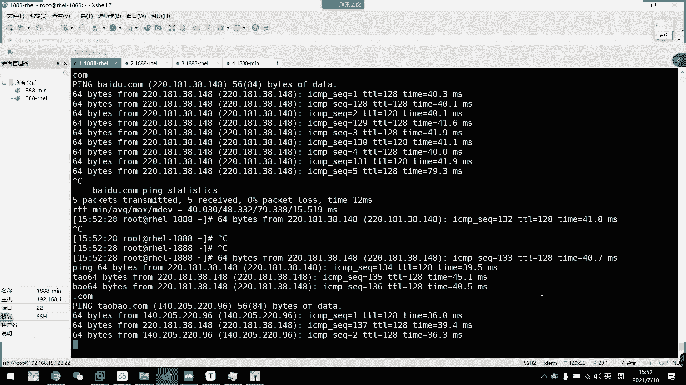
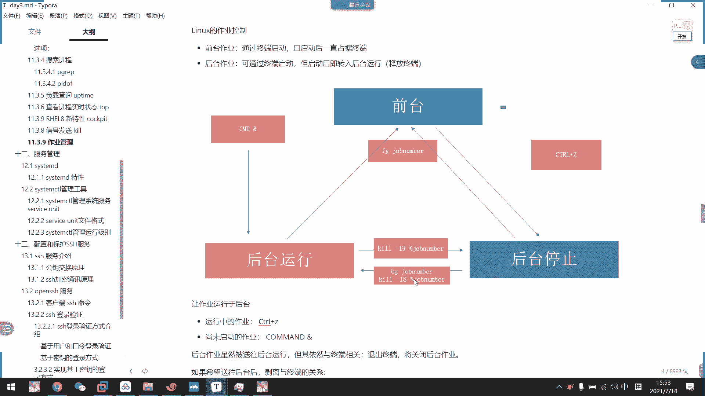

# 2021年7月新版-----RHCE8.2 RH124 RH134 RH294 认证课程 - P20：day4-5 信号控制kill与作业控制 - bili_15701050454 - BV1Gy4y1T7ug

那我继续往下。好。今天往下就是我们的一个信号。管理啊，通过信号来管理我们的程序啊。首先。封信号的命令，我们叫Q啊，杀啊杀死。所以我们有一句话叫杀死进城，杀进程啊，其实并不是杀的意思。

把它通过Q来发送一个信号到系统啊，或者是啊发到系统，然后对这个进程或者做或者其他东西做什么。因为我们信号有很多啊，信号有很多。但是对进程来说，我们可能就这么多啊就这么多。啊，所以并不是说。呃。

他只是单独对进程的。如果你们后面有写第三方应用，比如说是eng啊，就有很多啊，就就就用到我们的1个USR1USR2等等的一些信号啊。都不尽相同啊。然后呢，我们信号名称呢个那个SIG是可以忽略的。

首先我们看一下啊。

呃，新狗有什么呢呃。

应该是Q杠L我看下。啊，你看这样子就可以列出我们的系统信号啊，你看一共有64个信号啊，共有64个信号。然后这里有个6162。嗯。有手。我眼花太多了。啊，这里吧。这些啊都是我们N要用到的。

然后什么信号9啊，信号15啊，我我们对进城的话呢啊有信号9。信号15信号一。呃，723。

这些有时候都要用到，还有18。19个说19。常用到的我都列出来了。重新下载配置文件。然后呢，终止。正在运行的进程啊，终止现在机运行的进程。然后这个是。三啊相当于是我们这个。呃，ctrorl加反斜干啊。

嗯。😊，八的话已经改进了啊，七的话呢是要指定它的一个头。八的话呢，如果是本地文件的话，可以忽略不写fi啊。啊，所以回来不写f。但是HDP还是要写的啊。我就猜到有个问这个东西好。😊，啊。

然后19啊是我们的。休眠，然后十8是继续运行15啊，我们最要的是9跟15啊，9跟1515是忽可以忽略不写啊，它的终旨正在运行的一个进程啊，是一个默认信号，可以，所以它可以默认不写啊。

十五跟九都是沙死进程，但是他们两个有区别啊两个区别啊。就15，如果你这个。进程啊，他有一些阻挡啊有一些阻挡，他会问你他会他会问你一句是否真的要杀死啊，那酒的话是六亲不认的啊，主要是酒的直接杀。宁可杀错。

不可放过，对不对啊？宁可杀错，不可放过啊。啊，反正这两个你就把它当成是柔，一个一个是柔和的啊，一个是呃强杀啊，一个柔和，一个强杀啊。啊，然后有一个特殊的信号叫做孙号林。大家首先要注意一下。

这里虽然列出来啊，但是他们前面有个数字啊，我们可以用数字去作为它的一个信号标识啊啊可以作为信号标识。比如说呃我现在。

执行一个。

嗯。在后面这里吧。P百度点COM啊。

然了我获取一下这个啊。PID哦 pink。获取到他的一个进程号，然呢Q。Q呃。杠0啊，我看一下啊，Q杠0。先看一下您这个信号有什么用啊。对啊。他没有东西反馈啊没有东西反馈，但是我输入一个不存在的。

清常看，你看他说no such啊啊，所以这个0。是一个特殊性啊，它是用于测试我们进程的存国性啊。但是这个功能也比较激肋，他只是看一下有没有这个进程，他并不能查看我们进来状态是否健康啊。

比如说如果他是僵尸派的话，他一样可以啊直接跳过啊直接跳过。啊，所以啊这个比较急了啊比较急了。然后我们信号。15。15。我说我这里先不出实，我直接写新狗。新ing狗。Q 啊我星个q星个什么来着？呃。

十五是什么来着？Single。听啊特明龙的意思啊啊，不是te敏的就删除。T1RM。对哦。嗯。Solo。啊，算了。算了。那为什么？记得告诉我他。啊，这呃杀了啊杀了。不奇怪哦。反正他杀了啊，反正他杀。好。

然后呢。可以默认不输，我们再拼一下啊。那么到这里我们是不是可以用啊不知道进神号，但是我知道它只有一个，那我们是不是PID off。然后是P。

诶。对啊是不是删了啊，是不是杀了啊，然后这里我把信号给删掉啊。

这样就没话说。啊，可能我刚才说的有点问题啊。好评然后15。你看一样不加杠也可以打，你看15，这是我们15信号。删除进程终止进程啊。然后是。9信号啊。9需要强杀啊，我们看不出效果的。啊。

因为我也没有做出一个不能不能终止的进程啊，我也做不了啊。就不是不是不能终止啊，是不能。怎么说呢？呃，就是说那个低状态啊，就是说不可中断的睡眠台，我也没我也没有，就是说啊这里也示的可以发信号啊。

也可以写信号名称啊。当然还有一个啊。就。可以部署SIG啊可以不输SIG是吧一个。就是Q嘛，对不对？我直接写个Q，发个Q过去啊。Q。Q是大型。终止。还有个蚊子缠绕着我。OK这是我们那个信号啊信号。

然后呢呃我们这边还要注意一个。

好的。好，这个是reload的意思啊，重新加载我们的配置文件啊，比如说。咱们现在。

呃。啊，咱们现在。弄一下。改一下备置啊。啊，原。啊，就是我我们SH这个服务吧。而且选这个服务。要他默认端口是22，我这边改一下。呃。改成是80。啊，但是我这个要先关一个那新率啊。

我看一下关我又忘记了命令了。Kton force。也。啊，嗯，先把它关掉啊。先关掉。🎼那么现在可以看到啊是被允许的。然后啊我们不通过重启服务来重新下载配置文件。呀我们现在SS啊给AMTL。

你可以看到22端口是打开的啊，22号端口。22端口呢就是我们SH服务的一个默认端口啊。呃先。不讲太多啊，SSHSS。SSH服务呢，我们后面也是会讲啊这个东西啊，所以我们先不用了解太多。

知到它一个默认端口就可以了啊SSH就是我们远程服务啊，远程服务啊，远我们远程过来也是因为有SSH的服务啊。那么我们现在来。Q。呃。一信号啊。PID。不是不写是D。嗯，好的，直接断开了。我没有重启服务。

他直接乱开。然后我们这边可以看一下。我机器都没有。这边我们看一下啊呃。SSHD啊。ANT2。我这里可以看一下。22端口没有了呃，但是8080也没有开啊，8080也没有开。嗯。为啥呢？看一下。呃。

TEMCTL啊看一下状态。SSHD。啊，他直接哦刚刚直接把这个技城给杀掉了。好那我们把它先开回来啊。但是我这里一改的话。他动我号就要变了。有何变你要变成8080了。对不对？8080。呃，那么我们先。

把它改为。22吧。那为什么不能。这个。这样吧看一下Q。干。一。看一下能不能对配置文件生效的。那个是不行。我用q all。标示的事实。No persist。F。然后一这个没找到。

SHHD他说没有这个进程找不到。诶，为什么了？Yes。AUX。Greatre。那写有是。还真的没有了。啊，又关掉了哎，真的是。那就不能用QO。所以加载。我用不了，重新下载。我现在先应该变回20号端口了。

啊，算啊，已经被22号动了。那他这个服务不能重新下载。有点麻烦哦，这样子讲的话。那我可以用哪个了？呃。我记得。

不是一信号它不会关的呀。无需帮位关闭进程啊。这样吧，我试一下。

这样行不行？呃，PS杠AU。いうわけです。GreatSS。看一下哪个是他主进者。要用。PS7啊。看。佢就。中心城是7320啊7320。测试一下Q。杠一。7320。这顺手没把它给关掉了。

那我现在改一下配色看下行不行啊？SHHSHD。要这意改一下端口。8080。在个。哦，再看一下。改了啊，看到没有？改了。我们也没有断开，对不对？我们也没有断开。呃，证明啊。我们是不需要关闭服务。

让它重新加载配置文件啊，我们也没有动开。他说我退了。就连不过来了，因为我连的是22号动口。他也不行。那么我这把它改回来啊。啊把它改个时候。做个实验。这大家看明白而已啊，Q杠1。7320。回就22了。

然我这里一个连回来来看连回来。ok。那重新加载这个东西有什么好处呢？就是说如果我再连着的话呢，它不会马上给你断，但是也断开以后呢，它就不能再重连了，它也不会把原来的呃连接的进程给你退出去。

这是重新加载的好处啊，重新加载好处。

呃。OK这是信号一。这里就大概是这这种型号了。啊，就大概就这样子呃，讲解的这样子啊。即系 p i d。感就。好，然后是我们的QO啊，QOQO跟PQ是一样的啊。QO跟PQ他们的一个。功能啊是一样的。

就是不需要查我们的PID我直接按照精程名字把它给杀掉啊，直接按照精程名字把它给杀掉啊，比如说呃我看一下。

啊，你看我们先看一下啊。先看一下。怎么开启那么慢的呢？M。😊，ok。那我们现在阿巴奇又开起来了，对不对？哎，我们看一下它进程啊。PS去吧。反正就。直观一点。诶啊对。他一堆进承，对不对？让我们直接Q。

然后是发信号啊，默认信号吧，15嘛啊然后这直接输入HPDPD。Yeah。关于HTTVD列全关掉啊全关掉。所以呢如果有一时候呃我们想关闭一个服务啊，就要通过三级程的方式关闭一个服务啊。

但是我们又不知道它的一个。呃，有多少个，那我就可以通过QO。Q把相关的全删掉啊，把相关的全删掉。啊，这个QO的用处啊啊，它跟PQ是一样的。

跟B6是一样的。比如这里我就不演示了。这里我也是直接弄了个。呃，弄了个。HCP的翻例啊一模一样。刚刚说的信号零啊，特殊信号啊，只能检测存活啊，不能检测是健康啊的健康性啊。

你看即使我们的经验处于停止或者是僵湿状态啊，这个方式都认为它是一个健康的，所以只能检测存货OK。啊，那么我们。继往上吧，讲完这里再休息吧。好。那么最后一个关于进程的啊。

最后一个小点就是我们那个作业控制啊，作业控制。呃，最后就是什么呢？作用正。首先我们呢了解到我们的。作业分为两种啊，一种是叫做前台作业，一种叫做后台作业。什么叫前台作业呢？而就说它通过终端启动。

然后启动后呢一直会占据了终端。

这句话什么意思？就是说我们的P啊，比如说我们的PB率。啊，这是前台作业，我们占用了5分钟端，我们说什么都没有用啊。啊，比如说我要执行OS啊，你看成功吗？不成功吗，对不对？我直接什么都没用啊。

这就叫做前台作业，占用前台终端。

就这么多被占用了，我用不了了啊，我用不了了，然后后台作业后台作业就是说呃把这个。

命令放在后台运行啊，不会占用我们终端。它在后台在运行着，也不影响我们在前台去使用我们的终端进行其他任务啊。O这就是前台作业跟后台作业。然后呢。我们看一下啊，它一个作业的关系啊作业的关系。

首先呢是前台作业啊，我们可以通过指令啊或者是快捷键把它丢到后台。但是呢我们前台不能直接不能直接把命令丢到后台啊啊，不不能直接丢到后台运行啊，它好像我们的VI一样，首先是前台我执行一个命令。

然后呢按我们的conttrol加ex啊，c加ex，它就会丢到后台停止啊，后台停止。啊，中院事后才停止，是stop的状态。我们看一下啊，比如说刚刚那个P啊啊还在运行着，是不是？然后呢，我可始加一线你看。

这里就有一个啊，就说一stop。百度。啊，拼百度点com啊拼百度点com。Ha。然后呢，后来停止以后呢，我们可以通过两个。两个操作让他在后台运行起来，或者是回到前台运行啊，我们先看怎么回到前台运行。

啊。在这讲这个之前呢，我们看一下作业，我们怎么确定我们有哪些作业是放在后台或者是什么其他乱七八糟的啊。我们可以通过一个命令叫drops工作的意思汇程。这里就可以看到我们那个。后台的作业后台的作业。啊。

而且还可以看到这个状态，然后有一个编号。然后呢，如果我想把这个东西把这个工作丢回到前台运行啊，我们怎么办？啊，就用啊forston。高啊阔常高啊一不 g。叫f and吧，应该是f。然后呢，哎我去，然后。

带编号就可以了。有。这就回到我们前台运行了。

我们再诉状。啊，已经没有了，看到没有？以后朋友叫一下庭。这边看一下。与中保跟这个中东无关，所以，他说不了。你看周又回来了啊，又回来了。然后呢，我们怎么让它在后台停止变成后台运行？

啊，我们可通过治理，你看。后台我们前台刚刚是啊forrsst ten啊for ten，然后后台是better can啊啊better can。不要看够啊，就BG嘛啊BG。啊。

然后是加我们的那个啊也是 drop个n就可以了。但是它有两种方式啊，一种还可以通过信号技术运行。我们早上说了，刚刚也说了十八就是技术运时的意思啊，我们看一下十八信号。十8信号，你看继续运行啊，继续运行。

我看一下，没有不是，首先是BG1。对。

虽然感觉到他是占用了我们前端对呗嗯。但是我们可以看到他的ds。

他是多了个N啊，而且他说呃状态是把meing执行起来，然后多了个N，就是后台运行的意思啊。然后呢，虽然他是这样子这样子，我们回撤回撤回撤回去回。

你看其实他前端是给我示放出来的，只能把后台的东西显示出来啊，他这个命令把后台的东西给打印出来了，我们执行一下。啊，有会。

其实他可以执行的啊，我再拼一个也可以啊。

出来没有？啊，我就再把第二个啊，我这一次不拼百度了，我拼其他东西啊，拼淘宝。行不行？

又丢丢在后面，你看就事后他停止了后停止。

那我想让他这个。呃，拼百度的在后台地址啊，我们就。

通过信号吧啊。呃，用Q吧。杠。19。然后是。要知道他的PID。平。哎，输错了。PIB off。搞定。是不是哎，怎么只有一个jos了？啊，两个看到没有两。一个视频淘宝。一个是。骗我们的百度啊。第个。

然后我们现在啊把后台停止的任务啊，通过信号看一下啊，这里要注意啊，这里有个摆放号啊，我们试一下吧啊。

呃，Q。18。百分号。2。诶。为什么停止？哦，刚才没找到他把他给删掉了。就B。把那个删掉。呵。😊，重新来一遍啊。拼淘宝。诶。输错了。要得。对啊，那肯定。😊，所以这个没什么意义，只会让他演示出来看一下。

让他演示出来看一下。我们通常后台运行的话呢，一般会丢到与中东无关的。好，然后呢呃。Q。但18。然后是。白风好。不。刚刚为什么我这个变成停止了，我可以我们可以注意到这里啊。发题的。哎，我这看到这里。对的。

先把它停掉。Q。干。18啊，不对，19万。打工号。希把停掉了。是因为我们前面是这样子的。那为什么它一运行就停了啊，可以注意到这里是个减号。减号呢，其实我们把这个镜头给删掉啊，就我们把这个减给删掉。

所以我这边啊他说就说没有这个pro了。因为为为什么呢？我们前面是输了一个。

呃。说到就 history。我说一个什么。啊Q pin啊，他 pin所有有关 pin呢都给。听到了。啊，所以他就把他给个删掉了。我不知道十9是停止而已，为什么会删掉？What's why。没有其他操作。

回家。呃， shops。然后是。你看这里有有一个减啊，这里有个减。哦，他可能是后台运行，只能运行一个。没理由啊，不是的。B居。依据一。那看哦哦并不是啊并不是。并不是然后他又后台运行起来了。

아个啊要冇同去。O。那我就Q。

暂时就。

来PID off。

啊，这个哦它是一个顺序而已。啊，加的话是我们最后一个减的话是呃一些冗余啊一些冗余O。

那么就啊讲到了一个后台。后台后台后台后台运行后后台后台停止，还有后台运行的那个两种状态之间的切换。然后呢，我们把后台定回到前台。也是通过FG啊。

连通过FG哦先把它运行起来。

两个一行就行。搜两个星。

啊，是两个一起运行了。那么我们就FG1。

所以丢了一个前台了，然后是FG2。少了个空格了。证据一。然是。好，现一下恳tro加期能不能停啊，看到没有？停了一个。对。有一个没有丢丢丢过来的。你看还有一个淘宝啊。

🎼就说他刚刚那个呃这个没有没有把全部都丢到，没有没有把全部都丢到。那么再来FG。一啊不行，啊FG都才行了。F区2。OK丢位先单了，然后再结束啊，搞定。那不行。好，然后呢。呃，经过后台运行啊。

还有一种方法就是我们任务运行前啊，我们在后面加一个end，加一个end就可以把它丢到后台运行了啊。比如说呃我这边弄一个不占终端的命令吧。

呃，但是要持续运行。就滴D吧啊，迪弟。F等于。E v is a优。多等于。给你。冷。啊，然后是。嗯，不用加了不用加大小直接。把它调到后台就加一个 l。啊，我们先看一下不加，你看它就一直在运行。

一直在运行啊，一个是零设备，一个空设备，就相当于我我这个无线输出，这个是无线输入，所以它不会停的，它不会停。所我们取消掉啊，然了丢要后台运行。这个你就不会占用我们终端了，对不对啊，这是所谓的后台运行啊。

然我们可以看一下ds。不是有个问题吗？啊有做个 m。是的。这就是我们的啊直接启用一个后台运运行的任务。

然后最后呢还有一个与终端无关啊，还有一个与终端无关。我们写一个low hard low hard。

刚刚我们。先把这个停掉啊呃。这些。没有的。到。刚我们P。这个动作就是我丢到后面，它只要有输出，它是不是还会会打印出我们中端，它只是不占用我们的中包。但是他有打印信息啊，一阳是打印到我们中东，对不对？

颜是打打印到文中中。那么。

我们如果。他为什么要打印到终端？就因为它与终端有关啊，与终端有关，所以它还是会显示信息出来。那么我想它平百度也在后台运行啊，而且不占用我们终端也不打印出来怎么做呢？那我们就要建一个与终端无关的。

与中东无关的。给我。怎么做啊？直接啊前面加一个漏号。漏。好，这就以中的5方。

哎，我输错了吗？

No how come。没关系啊。

捞下。

然后后台运行。我刚刚没有获到运行吗？有啊，让我们看一下有没有这个进程啊，B杠啊A啊，然后是grapy。怎么还与中东有关的这个任务啊，但是他已经被打印出来了。估计他这里现在只是。弄了个啥来着啊，弄了个啥。

呃。但是我重启了，它这个就又没有了啊，对不对？啊，所以先不用管它，但是他的确没有在占用着我们的。啊，的确没有这样子，我们做到，而且它还是运行着的啊运行着的。对不对？所以不用管他。啊好的。看一下还有没有。

啊，没有了。啊，这就与众刀无关啊。但是他。还是显示出来，但是没有占用。其实他这里应该给个问号，我才对啊，应该给个问号，我才对。看一下我们的一个。我这里没有没有没有没有ID来说。

不过我们删的就是的确要删了这个嘛，因为。不见了那个不见得。好，可以。或者我们试一下这样子。然后是。如果说是病频啊。でそれ。等等。看一下行不行啊，我没执行过这种。我是没执行过这种。跟着你们一起做实验。

跟着你们一起做实验。其以中的五官应该也不需要丢到后台的吧。我看一下。呃，试一下不丢的，这个西。那不行啊，他会占用前端。好者。啊，因为落号本本来是一个命令啊，忘记了，所以其实这个命令是把落号带丢到后台。

把陆号丢到后台。Not input and panda。2。哦，那我现在重启。看一下他会不会生成一个与众东无关的。进城。好，开下。PS嗯。Wpe。你呀那不就变成问号了吗？这就与中的无关啊。那我现在把。

都で算。没有。OK那我们休息一下啊，休15分钟，20分上课。

