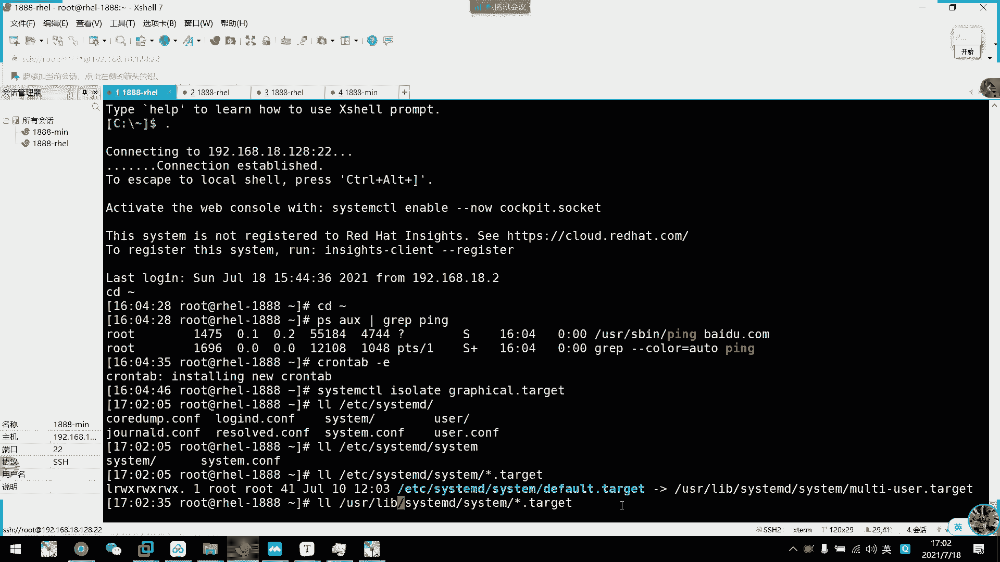

# 2021年7月新版-----RHCE8.2 RH124 RH134 RH294 认证课程 - P21：day4-6 服务管理 - bili_15701050454 - BV1Gy4y1T7ug

我们看一下啊。今天下午最后一个内容，服务管理。服务管理的话，一节课讲不完了，估计。啊，估计也。讲完应该也可以讲完，我们看一下吧啊，副务管理。呃，我们前面说了呃，我们。

现在7以后的第一个进程是我们系统D来管理啊。第一个进程是我们系统D1了系统D的特性啊，是从7版本之后开始用系统D来实现我们inter进程。

然后系统启动和服务的一个作为作为我们的系统和服务的第一个首部进程管理器啊。负责在系统启动或者运行的时候呢，激活资源，然后服务进程啊，还有其他的进程啊。早上我已经讲过了啊。

我们开机的一个并行概念啊并行概念。然后呢，我们可以看一下我们系统低的一个新特性啊，新特性由我们系统引导实实实现服务并行启动啊。早上说过了，然是按需启动锁务进程。啊，就是说我做完一个服务啊。

可以指定到是否启用啊。有啊。自动化的服务依赖关系管理啊，自动化的服务依赖这种业管理就是说。呃，让他开一自己之类的东西。然后呢，这里可以同时采用我们的一个单元啊，或者是Dbuss总线来激活服务。啊。

然后是shopocket的单元呢与服务程序分离了啊被分离了。啊，然后是可以向后兼容我们的int脚本啊int脚本。然后呢。这个进程提供的一个工具啊，叫做system CTL啊，进作为我们的一个命令行管理。

然后呢，它的。命令固定啊，那个命令是固定不变的啊，不可以扩展啊，不是由我们系统第。其他服务是没有办法啊，跟我们这个工具来通讯。然后呢，还有一个系统快状态快照。首先我们来了解一下semD的一个核心概念啊。

叫做unit。所单元。单元要Uit表示不同类型的一个。呃，职业对象。这种对象，然后呢可以通过配置文件进行标识和配置。文件中主要包含了系统服务，监听socket。还有我们的一个保存的系统快照。

以及其他的与in相关的信息。啊，所以我们看一下呃我们的un类型有很多啊，但是我们初学的话也不需要关注太多啊，最重要的是一个service啊service。然后另一个就是我们的sockcket套节子。

通讯文件。啊，其实这个也不需要太关照啊啊，不需要太太过关注他啊，然后是他给的这个就比较重要一点。啊，反正。啊，还有一个device啊。这是个。这是是我们比较关注的，其实也没有啊。

就是主要我们采用的还是service，还是so机的，还是他给。他给他给呃。可能我们没有感觉啊，等一下我讲了就有感觉了，就对对于对于这个可能好好像没有什么时候用到过它啊，等一下讲了就知道了。啊，首先是。

呃，关于单元的介绍，我们单元有服务单元啊，特别是单元，还有那个呃标签单元啊啊，还有什么。呃，设备单元等等之类的东西。然后呢，服务单元啊是定义服务用的啊，定义性统服务啊，它的后缀名为service。

然后呢，这个是定义进啊定义服务通讯啊，定义通呃精程接通讯。所以就是我们的一个服务通讯啊的一个。文件就是我们前面所学的一个套接制文件啊，套制文件。然后。他给的个。它可以模拟实现运营学员0到6啊。

其实我们7以后呢，就没有IIT0到6了。记得我们第一天学习的时候啊，临时切换终端，是不是输了这一个东西？啊，其实他是由我们这个他给的模拟的模拟出来的啊，其实他已经没有了这个IID0到6了。

在我们这里叫做win level啊win level。我们现呃主要关注的是这个我们这个课程里面主要关注还是这三个。啊，然后我们看一下关于uni的配置文件啊，它存放的位置啊有3个啊。

一个是usernet systemtem啊，D的 systemstem下。然后呢这个是存放我们的一个服务类脚本啊，服务类脚本其实就是我们答建文件。其实我们答建文件。带文件。呃。

然后第二个是放在内存中的一个run system第 system。啊，这个是用于我们生产生产的一个呃执行过程中产生的一个服务脚本啊。比如我们比我们上面那个目录是优先级要高。

然后最高优先级是我们的ET机下的sem systemst。啊，由管理员经历的一个资行脚本啊，其实我们主要关注这一个，还有这一个常用的就这两个。然后呢。这个性级最高的我们一般。是一些管理上的服务了。

才会放到这里。其余的呢我们用户自定义的啊，一般都是存放在我们这啊这里啊，存放在这里。啊，其实放在哪里没所谓，只是一个运行优先级制呃的一个差别而已啊，其实放在那里没所谓。啊，自己规划好就可以了。

这里没有一个强烈要求啊，就好像我们呃把我们的环境面料脚本到底放在beRC上，还是pro呃proD下啊，这个是没有冲突的没有冲突。好。然后呢。我们了解了一下呃这D这个概念以后呢，我们看一下。

它的一个管理工具syst CDL啊。设7L。首先我们来看一下用来管理我们的服务单元啊，管理服务单元。它的命量格式是Ss等CTL加com，然后是加我们的服务单元名称。

啊，比如说。我这里啊刚刚不是装了一个coie的吗？꾸げ。会给的这一个单元，其实它是一个单元文件来的。我们可以看一下，呃，应该是放在看一下有没有找一下。が那。是。嗯。COCKPIT。新。嗯。

Fucking。看错了。都走。看一下他放在哪里啊。这些都是他一个介绍。service啊你看啊它是放在我们 user line system D system下面啊。啊，这是他这是他的答应文件。

我们可以看一下。O开始。不好意思，稍等一下。好，这是我们这个。呃，service的单邮件我们可以打开看一下啊。呃，先复制下来。对。诶。没装狠。We are。系啊。啊这是它的一个服务单文件。🎼呃。

这里就先稍微的看一眼就可以了。呃，我们这个课程也没有要求说啊要学会怎么写啊，一般我们都。只会讲解里面的内容啊，然后写的话呢，我们就算在生产中。二进制安装工具以后也好，我们写单元文件都是抄样目出来的。

通过让务安装，然后它只是一个配置文件，指定的路径不一样而已啊啊。所以我们呃这个单元文件我们开一下就可以了。要抄的，一般都是抄的。啊，没有人会研究怎么去写它，也不会说没有人去研究啊。啊。

到时候我们了解一下可以了。好，这是我们大泳件了。

O。然后呢啊我们可以通过这个命令来给他进行一些操作啊，进行一操作。嗯。好。

怎么用呢？我们看一下。呃，systemCTO然后加我们的com command什么呢？啊，比如说stus查看状态。啊，后是加我们的服务大学名称。啊，然后如果是service的话。哦哦，这里没有补权啊。

他可以把后面service给忽略掉，我们直接输这个就可以了。没看目前没有启用的。

Hei。啊，那个没启用，他用了其他方式启用了这个服务啊。好。反正我们等会开了啊，我也知道他是什么来着。啊，OK啊可以看到状态。啊，他目前是没有加载，但是他被漏了啊被漏了。等待等待呃不下载。呃。

然后呢这里可以查到它的单元文件路径啊，单元文件路径，然后啊是静态的，然后是可以设置为inable啊，这个diable是那个其他东西的。它只是死啊它的死啊，我们这里可以看到它的一个状态啊。如果是运行中啊。

它这里会有一个in chief，然后是winning啊，winning这样子状态状态有很多种啊，有ist啊，有winning啊，有呃loading啊等等。然后他是啊有个时时间啊，进入这个状态的一个时间。

从从什么时什么时候开始啊，就这从15点上我们开始啊，已经有54分钟啊54分钟。啊，然后它的一个相关的面文档啊啊，在我们这个coed杠WS。第八张。啊，然后他的什么进程啊啊主进程啊啊等等。啊。

O啊这就是我们的一个呃。嗯，服务。service target给的一些相关状态啊。🎼OK然后我们继续往下看一下有什么命令啊。好。呃，其实这个很呃这些。命令单词都很直观的啊，首先是刚刚那个st是查看状态。

然后呢开始star嘛停止stop啊，然后重启visstar，对不对啊，然后禁止自动和手动启动啊，mask我早上说了遮遮挡嘛，对不对？遮挡。嗯，然后。这个是查看。呃，服务是否存活啊，查看是否生活。

然后呢这个查看啊已经运行的一个服务啊，查看服务。啊，但是我们要接他的类型啊。unit啊单元类型就是杠Tservice然后是查看所有的服务啊。嗯哦。呃。然后很直观的还有什么呢？啊，enable。

就设置为开机启动啊，开机启动然后关掉这disable啊，diable。嗯。然后这个查看它的一个开自己状态。啊，列出所有的这是列出所有。啊肯定是设备单元啊。我们目前讲的都是serv备是单元啊。

一定要注意这个。然后呢呃这个是。在哪个运行级别启用？怎么是L哦哦，没错LS啊L没错好，然后。呃，是是否设置了开机字体啊，然后列出失败的。服务。然后这里是。嗯。设置它呃开启动，而且还必立即运行啊。

然后这里是呃关闭开日起呃，立即停止，立即停止。我们看一下刚刚说的那些东西啊，看一下。首先呃是我们看一下有没有这个呃。

STATUS。啊，没有啊，我装一下装一个服务。胶做287的HPB。啊，这些装装上来，我们就拿这个来玩啊。系徒石了スtィズ。这情证据规定嗯，你看。啊，他直接是对死，是死掉了是死掉了。刚才那个也是死掉。

就是没没呃没没有没有运行啊，没有运行。啊，然后呢我们可以看一下状态。System is achieved。看到没？应该去啊，就没在运行。好，接着我们启用了系统CTLstar。对给你。然后是。再看状态。

Studs。的决定约定。看到没？啊，备注问题呢绿色win理，然后是8秒之前开启的。然后呢，这里diable啊diablediable进行证明它不是开自己啊，那么我们现在啊重启一下电脑。好，终级完成。

让我们看一下。SYSENC2ts。再说这没录。对。没有启用。那么。我们现在看一下。Enable以后他做了什么东西啊，SYTEMCTL enable。不行证据约定。啊，看到没有？他其实做什么东西？

就是creed一个软链接。呃，是这一个他给下的HTVDserv。然后指向了我们的单元文件啊，就其实就是这个文件是源文件啊，创在在这个目录下，在这个目录下创建了一个软链接啊，创一软件，我们看一下是不是。

我看下。是对。然后再选。定。忘记调空格。嗯。诶。啊少了个根号。看到没？我们刚刚说了。

刚才说了这一个啊。Yeah。面积为上使用。这个就是自自体，觉个这个就个自体。

然后呢，他是通过我们的这个呃mius，他给。其实这个我们第一章没有细讲啊，因为还没讲到这里啊，其实这个就是我们的文本终端的一个他给嘛，对不对？啊，后onon就个依赖嘛。这不是依赖吗？然后把它全放到这里。

那么我们启动了这一个t以后呢啊它就执行这一个软连接，然后指向这里，那不是啊。开机运行啊开机运行我们这一个service嘛，对不对？对不对？OK这个是 enableable，然后我们所以呢再重启一下。

看一下。嗯。😀呵呵呵。😊，这么慢点。看了，他最后连一次连的应该是。这个跳文应该连连上的。还不如我手动。嗯。咋还没好呢？可以。然我们先在看一下状态。嗯。嗯，看到开字体，然后呢。

我们这里变enable了啊变成enable。那就可以执行。啊，然后继续。往下看，那么我们现在把它删掉开就行，那不是di。Sa。那么呃按拉底示A其实他做了什么操作呢啊，大家能猜到吗？嗯。

这个我也没有去了解过，因为这个信息不重要，我也没了了解过啊。保修了那么久，我都没有看过他啊。对啊，是删除软件夹啊，删除软件件。对。其实你不就做了个这么个动作啊，这么个动作。好。那么下一个啊。

就是我们的m啊。啊，我们看下先看一下状态吧。我只是DC不掉啊，所以他没有被停止啊，所以他没有被停止。变成diable了，看到没？好。那么接下来呃我们来个。先把它停掉啊。先关掉这个服务。好。

然后我们现在在。Mask。HTB。对啊。他直接。在我们这个。下面呢把它指向呃把它创了一个软链接，指向了我们的DV浪啊。点于啦。那我们是不是直接等于执行不了，到找找不到这个文件嘛，对不对？这又被遮挡了。

好，然后。解除遮挡。其实也就是删除裸链接吧。对不对？啊回部分。

O这就是这挡。

啊，还有什么呢？嗯，虽然这些介绍过大其实它不是很常用的，到时我们也看一下吧。

呃，杠T service。

把它列出所用。没说包括有个失败的，因我关掉啊，记得吗？我关掉了。我们我们装系统的时候，我不的手动把它关掉吗？ok。接着往下。嗯。这里可以查看所有啊，直接把它改成。价哥刚刚我6。都是杠A这是所有的。

直接说了吧。不是。开始也加了，这里也加了。呃，这里我们现在看一下有什么服务是开自己的。

Leist unit five。看不上。🎼其实他把所有都列出来了，但是inapable就是开字体的啊，不是inable，就是非开字体而已。然后静泰的呢就按序启动了。呃，其实也相当于是不是开这些而已。

我看一下找一下SHHD啊。S s HD。对我们选原程服务啊，看到没？他不啊不不是营业部啊，就营业部了导致他。我们他一开机，我们就可以远程过来嘛，对不对？

如果他D哦，还要到系统上面把它给启用起来，然后再那个。嗯。然后呢，指定一个服务，看一下它是否可以启用了。

啊，比如说。

打个协议就没这样。都diable了，因为没有开子去。然后这里显示我们失败的。

啊，这不是这个吗，对不对？

ok。呃，查看依赖。依赖我们可以看一下啊。

查依赖。比如说呃我们看一下coookie的COCKPIP。靠依赖啦。🎼所我们首要依赖这个系统嘛，然后呃in the target啊啊。什么。呃。没有什么没多少。其实也不用太关注这个啊。

呃，我们起不起来就。呃，去查而语就可以了啊，然后刚刚说的diable刚刚那。

呃啊应该我刚刚唠啊 SYD andCDRts。对对对对。啊，目前我这个是没有运行起来，对不对？啊，而且还是disable状态啊，disable状态。然后我们这里说一下。啊，En。尴尬不闹也选这个。

看到没有？啊，这不就是。开机启用的啊创建的一个软连接嘛，对不对？要我们先看一下状态啊。嗯，快了没，运行起来了啊，就是。立即运行并设为开启用。有。sstし。Disable。え。这不就是把人链接删了吗？

百之三。然后。嗯。然后。并且把服务给停止了。对不对啊，复议自体。当错。然后呢，呃我们财务命令呢基本上就是这些啊，财务命令基本上就这些啊。

其实最常用的还是enable。bevowe start stop start啊t最常用的就是这种。ok。然后这里呢给我们的一个状态呃。进行一个解释啊，首先是load啊。说大约配置文件已经处理了啊。

已经处理了。然后呢achie问啊，就是一次过者多次持续去持续处理的运行。聊了ea啊，完成一期适应的配置啊，就是它运行了完成成功退出了。要是woning啊，等待一个IO啊，刚才说了啊，刚才收过。啊。

有这三种状态啊有这三个状态啊要是应该确保这步运行，enable啊就开启用disable的快机不启用啊，大理的开机不启用，但是可以被另一个。启用的服务机口。啊，然后是处理上。嗯。In。啊。

这里有放碟其实也没什么需要放力的。好。然后接下来我们看一下啊。关于单元的格式啊，用点是文件的格式。主要是主要还是看我们的服务单遇啊，服务单元。所以是单元的一个格式说明啊，以井号开头的是注释啊。是注释。

然后呢可以引用布尔兹或者或者就是yes。哦们出啊就是开始。啊E啊 e啊 e e w多钱。然后零啊，no啊of啊， false啊都代表关闭啊。然后呢。时间单位默认为秒，所以要用毫秒。困人分钟等需显示说明。

呃， servicevic。哇，突然间很大风啊。好，然后呢。😊，我们service的单元文件呢有三部分组成啊，一个是unit，一个service。

一个是instore啊啊unit呢它这个字段是用于定义我们的一个依赖关系啊，以及呃描述啊主要是描述。描述有依赖关系。然后的serviceservice。🤧啊，这个是定义我们的一个服务的相关环境啊。

就是说比如说他一些配置，比如说他从那里读取配置文件啊之类等等。啊，Linstore这个知道。啊，就是定义由我们现场CDL enable或者是diable命令，实现服务启用或者即用时用到的一些选项。

那我们看一下U里的常用。常用选项我刚刚也说过了啊，首先是没用信息，然后呢是依赖啊，这些都是依赖。哎，怎么下过去？啊，这些都是依赖啊这些都是依赖。after大家定义我们这个单元。是要在哪一个单位启动之后。

啊，rescue啊就是他要依赖哪一个服务。就哪一个单元啊，其实单元就你可以把它当做是一个服务也可以啊。哎就说呃这个是强一了。如果我上一个单元没有起来，那么他这个肯定起不来。I also warmth。

啊roose这个是比较弱的依赖啊，弱依赖什么意思？就算我依赖的那个单元，他没有起来，我也可以强制手动把它敲起来。啊，要是空。Ftest。啊，定义我们约理时间的一个冲突关系啊。啊。

比如说我们的一个lework呃，我们的le wall manager这两个啊，所以我们现在把leve呢啊从8以后呢就把leve。这个服务改成是一个ta给了啊，就不会冲突了。啊，但是也同时也不能。

启启用两个啊。哎，不能同时使用呃料窝呃，还有。leever manager啊，如果这样子的话，他们服务上没有冲突，但是他们功功能上冲突了功能上冲突。好。

紧接着是我们service store啊service store啊service store。呃，一个小水啊，所以是太。太了啊。影响我们S star啊S star这个是最常用的啊最常用的。这啥子。

这个就其实指向了我们的一个啊要运行的命令或者脚本的一个绝对路径。其实就是我们。这个。

🎼服务啊他一般会提供一个命令嘛，对不对？好像我们的HTVD其实它有提供服务的，启用HTVD这样子。啊，然后他有它的一个止选项。这个没有。佢这。啊。

特别是资损上啊啊有一些可能会有一个杠C来读取他的配置文件啊。来，你看看到没有？不是我说啊，他就是这样呵。啊，多取配置文件。这般这些一般都是我们呃二进制安装的时候需要定义的。啊，我们直接安装的话。

其实不需要怎么定义啊，还是看一下我们的单元文件。一笔是。Useer live。System。第些四。然后是HTTVD。Soです。诶。嗯。呃，应样可以看到啊，你看S star。

然后呢HTTVD然后指定了一个内置变量，然后做了什么东西。

🤧嗯。好。呃，然后其他的这些。其实很少用啊，这个很少用啊，太很少用啊type也很少用。了解一下这个啊，你看这里直接落地ify啊。50厘。就是在啊启动完之后会发出一个通通知消息啊。

还需要配合这个loify access啊，还有些省地接受信息啊，就是接接受消息啊。好，然后呢是我们这个环境配置文件啊，就定义它的一个。环间面料。呃，然后呢。Is star pro。

要在我们exstar前面运行的脚本或者命令啊，po啊就是在后运行啊，我们要记着这个pro跟po啊，一个前一个后。啊，主要是到时候我们讲的S5的时候呢，它有一个。呃，事物啊或者是角色。啊。

这个也可以定义到它在决策前还是在决策后啊之之类的呢啊，然后ex stop就是说我要停止这个服务的时候呢，运行的命令或者加本啊restar。啊，如果这个设为一，那么我们的一个服务发生意外终止后。

它会自动重启啊自动重启。嗯。啊，然后这个是priide temp，就是说如果它是y就会生成一个临时文件啊，临时文件。跟他一个相关的跟这个单元相关的一些信息临时信息。好，到底是多少制动呢啊，一个是别名。

啊baby啊可以用于我们系统CDL，然后什么点service啊，比如说我们HTVD啊，把把它改成HTV点service也是可以的。但是没必要这么做。然后。被什么依赖？就是说如果我要关我要开啊。

也要控制好这里强依赖还是弱依赖啊。啊，要是Oso安装本服务的时候，还需要安装别的相关服务，也是依赖啊，但是它这个依赖是安装的时候的一个依赖啊。如果我们改了这个单元文件呢。

是需要我们一个demo re录啊啊，比如说呃这是HTVV第一的。

🎼你看他就依赖于我们这一个。呃，文本终端啊。呃，他给。这个我就不改。呃。我们可以改一下。🎼CO OCK PIT。Soervice。我可以改一下这个，你看呃，它这里有一个强依赖的。

我们这里把它改成弱依赖啊。

是不是忘死？若依依赖。

这里也改成ro。🤧嗯。对呀，我现在要开这个服务是开不了的。T ARP。诶。那怎么开起来了？我不是改了这个东西吗？我好奇怪啊。嗯。对啊，他要重新读取消对呀，要要用de铺遗录，我改了uni的。

他直接就起来了。算了，我们不看这个了，我们看另一个。呃，看一下在这在不在这里。嗯，一实。我在这里。还有再入C那个。证据在这里。对收一下。我们改一个。我这个字真的奇怪啊。🎼随便改点东西吧啊。

他要做网络服务后面还有一个。K个人他ing后面。🤧启用。我不知道改什么好。这吧。我们改他的。他不它说给点。

还了。他说他这个刚刚说的是什么东西啊，定义U你的之间的一个冲突关系啊。

啊，他跟我们这个服务是有冲突的。然后呢，我们再把这个关掉啊，不是把这个改掉，改成88。By the you。有咯。呃，是这样的。不谁。啲点他。个消け的。大下直接。出问题。他怎么不让我重新加载。

就给我出问题了。好奇怪呀。我看下。🎼对呀，我知道要遗漏啊。哦哦现在这个问题不是不是不是遗漏的问题啊啊，现在这个问题是我们的Slin啊。他另的겠어。我一开始。

你看我说 a些那个。这是一个不安全的端口，端口，所以它开不了。Se。多是。那我现在可以起来了，看到没？但是他不用我登录笔落这里，我真的是想不明白为什么。呵呵。😊，诶。我第一次遇见啊这个情况。

我也触手不及啊啊措手不及。C条。呃，我。SS杠ANP。你看88号都开起来了，然后呢，他跟我们的呃service冲突了。跟我们设备冲突了。啊，他这个根本没有错，怎么排？它包个错样啊，根本没有错。

demonv漏这个通常我们改了呃，改了改了uni的，一般都是要damon re漏的，它会提示demonv漏的。这我真。想都想不明白，哎呀，20号洞口没有，因为他冲突，他直接把2号洞口给屏蔽了。嗯。

我们现在看一下啊。呀直接把这个关掉了，我看了那一个就关了这一个，看到没有？我现在开开一下这个，看一下，他给龟微发。

啊，这个开起来了。那么我看一下。啊，88号动我就关了，对不对？88栋我就关。然后我们再看一下这个。哎把这个开启来，然后呢。再看一下SHD啊，有关了，就他们有冲突关系啊，有冲突关系，所以他直接关掉了。

那么我们现在写一下。不要。优势。Lfe。这到地。就是度。表是SHHD点。嗯。😊，嗯。怎么不在这里？S SH。哦就 so掉。我现在把这个注释掉。啊，这次就要我堆莫米露了啊。这个设计要丢丢5迷路啊。

看到没有？等我有。We start。有。把 service为删。看一下能不能同时清来。直接看豆口就好了。

22跟88同时存在。

OK那我继续往下看一下。呃，没什么好讲啊，这是我们的一个服务管理。服管理。我们主要还是管这个就可以了。刚刚那些单元我只是给你们做一个简单的介绍。啊。希望你们以后呢啊也多用二进制去编译管理安装啊。

编译编译安装我们的应用。然后呢，这个service就肯定会经常写啊对会经常敲啊对，会经常抄会人抄。然么服务我们这边就先抢写哦。还要提一下吧啊，拖5分钟好吧，拖5分钟。

系有个 target 啊系有个 target 。他给啊，这里就拖一下就好了，没没什么好讲的啊，这相当于是我们之前的一个win level啊，就是我们INID0到6其实。

他这里也是把我们的文件写成它给显示了啊，所以是0。123456啊对应的什么？您是关机嘛，一就是救援模式嘛。2就是呃2到2到4都是我们的一个文本格式。然后5呢是图形化啊，六是重启啊，六是重启。

然后呢我们可以通过。呃，这个。啊，临时临时切换临时切换。

协条。呃，SO late。I so late。然后是比如说。叫什么来着？

嗯。改不了。令家杰。没理要重启啊，我这里没有图形画。

好，把它抄抄抄到对面去吧啊，这里有图形画。TM。CTO。Isolate。然后是Ggraph。需。

Jo。作拼啊。

需要A。P， H ice。0。是不是？我笑。

，怎么切过来看一下。再去吧啊，再就。

变同形化了啊，其实就是我们INID啊，记部记录可以。但是我们一定要知道我们7这个他给。其是我理解，我们看一下。应该是EDC。えシシスト。然后是。先。他。就一个啊就一个de啊，就有deor设这。

那我就去user live吧。

可了在这里。啊，在这里。可以，只要我们可以写when level啊， one one level你123456啊都可以。这就是我们的一个弹啊，它实际上是指向这里啊，放在同一个位置。每个都放在同一个位置。

That。Re both。嗯。😊，啊，在这里啊在这些啊，看到没有？🤧嗯。这就是我们的一个。呃，运行这别。然后呢，我们第一天可以讲过了，这里可以查看它的一个。呃，只有我们默认的。

他给了也可以get default，查看我们默认的他给的什么。

对。Before。你这不是吗？然后s也可以把它更改啊啊，但是这里一定要注意啊，千万不要改成这三个。啊，这三个是万万不能改。不然机子一直开不起来啊。啊这不条。当然我后面会教大家，如果误误改了。

怎么怎么救回来啊。我们讲到救援模式的时候，就会讲到这个东西。🎼那么大家啊学完这一章就知道这个stemCDL啊，为什么我们第一章可以设置了啊，是因为它可以管理他给啊。刚刚呃还有另外一个。

关于套一句啊关于套一次文件，我刚刚不是写了一个嘛啊，改了一个嘛，那就说明了一个什么呢？它是管理我们一个通讯，然后呢我把它端口开了啊，它一样。可以出去。啊，通过我们包包通过可通讯啊。

比如说我们现在呃挑了一下啊。

什么意思？调亮192。168。点18。129。

88栋路。嗯。哦，美刮仔。我说难怪。

说一下。好，最后这一个演示，我们就下课啊。嗯。啊，有防火墙啊。对啊。是不是这是通过我们啊有这个就已经通讯成功了嘛，对不对？那这个就是通过我们的套一支文件来通讯的啊。按scket啊。

通过我们的scket的通讯啊。

那我们服务就讲到这里啊，既然能在40分钟内讲完我们的服务啊，牛逼牛逼牛逼，那我们下一周再见啊，下一周我们讲一些比较安全的服务了啊。好。同学们，再见。

