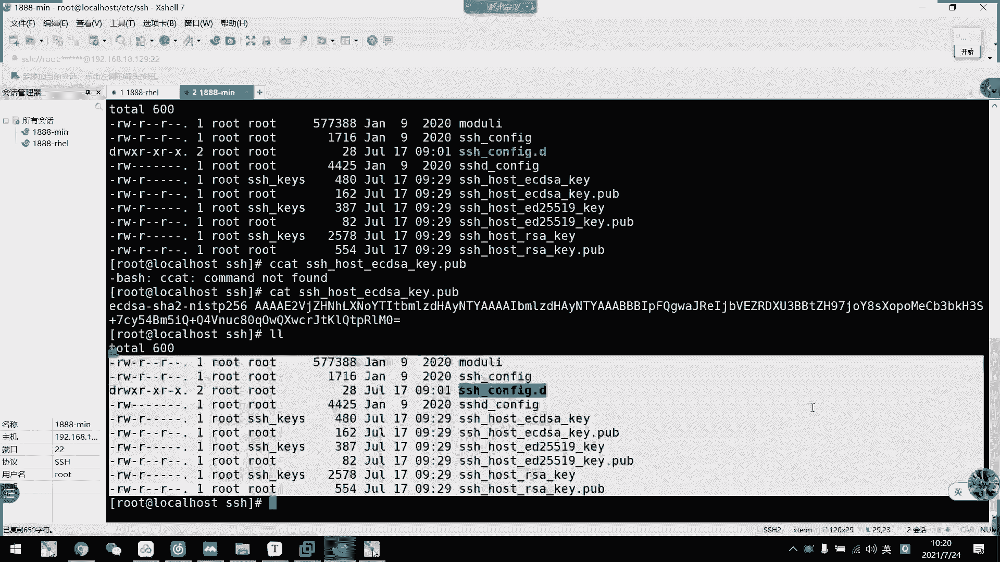

# 2021年7月新版-----RHCE8.2 RH124 RH134 RH294 认证课程 - P22：day5-1 ssh服务介绍以及基于密码远程 - bili_15701050454 - BV1Gy4y1T7ug

来，我们先回顾一下上做效果的内容啊。啊，还有呃王科同学呃，今天是第一天来，你补一下前面4天的内容啊。我们讲的也不是很快，4天内容不是很多啊。那我们来回顾一下上周效果的是内容啊，首先是。关于。进程状态。

查看。好，首先。工具。工具就我们的PS。然后采用组额。房主啊啊，可以是哎。B。AX。或者是PS杠。椰父。查看。按自己。风格。风格。定制。序列。啊，是PS。好。PS。嗯。A。抄啊。啊。

然后是什么百方2CPU。CPU逗号。讲后。系咩等下。然后是PID啊。优舍啊等等。啊，这个是什么意思呢？啊。呃，首先是CPU利用率。然后是内存利用率。然后是进程的PID。优er。进程的所展。🤧呵。

然后呢啊PSAXO啊还可以。啊，加一些选项，比如是。杠K。啊，然后是比如是。方CPU啊。这个是。异议。CP u。利用率。升序排序吧。如果啊是。付的。看鼠标。啊，那么是以。呃，CPU。利用率。这样去排序。

啊，然后。下一个工具啊是我们的PST。都是以。诉请。结构。列出。进程。常用的选项。第一。列出。嗯。PID的。进陈述。唉，怎么又切回这个了？然后是。U吧，AU吧，是不是？我看一下。我忘了。

我一般都是只按P的。PS7。是不是这有。显示用户切款，你说。提啊不显示。现成的。高亮。也是。裤子。不清楚。羡路。好，这是我们的PS区啊。然后是我们的PS。对P。PRT吧，STAT的。BRRTSTT。

看一下是不是。算了。查看。指定。PID的。进程信息。啊，然后是差一个选项而已。一个学手爷大R。异议。IW。风格。现实啊。进程状态。先休息吧。然后是我们的。进程的查账。进行查找。现在找由我们的。呃。一。

P grape。对，皮股人。P grape。呃，还有。W O。PIDOF paid it off。呃。He wait。啊，怎么用啊？忘记了。😊，他有什么选项，我看一下。UT L A。常用选项。

用我们的U。先。以用户。进可所有的。喂。条件。查找进程。大如啊。异议。进程真实所有者。喂。条件。查找进程。其你。中端为条件。查找。进楚。呃，还有什么？P大批啊大批是PID。刚A啊与。玩阵。信息。显示。

进程。答庭。嗯。一议。PID为。条件。查找。清楚。打什么PID off。没有。二。进程的。名称。列出。对应的。这个就不细说啊，比如说我们的PID。跟啲哦。然后是。H是TPPD啊。还有什么工具啊？

没什么了啊，然后是我们的。动态。进存。打关系啊。透。打开。透不透啊？可。通过。帮助。差。查看。一些。操作。啊，比如是。更改。风格。更改风格啊，还有沙进城。更改。进程。优先级啊。啊，这个还没学啊还没学。

不过这个也不是很重要的点啊。一个很小的操作而已。好，然后是。明明行。选项。表示我们的。错。啊降 d加 n。到底下还有没有啊。呃，我看一下。透。他这样的干逼啊，干逼一般不用啊。降低。指定刷新。间隔。港人。

指令刷新。多少伺候。退出。痛。🤧嗯。好，然后是我们的信号控制。小同志，首先是我们的QQ。加。先到。然后是我们的PID啊。那么我们可以通过Q。QQqQ什么？列出他的。呃。啊，就感掉啊。发有。

反正写在框里面。Q。港L。好。列出。所有。信号。数し。啊，这个有一点要注意啊。它虽然是有很多的信号，但是有有一些信号啊啊有个别。信号啊是。特定用于某些。第三方应用。啊。

而且他们第三方应用呢还会根据自己的需求，会把那个信号给更改。就把那个信号原来的一个作用给修回了了，我们主要是要用的啊常用的。啊，是我们的信号一啊信号一。一。呃，然后是95。1819。从。新高。哦。

C号吧。新号吧还是勾号吧，信号。都大型。因为他。在系统上也是大写的。啊，也可以是直接输入hub也可以啊。这个是重新。加载。相当于是娱了吧。你多吧。L是9啊。酒是。Sing。他不是Q啊，似乎才是Q。

九是什么了？啊，9是Q。有。这是QA。这个是。强制杀死。对，15。说也是沙进城啊。对他。Right。GTERM。GTD。退出竞争。两者之间的区别什么呢？啊，一个是强制啊，一个是退出。强制是什么呢。

不管你什么情况啊，要退出就退出。有杀要杀队杀对。十5的话呢，有时候还是有可能不会真的杀掉。如果你那个进程啊有依赖性工作的时候呢，他可能就退不出去了啊。这个是。十八是继续运行。叫什么？GC m。

我是不是都写少了个GSIG啊？细 g。还有是油有。收音机。继续运行。停止。进下啊。19。19是个什么来着？懂。停审。你叫我说他的名字，我真的说不出来。用我就知道怎么用。停止。指定的。清车吧。啊。

追啊是停止运行，不是退出啊。停止以后呢，它会进入停止它啊，并不是说直接把那个进程给退出掉啊。然后呢，我们还有一个。Q o。还有一个PQ啊。啊，两个功能是一样的啊。啊，这接是比如说我们的。Q哦。

然后是15HKV。那么。H选DVD。相关竞争。全。会被退出。然后是我们的一个作业控制啊。所控制啊，主要是三种状态的。切换了，比如是FG。B注。前台。作业。也不是啊。这个不好说啊，怎么说到？正常情况下。

作业。运银行。视为。前台作业啊。在路。中端。这录到啊。然后呢。通过。Control。加一下。是。前台。到。后台。然后通过。呵。😊，Srops。可以查看。作业。你要不它停止了。通过。呃，飞G。

或者是我们的Q。杠18。百封号。说。Drop number。可以试。后台。瓶子。变成呃。个。后台。不打宣线。输出结果。一样。打印到。前端。但。占用中装啊。好。然后呃。通过。FG。或是。啊，不外服居。

合吧。后。后台。停止。给到我们的一个前台预行。嗯。然后是后台。通过呃。Q。杠18。但9。收 up。Shos。啊，可以是。后台运行。切换到。剁台金色。到。然后。嗯。直接是。0令。后台。是我们的。怎办了。

然后是加一个L。佢。他什么。第一个。嗯。中端。无关。作业。捞。好。路。Come on。然后是N。这是与中东五巴啊。就是说。🤧咳。作业。运行。输出结果。不会。到都多。作业有。不占用。众么多。OK啊。

这是我们的一个。作业工资嗯。写的话可能还写的不太清楚啊，看图是最好的。然后这里有个图啊。啊，看图吧，就是他们之间的一个关系啊，他们之间一个关系。看到是有，啊把图，然后再对照我们的一个啊一些操作就可以了。

ok。那么下面就是我们的一个。服务管理。好板。主要是啊。从。ro7。开始。系统。第一个。先所会。首部竞争。Ssト。啊。一切进程。都。异议。这个。第一个。进行争。嗯。然后呢。System。并提高。一个。

工具啊。叫做我们的system。1条。管理模式。主要是。对。单元。进心。定行。控制。然后呢，单元。🤧咳。unit翻月啊。呃，它的类型有多少种啊，我们。自己回去看笔记啊，然后呢我这边主要讲一下啊。

我们主要。要管理的那些单遇啊，首先是service。一个是他给。啊，还有是我们的shop品。这三种。这个叫。服务大院。然后这个是咖啡。这标。可以这大约。好。那么我们看一下system。CPL的。啊。

为量。嗯。就是开启。star呃，我们的一个service。然后是停止服务啊。Stop service。重写。重启服务。嗯。设置服务开机自行。设置服务。取消服务。开机自启。嗯。然后下一个是。材料。

服务状态啊。啊，这些都是我们常用的。呃，还有一些不采用的啊啊，或者是查看服务的，大家可以看一下笔记啊，还有很多还有很多。都采用的不多采用的不多啊，就这么几个啊。常用的。就这么几个。哦。

还有一个viload重新加载了啊，也没关系啊，比如是遮挡啊，取消遮挡这些。啊，都是我们的一个。嗯，不不采用，但是也要知道啊也要知道。的一些操作啊，常用的还是这这几个常用的还是这几个。ok。呃。

然后是我们的一个。开机的。运行级别。几位啊，由我们的他给控制了。可以说是模拟。呃。诶啲。运行级别的。系系啲。0到6啊。呃，这个存放。录录。应该是在。ETC下的live下的。System。D稍等，谢谢。

然后是。新。我来下有没有错啊？因为他好几个地方存放啊。好像是错了。实有所来吧。啊，EDCU的话是没有la的没有那。啊，一一般来说ED就是全靠我们的那个service啊socket的了那些东不东。呃。

有什么他给啊？这边有我们的一个。好啊。哦。是。关机。啊，然后是。Circle。救援模式啊。Disable， disabled。然后我写了disabled哦。写了个T写错了，抄错了。呃。哦点来着。

Mute。Useer。是我们的那个啥来着？呃。我。秘密航目。模式啊。Graphal。图形块。啊，这个是。需要安装。方案。啊，最后一个是restar。重启。Graphical有没有拼错GRAHICL。啊。

没错啊。然后他们有指定的一个运营级别啊，大家可以去翻一翻啊这个word level啊word level啊，他们是作为这些他给的软链接的，所以我们。啊，还是看一下它的一个本质就可以了。

大家可以翻一翻去翻一翻。你这边。OK啊，这是上周的一些比较重要的内容啊。那我们接下来就开始讲我们的一个。今天6啊。啊，首先是我们的一个。配置的宝贝是HH服务啊。先稍等一下。开一下机，我记开机。

我这边打开两台吧。

先让他看一下，我们先看一下这个SH服务的原理啊。来。好。配置和保护SSH服务啊，主要是SSH服务是什么东西了啊？它是seecure cell。呃，就是我们的一个安全的。远程登录工具啊。

实现了我们的一个加密通讯啊，代替传统的tel拉协议啊。我们跳的协议是明文的，如果中间被截取了，就可以看到一些通讯信息啊。所以SH就比较安全一些啊，它有一个特定的端口，然后把。传输信息啊进行一个密位处理。

加加密处理。邀了我们的一个具体软件时间呢，在我们的。open讯啊，不对啊，在我们的啊re里面呢啊re里面呢啊是用到我们的一个open SSH这个服务的啊。啊，这是我们的这个系统自带啊。

它也有一个对应的项目可以升级，但是我不建议大家啊在没有基础的情况下把它升级啊，因为这个东西。他会碰到我们的pro那个。所以啊比较危险的一个操作啊。啊，但是如果需要的话呢，我们在基础。啊。

比较扎实的情况下，可以在网上搜索一下它的一个升级步骤啊。它这是我们的1个SHH协议的一个开源实现。然后呢是我们的vivo系统，还有s透系统是默认安装的。然后这个是比较老旧的一种啊。呃，不不太好用。

所以这边就提一下知道就可以了，叫drop rare， droprop bear。然了我们SSH的一个协议版本。啊，有两个版啊，一个是V，一个是V2。但是目前的话呢都变成了我们的1个V2版本了。

是不是需要我们双方主机的一个协议啊，选择安全的一个麦克方式，基于DH算法做密钥交换。啊，基于我们的SA或者是DSA实现一个身份验证。啊，比如说我们SHH呢，如果两者需要通讯。啊。

是需要两台机器都交换了一个密钥。当我把大呃大家的一个公钥都拿到了，我们就。做了一个实现的一个实份认证啊，就可以。啊，就可以我。故乡的安全通讯。啊，就相当于是开了个通道的啊，然后呢。

这是我们的一个公钥交换原理，我们等一下再讲啊，等一下再讲。因为我下面还有。一样的图啊一样的图逻辑是一样的啊，逻辑是一样的。然后我们看一下SHH的一个加密通讯原理啊啊，首先是由我们的一个。客户端。

它这里生成了一个密钥队啊，是我们客户端的一个公钥，还有它的一个私钥啊。不药跟种私药。然后呢。嗯，我们把这个。这个图是不是有点问题啊，我看一下。没有对没有对。他这里应该是先把自己的公钥发过去啊。啊。

把这些公钥发过去啊。也不是我开了，这个图有点问题啊。他一开始不可能有我们的服务器公钥吧，对吧？他们需要交换以后才有啊。哦，这是它的原理，他已经交换完毕了，这个是啊它已经交换完毕然。

那我们还是先看这个图吧。看完这个图，我们等一下那个我就不看了。来，我们看一下这个图是我们的一个公交交换啊，公交交换。虽以说这个是客户端，这个是服务器。然后呢，我们各自生成自己的一个密钥队啊。

各自生成自己的密钥队。啊，这是服务器的公钥，服务器的私钥，这是我客户端的公公钥，还有客户端的私钥。然后我通过一个连接请求啊，连接请求。没有请求，然后呢。请求与我们的服务器通讯。啊。

然后呢我们服务器就会把它的一个公钥，还有一个会跨ID。啊，就加加了一串。嗯。通过我们的。Oh。呃，通过我们的一个什么来着？加盐啊啊把它给一起传给我们的客户端。扣到有了扣户多呢。把这个ID。

跟服务器的公钥再加上自己呃一一括异或成以移动数字以后呢，再把自己的公钥。打一层。啊，用自己啊注意啊，是客户端公钥啊。啊，第一天就请假。😊，好。啊。呃，他他得到了我们的服务器公呃公钥，还有规画ID嘛。

然后呃通过IIES啊易货把它加密成一串。不知道什么东西，然后再用我们自己的工药打包啊，打包成。呃，比如是这一创作器。当然它是随机的啊，不呃不是不是随机啊，它有里面一个特定算法。然后呢。打包以后，他就。

传过去。啊，传过去给我们的服务器。然后服务器呢用。自己的。呃，规划ID。把它给解开，解开以后呢，是不是啊解开以后就没有了ID了，就是等于是他自己的公钥。啊，加。加上我们的clect公钥啊。哦。

这里写POB key了。是不是啊，最后是不是这两个？就他要他用自己的一个酷ID解开以后，就是这两个不对对，对不对？好，然后呢。既然他有。公钥在这里。有服务器公钥，那么我就可以用自己的私钥去解密。

解开以后我就可以得到我们客户端公钥。那么最后呢。最终啊我这边。已经可以得到了我们服务器的供药。啊，然后这边可以得到我们。客户都朋要啊，那么这个就是我们的一个公钥的交换啊，公要交换是不是很简单？就。

多层加密以后，然后通过自己的一个食要做对应的处理就可以了。啊，这里有个文字解释啊，这里有一个文字解释。好。然后呢啊这是我们的一个加密通讯原理啊啊，得到了啊故障得到公钥以后怎么通讯呢？啊，我们。

客户端通过与服务器呃与服务器的公钥加密，就是我把信息加在这里了。传送给我们的。服务器，然后服务器得到了这个公钥。加信息啊加信息。那么他也可以通过自己的一个私钥进行。解开。进行解开。那么解开以后呢。

我就可以得到了这个信息了，对不对？就只得到这个信息啊，如果你没有网络技术，你可以把它当成是一个豹纹啊啊当成是一个豹纹。那么豹纹是不是有一个爆头啊？啊，是不是有个爆头啊？啊。爆头是不是传输过去以后。

有用相应的呃，哪一个成去把它给解开，解开以后就会得到一层一层的信息啊啊，这这也是类似的啊，你把它当成是一个爆头，然后这里是里面的信息就好了，我们的数据好。

然后呢呃服务器跟我们的客户端中讯也是一样的啊啊把信息用自己的啊，用用客户端的规要加密加密以后呢。传送到我们的客户端，客户端以后得到以后呢，这用自己的是要把这个解解密掉，解开以后呢。

就可以得到相相对信息啊，这是我们的一个啊加密通讯原理啊。听不同去原理。而且膏药吃药这个密钥对是唯一的啊，没有呃是不可以被解惑的东西，也模仿不了啊，也模仿不了啊，除非他是从开始从开始就把你给截掉。

所于这个我们等一下讲一下是什么情况啊。好，那么我们了解了它一个妙交换以及啊加倍送序原理。然么我们看一下这个OBSSH服务是啊怎么来的啊啊，首先是这个服务呢。是我们的典型的CS结构啊，什么叫CS结构啊。

就是它既是客户端，也是服务端啊，这就叫CS结构啊，基于一体的。然后相关的软件包，我们要装一个open SSH啊，然后是open SSH的一个c。啊，然后是server。啊，服务器的一个相关配置文件呢。

我们是啊不对。作为服务器，它的一个单文件是这个。这个是它的一个命工具啊，模拟命令函工具。啊，这是它的一个服务单元文件。要了我们客户端的工具呢有SSH啊，SCPFTP啊或者是Slog啊。

当然这些都啊另外的可能都需要自己去安装啊，可能都需要自去安装。啊，但是SHH这个工具呢是我们装oppo SSH的时候就会带有的啊。啊，然后是如果是windows客户端，比如是我们的插销啊。

插销也是通过SSH协议去远程链接到我们的原主机啊，就是我们的服务器啊，也是通过。

啊，SSH的协议啊，我们。他属性的时候。

这里不是有20号洞嘛，然后这里是协议嘛。啊，对啊，本来就是这样本来就是这样。如果我们钥对它是要解不开的话呢啊就无法解密了，然后会报错啊啊，你看我们的插效也是通过SHH的协议去连接的啊。

还有什么还有那个mobilest啊。啊，然后这些。呃，要代理的。通茶是穷牛。网络的。放多应用啊，我们。linux啊一般都是用这两种啊，插效跟 mobile X它的。好。然后呢是我们的一个客户端的。

SHH的一个命令。他允许实现对远程系统经验。正的加密，然后是进行安全访问啊。然后呢。当我们用户远程连接SHH的服务器时，会复制服务器对应的一些密钥啊对应的一些密钥。都是公钥来的。

然后会保存到自己的加目录中啊，加目录中。我们看一下啊，我们看一下，目前我这两台机器啊是没有做SHH的啊。首先我们。

第一第这一次讲的啊是基于密码的啊，基于密码我们看一下。我们来SSH。嗯，连一下这一台啊，我看一下，给你们看一下它的ID线我自己知道啊。呃，我看一下IP啊。开下IP。啊，是129啊129。

他厉害工具我们看一下啊，主要是SSH。然后是user。你们看一下命面上格式下。然然后是我们的。Hoice。这个hosice呢可以是我们的FQDN。啊，也可以是我们的IP地址。那我来看一下怎么做啊。

指定用户啊指定用户。然后我我这边没有做FQD啊，没有做解析啊，所以我们直接用IP啊192。168。18。129。没错啊，你看。啊。啊，我们第一次连接呢，它会有这样一个提示信息。睇先息。

他有一次第一次连接，我不知道我要连的。乳鸡是否是真的是啊真的是我们。需要连接的服务器啊，所以呢它第一次连接是通过我们啊它算法256啊，256。之后的一串信息用来呃对对应的就呃验证是否真的是我们原手机。

那么我们这一串怎么通过这一串确认我们连接的主机是我们需要连接的主机，而而不是黑客在中间结构的一个。呃，伪装呢。为咗肤钱。啊，我们只需要啊在这个1888这一台服务器自己连一下自己啊。啊，比如说SSH。

表示root。有是 local。啊他自己的意思，然后呢，我们需要对照一下这个是否正确啊，是否是否一致啊，对一下这个是否一致。如果是一致的，我们就输yes啊。对，输错了。啊，如果是正确的，我们就说y啊。

如果有误，我们就输漏啊，输漏。因为我漏了夸张啊，它就不会保存了，不会保存啊，你看他说或是。hos key啊啊验证成失败。那么我们这边输一下啊，等等先不输也。我们现在在加目录，对不对？在加目录呢。

如果连上了，它会有一个隐藏。乌辱点SSH啊。已经有了。那我们CT继续看一下。有没有什么东西啊，你看目前还没有还还没有东西，对不对啊，目前还没有东西。那么我们现在敲一下yes啊。啊。

然后呢啊我这边先不敲这个密码，它这个是基于密码啊，基于密码去通讯的。因为它不是基于密钥对啊，不基于面令。它基于什么呢？我们来看一下这个文件。你看啊我们how了意以后呢，它就得到了一个文件。

会生成一个文件，叫做no host啊，我们来填一下这个文件啊。啊，他有一串对应的信息。啊，是我们首先他第一个字段是我们的呃远程服务器的地址。然后这一串呃是公要信息。呃。

公钥的那个名字啊那个名字以及他的算法。然后后面呢就是我们加密后的一些公钥啊，这功钥放在哪里了？嗯。我们来看一下。呃，CD到ETC下的。就在这里。让我们看一下。这个叫什么啊？

ECDSASHHA214256。呃。我们找public啊公钥啊。啊，应该是这一个啊。这个。从们来先系到一。然后我们来V来K一下吧，K一下。这些谁去。Post。🎼呃，然后是ECDSA。He点。对。

出过桥了。好，然后我们对一下啊是否一样。啊，这一串我看到是一样的啊，看到了。这一串是一样的。啊，然后我们对一下这后面就可以了。什么QTPRLM里。QTPLA呃RLM0啊。啊。好，那么能对上了对吧？

能对上了。啊。那么这些呢。啊，这些公药。都是我们安装。安装。SSH呃SH这个服务端的时候呢啊它自己生成了一个密钥队。呃，他是对。这个是对服务器来，而不是对用户的，而不是对用户的。啊，所以呢。

我把公钥传过去以后呢，他通过n这个文件把它给记录下来。还有直接的IP看到没有？其他IP那么我下一次就可以。不需要验证。不需要通过刚才那个验证，我就知道这个是安全的，然后输入密码就可以了。输入输入访问。

的root密码就可以了啊，注意下这个root是我们的119的root啊。不是自己。然后这样子通过密码验证就可以验证过去了。啊，这样就连过来了连过来了，看到没有？啊，这是基于密码原则啊。

基于密码的一个交换。啊，为什么他要密码啊为什么他要密码啊，是因为这里。

并没有转换到我们的一个啊没有没有交换到。公钥信息啊，没有相关的公要信息，他只是把服务器的公钥传给我们的啊传给我们的客户端，然后让客户端保存下来而已。然后呢。

我们这边有的服务器呢是需要验证密码以后才让它给连接过来，是不一样的。

啊，这是我们基于密码的连接。我们先。休息一晚。

