# Linux系统管理：5-1：SSH服务介绍与基于密码的远程连接 🔐

在本节课中，我们将要学习SSH服务的基本原理，并掌握如何通过密码验证的方式进行安全的远程连接。SSH是系统管理中至关重要的远程管理工具。

## 回顾：进程与服务管理

上一节我们介绍了进程状态查看与管理工具。本节中我们来看看如何配置和保护SSH服务。

以下是进程管理相关的主要工具和概念：

*   **`ps` 命令**：用于查看进程状态。
    *   `ps aux` 或 `ps -ef`：以完整格式列出所有进程。
    *   `ps axo`：自定义输出列，例如 `ps axo %cpu,%mem,pid,user,comm` 分别表示CPU利用率、内存利用率、进程ID、用户和命令。
    *   `ps axo %cpu --sort=-%cpu`：按CPU利用率降序排序。
*   **`pstree` 命令**：以树状结构显示进程。
*   **`pidof` 命令**：根据进程名查找对应的进程ID。
*   **`top` 命令**：动态查看进程关系。常用操作包括：
    *   `k`：结束进程。
    *   `r`：调整进程优先级。
    *   `-d n`：指定刷新间隔为n秒。
    *   `-n m`：刷新m次后退出。
*   **信号控制**：使用 `kill` 命令向进程发送信号。
    *   `kill -l`：列出所有信号。
    *   常用信号：
        *   `1` (`SIGHUP`)：重新加载配置。
        *   `9` (`SIGKILL`)：强制终止进程。
        *   `15` (`SIGTERM`)：正常终止进程。
        *   `18` (`SIGCONT`)：继续运行已停止的进程。
        *   `19` (`SIGSTOP`)：停止（挂起）进程。
*   **作业控制**：管理前台与后台任务。
    *   `Ctrl+Z`：将前台作业切换到后台并停止。
    *   `jobs`：查看后台作业。
    *   `fg %n` 或 `bg %n`：将后台作业n切换到前台运行或后台继续运行。
    *   `command &`：让命令在后台运行。
    *   `nohup command &`：启动一个与终端无关的作业，输出不显示在终端。

---

## SSH服务概述

SSH（Secure Shell）是一种安全的远程登录协议，它通过加密通信替代了传统的、不安全的Telnet协议。在RHEL/CentOS系统中，默认使用OpenSSH这一开源软件来实现SSH服务。

SSH协议主要有两个版本：SSH-1和SSH-2。目前广泛使用的是更安全的SSH-2版本。它通过密钥交换算法（如DH）建立安全通道，并支持基于密码或密钥的身份验证。

---

## SSH加密通信原理

理解SSH的安全机制，核心在于其密钥交换与加密通信过程。

### 公钥交换过程

SSH连接建立时，客户端和服务器需要交换公钥，以确保后续通信的对方是可信的。

1.  **生成密钥对**：客户端和服务器各自生成一对非对称密钥（公钥和私钥）。
2.  **发起连接**：客户端向服务器发起连接请求。
3.  **发送服务器公钥**：服务器将自己的公钥和一个“会话ID”发送给客户端。
4.  **客户端响应**：客户端利用收到的信息生成一串加密数据，并用服务器的公钥打包，连同自己的公钥一起发送回服务器。
5.  **服务器解密**：服务器用自己的私钥解密，获得客户端的公钥。

至此，双方都拥有了对方的公钥，完成了可信的身份确认。客户端的 `~/.ssh/known_hosts` 文件会记录服务器的公钥信息，以便下次连接时快速验证。

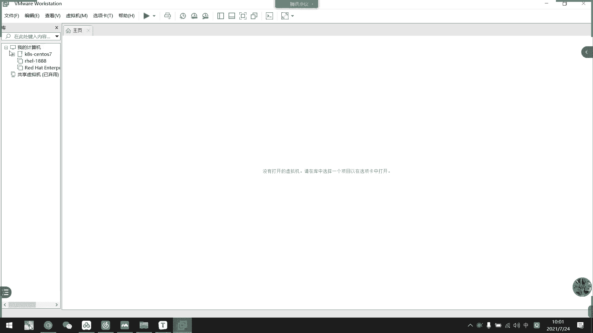

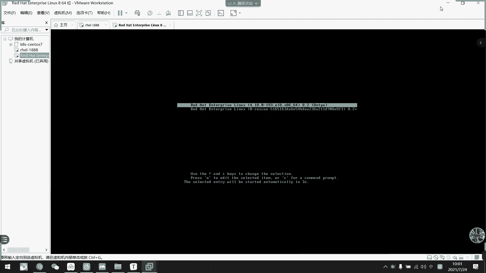

### 加密通信过程

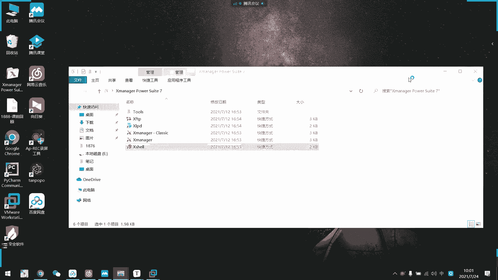

交换公钥后，双方即可开始加密通信。

*   **客户端发送数据**：客户端用**服务器的公钥**加密信息，然后发送给服务器。服务器收到后，用自己的私钥解密，获取原始信息。
*   **服务器发送数据**：服务器用**客户端的公钥**加密信息，然后发送给客户端。客户端收到后，用自己的私钥解密。

这种机制保证了传输过程中即使数据被截获，没有对应的私钥也无法解密，从而实现了通信的保密性。

---

## OpenSSH 组件与使用

OpenSSH采用典型的客户端-服务器（C/S）架构。

*   **服务端软件包**：`openssh-server`
*   **客户端软件包**：`openssh-clients`
*   **服务端配置文件**：`/etc/ssh/sshd_config`
*   **服务单元**：`sshd.service`
*   **客户端工具**：
    *   `ssh`：远程登录
    *   `scp`：安全文件拷贝
    *   `sftp`：安全文件传输
*   **Windows客户端工具**：如 PuTTY, Xshell, MobaXterm 等，它们也使用SSH协议进行连接。

---

## 基于密码的SSH连接实践

现在，我们来实际操作如何使用密码通过SSH连接到远程服务器。

### 首次连接与主机验证

当第一次连接一台SSH服务器时，客户端会收到服务器的公钥指纹，并提示用户进行验证。

```bash
ssh user@hostname_or_ip
```

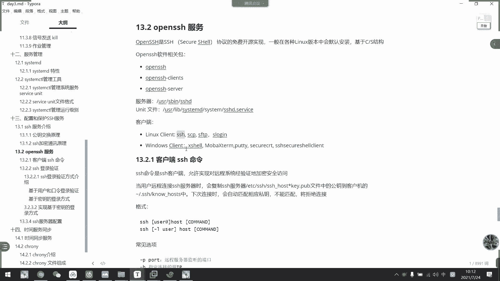

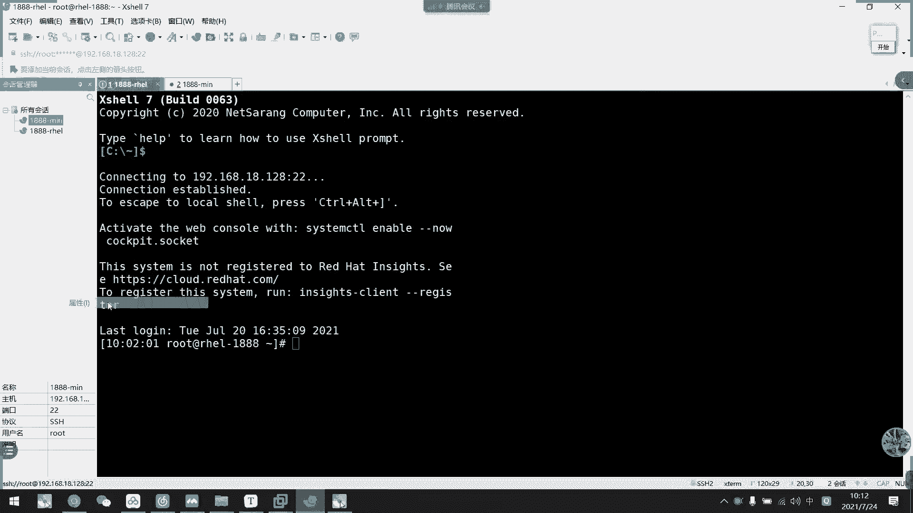

例如，从客户端（IP: 192.168.18.128）连接服务器（IP: 192.168.18.129）：
```bash
ssh root@192.168.18.129
```
首次连接会看到类似如下提示：
```
The authenticity of host '192.168.18.129 (192.168.18.129)' can't be established.
ECDSA key fingerprint is SHA256:xxxxxxxxxxxxxxxxxxxxxxxxxxxxxxxxxxxxxxxxxxx.
Are you sure you want to continue connecting (yes/no/[fingerprint])?
```

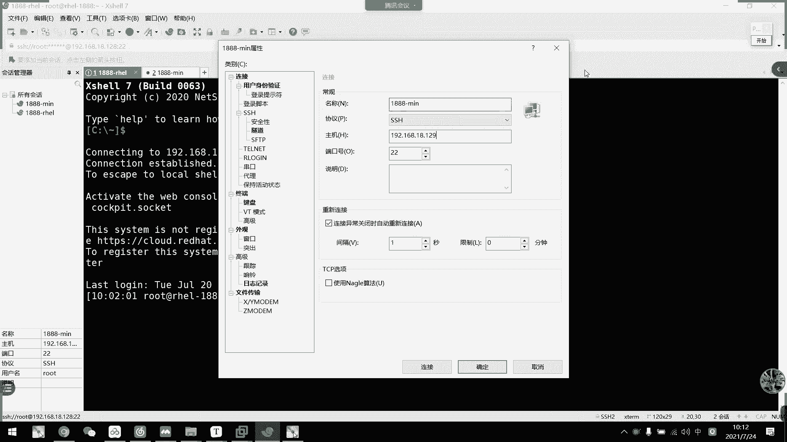

这串指纹是服务器公钥的哈希值。为了确认你连接的是目标服务器而非“中间人”，你可以**在服务器本机上**运行以下命令，获取其真实的公钥指纹进行比对：

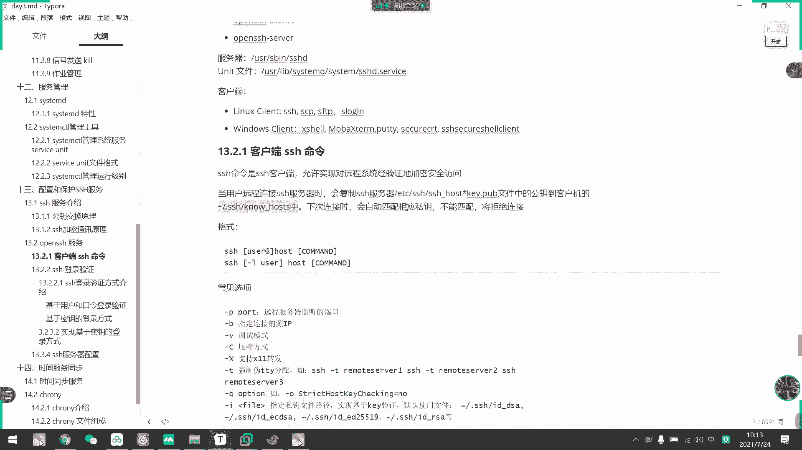

```bash
ssh-keyscan -t ecdsa localhost 2>/dev/null | ssh-keygen -lf -
```

如果显示的指纹与客户端提示的指纹一致，输入 `yes` 继续。客户端会将服务器的公钥保存到 `~/.ssh/known_hosts` 文件中，下次连接时将不再询问。

### 密码认证

确认主机密钥后，SSH客户端会提示输入远程服务器上对应用户（本例中是 `root`）的登录密码。

```
root@192.168.18.129's password:
```

输入正确的密码后，即可成功登录到远程服务器的命令行界面。此时，所有的操作和通信都是经过加密的。

基于密码的认证方式依赖用户记忆的密码。在后续课程中，我们将学习更安全、便捷的基于密钥对的认证方式。

---

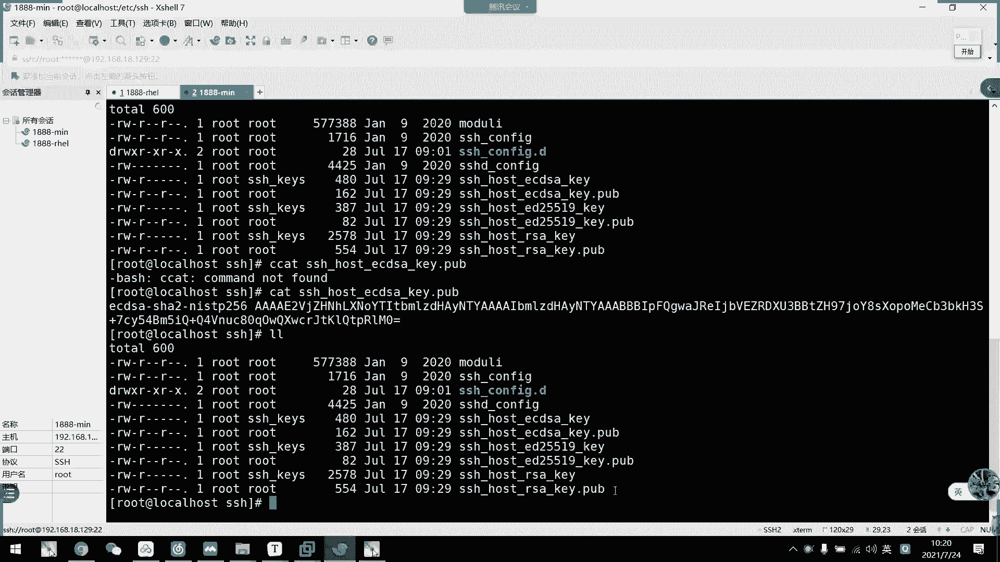

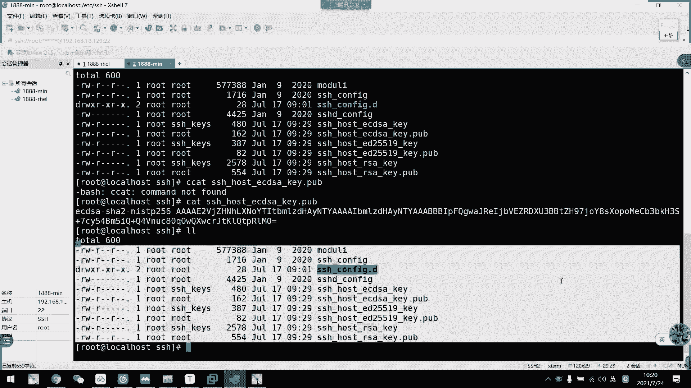

## 总结

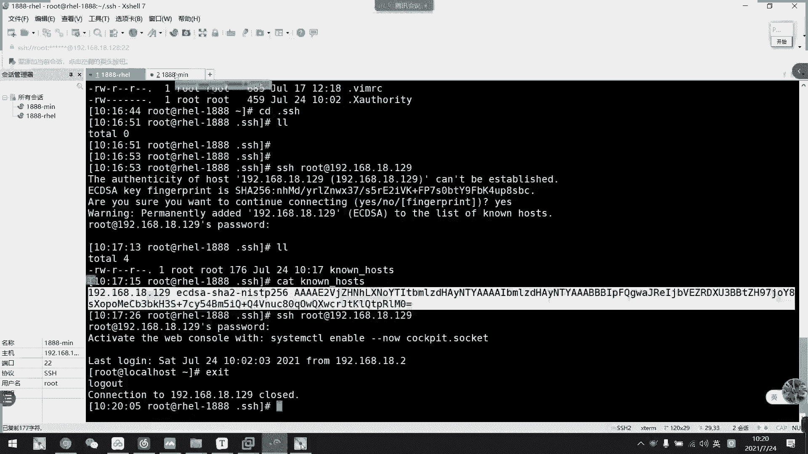

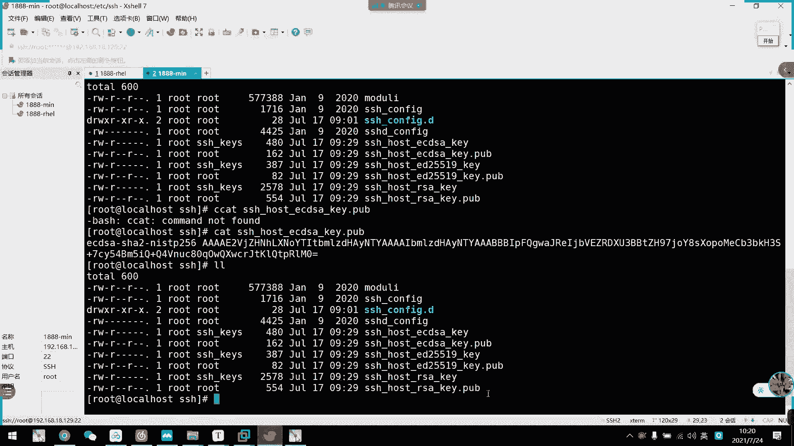

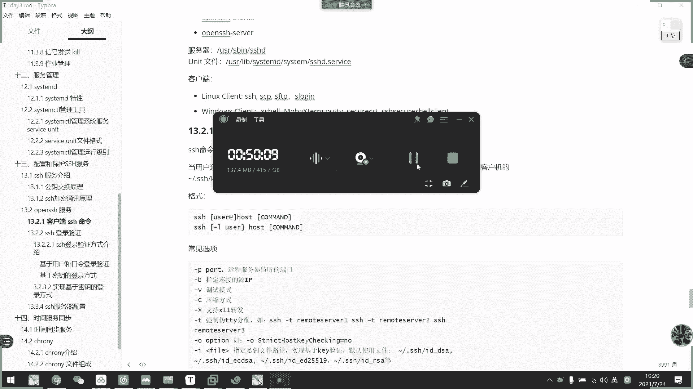

本节课中我们一起学习了SSH服务的基础知识。我们回顾了进程管理，然后重点探讨了SSH协议如何通过公钥交换和加密机制实现安全远程连接，并实践了基于密码认证的SSH登录流程。理解这些原理是进行安全系统管理的第一步。下一节，我们将深入SSH服务端的配置与基于密钥的认证方法。