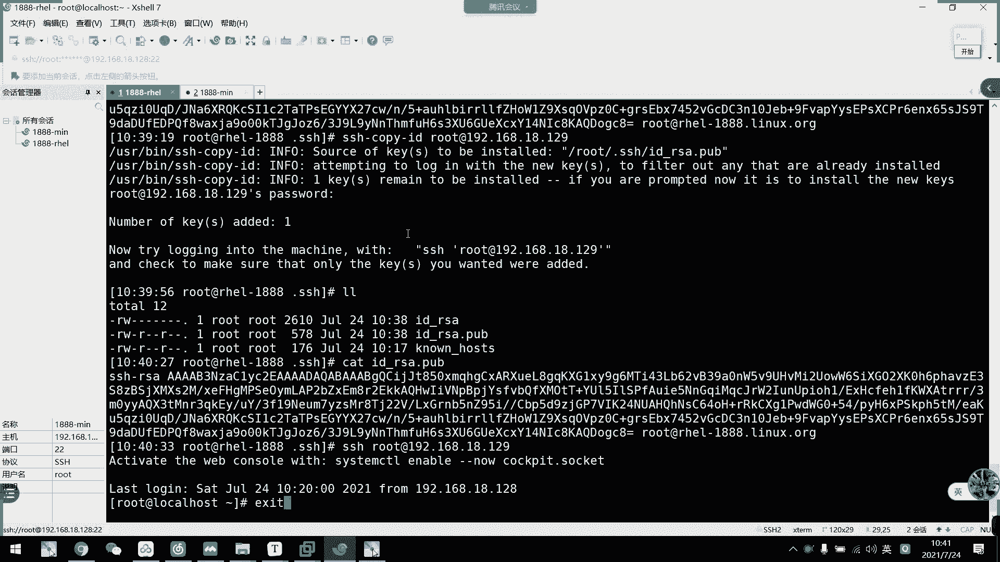
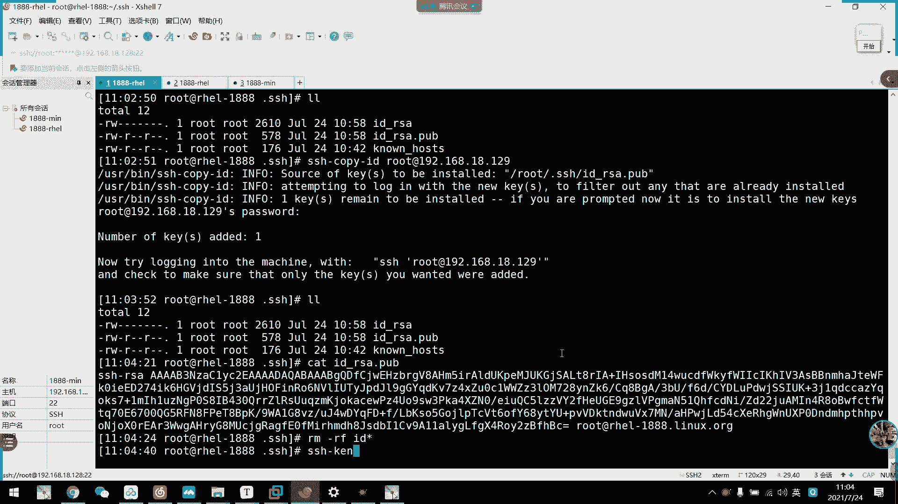

# 2021年7月新版-----RHCE8.2 RH124 RH134 RH294 认证课程 - P23：day5-2 ssh基于公钥配置以及服务端配置 - bili_15701050454 - BV1Gy4y1T7ug

来，我们来看一下刚刚的一个基于密码验证的啊，基于密码验证的。概念图。好，首先是。我们。客户端的一个妙队。然后前面那个步骤也是一样的啊，到后面我们通过密码啊，这里通过pasword。

只是怕把那个规过ID啊改成是一个密码。然后呢，我们交换公钥以后呢，需要用密码去验证登录啊。即系你。文字可以列一下密码基于密码登录没什么好讲的。啊，基于密码登录没什么好讲。然后我们主要还是看一下。

我们远程的话呢，每一次都要需要输入密码啊，是不是很麻烦？那么我们这个SSH的一个强制区呃，强强大支出了啊，是可以基于公钥登录啊，基公钥登录。那么结构登录呢，我们需要先。互相创建密队。啊。

其实是我们的一个客户端创建密标对啊。然后呢，它可以手动添加我们的一个公钥到我们服务器啊，就是手动传输啊，手动传输啊，它要基于公钥呢，首先要基于密码。为什么要急于密码？他不建立连接。啊。

我不能把我的公药发送过去啊。解密码。然后呢。两个互相交换功钥以后，那么跟我们一开始看到第一张图是一样的啊，这里可以得到我们的服务器公钥。这里得到了我们客户端公钥。要了我们就可以通过公两个公钥互相验证啊。

两个公钥互相验证。应得出。结果后呢我们就可以直接登录了啊，不需要再输入密码了。

好。那么这个怎么做呢？啊，我们刚刚说了，首先需要生成密钥对啊，我们回到江目录啊，回到江目录。好。命令行格式是什么呢？SHH杠Tgan。啊，刚ki的回车啊，然后呢这边我们先不指定啊，直接回车回车再回车啊。

好，这就创建出来了啊。啊，这以抽理出来了啊，你看通过SA。一然后呢有一个。啊。呃，由我们的SHA256来加密的一个密钥队啊。那么存办在哪里呢？啊？主办在我们的。SSH。你看这里就顺成了我们刚才的妙对啊。

我们刚才没有改名，他就是默认这一个。如果改了名字的话呢，我们每一次登录都是需要指定的公钥的啊。好。我们可一下。这些都是加密信息啊，开始和结束啊，然后是公钥。公要，这就是我们的公钥。

然后我们怎么把这个发送到。服务端。啊，那个min你行就是copy。SSH杠copy。但ID啊。然后呢。也是。跟哪个用户连接？还有他的地址。8。129。发过去啊，然后输入密码啊，我都说了。

要基先基于密码验证啊。啊，一定要连上以后啊，在那个。现在发过去看到没有啊，他现在已经发过去了。那我们看一下这里有没有。我都不知道发过来是全部在哪里啊，有了啊啊，会他会多了一个。Oskia。

就通过验证的密钥，我们看一下。

其实这里得到的就是它的供效啊，这里得到的就是它的供效。我们看一下。

啊，我们对一下，然后这里就是他的一个用户加主机名。然后我们看一下密钥，后面就有几位8KAQDOGC8。看一下是不是8KAQDOGC8。

Yan。那么。要加换以后呢，我们就可以基于公钥去连接了。rod哎192。点168点18点129。呀我直接就可以连过来了啊，直接可以连过来，这就是基于不要。

那么我们现在啊把这个文件给删掉啊。

啊，没有了。那么我们现在连的话呢，就不能基于购票。你看它要变成基于密码了，对不对？

就是说它没有保呃，其实最功要的是。接密码的步骤是没有把我们自己的公钥。给服务器，那么服务器就无法验证啊无法验证，它需要通过密码去验证了。通过密码去验证我们是否安全。如果有供要的话呢，就不需要了。我哋区。

啊，再复制一回。啊，发过来以后了，你看它又会生成这个文件啊。有了。啊，我们这个n host已经不需要再那个了啊，也不需要再再重新去。验证了啊，因为我们前面已经验证过了。比如说我现在把这个。删掉。那么。

我们现在连过去。会有什么情况呢？你看就是要登录呀啊。呀他由于已经加换了国效，它就是可以直接连接了。稍等一下，我接个电话，那我们继续啊。因为我们前面已经做了一个工效交换的动作，所以它。

这个只是得到了我们的一个。呃，服呃服务器的功钥以后呢，它就可以直接连接了啊。啊，那个logo house唉。呃，SS下的no host。嗯。Yeah。都没有了啊。我这边远程过来啊。好。

你看它又重新生成这个。啊，重新得到我们这个。呃，服务器供要了。那么它就可以啊通过公钥去连接啊啊，这就是我们通过公钥去连接。然后呢。我们现在把这一个妙队给删掉啊。咁快大片。嗯。稍等一下。

好好，可以了啊。😊，我们现在把呃妙度给删了，然后我们连接过去看一下啊。Yeah。又要重新。输密码对不对？所以说他现在这对工药已经。他得到了功药，这个已经没用了啊，因为我重新生成以后呢。

又是一个新的功药啊。都是一个新的没有。那么我们这一次讲的是什么呢？啊，刚刚是已默认的情况下，它就全部在加目录，然后我们不需要指定。指定公钥就可以连接过去了啊，那么我们重新生成一对啊。比如说啊我现在。

移到对上。然后呢。算了，在这里戳一个吧。エスチ。啊，这是我们的。D到下了点SSH去，然然后我们创建公要。一个。あ聞く。回事，然后呢，你看它默认是存放在加目录像的。

默的是所谓的角度选有名字是默认是这一个啊，那么我们改一下。这一塔。谢许稍等。嗯，这边我们随便改个叫root点。哎呀。哎。data给SSH稍等ro。RA。嗯，ok然我们看一下，你看。

它又对应的生成的啊我们的一个。咁样啦啊。那么我们现在怎么复制过去呢？啊，我们通过杠I指定哪一个公钥。诶。还没写。嗯，叫什么来着？192。168。18。129。有。啊，这就远就过去了。指定公钥文件。

勇敢I呀勇敢爱。那么我们现在看一下。你看啊。这样子的话呢，它还是基于我们的密码。所以呢我们要指定一下公交文件。啊，比如说data下的。点SH下的ro。嗯。那个啊。Bt permissions。

我刚不是发这个了吗？

他说写错名字了。没事你说名字啊。

看一下。这个刚刚发过去的啊，我们对一下HAVSOFU。

HAVSOFU等一样啊，那为什么？他会有个。确别加矮。看下他有个警告， all kids were skinmed because。They already is on the。啊，这个说他已经有这个。

Sos of keys to be installed later。唔会啊，没关系，这个没关系。哦。不是杠A吗？我看一下。是尴尬呀，他为什么被？如是。杠F。我这是强制替换。刚才。Data。点个歌曲。嗯。

Road。我看一下，按照他的要求啊。This。SA。Ppper。要8点。我开下。b permissions。那我们现在。输一下密码看下。这又连过来了。再连一次还是这样子。Plus Q。

5 is no assist by others。然后其他人有问题。平常都不需要。嗯。它F是强制替换。他前面这个F啊。啊，除了他的警告，他说这个所有的功钥已经呃存放在对方的那个。

里面呢然后呢如果要覆盖的话呢，就要用杠F去替代。那都不行。嗯，好奇怪啊。Bad permissions。系。toop0666。那不就行了吗？你666。The key file。哪一句看一下。

iss required that your private key file are not assessed by other。对啊，我就刚才说，所以我就把那个其他人权限给提了嘛，你看到吗？

我也看到这一句要，然后他这里说呃，权限是0666。我们先。看一下加目录下的。他こし。没错出来。第一次这样子吧。啊，但其他人啊没说啊，一样一样的权限啊。一样的学生。先把它删掉吧。这里也删掉。

他本来是064是我改的这个是我改的。他吃药是给自己，刚刚改的是公钥。几个。揿 b。18。data效的。SH shut。这个。嗯，再看一下。呃。为什么不起？Hamato2。啊，这个是他的验证密码而。

出来了。同系。然后是。root下的。Only me the kiss。

啊，权限没问题啊。

指定攻钥吧。我补直接tableable出来，他就有公钥了，他发也是发公药过来啊，不可能发私药过来啊。

对不对。哦。他连过去。是基于私药。连过去鸡吃药。啊，对，没错，连过去几十要。还用自己的私钥。把锅要解密。

这里应该有。对。嗯，这里应该有我看一下啊。生存妙队。然后发送过去啊，这里没有写。看一下命令工具有没有。肝癌啊指定施药啊指定施药。

OK啊，刚概也是已经成功了啊，肯定失药啊，这是命令。ok。😊，好，这是我们自己生成的啊，刚刚那个命令行。把，这里弄了杠B2。048，它是那个密码的那个资产啊，资场。

啊，这里。有行可以加类型啊，可以加它的类型。我们默认还是用RSA啊，默认还是用RSA。啊，这个是比较安全，它这里type可以指定给安卓。前面有写。可以是ISA或者是DSA，我们就采用ISA就可以了。O。

嗯。这里。没有鞋吗？那个。关闭啊。不是这个嗯。非か。电量工具。这个该F是指定它那个生成路径啊。然后我们杠A又又是不一样的，杠A又是不一样。杠A是指定我们要使用什么呃哪个施药啊，或者是复制哪个功药啊。

这里没有写字产。我记得有的呀。更嗌。啊，没有就绪。

比如说用默认也可以，默认是2048，我没记错了吧。啊，可以啊，默认是2024096哦，回去错的话，我们看一下。呃。啊他这里没有写，只有1个ORY覆盖了。那我们先把它删掉吧。嗯杠F。然后是。加目录下的。

I d。啊哦，默认是3072啊，3072。这个就是发送攻药啊。SSH干口比ID就是复制公钥给对方啊。你注意一下哈。看到没有？这个是发工药的。然我们登录是用户这边用自己的私钥去连接啊。我们看一下这补尿吧。

不确定的话。这个是发过去啊。干然要指定文件啊。

加系。哦哦哦，刚刚这个指定文件啊，这里有啊。啊，梗系 i didify。Idently files identity files。啊，然后呢这个不不一样的，这是我们下面的选项选是我们SHH的选项啊。

不是SSH杠IP啊。不是发送不是发送私钥。

它连接是基于私钥去验证自己的公钥啊，基于私钥去验证自己的公钥啊。🎼他不是发送过去啊，普是发送过去啊。他要用这个撕钥去解密。啊。

我们看一下还是要看一下那个我们不是发了公交过去吗？为什么用撕药呢？我们再看一下这个逻辑图啊。用上面这个吧。去样啊，我们先发过去，然后呢。它不是有我们的啊，你看这是我们客户端的公钥啊，客户端公钥。

那么我已经发过来了。服务器通过随机的字符串，把它给重新预过了一下，就相当于打了打包了一个头啊，然后再用我们的公钥。客户都不要，这位是客户都不要，去加密。啊，成为一段啊加密的字付串。

然后再把这一段发过来给我们的客户端。那么客户端得到了是公钥加这串随位数字，对不对？公钥加这串随位数字，就是这一串东西嘛。然后呢他是不是要用自己的私钥去解密，他不是说要把私钥发过去。

而是他得到了这个包以后用自己的私钥去解密啊。所以要指定食药去。啊，去去去去验证公钥。验证以后呢，它就可以得到这时数字嘛，对不对？然后呢，这所以说呢他也也发过去给服务器。就两边对应是否一样啊，一致以后呢。

它就可以通呃，相当于是基于密码了嘛，对不对？等于是信息交换啊等于是信息交换。啊，对对对对啊，等于是心息消化。

啊， ok。啊，所以刚开是指定我们的一个文件。如果是copy的话呢，也是指定我们的国家啊，发送哪一个国家文件过去。我刚才说了啊，他这种是。它这种是呃不是默认情况下啊，默认情况下不需要输入的话。

只有放在我们。啊，只有放在。我们加目录像。给SH下的啊，唉没创建啊，我这边唉刚刚不是错了吗？有百变吗。哎，刚我不是创建了吗？

啊有啊。呀啊这是默认的啊这是默认的，默认的，我们直接什么都不需要输。啊，然后是。地址。啊，我们先确认一下这里有多少个公钥啊。啊，只有一个对不对？就一个，然后呢，我们再对一下这个同样是哪一个。

是不是我刚才那个root啊？啊，我们看一下啊MOMME。啊，MAOME对不对？啊，所以他这里得到的是我们自己创建的那个公钥。那么我现在发过去，什么也不说啊，没有指定公钥啊，没有指定公钥啊，看下。

可去。

他不是说验证码是信息交换而已。

其实也可以说是验证码。啊，我们有时候登录的时候，他不是说要发短信过来验证吗？那你得到了这个验证码以后呢，我输入这个验证码是不是正确的啊，那就可以验证了，是不是啊，可以说像啊可以说像。好。

你看这里是23BFHBC。

啊，你看二也在BFHBC你看这就是他默认的啊。比如说我现在把这一对。又杀的啊。啊，又删呢。又删了，然后我右创建。嗯。提个。

啊，我们重新说件，你看他摸的就是这一个啊。然后呢，我现在把名字改了啊，把名字改了叫做ro RC。

真是。Road。

I say。呀还有生存。Yeah。啊，注意啊。我现在目录是在我们家目录下的点SHHR。注意啊，然后呢。我们来看一下，我现在copy不指定能不能指发过去。朋友们觉得可不可以啊？啊。你们觉得能不能发？啊。

可以是吧，我们看一下。Yeah。他说直接找不到定义的文件。啊，不是说文件名相同啊，不是说文件名相同。它默认生成的啊默认生成的这一个文件。全都是默认值所谓的de。冇认。跌复。对，默认只认这个默认指认这个。

而不是说他放在哪一个目录啊。不会说放在哪一个目。如果我把这一个名字啊，IDISA。放在了钉塔下。他一样不用，他认的就是这一个路径下的IDISA啊，这就所谓的默认啊，所谓的默认只有有这个他才会使使用啊。

我们试一下改名行不行？我都还没试过改名。谢谢同西。我没试过啊，你看可以了。啊，他只用这个路径这个名字啊。

啊，这也发过来了，这是基于公效啊。

诶。这个保存一下，先关掉，稍后再打开。

好。啊，这就是我们鞠功钥，那么就啊实现了一个美密连接。那么我们现在看一下。啊，这两个命令啊，一个是生成。妙对，一个是把公钥复制到指定的。Hosted。啊，这里可以重设啊重设。那我们看一下。回头看一下啊。

我们的客户套工具的一些命令哈。首先啊杠P。啊，是指定我们远程服务端SSH服务的端口啊。

啊，为什么有这一个东西呢？啊，为什么我刚才不用输了啊，因为我这个端口啊并没有改。

啊，它默认是22号端口啊，默认的默认的，所以就不用指定嘛，对不对？我连过去22号端口，它有监听，我就可以连连进去。好。这是杠B啊，连接的有人的IP啊这个。没所谓。然后杠V是一个调试模式。

然后杠C啊是压缩啊已压缩了。不是说强制啊，我没有说过强制啊。我从来说也是说默认而已啊啊，我从来也是说默认而已啊。对不对？啊，然后是刚才显示一个关于X11的转发啊啊，这些我们都不采用。啊。

杠T是强制分配我们的1个TTY。啊，比如说这里。啊，这个也不采用啊。呃刚哦。也没什么采用的，这些都不采用啊，就杠P。蛋批呃，还有。

加癌啊钢比肝癌比较采用。然咧。这个命令行。更加常用的不是选项啊，而是它可以这样子。直接执行一个命令退出啊。18。19。当是。或者这样看不清楚啊。你看他这一个文件是不是只有我们这一台服务器才有？呃。

一般不会暴露啊一般不不会暴露我们的那个什么的啊，不会暴露默认端口啊。啊，对他这个测试啊。U可测试直接测试。啊啊，那也是那也是啊监听的啊那也是。他主要是保护了。他没有这么容易连过来吧，对于黑客来说啊。

没有那么容容易连过来。只要我看你那个服务啊。他这个阶梯的肯定会写。但是他不知道我这个端口干嘛。M。😊，他他也肯定如果是集群的话，他肯定也要攻破一台啊攻破一台服务器，然后才能继续扫描啊。

所以也不是说默认默认默认暴露一个默认端口给他，直接哎连试都不用试，22号就可以过来了。好那加宝累计。发耳机的作用就是这样的嘛啊，什么叫堡垒啊？好，它可以直接执行一个命令啊。

啊，那么我们就不用直接远程过去做了啊。不最远的会有啊。好，O。啊，这是我们SHH对SHH的一个。呃，明令还选项啊，迷令面蜡工具啊。好，呃，那么我们这里啊还有一些服务器相关的配置啊，服务器相关配置。

然后呢，它的配置文件都放在我们ETC下的SH下的呃SSHDcom里面啊。呃，那个八助文打的是我们第五章第五章。

那我们来看一下这个文题啊。伊地下SHH。下的那些写滴。我装一下。哦，好像没有。没有仓库啊，还真的没有仓库。

嗯。SC P。18下的。EDCER点IPO。点D下的DVD。到。TC下的。

哎，说错了对。

啊，没挂炸。

装一下吧，因为它有个高亮的给你们看一下。O。这就是我们的SHHD的。服务配置啊。等下这里啊。Pt。可更改它的一个默认端口。🎼啊，默认是22，但是要改这个，我们要把它的1个Slinux标签给更改。

或者说把SClinux给关掉啊啊，比如说这里改成88。这里是它的一个口药。狗要杯子。还有私效配置。是用食药配置，就是相关的一些默认是呃默认工药的对定私药。这里不用不用管它。哎后，这里我们讲到日志再讲吧。

讲到日志再讲。然后这个啊。这个。是是否给我们的那个root登用户登录啊啊，然后刚刚说的那个os呃auation key file，就是保存我们客户端公钥的文件啊，这就这里。然后这里啊一些备注了的啊。

也备注了什么。呃。🎼最大只会化10个啊，就连接出10个吧，相当于。呃，他还有一个什么停止多少秒之后。啊，就是就是说。多少秒不动的话呢，自动退出连接或者是强制呃多少秒就退出连接。我们这里有一个配置。

看这里啊。So listen address I p啊。啊我这里不允许。啊，不允许word软登录啊。然后呢，这个简查所有者权限啊。然后这里啊刚刚说的同一个连接最大绘画。啊，然后呢。

这里是是否启用基于公钥验证？空密码连接啊，允是否允许空密码连接？是否允许基于我们的一个用户名和密码连接？🤧嗯。啊，然后这里是。客户端存播10秒。最大3。然后呢，我们呃来看一下一些常用的配置啊，就。

简单的安全位置，就是说设置它60秒之后退出啊，就是刚刚那个。存播多少秒。中国成。这里可以设置成60秒。啊，这里。40。然后把我们搞个配置，把那个服务重启就可以了。然后这里可以解决登录我们SHH。

登录狂款狂狂慢的问题啊。啊，把这个DS改成漏啊，什么这些改成漏。禁止。啊，不如用过远程登录，就把刚刚那一个啊啊pro别是这个。

root locking 啊 road locking 改紧 know啊 know那就尽用了啊。啊，这个是一些。

配置啊最早配置时间，我们看一下一些强的啊，比如说我刚刚把那个改成8。好吧改成888端口，对不对？888端口，然后这里我们改成。漏吧。等凳。然后这里。Collect。是我用叉1一转发。他这里没有啊。

没有啊，在这里这这里。改成10秒吧。然后我们先把。关掉。好，那我重启服务。一重启这个就要断了。嗯。不动。啊，包裹已经改了，但是他还没弄啊，他要重新开一个窗口啊，他要重新开一个通。那么我们现在看一下。

能不能免？你啊。啊，已经不能你了啊。20号都不付对。我们杠P啊，直定包吗。对啊。直接说啊没有路由。那么。我们现在不登录这个。我看现在有什么账号在这里啊。入手一。嗯。😊，哦。不哥拿我钱啊。那我再重新验证。

用啊我们的word登录。对。密码输对了，但是他会被拒绝。而不是那的。OK那我们现在试一下灯有手音。哦，上面设密码。啊设个密码给他。呃。行叫点过来吧。我刚才拒绝了wot登录，所以我们root最要输对密码。

它都会被拒绝的啊。不意谁进来。好，这是我们的一个啊安全设置。你看10秒之后退出啊，10秒之后退出。又退了啊，OK啊，这就是我们的一个SHH的一个相关配置啊，大家可以回头都尝试一下啊，都尝试一下。好。

那么我们SSH就讲完了啊，刚好也11点20分，那么我就休息一下。

