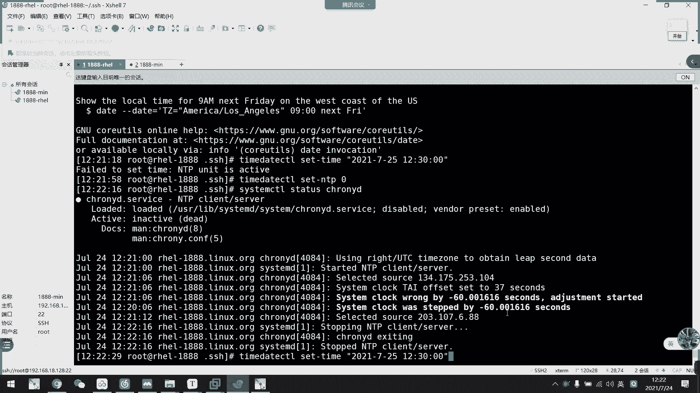

# 2021年7月新版-----RHCE8.2 RH124 RH134 RH294 认证课程 - P24：day5-3 时间同步服务 - bili_15701050454 - BV1Gy4y1T7ug

呃，SHH这一个就过了啊，但我们后面还有一些。相关SSH的一些命令服务啊啊，比如说我们1个呃FTP啊。啊，FTP好像是21端口的啊，SSFTP啊，还有什么SCP啊啊，还有那个阿think啊啊。

都是基于我们SSH的。我们后面会讲，然后我们这边就看一下这个。

小服务啊。首先同步服务。时先同步服务。呃，协同服务呢啊是多主机协助工作的时候呢呃那个协同步是很重要的。不然的话呢，如果他们之间，比如说我这个。是。呃，什么咨询不就好了啊，就日志吧啊，就RC。Lo。

服然后这里啊也是另一个呃，这是A吧。Hows is the lock of4 B。那么如果我这里系统时间跟B的系统时间对不上。如果这里是13点，这里是14点。

那么他记录的系统日志呢啊真个13点14点了啊，那么就会有出现误差啊。当然这只是一个文本啊，文本上的误差。但是如果改成是应用呢啊改成是应用。那么他们之间有时间差的话呢，可能会导致他们的工作时间不一致啊。

导致工作时间不一致。比如说我同时两个电脑都有一个计划任务啊。9物。啊，都要设定在13。05分工作。那么它的系统时间在14点啊，就比他早一个小时。那么我们的设B是不是会呃提前一个小时执行了这个任务。

然后呃如果有相关收集的话呢，它就会调入到对应的收集服务器上了，对不对？啊，那就造成了一个不一致的事情。当然还有很多种情况，因为我们啊。在工作上呢啊很少说是单服务的，都是集群或者是分布式啊。

他们都是需要互相沟通啊，互相依赖。所以呢如果时间对不上的话呢，会造成很大的问题啊。那么我们直接徒步啊，首先是有两种服务啊啊，一个是NTP，一个是Crowowning。啊。

NDP的话呢呃目前可能已经不怎么用了。啊，当然有一些。比较早入坑的。呃，工程师呢就还是比较喜欢用NDP啊，他们习惯是用这个。那么我们。新兴的一个服务叫cloy。啊，而且它的误差比较少，配置比较简单啊。

配置比较简单。啊，那么我们一般来说都是用Cudly了，现在。那么。我们时间同步呢是利用我们那个ITP协议啊进行服务调度啊，服务调度，然后是时间同步。那么我们这里可以看一下它们之间的区别。

首先是我们的IDP服务啊。ADP服务呢，如果在局域网内呢可以达到我们的误差值在0。1毫秒啊之类。然后呢，如果在互联网上它的精度啊是1到50毫秒啊，但是我们的卡路里它的优势是什么呢？

考里啊也是基于我们APP协议的一个自助软件啊。啊，然后他的一个。影响差度啊影响值啊是。一个网络连接。啊，还有一个温度变化，还有一个温度变化。啊，然后他的一个。精度啊是在几毫秒之内。就通过伊德利。几号门？

然后呢，如果在。局类的是几十毫啊几十微秒1微秒是不是比我们的APP。更加呃精细啊更加精细。然后呢，我们来看一下这个斜轮布啊是。架构是如何的，算了，不用这个话筒。啊，我们用这个。嗯。

他今然把我的把没删掉啊。怎么又谈这个？好，我们来看一下。我们看一下时间同步服务。那么首先我这里。约来服务器。呃。就叫我们的一个clo力。啊，这是我们的时间服务器啊。所有服务器。那么。我们这里啊有很多。

继续啊，比如说这里是一个设维A吧。这是s。诶。说毕。说系。啊，那么唉。那么呃这三台服务器他们时间需要同步，那么我们就通过这个时间服务服务器，把它当地的时间。啊，传输到。我们的。各个服务器中。对不对？

我们只要我们三个时间跟他同步就好了，那就可以确认到我们三个时间是同步的。那么我们就通过cloud这个服务。那么cloud。如果他实际同步，你怎么做呢？啊，我们就通过啊inter下载。

let下的一个ti性。还行啊，实要头部服务起啊，算了，叫做互联网上的专案里吧。啊，这是。公共的时间同步服务器。那么我们把这个连连过来这里就可以了。明外这。那么我们这个集群。就我们公司内部的。这一个。嗯。

看不到上面的字。是最月底出的。对么。啊。我们这个是集群啊，我们自己公司内部的集群是不是一般都是自于内网啊，都是自于内网。그对我咗你。说这个类网。那么我们这边卡里。指向服务端。的。

只要服务端的那个网网口是不是内网？我们用内网就可以了。啊，跟我们集群的内网连连在一起。然后呢，这边这个网卡啊接着是外网。那么我们就可以跟公共的实源服务器进行同步。公共的实验服务器这些都不啊。

大家这样看啊，可能看不清什么东西啊，实用服务器是什么呢？什么叫公共的实验服务器呢？我们可以看到我们这里。啊，你看。而windows啊也有啊，它会有一个时间服务器叫做typewind点。Com。啊。

这就是我们的一个windows的。是呃公共的时间服务器啊时间服务器啊，这是至于互联网上的啊。啊，跟我们DS的一个。啊，跟DS啊也是一样的道理啊。啊，跟DS知道吗？13个13个跟DS服务器啊。啊。

这就是我们的一个原理原理图。啊，为了为了我们咨询啊。不不连到外网啊不连到外网，他们就直接用内网进行一个协同步啊，那么怎么做呢？

其实。

我们看到这里。也可以理解到一个什么东西，我们实间同步服务啊，是不是也是1个CS结构？是不是CS这个。为什么说CS结构，它去同步云服务器啊，不是网网络中的服务器啊，是不是。他要作为客户端，这个作为服务端。

对不对？他这个客户端给他请求实间同步。然后这里作为服务端给他时间同步。然后这边。我们的集训类的。节狱类的服务器是不是作为客户端，向我们这个水同服务器进行直接通步请求。那么他这边是不是作为服务器？

让他们同步时间。啊，所以它也是1个CS结构啊。看一看今天早上我们又讲了两个CS架构的一个。服了啊，然后我们来看一下卡lo迪啊啊卡lo迪卡拉迪。考虑。看你的优势啊啊，这边看一下可。啊。

它可更快的一个同步啊，只需要数分钟，而非速。小时而而非数小时啊是数小时是时间。然后呢，从而最大程度减少了时间和频率的误差。啊，对于并非全天20小时运行的虚拟机而言呢，是非常有用的啊。

但是这这块什么意思呢？啊，就是说比如我们有一些。服务器啊它不是24小时都要开着的。那么。如果他是手动。手动设置系统时间啊，比如我每次开机，我都要手动设置。比如说我设置8点了。我8点开的机设置是8点。

然后关关机了。他虽然说我设定了系统时间，他12点开，他肯定可以直接设12点。因为它是在bells里面去计算的，这个时间，对不对？系统时间啊，是从bes去计算的但如果他没有开这个而而是开了我们的。啊。

时间同步呃，是要通过互联网同步了？对不对？那么我。跟这个服务器。C， H，R， O， NY，啊，他是通过互联网跟这个作为协同部，要不我帮你关机了。它系统时间就没有计算了嘛，然后我再重新开机。

12点的时候重新开机，那么他记录的还是8点，然后呢。当我们网络连上了，然后建立了连接以后啊就跟我们直接同同步服务器建建立连接以后，它这个服务器呢就会直接把自个时间。给他同步到这里。

还就说他几点他就几点啊，而不是说啊，如果我这里设置了13点，而比京时间12点的话呢啊他们也不会显示1，他直接显示13点。确是现的，但是我们系统时间依然是12点，系统时间。就我们看到的d塔啊。

看到时间可能是12点，但是系统时间还是12点，但是系统时间我们是用TC系统。啊，就这些时区去计算的。O。好，然后是一个。响应时间频率啊，就是说它的一个同步加速啊。啊，然后哪的看。初始同步后。

它不会停止失踪啊。就说。不会马上去给他同步上。就是说如果你有一些应用啊，它已经记录着当机的时间。他突然间把时间改掉了，就会产生一些。呃，问题啊，比如说我们windows啊，比如说我们windows。

我现在把那个时间。改一下。呃，我把这个关掉。然后改一下，我把它改成。最多就要搞多就最边啲啊。好，我保留一下，然后呢，我这边反问一下百度啊。你看他这里有些不安全啊，能连都连不上，那么夸张的吗？不对吧。

一啲冇式。能连都连不上，你看他不要绑它能不连连上了。我们看一下这里啊，有一个顾安选，他说证书无效了。我这个证书是。2021年7月1日到我们2020年8月日、8月2日，然后他这个时间都不上。

导致他自诉无效。啊，而且我们集训内啊很多外部服务啊，都是我们自己啊去创建证书，而不是买的，就就内部内部自己应用的一些。无呃，无签证证书。嗯。有有效期，如果他时间没有同步障的话。

可能会导致证数出现出现问题啊啊导致访问不上。要们帮它改。啊这是一个时间的一个例子啊。同不攰啊。YeahYeah。那就两连三。🤧。啊，然后他这个是比较更好的稳定啊，然后是不需要人群啊不需要人群。然后呢。

它是界线网络的一个连接，就是说啊他会借性的去检查，然后发现时间不对了，就给你同步。然后这是我们团里的个官网。还有它一个对应的高考文档啊，有兴趣可以看一下。呃得这也没什么好看的。就看一下喵E。

我们开学项目一般都有一个呃都有一个。包晚的看下包晚。他这里是他的一个介绍，还有一个下载。他说有机죠。90本。就不知道他有没有二进制安装啊，但是这个其实也没必要去二进制二进制安装嘛，对吧？这一个小服务。

来很简单的一个页面啊很简单一个页面。还有一个啊包括打。我们顺手也去看一下NDP服务啊，等一下。诶，直接。它怎么自动跳转？这个就是他的一个。啊，文档其实刚才也可以点文档进来。那我们也看一下这个吧。啊。

这个它页面做的还是挺好的，还有一个时钟的，我记得。没有。那我记错了吗？啊，这个是介绍我们APP网络呃网络时间协议的。然后这个是它的1个NDV效果啊，那个时钟我是记错来，它不是跳的是一个图啊。

是它的一个logo啊，是他的一个logo。那我们继续往下啊。然后呢呃我们说了。colly啊，这是1个CS结构。然后呢，它的一个命令行工具啊，我们有对服的啊，也有对客户端的啊，对服我们就用D啊。

对客户就用C啊代表c啊代表col。啊，然后卡拉雷迪是我们的一个后台运行的一个首部进程，适用于调整内核中运行的系统时钟和时钟服务器的同步。他确定计算的积增减时间的一个比率，然后对此进行补偿。啊。

核有C是我们的一个蜜探工具啊啊，它可以。手动同步啊，也可以查看到当前的一个实同步服务等等啊。那它的大印文件啊，我们这些就不看了。然后主要是它的一个docker，都是UTB的啊，123还有323。好。

让我们来看一下它的一个服务的配置啊。

复备景啊，我们。这个客户端和服务端都是从这里配置的，我们看一下。先来看看他的。服务作饭。

你看其实2人YD啊，就是他的一个呃服务。啊，他的一个熟机证。啊，你看那目前是在运行的，你看starringNP啊，它的服务，还有客户端啊。

O然后它的。一些相关文件啊。

O看一下啊。呃，你看主要配置文件就有一个EDC下的。啊佢啲好。呃，然后呢，这是它的密案工具啊，密案工具。然后我们看一下有没有它的一个单元文件。单元单元。这个是服务端的密啊，这里啊带开文件。啊。

我们也不需要去看它啊，我们主要还是看一下它的配置吧啊。这个那我们来写一下。好，这里。我们不用注意太多东西啊，你不要看他写的那么多东西啊，我们只要看这一行就可以了。啊，这里是作为客户端的啊作为客户端。

这个是作为客户端。这收到。🤧呃。结构是什么呢？啊，首先是指定。呃，pro。是指。服务器。十啊十就说它会有很多个啊，然后呢，如果是service啊，我们server啊serv是。指定。时间。同步。

服务器啊，就单一指定了。然后第二列。第二列。啊，就是我们那个地址。地址。就一个ip burst，就是一个时间同步加速啊。就这样写就可以了。那么我们现在。看一下。用客户端工具啊，我们就只需要。

🎼记一个咪密就可以了啊。C，然后是。そす。到于。啊，这是他的一个。客户端工具啊可以查看到我们的一个s同服务啊。你看由于他们都是国外的，所以我们颜迟比较大啊，颜是比较大。然后刚刚只有一一行，对不对？

只有一行，只有一行。所以啊当然它是一个词啊，但是它是一个词，所以它一个词里面啊可以列出有4台。

说的。Cannot talk。To able。506无法反问我。SO入RRCS杠51。你连不上那个C同部服务器啊。不需要啊。我这里这个方墙对代代理的话，也只是对我担心系统代理啊。

没有退出一样可以。啊，但是他国外的确比较慢，我们来看一下。所以。啊，所以我们来看看。

在嘉木路啊。啊，你要从第一侧远程连接过，它才会创建的啊。我也觉得他是服务没起来。Dable。Cannot talk to demo。他直接是特知都无尔访问到那个。打有文件。好，我们先看看。

其实这里有更多介绍，但是很多都用不上的，很多都用不上。我们只关注这一个就可以了。有机趣同学可以去看一下其他的啊。啊，用这个serv，还有耳诺或者ba啊，我们都是用这两个。有兴的同学可以看一下其他的。啊。

这是关于他那个客户端的命令啊，常用的啊也是这个啊，查看它的一个同步信息就可以了。或者是手动添加，但是我觉得没必要啊没必要。啊，什么删除啊，我们都改配置文件就可以啊，都改配置文件就可以了。

所以我们啊就查看啊就查看。好，然后呢刚刚说了他。国外的啊就默认的都是国外的，就比较慢。那么我这边有提供。有提供到一些阿里云提供的NDP服务器，或者是腾讯提供的。大学的我之前用过，好像有时候解析不了。

有时候解析不了。然后这个国家的呃也有时候也解析不了。所以我们就用这个就好了。啊，我通常的话呢，我会设三个啊，指定3个学学验呃同步实验服务器。啊，而不会用词啊啊不会用词，这样会确保它的一个冗余性啊。

比如说我这边先把它删掉。把这个也删掉了，然后我们就写啊ser。然后是呃什么来着？得啲 b。阿二园。

Dian。Come。是不错。OK好，这里啊它本来是一个词来的啊，本来是一个词来的，然后我们这边指定一下，我要指定服务器啊，比如说1到7啊，它只有1到7啊，我这边指定一个R啊，然后是ip。

哦。周聘来着IBURST啊。

啊，然后第二个啊，我一般。用一个是。

腾讯的。反正我这边列出，我就一般来说我就。

泰晤店。TENCENT是优惠券。对。Hい first。找不服务又安装一下。没理由啊，我最小报还说都会有啊。

至是么安中都有啊，为什么没有了。😊。

好，然后再加一个。

看一下青花行不行吧。奇怪到这。

然后我们重启一下服务啊。图形化更加会有啊。呃，你 start。啊，重启来，然后我们啊再查看一下。诶。就没有那个命的。C HR O MYC。说。告无意啊。啊，他现在是刚开始同播他解析啊，在解析那个名字啊。

目前还没通上，现在同步上。你看他清华那个解析不了，他就解析了两个这个程序呢，就是阿里的。然后他解析了，但是还没连上，这是一个问号。我们注意一下，等一下我再讲解一下这三个符号。他清华那清华那个解析不了。

腾讯那个好像还没连上，他只是解析掉了，但是没连上，我们来拼一下，是不是。太。对。这个被论件。太无啊。拼错了，估计。

他唔。5为什么不1到5哦，少了个ca啊少了个ca。

我会说。So以做小 u啲。即随住波。然后再墙上。啊现在三个都有了。但是远的问号。

这还有一个。应该是我们刚刚清华了，一后拼一下，看一下。

202对。然后连不上。所以他就一个问他啊。所以我现在都不用清华了哎。哎呀，我你大干嘛？

他能解析，但是这个服务已经不提供了，所以一般我也不会翻一个大学过来了。我一般都是用两个阿里或者是两个腾讯这样子。

最好保留3个啊保留3个，让他有余啊。这边就不要这个了。当然你们喜欢的话，也可以直接用一个，但是我不建议啊。他迟的话出问题的话就有点尴尬啊。你看它是一个误价值啊，是我们的300微秒，好吧。同步误差。哎。

腾讯那个又没解出来哦。都边有两个，但就那个没解析出来。我刚刚写。应该是HV3，我们来看一下。拼。NTP3点。阿里云。203。然后还有一个2是吧？4203。

88哦，他们同一个词啊同一个词。那么这个就是我们的腾讯呢。对不对？腾讯。拼一下，确认一下。

134。175。对不对？就是同一个嘛，14175。

然后253。104。然后呢，他刚刚阿里云那个是同一个解释地址，所以他没有重新写出来啊。

然后呢它物呃同步时间慢，雾压机最小那个呢它就会优先选择啊。然后这个是作为冗余，一个新啊，一个呃一个是新新的话是正在使用啊，新的话是正在使用啊，横杠的话就是冗余。就是说如果我这个挂掉了。他就是这个。

哎有我这个8要就说的。

呃，然后呢还有一个加啊，加也是备用的意思啊，然后问号的话是无法解析啊。就就能解析到这个IB，但是它无法连接啊，能解析到这个ID，但是它无法连接。

哎这里又被人捡了。他又给跳转啊，我调转。ok。啊，就是我们先同步了。啊，这是我作为客户端啊，作为客户端请求了。那么我现在是不是已经相当于做了第一部分啊？

外网。啊，我们考虑。外网连接到共有。公有云上的。先同不服务，我就同步了，对不对？然后第二步就要把我们内部的。呃，让他作为服务端，让我们内部的服务器作为客户端进行实验服。

怎么说呢？啊，比如说我这一台啊。没得。

伊利西下的Cly。好，这里杀掉。我们来写一下啊。直接s入，然后是哪个192点168。18。点128对吧？IBU啊。We start。查一下状态啊。

然后呢。同学们，我们现在。跟我们服务端啊，跟跟我们这个128。连上了没有啊，你们觉得连上了没有？啊。你们觉得能不能同步？连上了吧。有没有同步啊有没有同步上？

你们想一下有没有动木障。啊，不能啊。好，这里是问号啊。😀呵呵呵呵。😊，好好，这这里是问号啊这里是问号，为什么是问号呢？因为我们还没有开启他的个客户啊服务多功能啊，服务端功能怎么开？😊，啊，很简单的。

这里其实刚刚说的就两个配置啊，一个是客户端配置。一个是浮动位置，我们把这里。开起来，然后呢。呃，改一下吧。18首些通行网道啊，通行网道。重启。诶。看错了。重启重启。诶。啊，重启。那么我们这边。现在。

等一下。还没连上。他还在轮巡。还没检健康性检查，我直接重启吧。还是没有。12332啥时候开了呀？等到几啊。还是我写错了。192等于16818128。我这边重启服务了呀。允许来。192点168点18。

24位。A no。我等他一会儿吧。这个跟防火墙个没什么关系啊。

🤧应该。Farwork先iandy。

刚刚 list。哦重视。看一下。Happy。确实没有哎。到我关一下。好，那么再看一下这里轮流没有。啊，可以了，开始慢慢慢慢可以了慢慢可以了。开始有延迟了。但是还是问他了，为什么呢？问题啊。有问题呀。

到这一个命令而已。能有什么问题啊？Hello。19216818点你的是4位没错啊。哦，好奇怪哦。192。168。CRVER server。18ipos加速。啊，可以了可以了可以了可以了。你咋啦。可以。

但是他误差挺大的，目前。啊，先不管我们data。诶。对看一下大致时间。呃，2021年呃17CST啊，然了星期六。啊，主要还是看时间吧。7月2号，然后是12点。啊，不行，这样子看不出效果。关下。好。

那我现在。直接。拍一下。哎，38。那这里也是38啊，那么我们现在是同步上了啊，现在是同步上了。那我现系。呃。然后我现在加一分钟啊，加一分钟。那么我现在在这里。13。3。然后我们在这里。

看一下他要多久重才能通报，可能就没那么快啊，可能就没那么快。啊，这个直接同步他还是要他那个访问的。怎么又变成问号了？好神奇呀，他们两个连接。但是我们这里可以看到它那个呃变成60秒。不啥子。

那之前都没有这种情况出现啊。应该很快才对。咋整的？呀他现在还是比他快一分钟。大约快一分钟。我们直接重启服务吧。不等的。你们课后的话有兴趣可以等一下来，我们现在看一下他那个时间。头部上没有。25秒。

25秒。啊，是我同步上了。啊，可以啊，然后这和互联网的微秒是不是很小很小。ok k。好不链里面的一个微秒，那个误差值很小。啊，OK啊这就是我们这个卡奥里的一个客户服务端跟客户端的一个配置啊啊。

大家有兴趣可以去玩一下啊，这个小服。

对小服。然后呢。最后是我们的一个。时间工具啊时间工具其实个人喜欢用d的用对的。

个喜欢那种啊，但是那的。它设置可能没那么好，它也是这个工具也是从T开始啊。太棒叫太。Data。CP。诶，没法。写错了。它d啊，你看他这个敲这个可以看到我们当前的一个系统呃，系时的设序啊。

虽然是它本呃是系统时间。

好吧，是本地时间啊是本地时间。你要说CST。然后时间没错吧。啊，然后是它的一个入定时间啊，入定时间是系统时间呀啊8个时续敲，对不对？8个时续桥呃，然后时区啊时区是CST加8啊，一定要注意这个CST加8。

因为CST在全球是有4个CST市区啊。

他不一定是加班，不是加班的话，就不是指中国啊。是。他有4个。啊，看这里吧。呃，你看他有一个是美国中部时间啊，不对。啊，对，美国中部时间啊有CSD的啊，它是UUT减6啊，他那个。

然后澳大利亚中部时间啊UD加。99小时啊，9。9。5个小时吧啊，然后是综合标准时间，还有1个58标准时间啊。所以我们这里要注意啊，所以呢我们要UT呃用。

GST的收了。啊，不要管这个，我们第时区就定亚洲的上海，它就会自动识别出来了。I后这里是我们的ATTP服务是否开是否开启啊，可以手动把它关闭啊。通过我们的呃type背DL也可以把这个关掉啊。

我们看一下它命令还有多少。

🤧嗯。好。

查看时间列表啊。就说我们不会设的时候啊，就可以查一下。北的。嗯list。Not不。就是太重了。你看这么多。懂不懂？啊，这都是我们系统内置的一个时区啊，这也不是说系统内里啊，这是这这都是。呃。

有有一些特定的。呃，制定啊。特殊之地。啊，然后是修改时序啊，我们下太中就可以了，下太中。Tai。对。CT。Sa。太重。啊，比如说我现在改成是A选。Tokyo。我是不是写错了？呵呵。😊，好。

那我先背背要东京时间了，东京时间，我们来看一下。太地。C t。叫俾 j s t 噶啦。然后呢是比现在快一个小时，对不对？东京比我们北京快一个小时，对不对？啊，不要加酒，各位。失去一的啊失去的。好。

然后把它改回来啊，我们直接记着A选的杀开就可以了。啊，记住啊，不是北京啊。没有北京啊，只有上海。呃，不会。虽然我不是同步它的一个系有时间，跟它这个转换没关系的，跟他这个转换没关系的。跟他死区没关系。

我们看一下吧，实验一下。呃。啊，现在还是3点49分，对不对？重启一下截图播啊。🤧咳。对啊。啊，他不会通过。他走务的是这个时间。就是我们正在背着啊，刚开始。加一分钟。他改了是哪个资料看一下。

他就是这两个时间。改了，对不对？他底层这里是面。O。再重启一下。呀看一下他那个时间改回来没有。哎，还没同步吧。直接同步的，它底下那个同步的，它加了一分钟。这个补不会。就变成21从21变成20啊。

21变成20。刚刚还没同过上。O但是它时序是不会被啊，实际是我不会设置的。它是同步他一个时间，然后换算的啊，按照我们系统设计换算的。好，把它设回上海。🎼啊，对他徒步一个抵时间而已。

确定。好，然后还可以修改时间啊，这个其实。

这个修改中间我们用对的就可以了。对。喂点解有你。然后是7月25。12点。啊不是这样改动。开始。对对。修改时间。看下。干牛啊。UT时间他要改的是UT时间。那不改还好一点点。让我们用太。对CDL改了。

然后是 set太。对。他们的什么2021年。7月25日。12点。30个。哦，呃，他这里说我现在ATDP开着，我就不能啊我就不能手动设置时间。那么我们可以通过泰背协调，可以把我们的ATP服务关掉啊。

SaB。黄掉了，我们看一下。Stadus。有。他通过这个命令直接把我们的服务给关掉了。风佢广州。然我们就可以锁住这个事情了。

然后我们对看一下。对不对？爽改了。那我现在把它开回来啊。这里。佢医咗佢。开过来了。

不要等他那个已经同步了，多坏嗯多坏。

好，这就是我们的学员同步服务啊。就随便讲一下说。但是一定要知道这个啊，我们做集训的时候啊，做集训的时候一一定要。啊，一定要。先做时间同步啊，这个很重要的，做进去一定要他们的时间一定要一致啊。嗯ok。

搞定，那么我们上午的课就上到这里吧。去加饭休息。

