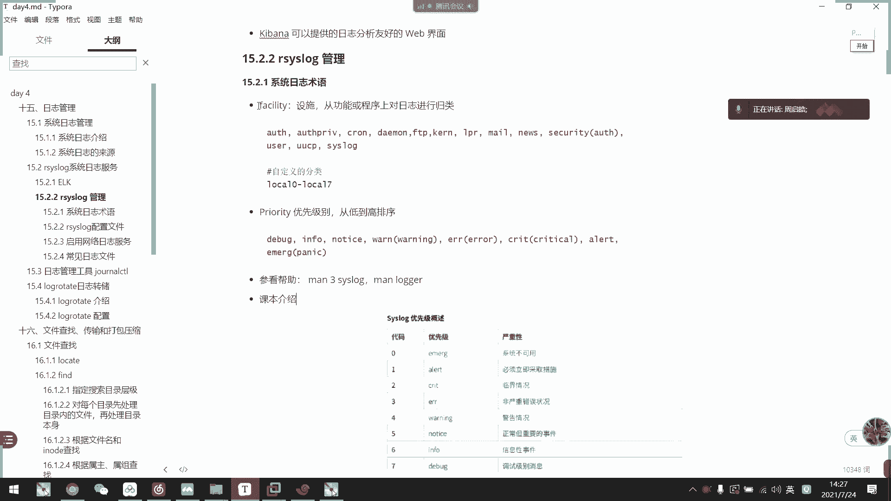
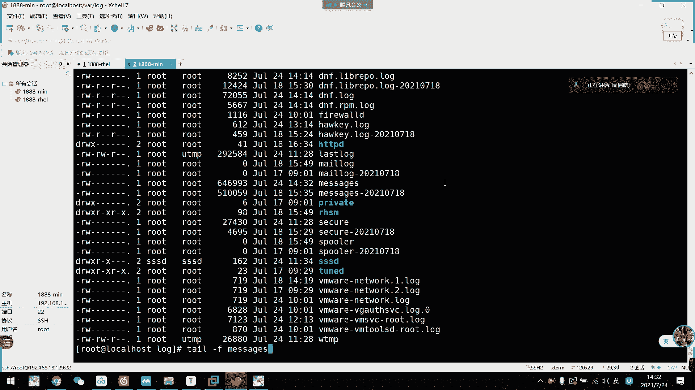
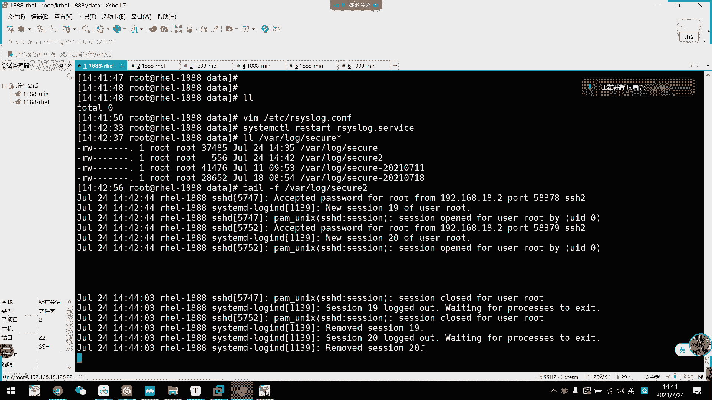
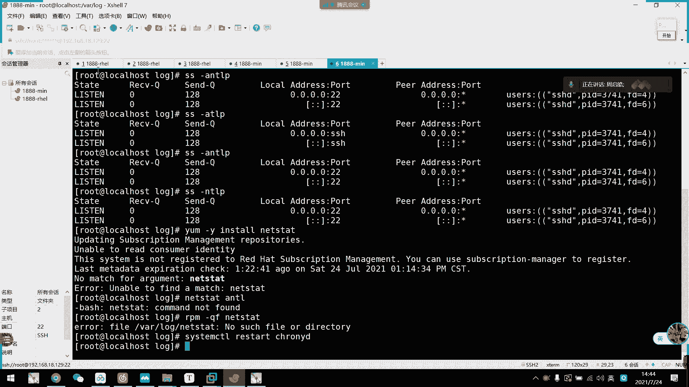
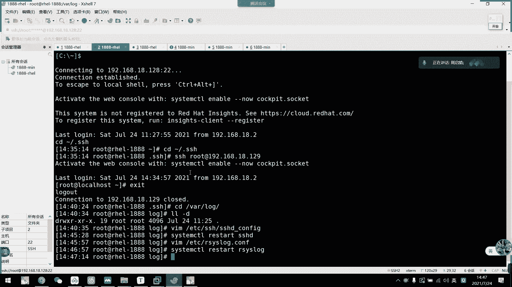

# 2021年7月新版-----RHCE8.2 RH124 RH134 RH294 认证课程 - P25：day5-4 日志rsyslog基础配置 - bili_15701050454 - BV1Gy4y1T7ug

我们先回顾一下上完内容啊，上午啊咱们主要说了一个还原SSH的。加密。远程。原件。好，SSH啊，首先。它的步骤啊是需要。胶框。获取。服务器供要。都是通过。中药。连接到5体。好。

那么交换啊得到服务器公钥以后呢啊可以通过。基于。用户密码登录。啊。第一种方式啊就是我们。得到公效以后呢，是基于密码登录啊。然后第二种是基于。客户端。粤。服务器。中药。分录啊。我们首先要。创建。

客户端密钥队。有本。迷你行是我们的SSH杠杠Ker。可以用。杠B。啊，指定大小杠T指定。指定我们的type吧。默认。创建在。呃，用户加目录。下垫。那谁谁去啊。呃。叫做。ID。RA。IDA。RA点P。

Okay。呃，如果。指定。秘钥对。存放路径。连接时。需要。杠A。诶哎。选项。指定次要。比如说SHH。干I指定data点SSH下的啊ro。R a。然后连接的是我们的user。Host。好。发送。

客户端私钥。到服务器。我们用。SHH杠 copypy。が。I递嗯。然后如果是指定的，我们要杠I。指定我们的。重要啊。然后也是UC。Bs。O这就是我们的呃SHH的一个远程连接的一个概念啊。好。然后呢。

是我们的一个。SSH。相关。配。服务端相关。配置。配置文件。这个文件是我们。ETC下的SS下载SSHD点。好。是不是看一下是不是。

啊，是下巴线啊下巴线肯定。嗯，对应的配置的我们查笔记啊。啊，然后是我们的一个时间。啊，是通过服务嗯。我们主要讲的是可拉米。看利。五单元。文解。啊，是我们的。D点service啊。好。然后呢。呃。

它也是我们的CS结构啊，但是它的配置文件啊放在一起的啊。客户端与。服务端。喂。同意。对，这文件啊。是我们ETC下的。Cronney。点co，这是没错了吧。好，然后呢。作为客户端。呃，我们要加一个。

嗯，在那里写，我复制一下。啊喂喂。诶。嗯，就这里啊。直接复制网吧。

嗱最高度。好。改这里就行了，然后呢，更改完以后呃。反退出以后呢，我们需要。查呃重新服务啊。嗯。以后。查看。同步。服务器。做不出。嗯。和我们的抗ing。屎。Soce。更无异议。14作为。服务端。可以。嗯。

添加。远船。或者。拒绝。直接同步。啊，直接加allo。呃，IP。或者IP断了。啊，dy也是一样的。也是IP或者是IP到达。O。好，然后是我们的。呃，时间设置工具啊。叫。Time date。D天。直接。

输。太。对。GTL可以。打印。当前。时间。可始啊。行行。好，然后呢。更改时区。啊，个时区。有我们的太。DateCPO。s太重。然后是。太重。这个失续啊。修改时间。可是。太い。对。CTO。せ？太。

然后格式是。格式YY。嗯嗯。你。要是。嘅住处。也不用。这事实。这应该是冒号。年月1分秒的意思啊，连月1分秒。是否。启用NTP服务。Time day时。四等 p p。要是出。Or frost。好。

然后这里。回复完了呃，给大家扩展一些知识。呃。大家有没有想到啊啊，我们。去到公共的。NDB服务器。服务器然后到我们使自己的NDP服务器。啊，加到我们的service啊serv。啊，不对，可。

那么大家有没有想到它这个公共的ATDP是在哪里同步的？啊。啊，他这个公共的APP呢是从我们的一个叫做原子中。扩了信息了啊。别走。啊，就是说我们啊还有1个CTU同步服务器是获取这个原野中的时间。

然后再给发布出来啊。再这个原野中。然后呢，原野中的话呢，大家可以向我说一下啊，当前最好的应该叫做摄云语钟啊。让就过来一个。啊，这是原种。我们NDP公公了NDP都是从这边获取的。아咗 왜 좀。

大家有兴趣可以看一下。然后现在最好的应该是射影这种射。

所以说啊是我们是我是我们国家的，我没我没记错了。哦，不是摄影就不是应该是。叫什么来着？嗯。不摄像头啊，我国的那个叫什么？中我人都。

啊，是最准的，觉的最准，我忘记叫什么了。我看一下是哪个运动来着。

那是哪个元素，忘记了。不是情远宇说，不是。你时写了个钱字，不签钟。呃，也是同位数比较低。忘记好像是料。关记。嗯不是这个亲。是一种比较。那个啥。那个特特特殊元素来的。或者是。那个怎么读啊，一个金字旁。

一个好像脖字一样的字。不是这。是尿还是妙度？说了不管了，了解一下就可以了。反正其实摄影中已经很强大了，摄影中已经是千分之呃3千0分之1了，我没记错了吧。走到就可以。那不我们保存一下。

那我们开始新的章解。呃我。

在我笔记背上那个已经解决掉了。那我们开始，行期再见。

啊，日子管理啊。这是重点这是重点，虽然考试可能不考，但是这是一个比较重要的技能来的啊，怎么看日志啊，怎么看日志。好，我们来看一下。呃，首先什么叫日志呢？啊，为什么要有日志呢？啊，日志啊。

其实我们生活中很多事情都离不开日志的啊。比如说咱们发一条朋友圈，要朋友圈那个描述呃比如说呃。今天在那里吃饭啊呃吃的什么拍了个照是吧？拍了个照啊，是吃饭那些照啊，然后写着打卡啊打卡。

是不是啊很多人是这样子发个朋友圈，对不对？然后这里有个定位啊，什么什么网红店啊，什么什么网红店。那么我们这个是不是日志的？我们发朋友圈是不是会有时间记录时间。有低点。人物可能在图片上啊，没有人物的话。

肯定有你自己，对不对？头像。留你自己。好，然后做什么呢？打卡吃饭对不对啊，只是说啊时间地点、人物做什么。这就做日志啊。啊，当然啊可能有些同学啊现在还原有一些写日志的呃日记的啊日记的。呃，习惯啊。

反正我是从小到大都没有这个习惯啊，所以非常不好的非常不好好。有了。😊，我们人物都有，生活中都有这些的啊，那么我们计算机肯定还有啊。那么他也会有记录我们的一个时间地点、人物时间啊。所要是时间啊。

就是这个事情发生的时间。地点的话是哪一台主机啊，对不对？人物可能是啊哪一个进程的，哪一个服务啊，或者是呃。哪一个用户连接进来之类的啊，那事件就是记录发生了什么事。然后呢。

我们这里啊还有一个叫做日志级别的东西。就是说呃。这个日志的一个关键性程度啊，对它的一重要程度啊，我们这边就分了8个等级啊，8个等级，我等一下再往下讲。

就好像啊我们刚刚的一个什么啊所谓的打卡在那里吃饭就写了一个啊，这个是叫可以把它当做是一个普通级别，对不对？啊，不动级别啊，什么事也没发生，可以关注，也可也可以不不被关注，对不对？啊。

然后呃就是我们的一个现有日志的来源啊，现有日志来源。我们现有日志呢是通过我们的一个小服务啊，叫做Ass。六。这个服务来收集的啊。有收集的。

还有一个叫做stem journal d啊sem journal D。小周低的他是。以二进制方式把我们从开机开始啊开机开始。啊，到目前查看的是呃，到到当前。发生的事情啊。以二进制方式记录在内存当中。

然后呢，我们一重启它就会被清空了啊。1了I lock主要工作是什么呢？啊，是把这个二进制文件。二进制。文件。通过阿log。保存到呃我们的文件当中。有是说挖log。冇录当中啊。先啊。好。

这是我们的一个啊两个认志服务的工工工作啊。当然我们log是一个比较小的服务。呃，他就是收集的主要是呃主要是我们的一个系统相关的。然后呢，还有一些是第三方小应用啊，它可能会集成在我们的s log里面啊。

有一些地插方应用那块，他会自己建立日志文件的啊，那就可能不会经过我们的20多报表。啊，他有他们有装专专门的一个英维裤啊。啊，然后呢呃我们系统里面呢从as log自动生成的呃大概有这么几种。

一个是我们的mess啊啊，一个是seecure啊，一个是mail log啊，一个是C啊，还有brote点log啊。啊当然这是一小部分啊啊，更加多的部分呢，我们等一下。在后面的讲节继续往下扩展。好。

我们先了解一下aslog这个。呃，系统人事服务啊，阿这 log是从有。6以后版本的一个系统管理服务啊，它提供了高性能，更加出色的安全和模块化的设计啊设设计。然后呢。

它由原来的一个常规的ss落呃呃s落地啊发展成为一个很厉害的。啊，可以收集。各地来源。嗯。来源于各地的输入，然后呢还可以转换，并且输出到不同的目的地啊，输入到不同的目的地。好，这句话什么意思呢？我们往后。

再来理解，就反正说其实它来自各种来源的话呢，就是它本机当前的各种服务啊的一些日志，然后输入到不同的目的地啊，可以把它想象纯文件，也可以把它想象成啊互联网中的主机。就是说我建立一台服务器。

专门用来收集我们的日志。各个祖籍的日子。好，然后呢，这个项目的报地址啊是这个。呃。打开看一下吧。其实他这一个页面跟我刚才截图的其实差不多了啊。啊，这个图。就是相当于是我刚才说的那种啊，从各种。

地方收收集过来的日志，然后再交给其他应用啊，或者是其他主机啊进行处理。呃，进行一个集中收集，然后再进行。啊，集用查看，然后让运维人员更好的去。找到。对应的服务器啊，有对应的应用进行维护啊。

打这个图就是这样的意思啊。就说这些都是什么什么服务之类的，然后啊保存下来，通过ac log，然后再传输啊，可以传输给我们的elect search啊啊，可以保存到文件啊啊可以。

弄到数据库啊等等之类的东西啊。两哋坐得起啊。有了。呃，我们阿log的一个特性啊啊，它是多线程的，然后支持UTV也支持TCP，然后还支持我们的SSLTLS协议啊。还有EPL呃ERELP协议。然后。

那个实现我们的一个日志抓储啊，存到数据库里面。呃，还有强道的过滤器啊，可以实现我们那个。这个之中的一个日益部分自定义输入格式啊，还有一个适用于企业级的总机量啊，企业总机量。虽以呢我们啊。

企业中呃都是有一个日志收集集群的啊，有我们的ELK啊，现在可能都很少ELK了啊，很少ELK为什么呢？呃等一下再讲，我们先看ELK是什么东西啊，ELK啊。

首先是一个elect有一个log啊有一个keke三个文件组成。然后呢elect search是我们的一个非关系呃非关系型的数据库啊。呃，它是一个时间数据吧，时间数据库吧。

还提供了一个开源分布式搜索引擎啊，然后呢呃lock search取它是收集日志，并且分析日志啊分析日志。所以为什么现在很少用这个呢？因为它在分析日志的那个步骤啊，很是资源啊，很是资源啊。

如果它只是用于收集日志的话啊，这个还可以使用啊，还可以使用。然后呢呃ki巴了啊ki巴拉师提供了我们的一个we界面啊，挺好用的。大家有兴趣的话可以看一下，这边只是啊稍微做介绍啊，让大家知道什么叫啊要K啊。

啊，在在企业中肯定不止使用1个S4lock就可以解决了。啊，当然我们的乐呃乐ch search区啊，它。怎么说优质的，还是通过log的啊，其中。它的功能之一设其来，还是我们的IClog给它给传输是吧？

ok。那么我们还是不讲太太多东西啊，回到我们aclog啊log。呃，我们主要要知道两种东西啊，呃三种东西吧，三种东西啊，一种是它日志文件，一种叫做设施，另一种叫做呃级别。

级别刚才说的我报用级别啊报用级别。啊，然后这里设施设施的话呢，我们也目前不要也不需要关注太多啊。关注的一个是验证相关的啊，计划任务相关的呃，内核相关的。呃。这个也是验证相关的啊也是验证相关的。

都是用户相关的而就是相关的啊，但是。常用的还是这些啊这些60的话呢，现在基本上已经不用这个事试了，没什么用了，也没什么用啊，他的是vivo6以前的呃那些东西啊，这个是邮件相关的啊，邮件相关的。

如果你配置邮件服务就啊有有用啊。然后呢，是我们的一个。你日志日志级别啊日志级别。那首先我们debug级啊，infor级啊啊ros级啊，running级业还有us级啊。然后后面的out啊eerage啊。

这个是最危险的，这个U先啊那个那个那个级别是最高的，这个是最危险的。如果他出现了eerage级了，它会向我们所有终端都发发送信息的。啊，然后debug级的话就普通信息啊。

infor级也是普通信息notify级的话就是呃呃los级的话是也是普通啊普通机，它相当于是日常啊，像我刚刚说的所谓的打卡啊，所谓的打卡。然后working级的话呢就有一些警告啊。

那个警告的话大家注意一下啊啊，看一下它警告的到底是什么啊。警告一般都不需要处理啊，警告一般都不需要处理啊，就是说我们的8到5啊，8到5是不用管的。然后呢。到20级啊，开始错误了错误。

错误级以上呢都是需要运维处理的，错误会导致我们服务根本开不了，这就所谓的错误级别。啊，这里有它的一个代码有一个代码。啊，这里有它的一个严重器啊严重器。啊，这是我们的一个课本介上来的。好。呃。

我们现在了解到了一个设施，还有优先级别，那么他们是怎么用的呢？

他们什么用？我们通过查看。他的一个。陪什么建嗯。看一下没人件呢。我先打开一下别论点。不是这个。应该是这个啊。好，对，这是它的一个配软件。我们先不用管前面的东西啊，我们直接往下啊看到。这里。

就是我们一个设置级别怎么用啊？你看。啊，这个心代表所有。呃。它结构是什么？前面是设施。后面是级别。就是说我定义以后啊，比如说这个。啊，验证相关的所有级别啊验证相关的所有级别都全放在secle。

意味着我们secle是干嘛呢？就与。这个设施相关啊的一个8个级别，只要有信息过来，我都存放在这里。啊，是这个意思，所以他的。格式就是设施。设施。Dian。自咩。然后就是定义文件存放路径啊。啊。

这是什么东西？就是这这么用的。就这么用的。然后啊设施这里还要提一下设施，我们这里还有一个叫做自定义分类啊，一共8个自定义设施啊，从0到7啊叫look，looklook0到7啊。

这个等一下再讲怎么用啊，我们知道就行了啊，我们知道就行了。好，往下配合文件啊，刚说的。它主要由三部分组成。嗯。可以啊。其实都是分类啊，你你难道说级别不是分类吗？你可以这样想，其实他他们都是对应的。啊。

然后是他这个配置文件啊，我们刚刚打开下面不是说啊，先不用管前面的吗，但是虽然先说不用管。

到时候我们要注意一下，他几个几号加起来的，叫做一个。呃，一个快啊一个块这个models啊就是模块的意思啊模块。然后第二个是全局。全局。They were。全局什么来着？😊，G狗。啊，全职配置啊。啊。

这个我们一般也不用修改它，一般也不用修改它。但是他这里啊要注意啊，他说包含了指配制啊，什么in啊in包含。就是说我们按Clog下面的点co。啊，都是啊。然后呢，我们主要的还是要关注一下它的规则。

叫做 rules啊规则。然后我们刚写的都是规则，你看这里还用到了一个自定义协议啊，制定义协议。

好。好，它的配置格式啊，规则的一个配置格式。我刚刚说了，就是设施加我们啊点点啊点我们的级别。然后呢，多种设施我们又分号结束啊，又封号结束，心代表所有啊心代表所有。级别也是新，也代表所有啊。啊。

那的话是不记录。

好。有了。这里C也代表所有设施。但是这一句啊要注意一下啊。呃，他虽然说所有的设施的一份级别。但是呢他这里后面还指定了说这些让让让让让就是说我们不记录这些东西啊，不记录这些东西，然后再在后面重新定义。

后存定义。你看它本来这里那么我就不存放在m里面，我要存放在Opri里面啊。对不对？头呃，邮件也是啊，我要指定准便再拿个邮件啊，然后是关于我们的计划任务的。啊一毛子了。啊，后面那些不用管。好，然后呢。呃。

我们这里还要讲一下这个横杠。横杠。好像就异步啊，就异步。哎呀，谁资。啊是意义。我写了什么字啊？Y。Yi。不。啊，啊这异步，他意思就是说不是实时给存放到日志当中的，我们其他没有横盖的叫做同步啊。

就是说事情一发生，我就要记录进来。好。我来看一下怎么那个呢啊，我们这里。就像说这个服务器啊一样。一样呃，有我们的日志了，对不对？我们先CD到里面去啊，哇log。没事。锤子好，okK我现在进来了。

然后呢我们找一下message啊，message看到没有？好咪。食啊。跳。我。

然后再开一个窗口。一开估去他就有消息了。啊，对。

嗯。

🎼我把。SHH的服务改回来。好，所以打开两个。你看你其实已经有记录了，他现在其实已经有记录了，然后我这边再跳。对。怎么处理了？食 it。原告两。然后呢。对，其实已经可以注意到了，我登录了。

我登录他已经记录了。那么我们这边呃。收回。他怎么还有那个呢？我这里不是关了吗？我还有个10秒啊。这。谢谢你回来啊。啊， ok k 。那我们现在。怎么又有信息了啊？胎 out了。嗯。哦，要重新打开窗口。

好烦啊。看一下会不会退出啊。也不会啊过了10秒吧。那我们现在打开一个新的终端，然后呢，我从这边SSH过去啊。好，连过去了，你看两个都有感叹号，他们两个都有收到信息啊。

就说SS过去的话呢啊它都关于量信息都啊，oss等2pri都有相关的啊。我们看一下这里be我们提供了什么信息呢？虽然他说是新的规划，55啊，是通过我们的luer用户啊。然后开始这个绘划。

让我们看一下这里存的是什么信息。有。他这里说。呃。它这个是通过我们公钥啊，是通过我们root的公钥啊，从128端口是33818啊，连接到我们的这个服务器啊，然后它这里显示的SA就是它的一个加密信息啊。

然后呢是。验证。就是他记录这个信息啊，然后是word by啊，主要是拉地里。然后我们这边再开一个。看不到。A。呃。怎么看不到他哪个连过来。

那个叫什么来着？这个包是放在哪里的？

So。封那个了。看不到东口就看不到东口，我们这边知道就行。什么这里都有显示刀口出来。

然后他这个就是呃2020的。bo斯的那个。

misss日志，然后这个是我们的seecqel啊，是我们aspri定义的日志啊。What's price。That's break。啊，是所有级别的啊。然后这边记录的是我们的英风级别的啊，英风级别的。

但是我们mess的话呢，他。

还接收我们的一个服务。信息吧。对看我们抽取服务，他都会有信息记录的啊。先停止掉我们的一个什么什么啊，所以我们可以通过面去查看我们服务是否啊已经正常运行啊，也是可以的。

OK然后呢啊我们这边。玩一下。嗯。怎么改给谁先取的？怎么了？要望住加晚啦。这个是发信息到终端啊，这是发信息到终端。我们等一下再验证这一个东西啊。一步一步来。好。

这边的话呢我们是可以自己定义的啊可以自己定义的。比如说我不要它存放在我们的CQ里面了啊。我们要诶。呃，我们比如说把osscribe。点。二八只得二三啊。0级以上的啊，翻在我们外log。Data。

对他的se。都少啊。可能不行。他是这样就可以了，那没有关系了。好。直接sQ吧。直接写给我。然后这个也不要了。不行。先end点 info。然后这里。加一个。我て。No。这里。也加一个。Oth。点一半。

就我们 datata的se。冲电服啊。Mrister。好，那我们现在CD到地。他现在还没有文啊还没有文件，那么。我们这边直接连接一个新的配话，看一下有没有记录啊。嗯，怎么还没有？ET下的阿。不行吗？

还是说不能写在。确定。一百个级别。还是一定要放在挖龙的先，看一下。再连一次。等一下。哇，log。有没有啊有了啊有了。行，马上就有大小，有信息了，我们跳盖一下。跳有个。估计是刚刚。

这个I呃IC log他用户他没有权限。可能是他的那些in作怪啊。看到没有？这里有我们的listsession。信息啊从哪里来的？啊，就是说我们刚刚的ospi啊，这个是不是me的信息？

然后这边。呃，是我们的。呃。这边呢是我们的。seeccurre信息，然后我们现在把它组合在一起。主要在一起。

。但时为什么连了两个？擦掉。啊，退出他也有记录啊。

那这生这生到此结束了。啊，这是我们自定义的一个日志啊自定日志。

就这样子。就这样子。😀呵呵。😊。

就。不要不要不要拍照是吧？好，这是我们制定日志。

啊，而且还是用到了相关设施啊，相关设施内置设施。那么。接下来我们要看的是。自定义分类啊，资源分类啊，这个很有用的啊，一般是我们一些指定第三方应用啊，它。如果可以设置日志的话呢，就可以。呃。

用这个东西来指定手机啊，比如说。

呃，为什么我们SSH呢会。

收集到我们的aspri的日志。原因是在这里啊，我们来看一下。Yeah。BBC下的SHHSHDE。啊，你看对嗯就是这个。🎼这也写着啊我们的一个日志设施啊日志设施。那么我们先把这个。不止一份。改一下啊。

叫做LOCL。6吧啊6个6。WK那我们现在。在SSH的话，看一下有什么情况。他依然会记录。他那个呃呃没重启服啊。我记得他还是会记录的啊，他还是会记录，因为他这个算是默认的呃，但是我们自定义的话呢。嗯。

他也会分开记录啊。我看一下是不是啊。啊，重级服务了啊，重去服务。对对。我去看一下这个信息啊。他说我从哪个session退出而已啊。然后我们现在。连接一下。看一下他有没有，他已经没有了那个。呃。

二priCC息啊，你有没有二pri信？那么我们现在定一下啊。定一下我们的日子啊。It is是 r四六。这里改一下。呃，把pri哦，不对。把我们的。Logo6。点心啊。这是第一吧，哦。

直接点击一下所有级别吧。哇，老。对。放到这里。出你服务。是另运设施啊，你又走神了吗？呵。😊，我现在已经讲到自定义设施了，刚才我不是提到了吗？前面自定义设施。

0到7嘛，我要定义那个6嘛。

是不是？啊，现在重重启啊。

怎么从你这里没有记录呢？

哦哦，他啊。不记录这个他是记录在m里面。🎼那么我们现在呃再连一次啊。

有信息了，看一下。啊，我们Opri的CC有没有啊，有了，对吧？What price are you。这个是我们自定义的一个热热设施啊，我们可以把多个。呃，多个服务的信息啊都指定在同一个。

呃就是同一个设施里面啊，然后再指定为我们自己要收集日志的文件，这样子啊就可以更好的更呃更好的收集到我们所需要的日志了。更好的处理啊更好的处理。

我自自定设施用用途啊啊，就是我们自定设施用途。啊，然后呢我们还有一个。工具。

我还要工具照什么？Loger。

这工具啊，刚刚有同学问到啊那个。这个。有什么用？这是把呃如果如果有。如果有imerage级别的错误呢，它会在春端上面显示啊，但是我现在做不到啊，就是说我手动是做不到这一个情况出来的。

那么我们可以通过什么呢？啊，叫做。Loer。啊周红珠啊六嘅。让我们看一下他怎么用啊。我望。嗯，com是PID好个杠P可以指定它的一个级别啊，可以指定级别。那哪个设置定他的设施？好像没有啊。

设施好像干PK同时指定设施的。是不是可以。Make for visit。で四。级别。看下面。看一下范力啊。啊，他是杠P直接指定啊OK那么我们来看一下你刚才说的那个呃emerage级别的。呃。

我们来loger。杠P。啊，随便一个吧，叫。点 imagine。

有没必错。

EMERG。老师，this is test。冷的，如果这个在生产上面这样发。估计可以炸掉啊。看到没？他噔的一声啊，噔的一声就要警告声音。然后呢。他还发了一个就是。这些叫中呃im级别的系统不会用级别。

它就会向所有的中端都发送这一条日志，然后呢让你们去做处理啊，做处理。这是羽motion级别。搞啲。啊，那我们先休息一会吧。

先息一会。