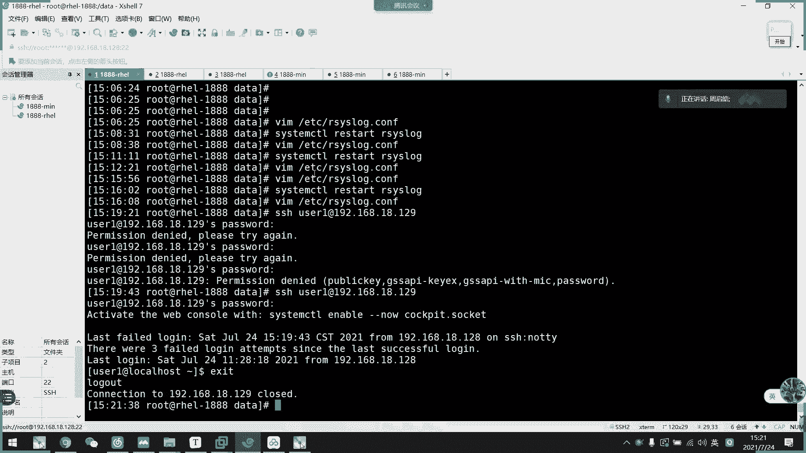

# 2021年7月新版-----RHCE8.2 RH124 RH134 RH294 认证课程 - P26：day5-5 rsyslog收集网络日志 - bili_15701050454 - BV1Gy4y1T7ug

啊，刚才我们看了一下它的一个。嗯。基础的一个定义啊，日志收集基有定义。那么我们现在看一下。嗯。哦，对，还没讲。它的一个日志格式啊日志格式啊，首要是时间。然后是哪个主机啊是哪个主机。

然后是哪一个服务或者是进程。的一个信息，然后后面都是他的一个事件啊，后面都是一个事件。啊，主要是前面都是时间啊，地点人物啊。OK那么刚刚说到了一个。呃，loger啊用来测试日志的用来测试日志。

这边就没有扩大写出来，但是大家要知道有这个工具啊，因为这个日子的。

我们本地日志刚刚已经说过了，我们的slog强大支付啊，是可以跨互联网。跨互联网去收集日志啊，这日志那么怎么做呢？比如说。我。当前这个mini这一个服务器啊，是作为我们的日志收机服务器啊。啊。

作为我们就是收集服务器。然后呢。他要收集我们1886这台服务器的日志，那么我们怎么做呢？我们先看配置文件。好。去到贵了这里啊，不对。模块这个模块。啊，你看它是怎么加载的，什么通过joD这样子加载过来啊。

这是内核模块，我们不需要太。了解啊，暂时来说不需要太了解，大家有兴趣的话以后扩展去学。我们主要是通过模块这里去开启它的一个呃。网络服务啊。比如这两行啊这两句啊，一个是IM。DOP那我们就把这个开起来了。

把这个开起来。开起来以后呢，那么怎么收集啊啊，比如说我现在这里。不会自定义了一个吗？啊自定义一个。那么我想他在本机。收集同时发送到我们的。呃。日式服务下怎么做的？比如说我这里logo6星。

然后呢我们这里。把它指向我们的服务器啊指向我们的服务器啊，应该是一个at。比后说地址。18点。点什么好了。129。然号。放在哪里啊？哇log。哦。应该是一个。重启服务。好，那么我们这边接收了以后。

它就直接存放吗？啊，我们现在开启了。我们现在是开启了。有的啲啊。嗯。还没开。现在有。还没有啊。洞口怎么514洞口怎么还没开呢？514端口。啊，这个也要开啊。看到没有。啊，开了啊514。那么我们现在直接。

🤧获取。这个设施它能收到吗？会保证到我们3Q2吗？我们现在看一下有没有这个文件啊。目前还没有啊目前还没有。那么我我们现在远程看一下。看一下有没有。诶。呀还是没有。那么我们怎么开始收集呢？啊。

我们想一下这个逻辑啊，想一下这个逻辑啊，我们。1888呃，我写IP吧，128这台机器通过。Lo口6。来收集这个日志。那么我们这个服务器。是不是他接收了lo口6的日志以后，那么他到底要出发在哪里呢？

我们是不是也要配置啊？啊，所以我们这边配置一下。合逻辑。嗯。写在这里吧。lo口6。Okay。是。嗯，然后存放在我们的哇。石桥。哦，刚刚那里应该写错了。这里我这里应该写错了啊。这里应该不需要加。啊。

就相当于我把lo6的日志发发送到这边来。啊，不用啊。我这边呃你要明白一个逻辑啊，我们端口连接啊，比如说我呃MIM这台服务器是一个web服务器。那么我们开启HTTVD。服务以后呢。

它服务器会监听80端口啊，会接听80端口，默认监听80端口。然后呢，我这里访问过来。翻过来啊，128啊是不需要开通80的。它是不需要开通80的，它反过来以后呢，HTPD这里它可能会有一个随机的断口。

像我们刚刚的1个SSHH服务不是6万呃，比如是62500。80帧呃5508这的端口连到我们22吗？对不对？所以我们要确保自己的端口开了，然后它反应过来的话，它不是按照80的啊。

它反应过来的端口不是80的啊，这个要注意啊。た。嗯。我们连一下看一下。可能是我写错了，也不一定。

可能是我写出来不一定，我看一下，我也忘记格式了。这里开的是UTB的。啊，没有啊。没有发蜜啊。或者不写了怎么办？佢下有冇分别。没有，下面都是我们的做CTL的。

嗯。麻烦。我有么写。Seick your room。Logo new。这里这。不打那么多自真去。SH192。168。18。128。别过了，看一下有没有。啊，有了看到没有？让我们来看一下。嗯，看到没有？

你看这里就是我们的时间，然后主机是不是我们的re1888了？啊，然后是他的信息。啊，就从我129通过这个端口，看到没有？刚说了他不需要开端口啊，它反过去了，然后是SSHV2的啊连过去。啊。

这就记录到我们的信息了，这就记录到我们的信息了。ok。这是呃我们的一个网络收集服务啊。网络手机。当然我们同样也可以这样写。那么这次就开呃。TCP的。那开力CP的其实也是一样啊，把这个开了就可以。

也是我们TCP的514端口。然后呢，我们这边。把这个。嗯。他又不能特意特别指定这个东西。让他全班到两个位置吧。也是准备在我的walllogse you。那么我们这边也投知记录啊。那么我们看一下。🤧咳。

呃，TCP呢，我们用两个这子啊。啊备注。呃哦，没事。whatpri啊也写到我们的seecQ2，让我们来call一下。

好，这是原论。显示出。

这里就有日志的，这里应该也有啊，这应该也有。刚刚的是不是28分呃，28秒啊，16分28秒，刚刚的。啊，比较有。呃，那我这边改一下。改过了。再我说一波啊。好，我们来看一下端口。诶。T5L。嗯，没有。呃。

TCP的也开了啊。TCP的514呃514也开了，然后是UDP的514也开了啊。

好。那么我们现在远程啊等等。跳一下。要后是哇log secure。那我先原来链接。看到没有？

他本地。他稳定有相关信息。然后同时我这里也收集到信息。跟我第一次的信息已经不同了。你看这是我们Opri收集到的信息啊。看到没有？这就是我们的啊呃TCP收以数呃TCPUUTP啊。

然后这个作为我们的日志服务器所开的。一个。网络数机服务啊，网络数服务。但我们本地同样也可以选择存游到这里啊。这是我们的呃aslog啊阿。然后呢呃我们回头看一下常常见的一些日志文件啊。

首先是我们的啊都是在onelog下，我现在讲的都是walog下。

啊，首先是我们的se啊，s系统安全日志不分得是啊，然后是因周期性分析。第二个是我们的B temp。b type啊，这个是当前系统上用户的失败，尝试登录相关的日志信息二进制格式啊，是二进制格式啊，注意啊。

二进制格式。我们可以通过fial。

要是B ten。看到啊，这是一个贝塔，我们看一下，看一下有没有信息啊。对。啊，虽然能看懂，能看出来，但是它还有一些隐藏的信息。那么我们试一下last。B。啊，就没有。看到它的一个转化格式。啊。

这是失败登录的失败登录。啊，比如说。啊，他不能接电，我们用 watch看一下行不行？这个A截去。应该可以啊。我来。表述一下。要四一。192。168。14。8。129。因我这边故意输错密码。是外当独了。

看一下这里有没有记录，你看。多了啊已经多了三个记录了。是不是？啊，这就是我们的一个记录失败信息。呃，为什么要查这个日志呢？这个日志啊一般来说。比如说我这个是一个投放到公网的网络服务器啊。

那么他要访问我们的we博页面，它是不是呃。可以可以得到我们的一个解析解析IP。然后呢，他想要攻击我们的这个服务器，他是不是就可以用SH选呃SHH然后呢再设定一个或者是root吧，直接用root这个去。

呃。去去访问我们的服务器啊，想要登录到我们的服务器，然后他就一直测试密码了，对不对？一直测一直测一直测，然后他就记录在这里啊。然后呢。可能呃那个失败信息可能就是他一直在测试密码。造成的一个啊认证数据。

然后我们可以通过这里啊，就可以统计到我们的一个被攻击次诉了。

好。然后是我们的Wt啊，Wt也是二进制格式的，它是记录我们正常登录系统的一个相关信息啊。

啊，比如说呃。

我去。In last。有点多啊。能看到末尾吗？啊，应该差不多吧。呃，然后我们这边正常登录一下。真头录看一下这里有没有记录啊，你看马上记录了。还是正常登录信息。啊，跟刚刚那个对比一下。

我们有什么用户是可以正常的啊，有什么不正常的，那么就可以通过这里去分析掉。

我们是否被攻击了啊，就是。是合被攻击成功的。

还有一个。这个last斯log。啊，每一个用户啊，当然这个是本地用户啊，本地用户我们看一下lastslog。

有。

有很多是level log的啊，因为这些都是我们的系统用户啊，他们的销都是beb嘛，对不对？啊不啊都是pin log嘛，对不对？然后目前可以登录的就是我们的w，还有我们的userE啊。

反正些都是从未登录的，因为他们无法登录的。好，然后这里是booklog啊，不log就是基入我们的一个系统启动服务相关的，我们来看一下。

没数据啊。我没有做记录啊，我没有做记录。

，那不管了。然后是message啊，就是系统中大部分的一个信息都存放在这里。我们一般查看服务信息啊，服务的状态，我们啊服务服务的日志我们一般都是看ss就可以了。然后是F的日子。

这是我们安装系统时候的一个日志，装完以后就不用管了，我们也不会分析。

呃，非喵易啊。对。还有一个点落。这是我们装的时候设置的，然后它一个安装过程啊。很多debug啊inform级别的啊，一般来说应该没有20级别的。She。

不管。啊，我们通常要分析的都是这么点啊这么点分析。好。那么我们2次次log就讲到这里啊，20个log就讲到这里。

