# RHCE认证课程：P26：rsyslog收集网络日志 📡

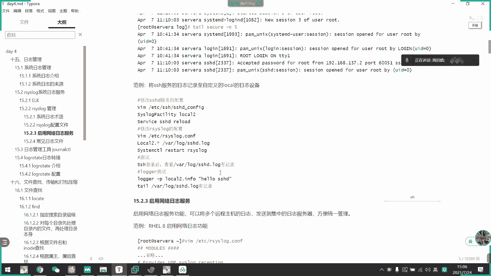

## 概述
在本节课中，我们将学习如何使用rsyslog进行网络日志收集。我们将了解日志的基本格式，配置rsyslog作为日志服务器来接收来自其他主机的日志，并查看系统中一些关键的日志文件。

---

## 日志格式解析
上一节我们介绍了rsyslog的基础定义，本节中我们来看看日志的格式。

一条典型的日志记录包含以下几个核心部分：
*   **时间**：事件发生的时间戳。
*   **主机**：生成日志的主机名或IP地址。
*   **服务/进程**：产生日志的系统服务或进程名称。
*   **事件**：具体的日志消息内容。

可以将其理解为记录了事件的“时间、地点、人物和事件”。

此外，有一个名为 `logger` 的工具可用于在命令行中生成测试日志，这在调试日志配置时非常有用。

---

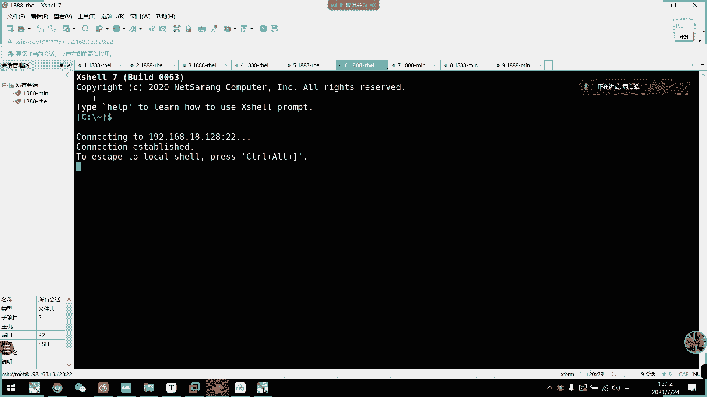

## 配置网络日志收集
rsyslog的强大之处在于能够跨网络收集日志。接下来，我们将配置一个日志收集场景。

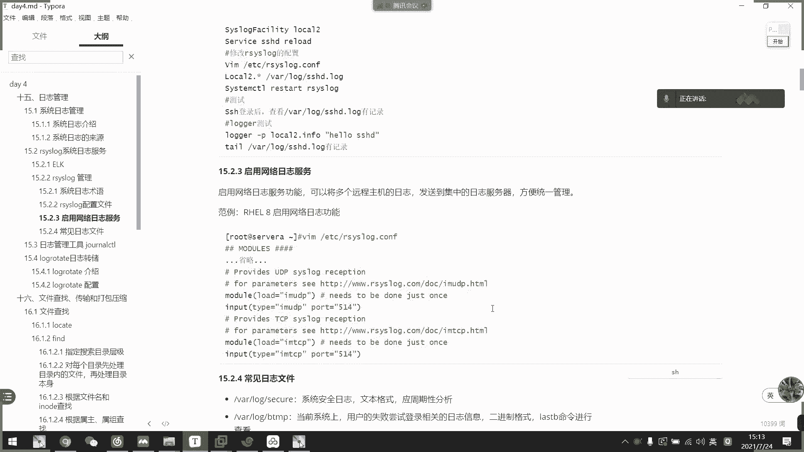

### 场景设定
假设我们有两台服务器：
*   **日志服务器**：IP地址为 `192.168.18.129`，用于集中收集和存储日志。
*   **客户端服务器**：IP地址为 `192.168.18.128`，需要将其日志发送到日志服务器。

### 在日志服务器上启用网络监听
首先，我们需要在日志服务器上配置rsyslog，使其能够通过网络接收日志。

1.  编辑rsyslog的主配置文件 `/etc/rsyslog.conf`。
2.  找到并取消注释以下两行，以启用UDP和TCP日志监听模块：
    ```bash
    # 提供UDP日志接收
    module(load="imudp")
    input(type="imudp" port="514")

    # 提供TCP日志接收
    module(load="imtcp")
    input(type="imtcp" port="514")
    ```
    *   `module(load="...")` 用于加载相应的模块。
    *   `input(...)` 指令定义了监听协议和端口（默认为514）。
3.  保存配置文件并重启rsyslog服务：
    ```bash
    systemctl restart rsyslog
    ```
4.  验证514端口是否已监听：
    ```bash
    ss -tunlp | grep 514
    ```

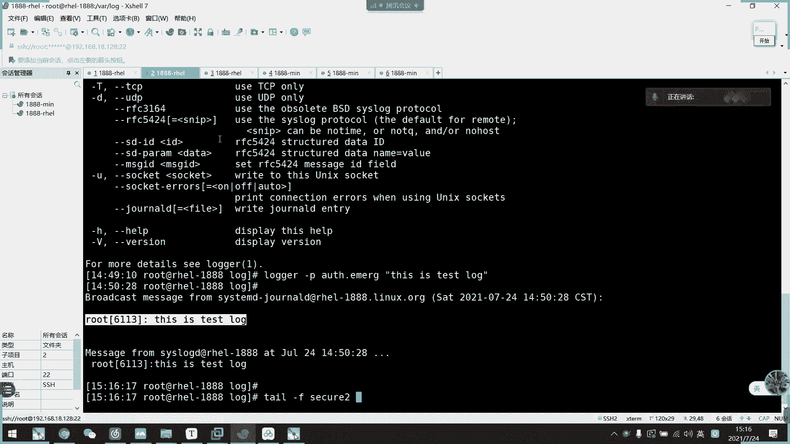

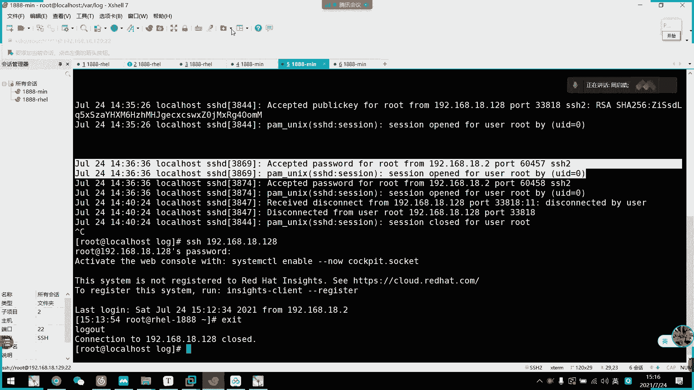

**网络连接逻辑说明**：日志服务器监听514端口，等待客户端连接。客户端发起连接时，会使用一个随机端口连接到服务器的514端口，因此**客户端无需开放514端口**。

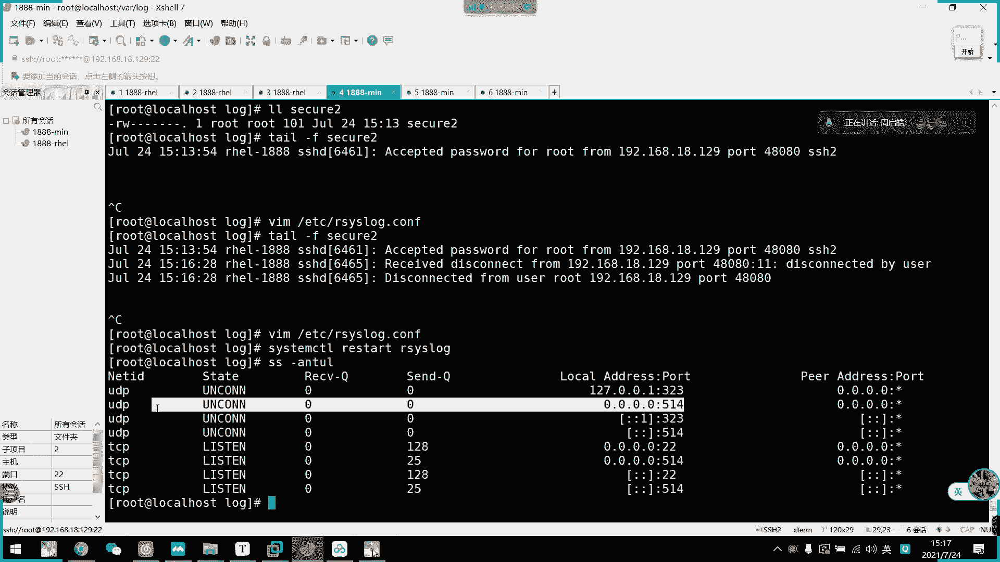

### 在客户端配置日志转发
接下来，在客户端服务器上配置，将其日志转发到日志服务器。

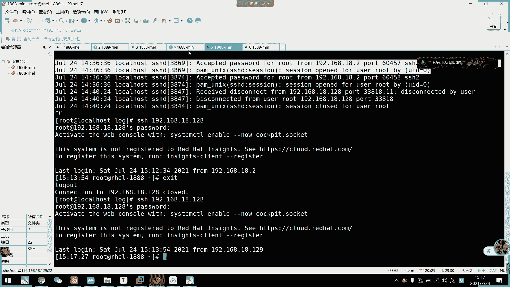

编辑客户端的 `/etc/rsyslog.conf` 文件，在文件末尾添加转发规则。以下是将所有日志通过UDP协议发送到日志服务器的示例：
```bash
*.* @192.168.18.129
```
*   `*.*` 表示所有设施（facility）和所有优先级（priority）的日志。
*   `@` 符号表示使用UDP协议发送。如果使用TCP协议，则用 `@@`。

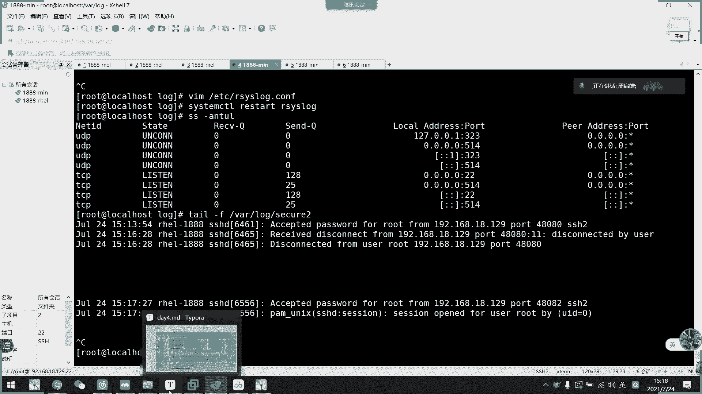

如果只想转发特定日志（如`authpriv`相关的安全日志），可以这样配置：
```bash
authpriv.* @192.168.18.129
```


保存并重启客户端的rsyslog服务：
```bash
systemctl restart rsyslog
```

### 在日志服务器上配置日志存储
默认情况下，日志服务器虽然能接收日志，但可能没有定义如何存储这些远程日志。我们需要为其添加存储规则。

在日志服务器的 `/etc/rsyslog.conf` 文件中，可以添加规则，将接收到的远程日志存放到指定文件。例如，将所有远程主机日志按IP地址区分存放：
```bash
# 接收所有设施的日志，并按来源主机IP创建目录和文件
$template RemoteLogs, "/var/log/remote/%HOSTNAME%/%PROGRAMNAME%.log"
*.* ?RemoteLogs
```
或者，简单地将所有远程日志追加到一个文件中：
```bash
# 将接收到的日志追加到 /var/log/remote.log
*.* /var/log/remote.log
```

添加规则后，同样需要重启日志服务器的rsyslog服务。

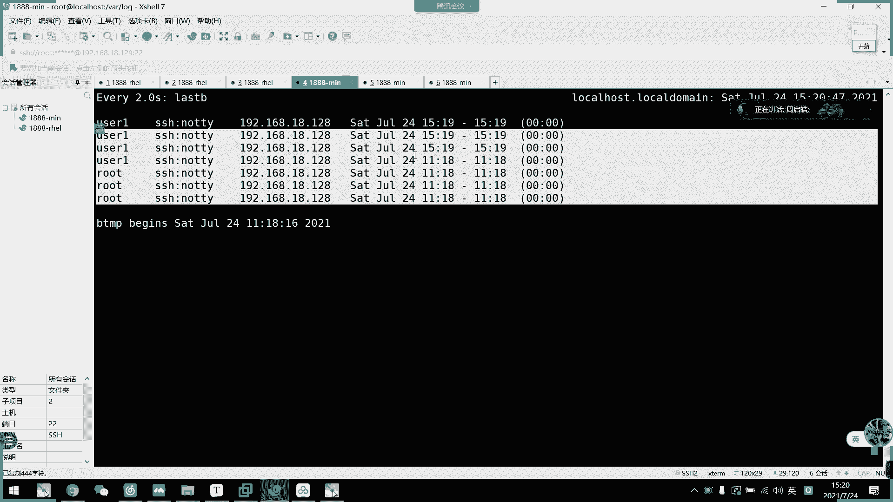


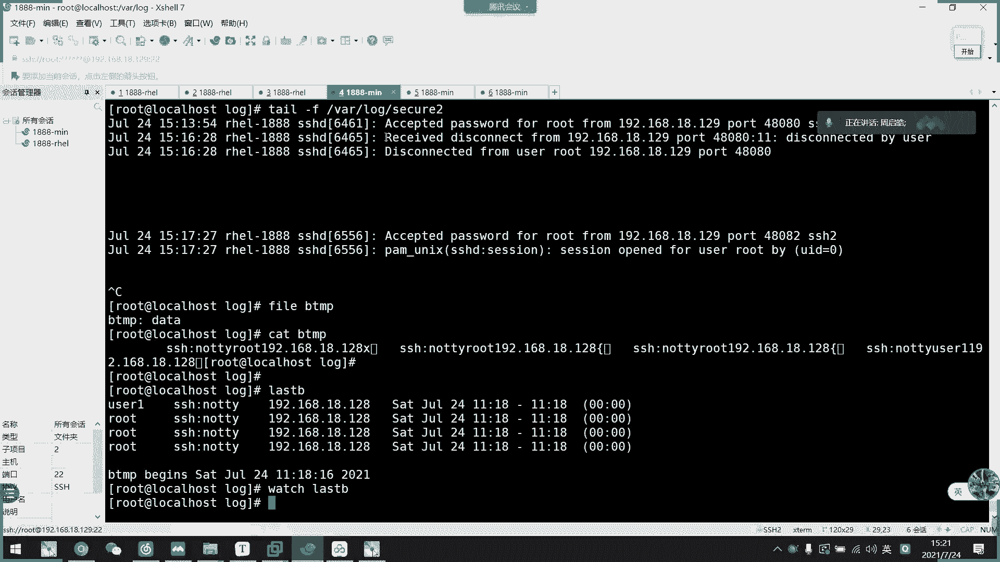

### 测试验证
配置完成后，可以进行测试。

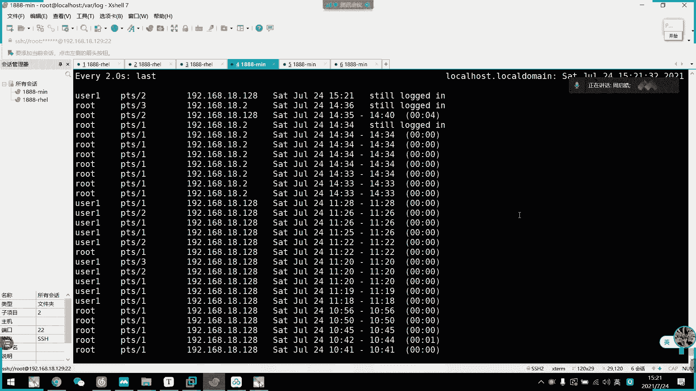

1.  在客户端服务器上，使用 `logger` 命令生成一条测试日志：
    ```bash
    logger -p authpriv.notice "这是一条来自客户端的测试日志"
    ```
2.  在日志服务器上，检查配置的日志文件（如 `/var/log/remote.log` 或 `/var/log/secure`），查看是否收到了来自客户端（`192.168.18.128`）的日志条目。

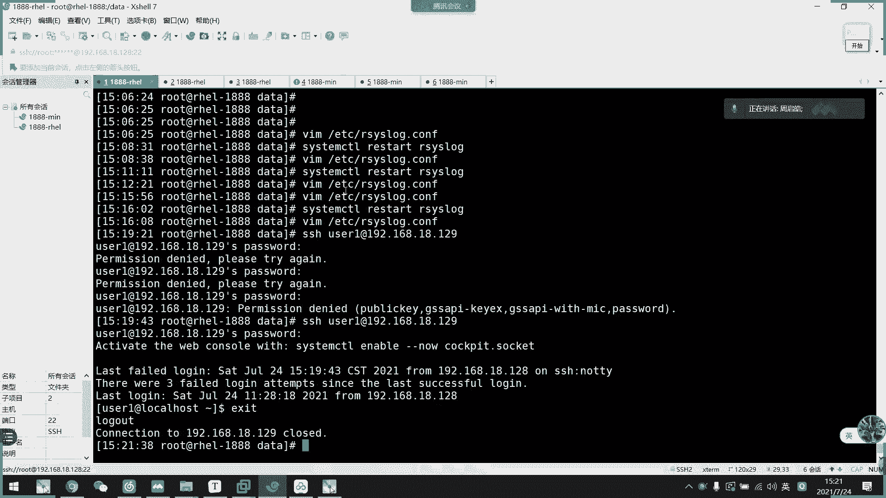

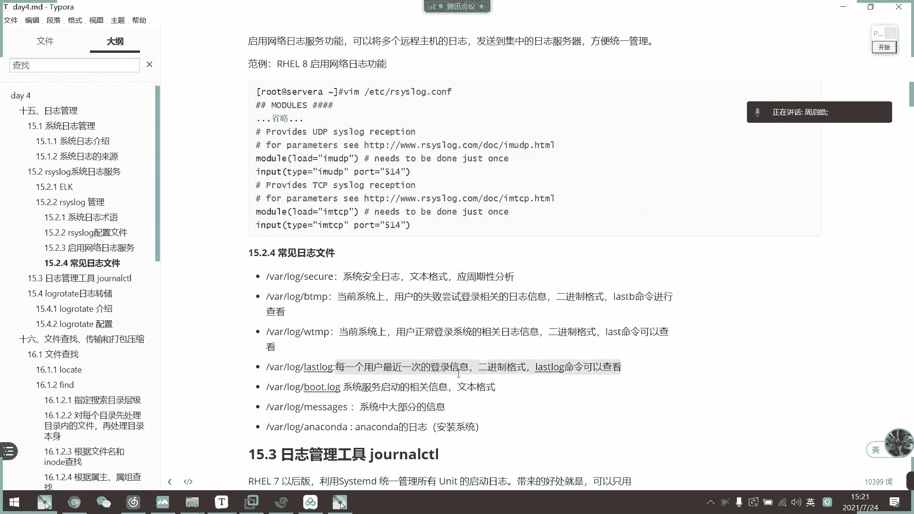

---

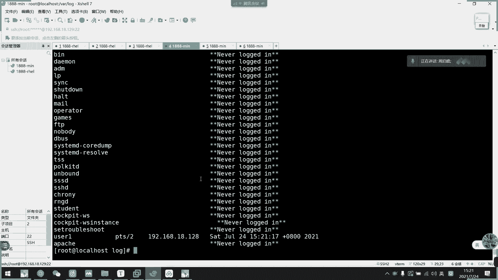

## 关键系统日志文件介绍
除了网络收集，了解本地重要的日志文件对于系统维护和故障排查至关重要。以下是 `/var/log/` 目录下一些关键的日志文件：

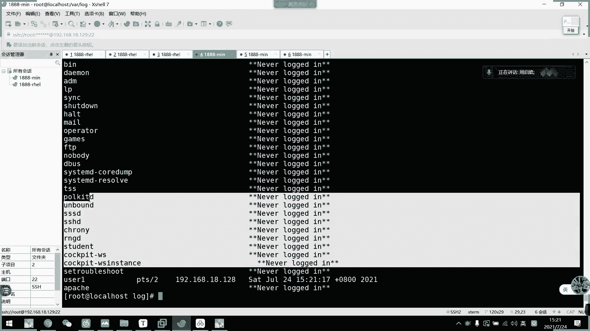

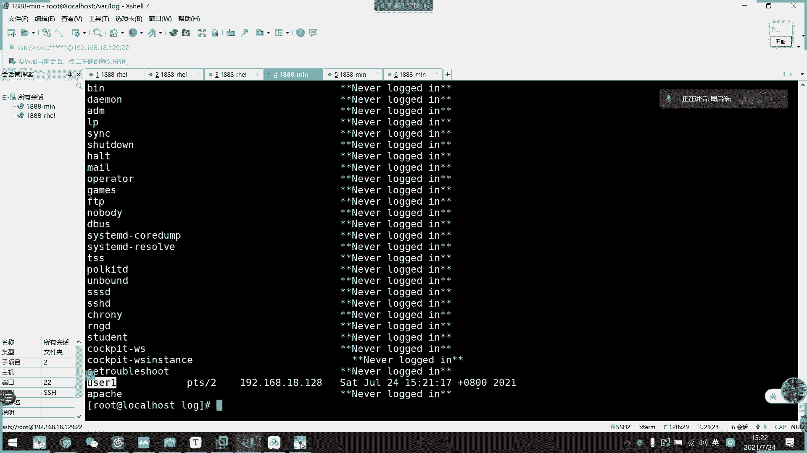

以下是常见的系统日志文件及其作用：


*   **`secure`**：记录系统安全和身份验证相关的日志，如SSH登录成功或失败、用户认证等。是排查安全事件的首要位置。
*   **`btmp`**：以**二进制格式**记录所有失败的登录尝试。不能直接用 `cat` 或 `less` 查看，需要使用专用命令：
    ```bash
    lastb
    ```
*   **`wtmp`**：同样以**二进制格式**记录所有成功的登录和注销事件。查看命令为：
    ```bash
    last
    ```
    *   **安全分析**：通过对比 `btmp`（失败）和 `wtmp`（成功），可以分析系统是否遭受暴力破解攻击以及攻击是否成功。
*   **`lastlog`**：记录每个用户**最近一次**的登录信息。查看命令为：
    ```bash
    lastlog
    ```
*   **`boot.log`**：记录系统启动过程中服务和进程的启动信息。
*   **`messages`**：这是一个非常通用的日志文件，记录内核和大多数系统服务的信息。当其他专用日志没有明确指向时，常来此处查看。
*   **`yum.log`**：记录通过YUM包管理器进行的软件安装、更新和删除操作。
*   **`anaconda.log`** 和 **`dracut.log`**：记录操作系统安装过程中的信息，安装完成后通常无需关注。

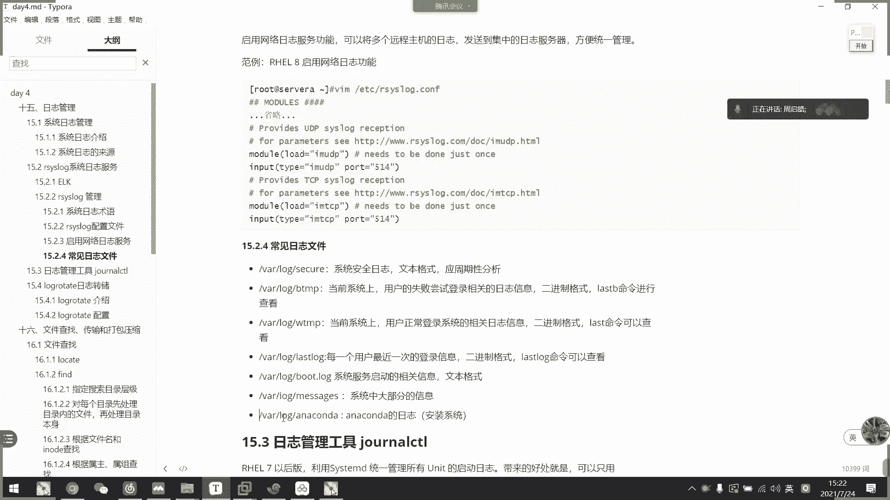

---

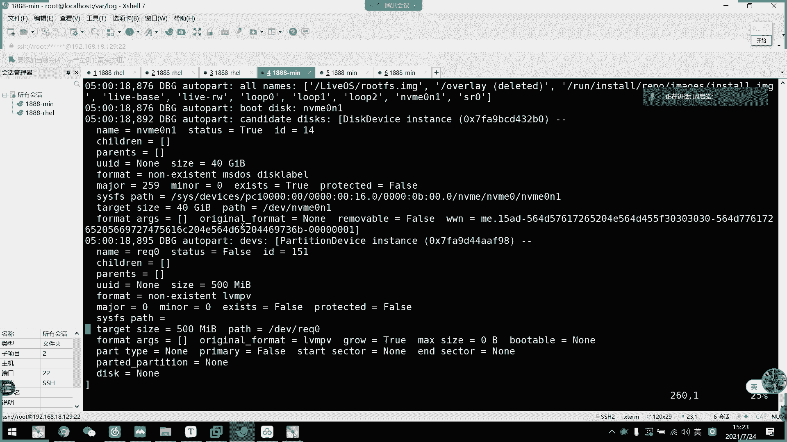


## 总结
本节课中我们一起学习了rsyslog的网络日志收集功能。我们首先解析了日志的标准格式，然后逐步配置了日志服务器和客户端，实现了跨网络的日志集中管理。最后，我们介绍了系统中几个至关重要的日志文件，包括 `secure`、`btmp`、`wtmp` 等，并说明了它们在系统监控和安全审计中的作用。掌握这些技能，对于维护一个可观测、安全的生产环境至关重要。