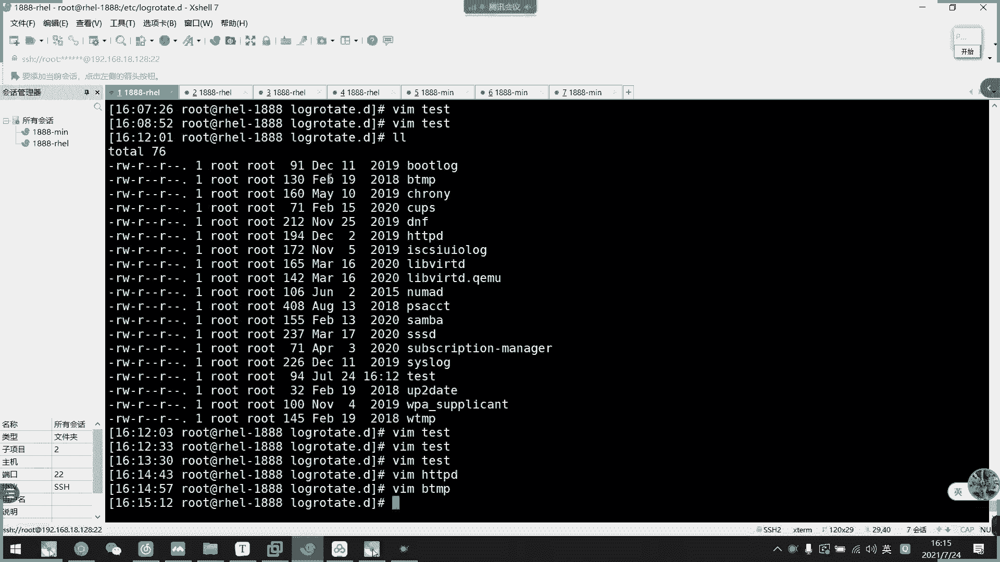

# 2021年7月新版-----RHCE8.2 RH124 RH134 RH294 认证课程 - P27：day5-7 日志转储 - bili_15701050454 - BV1Gy4y1T7ug

这个没有啊。MD格式的我是不公开啊不公开。好，那么我们看一下重点。如果我们日志文件啊。我们电脑一直呃，我们服务器一直开着啊。我们服务器一直开着。那么它就会一直有日日生沉，对不对？那么。比如说我现在把。

咋不对。一些新点inform。经典以fo的那些日志不是全都放在mess下面吗？啊，那infer级别以上的所有信息，它都存部在V个群里面。那么如果我这个服务器开了很长时间啊，做了很多操作。做两个操作。

然后呢。他这个Mage。一一段时间过后是不是非常大它的容量啊。非常大的容量。是不是很大？很大了。呃。函数也会很多。啊，可以这么说啊。其实它就是依赖于机会任务啊，它这个就是依赖于机会任务的。容量很大。

然后呢它内容也会很多啊，函数多。啊，是不是首先是占用磁盘占用磁盘。第二个是不好查阅啊，不方便。不方便查阅。对不对？所以呢我们要有一个叫做日志切割。或者是日志传转储的一个功能啊，它是一个什么功能呢？

就比如说我刚刚说的一个message。他时间太长了，对不对？现在太小了，那么我们就可以通过这个日锁组把它。比如说这个是我们今天生成的。然后呢。啊，我比如说我定义了他7天以后重新。呃，重新记录。

那么他就会生成一个新的mess。啊，新的mesage文件啊，这个是7天以后啊呃就7月31号了啊，7月31号会生成一个新的mesage。然后呢，旧的mes呢，它会改一个名字啊。

比如说我31号记录的就叫message。然后名字叫做呃那个时间啊呃31号啊这样子。啊，他会新呃把助文件。呃，移到这里，然后新生成一个新文件，这就是我们的日专储的一个。功能啊。对啊，就像你赖子啊。

但是它规则也不是。就这么写啊，按时间，它还可以按照它的size啊大小。啊，比如说我设置它日志最大就是视兆，那么它日志超过视兆以后，它就会做储了。O。那么它这就转储依赖于什么呢？啊？

依赖于我们这个lowcate啊。Laro there。啊，然后它也是自带安装的，如果没有装的话，我们可以通过这个呃软件包去安装。啊，它的一个相互文件啊，一个是我们的EDCcly迪day啊，dy下载。啊。

然后它的程序文件呢是我们的呃。Useer spin。呃老。啊，这个好难读。是啊这个是用来激活我们当前的就个手动手动切个日志啊，现在手动切个日志。然后这个是它的一个对应配置文件啊。

然后这是它的一个对日志文件。ok。那么我们看一下。

呃，先看一下他的备注文件。EDC下的L。第一。写错了。靠。这里是他一个呃全局的。呃，全局的默认规则啊全局默认规则。呃。这个先不用管了，比如说呃我们等一下讲到它的一个配置，我们就看得懂了啊。

我们现在注意要注意到这个inc，in是。包含我们。这个点滴里面的所有配置啊，点滴里面所有配置。我先看一下他的那个变速性。好，首先呃我们就按照这里先找，首先是wily啊 weeklyly啊，这里有个表。

我们就找一下啊，wily就是说。

他可以呃按照。我们的每一次抓储周期为。一个星期装修一次啊，就是我刚刚说的7天装修一次啊。

好，然后再看一下啊，第二个是呃。数量啊OTATT4啊，我看一下是不是数量。

啊OT a。没有写。走走。Roocket。到这里啊啊靠着，你说呃，这里是。它可以存多少份啊，就是说比如说我这个message。呃，我定义他。四兆存一次啊四兆存一次，那么它每四兆就会割一次啊就会割一次啊。

那么。所要是我这里写一个me0啊。啊，他。失兆啊，最多就失兆，然后呢生成一个新的新的，然后失兆以后，它也有又割一次。还是这。好，然后是message。继续啊。嗯啊有是4兆。

然后又重新生成一个啊然 message。3。是这，那么到这里为止。我这里已经有4个副本了，然后呢，它创建一个新的文件，然后呢，我那个rocket设置的是4啊，设是4。

那么它就会认为你最早生成的那一个你已经不需要用了啊，就会把它给删除掉。啊，会把它烧回掉，然后这里继续往下生成。这样子一直往下一直往下，他会把最后一个删了，把最后一个删了，把最后一个删了。

然后往上生成网上生成。好，这是设置它啊备份数啊备份数。这不能叫备份啊。就不能叫备份，因为它啊就是保留数而已啊，这个保留数不是备份数啊，它每一个。呃，每一个部分都不是同一个时间戳的啊，不是同一个时间说啊。

然后createcate的话呢是设置我们是否新建一个新的日志文件啊。

Great。Freed。这个是设置它的一个。全是。系想撩。一样都放在这里了，应该都是create啊，然后是生成左储文件的意思啊。然后呢，它新建的一个权限啊，这里写了graded mode。啊。

这里还有一个low cr不建立性的日文件。

我们这里亏re就是一个新就一个新的这种人。好，这里dsist啊，看一下有没有DATE。

E叉T。呃。也没有没有看到我眼睛不好使，我觉得。好像没有啊。这个没有。嗯。这个好像是真的没有。没有没有没有。😔，没有的话。就是说它的重要程度也不是很重要了。文档都没有记录。

我看一下备注说的是什么use data as the。诶。他的意思是以切割日期啊，切割日期来保存那旧的文件啊。啊依家又齐都啊。

他这个应该有才对。啊，没有也没关系。我们知道就可以。他说把把那个文件名记录在我们的一个呃。啊，以以以以他切个时间命名啊，你也切个时间命名。就好像呃呃啊延生发出来那个图啊，他后面加了一个日期啊，日期啊。

就这个控制的啊。

嗯。好，我们继续往下看一下。这copo啊cros啊是我压缩吧，我没句错的话。

四五要素。

是不要缩，不是不要说，如果写了的话就会把压压缩起来。嗯。这个全局的我先不要管它。然后呢，incre里面呢是把它分离的啊，然后我们就从我们这里incre里面的去创建新的规则啊。第一。不对，写CP过来。

你看这些都是呃特定的指规则，这特特定的指规则。嗯。

这些不好看啊，我们自定义一个规则啊，怎么自定义呢？

它的格式是什么样的？我们先随便看一个cap啊，这个去TPT这个吧，你看。啊，首先他。是说什么了啊，存放在我们的哪个目录，然后是哪些文件？哪些文件他意思现在就是。呃，万。

哇log hTBD下的所有log结尾的文件啊，都遵循遵循这一个规则啊，都遵循这一个规则。🤧K。

嗯。都属于这个规则。然后呢呃他直接把文件名写完之后加一个中括号，然后把规则加进去就可以了。那么我们现在先休息一下啊，等一下上课我们再来制定一个规则看一下。啊，咱们刚刚。呃，讲了一个。

全局的一个日志切割的设置。那么我们现在定义一个自己的一个。这个规则。比如说啊我们这边。

不在这里写一个。Test。的。就是哎。9月谁开始了。好，然后呢这边第一时间啊定一阅它的路径啊。哇 log。晓得啊，叫做test。点logg的日子。然后从中快倒出来。然后。下面写它的规则啊。

首先这边写个brared。

让他创建新的日志文件。好，然后。

这边弄个压缩吧。要说。啊，为4份。

え。

呃。Size。た。

，怎么写啊，看看。这个我们时间的话不定义，因为我。目前就直接把它激活了。呃。啊，创建文件的那个。

改成是0644啊。全そそ。

不是压缩，你个是试，然后啊还可以指定他的所有者所有所有主嘛。

看一下。呃，这里改一下吧。I是 student。呃。嗯。先这样吧。现在。好，那么我们现在。去创建一下。touch一个tex点 log。李金。没。我。是我们的。你要试试啦。多大？应该超市上吧。

包围到企齐包围到企。嗯，不行啊。看一下有没有大的。因为到底是照的应该没有。最大就有2。呃2。6兆，那我改一下吧。我会再改一下。Size。本来是。400K。是0。400K。然后这里。改一下。ok。八。

那么我们现在呃敲一下。什么来着？L。可以啊，然后是ET7下的。点D下的test。手动激活一下，要我们看一下有没有新增一个日志文件。啊，你他。切了啊，它超过了啊，就把它切，然后压缩啊。

用我们的距一先压缩啊。

我这里定义了这个comp。那么他就压缩了啊，我们可以看一下。这是他的信息。嗯，这切割了，然后我们再来一次。然后他又有内容了啊又有内容了，要我们再切割一次。🤧Okay。又一份了，对不对？继续。好，稍不到。

师傅呢。我看一下会不会造成第五分啊。目前还吃分，然后呢。啊，看时间戳啊。这是。十分。总理啊看一下。他依然是4分，对不对？然后呢，08那个已经不见了啊，08那个已经不见了。AP替代理。ok啊。

这是我们的左手规则。呃，我再修改一下。我要看一下他的那个什么来着。呃，说入再说入组，你看全都是stuuddentstu的，按照是不是0644啊，0644。

啊，这是我们的规转。嗯，然后是。

嗯。是否借新文件，如不见。不行啊。Daie。啊，然后呢它这个是默认的啊，如果日志不存在的，它不会提示错误，然后继续处理下一个啊，就是他下一个什么意思？

下一个是我下一个规则。因为我这里啊有很多规则，对不对？他每一次都是轮着来轮着来轮着来这样子的啊，去读一下他的规则啊，就是他系统要做这个东西的时候啊，才会轮着来。刚刚我是手动指定的。要去跑这个t这个规则。

那么我们接下来。看一下。呃。不要说啊不要说。如果不要说的话，可以不写可以不写。先注点信息啊，先注信息。它现在已经有大小了，然后我们切割。没有。真的是。这个可以看到啊，它已经有一个已经有一个。

然后他创建了一个新文件，对不对？那么我们这里再改一下呃，加个时间戳，刚刚的时间是什么来着？别上面没有了。呃，VIM。ETC下的。ケ。dataDATE加T。D a。诶，两个一吗？啊算。你前。

然后我们再做一遍。打陆信息。然后切割。然后看一下。你看。这不就有缩接了吗，对不对？那么我们再切一次，看一下它第二次命名是什么，看一下它命名位置。嗯，你看。啊，如果是今天的，他不行了啊，不行了，切不了啊。

切不了。他改不了名啊，不能不能不能提款啊，不能提款。不会跳。我这里依然是有大小，但是它不能替换啊。要然也没压缩了。所以呢这边。只能一天切一次啊，这个只能一天切一次，为加了这个一天只能切一次。

好。呃，看一下还有什么。控文键啊，这个我们默认默认就可以了，默认就可以了。啊，基本上也没有什么了。所以呢我们其实这个。

规则也不用写的太复杂啊，规则不用写的太复杂。啊，比如说我们看一下其他的啊。啊AABD的啊，你看它有这么多啊，还有这么多，他这里又添加了一个邮件的判断而已。他们都很懂。啊，比如说我们的BTMP啊。

呀都哎呀，都很小都很小。做一份啊。说么是OK啊。

okK啊，这就是我们的一个日热切割啊，日热切割这部分有没有什么不懂的？同学么。不难是吧？这么会。

然后呢呃他杯里那个其实就是刚刚说的一个机块物来的，因为。嗯。😊。

呃，是没有啊。So。所以要加一下喽。准边加一下吧。BATE叉G。啊，就是。生成。日志备份。10。异议。文件。系而。呃。文件。原明。加。当天日期。作为。备份文件里。其实这个书本上的书本没给啊，书本没给。

我觉得我是从书本上面截的这个图。

O。

呃。那么这个日志切割啊，刚才想说什么？就是它是相关于我们的。

呃。计块物的。好呀啊，他如果是每天的，他就放在这里了啊，每周的就放在这里啊这样子的。每小时切割了就放在这里啊，我们没有讲到计划任务，这边就不提太多啊。随便看一下。对 okay。

他执行一遍这个啊执行一遍这个。然后呢，他执执行完以后，他呃上面定义了。上面定义了是每要贴每每天要切割，他就按照上面定义了，他就切了，反正他就是按照这个来让他执行啊，让他执行。820跟他走起来。

我们看一下vi克项面有没有啊。佢哋生。啊，那就没有设置。每周切割啊，当然它一样的啊，每天切割，只要他每一天切每一天切。达到了我们每一周需要切的时候，它就激活了嘛，就把那个。呃，克激活了，他就搞定了啊。

他就他就执行起来了，他就执行起来了。啊，所以他放不放没没有没有所谓了，已经放不上，已经没有没有所谓了，他每天切就可以了。啊，每天执行一遍就可以了。

这就是它的一个乐切割的规则。呃。他也可以这样子。第一他执行一个命令啊，你。这个是psK，让他执行一个命令啊。然后这是结束啊结束开始都结束开刚结束。这个笔记上面也没有，但是啊不上面这里也没有啊。

这是因为啊有啊有有有有有有有啊，周以前需要执行什么命令啊啊，有啊。

，看一下。

嗯，范例也有啊，范店有啊，有兴趣的话可以回去玩一下。好，这个是我们的日志专属啊，这是我们的日日专属。

