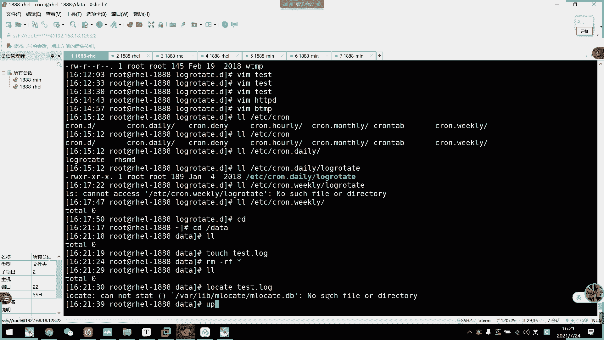
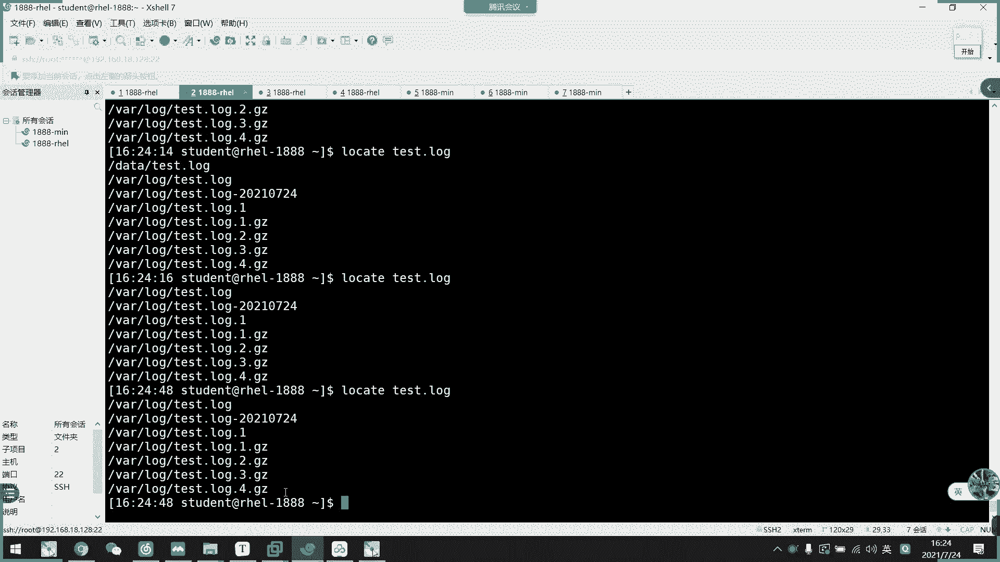
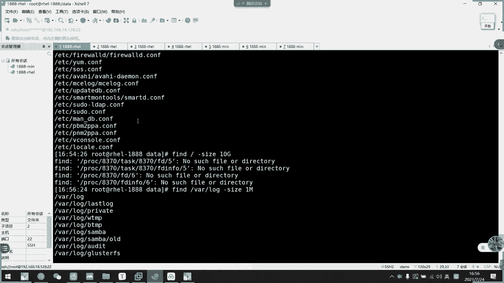
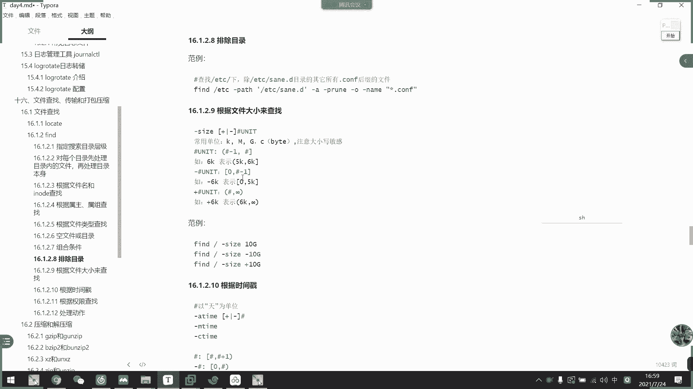

# 2021年7月新版-----RHCE8.2 RH124 RH134 RH294 认证课程 - P28：day5-8 文件查找与find匹配模式1 - bili_15701050454 - BV1Gy4y1T7ug

啊，接下来的内容是我们的一个文件查找传输，还有打包要说。不知道5点前能不能讲完这章。不然的话。明天讲了没所谓啊，首先我们来看一下文件查找啊，文件查找啊，我们有两个工具啊，一个是nocate啊。

一个是fed。呃，我们常用的还是fry啊，强用是fry啊，首先我们看一下它的两个职业区别啊，一个是非实时查找啊，它是通过我们一个文件数据库啊，文件数据库里面的来查找的叫lo。然后fry是实时查找啊。

它是啊每一次查找都是从我们定义的根开始找啊，定义的根开始找。那么我们先看一下OK的啊啊，它是呃在我们呃就是按照我们搜索条件建立索引啊，建立索引，然后去搜索我们的那个文件数据库啊。

就是这个啊MOK的DB啊，这是我们的文件数据库。啊，然后所以构建以后呢啊它在控献时自动进行了啊。啊，我们可以也可以手动进行啊，执行update啊，就可以更新我们的数据库了啊，跟索引。然后呢。

所以构建过程需要便利整个跟文件系统啊，所以它比较需耗资源啊。我们现在文件比较少，所以等一下我们更新会比较快啊比较快。然后它的工作特点呢是呃它的速度快啊，支持模糊加照，但是不支持非呃不支持实时操的啊。

然后呢搜索出来的是我们文件的全部路径，布仅也是文件名啊。然后是。他可能只搜索到用户具备读取和执行的一个目录啊。就说如果呃我这个用户呢对他没有。读还有职接权限呢啊是说不了的，是说不出来的那我们看一下。

啊，首先呃比如说我现在在。回到da塔。我要电脑。然后呢，我现在在dta上面他取一个文件，叫test。不对，先删掉啊。要呃我现在loccate试一下啊。OK的，然后是t。对落。

看一下他刚才呃有没有更新过数据库啊，你看他说没有啊，他说没有。然后呢，我们update。

呃，是什么来着？uppdate bB啊。

时先比较慢。这里文件太少，也不送慢。然后我们楼可以看一下啊，你看。他就可以把我们这个相关的文件名都说出来了。你看。蘑菇擦的啊，它这个说是磨菇擦掌，然后啊啊它显示的是一个全路径啊，全入径啊。

在我们的哇log下的这。那么我现在。再创建一个。Tests。那么我们现在再搜出来。它就不会显示我们电脑下面这是漏，看到没有？没有，对不对？没有。那我再重新更新一下数据库。D。DB啊，这么会吗？看到了啊。

那就更新出来了，所以它是非实时的。我们可能要等它系统自动更新，或者是我们手动更新以后啊，才能找到刚刚生成的文件啊。然后呢呃我现在。登录一个。丢个用酷吧。然了，我这边也用okK的。啊，去找我们的t。哎呀。

我忘了取消。呃。C mode。O减。好告。然后是。去业绩啊。啊，现在只有我们root用户对他有错折件。然后我们现在修等再说一下。怎么还能出来？还没更新啊，它保存的是他之前的原数据啊，我们更新一下。

更新一下啊。然后我们现在在说诶。怎么能说出来？做啊。呃，那么我现在把。这个目录也改一下。Da c H move。然后是G。煲。现在我们。啊，其他人跟组都不能进入到这个目录了，对不对？然后再说他人。啊。

已经没有了啊已经没有他没有这个目录的权限，所以他收不了。

目录啊，当然不是文件，是目录。🤧OK然后呢它有一个常选项就是杠I呀不分不区分大小写搜索啊。然后杠N的话呢是指列举多少个匹配项目啊，然后杠R呢是可以使用基本呃政策表示啊，基本啊作业是基本政策表述。

这个我们先不管，我们还没讲到政策表的时候，我们先不用管它。

我先。看一下。我能说什么文件呢？啊，这样吧。呃，我再插取一个大写的。这吧。然后更新一下数据库啊。然后呢，再locate。杠癌。表示。Test。对。这就忽略那条姐搜索了。哎，我不加干癌了。他就不说出来了。

不说出来。我搜索就说明它适用于。啊，我们的烘配服啊，比如说我这里直接新啊，新封搜索，或者说呃。嗯。没有问分了，那就没有，对不对？因为我们这里啊并没有。并没有一个，他只有后面只有一个字符啊，都是多个字符。

对不对啊，所以他收不到。这里改成L均过号就可以了。啊大家中个星期。Yeah。哎，我靠。诶，怎么这些都能搜出来。

不管。那就搜索条件而已。这是方面。所以loc care这个是镇常啊，我们没学到就先不提了。他。讲解一下他的意思就是什么？转逆啊啊转移把它就当成一个点，然后是co结尾啊，多少次结尾的意思啊。好。

接下来是我们的fry啊f啊，这个工具是我们常用的啊，它查找的速度会比我们的locate啊要慢一点，因为它。对于我们设定的根啊设定的根啊，主要设设定的根啊，是全球搜索的全球搜索。

但是呢它支持精确查找支持精确查找。然后。呃，也可以自实时操找。而且它的一个插条件丰富。然后呢。呃，也是一样的，可能只能搜索到用户具备读，还有执行的一个目录。因为他没有这个权限，我们进不去的话。

就无法查到了啊。那我们看一下f怎么用啊，比如说我现在是。

要精确查找到这个叫做t log的文件。那么我们就fin。干那个文件名称啊。Test。え不の。看嘞，他又说那啊，我我这里没有加没有没有没有加范围啊。秒这范围的话，它就默认是我当前路径就这样data嘛啊。

这是我们指定的根的，这就所谓指定的根啊，那么我们直接整个根。对呀他说到这两个嘛。按照文呃文件名完全搜索出来啊，精确屏配了。啊，并不像我们lookK啊，他说的说这两个还还有这些啊模糊搜索出来的。

啊，刚刚是我们呢按照名字啊制定。然后呢。它还可以设置我们的一个。搜索目录的一个深度啊。

说目录的一个深度啊，比如说啊我这边找一下。呃。在找面。Mess。对比如是一。8。不在后面。我坐在哪里啊？啊，一级是没有有二的。啊，这个是最大搜索成绩啊，因为它把呃我现在是根啊，现在是指定的是根。

所以呢data对于它来说才是它的第一级啊。然后呢，这个testlog相对于我们的根啊，是两级，对不对啊？一级。引节。申请。啊，所以呢我现在收不到那个呃one log下的testlog。

因为它相对于是第三级嘛，对不对？第三节，比如说我这里改一下。这样能收到了能收到。呃，然后呢，它还有一个设定最小。比如说我这里改成是3，那么我们现在输出的数据啊，那么就只有one log下有了。最小。

最小最大。那么他就意思就是说我搜索的最小层级是三，最大成绩是4。

好。你是发你了。这。回去看一下吧，这个饭店。啊，就是我刚刚的一个目录春题的一个呃。呃，前期条件的一个设定啊，前条的一个设定。给你们看一下吧。什么原理？

啊，首先我在data下创建了呃三级目录啊，三级目录啊，test test一 test2。

然后呢，我创建了文件啊，在ts上面创建了两个文件。

啊，叫F1F2。

点DST。好，然后这里。啊，是在T一下面啊，在T2下面啊，创建两个文件叫F3F4。

AST。

好，然后我们去一下去一下。对不对？我在贴子下面创建F1F2啊，然后在贴使2下面创建F3F4，然后呢。

诶。我们直接搜它有什么文件啊，然后最大两级最小一级啊最小一最大两级最小一级。

我睇下。呃，他这样子会把目录也。翻出来。干。Max。对不起，最大两斤啊。最小。他能找什吗，隐藏那些我们先不管他了，隐藏那些。呃，那就是。嗯，太多东西啊生意噶。呃。啊。

他现在还有1个ABC的sap把它删掉。之前的一个锁。只那个锁。饭啊哎，怎么还有了？没有吧没有了啊，O。那么它就最深两级啊，最浅一级。那么就说到ts嘛，对不对？啊，说到ts一啊，说到ts一。

我这里没有加条件的话，它是把目录都搜出来的啊，把目录都输出来。那么我们。啊，就写一级是不是我们test啊啊，这是我们test。然后说到我们test下面有什么东西嘛，对不对？说的我太下什么东西。

那K1一吧。It was a a before。然后这边改一下。呃，但是。应该要4级才行，三级的话会把T2也露出来。但是T2下面的文件就没有了。

那么我就学不出来。然后是对每个目录啊优先处理目录类的文件啊。

啊，就加刚低了，就就把他那个顺序给倒置而已。诶。教してください。就把它到这样啊，优先处理吧。显显示太。呃，先示它的一个目录啊，然后目录下的文件。啊，然后再到目录，然后目录是啊还是目录啊。

然后是目录下文件，对不对？哦，不对。他现在没有处理到。警告啊。加一下这个。但他的确是倒置了，的确是倒置了。

一就到这，结果还是一样的，结果还是一样。

O。呃，然后刚刚说了啊，可以按照我们的一个文件名来搜索啊，文件名来搜索。啊，支持用通佩服啊，支持用通配通佩服啊，各路通佩服。

然后呢投配服务需要用我们的双引号赢钱。比如说。Fried。加五零系咪。一体之下的。杠。五零。表示。🤧咳。这个是这的表示。都是表师诶。嗯。说了。啊，这课不是同辈。啊，这个不是。

啊，还没有说不出来。这证明了是代表示要用这个才行啊，用这个才行。

通配服的话，我这边要错文件才行。啊，也可以。但是大小写这个方面。不用先不管大小姐。好最嘅。当写目录吧。对，然后是。做什么 f c 嘅。好的。那就把这个。都说出来了，然后已经没有目录了，因为我们目录不是。

不符合这个条件，对不对？啊，只有我们这个TSTST结尾了才符合F开头中间一个字符，然后点TST结尾了。财富合这个。匹配条件啊。呃，然后是忽略大小写。嗯。即是意些没有东西对不对，我他全州。发谢。好。

还是这个条件啊。先去一下。呃，对。先去一改啊，你看我们当前啊一级一级的。那么我们目前在这里搜索啊，不加其他条件的话，它它会呃全盘搜索嘛。从data开始一直搜到F4。那么呃我们当前这个条件是。啊。

是FC星啊小是F星。俾啲啲。大写了就没有匹配到，对不对？那么我再看。加一个I。他就哭了大笑起了。大写都说出来了啊。

白领富仇大道险。好，然后是ide啊，是按照我们的ilo号查找啊，这个很少用啊啊，也不是说很少。如果里面有记录它的ilo号是一回事啊。

嗯。啊，比如说我现在F1的是这个3355。521。335521，那么我们来瞧一找fed。从根开始吧。要是I number。早上。他就收到了。啊，但是他这样子可以如果有有有硬面键的话，他也能搜出来。

然后是啊。相同啊不稳定。啊，因为他这个是分区唯一的，所以他其他分区有跟他有可能跟它相同的啊，也不一定啊。好，然后是这里指定软链接数啊，这边我没有。那个。

文件。也不是没有。比如说我们ETC下的。し。不对。如色。赖。System。这と。然后是。叫什么来着？Me。

啊，这些都是有软链接的。不接。比如说我们开摄能不能不服。Crape。Power。这个这个powerful。原来是唯一，它是不是有一个。

呃，文你对不对？啊，这是这张表示。这个没讲就先不讲，知道这个就可以了。好，这是我们的fry啊。然后他刚刚这个是根据我们的文件名跟Ilo查找的啊，接下来它是可以根据我们的数主。

属主插道啊属主还有属主插道啊。Yeah。😊，啊，就是刚入涩又是那。

啊，也可以VID也可以啊，VID应该也可以试一下。啊，比如说。呃，我们要fin。呃，哇下的。呃。表示user丢er。这不都是student吗？刚刚我们 testlog了。

是不是把它设置个student啊的权限啊。试一下用ID。也可以，对不对？然后是G group。应该能缩起啊，不能。

啊，这就是啊根据鼠主还有鼠主去搜索。呃，UID也可以啊，直接输UID。还有一个是没有属主的文件啊，或者是没有蜀主的。怎么什么叫没有属主属主的？

啊，比如说我现在创建一个文件啊。不是。KADC。啊，有个U手亿啊有个U手亿。入手一。OK他数组跟他都是一样，我他举一个文件啊。

不用再选。

那说明要测去。然后咧， c h哦。どさい。よ疑。就可以。好，那么我现在把它入手机删掉啊。呃，等一下再删，我们先确认一下。叫什么？L user。对没有啊没有输出。那我现在把61给上掉。就是给。干啥？

你有什异议。啊，都不认识。别那么多胖。主播也删了。嗯。哦，不是刚刚。ok。那么。我们L你看它现在只有呃ID号了啊，ID号，那我再搜一遍。看了没有？这就叫做没有输度，也没有输度的。唔这。

都是只有这个啊。O。好，接下来是按照文件类型来找。啊，就是我们的呃其他文件类型啊，其他文件类型。

啊，比如说fry。干。Tpe。饭的太晚了，然后是直接。

普通文件是什么来着啊CF啊。

这么说出来吗？对不对？那就只搜目录啊。要是。其的P放大啊，没有他一只也没有。那就没有诶。ButPLC maybe word design size应该有啊word。有啊，然后广告也有。

啊，其他我就不演示了，它就是以这个文件类型搜索而已，文件类型搜索。1乐是空文接过程目录啊。用 inquiry in。加个inport就可以了。呃，然后这里就有点复杂了，是所谓的组合条件啊。啊用隔气。

又该。

呃，比如说我现在。在这里有1个F1的普通文件，对不对？然后呃我现在在test下面。创建1个F1的目录。等会我们搜。我们搜。Fed。金灵嘅飞。他我的是文件，还有目录，他都搜出来，对不对？

呃，不对我这个只。🤧嗯。他普通。

呃。对，这样。杠A然后是指定它的太。为 every为啲。都出来了吗？就组合条件同时为帧啊同时为帧。那么首先第一个条件是我F1的，然后呢，它是一个目录啊，它是一个目录，这不就做出来了，对不对？

但是我们不能。这样子。不能这样子。这样是肯定不行的啊。没有可能是同时两个都会增的。就说它既然是普通文件了，怎么可能是目录，对不对？所以这这个不存在。就杠O就可以啊。比如说我这里要搜的是F1。啊不对。

就少唔少。走路的也不行。可能这里要加个。啊，这样就可以啊，但是没什么意义啊。他他这个名字。名字是文件的，或者名字是F一，然后是B的啊，没什么意义啊，说出来也是这两个东西啊。

好。啊，这就是我们的多个条件。然后是扩刚O啊，刚刚已经用了扩展扩者。是飞啊飞。

啊，比如说。Fried杠令。F一。然后。是不是一个他的人？他也黑了。看。杠。泰国。回避。他不是就不是输出我们这个文本嘛，t safe。如果就是说他名字是F1的，但是。

类型不能是目录啊。啊，这是它的一个逻辑关系啊，但是最难的还是我们的一个德墨跟定律。德波根定理啊，所以是非A或者非B啊，就等于我们的非A且B啊非A且B啊，这个这己转看一下啊。

比如说我刚刚的那一个。

嗯。呃，这个很难讲给你们听。

这样吧。不行。因为他这里太多东西了。因为这里只要加个C。Fei。高。现在是什么情况，是不是变成。算。然后非。A。零。但太。喂。不对呀。他为什么这里可以列出个文本呢？我看一下这个条件。哦，这是扩啊扩啊。

所以它这个可以列出来，它并不是。啊，类型低。里面如果是钢A就不一样了。啊，收不到这是。因为它不能括起来这样做。

他不能扩起来，他只能逻辑上的扩起来哦。

啊也可以。要转移啊。原来是这个输错了。睇谢金宁。有问题吗？加空格。啊，可以。我们搜索出来的结果是不一样啊是一样的。谁样了。啊，所以。他们两个之爱相等啊。非A或非B等于非A且B这个逻辑好好回去想一下啊。

这都有例题啊，然后是非A且非B啊，就等于非的A括B啊。

呃，非A且非B。呃。也用这个吧。原则啊，这里改成A。对，不是这个。是哪个来的？这个。看他能说出什么。对啊主要是F1啊，不管它是什么啊，这个什么意思呢？不是F1，名字不是F1，而且。不是。目录类型。

都不列出来，所以他现在列出来所有都是文本，对不对？啊，说的是我哥。那我们看一下是不是跟我们刚才的是一样。哦。

搞定。啊，这个逻辑回去好好想一下。罗辑思维很重要。罗辑思维。攞住数嘅人咗一。虽然他可能不太想用多多条街去搜索，可能不想用多条线搜索，但是这个逻辑很重要啊。O。那么呃排除目录啊排除目录。就说。啊。

用我们的杠配，然后是杠P。这个盘布。具体怎么做，我们看一下。分析一下。它是排除我们这个目录下啊，所有点co服的后券啊，首先是我们这里。要说出来的。啊，是我们。啊，如果不加这个条件啊不加这个条件。

我们要搜出来的啊，是我们的一个页下所有叫co的文件。然后这里。加了一个干杯。啊，告位去。呃，是ED1下15杠A。排除啊，如果不排除的话，那先搜索的只是这个啊，就是这个是我看一下。

我们先看一下一步步分析啊，拆分。

逻辑7。把那个先删掉。对，还没动机。嗯。

是不。少了东西，他新新点co的话，它是。

重代表的是啊。这也删掉。申请。这也可以收到呃E下所有点com结尾的文件。然后。

加个什么条件呢？

PRUNE。现在这个什么意思？这是删除嘛，对不对？

就删除，不要它输出。啊，所以他这个一定要组合才来用啊，组合才来用啊。A是并且啊它本来是指定了这个目录，然后并且删除并且删除。

所以他们要组合来用啊，所以难怪我刚才只有一个就不行了。

呃，比如说我这里杠PAATH。复制吧。

啊，这就可以了。这对。嗯。把它输入出来把它输出来。要我要删的话，那就干A嘛。PU。叫什么来？PRUAE。能明白吗？这个。呀他现在就没有了。他是没有这个。等明完这个。啊，同学们。他本来是这个条件。

或者这个条件。啊，所以其实。不加这个的话呢，它输出也直接把所有ED一下所有的这个都输入出来。然后呢，我加了这个条件。就这个特点。就是说啊是这个目录下的点com。的文件。都删除掉。到手嘅。

就这个意思。那我继续往下啊。啊，然后他还可以根据大小来查找啊。啊，这个我就不一一掩示了啊不一演示了。呃，首先是干s啊，它可以加或者减啊，然后单位啊是我们的。文记大小单位啊，注意我们的一个大小小平单啊。

注意大小平。呃，然后是un啊un，然后后面加呃。6K。啊，就表示我们的5K到6K。啊，这里一个减一啊，所以这里是6K，然后是6K减1的意思，明白吗？所以是啊5K到6K啊，可到6K。有出嚼。

N啊减t就比如说我这边写了个负6K-6K。点击，然后就是0到5黑啊。

哎，算了，还是写一下吧。

这个还是要演示一下才行。啊，比如说我这里。

Fight size。第四G。也不要了。大于比照。Yeah。哇，落不下。看啊这些都是大于一兆的，这些都是大于一兆的。

好的。

啊，是等于一兆，应该是等于一兆，我看一下。起住了吗？呃。嗯。没错，应该。Yes， E see。还是不行。啊，可。啊，全都是。拒绝全是拒绝，为什么呢？啊。我不是wordot吧，word用酷都拒绝吧。

这看不到它的大小。有有先少。那也不行。诶，为什么不行呢？美理由啊。我这里看一下。So data。稍等。所有的。T also of provision deadline。为什么？Oh。但是没关系啊。

没关系。奇怪，为什么呢？为什么会pro denied？啊说了，看不到大小。

呃。反正这个是大小的意思啊，然后。🤧嗯。这个为什么呢？哦，他是减6K啊减6K呃，所以它这个范围不是这样写，减6K。

不知道。算。那就直接加 size。能跳对吧？减6。

嗯。

哦。不在。🤧4减6K。

什么玩意儿。

Untilq。

UNIT。

这没有。原IP。

我的。啊，刚刚哦刚刚这个发错了吗？哦，是应该放在这命令后面啊，但是我现在不是那个了。8助都没有吗？嗯，这里。呃。啊，我知道了啊，这个就小于6K啊。所以六。

然后加的话是大于6K啊啊是大于6K。刚刚我弄错了啊，是这里啊，加减un。啊，6是代表我们的一个数值啊加减。如果是不加的话，那，它就等于啊它就等于。系的。啊有冇多等于啊。他要减一而已啊。

他要减1就是说呃这个目包就是说我输6K的话啊，刚刚我输了一呃一兆嘛，这呃呃EM啊EM。EN的话呢，它就最大等于EN啊，最小是。呃，不到0安就0。000001M。就这个意思。对呀，这里是布包啊。

一定要注意这里是布包啊，布包。啊，然后这些包啊加减。哎后这里是不包，反正要大于他，反要大于他。大于它也要到五重大这一块一个数轴就懂了，这块一个数轴就懂。然后我们先讲到这里吧。不脱沓的。

因为这个是后面这里。还有挺挺十十来分钟的东西要讲。我就不拖塔了。好们。你们再继续讲。

