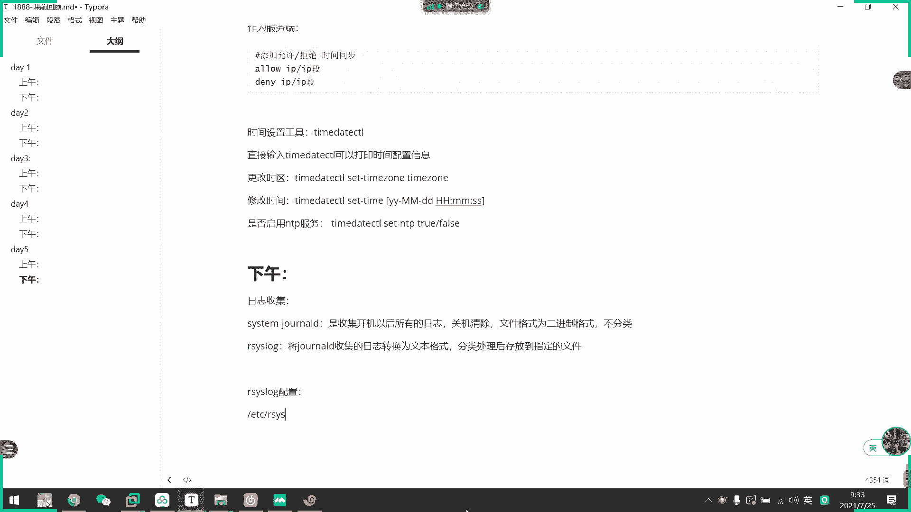
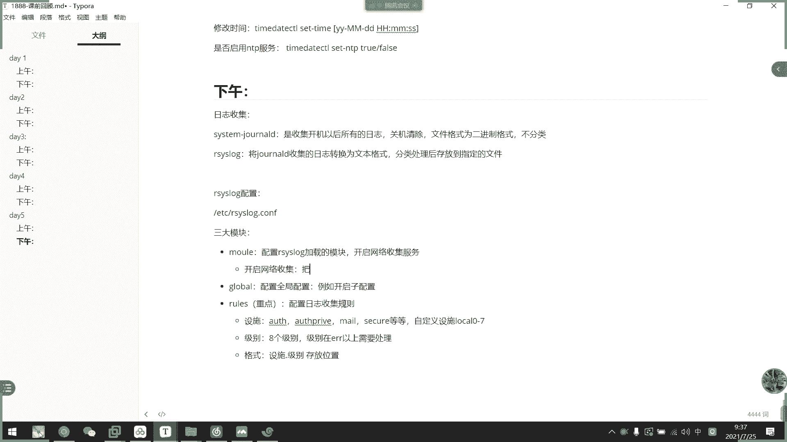
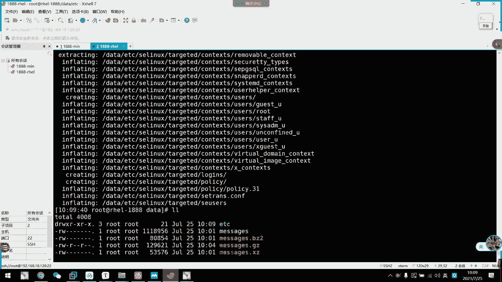
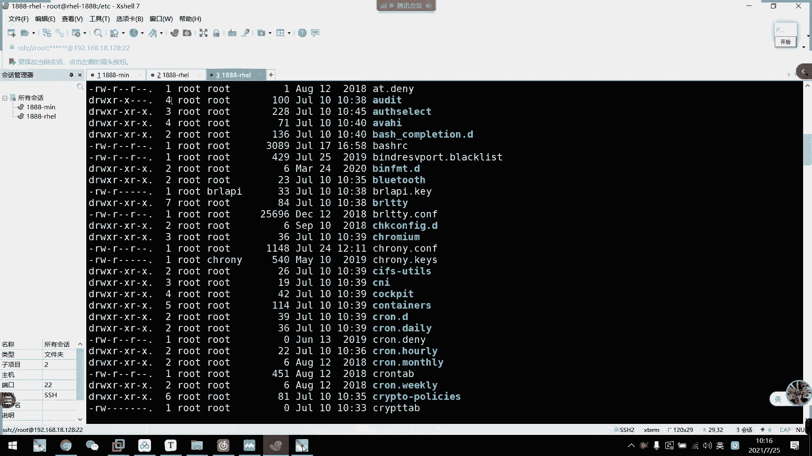
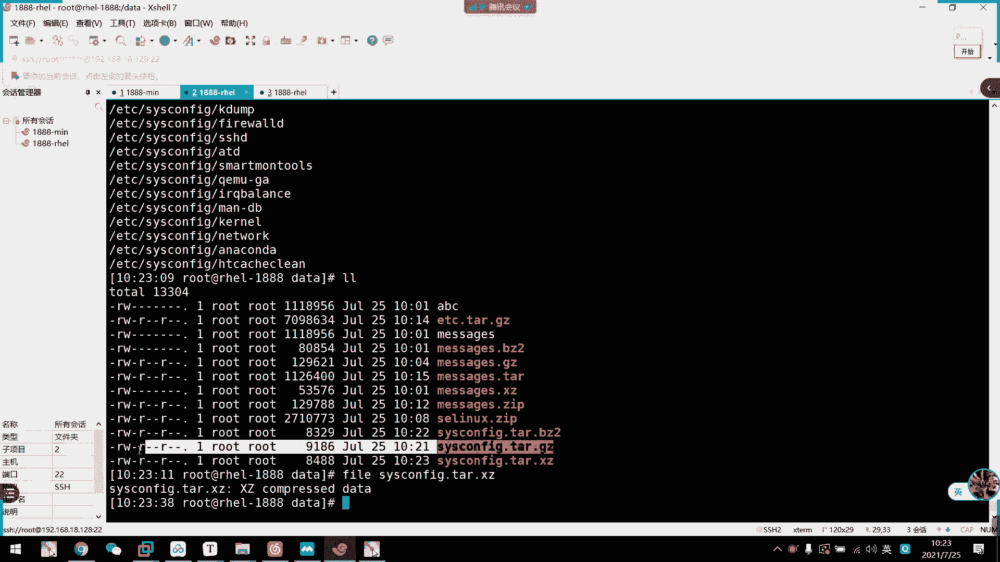

# 2021年7月新版-----RHCE8.2 RH124 RH134 RH294 认证课程 - P29：day6-1 find搜索处理以及压缩和打包 - bili_15701050454 - BV1Gy4y1T7ug

我们昨天下午啊讲的内容。看一下我的内容啊，首先是呃关于。日志收集。和。我的日志这一块呢啊。我们系统有两个服务，一个是stem。转落地。一个是我们的。啊46。四统装容啲呢。🤧是。收集。开机。以后。所有。

就这样。关机清楚。发表诶。🤧然后。文件。格式为。二进制。格式。而且。不分类啊。啊，S是log是。将。标等。第一个。收集的日志。🤧嗯。转换为。文本格式。分类处理。对。存放。到指定。的文件啊。好。这等于啫。

我眼睛有点模糊。啊，然后我们呢Senn。他的。配送文件。啊，是我们EPC下的is。

点扣。是不是？我又忘记他的配准文件了。呃。小的84。

口。嗯。好，有三个模块啊。第一。这个模块。第一个是model。第二个是我们的。Global。第三个是我们的。规则啊。然后这个模块。呃。配置。Asis look。加载的模块。啊，主要是开启。🤧。我络搜集。

gbalpro是干嘛的？不要忘了。

Glbo。

配置全局。で。呃。例如。又是。开启死配置。我是重点了。配置日志。收集规则。然后呢，他这个呃收取规则呢。啊又分为。设施。还有级别啊。说是跟级别。这是我们一般关注的是AOHLO。截取pri。Yeah哎。我。

没有。St you。等等。L级别有8个级别啊。啊，自己回以去看一下呃，然后。级别在A。对。20。以上。需要处理。好呃，格式啊。格式。就是设施。设施。对。级别。然后是。存放位置。这里还有个要加一个啊。

还有。自定义。设施。0到7。就是服务配置。说了这上面写。开启。网络收集。嗯。把。呃，UD。那个叫什么来着？

Importter。UDP吧。Importer TCP和 importer UDP。这两行开起来。

复制一下吧。UP。不起立。然后这里。8。日志。通过网络。黄书。到指定的。我微信。嗯。UTP。就是我们的。设施。对。这要申级。然后是9个位置。对不对。然要是。比较说。服务端。是要把。对，手这级别。哦。

客户端对应。设施。都。保存到。文章中。表示TCP啊。DP也是一样。服务端的配置没什么要改啊。如果是提呃客户端的话，这里两个艾就可以了。我们的。日志数据。然后是我们的。シスト？做到地啊。日志保存路径。

是在我们的。内存啊乱下的。lock下的做log。下载啊临时文件。啊，不是跟中间，他是那个呃。随机编码出来的文件夹。然后啊。查看工具。中等啊CD1。啊，然后他的一个。嗯。采有选项。揿 b啊。列出错误的。

对这。这。Y歪。Mm。对对。解决局。有要。Yes yes see。穷。哪不动。开始。然后。Until。知道。直接结束了。一般都是用这两个了。啊，sin还有其他用法啊。

什么呃yesterday啊win year那些。自己看一下笔记笔记里面有内容吗，我看一下干B是不是错误选项。同闭。不对啊，肯定不是。呃，杠P。看皮子的啊。错误级别啊。这样吧。ok。呃。然后是日志。

热切割装出。一个好储。就说。呃。配置文件啊。备注文件。在系。ETC下的。我。Yeah。

还是CFG啊，看一下。都。记不住特的。8是多少？

后法没错啊。配置文件。然后呢呃该。配置文件。指定了。是被。纸飞制。文件的。怎么办？没录。是我们的。诶。VTC下的。🤧嗯。楼。点滴。然后。是。配置文件。呃。编写规则。啊，就生成一个文件名啊，就日志的。

名名字就可以了。啊，比如说我这边要写一个。一个。Test。The log。规则。那么文件名我们就用case。我件面 test 系好利用。是。这边。弄口开一点。然后内容啊就是它的存放录地。哇了。然后是t。

test点log这个是。文件名册啊。明族。然后这里是贴着规则了啊。比如是。啊，这里我扩不扩宽说笔记有啊。啊，这里写规则进去就可以了。好。啊，然后。手动。算了，在前面加吧，在后面加吧。有一个工具啊叫做。

测试日志工具啊。是我们的。有loger啊。然后是杠P。这这对我们的。🤧嗯。事实。Those。级别。表是。要跟。都起咗。我记得这里好像要加个什么选项来着么。看一下。测试日志工具。啊，不用。

直接写内容就可以。要专储。激活。规则。啊，然后是我们的。对着文件路径啊。嗯。接下来是查找文件啊。啊这我们要。Look kid。O，有没有名做啊 LOCAT有有名还有 fried。模糊查找。模糊查找。

Oh。速度快。飞。实时操作。更新。文件数据库。U。Date， update。李斌。有法。精确插找。嗯。查账。条件丰富啊。呃，速度。🤧没有慢。Look。实时查找。差不多。其他条件不写。

那他的条件这些我就不扩开来说啊，条件的话就回去看一下什么干令啊那些啊，还有条件判断啊。呃，条件组合，而且大家可以去看一下啊。好，那么啊我们。呃。昨天讲的选项都讲到。呃，大小，然后时间这里就不多说了啊。

也跟我们的大小是一样的啊，注意那个呃。加减嘛就是加减。什么叫做不包边啊？什么叫包边？什么叫不包边？啊，这是以前初中数学学的啊。范围。系有。指定的时间可以是A胎，还是M胎还是C胎啊。好。然后呢，即里可以。

根据权限的下长，这里得说一下啊，这得说一下。呃。主要是哪一个？啊。如果不加这个的话呢，它是精确匹配了。然后。啊，这里加个斜杠的话呢，它有有一位匹配就可以了。啊，剪的话的话是必须拥有啊，我们来看一下吧。

这里有什么文件？呃。PBRL。64。或者是。给0。没有吧，600。

喂。这个进去。这个就可以。

但我记得可以指定是哪一个的。看一下。75。这是精确一配啊，就是说刚刚我说的64啊，它是64的才会列出来嘛。还后422。就随便有人有个写决键都会匹配啊。

呃。这里。哦哦。哎，所有人都有写权限吗？这些有目录。34。特下。我饿呃饿。哦，他哦用了这个啊用了这个用了这个的话呢，随意有一个斜条线，它都会列出来。所以啊这些都都有列出来。因为它。啊。

root啊都有写权限，它它是O呃，UGO随意一个有写权限，它都会列出来。那就把它改成是减啊。呀那就没有了，他意思是呢。啊，UGO必须都有解缺限的。我改成。是实是。啊，那就全都有了，对不对啊，你看444。

这个是解号代表必须啊啊，然后4分号代表谁有拥有。哎哟，这个是金雀啊。今天的文文件的权限啊。呃，比如。这边。用个减。2厘米的。你零代表不关注啊，他。呃，就是说他不关注我，不管你是什么权限。

然后我现在只针对我那个二楼啊精确到二楼是否有显权限。然后二楼啊不呃呃呃呃是U啊，U是否有权权限。如果U有斜约线的话呢啊它就匹配啊。

啊，希望大家明白这个意思。🤧咳。然后一些处理动作啊呃拼音的话就个是默认的，不用管了。然后L就是老师刚刚用的那种啊，刚刚用的那种。然 else啊。FL呢它就可以重新下到文件啊，把它重新下到文件。

好像是 delete啊，就把查找到的文件给删除。然后这个OK加命令。呃，然后再加个。中国好。哦，不这是考不好？然后他这个。啊，就是说他要执行这个命令，都会交互试问你是否要处理啊。然后EXEC呢。

他就不会问你啊。就是要执行你那个com啊，你看这里要接一个com。hel那我刚才直接。

也要时也不用用这个语法。看一下是不行。

那还真的可以。我用这个语法干嘛？少用少用。好，那么他这个怎么用呢？就我们这些的话，直接直接加这个选项就可以了啊。🎼可以把我们所有出结果啊给给给弄出来啊，这些都是啊把出结果给弄出来，主要还是这个口板啊。

主要还是这个口板，它这个语法啊是固定的啊，我给你说一下什么意思？这个语。结构。说先写一个出来。

比如说呃。快金零。这回一。嗯。干user，然后是student。不是好。回去啊，有这么多文件啊。然后我们用杠EXEC。E1啊，他就说把前面的。所说的内容啊。作为变准输输入啊，作为后后面的变准输入。

然后呢，我们ECEC后面加一个命令嘛，比如是我用copy啊，copy。然后呢，这个加个夸括号，这个括号是什么意思啊？夸括号代表它里面内容啊，就是我前面输出的内容啊，前面输入的内容查找到内容。

他夸括号的大表就是呃框呃，就是我们前面找到内容啊。然后是。左地。啊，封上大表结束啊大表结束。啊，这个是用于佐翼啊。咁佢就诶。忘记copy到哪里了。我不知道这个。对他。就对。他要一个干2小是，因为。

O那我们看一下。呃是不是复制过来了？啊，就是他的那个。依法就是。OK那个一般不用啊，我们直接就就加个ESE把它当成管道啊，把它当成一个管道，把前面的标标准输输出作为我下一个命令标准输入啊，就这个。啊。

就他要注意的话就是。要加一个啊。粉时刚和呃逢告结束而已。嗯，你可以这样想，但是你不能这样加啊，这是f的一个特定用法啊。也可以这样想，但是你不能这样加。我再解释下把类似于给你们讲一下，好理解一点点而已啊。

你可以这样想。啊，这是。呃，你可以试一下，但是不行啊。因为他这你你用管道的话呢，它处理的是什么啊，你知道吗？处理的什么？所以说是他打印出来的文本。明白吗？比较管大的话，它处理出来的是它打印出来文。

ESEC处理的。是他文件本身啊。都说了这个框括号里面就代表他文件本身，他搜出什么就是什么。啊他现在处理的是文件啊处理的是文件。

明白吗？好。那么。呃，我们查找就到这里啊。这里有一些方面啊。这个要练一下。主要是这个东西。主要是这个东西。呃，也不狼。啊。那我接下来。看一下。压缩和解压缩啊这个呃比较小的东西啊啊，首先我们看一下压缩。

我们压缩有三种啊，在啊然后加起来4种吧啊四种啊，我在我们在我们那个啊采用的有4种啊，一个是GZ吧，一个是BC two啊，一个是叉Z，还有最后一个是windows跟in个通用的那个也是IP啊，也是IP。

然后呢。呃，我们先看一下啊G赛。啊，注证。他们三个的选项都一样的，我等一下就不一一讲到选项了啊。我先看一下呃，他们的一个同学什么呢？一个是杠K啊，杠Ksk啊保留原文键啊，是我们re8才有的啊。

由器以前是没有了，好像是杠低啊，是解压缩。然后杠C就个结果输入是标准输出啊，然后保留原文件不变。还有一个杠底的指定压缩比啊，指定压缩比压缩比越大的话呢，它压呃压缩的。把它压起来。

然后后呃然后然后那个压缩文件就越小了。

，我们可以看一下。多大？啊，一点一兆啊，现在我们的m有一。一兆。然后呢呃我们把它压缩一下怎么做。就也是IP啊。没事去。它就压缩起来了啊，然后原文件也不见了啊，他直接把原文件给压缩到里面去了。啊，这些。

叫做。所以所以有一个刚铁选项是为什么啊？是因为它不会把留个文件啊，要杠低啊，是接锁啊，也可以用G呃GUIIP啊，但是直接杠低会比较好，我们记一个命令就可以了啊，就不用嗯。

啊，对啊，解啊，都解出来了，解出来了。是我错觉吧。

不是。好，然后是杠C。

先把它压起来啊，我们看一下杠K。近期。那就把这个文件了啊，直接把这个文件来。差不多是1。9啊。然好僵尸。嗯。更时到。是我的问题吧。啊即暂时就用嚟。

问一下。结果输入至标准输出，把留言文件不变哦。哎，尴尬了这个东西。怎么用来着。是大西吗？杠西没错啊。看一下。哦。

先把那个压缩的删了，它只是。相当于观察了这个文件以后，把它添加到压缩文件。没有。啊，然后是GECIP杠C message。然后。从定向到文件中。

太麻烦了，还不如我直接那个。对不对？😊，啊，然后是指定压缩笔，这个先不弄它啊先不弄它。啊这里有刚刚杠C那些什么K啊，然后一些IP把，把那个内容压缩到文件上里也可以啊。好，然后是BG two啊。

BG two我们刚看保留有文件，对吧？啊，然后我们现在用B two啊，然后这里。

啊，其他学生我也不讲了，我现在就直接要说，然后保留它的一个文件啊。BJ two。太少用这个了。一般都是用t打包。呃，杠K。Rroom。

那就压出来了。啊，然后当然第三个是我们的差异线啊差异线。

差一下啊还是一干K然后是咩雪。然后我们先在观察他们的一个大小。

没有。啊，都没有一些特别的地方啊。

OK然后我们现在观察一下它的大小。嗯。压完以后呃，我本来是一。1兆啊，这个差不多压了个4倍吧。然后。别墅。比他还要小一半左右啊，然后这里是它的。啊，他们三个之间的比啊大大概就是。它是叉J的3倍啊。

这是他的是是是BJ的。2。5倍吧。差不多吧，看一下。呃。127。无异议。许多少点。预备。他这里是取余数了，应该是1。5倍啊。他这里是矩整的。为什么会举证那么奇怪的？你处理。取整啊啊，应该大概是1。

5倍啊，这个是1。5倍。然后这个估计是33呃2。2。5或者3左右了，3肯定不到3啊。我们知道他要缩屏就可以了。但是啊。

啊，大家注意的是什么呢？它压缩的压缩比高不一定是好啊啊。首先如果他带文件的话，它压缩的时间比较久啊。然后呢，第二个可能它解压的时候也会啊压缩解压的时候也可以也可能会破坏掉我们的一个文件啊。

所以压缩比越大，不一定代表是最好的。啊，性能性能上呢还有然后上呢，我们还是选择这啊GC啊就C啊，这是这就是我们三个压缩工具啊。然后一下IP呢啊我们要分开讲，CIP分开讲，因为它可以实现打包啊。

它可以实现打包啊，但是它。可能会导致我们的一个文件的属性丢失啊丢失啊丢失啊。就是说比如说我们的所有者，还有主信息。啊，一般我们都是用t代替的，用它代替。因为踏的话呢，它比较轻亮，而且。呃。

它的选项可以配合起我们的一个压缩工具啊，是挺好的。那我先看一下网ex子IP虽然不多用啊，但是有一些呃网站的一些源代码，他他们还是喜欢用ex子IP来打包的。我们看一下。啊，这里啊打包并压缩啊。

这是一些IP盖啊，这是可以打文件夹的。我们刚才上面的三个工具啊，它都不可以对文件夹进行啊对目录进行打包的。

我这里可以看一下。呃，比如说我要打ETC。对呀，他说不可以打的。他直接说啊，这个是一个目录啊。

脚是跳过了。好，然后我们ECIP是可以啊打步录的啊，我试一下。

干R啊，然后是。呃，这里注意啊，接的是我们打包后的文件啊，比如说ETC点。那个是对。第是I批的。啊，然后是EDC的C。

这这个是。就这个目录。

所以打下来。对吧。我再打下来。

呃。然后呃刚刚我这里。他只打包里面的子目录，还有文件的话，那我们就到里面去啊。说。进到里面去，然后打包它里面的东西啊，吸代表所有嘛，对不对？那么我们现在有没有把它给打出来呢？我们解压看一下。

然后截下看一下。

当D可以指定存放到哪里啊？咁啲个转坐都喺啲。呃。呃。不指定了。我们看吧。我么是打了ETC下来了。

哦。他把路径打下来啊，他不管他。OK那么我这样子呃也可以打包，把目录本身也拿过出来。

那他本身就是要把那个呃目录给打包起来。如果不要目录的话，只能进去打包里面的文件。好，这个解压啊这些解压。啊，其他这些。都是啊用管道的形式去把它压缩起来哎呀啊，没什么关系，或者解压。好。

所以呢我们知道它可以打包。怎么解压就可以了啊。啊，然后最后我们来看一下啊。他还可以加密啊。大家注意啊，管道带是小P啊，当然密码这里是一个大写的P来的，大写的P呃。

比如说。现在。啊，现到这里。中间命令是指定打包货的文件。

哪里什么命令啊？这不叫命令啊。对他选项后面接的是我们要打后的。文件名啊呃还有路径啊。啊，这个ECIP跟我们等一下说的ta都是一样的啊，它选上后一定要接我们要生存的文件，然后后面才是我们的原文件。

啊，这个一定要注意啊。好。呃。啊，我ESIP打包我想干嘛？啊，比如说我12345。🎼然后是把mess打包吧，不加那么多东西了。那线 to do。不要说每次88%。然后这里就有一个了啊，要我们解压一下。

看一下是不行。那啊那就需要密码了，12345。嗯，哦啊，因为我这里有一个。有一个外觉啊，他现在解压的话会替代掉啊，那么我们就re论吧。要是ABC。呃，解出来，对不对？

ok啊，这就是我们的啊。IP啊HIP。但它有一个缺陷啊。我们ECCIP有一个缺陷，虽然他可以把我们的。呃，目录也打包压缩，但是它有一个缺点啊，首先是呃两个缺点吧，可以说是啊因为第一个缺点我这里说了啊。

它可能会丢失文件啊文件的属性信息。第二个缺点是什么呢？啊？是我打包以后，它不能再追加文件，不能再追加文件。所说我们会不会有一个新的工具啊？就他他呢它本身只是打包啊。本身只是打包。

它是没有把我们的目录文件给压缩了，再打包或者说是没有压缩。所以它可以保留我们的一个文件属性不丢失啊。啊，就是我们采用的分布了。

我来看一下。呃。行吧。ETC少的吧。对。ok。诶。那直接打包EDC过来吧嗯。看啊，然后创建是C啊。对嗯。可以直接写C，也可以更干写啊。这惜吧，然后呢，这个是打包以后的文呃名字啊，EDC。卡。

然后是打EDC对吧？嗯。C原。加B的话呢是ri是可以显示它的一个工作过程的。啊，窄辅的话是地位。好，那我就把EDC给打过来了，把EDC给打过来。让我们来看一下。这里就有一个淘宝。

这个他们但它的大小是没有压缩的啊。比如说我现在在把这个文件打包起来啊，我们来观察一下它的大小。他。Cで。没。嘅。呃。他不止没有把它给压缩啊，而且由于他把文件重新改了。呃，还比原来的大一点点了，对吧？啊。

所以我们它是指导包指导包啊，不要缩啊，它大脑的话是因为它加了一个它的一个文件文件的属性啊。我来开车。啊，他这里有一个。他啊，所以他打了个头啊，打了个头，把它的一个文件数据打进去。

所以它比原文件要稍微大一点点，所以它是不压缩。那么我们解包怎么做呢？看。刚刚创建是C啊，然后我们解压是X啊X。啊，然后可以干C指定把它打到哪里啊啊，把把它解到哪里啊，干C指定。

比如说我要解在tamp下吧。睇出。嗯。应该就完了，因为我没有杠V啊。我看一下有没有。对啊。不就在这里吧。

我看一下文件内容。有没有什么问题？你用完被数啲啊，对唔对？OK啊，这就是啊我们的一个解压缩。

然后他。还有一个功能啊。

他他解包的时候还有一个功能，它可以指定解到多少成啊，就解多少成本东西啊，这个你们自己回去看一下。叫什么来着？我记。应该是这个。就跳过多少层，我就。呃，比如说。我一共四层的话了，然后我显示的。

然后他就把第四只只把第四层的东西解压出来。应该是这个序。可不。啊，O。🤧咳。好，那么同学们啊，咱们的怕。它这个只有打包功能，就方便我们可能只方便我们的一个移动啊之类的东西吧，对不对？被份起来啊。

把它转移到一些变用服务器上面啊啊，但是呢它没有压缩掉，那就比较占用空间。那我我们是不是可以考虑。把它打包以后呢，再进行压缩啊。要他那个文件。大小会缩小一点点。比如说我这。去EC些I p。呃，然后是。

叫做ETC点它点注些。对不对啊？然后是压这个文件。喂。别要这样打的，觉得这样打。Hm。😊，H， such a f。哎，我记得这样可以的。哦，已经打了已经打了已经打了。啊。这样子啊。

我们就可以先用利用打包，把我们文件夹都打包起来，然后再通过我们的一个具体线压缩工具的压缩，对不对啊，但是我们刚刚那个操作啊，是不是有点麻烦呢啊，是不是有点麻烦？所以呢我们的他它。

提供了一个选项是可以直接帮我们的压缩，但是它的一个操作顺序还是一样的。先把我们的目录打包起来，打包完以后呢，它再压缩，而而不是压缩完再打包啊，这个要注意啊，同学们。

让我们看一下。呃，就是。这里。就这一。啊，这是我们的一个。这里啊这里。杠ex啊ex呃是用我们的GZ来压缩，然后杠J啊就是我们BG two的压缩啊，杠大写的J啊就是用叉Z啊来压缩啊，我们来看一下啊。

比如说他。啊，然后是CEC。F。啊，不加威了啊，这里不看了，把EDC下载SE呃SY。哈密杆，然后。No不对。先加名字啊啊，叫做SOSS。C。呃，soSOSL去电。看点句这，我们一般秘名都是这样子啊。

因果他是打包的啊，然后再指定啊是用什么国际压说啊。这里。From Lib。比较打了。烦。嗯，多加一个根号。那我先把这个删掉重新做一遍。哎，怎么还是这个。W from me。加个V吧。

看一下有没有什么情况。哦。这个。就是他打包的时候，他会把这个根给取消掉。啊，他会把这个根给取消掉，他意思是这样子而已啊。啊，因为我们这个解压的时候，我们注意一下解压啊。啊，解压也是一样的。

我们用什么工具压说，我们就用什么去解压。要是。あし。嗯。啊，我们注意到啊，他解压的时候，你看他刚刚说的把那个坑给去掉了。所以呢他这个意义是什么呢？就是说我无论我要把它解解压到哪里。

它都会以相对路径存放到我那个目录下，对不对？

啊，各位同学们。就是说我现在啊是放在天上面，然后天。只要他没有了前面的根，我就可以直接接下来啊，把它变成它的头，对不对？把他把他当做他的夫妇。所以我简要的时候注意一下这里哦。当时没有那个嘛他。O。嗯。

那我们。再看一下其他的。哥。啊，然后我们这个用小J啊，小J是BJ two啊。喝点啊，说的。要缩比也是正常的。然后是大J啊大街。他也是我们的朝险。O这就是我们的。🤧大不要错啊。他不要说。But。

有没有注意到我们叉Z它打完以后啊，压缩完以后，它可能导致它的一个。叉C的属性啊叉C的属性啊比要较大。我们来看一下fi是有没有做错啊。应2是叉这个。啊，并不是我们出的错。好。OK所以各有各有各好啊。

所以各有各好。所以一般聚一下是最好的。

各有各好啊，自喜欢。这就是我们的打包啊，然后打包的话呢，它刚刚说过了，它有一个好处就是什么呢？啊，是可以追加文件，追加文件也可以啊用T，我们用T来看一下我们里面有什么内容啊，我们看一下吧啊。

他。CVT。嗯。哦，有冇试啊。这不行了。Can not over。 No such fur decorate。

诶。Epicy。

Okay see。不要ip啊，我要说刚刚。呃，出续啊。先是F加是呃，现在T加是F啊，还有顺序啊还有顺序。这个可以扩展到家看啊。

呃。所以应该 b f 嘢事哦哦使用我度啊使用啲。F已经说了。好，然后我们看一下追加啊追加。

打尔夫。呃，然后比如说把mess给接加进去啊。其实。八杯雪，然后我们再来把它。打开这个没有。嗯，没有了。错底了。哦。就个试就系咯。The skinkin or less heater。T打。Not。

 not9。的区别哦哦哦哦哦啊，压缩了以后就不能追加了，压缩了。

他踏的时候可以啊呃，压缩了就不可以了。okK然阿是没有错的吧，对不对？啊。当然是这么说。

啊，他他他他他。There a。好像可以。系了。有没有啊。啊，没有。压缩了之后就不能再追加了，压缩以后就不能再追加了。啊，这个要注意一下，那我们看一下怎么追加，先把这个删掉。不用删了。我久没有一个。

只是塌掉了。呃，没有啊。然后再插一个吧。好。C。有是。ET ET c。是这啊。给他。然后是ETG下的。觉还是改成。i g啊。S wise c n f i g。打包。我打下来了。还有这一个。

然后我们追加看一下啊。好。套。啊，比如说把mess。打进去吧。这就可以了。哎，后我们拆开它也看一下。这不是追加到后面去了吗？好，OK这就是我们的一个追加啊。好，那么这几个就是我们的一个压缩打磨工具啊。

我们就讲到这里吧讲到这里。

这个要回去多练一下，多练一下才孩才懂的。锻炼一下就可以。OK啊，我们先休息啊，睡到10点45分吧。

