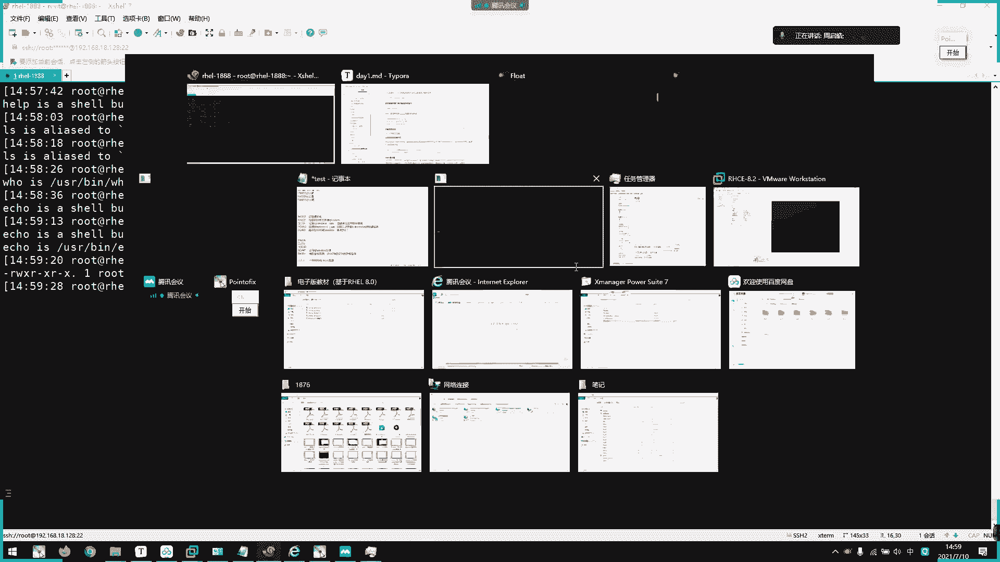
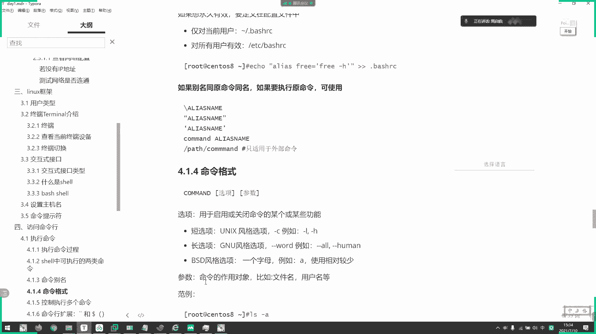
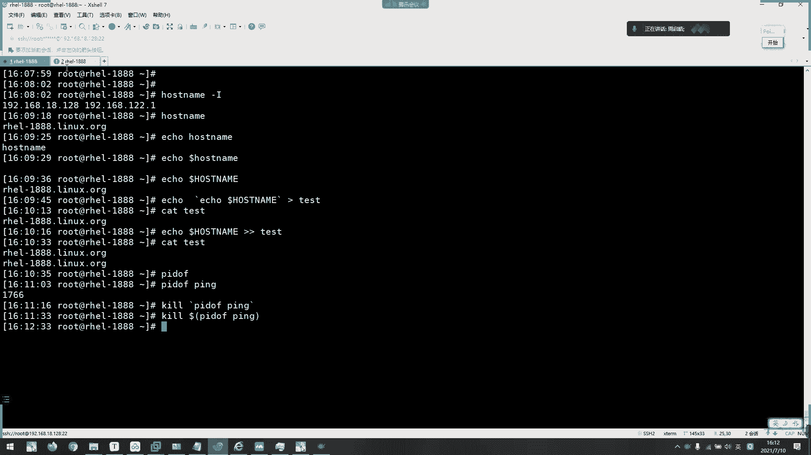
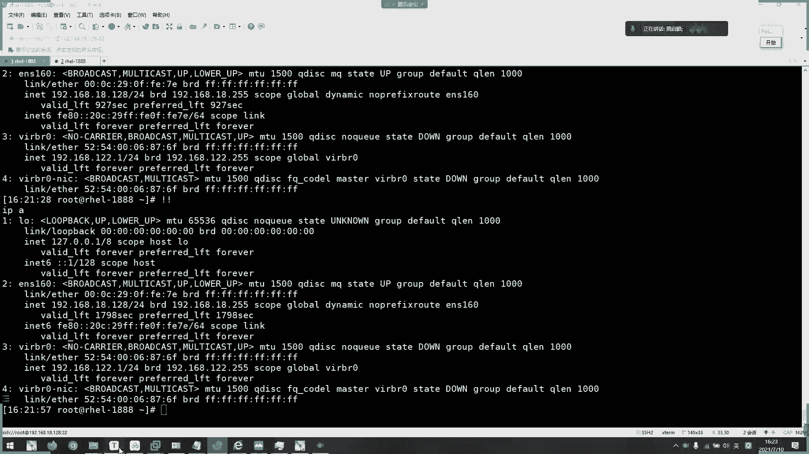
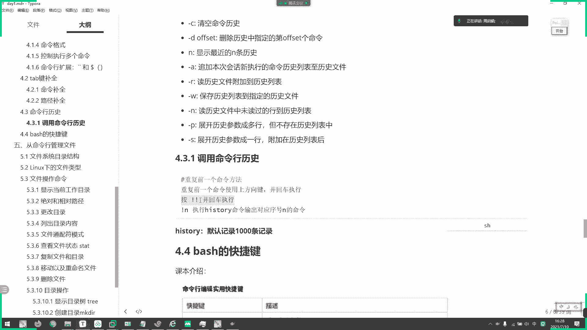

# 2021年7月新版-----RHCE8.2 RH124 RH134 RH294 认证课程 - P2：day1-2 系统介绍2以及访问命令行 - bili_15701050454 - BV1Gy4y1T7ug

啊，早在我们了解到啊一个系统里面执行命令的一个过程。那么。我们。校里面其实一共有两类命令啊，一类叫做内部命令啊，是我们的校自带的。另一类啊叫做外部命令啊，是我们第三方应用提供的啊，比如现在。

看一下啊L。呃，应该是bebash吧。啊，哎。看不到详细信息啊。啊，你看我们这里啊bebe里面啊它的大小啊多么大多大啊，差克的区别啊，啊，1。6兆1。6兆。那么它里面集合啊都是我们一个内部命令集合啊。

内部命令集合啊，想知道我们有多少内部命令啊，很解到啊这里一个help啊，help啊本身也是一个内部命令啊，那么我们通过help啊，可以看到更加多的类部命令啊。啊。啊，比如说。

列表啊啊什么别名啊啊什么后台运行啊嗯等等啊。主动啊break啊， historyory历史啊，还有我们的一个一些逻辑运算if啊啊。呃，four啊啊。等等啊，这些都是我们的一个la部命令。

然后Yvo命令呢。🎼啊，比如我们这个L啊啊就是外外部命量啊。啊呀啊，这就是外部命令了。啊，他们之间啊有什么区别呢？啊，首先。播命令。它是由第三方提供的啊，那么我们可以用一个命令叫做which。

可以找到我们的命令啊，你看。有路径的啊。这叫做YO命令。我们LS啊们。呃，微取一下。Help。啊，你看。啊。没有啊，他说在我们的环金面单里面没有啊环境面量的话，我们等一下再讲啊。然后呢。😊。

关于内文命令和外文命令啊，我们可以通过一个命令去判断啊，叫做t。类型的意思啊啊，比如说我太过了hel，你看啊hel这个命令啊，它这个意思是什么呢？hell is a sell button啊。

就是是说啊hel这个命令是。我们se里面的内部命令啊，然后type。好。嗯，他现在有个别名啊，所以看不到所以看不到啊，看一下能不能。这样吧，不行啊。那么我们换一个吧，比如t。嗯，用哪个考啦。一口不行啊。

酷吧。啊，你看。😊，当我们用t马去识别一个命令的时候，如果啊如果它显示出来的是一个路径啊，那么说明这个是一个外部命令啊。啊，如果是啊呃but啊，就是内部命令啊。这是啊我们。

🤧嗯。命令的两种类型啊。

啊，这里有。然后呢。啊，有一种命令啊啊是比较特殊的啊，它既是内部命令啊，也是外部命令。啊，比如说我们的E口。啊，你看它现在是显示的是内部命令，对不对啊，我们加一个弹理选项啊，该个选项可以看到全部啊。

你看。啊，is a，然后它还有一个外部的。啊，看到了。啊，其实这个。啊，没所谓。

啊，其实这个没所谓啊，只是他们的一个运行时啊不同啊，运行时不同。

啊，什么叫运势不同呢？啊，这就是我们一个命令的一个读取方式啊啊，如果它是一个内部命令啊，我们直接敲，它就会直接。

Yes。但是啊我们外部命令啊。是要通过我们的一个。叫什么呢？环境变量来控制的啊，然后环境变量呢是我们一个内置变量，叫做pas啊环境变量。啊，比如呃我们刚刚的1个L啊啊L。🎼啊，它是一个万微力啊。

一口也是啊，刚才看了啊，这里它是一个路径感，叫做user bin。E口啊。就说B echo。那么。为什么我们直接敲一口？🎼啊，或者是直接敲S，他能找到这个命令呢啊，是因为它存放在我们啊金片的里面啊。

我们可以看一下环境面料啊。我们默认的环境变量就是这么多啊就是这么多。那读取方生怎样呢？啊，我们刚刚敲了啊I这个命令啊，它说外命令对不对？那么画以后就会在这里找。啊，以冒画为分格啊，冒画为分割。啊，就是。

啊，很多个路径的啊，也行曼号风格。啊，首先是他优先到user local bin上面找找不到。往下涨啊。往我们的user logo并去找。如果这里还没有，他就找user spin，这视频也没有啊。

就找user bin。然后呢，我们L就在user bin里面啊，所以他就找到了啊他也找到了。啊，如果这里没有的话，它还还会往继续讲。如果都没有了啊，比如说我现在敲一个不存在的命令啊，XXX。

那就说啊他慢了烦。啊，佢慢都翻。啊。🤧。比如我现在写一个脚本啊，简单的脚板啊。嗯。😊，Hello，大下啊。啊。啊，这个脚本啊就用来打印hello的啊。う。好。对呀，然后我执行他。啊。

就打一个hello腿，对不对？啊，打一个hello出来。然后啊我们直接。hello点SH啊，你看不存在这个命令，对不对啊？我们命令本身啊也是一个可执行的文件啊，所以我脚本也是一个可执行文件。

可以把它当做是一个命令，可以把它当做是一个命令。那么。啊，我现在。创建一个目录啊。叫做road big。🎼啊，ro丝饼，然后呢把这个烤到里面去啊，移到里面去，不给烤了。🎼到我们的。兵。啊。哎呀。

没有了啊。那么我现在再见hello。你看是不行了啊，看到没有啊，无论我现在在哪里。对。啊。他都能够执行，对不对？啊。因为什么呢？一位。啊，我们的环境变量。啊，有我这个。好，road B啊rob。

那么我现在把这个。移出来。冰下的啊。到这里。啊，你看。这啊，现在。好的谢是这个脚本啊，就放到我们的data下了，对不对？那么啊我们可以通过更改环境变量啊来。读取他好，现在hello。点二选序来看。啊。

他说没有了啊，已没有了。那我们现在呃改一下环金面单。啊，不要聊了不要闲聊了。😊，嗯。🎼啊，那么我们现在能执行吗？啊。有啊。我现在把环境变量啊更改了，我们依口一下。样啊就多了个data。

而且优先选择这个东西。啊。就是更改我们的快递变量啊，手动更改。那么。们有没有发现啊，老是在前面敲。啊，这个hello的时候，他说come on了 fun啊，come on了 fun，然后呢。啊。

我把它放到啊我们的环境面量里面以后呢。跳起来啊，它就数hello，然后呢，我把这个啊临时的啊。啊，临时的。啊，然后呢我把这个hello。点下去移到data下了。要对了下以后我再好。啊。

再敲它输出什么东西呢啊，找一下。我觉得啊。嗯。所所以啊，还没一。系啊，嘿。我在敲啊，他就。不就那个了啊，不是前面的一个报错了啊，不是comman find了，它变成啊变成我们那个。找了这个路径啊。

说rodb啊。hello，大一下去啊。没找到文件扩存文件夹啊，为什么呢啊。为什么呢？好，是因为。去。我们计算机如果按照原来的一个搜索方式。一级一级去找每一次运行，我都一级一级去找。啊。

是不是很耗费时间啊？啊，很耗费时间。那么。在我们当前的冲多里面啊，当天的笑。啊，在我们搭建的下。它有一个表叫做啊命令的缓存表哈C表啊HA。啊，我通过这个命令可以看到，你呀。

它现在又放到我们的dataheloHH里面了啊。这就进录我们的一个外公命令的使用啊。比如我现在L。然再看下师。你呀他要记录了啊。那我在这个终端，我不关闭这个终端啊，不关闭这个bech啊。

不不不关闭这个bech进程。就部关闭它它就会记录在这里啊，它就会记录在这里。然后。他下一次就不不需要再重新找了啊。他已经有一个路径记录了，所以呢它直接会找到这一个啊呃右色并啊，会找到右色并啊。

就不用一一级一级往下讲了。啊，就这样来的啊，所以我刚刚把它移走了。他把他移走了，他还读这个目录啊，是因为我们记录太累啊，记录这累。然后呢我再。呃，把 datata改进来以后呢啊，再调它就替换掉了啊。

把我们的worl。啊，可以这么说啊，HB是记录我的一个粒子命令啊。他去表示记录我外部命令的一个款存表。好，它记录我们的怪物密那个路径了啊。但是我现在退出终端再进来。你看没有了啊，他说这个表是空的啊。

看到没有啊？还随便。Yesす。嗯。啊，是空的啊是空的。啊，虽然呢在我们右眼看来，内部命令跟外部命令它运行的速度啊其实是差不多的啊。大是在计算机里面。啊。超出4毫秒啊，都算久了超过4毫秒都算久了。啊。

所以我们以前机械硬盘去读程序是怎么读的啊，机械硬盘是不是啊它有个磁盘，然后有一个磁针，然后它啊就按时去转啊，按时去转啊一个扇行结构嘛，对不对？然后呢你的数据可能在这里啊，可能在这里可能在这里啊。

要它转成转那个帧啊要转到那里啊，读取到才可以啊，所以呢我们7400转啊啊，可能读取速度。呃，按照来说啊，所以说度可能是。Shes。好像不止啊，好像75毫秒。啊。没MB啊。啊，机械硬盘。啊。

所以我们现在固态是很强大的啊，固态就没有这个所谓的磁头啊啊，去读取那个桌面啊，现在就没有了，现在就没有。好。

啊，这些都是啊一些底层相关的啊，底层相关的啊，这是我们的一个p啊。刚才有个同学问我啊，是不是有经保存了啊，我们现在一口一下配啊。

啊，你看啊。这台又不见了，是临时的啊。要保存怎么怎么操啊，一样的啊。嗯，这处理好。P。等于。嗯。得卡。对好蛮好，然后是我们的dora。开始。要后保存到啊我们的早账那里的。厳しい。

Provide them。Yeah we的。啊，说了盘金病呢就到这里啊。那杀这里。🎼要不要改，先试一下，不改吧。其他两个箭头啊，早上是一个箭头，现在是两个箭头啊，我们看一下啊，现在一口多了。嗯。

没有了没有更改哦嗯。被录取啊。啊，现先看一下。哪了，是不是？电台就出来了嘛，这就永久保存了，这就永久保存。刚刚我改了，如果直接不写文件啊，直接这样子啊，是临时的啊，是临时的。ち。这最佳。啊。

这个后面会讲啊，就先不要说啊，这是最加，不是覆盖。

两个全都是追加，单个全都是覆盖啊，这是我们的个哈奇表。啊。

嗯。呵。😊，在进去就。给你看一下，我就就知道了吧。我通过pa啊可以看一下这个文件。嗯，看到没有？这接就把它写写在这里面嘛啊写在这里面。然后呢，它一开机就会激活。

我刚刚那个source啊是直接呃手动激活呀，手动呃去刷新我们好几面那个呀啊。所以这个文件啊，早上一个箭头啊，我就生成了这一句话嘛。然后刚刚的啊两个箭头就在这追加嘛，在末尾追加嘛。啊，就是这样子。

🤧。好。😊，可以看一下这个表。跟我刚刚说的是一样的啊。把我最终端重新进来啊，打开二记表啊，是ampre的啊，是空的啊。好，然后呢。执行外部命令，它就会从他西入地啊往下搜索啊往下搜索。

然后找到这个命令就会记录在哈奇表中啊，然后下次再使用这个命令啊，他直接会先查哈奇表。如果哈希表没有了，他再从呃我们的pas下面找啊，如果都没有了，就报啊com方案，就没有找到命令了，对不对？啊。看到没。

啊，这样子有额款存表可以大大提高我们的一个命令的调用处理。这是偏底层的东西啊，了解一下就可以了。去。就怕面试的时候有问到一些啊。好。是。然后呢啊。另一个小点啊就是我们的秘密的BMM。变例变秘。呃。

命令文名啊是通过我们的啊爱ice啊。去控制的啊，我们可以直接敲一下这个命令。

瞧一下。电死的。

啊，你看这是我们系统目前内置的别名啊内置的别名。

什么叫别名呢？啊，什么叫别名呢？别名就是我们敲出一个命令，其实他。そ。其实是他执行的后面的结果啊。比如说。嗯。对啊，就是他直接结果其实是我们后面的啊。呃，比如说我现在把这个呃L改一下。ああます。等于。

Yes。嗯。这条其实不是这样做啊，其实是可以直接删除页名对。这里是否更改。那么我就直接S目录啊，就单前目录吧，你看。是白色的对不对啊，是白色的。那么。我把它改回去啊。S等于。It was。看看。

color啊，不对。等于Oto。然后呢，它就会对我们的一个不同的文件啊进行一个高亮。蓝色。就是目录啊。白色就是文件，普通文件。🤧啊，这是一个别名啊。呃，关于别名的话呢，可以啊方便我们的一些。

啊，操作啊，比如说索现在再加一个啊alice free等于非改去啊，今天早上呃今天早上我们。啊。

是要费等于。可以看一下。要费啊要费。看去好，对。他们之间的区别就在于。是否可呃易读啊是否易度。那么我现在把它。A I。Free。啊等于。税概去。那么我现在调这个fr啊，对。他就被你一住了。啊，妈有点大。

🤧。会吗？太大声还是怎样？没理由啊，我这是笔记本自带的妈呀已。啊，那先。如果大太大声能就把声音小调小一点啊，直接调小一点。好，然后呢啊别名，但是呢我们这样子操作啊。一阳。依然不是。应该不是永久保存的。

也是临时的。这个状单看一下。う。连呀啊费都没有啊。或者说。敲一瞧，你看有没有，对不对？又还原掉了啊，只要我推出中呢，它又还原掉了。去。那么我们怎么样才可以把这个保证呢？啊。

我们可以写到啊用户专储的一个编。呃，环境里面啊。用户作用的。嗯。是在我们家目录下啊，有一个点。啊啊。啊，销水就可以了。下载以后呢。啊，他就直接啊是用户自己的。可以用啊，比如说ALIASO这两个啊。Oh。

See。有不人。B杠H。嗯嗯。好，这里要注意一下啊。🎼他现在看上面啊就是说它优先级比我们这个ETCbachRC要高啊。因果现在下面就是它那个优先级比较低啊。我们ETC batch主要是对全局啊。

我目前这个在加目录下的点baRC文件呢是对个人啊是对个人啊适合用户的。啊。啊，bechRC对全局的。🎼那么我要先写了一个非开，然后现在全局啊freshRC。再写一个。等一下。🎼下最后。

🎼所以就应该没问题。Yeah。🎼嗯嗯。写什么好了？嗯。我想想写什么好了。嗯。这个不好。呃。我随便写一个吧啊嗯。Sa个地方。嗯，哦A。啊，有办法啊，B啊不不学费啊，用学费的话就有点那个。别乱来。

有们啊别乱来别乱来别乱来。嗯。没听住两等于。看到了。CDN。等于。是。シリ。EDC什ST啊。That's why it's still AFIG。Let work。这CRIPT啊。一。あば。嗯。😊，好。

没了啊。那么我们现在投出通道。看着。看一下行不行啊。C。诶。😊，哦，少了个S。🎼A下。你放叻个。哦。那个一。🎼还没改过来，要推出一下，或者是要送死一下啊。呀可以了，对不对？啊。A fee。啊，直接表啊。

你看啊可视化，对不对？那么我现在切换到st啊。那么。我在这期天。他能切过去吗？啊，同学们。他能切过去吗？可以是吧。不行。呵呵。😊，我试一下好不好？系呀。可以了啊。切过来啊，看到没有？

那么我现在敲一个free。他是一多吗？啊，他的数据是易读吗？🤧嗯。啊。是不是跟这里一样的啊，你们觉得是不是跟这里一样的？Yeah。啊，不是是吧啊，非常好啊。啊，就这么啊，学的非常好。

我想你们大概明白了啊。或者你们大家明白了。啊，首先我们。CDN这个是写在我们的ETC。h阿 c 对唔对。😀呵。😊，不相信他说了这对全局。所有用户都适用的啊，所有用户适用可跳全局。然后呢，我们free。

那别名啊是写在我们ro的节目录下的啊。点。B R c。他这是对个人的。啊，对个人的。啊，所以怎么样？still等用户就获取不了我们的C杠HR，它要相当于指的是一个费啊，指的是一个费啊，它获取不了啊。好。

那么我们再玩一个游戏。好，回到这里啊嗯。Where唔。🎼好哇这个。发这里来，哎呀。Yeah。🎼啊，放到这里，然后是。🎼。可以啊，都可以，什么命令都可以。呃，HRC。我看一下费还有什么选项。哎呀。可惜。

So， I would buy this。这是M。Humor。我看一下钢B啊。杠K吧。가게 보시。你个边。你搞边啊？哦，我知道。他读取了啊，他现在是读取了我那个呃环境变量了。嗯。降T。明白有变化啊。

多了个toto啊，那我就用这个吧，多了个toto，我们选在这里啊呃free。等于。Free。看。T。好，同学们。那么我现在敲free。啊，他执行的结果是什么？啊，是刚T的，对不对？哎呀。可惜呀。

为什么不死啊呵。😊，응。不是。嗯。🎼没有啊，应该是那个。不对不对，我写在那个下面了。对呀，发车发车。我写在这个下面了吗？他说。🎼啊，如果有这个文件，那么他是先读这个呃文件，然后最后才这里。哎习惯了。嗯。

😊，哦。🎼我改一下ETC下的。哎。😊，还是不希望。哎，为什么呢？🎼那个咨源顺序有问题。🎼我写到下面来了，为什么？呃，看看。APC下的。哦，我知道。🎼把睡的头。下睡来了。Okay。は。好，现在试一下。

🎼SOURCE。🎼E体C加的。先试一下啊。那我就说嘛。看到没有？刚才写到最后了啊，它中间有一个判断啊，中间有个判断。被挡住了被挡。把它先投的话，它优先读取了，就优先读取了。其实它这里啊也有设置的，你看。

看一下。你出。呵呵。😊，🎼嗯，没有点变成阿C了。没有啊。嗯，没有啊。那为什么会这样？来着。他可能用的变量其实。🎼啊，其实这个也没什么，只要是给你们说一下他的一个都有顺序而已啊，都有顺序啊，优前提。

Pide their issue。🎼有没看到这个判断唉。没看到这个判断。但是我退出了吗？当时我会出了吗？再试一下喽啊。我退出了那个。其实。So。Yeah。嗯。啊。哦，还真的。😊，啊。

就是说他直接退出也激活不了了，可能要重启才行啊，可能要重启才行。我再改一下啊。🎼看是不是啊？把它呃。也许不要了。对呀，现在的话他应该还是。原来的。哎，你看现在又不要激活了。把锤子。好他。

re杠T啊可能就这样。你。我改了都没说死，他就那个了。对不对？好，回播一下。重启下看看。Yeah。好，现在试一下行不行，刚刚没有s死啊。啊，你看。不行吧，对不对？🎼所以不是那个问题。

我先把那个加目录的删了。Yeah。Yeah。先加个主持注掉。那么我现在在缴费啊。他一然没有。呃。🎼再踢我一下。看下又是另一种方式啊。做石一样的。所以一该。那么。你家。🎼还是要计活再行，重启都不行啊。

重启都不行。啊，一定要激活啊一定要激活。好，这个。不管啊。先不叫机款啊，应该叫加载，随新下载，随以下载好，知道就可以啊，知道就可以了。好，然后呢叫表名。

呃，杠A是可以删除掉所有边别了。我们先试一下行不行。

嗯。

叫什么来着？废了。嗯。哦，说错了。有。嗯，大里斯。取消了啊，那我们现在在执行。你看所以变变成原来的啊，所以变成原来的。啊，没有了。那么我们看一下重新加载还有没有。是。啊，有了啊，所以家的就有了啊。啊。

正因为我是写在文件里面啊，所以加载上肯定有啊。🎼好，这就要删除别名啊啊，摁al，然后加别名那个名称就可以了啊。那么哎哎当初。澳纹现代。这 free啊，它是啊按照我们这个标RC里面的读取，对不对？啊。

去动设备。那么。我们。如何在有别名的情况下啊，想要它显示回原来的啊，怎么做？啊，可以这样子。加个反斜杠，然后敲命令。你看啊就是它原有的。样子啊还可以说一号吧，我没记错的话。啊，看到没有？说你啊。

什么不加啊，一别命啊。你明明啊，你看有一个doer啊，do了夸括号啊。え不し哎。到框话是变量啊。呃，可以这么说啊。🎼难个是中括号？

啊，不对，中华是测试啊，为什么夸国号不行？哦，是的。啊，这里也有刚刚的一个介绍，全局还有什么？

哦，直接是 command慢啊。Com on。B啊一个原有的啊，其实这个没所谓啊，记住它用仿斜杠这样子的，或者是用单引号啊。或者他。🎼就可以了。

啊，这里都有翻例啊。然后呢，这个路径啊只适用于我们的外部命令啊啊，因为内部命令没有路径啊。啊。这就是我们的别秘啊。对面。啊，很好用的啊。比如说真的。

呃，我们的一个。啊。经过这个目录啊这么深啊，如果你天天啊一直敲一直敲，是不是很麻烦啊，把它改了就可以了。是不的C点了啊。或者说。呃，我们把。LIAS。呃。原。TH你。等于。呃，RA。一听西下的。呃，空。

嗯嗯。SCRIPTS。嗯。下载IFCFG。ES1608。大家啊我们这个别名一定要有这个文件选择，对不对？Oh。🎼那么我们改网卡配置。是不是可以直接这样子的？我就不需要输这么一大串东西了，对不对？啊。

我直接VTHD。啊。是不是方便很多啊。🎼答。到后面呢啊讲到网卡配置的时候呢，我会跟大家说啊，建议改啊我们的一个网卡名啊。啊，让他不要再交呃ENS160啊，按我们s6那子啊。

用我们的E呃E天01234这样流水下来啊，就方便管理啊方便管理。那么边民也可以统一使用啊，对不对？

好。多。继续往前啊。好，我们看一下命令的格式啊。

放一天命令的啊。比如说说我们刚刚的啊fre杠H啊。そ。一个是命令。一个是选项嘛，但是我没有参数。他说是可选项啊啊，所以。啊，这是我们的一个。选项所以我们一个命令组成。

啊，所以啊我们的一个命令手册啊，类似于老师这里的一个格式com慢。学下参数。然后呢。或者它比如说什么可选的可选的。可选的啊，有一些命令呢是不需要选项和参数都可以执行的。

哎，好呀。啊，他是。啊比IP就是啊。我们这个A呀。他不是取下来的啊，他是一个指命令来的。是几面样的一个缩写。啊，做作IBDBR说。嗯，什么风格不是啊？

呃，我们命令啊有参种啊参数啊，所以刚刚说了，所以是我们的命令啊，然后后面的字可以下来选项有参数。什么叫参数呢？这就是我们的一个装对象啊装对象。

比如。L杠1。🤧うん。当前目录。那么这个是我命令啊？是叫选项啊？那么这个是不是我们的？说。可是。这是我们那个钉定注册。

好，然后呢我们的命令学校有三个风格。第一个风格是我们的unux风格，叫保选下，像看看的啊一个杠加字母。啊，就说我们那个短风格。啊，unic呃作我们导点上是我们的unux风格。啊。

这是查选下是我们的GMU风格。

啊，它是两个横杠加单词啊。两刚刚看那种嗯，比如说刚刚用到的啊fi杠。这不是unux啊，不，这个是linux风格啊，查选下。可能。内储画组嘛。啊，讲一下，比如说我这里感觉坏的。啊啊，你直接显式显示啊披露。

嗯。啊，也记录其时显示啊。啊，这就是我们的一个风格啊，还有一种。

叫BSD风格啊，就一个字母。还不A啊。但是要注意啊，我们刚刚。

说了IPA这个不是BSD风格啊，你要觉这个不是BSD风格，它只是一个缩写啊只是一个缩写。SD风格呢有什么呢？啊？比如说我们查。进程啊早进程啊A。啊，这开始了。谢谁？啊，这才是我们的1个BSD风格啊。

这个比较少对吧啊，遇到再说吧。

可以说啊，刚才说了啊作用对象啊，通常是我们那个命令的作用对象啊，比如说文件名啊，用户名等等啊等等，反正是加入到我们命令后面的，然后是对它作用的对象，就叫做参数啊。好。有啦。我们可以。呃，执行命令的一个。

啊，执行可以可以可以同一个密行里面呢啊输入多个命令一样的执行啊啊，它有三种啊，第一种是分号风格，第二种是双。啊，双书干第三种是我们的啊两个and。

啊他们之间有什么区别呢？啊，比如说。我这边。一口叉叉叉。L叉叉叉。啊，然后是迪cohello。啊，大家注意一下啊。说。你看我第一个命令就是让它输出叉叉叉，是不是XXX啊，第二个命令是。啊。

显示这个文件的内容啊，然后呢，他报了个错啊。说。这个文件不存在文件或者目录不存在，那找不到嘛，录上去就不存在嘛，对不对？然后第三个是一个helo。他这种数根式啊运行方式怎么样呢？啊，封号。这里是命令一。

这是命令2，这是命令3。啊。How。就是按顺序执行。按顺序。2岁之前。No。不款。命令。那个名怎么写？啊，都行。结果。啊，都会往下这行啊。啊，多个晚上事情啊，1到2到3啊。好，紧接着我们来看一下扩。

依个 hello。Yeah。就就下。啊，我们看一下输入结果。嗯，你看。Hello。那么我一下大家啊。怎么员。Yeah。来拆下，然后再。好。他输出。会输入什么东西。5。hello。我们看一下结果。

各思考就好了啊，有各个思考就行。你看。啊，两个都执行了啊。两个事情。扩是什么意思呢？啊，扩啊，比如说是。我们就两个例子吧啊。嗯。第一个执行成功。是。全部执行啊全部完全执行啊，结果这个失败。好。就执行。

第二个。明啊。就是说我两个命令。啊，用我们的逻辑运算来说了啊，就是成功为一啊出嘛，对不对？成功。1码为0啊，对不对？False sorry。我们这个货。它结果啊要等于一啊，就加起来啊，两个加起来。

两个命令加起来啊要等于一。啊，大家这是两个命令上品方法。就说如果。要等于一。我们这里成功了，它已经是一了。已经是一了1加。啊，用词了用词成语。啊不行一定用加。我这个都已经成功了啊，我加什么都都是一。

对不对啊，加什么都是一。不能说这。这个二进制的不能这么说啊。啊，反正知道就可以了。其我这里已经是一了啊，对我已经不需要你后面那个来判断。但是如果这个是明。我是不是要执行这一个到底是一还是零。

我才能确定它是否等于1。啊，是不是？啊，所以他失败还要执行，成功就不执行啊，成功就不往后执行啊，失败就往后执行啊，因为我我这里已经得到一了，我就不需要看后面是否是一啊，但在我这里是零，我为了要得到一。

我肯定要加后面的判断啊。这逻辑啊我们脚本的时候啊还会讲啊，我们叫做短路啊，叫做短路。好。啊，第三种啊是at。嗯，啊，同学们啊，它输出是什么呢？啊，猜一下。啊，输出。我先看一下叔叔啊。

再反过来也给你们试看，大看。啊，他运行了他运行了。啊，然后反过来。啊。他资金的结果是什么呢？啊，也是找不到文件跟录上去是吧，我看一下。嗯。啊。答对了啊，它的图形第一个。它end是什么意思呢？啊。

end也是12，然是end end。哦，是不是写错符号了？看谁说算了。好。😊，当第一个命令为一。啊，我就还要执行第二个命令啊，就要执行第二个命令。如果。第一个命令为0。他就不在这些了。

直接退出啊直接退出这是M是并的关系啊。有。加起来等于一啊，他是希望真的真真的是希望加起来等于一啊。对不对？这个是沉啊这个真的是沉了啊，这个是真的沉了，病的话真的是沉了啊。啊。一除以一。啊，等于一对不对？

啊，他希望如此啊，但是我们。一所以他要看后面到底是零还是一，我相称才知道结果，对不对？有这个视频0乘以任个数。都等于0，对不对？所以已经不需要判断后面那一个了，直接退出啊直接退出。啊。能理解吗？

啊，刚面说说啊，或是加的关系啊，或是加的关系啊，然后并视存的关系啊。好，这里可以看啊。我们到时候讲脚本逻辑的时候，再详细讲。知道就可以了。呵。啊，挺不错的啊，同学们同学啊。那我们现在休息啊，我要休息。

呃，学到4点。好，那么我们刚刚说了啊，多行多个命令啊。啊，这个到时候我用在条本上面也很有用的。那么。我们可以看一下注意事项啊，多个选项以及多个参数和命令之间使用空白支符风格。就是我们啊那个空格键。

这里空格空格空格空格键，要它取消和结束命令之前用我们用con多加湿器啊，多加息让它提前解锁啊。比如说说我们平百度啊。

啊，你看要可能要C结锁啊。然后呢，多个命令可以放在一行，然后呢，每个命令之前可以用我们的for格，这是二寸垂时行。

一个命例呢啊还可以跨过行啊，这个我要讲一下啊。啊，比如说。🎼呃，像我们这个嗯。啊，我们没有白名的情况下啊。呃。Yeah。没有背背情况下。呃。Yeah。然后呢。

我们改完是不是要NUI collection？Weload。然后是LUI啊，可能是REX。160车子。说会比较长。好，那么我们可以这样子。啊，首要是路径这一块啊，路径这一块也比较查了啊，我们可以直接。

🤧嗯。还有分号。对在这加吧。你说系啊。ok这个头。啊，在这里。🎼呃，不是回事啊，他这里回不了啊，在这里回不了头啊。比如时说我要自接催这双命令，我可以这样做啊。从这里。啊。Yeah。然后。什好。我操啊。

🎼诶小爱啊开。Collection。漏。啊，EXS160。这样子结束亏程。Yeah。🎼我要改一下这个，比如说。呃。🎼真个不好解。都删掉好。然后。🎼怎么可以是这个。把这个改成。呃，不行啊。

到时候就直接改成开机对，开进不启动吧。好，8个钟。诶，出事了，可能审批错了啊，可能审评错了。哦。啊。呃，多了个A啊，CPIN而已。那么我重新来过喽。嗯。哦，开车。M c l I。可来。那你提提加我啊。

我听 e c t a。我以为let是那个网络意思啊，col能连接colect connection。记录。封了。🎼再来1个MHUIcol选。其可以缩醒了。我要收起来。啊， good的。这里直接把它再住。

了去自己来看他说啊现在启重起来了啊，那么我们现在重启来，看一下它是否。没有开机。要到出情况，它不会自动连接啊。嗯。稍等，我一会。是。呃，鼠标。没。都。说先这样吧。好，那我们看一下网卡是否没有启动。

看一直没连接，是不是？所以我们网卡没有开始启动了。然后在这里登录。I。嗯，可以看到我们这个网卡啊。没有该系统啊，目前它是一个虽然ts up啊，虽然ts up，但是它没有。那么我们现在再执行一遍，刚刚的。

嗯。对。yes哎，写错。比一百。都这些了。好，那么我看一下这边连连了连过来没有？嗯。😊，怎么回事？VIP。有IP啊。手动呢。嗯。有IP啦。呀都能出去了啊。没有变没有变啊，128。没有变。v漏了。

我已经遗漏了。我刚刚是商层命令来的啊，对商层命令来。还咪好。啊，好了。他没加载也完成了已，对外。啊，这也是我们的多行啊，分成多行。

输入啊，用我们的啊反切杆分割。好。接下来是我们这个命令和扩展啊啊这个。嗯。用的还挺多的，就是到后面啊用的还挺多的。啊，就是。两个返点啊加或者是多了括号，然后里面写一个com啊，就写我们的命令啊，把它。

说的出来呃。

比如说我这里。

啊，也不是这样说啊也不是这样说。到后面你就知道了。有很多命令是需要这个的。

呃。🎼比如说我们现在。出现一个东西啊。🎼不对呀。啊，不知道用什么方面啊，试一下吧。好，可以这样啊。呃，我们来。想要打印我们那个hoss类啊。🤧哎，怎么有两端呢？啊，这是IP啊，不是IP我们打印这个。🎼。

你看他目前的话是这样子。然后呢，我们这边呢其实它有一个变量啊，就说一口唉，没有了。是大型吧啊是大型。我就看到那置飞兰一般都是大型。后。Like。你看啊这样是可以打我的。🤧。那后我想把它传输给。

🎼其他东西啊，比如说。呃。把它调入给其他命令啊，比如说。或者不需要了。嗯。🎼靠啊，然后行到文件就啊。哦，我K一下这个问题啊。嗯。看到没有？这是区别啊，区别是什么呢？来，我们看一下。🎼我是现在不加这个。

我感觉还是一样的。打那个追加吧，不两下是一样。对啊，还是有。呃，那这个就栏看好了。

因为金城那里我也没例子给你们了。金城那里。要我们还没学进程嘛，我们学进程的话，它有一个挑用的东西啊啊，比如说叫什么的什么来？

哦，还未装应该 t i d 点货。Good。🎼啊，1776啊，你看我这样子可以扩取到它的一个。IP。🎼啊，它的一个呃PID对不对？经常看，然后我。可以就些其他东西吗啊。直接默认。对呀我把它传传过来。

然这样子就听到了嘛，我们还没学还没学。没办法，我只能做做这个例子啊，就就就是停掉进程的意思啊，停掉啊。然后呢，我通过这个进程号啊传传输给我们Q啊，是不是一个复合命令啊，虽然真的是脚本用的比较多。

这的是脚本用的比较多。啊，大家理解这个就可以了啊，理解这个就可以啊。BID以的话是呃通过呃。命令名称啊，导入它的一个车号啊，然后我这里通过序号来杀死。把把这个尽量停掉啊。

我们到时候讲到进程就理解了这个东西啊。符合命令啊。啊，除了两个凡凡一号，还可以用我们的一个。呃。多少括号啊多少括号。有事多了。好好。Yeah。嗯，行。执行了。

，啊停交了，对咧。好。走咧。下面是我们双引号、单引号，还有反引号三角的区别啊。啊，第一个刷引号，我们来看一下。我们正常一口。

多了ho。来他输出啊。🎼就是那个变量的结果对不对？可能你们这样看不清楚啊，我这里是到变量啊。诚科。我们设了一个呃自定页变量，然后让它取出来，我们一般都是用一口，然后把变量名称啊，让它打印出来。

那么我们现在加个双一号。🎼以降。对吧。いこだ歌。然后。我把它改成大一啊。🎼大家猜一下结果是什么。啊那看一下结果走吧。啊。啊，对啊。

带一号带一号叫强理动啊。啊，然后这个不用说了啊，就是输出这个嘛。

哎。这个就输入类嘛，对不对？说另个字嘛对不对？好，啊。当你看啊叫强引用，什么叫强用呢啊，就是他六亲不认。多了它就把它当成是一个多尔符号啊，他就把它当成个多尔符号。啊，然后是。每一个字符啊。

它作为一个原字符而已啊啊，不把它大成变量啊。

但后就钱你就。好啊，这有个总结啊，这个回以去可以看一下啊。好，接下来是我们的一个tableable键的一个mini补权。啊，在我们linux三中呢啊可以通过tableable补权来。提高输入效率啊。

而且还可以避免出错啊。

啊，比如说。他可以贴补两种啊。table步。啊，比如说我现在要CD到ETC，哎，我已经用table了，看下ETC下的啊SYC。co下的文件夹。结个。🎼没有。Yeah。啊，不好意思啊。鼻子有点哑。啊啊。

你看。🎼呃，我敲一下没有，那就敲两串啊，再重来啊SYSC敲一下没有。听到一声蜂鸣，对不对？再敲一下啊，它就会把ETC目录下由SYSC开头的所有目录跟文件都会列出来。啊，那么大家我们走目录啊。

由SYSC开头的啊，有这两个。然后呢，我现在再输有个N，把它输一个O啊，输一个O再一次它就出来了啊，因为。他们对比之下。圈一个字母O跟D。已经是唯一值了，对不对啊？只要是唯一值。

我们推我一次就可以出来了。不是唯一值的话，我会敲两敲两次啊，或者我现在什么也不知道啊，不知道我该出什么，直接退伍来。也列出来啊。把这个目录下。所有的目录文件都列出来啊，不管它是什么开头啊。

其实这个相当于是一个新啊，相当于是一个心。就任意自我啊。然后我们要去le我啊，那就。啊，他目前的话是。🎼唯一的啊，我说个Mtable出来了，对不对？啊，IF。啊，被告。这个是CD啊，大看那就过来了嘛。

对不对？这是我们table啊table作用啊，首先它可以路径股权。第二还这里是min令股权啊。比如说我们早上的一个min令sstCTL，对不对？🎼不会股权啊，敲两0啊，行。

像这种stemCD或者是stem低啊，包括它后面的啊。啊，那我们CT啊。然后。呃。我们早上是getty，对不对？就这给啊啊，你看颠补一下就出来啊。啊，它的对面密。🎼他的指命令主选啊。

🎼包括查说应该也可以。啊，不行然后他他没有啊，已经没有参数了，可以说啊，那么。🎼我们就改一下啊，叫s啊 default。双击啊，双击点看。

可选项。全出来了啊。看到没有？不知道出什么，高血量选出来。啊，就是。

这东西呀。看。啊。这个没力补权啊。它依赖于我们的一个工具啊，叫做b conversion。最小化安装默认是没有min你补权的啊，最少化都是没有的。啊，都需要装这个，要后注意带家才可以陆续补全。

这。啊，就这个包。嗯。现在没有最小化安装的例子出来。

我没有叫续机，我都做了。你错了。3没办吧啊，知道从那个包就可以了。

哎。就是。

是命令补全啊。好嗯。啊，如果唯一直接补全啊，如果不唯一，就双击，然后给出列表啊。这是我们的table股权。好，接下来是我们的一个。命令下例子啊，就是我们所说的一个history啊，history啊。

其实它。

我们。嗯。从开机到现在。啊，多么多听你啊。我们可以通过提取。历史 history。回声啊，还有记录哎。比我晚呀，呵呵。😊，好，你看。😊，他已经不是开机到现在了。早上没有啊，看到没？交son有。啊。

我们挑过的他都记录在这里啊，无论挑的对还是错啊，无论挑的对还是错。他都就在这里了。就他不管你那个结果啊。只要你敲了啊，还几个看到没有？照错了，他怕也记录。那么这个有什么用呢？啊。

首先我们可以复用一下啊历史命令。比如说我要修改。这个网卡。哦，现在可能没有了这个了。谁可能没有这个，那么。写到里面去了。嗯。🤧嗯。我随直随便吧啊，我要读完卡啊，随便一个啊。三是IBA吧，我们可以直接。

找到那个序号啊，247。输一个叹号再输247。啊，你看。他要说列出来20日期是哪个命令，然后我再重新执行一遍啊，所新执行一遍。这就是我的面命例子。常用的啊作用啊，我们再列起看一下。

啊变成IB它不是列出序号的，那么。呃，我这边呃再执行一次。ok。那么我们I边是不是294啊？啊，214。那么我现在出两个叹号，他会执行什么呢？啊，我输两个看看。你们猜一猜他出的结果什么？好像不是我。

一个是他多肉。啊，一个再呀。啊，应该是啊。嘿两个他啊就是重复上一个命令。啊，他看啊就是末尾啊，它的末尾HV的末尾啊。🎼啊，那个看多了是把那个命令摧毁一个参说。

好。嗯。存担承担什么？要我来看一下线水笔的一些。

CD什么CD。为什么要4D？什么意思？啊，什么意思啊？给我上一个命令，我最后敲的是一个。呃。耶有本采嘛。叹气石吸丁怎么不行啊。你不是你不是在那个目录里面了？啊。连在那里里面呢，要是觉得路地啊。有问题吗？

这叫本常用吗。

知道就可以了，这知道就可以。哎后。看一下呃，一些常用的选项，其实也不要采用这些H水这个东西都不是很常用。啊，我知道标用就可以了，一个两个叹号回去啊，探M啊，就是我们的一个啊。🤧K。好。

首先杠C是清空命令历史。看低啊是上述率的中指定的第几个啊。要是N就显得确新了AN调整历史啊。啊，不是看了，直接一个N啊啊，直接摁直接摁。14干0提下本次规划新执行的命令到我那个命令历史。文件里面啊。

标R啊是把它读读过来RW是保存过去，该啊就。把未读过的行啊加到我们的历史列表。🤧嗯。😊，然后是杠P。啊，就。展开历史。啊，对对对对。呃，多记录了。啊，其实这这这两个就不常用了啊。我们看一下前面啊。

首先我看一下我们交布录下是否有东西。

看。好厉呀。早上到现在都记录过来了。早上到现在都记录过来了。所以。我们开s to终端。🎼这是到下一次的啊，到下一次重启啊，到下一次重启给我看一下黑水。呃。他这里啊，比如说他正常离开之后就会记录啊。

正常离开就会记录，那么怎么才能做成不正常离开呢？

这样怎么样，我直接关机呀。对不对？怎么样他一向推出啊，做不了啊。哦，重启一下啊，看一下它是否还会继续保存。其实正常来说，我退入终端。他就会。把那个清除掉。只要我是真常登出，他才会那个。🤧保存。

所为他把现在那个历史都记录在我们默认效率面。是是记录在我们的啊，默默认默认。🎼下午觉的sbech这个啊是我们这个终端啊默认下，所以这个默认下。是我们这个中端里面，他刚刚刚动作都是。Yeah。就是这个对。

嗯。呃，重启。啊，两刚刚的都记录下来了，然后再。少了个哦，在这里少了在这里。你看他绝交了。啊。我现在给他个第录吧。307。我擅只退出。重连。他还有记录啊，他没有清楚啊没有清楚，那不管。

他这里本来是记录在内存当中的，它一定时间内刻它会清空的，它会自动删除的。自动自动调载过去，那么我们怎么去呢？就干细啊。

近屎。好，这就没有了。那么我们刚刚都保存到文件当中了，想把它读取回来，怎么说啊，直接用htory。干啥？啊，读读过来啊。啊都过来了。嗯。😊，因为你没有做VI，你没有写这个脚本就这样。我刚是写了脚本的。

😊。

好，然后。哦。啊，对你最少怕安装，它没有VIM啊。ifconfi它也没有装，它是依赖于网络工具包的啊。在八里面已经没有这个了。最早话安中也没有VIM的，只能用VI。好。告诉了里啊。

显示啊或者是指令删出来一条H。杠B啊，比如说我要删除这个cat啊，299。然后。说没有。哦不这个是有框那一个。

嗯ello。好。要这个自动保存，不用管它了就是这个。没什么用啊，但是你喜欢记录的话就记录吧啊。啊啊到干W保存啊看W保存。好。调调用那个历命令函历史刚才已经说过了啊，直接。🎼按两个的号就亏以自行啊。

说实话有很多人啊，我们还是喜欢用发向去啊，一直往下按，一直往下按，它就。

可。🎼输入出来啊，把我们之前的那个一条条输出来啊。所以我们重复的直接按一个上回车，回色上回色就可以了，对不对？啊。啊，长用的还是多了呃，不单号加数字啊。

加油吧。好，OK。咁么。谢雪员默认记录100的记录啊，如果他超出了，就会晚上进除啊，晚上进除。好，最后我们来看一下。嗯。besh的快捷姐啊。如果他是用vivo8。2的进上去装的话，它是默认没有仓库的啊。

要自己写。sal才会自带仓库，will有是没有的。好，我们来看一下betch的快捷键啊。bech快捷键。😊，🎼啊，这是我们课呃课本给的啊，已经挺常用的了啊，也挺常用的啊。

所以是啊如果我挑了这么长的一个命令啊，挑了这么长的一个命令，然后呢我发现我前面出错了啊，就比如我这里啊ETC我写成ECT。

啊。🎼怎么搞？要不我直接ctrl加A。挂标就移动到我们的开头啊，然后就直接跳到这里修改就可以了。可以改A。🎼然后呢。我要想跳回结尾怎么办呢？啊，跳尾一步。conttrol加一。啊。

cr圈一尾部啊A头一尾啊A头一尾。好。那么。我们cttrol加左右方向键呢，它可以按单词跳动啊，看着啊，我现在按着cttrol，然后是方向键哦。啊，左左左左左左左是不是按按词跳动啊。

啊又又又又又又又有那么我想从这里删除到结尾呢啊，是的，conttrol加K啊，cl加K。然后呢从光标所在处啊，三到开头是可头加E啊。哎，啊不是为什可头加U啊。看到没有啊，然后加U。那就是亚美。啊。

🎼能明白吗？啊，调下A。control加一跳到结尾，给要加A跳到头啊，然后单词跳动这里。啊，光标所在处。Oh。删除到结尾啊，controrl加K。从光标所在处啊，删除到。开头啊ctrl加入。

🎼这几个方向键啊，这几个快捷键，要啊。啊啊，不好意思啊。这个可以大大提高我们的个工作效率啊，其他不用记太多啊，四个一定要记住啊。

啊。

啊，对，然后有一个可L加L啊，可要加L楼是搜索啊，搜索我们的命令历史啊。啊，比如说我这边进入了做模式，对不对？我就魔鬼味啊啊，比如说一口。啊，看到没？然后就可以定位到那里翻了。好，再来啊。继续餐啊啊。

咩啊。😊，や就改那么对咩。如果我不是要写这个呃。真。啊，没有了啊，有啊，你看。🎼大家冇回去啦嘛，对不对？

啊，明你看。1这边要一个扩展了。Yeah。好。这里啊还有一些扩展，可 you要清屏啊。呃，cont也是锁屏，然后呃供的话解锁，我们可以看一下啊，比如说。

我这边。🎼W不。比如说要登录mysl。从这里边输密码，输迷文的，对不对？那么我不想让家别人家看啊。不想别人家看。嗯。比如啊。但然我现在没有做麦气包，没有做数据库。我是不想让别人看，那我们是可可要加S。

我这好像有些冲突了。你要输入密码。哎呀，有可能叫Q解锁啊啊，对不对？家里边。这个呃说完可以说小Q，你看到直行了啊。

那结果啊就是说输密完的时候，不想让别人看到就可以说屏。呃，然后这里有一些比较多的删周整台啊什么之类的。他用的其实没多少个啊，你们觉得哪个好用就哪一个。啊，哪个好友就进来一个啊，但是如果要用alt的话。

一定要像我找上那次设试啊。

嗯，需要假上那子设置。把转out啊。啊，将左要的L双备加一定要是这个。

好。你们呢，今天。我应该说啊下周。第一任务啊也可以今晚也可以今晚开始。嗯，装两个系统啊。说两个最少发系统啊，然后把。呃，那个命令补全先不装吧，因为你们还不。🤧嗯。也可以按照视频啊。

按照笔记先装一个图形画的，再装一个min你行的啊。啊，然后第二个任务就是敲一下这些。快捷见。对。对啊，多伦多类就可以了。没有捷径的这个东西啊，没有捷径的。好，我们今天呃下周的第一个任务啊就是这两个。

做两个系统啊。一定要啊是一呃没要求啊，但是要求有一个是最小化安装啊，要求有一个最小化安装，到后面要用啊到后面要用。就熟悉一下呗。反后是这块就签了自己。敲一下啊。再出一下。然后呢呃改改为名。

我现在目前不要求改为别名。这粥的话呢。

这周的话就要改北屏啊，就像我刚才啊弄个CDN出来啊。啊。啊，加快自己的一个运维速度啊，加快自己一个运维速度。啊，但是脚本不支持就别便命的啊，脚本不支持便秘。

🤧。好，我们继续。还有半小时。我来讲解一下啊，介绍一下我们的一个。嗯。目录结构啊介绍个目录结构。

啊，虽然。我们从根开始啊，这里。嗯。什么那个目录啊。啊。

因为这个用完全没用的，有用的话呢啊基本上在这个图都有啊。可以看一下啊。啊，有一个再跟下啊，我们linux啊。都是一个塑形结果。啊，inux是塑形结构的啊。基本上一切都是以数题为。呃，为主啊。

买C口的那个索引表，是不是？你刚开始啊，然后呢。目录是是也是以树算结构啊，但我们后面学到了一个进程啊，也是树状结构啊进成。验收机构。Okay。那么我们从这边看。它虽然是有数学结构，而且它还是一个单根的。

柱形结构目录啊，单根。塑形啊目录结构啊，结构目录下来。从根开始，然后啊有我们的一个B啊，foot啊、DV啊、ETC啊、ho啊。Road啊 runner， spin time啊 user。Oh。

我先来看一下这些啊有什么用啊。啊，并。这个目录呢啊是以前6的时候存放我们的一个用户命令的啊。你要bot的是存放引导相关文件。DV呢是存放设备的啊，设备相关BDC呢一般是存放我们应用配置啊应用配置ho啊。

就是我们普通用户的加目录啊，加目录。比方说ro呢啊它是root用户的加目录。word呢是存放内存相关的啊，存放内存相关的。然后石斌呢啊是。它也是存放一些用户的一个命令啊，但是这些命令一般是比较特殊。

比较普遍的就放在userB里面啊，放userB里面。刚刚说到病啊，是6以前用的，但我们现在还留在这里。当。这个病啊。是作为我们这个userB的软链接了啊，在提以后啊就是我们userB的软链接。

所以他们是同用户啊，就是快递方式的意思啊，我理解快递方式的意思。好，然后tab啊是存放我们的一个临时文件临时文件。啊，比如我们你们刚才说的有一时候全说到一个样么去安装东西啊。他在解包的时候呢。

他就是把我们那个包先放在t啊，然后再安装过程时候，你因为会从tamp让它移到我们对应的目录之下的啊。油话呢哈一般是存放替块用户。啊，计划任务啊，然后。呃。呃，web服务的加务录啊。

或者是说log日志啊一发存环这些的啊。又手呢一般是存放我们那个呃。用户的一种。第三方应用命令啊啊都会放在这些啊，或者它它下面还有其他doss啊，share啊那些啊目录。哼都是全方第三方应用相关的。啊。

这里呢啊有比较详细的介绍啊，主要是文件和目录被组织成一个单根倒置的塑形结构啊，对不对？然后呢，YI系统从跟目录下开始啊，用我们这个根号表示啊。我系从根开始，我们其实。

啊，来我们这个做例子，对不对？我们要写这个写这个文件。是觉对路径从根开始啊，你看从根开始，然后它在EBC里面要有这个根号去分割。这个是它的一个ETC下的子目录啊，然后。这是SYScom下的子目录啊。

以后在目录下有一个文件啊。你看都是从坑开始的。这个跟我们window也是一样的。

叫什么看一下。但是他不是单根啊。它是每一个盘一个根啊，比如说我到这里。然后随便打开一个啊，就打开一个深一点，你看。它的灯就是一冒号根嘛，对不对啊一号。然后算我到D。啊。这里没有其他目录了。嗯。

我这边也没有其他，没有什么其他目录。随便进去啊，你看这里啊就变成低了。所以我windows不是单根啊，但是linux是单根的，它只有一个。好爸。所有东西都放在跟目录里面。

嗯。好，刚说了啊，并啊是我们us势并的软链接啊。目前。看。去。

要了啊。更文件系统啊，是我的 world FS啊 world system。然后标准linux的文件系统呢是呃比如我们的一个E叉第4啊啊，目前的话E下利系列啊，234，还有叉FS啊。

这些都是我们标准的linux的文件系统。然后了文件名称大小显敏感啊。啊，就不能重复了啊，那意思是不能重复了。嗯。就说我这里可以是一个目录，这里可以是一个目录，这里可以是一个目录，所以没所谓的啊。然后呢。

以点开头的文件为引藏文件啊啊，当然一点开头的目录都是隐藏目录啊。但是在我们linux里面的啊，一切这些文件啊，它这里指的文件就是所有的东西啊。所有东西。然后路径呢是有我的一个正差分割啊，正号分割。

是是法写法了，那就这样吧。那是不是来家。

嗯。嗯。就去吧了。

哦，没写法没写法，是我。看错了。好，然后文件名呢最长是255个字节。然后呢，包括路径。该类文件名称最长是4095个字节啊，就是4K类，对不对啊？4K。嗯。啊，然后是颜色的分类啊，蓝色代表目录啊。

绿色代表可执行文件，红色代表压缩文件啊，浅蓝色代表链接文件，灰色就有几他文件。当然还有其他颜色的，我们。啊，这个明天再细说啊，然后呢除了斜杠和浪啊。所有字符都有效啊。然后呢。

大使用特殊字符的目录名啊和文件是不推荐使用的。因为有一些字符是需要我们用引号引起来的。比如说空格啊，比如说红格啊，touch你看下，如果我要弄1个F11这一个。

🤧文件。🎼でばシってたじゃん。多测试一碗啊。我要创立一个文件，叫做F11这置。🎼我要发射一个文件哦，但是我是要敲。😡，他是不是把。你空格。作为分个符，把它们当成两个参数了，对不对？

从头开始是不是创的两个文件。1F1。那么如果我们要把它放在一起怎么搞？走。🎼说好。对啊。啊，所以不推荐用不推钱的，真的不推荐使用我们的一个。嗯。

啊，不再使用我们的一个特色特殊图符啊。啊，如果遇到一些更加离谱的，在可能还需要转移啊。好，然后每个文件都有两类相关的数据啊，一个是它的一个真实数据data啊，文件内容一是原数据m datata啊dta。

啊，关于这个，我们明天再细说啊，什么叫原数据啊，然后什么叫等下啊。嗯。啊，这里是课本的一个对目录的一些详细介绍。啊，我这里还有一个更详详细的总结啊。大家可以理解一下。呃，比较重要的一个目录是什么呢啊？

就是这个飘级啊。没有基础的同学不要碰啊。没有基础的同学不要碰。啊，哇，刚才说了啊。还有其他款存啊，什么库啊之类的一些体系啊。嗯。大家可以回去看一下啊，笔记OK了。你们啊，我也不对目录详细介绍。

刚刚已经对一些常用的啊对一些常用的进行了介绍了。有一些其他的啊就。这些歌曲。好好看一下啊。对。好，继续。我先看一下。诶。😊，哎。啊，这里发便。啊，然后接下来是我们。嘉也下的我这类型。说了，先不讲这个。

刚好45分钟啊。15分钟讲不完这个东西。明天再开始吧，我们今天到这里了，好吧？

啊。哦，这里有个图啊，对，给你们。

嗯但是我觉得没那个好。是你们其他。预习的时候应该也有这个图啊。

啊，对开一下这个图。

与库文件相关啊，然后EV的话是我们的设备文件。表示OBT呢一般我们早上说过了，对不对？早上我说了。红包推荐我们放在OPP下面，但是啊我我喜欢就创建一个啊叫APPSS或者是叫data的一个目录啊。啊。

作为我们自己的一个工作目录。要 both啊我们是全班着我们的一个。0合价，所以。也不要乱乱奔的啊也不要乱蹦的。U此是一个软件资些有关的数据啊，然后标记啊是我们的一个啊其实它不呃其实是一个类型数据的。

它不占用空间的啊。进入我们进层啊进入我们进程啊，比如说呃我这里。

弄个记成出来啊。然后切一下。🎼好嘞，那我们的刚刚的PID放啊。可 off行。啊，1996对不对？然后呢，我们看一下PROC。🎼叫什么来着？PID。直接1996了。你们都是我了哎。死啲吧。

看里里面的这些全都是我们刚刚的。那个基证信息啊，对呀，他从从去哪里来呀？然后呢，我们刚才的一个目录在哪里啊啊，这些都一列出来了，这个提成啊。呵。嗯。其他信息我也不相细介绍啊。因为。

这不太重要啊这不太重要。到这个po设就录，我们进程进去就可以了。这个没有基础了，先不要连了了解啊啊，先不要连解，我现在应该没有这个目录了。

🎼你看已经没有了。退了就没有了。好，然后呢啊SY啊是针对pos做了一些整理。哇啊，刚才说了就。一般用于存放我们的一个日子啊。然后呢啊邮些相关的啊，计划用户相关的啊。这些。然后呢啊超级用过的加布落啊。

还有普用户的加布录啊，在类似文面讲刚才也说了啊，由于是我们拆网去安装的时候啊，会大量的。调到大概个时价，就有这个天不了。除了有个t啊，没有红间的话，软件可能会安卓400。好。

这是我做的一个思维导图啊。啊，也发给大家啊。呃。我们下课了啊，刚好是5分钟一节课啊，都说了啊，每节课休息1515分钟啊。啊，现在啊。

