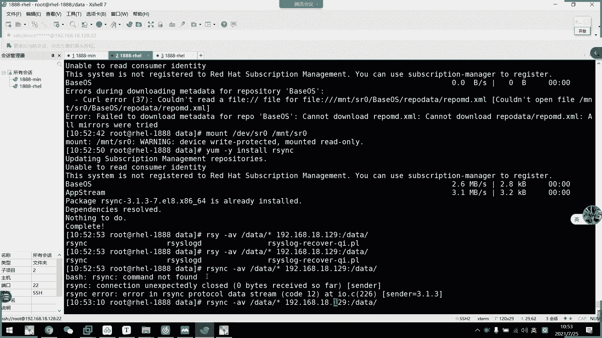
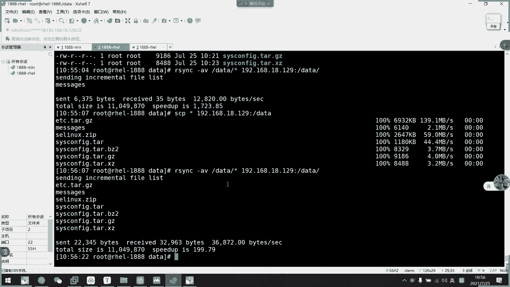
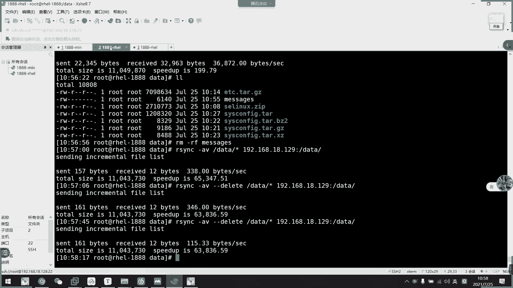
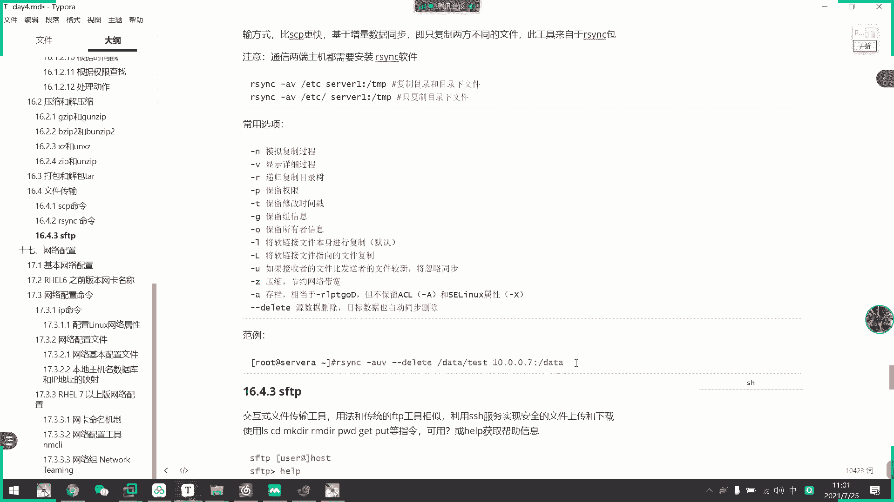
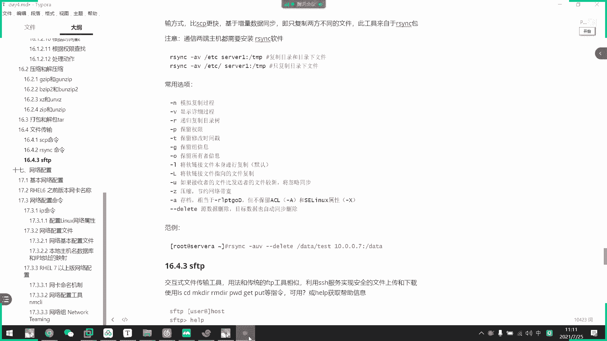

# 2021年7月新版-----RHCE8.2 RH124 RH134 RH294 认证课程 - P30：day6-2 文件传输 - bili_15701050454 - BV1Gy4y1T7ug

好，我们继续上课啊。那我们来看一下接下来的内容，是我们的一个文件传输。我们昨天学了那个。SSH啊，然后我们现在这个文件传输的是基于SSH协议来传输的啊。首先我们有3个有3个，第一个是我们的SCP。这个。

算错了。是我们SV。啊，SP怎么用呢？就SP然后加选项啊。然后跟我们的1个SH是类似的。啊，然后是原文件啊，或者是然然然后是它的一个。保存的目标地址。然后或者是拉呃发送文件也可以啊，发送文件啊。

就是我要发的是什么文件，然后发送到对方哪里啊。尤其是这些。我们一般都不用的一般都不用。可能如果我。SSH的默认端口不是22的话，就要按P来指定啊，按P来指定端口。然后呢，杠Q啊是寂模模式。

什么叫禁模模式啊，就是让它不输出任何内容啊。拉完就算了啊，拉完就说，我们来看一下。

呃，看一下。比如说。呃，我这里现在有这么多内容啊，然后呢啊我想把data下的这些内容啊，比如说呃就这个。包我想拉取到这个服务器上啊，那么怎么做呢？我们就哎SCPSCP啊，然后是。

刚刚说的一个寂寞寂寞模式啊，我们看下寂寞模式，刚Q。

啊，然后是。目标文件啊，192。168。18点128。标了吧。🤧嗯。然后是哪里啊？da塔下的。c o m 你 i住啊正。对，举限。然后保安到哪里啊？比如说我这里直接保存到加目录吧，就当全目录。

OK这就拉过来了，看到没？寂模模式啊。这里就什么都没收到了。那么呃我们看一下不用进文模式啊，比我再拉其他的。关机模式。B意思。你看啊，这里就有它的一个啊拉取的信息啊，反正多少啊，速度啊，用了多少时间啊。

用了多少时间。🤧。然后我们试一下能不能。不交不输入密码。啊，不行。😊，不行。不者输入也不行。那算了，那只能输密码。嗯。少了个路径啊，我刚才是少了个路径。试一下行不行？不行。再说不行。

然了就直接这样子整这样。这速度啊啊然后是百分比。如果它是一个大文件的话呢，我们就比较慢一些。啊，这就是我们SCP的。拉取文件。那么我们来看一下。发送文件。所有。那我们试一下发送文件啊，发送也是一样的。

SCP然后呢是我本地的文件。啊，就把这个套板就把这个套。啊，然后是翻到哪里呢？啊，比如说192点168。18。转问到他哪里去了？嗯，发到他的ca目录下吧。这就发过去了。我来看一下。发过来了，对不对啊。

这个是拉取，还有发送啊，拉取发送。

接下来我们看一下下一个啊，叫做ast。asin这个命令呢。他的用法跟我们的。SCV是类似的类似的，但是它有点不同。后来冇と。他。怎么说呢？利用的是我们的阿信的协议啊，然后呃可以做同步啊。

就是说我这个目录可以跟对方目录作为一个同步啊。🤧然后它的传作传输速度比SCP更快。我们来看一下吧啊我们来看一下。嗯，它的用法类似啊，我们就加一些选项就可以了。

我问一下呃。比如。我这边先那个。啊试一啲特俾老师。然后我先先把这些都不要了啊，说要要也没关系。啊，这些。省一点点吧。他把这些。留一点点就行了。好，然后恶性的。I think。然后是。整个目录。被告。S。

嗯，怎么戳不过去？O sing data stream。

哦。杠A存档。

加一个杠A选项。还是不行。原文件目标路径。

嗯。没下。这个没问题。You。

这哭略同步。不会哦哦哦，哎呀我都没注意到这一行。

有啊。SYNC是我说错了吗？嗯。S， Y，M C。

有这个命令啊，为什么是么饭呢？

嗯，我先发一个文件吧。本地的。发送到。Gsion。Cose。对多，我记得。好像。是要装。试一下是不是对断没有装的问题啊。那还真的是。ok。打了就有了。先删掉，我们一次性把所有都发过来啊。就这个命例啊。

这里就可以看到呃一个过程。就是说呃我们发了什么东西过来。啊，然后这边已经收到啊，然后呢，我们现在在这里。呃。拷贝一个啊新增的一个文件，然后我再。对啊。好，这就增量传输啊增量传输。就说。

对方他呃他发之前会跟对方这个目录啊，就跟我们的目标地址啊，目标目录进行一个对比啊进一个对比。如果我们。

两个目录文件没有什么区别的话，它不会再传输的。但是我现在啊两个目录之间，我现在多了个mess啊，它那么它就只会发送不一样地方啊，不一样的地方啊，比如说我这里只多了message。

所以它后面呢这里只发了一个meage过去啊，这就要增样传输啊，增样传输跟我们SCP不一样。SCP不管你有没有啊，它都会再传一遍啊，再传一遍。

要替换，要会替换掉。我们看一下是不是这样子。诶 c p。然后我们。バ。先。都发过去啊。你看啊，他都会再发一遍的，所以我们会再发发一遍。然我们看一下这里的时间啊。其在这个时间。Yeah。全部都替换一遍了。

所以阿星尔是有一个增量传输的功能，有再发。啊，诶。

啊，由于它的一个原数据已经不一样了，所以他又统一返一遍。我们看一下，你看他把原数据都给同步过去了啊，时间注意时间啊，注意的是时间啊。你看我们阿信的他。

好吧，啊，我们的SCP啊，把它那个时间全改了。然后呢，我们这边用阿C克的话呢，它时间啊是不会变的，就是它的那个啊A啊。

好，那我们继续看啊。那不。呃，如果我在这里啊把这个删除一个文件。那么我这有阿信发过去啊，会有什么情况呢？情况下是他没有做改变啊没有做改变。样啊，他的m依然在啊，他也不会说删了，就是说他不会一样一样同步。

把data这一个跟我们。圆的是一致的。啊，对啊，这是质量变分系列啊。一般来说我们都会建呃几个几个几个几个服务器啊，然后啊通过脚本让它自动同步的啊。啊，然后呢我们这里如果想他们一模一样同步了吗？的话呢。

我们这里要加加一个D。俾啲。对，我们看一下这里的deele呃，那个面有没有被删除，哎，没有删除。

一。Did啲啊。呃，看一下他有。

或了同步没关系啊，这个。你条咪删掉咯。

嗯。😊，比如说删除，然后目标也要删除啊。

诶。神齐。怎么没被动呢？这里怎么没被删呢？嗯。嗯。😊，这个miss什么意思？怎个没被上啊。我再晒你个EPC看一下。嗯。还是没被动哎。还是没被动诶。

为什么？还是没被动。啊，这里刚刚失误啊，就两个主机都要安装阿性。嗯。为什么呢？为什么没有删除了？猴子。不知不知不知不会说这不。有什么数据库？啊，不是不是。语数据删除目标数据也要自动同步删除。

没有没有没有，就开了两台啊。就可以了。线上关的。发过去了。然后这里。等我再删一个。

还是没操作哎。

お。为什么呢？嗯。没有同步删除掉。这里直接说找不到文件了。

哦，我知道了。哎呀不是啊。

有数据删除，没有数据也要自动删除。也不是，比如说我这里。好比一个。loggo。然后这里。我给一个。哇log个 message。以后是。把它打一下吧。对。所以我现在是。再做一个实验。好。

看一下这里的那个有没有被删除。这可没被删除啊。sQ违被删除。这样吧，我把这个心不要了，给他。什鬼那么多东西了吗。还是违背3。为啥呢？啊啊，这就同步了。刚刚由于是文件，不是目录啊。现在对目录。

🎼进行移动的话啊，进行进SCP的话，它就完全同步了啊，它就完全同步了。但是对文件刚是对文件，它指定是里面的文件，而不是目录下的啊，而不是这个目录下的一个同步啊。啊，你看加了迪例以后，这边就有影响了。

看到没有？我再copy一个。再重新科别1个SP过来。总少了一个东西。然后这里好，那么我们现在两个目录是不一样的，对不对？啊，我们两个目录啊，这里只有一个message。

然后这里呢呃有seec message，那我先把这个mes给删掉吧。刚刚的区别是什么了啊？刚刚区别我移动的。是指定的文件，我现在移动的啊是data下的。啊。

目录下的指纹呃指纹件或者是指母录啊啊不一样的啊，两个两个是不一样的。那么我现在先不加迪例过去啊，先不加迪例。啊，你看啊他就会把我们的mage啊呃mage点击一下，它给移过来啊，同步过来啊同步过来。

然后呢，如果我加比例。他就会把两个目录给同步成一一模一样的啊把。把两个目录啊同步程是一模一样。就说如果他多了东西。它就会删除，你看这里说啊dleting the secret。就把那个啊s删除了啊。

他就这这样子它是用啊阿think做同步备份。如果他不能做到两个一模一样的话呢啊，就没什么意义啊啊，就没什么意义啊。所以它直接是对目录进行一个传输啊，对目录进行一个传输啊，但是这里一定要注意啊。

嘎加了一个斜杠跟不加斜杠的区别啊，不加斜杠呢，它是把整个目录给移过去啊，加斜杠的话呢，它是把呃目录下了东西给移过去啊啊，这个要注意啊，这里这个要注意啊。

好，这就是我们的阿心的啊增加重数啊，虽然选呃选项很多，其实啊很多东西都不需要太在意啊。啊，知道这个同步传说就可以了。啊OK然后最后是啊我们的1个FSFTP啊，这个没什么好提的，就是一个。

SFTP。没什么问题的。168。1。129。啊，这样就灵过了。然后L啊L的话呢，这里是看到对方的加目录啊，对方加目录，而不是自己加目录啊。如果是自己的加目录怎么样啊，多加一个L啊。

然当代表是我们的logo，logo就是比D嘛，对不对啊，这是我们的当前目录啊。我们可以看PWD就可以知道我们当前在对方的哪一个目录啊，有没有LWPT啊啊PW。啊，也有啊本地的目录。啊。

然后呢如果要移动呢啊，我们就呃。c啲啊 c啲大啲头。但是要注意，这是移动呃我们的一个对方服务器的dta啊对方服务器的Dta。我们可以。看一下，我们先把这里。自己人逮他。加一个文件吧啊。他这个复役。

那我们现在要那你看诶。L你看因为这是对方的，所以没有没有刚才那个FE啊，然后我们LS。就看那啊我们当前是不一样的，虽然两个都是data，两个都是data，但是我们是不一样的，看到没有？

这才是我们当前的啊当前的，然后他可以操作一些什么命令呢？比如一般SC呃SFTP的话啊都是推拉啊，推拉也是推拉。比如说我要拉取文件，就用get啊，get。呃。这吧CP到。对方的root。

我在对方root这里先创建个文件。到。这里就有一个哎。文件啊。让我们看一下是不是我们IP地址啊。所有的IP例子。然后我们这边拉。呃，我现在是在这里啊，你看马上就会增加一个呃test出来，然后拉取get。

然后是test。这样就拉起来了，拉起来。让我们看一下拉到哪里去，没有指，你看你看就在大桥目录嘛，对不对？那就拉去了。然后。我们在F一里面有追加捡东西吧。ロステ。我令。かはい。呃。弄个 f二就 f二嘛。

OK然后我们LPWD看一下。还在电脑下啊，要我们推的话，用 pushush吧，应该。或许。呃。不复意见。啊，不是不学。拍摄效果。推推文件怎么推？Tui。推。not的话是用get。哦，要 put。

我就不学退。啊，这就推过来，我们还下说有了。那不用啊O了以。这我两个地址。哦哦他有一个。得。

啊，算了，不管啊，可以了啊，这就是我们三个文件传输的。用法三个文件说什用法。FS呃SFTP这个不太常用啊不太常用。呃，然后。阿 think格的话呢是。常用于文件同步啊文件同步。

SCP的话呢啊方便于我们的纯文件啊纯文件。拉取了啊。拉取还有推送。但大家喜欢用哪一个？因呃阿信克也可以一样做到同样的事情。那他可以增开左输啊，而且可以做到一个目录同步啊。那么我们文件传述就说到这里啊。

