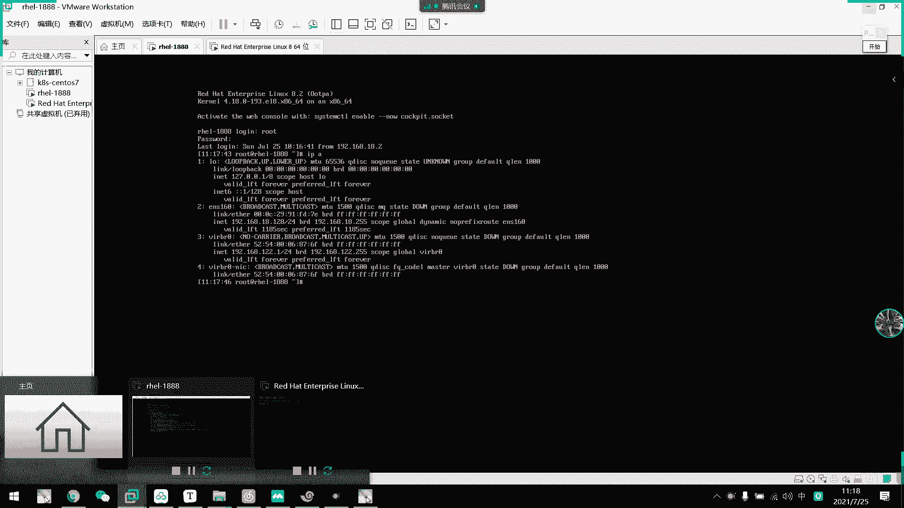
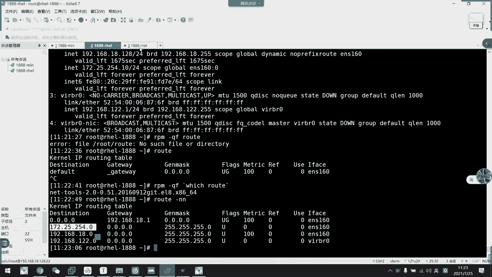
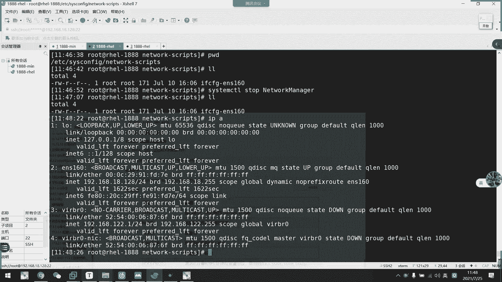
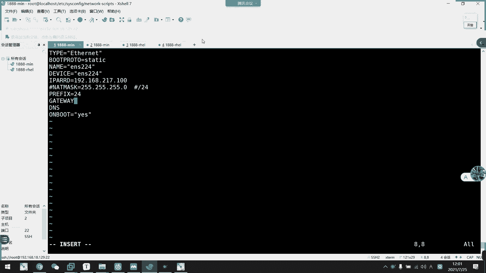

# 2021年7月新版-----RHCE8.2 RH124 RH134 RH294 认证课程 - P31：day6-3 网络配置1配置文件 - bili_15701050454 - BV1Gy4y1T7ug

接下来我们来看一下我们linux系统下的一个网络配置啊，网络配置。然后首先我们来看一下机活的网络配置啊。嗯，我们第一天的时候呢啊就。

学到两个命令啊，一个是IPA。哎，也不是两个密码，所以呃是1个IPA可以看到我们的1个IP是否呃呃我们的网卡是否已经有了链接啊，是否获取了IP啊。

通过我们的FQ呃DHCP是否获得IP然后第二个呢是我们编写对应的配置文件。Cove。呃，然后是来多。要是。这里就是。🎼啊，我们那天呢只检呃只检查了它呃是否开业启动啊。

那么我们今天学习啊一些更加多的东西啊，比如说它每一个选项是什么意义啊，什么意义。

啊。那么我来看一下。呃。我们要接入到网络啊。需要配置网络相关的设置有什么了啊？一个是主机名，一个是我们的IP啊，还有它的一个字板掩码。然后是路由设置默认网关。再者就是我们DS服务器啊。不然不能做解析。

对不对？啊，然后是主主的DS车DS，还有1个第3个DS服务器，我们最多只可以配3个啊。如果超出的话呢，它会呃。把它给撕效掉。啊，然后。这里。啊，我们要注意点，就是说我们没有6。之前版本的一个网卡名称啊。

他们呃那时候网卡的名称命名方式是EETH0，然后加流水啊。第一张网卡，第二个网卡，第三个网卡，这个是啊01234567这样子下去啊，这是以太网啊，然后是PVP。PPIE的一个接口啊，是。

然后他就写PPP然后012这样子流水下去啊，流水下去。好。然后呢，这个是。啊，vivo6的一个网管接口识别名称，命名规则的一个备置文件，我们看一下就可以了，了解一下就可以了。啊。

然后六的查看网卡六个查看网卡啊，还有卸载网卡驱动啊等等，了解一下就行，这个啊。啊，这些都是6啊。给扩展出来的知识。好，然后呢。我们一个网络配置的命令啊，就是我们的IP啊。

它来自于我们的IProot包啊IProot榜。以前的话呢，我们是用呃IP con这个呃不if可不 ifif。

个钉那个啊用这个去看的。他能做的东西我们IP都能做，而且IP能做的事情他不能做啊，所以后面呃我都喜欢。转入大众IP这个命令了啊，都都都会转转换到使用IP这个命令了。就是他能做的事情，我们IP都能做啊。

比如说。呃。if co好像也可以加别名，也可以加路由啊，然后我们IP也可以是加路由加别名的，而且它的那个格式比较简单一点点。

然后我们继续往下看一下。好，我们先看一下这个IP这个命令啊的一些其他东西啊啊，首先是IP加选项，以后是对象啊啊加对象，然后加一些命令，或者是说或者关助啊，或者关助。啊，Oject可以是什么呢？

可以是link，可以是ADDR，可以是root。🎼link的话呢它是加连接，然后AVR是加那个。啊，不是，就查看我们的那个。呃。Devic。然后沃鲁德斯加路友啊。ADDR deviceevice。

然后它还可以。就增加别名啊增加别名。我等一下再看怎么加。然后。呃。M个。link是我们加一呃哦，我知道他他他这个link是。对我们的device这个连接啊进行配置的啊，可以设置它是down或者是up啊。

就是启或者是关啊，这个是什么呢啊？是这里啊，是这里这个档。

啊，还有这个up。啊，就是这里设置的，我们看一下IP。命。

呃，好像少了点东西啊。呃，你们稍等一下。好。呃。IP。Ning。然后是接哪个来着问题的啊，直接s啊，直接 set就行了，直接 set就行了。比如说set。

DNS160。10呃，然后是大。好，这里一关估计就会断完了啊。哪啲啊。断开了我就断开了。追都没有。呃，那么我们就要登录到中端上面，把网络连接开启来。我们来看一下啊。

我们可以注意到我这里是不是显示的大幕啊，大家注意一下，我刚刚把它给下 down了，所以就把它给关掉了啊。那么这个网卡啊就弄不了，但是它获取的IP还是不会变的，它只是关掉了这一个网卡的连接而已啊。呃。

这个都是临时性操作啊呃。没有说什么区别之类的啊，MCLI的话呢，它只是通过命令啊去更改我们的配置文件啊。啊，我们网络的设置有很多个方面啊很多方面的。如果你手上拿着6呃六六七点左右啊，就是说。

它关掉了这个服务，不能用这个NCRI的时候，你怎么配置这个网络啊？

是不是要选？然后我们现在把它开开起来，IP link。6 E M。不能动啊不能动。也关掉了，他虽然有IP啊。你不能动的。就是说他网卡它配置上是获取的IP，但是它连接关掉了啊啊，对啊，连接关掉了。呃。

连回来。I可那个 set。EX16。好，开起来了。然后我们看一下这里拼通了没有啊，你看马上就通了，马上就通了。然我们这边连个。这边不管它要到自动点了。啊，这就连上了。

，然后继续看一下。啊，这个一般都是下令的啊，然后也可以给网卡改名啊，给网卡改名。好，然后是这里啊第2个ADDR。ADR可以给我们网卡一个别名，还有1个IP啊，还有IP我们看一下怎么做啊。

比如说。呃，我们现在两个网卡两个网卡呃。呃，这也是。他们都是属于啊我们这个。虚拟网卡叫什么来着？V8对吧？啊NTP啊呃叫什么lotlot模式那个网卡啊，所以他们设置的网卡是同一个。

就相当于插到同一个交换机，所以他们两两台主机是可以互通的，对不对？那么我们现在啊加一个ba名。A几啊。呃。

我都忘记。

直接啊直接RBD就可以了。比如说我跟接一个不同网络的172。25点。24点。1。直接10吧10吧。然后是24位的24位。然后是。指定 device。EMS1。给一个。然后给他一个别名。

应该是label啊，应该是label。呃，叫做。ENS1600。没错啊。然后我们这里就增加了1个IP啊，增加了个IP，但是它不能应该不能通。这里。W靠。他通的话肯定是这个通啊，他应该不能通。

我们的要92瓦的，我们看一下行不行啊。就这个平铺了。对呀，他是不能通的。啊，全部了图。然后我我们来看一下啊，这里也加一个。呃，别名呃，加一个临时的别人名，还有地址给他。这里改成11的。好。

然后我们再拼一下，看下同不痛。马上就脱了。买个套。然我们看一下它的路由啊。我去。那路由是来自哪个包？Letus啊。而且我看这里录由也可以了。反这都有。呃。啊，这里可以注意到我们多了1个254路由。啊。

然后他也是从我们这个网关出去了啊，也从我们这个网关出去了。所以呢啊它就相当于也是一个辣的。从这个网关出去以后呢，然后我们两个网关是相同的嘛，对不对？我们是相同的嘛，所以他们两个之间啊。可以沟通啊。

就说我不是192。168这个网络，他依然能沟通啊。啊 ok。

嗯。基本上就这些它还可以加路由啊。可以加入用。然后网络这里还有很多东西要可以可以扩展的，大家可以了解一下，一个是group啊，一个是。

g，我们注意到这里。group大家可以去看一下这个。아짜 그런 가죠。咋没有了。诶，怎么啊这里啊gbal全局。啊，这个大家可以上网去搜一下这个group啊，它是。它的作IP作用不是在于这个网卡。

它是全局性的啊，是算网卡啊，都都都都可以作用的。所以。啊，我刚刚这个为什么能懂。啊，也是gbal的一个作用啊。

他可以说一下他的原理，到底是为什么？我网络学的不好，所以我也不知道我忘记了，不是学的不，我是忘记了啊，大家不要说出去啊，知道吗？

好。呃，然后呢，我们刚刚做的一些操作都是临时性的，我们一重启。估计他就没有了。一从他那个别名啊，还还有一个。

呃，这东西都没有啊。这个往往下看一下。呃，这个跟IE没关系啊，这个跟IE没关系啊，这是系统网络的，是它系统的内核的一些东西。我下在讲。

我看一下机器开启了没有，开启来了，叫我们来看一下I边。呀刚刚说的。边命已经没有了。他别名一般用于干什么，就用于测试我们这些网络通不通啊，如果呃。呃。也可以创建一个。呃。怎么说，就是利用这个别名。

还有IP来指定一些呃范围内的主机，让他们智能通信啊，虽然它不会保存起来，但是我们可以写写号脚本下，可以写到我们的一个开机运行的脚本下就可以了啊。比如说我们的1个HC啊，或者是呃pro点D啊，写要里面去。

或者是呃。以前的用法都写在我们的那个叫什么来着？看一下我是FC。系统低下的那个温。什么local local你啊RC点D啊RC点D啊。好。就那个，然后我们先休息一下，先休息一下，然后再。

继续。呃，那么我们刚才就讲了一些呃IP这个命令，它一个相关的用法。除了查我们的IP地址啊，还可以做一些呃标名处理啊，或者是对我们的一些广播地址处理啊。嗯，还有它的一个是否启用啊，关闭啊等等啊。

还有一个路由。设置等等，这样但这些都是临时的。拍这后这零是啊，然后呢我们想要做一些永久配置啊，怎么做呢？我们就要。第种方式就相关于我们的一个网络的配置文件，网络配送文件。好。

网络的配置文件呢啊有我们的IP相关的啊，有我们的let mask相关的，有路由相关的啊，不不啊网关相关的，还有DNS啊解析相关的啊。就说它的一个存放路径是什么呢？啊？

默认的存放路径呢是在我们ETC啊SY下面的一个level scripts啊下的文件啊，他们开头一般都是IFCFG开头的啊，我们可以看一下。

我来看一下呃。我现在还有别名吗？我记得我加个别名的。有没有。CBS。先，然后我们就到了这个目录了，PWD看一下。我现在就这啊，跟他说的那个路径下啊，levevo script啊。然后呢。

那么这里可以看到我当前只有一个配置文件啊，我当前只有一个配置文件。那么我们现在先。这个关掉啊。懂。呃。🎼来，我问你去，先把这个关掉。好，所以我就关掉了，然后我们在这里。新增一张网卡。

新增一张网卡啊，我用金手机模式的吧，啊，不对。这不叫真吗，这是凯。我唔先等于再玩卡。不是不行。

呃，我这边就用计融机模式了。

嗯。我改一下东西对。进主机模式呃，有没有开电视频？我现在把D视P关掉啊，然后它的网段是217啊，217。这个就不改了，随随意他不要去。我连回来没有啊，看一下。哎有。

有毒啊。What。

27。然后我现在新增了一个网卡。🤧咳。下网卡以后呢，我们看一下这里有没有多配置件啊，发现啊是没有的。然后我们通过IPA看一下有没有多一个网卡。也是没有的啊也是没有的。呃。那么我们现在。

确认不到他的名字哎。啊，确认不到他的deice。嗯，新增的个网卡怎么确认它的dice？

确认不到他device就栏搞了嗯。

AL这个min你已经用不了了。Its wrong。诶，M托也是这个ele manager项目的。到。两。这不是一个ta吗。说什么了？Studs。现在是运行中啊。他挂了这个就印这个。嗯。

那我们怎么去确认它的dice呢？不用翻我的话。呃不用不用嗯呃。你会咩你着。他通常这里应该会新增一个网卡才对啊。美升件美新件。他一般如果有这个。呃。啊，因为有这个的话，它会自动创建一个链接啊。

可能它配置文件不一定是跟我们的。不一定是跟我们这里是一样的。那么我呃这边就顺便讲，我现在网卡，然后我们用我们的NCLI这个命令啊，可以啊弄一个。Devicice。Studs。好。

那么这里可以看到我们新增网卡，它刚才没有连接过来哦，我知道了。诶，连接那个。你知你啊。那重新获取一下看看。还是我加错了。好好怕，为什么？啊，然后另一个clash show是查看连接的啊。呃，连接。正常。

然后我们获取不了那个网卡。也要重启一下才行呢。那我玩个防火枪规则，玩到他连不回来怎么办？啊，重启也不行。哦。原来我刚刚重启错了机器啊啊，我加错机器了，这个是我命。是我的命令。有毒啊。😊，原来一直搞错了。

呃。哦，这边清楚规则，看一下能连回来没有啊，你他妈这就不连来啊，原来是我一直搞错了啊。按老师的过。怎么台式机柜。被告是什么？稍等我一下，耳机它被断开了。嗯，原来我一直做错了机器啊。对不起对不起。

各位兄弟。各位同学。好，那么我们现在啊这个既然是加在这里连回来了，我们就看这里吧。OK你看他现在就多了一张网卡叫做USS24。但是他获取了1个DUCP地址。

我不是把DHCP关掉了吗？关掉了呀。

对随B。그서还波地震。不管他，我们先把它。的一个。连接给以关掉啊。还是刚才那个命令啊tus啊。先看一下啊，你看它24目前是没有做连接的啊。是没有权文件。

其实它这里它这里显示它并没有获有IP要它连接的配置文件是这一个啊这一个。啊，我们可以通过cash，你看我们外t可以看到我们的设备啊。呃，设备的话呢是我们的一个物理网卡，然后有呃安装驱动以后呢。

它引射过来的一个。文件啊就是我们的一个好好像磁盘一样的一个快文件。好，然后collashction是一个链接啊，这个链接就是说通过配置文件链接到我们device上面，然后。他配成功了就会获得网络啊。

那我们现在看一下collection啊，呃就NNUI collectionction。shop啊啊，不是啊 shop shop shop哪觉这里一样是款了，它装不上啊。你看然后呢这里有一个。呃。

We了 condition然后。我先那个。我写个别命啊。Yes。然后是。C啲 n。TD到ETCSSCOLFIG。下的量。我。Yes。不是关。C。いきです。啊，然我们看一下这里啊，你看。

他在等待着我们这一个配置文件的生成啊。由于我把那个电视机给关掉，所以他获取不了这个。然后我们现在把这个删掉啊。怎么做了？给个孙。到。啊他们的这个名字是这个。哎错了。因为他没有连上。啊，已经没有了。

被单掉了被单掉了。然后我们看一下dice啊。好，可以啊，他现在就没有它对应的一个链接文件啊，没有对应的一个链接文件。然后我们现在要干嘛呢？

可以有两种方式啊，那么我们先用第一种方式啊，因为要讲的话，我们先用第一种方式啊，第一种方式叫做啊。用配置文件来定义我们的一个网卡定义我们的一个网卡配置啊。

低我们的一个链接啊，比如说我现在嗯在这个目录嘛，叫我们把这个拷贝一份啊。就按照他的网卡名来做吧。叫224对吧？224。我么写一个啊。224。🎼然后呢，这里这些信息啊，我们IPV6的不管。有于有些不管。

主要是RBVC。这个其实也没有。就留一些有用。如ID可以要也可以不要啊，但是。UID的话呢，它就可以强制绑定我们的dice啊，通过我们diceUID去绑定。但是现在这个入入ID是我们的呃第一张网卡的。

所以它在这里会有冲突啊。啊，然后。抽不到啥都抽不多。

啊，我不要。啊，你看有用的就有这么点东西啊，我们先看这里，虽然是type太。是选着我们接口类型啊。啊，如果它是物理链接，in特网，就我们写internet啊。如果是做网桥的，我们写brireze的呃。

然后如果是无线的s Ram啊啊，那样子就可以了啊re量。

啊，然后这里太晚了，是英天网，我们就不需要改了啊，然后是bo potatoto呃。

或者playto啊，它这个是我们的一个获取地址的一个配个协议啊，就相当于是怎么获获取地址啊。首先要电子CP动态获取嘛。啊，对不对？然后stateate跟那个是我们进代过去，然后是proTV啊是。

啊这个我不知道我没用过。那你们知道吗？不T。不皮。报走的话，你也跟引导有关的，跟引导有关的。呃，我们一般用都是这三个可以那个写啊，这是静态的意思啊，静态的意思要电CPU动态获取。

好，那我们这边由于我把DHCP关掉了，所以我们要写静态啊。双一号可以不要啊。St。OK然是我的呃令的令的话呢，就是我们一个浪也是金他的意思啊，就是金他的意思。

就说它呃不会自动获取嘛。

那的话一般都是我没有的意思没有的意思。然后这里那的话是我们的一个colleion link啊， collectionion link啊，我们这里也改成224啊。要迪Y令就是我们的那个收益名称啊。

收益名称就是我们刚才看到的。通过我们。呃NSUI device。So呃谁就啥。STAT的是吧，这个看到了。dice这个就是我们的设备名称。所以我们可以不通过UID直接通过设备名称过去连接啊。

拖拖这个去联系就可以了。啊，放到这里。🎼好，然后这里呢呃基本上一些网卡的属性就好了。然后我们增加一些啊网络的配置啊，增加一些网络配置。刚刚说的啊，网络啊主要是1个IP对不对？

然后是我们的网关getaway。对不对？啊，然后有1个DNX。啊。那么我们看一下啊IP相关的配置是什么呢？IP相关的配置啊，IP相关的位置嗯，在这里啊IPAADDR我们写IPADDR啊。

然后是指明我们IP地址。由于我这里是静态的，所以我要手动的去写1个IP地址给他。

说的案例。IPADDR啊，注意啊，我们配置的这个名称啊，这个这个纸。啊，这个键啊这个键啊都是大写啊都是大写。然后我们这里给个地址。呃，要9。2。168。点127。217吧，对吧？是217还是217啊？

27还是217。

看看啊。你们有记得吗？

那我是不记得，因没有记得217啊？是我没记错啊，那么给他一个1版吧。然后。呃，我们定义支网年满呢有两种方式啊，一个是let。Musask。等于24啊，不不，等于255。255。25。这个是相当于什么呢？

啊，是不是我们的2手4啊？然后还有一个BRE。Perface。等于直接写2字就可以了。我看一下有没有写错post。看看啊，看下。

有没有说啊没有PREFIX free啊，这是我们ID的位数啊，这是我们主文密码，就是这里是一样的啊，可以呃两种方式写啊，直接选进组就可以了，直接选一组就可以了啊呃。

不记得那个大车的直接就用啊不了这个单车，就用net mask的。如果不记得leax就行，消费这个。🎼下下面那个就方便一点喽，写少一点了啊，这样子定定阅它的一个我的IP地址。好。

那么我们IP这里就定完了啊，然后就是我的网关啊，网关看一下啊，你看直接是get没。

Get way。什吧，那么我的网关。哇真未啲啊。可以不要。我们型主机模式不需要外网，所以它可以不用网关可以不用网关。那么DS更加没意义了。对不对？呃，那这样做没什么意义。我还是。把这个网卡改一下吧。

还是把这个网卡改一下吧，因为。这样做意义不大意义不大。还是给辣辣吧。

你们没有看到网关的话，也不知道他有没有能出出去的网络啊DS加起来也没什么用啊，对不对？

解就诶。

所直接把我们的辣的。DHP关掉啊。

🎼你们学到这里也可以把它给关掉了。DCP是给新手用的啊，是给第一天什么都不会的用，你们用的。好，这样子把它关掉啊。好，那么我们继续写啊，那我这里就可以用回一8网络了。对不对？也是给100吧好，就这样吧。

好要，我们给个geaway。8。嘅。喂啊，滚关。嗯，我就写原来的哎。看了点呀。说292点168点18。点一压啊。好，然后说DSDS可以写三个，我们是012啊，对啊是012。啊，DS的话。

我们看一下可长也是一样的。

啊，这些是啊DS12啊012。而不是123啊，我们。如果有多个DS地址的话，就写DS1DS2这样子就可以了。也不要写太多。嗯。

那我这边就只写。我看一下是不是012吧，看一下。好，然后这里op不啊是否开机启动啊，是否开机启动。让我们看一下还有什么其他重要的配答，其实没什么了，其实没什么了。

啊，我们最基本的最基本的一个。配置就是这样子。啊，已经够用了，不是说基本上也是够用了。其他东西我们都不需要太关注。啊，什么这么主主机不管整，然后自动搜索域名后缀啊，这个要有DS才可以。

有我们的1个对应DS的服务器啊才可以。要普通用户能不能更改，能不能更改啊这些。呃，然后这个是lemanage的一个解起啊，就开步开启啊，另 managerage去配置这个东西啊。

就通过命令行方式去配置啊，所以我们网络配置，其实这些就足够了啊，这些就足够了，这些就足够了。

啊，如果这也是DHCP的话，就更简单，连这些都不用了，这些都不用了，对不对？好，那我们就啊准退出。然后。小爱。哎呀，怎么又来个。不是可选一呀。那里来的？And shall I。Devicice。本来说。

Yes。呃。现获取不了。哎处蚊咗我干嘛？送个黑娃娃。嗯。哇老出党开。获得不了ID。不把能是断开吗，看一下是不是。美多。所干嘛屏幕开咧。哥哥。呃，对。都说不了东西。这里有问题了。卡斯。卡实的。提议。

US status。我现在是把它给断开了。给他说。到了。他怎么自动连过去了？为我没有这个黑置文件？不。哦，这个解房啊。他找不到这个配置吗？两边连不上，找不到这个配置。因为找不到这个位置的。嗯。哦。

哇超 we low 啦。on we漏你就连过去那个了。看一下他连的是哪一个。Dbus achi pass。嗯。嗯，好卡啊，突然节。读不了。这个不了。嗯。嗯。我是建了个名字啊，ENS224啊。

IPADDR没问题啊。对这掉哦。AR d啊。真的是。刚是ARD对吧？呃。那不要盖的是连上的。啊，你看有了有有地址了啊，有地址。他估计刚才是连上了，但是一直获取不了IP。都有个。那为什么？哦哦。

现在是160，它没有了IP啊，因为它本来是DHCP啊。那，你们怎么不早点提示提示我？我那个。やし出てきて。19。点168。18。128。这个是19。然后这里是。Gateaway。第一。好小这个字。这是。

表示get away。192。168。18。DAS。给16。点18。对。以漏的。啊，记得我们写完这个要重新下载一下这个配置文件啊。然后MCI collection upE160。离不开这个命令啊。

那么我们这边应该可以看到它。呃。啊，明白来了，那我们这边应该可以看到它的一个。呃，collection应该是正常的啊，我们看一下是不是啊。觉来说瘦。

你看它 link啊就是按照我们刚才在配置文件上面定义的那个link啊，创建了一个先链出来啊，然后这里是dice啊，也是我们在配置文件上面指定的dice。然后它啊连接以后自动获取到UID。

所以我们不需要去做一个强绑定了。而且我不连的话，也不知道那个底外设UID是多少。啊，然后我们再看一下。DY是。啊，看他就站在连上了啊，站在连上。OK啊，这是我们通过呃配置文件来更改我们的一个。

完了。

信息啊玩下信息。嗯。我们这个人呃呃呃呃那个设定一个主机啊，让设定一个主机。呃。我现。

应该没什么问题了。O那么。😊，哦，我这里又讲了一个配置文件的一个相关信息。然后呢。呃，我们看一下V7以上的，就之前的是版本的是网络配置啊。啊，首先是我们vivo6之前呢，它刚刚说过了。

它是流水是EH0123这样子下来。然后vivo7的话呢，是基于我们的硬件来拓命名的啊。然后到我们vi8，连那个lework service都弃用了啊，改改用我们的现在刚刚那个leve manager。

啊，然后有很多同学都已经遇到过那个那方妹的觉得坑了，是不是啊，有我们的李浩同学帮我们来解决。好。啊，所以他的一个他们他们他们他们的一个命名的东西啊，是基于的服务，还有基于的硬件不一样。

导致他们命名机制不同。啊，我们看一下V期啊，V7在。7。3版本以前啊，它那个命名规则是怎么样的啊，它直接是啊什么ENOE，然后19什么什么一大串的，大概有9个数字啊，大家有没有遇到过这种网卡？啊。

有没有约到过？啊那个。G的方式就比较比较那个啊，就证明你没有玩过7。2版本。好，然后呃。咽欧1234啊，他应该要改改过那个流水了。啊，然后是我们的一个。另一种啊ENS一开头的啊。啊。

然后是按照你刚刚说的一个呃硬件接口的物理位置可用信息啊，也可能是出现了1个EMP2S0啊这样子。还有一种是ENX。啊，以markac地址来进行命名的。然后如果他算作都不可用的话。

它就会有我们的一个传统命名机制。啊，但是。注意点就是什么呢啊？我们六的话呢。去。六的话。诶。哎说了不。啊，六的话呢我们。啊，都是采用我们ETHDETHD。啊，就六以前6以前都是这样子。包括六也是啊。

然后呢我们就会遇到什么情况呢？我一个机房啊一个机房。有一批老的服务器都是用vi6的啊，圣斗16啊，渗透16吧。C you。CEFTOS啊摄头是6。然后呢，我新进一个一批主机啊，它有渗斗7。啊。

也有深度是吧。那么他们之间的一个命运规则是不是不一样啊啊，他们之间的命运规则就会变成不一样。不一样的话呢，会导有什么问题呢？啊，比如我们这里是一个集群，集群的话呢。

它有可能要对我们的一个网卡需要对我们的网卡需要做对应的一些设置，啊，就一些统统一归管理啊，统一管理啊，又比如是我们的一个后面学到如果用ensible来统一处理我们的一。的一个。呃，网卡。

那么按照它名字不一样的话，我们就不好批量处理，对不对？所以呢我们一般都会以最老的方式来给他们统一命名啊，啊就是说要把它们改成成ETH0啊，然后流水下来。怎么改呢？这个啊老师这里有一个方式啊啊。

就通过改它一个内核的一个启动顺序就可以了啊，那个啊不在它内核启动的时候的一个变量改一下就可以了啊，我们看一下啊，这个也不难。

我们看一下怎么改。但是我这里一改的话，我的迪Y词又要改。啊，这个看到啊，改这一行啊改这一行。啊，这里就是我们的一个战略规则而已啊，这个价略规则啊L然然后加上我们的根录点。

加在我们的s。🎼然后在最后应该是在最后加。

Yeah。加一个叫做呃let if link啊。有时候有些然后是bs。It was那。啊，这样子他就可以按流水下来了。

算了是隐睡觉吧。加到哪里去了？啊。就加一个let if links啊，然后b links。Ming。啊，然后把它退出，然后make configure。A周吧。M k。好ay。Okay group。

什么 mini啊不。

哦，可比 girl应该是。groupl2啊，真的group2。

Group。叫OUB吧，就UB。哦。MK home。啊，然后是。指定刚刚那那个bot下的。不是呃。吓得over靠。啊，回者，然后他这里就把我们刚才做的那个鞋入进去就可以了。

So的。

哎，gg啊，没错啊啊，少了个干O哎哎，少了个。没谁又进去啊，没谁又进去。哎，我我。靠谱的嗯用。主是比较旧的应该。然后呢，我们重庆。抽级后可能就网络不行了，因为我们迪外森人已经改变了。

Yeah that's a big problem。所以我们开启以后呢，还要改这个东西。有解咗个东西。

看下啊，第一次开好了。Yeah。就改到。我们现在这里。啊，就是EEH0啊ETH1啊EH啊EH0。那么现在没有玩过，要改一下这里。我们看一下DY stay6看看。名字已经改了。那我们改一下这里就可以了。

CDM。Yeah，嗯，这里改成了。第外。呃，clos link改一下。一TH啊，然后底挂式链也改一下。Do 와。Okay。你提选啊然后先发个对图啊。就是说给他说。原到吧。SLI。也说啊。第一T也去。啊。

先起一个，等我连回来再说。那就连上了对。那就。更好看。好像是。CDF。识别。把这个名字也改一下吧。感从我们的。E t h。这个也改一下吧。224感觉我们的一天。写他。一本。反正。看自己公司里面的一个。

网卡命名规则需要吧。啊，这个有没有强制就。呃，额外提一下这个东西而已。你别去。啊，应该可有。等下。行两个连接啊，已经正常使入了啊。O我们看一下是不是这样使用呢。已经佢另外啦，对对？而且我的流水已经改了。

上个吧练习不需要改，然后是如果是工作中有要求，有统一管理的话，建议大家还是把改成统一管理的啊。

ok，有。🤧嗯。啊，网法组成。刚刚说了啊1个EMS是什么呢？EM开头是一个有线局域网，然后WL啊是我们的未来无线主局域网啊，然后是WW是无线管域网。啊，然后O啊就是说我们刚刚的1个ENO啊。

什么EMP啊ENS的，它这里都有一义的，是集成设备的一个缩引号。一个S的话是扩展槽的索引号啊，X是我们基于max地址命名啊，然后是P啊，就是呃。我们的bus走线加我们的一个slot啊。啊。

就是快两条这个啊就加起来了。好。然后这个工具的话，我们下午再说吧，晚上我就讲到这里吧。晚稍微讲到这里啊，工具的快速我再讲迷你行工具。因为只有5分钟也加播完。O我们下午继续啊。先下载。总线啊？

这个跟你说也很难说，我也不懂这硬件的东西。

我第bu。