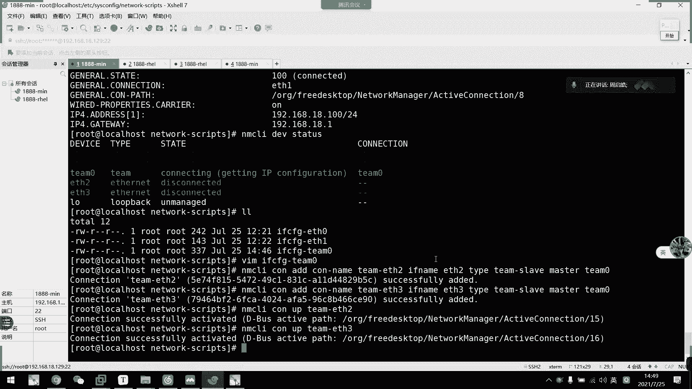

# 2021年7月新版-----RHCE8.2 RH124 RH134 RH294 认证课程 - P32：day6-4 命令行配置网络以及team配置 - bili_15701050454 - BV1Gy4y1T7ug

啊。那。还是有同学已经就位了啊。三个吗？啊，我感了我看到亏以有40多个人，我且群上面都没有反馈啊。好，那我们先回顾一下上午的内容啊。好，上午呃三个重点啊，一个是。Frid。呃。搜索处理。So。处理。啊。

首先是f。加。一个type啊。不要挑叫条件吧，加个条件。好，搜索出来的。嗯，然后我们通过EXEC。传送，然后过去处理怎慢。好，可慢以后呢，中括号好，然后这里。最后一个分号解锁。啊，这以它的规应格式啊啊。

首先是我们的一个comman。啊，只。呃，是一个命令啊。指命率，然后中括号不夸括号指的是。Friry。得到的。目录括文件啊。好，然后。固定的结束格式。O这是我们fry的一个自处理。好。

然后是我们的一个压缩。和。打包啊。啊，不对哦，还有一个啊。呃，传输。工具。我们有一3个啊，一个是SCP。SP然后它的格式是SCP。这样吧，来。那。是我们的。写在块里面吧，那。就是SCV。啊，然后是。

User at hot。冒号。路径啊，然后是我们的。啊。要放到哪里？接着是推。SV啊。So。硕士啊，然后放到我们的。Useer host。的一个desk pace。这是我们SCP啊。第二个工具啊叫做。

啊先。IC还要增。增量传输。先写它的一个方式啊，跟这个也是一样的。that's why M C。That's whatMC啊。那要注意啊。需要。我方和。对翻机器。都。机器都已安装。啊 think。

啊老师早上就出了这个问题了。然后阿think他。支持增量。我书。真正陈述的意思是什么呢呃？经过。A think。判断。双方目录。文件。区别。如果。发现有相同的。文件则。不在。投诉？发出不同的文件。

然后是刚刚给练的。DLDT啊。如果。目的。路径啊。存在。呃，原路径。没有的文件是。刚刚。后。汇报。呃。目的路径。多了。以。原目镜。多了的。文这删。Yuan。好，第三个是SFTP的。啊，这个就不到家了。

上回去把L是压缩和打包。呃。要说打包要说具有我们的G也是IP。分解一下累吧。GECIP。然后是我们的BJtwo哎。包纸皮啊。一。这是IP2。这个是我们的叉Z。嗯。然后GCIP它的一个。用法就具体是IP。

加选项。o p i o m。我信。然后是饭。注意下事花了啊。BECIP2啊加选项。有什么选项的话呢，自己回去看哈。我这边就不重新把他们加一个。解压的了，不想解压了。因为有个学校可以解压的。面啲。不来。

然后呢。啊。压缩。打包。根据。会有一次IP啊，我们一次IP又加个代R。可以。打包。压缩。有后打包工具。他。他。嗯。他，然后。说了。唔该谢。常用选项。首先我们一个C啊。创建。打包。た。呃，解开好。

就解报的意思。re就。查看。详细信息。给多少吧。好，F。是。我档文件。啊。是。叫追加。可追啊。你要说。的包。不可以追加。查唔多。就这个啊，然后。如果加压缩。打包。打包加。你要说。嗯。

有我们的ex啊是GexIP格式的，然后然后是小Z，小Z是BZwo。然后是大金啊，是我们的叉C。🤧咳。然后杠大C啊。配置。对，指定。解压的。OK这是我们的。特个工转。Her。

然后是我们的一个网络配置啊网络配置。这是我的IP命令。呃，我们常用的。查看。IP。设备。呃，被子。IPADDR show。然后。增加。呃，IP别名。这叫设备。联名。以知。此配置。

是我们的IPAADDRad。嗯。IP地址加。Pface。嗯。我络地址素。啊，然后是指定deevice啊。Y，然后是。网卡的US。然后是 labelbel。加我们的一个别名。呃。删除。删除就是。

把这个艾改成滴钉就可以了。有了。配置连接是否启用？我们可以用IP。你。Saad。呃，我们的。Deice。对外的，然后是到了。是 down或者是C up。再加Dy。诶，不对哦。

这 device up down就对啊。ok。啊，这是我IP命令啊。呃。然后是网卡。配置文件的。编死的。通过编辑。配置文件。平置？好。路径。是我们ETC下的。和fi啊，然后是leg。我。不是。S。

 IFCF。去干叉叉叉叉叉。好。然后这文件里面的。相关的。主要配置啊。首先是我们的太。网络。物理网络类型。呃，然后是那。连接名称。然后是底外塞。设备。名称。Ft。Pro。推头。Pook。

Both 보有 be 좋아下。系咪道。Both。比较好跳啊继续做啊。有。嗯。IP的获取方式啊。嗯。表示IPAADDR。A啊。指定IP地址。然后是我们的。来。ます。指定。1万连吗。Perfect。指定。

网络。ごし。就相当于是昨晚一晚的位数啊。这里加个备注。嗯。P。Free。和。マスク。只写。其中。好，然后是啥说啊？网关啊。可以做广告。后是DNS1。不是。DX2。配置电。S服务起来。最后一个是opbo。

退置。是否开机启动？OK这就是我们一个网卡的一个基本配置信息啊，基本配置信息啊，其他基本上都用不到的啊，除非是在特殊情况下。

就是说他物理的情况下，需要绑定我们的一个呃。

呃，max地址markax地址啊，或者是使用UID去连接啊这些。切好啊。啊， ok。这些都是我们网卡培训文件。然后呢啊这里。有一个。呃，要提一下啊，就这里可以写一个本地解析啊。

相当于是我们windows里面的一个hosice文件啊，它可以手动添加解析啊，比如说。

呃。怎么。我先把这个网卡配一下啊，等一下可能要用上。刚好当复习了，好不好？我 is。see theF。又有一。其日都话。再改一下。对。18对118。然后是。嗯。网吧地址对。DN个。应该嘅。

我们看一下他能连上没有啊，可以连到了。

好。

先等一下啊，然后我们看一下这个解析啊啊比如说呃我们这里。写一下这个配置文件。啊，我们先拼一个地址啊，拼一个没有的地址啊，比如说。呃，就叫。ミニ点。Reamp。别看啊呀目前是没有第个这个地址，对不对？

然后我们写首中写一个解析啊，poss它格的是什么呢？先给IP地址。129对吧。然后是写mini对第em。也可以给他一个主金名。迷你这这的。好，然后我们就可以听通了啊。直接出来了。

然后就可以解析到我们的129到这个本地解析来了。呃，这个蜜也可以啊。

可以啊。那么我们接下来。接下来要做的是什么啊啊网卡名称，这里啊只是一个题外跨来的自己看，我这边就不可以雇了啊，这边就不不可雇了。然后接下来我们就看我们的一个网络配置工具NSUI啊NLI。

SLI这个是我们啊依赖于我们这个level manager啊这一个服务应用的。啊，这个服务呢是可以管理或呃接控我们的一个网络设置的一个务进程。好，然后LUI的一些相关的术语啊啊。

然后设备就是我们的一个网络接口，就是我们device啊，然后连接呢就是它的配置文件是我们的collection啊 collectionle。然后一个网络接口可以有多个配置文件。

但是同呃同时一个collection呢只只有一个collection可以生效，它不可能生效多个啊。就是说呃好像抢凳子一样啊，我这里是collection一。Celection2。佢十山。

然后他们指向的都是这个d外。啊，头子上都是这个wi啊。那么他们只有一个人能做上去啊，只有一个人都能做上去。如果他呃连连错了，我们只能手动更改啊，只能手动更改，手动指定啊。希望大家可以明白这个道理啊。好。

然后它的命令格式就是我们那个XOI，然后加选项啊，然后加对象加命令就可以了啊。然后呢，最常用的查看啊。我们早上都看过了，一个是NHLI deviceice show啊 deviceices啊啊。

一个是我们的NHLI collection。ca可以有star啊 store啊啊我们一般都是用大 up的。啊，然后还可以管理我们的一个manager。呃。

查看的话呢就SRI deviceice status啊，售也可以，但是瘦的话它会列出所有的设备啊，列出所有的设备。还有它的详细信息，好像我们windows一样的，它售是呃不对。

so的话是类似于这个。啊它是类似于这样子的啊，等用stial show啊，类似于这个样子啊，类似于这个样子。我们可以看一下。

对整写。但有历史越哪噶。啊，网卡信息啊，然后那些原传这些内容啊都会列出来。然后t了。嗯。喂。啊，的课看这个主要看的是它一个连接情况啊，是这个设备连的是哪一个配置文件啊，colction文件。呃。

但是这个不是我们可以选的文件名啊，它是在配置文件里面定义的那个 link啊。我们刚刚说到了啊，刚刚说到了是这个那个是这个类的啊连接名称，可以选那。

那我们啊就简单的了解一下怎么查这个配置是否有连接啊，是否连接。

即系。紧接着呢。这是我们1个SOY的一个简单查看的。关众。然后。修改我们等一下再。说啊。当我们手动修改配置文件以后呢，我们要用我们那个MUI collection re啊去重新加载配置文件。

然后再重新开启这一个连接。如果是以前的方法的话，我们修改完配置文件啊是要重启服务器才能加载的。啊，我们可以利用这个NLI重新加载配置文件就可以了啊。然后呢。

我们早上说的啊是通过修改配置文件来配置我们的网络连接啊，那我们下午就可以通过MSI这个命令啊，通过命令行的方式来配置我们的。备注我们的网络啊。

那么我现在啊跟早上一样，先在这里。添加个网卡。用另一台机器啊。

添加一个网卡。Theres a lot of。

啊，他现在已经加起来了。由于我们。啊，没开启。因为我们没开启。啊，那个点HCP，所以它不会自动创建这个配置文件的，也不会创建这个链接的啊。那么我们也看到这里有个ESRS。

然后我们现在就通过命令函来给他添加配置文件啊。大家不记得这个命令没关系啊这个命令没关系啊，可以直接啊像我们早上一样拷贝一个配置呃连接过去，然后再通过命令它修改也可以啊。

或者是直接修改配置文件来修改也可以啊。我们现在L。大看啊它配置文件是没有生成的那我我们现在用SLI这个命令来创建一下，叫 collectionion。选，然后呢呃是if link啊。

if link是我们的 collectionlash名称啊，那我这里直接叫ENS224啊。然后是con那啊。喝那个。🎼好的，也不能是我们设备名称，也不认是我们设备框里才是我们连接名啊。

我们一般来说这两个名称就让它改成一样就可以了。啊，然后是太。啊，t然后是interinter。我有没有评错？你TH去吧。啊，应该是频错了啊，他忘记也不要紧，那里输入以后呢啊，你看他说这个类型没有。

然后他会列出所有出来，忘记不会记。是interETHERNETR。啊，这样子啊，你看他说呃collection。ES24这一个已经成功添加了。然后我们现在看一下。它要自动创建一个备置文件出来。啊。

我看一下这个配种价。啊，可以下飞同学啊，他该有的配置都有啊，该有的配置都有呃，但是这里。它还是需要改一下啊，那么我们也不需要修改配置文件。然后接下来我们就通过病例行去修改。首先是NLI。

那么我们修改连接就是修改配置文件嘛啊，修改配置文件就相当于是我们的连接嘛。所以我们用collection啊collection。啊，这是简写啊啊，写全的话是colction啊，可以简写啊可以剪写。

N I collection。冇地快啊。然后是指向我们的设备名称啊，好不连接名称。呃是啊。然后是给你们双击我看一下，能用什么啊。嗯。啊，能做很多东西。那么我们现在改IP了，那么就与IP是相关，对不对？

IPP是相关。啊，其他的话现在很少用到啊课程上，这课程上用不上啊。所以我们这边直接使1个IPV4啊。不知道是因为我们不知道到底是IP4还是IPV4啊啊，或者是IP啊，或者是IP6。

所以我们直接输个IPP4，然后推不出来啊，你看它会有一个点啊，然后我们看一下能做什么东西啊。啊，你看这里呃ADR address就是配置IP啊配置IP。然后呃DNS的话是配置DNS。

这是DS的选项之类的啊，然后路由也可以设置，嗯，还有网关啊网关。然后呢我们。配置一个网络，主要是配置IP。啊，然后是配置它的DNS，配套的网关。还有它的一个获取IP形式啊。呃。

这个的话如果他现在是DHCP呃，他改不了，他一定要先有1个IP地址，它才能改成静态啊。啊，才能改成进单。所以我们先给他1个IP地址啊。我们用IPV4啊ARESS addressdress。

然后给他一个地址。101啊，然后呢直接把这里网络地址加上啊，网络地址加上。这样就可以了。我看一下。嗯，2是在哪里？系得。🎼还没连哦，还没还还没重新下载还没重新下载。呃，直接这样吧，MSUI给它损容易漏。

但是围漏的话，我怕他。被顶顶掉啊，我怕他那个DHCP作坏，把它顶掉，我们直接看配置啊。我看一下呃，你看。这不加了吗？啊，他要在这这后面加了这个。啊，这后面加这个。那么我们现在改。再看一下。呃。

你看目前还是DHCP，对不对？那么再改。🎼嗯，还是IVV4啊，刚刚说的啊用METHOD啊，然后这里呢静态的话，我们是manu。啊， menuu静态。没事啊，然后我们再看。看到没有啊。

这里又改成烂了改成烂了。好，然后是配置网关啊，那么我们网关。其实这个命令呢啊是可以对这个连接啊进行多重操作的啊。那么我们网关跟DS一级配置啊。Get头。给到位啊，打说192。168。18。1。

然后是IPV4的。DX。直接192。168。18。1，没错，真是偏好了。看一下是不是你看get awayDSE啊，然后是IB地址。然后是我们的今天获取地址。啊，其他的东西你可以删也可以不删啊。

这是他默认创建出来的东西啊，可以删也可以不删啊。然后我们把它退出啊把它退出，然后就用我们的NSLIelectionreload。啊，开是 reload。然后是NOI collection up。好吧。

一个一个是应个是224。好，这就连接成功了。然后我们来看一下NOI collection show啊，你看。啊，我们这个配置已经连接上了。这个是哎。C， L I collection啊不。

Deise studios。S这。Stayで啊。我觉得。thewise跟 collectionction的连接是正常的，然后它是gction的。类型是interlect。搞定。那么我们这个IP。

就弄成功了。啊，验证一下吧啊验证一下，我们看一下能不能听通了听。192。168。18。101。已经通了。假这里。我们这个。通过命令行去配置我们的。呃，IV地址已经完成了啊已经完成了。然后呢。

我们这里可以看一下它的一个对应表。

嗯，刚才说的啊，这里都有啊。meow或者是Oto啊，感觉Oto就是DHCP的啊，然Oto就是DHCP的。嗯。然后IPV4ADDdress啊是啊加24，然后就是相当于我们配的这个东西啊，刚刚也看到了。

对不对啊，是getaway啊配置网挂啊DNS配的DS，然后这里可以是DNS设置啊，就是说给他配置一个域名啊。啊，然后是。啊，这个是。呃。In lodge auto deals。跳过自动选择DNS啊。啊。

然后是这个是否开始启动啊，colion auto collection啊col。啊，就等于 on board啊。然后呢，gion ID啊就可以配置它的一个连接名啊，配这个连接名。

但是我们一般都不在这里设啊，是吧刚才直接添加一个配置文件，那个命令就可以了啊。啊，然后是这里是in the face name啊，就是if name嘛，对不对？然后后面那些不常的就不说了。好，这里。啊。

有我们刚才说的那些抽不多了，对不对？差不多一模一样了。啊，这是我刚刚的按照连配置名称啊，去创建我的连接啊。这就是我们的一个网络配置啊，网络配置。嗯，35分钟。不够。

那我这里再找一些东西看啊，刚刚说了。不要说了哦，我们这里。他说了，我直接把。

呃，我们的一个链路聚合讲完。就我再休息吧。那么我们下面看一下啊。这是一个呃课外知识啊，但是在W由期的时候会有这个讲啊，会讲这个W有7好像讲的是半的。然后我们这里讲的是team嘛，team啊。

他们都是一个链路聚合的一个实现啊。啊，首先我们看一下网络主啊，网络主要就是将多个网卡聚合在一起的一个方法。然后从而可以实现一个容出，有提高提高那个它吐量啊。就相当于是把两个网卡绑在一起，然后呢。

我的一个服务器啊。然后这里有个是两个网卡。正常情况下呢，我这个网卡1个IP。这个网卡也有1个IP对不对？然后呃一般外部访问的话呢，是按照他IP这样子访问过来。反过来，那么他们有各各有各的访问量，对不对？

防回亮过来够来防回亮。啊，而且他们呃相当于是没有交集。嗯，所以呢我们如果。这个IPE访问量过大，访问量很大很大很大很大很大，很多访问啊，导致它可能造成造成一个网络阻塞，或者是它。复压不过来啊，那么。

我们就可以把那个IP2就取消掉，就是说。把它们归为1个IP，然后让。外部访问这个IP，然后它由由由系统自动选择到底从哪个网口进入。实现呃实现一个负载均衡或者是呃流量或。呃，提高它的一个渗吞头量啊。

然后呢也可以说呃当我这个突然间挂掉了，那么我用户还是可以从这个网卡进来，对不对？啊，这是我们王主的一个概念啊。好，然后呢我们这个跟之前的一个braing技术不一样啊，可以提供更好的性能和扩展性啊。

然后是网络主是用我们内核驱动，还有我们t的这个所谓进程实现的啊。啊。等一下我们做实验的时候啊，如果他官网卡或者是啊一些其他方式导致他实现不了的话啊，不是老是做错啊，而是这个虚拟啊VM的一个问题啊。

我现在这里先打个预防针啊，打个预防针啊，不是老是做错啊。好，那我们看一下这个网络组的一个特点啊。所以呢它启动网络组接口不会自动启动网络组中的一个po接口啊。啊就不会启动它呃里面的一个一些端口。然后呢。

启动网络主接口中的一个破接口，总会自动启动网络主接口啊。他的意思是我只要启启动我启中呃，就是刚刚两个网卡啊配置在我们Tam里面，然后我启动其中一个，那么他这个Tam的接口就会打开。啊。

第二是进入网络组接口，会自动进入网呃网络组中的po接口。就是说我把T的。呃，把 team这个colleion。淡掉以后呢，他呃网络组里面的就两那两个物理I呃物理物理物理。接口也会关掉啊。然后呢。

没有po接口的一个网络主接口是可以启动静态安全连接。啊，最后是我们的一个启用电CP的时候呢啊没有pod接口的一个网络主会等待pod。结果结果。啊，这个好复杂，我觉得。拗口。然后我们直接看例子。啊。

我们不会配呃，他这个会提供一个帮助啊，但是这个帮助呢也不是说啊教我们一步一步怎么做，它只是一个给我们看一下它网络组中有多少种模式，还有模式的写法啊，我们来看一下。

啊，对。不对不对不对不对。🎼啊，在我们luer share啊，我们luer share现在目录下面呢有很多啊boss，有很多第三方应用的帮助啊，有很多第三方应用的帮助的。我们看一下这里有什么呢？啊。

哎呀，API的。めをちっと。啊，然后我们要看loblance啊，我们这边讲的是loblance负载均衡。啊，联络聚合做成的负有聚合。呃，我们看一下。原look。这是这种格式啊，我等一下配的也是这种格式。

就我意思啊过来看他怎么配。首先我们要一个device啊device。啊，另外是我们的一个逻辑设备，是我们这里建定出来的，然后是一个winner。winnerwinner的话呢是定义它的一个类型。

这是我们的type啊，我们呃是load balance啊这里然后呢设置好这个winner呢，它就会以load balance的形式过来。呃，负载啊不呃，过来过来过来，就他这个team启动以后呢。

就是一个负载均衡。啊，就因我们有两个网卡啊，他。呃，梁续平的话呢，第一次可能会从我们的ETH1进来，然后第二次从ETH2。就轮群吧，流量轮群啊，1port就是我们的网络接口啊。要不我们看一下怎么写。

我们不一定要这样写。他那个间隔是啊。大家可以去网上搜一下间隔师的一个。

相关的文档同去看一下。好，然后呢我们这个听得怎么做啊？首先我们要创建网络接口，对不对？

嗯。这样我就。在这里再多加两个接口啊。因为ETE学ET2比较好写一点。

嗯。加。在家。

都用那个都用那个。

好，我们来看一下。And then shall I。Pigwise。So。哎，收个屁。Statates。あ stateか。哎，它又自动创建了两个链接啊。这个说到。好，那么我们这里就先创建两个连接啊。

先创建两个连接，然后呢。

我们先按照刚才那样子创个虚拟接口进来啊，虚拟接口。这里太我们感觉t。改成tam就可以了，改成tam。

嗯， a o i。给他摔艾。这是if link。设会名称我们叫做team。听唔明白。啊，然后是风令。啊而就天宁。啊，要是太。为我们的。停。啊搞这样就创进出来了。哎，又用瘦。怎么又啊这个不管它啊。

他他有呃连接我自己设的啊。这不要紧，然后我们IPAA看一下，你看这里就多了一个网卡设备啊，网卡设备。然后呢啊哎呀。

呃，弄错了。少了个这个东西。嗯。

少了这个东西。看下能不能在里面写。CD到。这里加不了。这里没有太度。这边太。Deice type。咁来啦。怎么删？

删都。

好，删掉了。先重建一下。后面还要加。我看一下葛式要不要收你号吧，应该是。税号然后我们刚刚帮助。怎么写看一下。嗯，刚刚的帮助文档。To。嗯，虽是。Devicice。

我记得要。开车。哦，不用了。这里已经低义了他的type了。

那么。直接弄个温暖。拎就可以啦。不的。我是。零。不是这样子。这样吗？あほ对。Weling low balance。

睇续。这个是好烦。少了个中括号。

拎这里不用扩。链接里边话，然后我这里。默认这里无用扩啊，然后这里加一个。过去。嗯。😊，温呢。😔，Ling。

Pance。

看一下发力吧。啊，少了个 coffee啊少了 coffee。

然后这里。🎼里面用打引号啊，里面用双引号和外面用单引号啊。啊，可以了，这时就可以了。然后。dice shop对吧？对。这です。再看啊有了啊。你看这里就多了一个teamco。T个fi，然后是lobal。

然后这个我们到时候可以改改模式，现在不改，我们就用负氧均衡啊，我们就复氧均衡。呃。然后就要把我们的子接口添加到里面去啊。

把这接口添添加进到里面去，怎么贴呢？嗯，我们用这个。呃，艾特。然后指定我们的一个slaveverlavever。然后是。指定我们 team名为musster啊指定我们的 team名为musster。

这里要创建一个coling啊，就给他们一个逻辑名称。

哦知道会。风明。啊，然后是我们的team。T a m。ETH2。呃HH2。然后是team。死了不。LAVE吧。啊，是我们的一。ETH。

If另。不对吧？啊，太晚太晚，真是太类型。

要if link啊设备名称，然后是。这看一下。定义设不明。T。太是我们的。そ么来着？Tam。Sl。还后是master。为T。搞啲。然后另一站也是一样啊。So。好，然后是开起来直接。🎼啊。

那是他败的跟这个是不一样的，大家一定要注得，这败的跟这个是不一样的。ETH。

起来了。然后给 team去。

呃，给 team去做设置的啊。

打开天未开。

可以这样说。但是到后面你就知道啊，我接着已经配置好，就说我把这个给配置好以后呢。我直接从这里，我改这个位置，改这个类，我就可以更改它的一个模式了。你们败是做不到的，败是做不到的。

我改这里就可以改他的一个模式。🎼这是我现在指定为我们的一个负载均衡。虽然败他败的就是一个获甲聚衡啊。

要不我现在看一下。呃，应该还没有IP啊。还没IP，那么我现在配置它就可以了。呃。🎼算 modify。听力。然后是IPV4。Addres。192点168点1八点。103吧。华为V4对ge。啊是192。

168。18。

ミス？电诶。1929168。18。电。有。

再设置他的那个。THO。menu。对。

ok。

那我现在P一下这个了。停。192。168。18点。调。啊，已经通了了。那么他现在就按照负均衡去跳吧。这个看不出。

没这个工具啊。呃，指定。系动设备是哪一个？

压根就没有这个。你些工具。哎，你下出问题了。出问题了。

他这个链路聚合这个东西是。怎么关掉了。🎼直接没有了。

神奇。怎么直接没有了？这个DY直接没有了。怎么回事？呵呵。😊，重新开一下。所以我好怕做这个实验的。因VN不支持这一个东西。原 work不支持这个东西。啊，又出来了又出来了。我们重新拼一个。还不通。

为什么不多？他目前的情况是out，这两个也是out。

啊通了。啊，忘记怎么看他那个。

呃。即。改一下他的一个。

特性。他下个什么。嗯，老边我动用用M。

可3在5直接复制这个。然后我这里直接改了配置就可以。嗯。

reload啊，然后是重新开。

然后我们看一下他评论。

目前是停了，可一下。二好化这个实验可能做不起来的，可能不通。没改过来。因为我们是拨的卡的话呢，它是按照。哦。M退可以设置听吗？我没试过。他这个如果可以的话，他是。会有一个同样的豹纹。

就是说两个同时发送一个请求到我们的这个网卡里面，然后他回了同一个豹文之后呢，他会说有一个重复，会会有一个感叹号的，会有一个叹叹号说答案已经重复了。啊，这是这个模式，我们切换模式直接就这样子切就可以了。

很方便的。当然V这里。

他做不了这个事情。好麻烦啊，在生产中不会这样的在生产中不会这样的。

因为我们开始的话就是用不ca的话就不一样了啊，就就不会这样子。

，那么我现在关一个卡看一下。好神奇啊，这个东西。全关了，它还能连着，我试过全关了，它还还能连啊。

嗯，他现在是断开估啊，连回来了啊，已经连回来了。他现在是一张一张卡在流量，然后我再把这个断开。

哎呀，海会连呢。是不是很生气。然后他他这欧M么会把他给挑到哪个去？

是挑到了我们的ETHE。到他这个他应该就拼不通了。

看到没有？啊，这是他VNword里面的一个虚ingmark的问题啊，你看又连了又连上来了。

神奇的一品。

全关。这回就应该不同了，全国就应该不同。然后我们现在只打开。

只打开3。是大概3。

睇一下。人都没有，有风吗。啊，有什么，然后把四也打开。

看他会不会改成我们的but一个模式。我觉得不会我觉得不会，他有问题。估计直接格勒森。啊，就是。呃，back getaway之类的东西，没有没有回应的，没回应之类的。

神奇吧。

啊，有通啊，那说。

做不了这事。也是为了它是V world的一个虚拟mark的问题啊，虚拟m的问题。

那我先。最后就看一下要不退的。

配置。好，这是一个网络图形界面的一个配置方式啊。首先这里可以设置我们的主机名单啊，这里可以。开启个连接了啊，全部连接啊，看到没有？什么比0啊，我们里面有的网卡，这里都有。

然后是我们的edit collection。あれかし。那家可能损就是配置嘛，对不对？啊edit就写写嘛，edit就写了一思。然后我要写了一张啊，比如说应该224回程。标到里面。这里是profi。

就是它的配置文件名称啊，然后是device啊，就是哪一个设备啊，你看那个麦克地址都给你了。啊，然后这里。也可以搜一下这里。自己定义一个。嗯。克隆卖的地址啊。就是玩路由器即即将看到。

我就我就不会啊我就不会。然后这里可以更改它的一个啊扩架IP的方式，还有直接关闭啊，直接关闭的话，它静态也不行呃，动态也不行。然后这里就是。自动获取了，然后这里听它，然后是共享共享这。

然后这里是linklogo，就本地连接。然后我们这就不改，你们自己可以选啊，然后在这里输我们IP地址加这款英文就可以了啊，也可以再加啊，是IP也可以啊，是IP。那我这边就不加我这边就不加。

然后是配置网关啊，配置DX。啊，然后可以加DS地址，然后这里是加我们的那个 domain面啊 domain面。啊，这加路由啊，可以加路由。嗯。

然后这些选项就是说什么never use this network for default root啊，就是不使用啊，这个这个网络连接不使用默认路由。In not auto。

这两个是相当于我们配置上的。啊，这两个东西这个东西这个东西。

还有一个没显示出来，不管他。不常用的配置啊。我们会配这三个就啊，配配配这4个okK。然后呢，我们今天讲的三种配置方式啊，两个配置方三三种配置方式。它这个呢啊保存直接叫OK就可以了。啊，也可以。

这里艾特也可以的。什么意思啊？啊，对啊，你没你没起来，你最好重抓，我。哦，不过你可以熟练的去写那个配置文件也没关系啊，熟练配置文文件也没关系啊，这里可以直接，然后是加半的啊。叫我要加T也可以啊啊。

加T也可以。你一定要熟练体会一个啊，我们今天讲的三种配合方式啊，我们考试的时候啊，我跟你们说考试的时候。

这个布录瓶啊。结束了。

网络结束了。