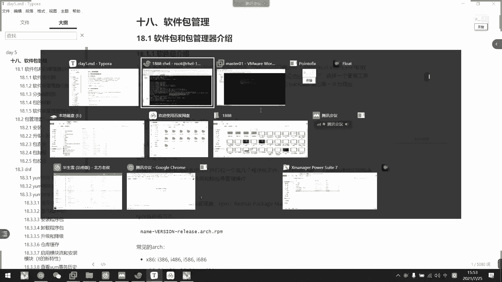

# 2021年7月新版-----RHCE8.2 RH124 RH134 RH294 认证课程 - P33：day6-5 包管理器rpm - bili_15701050454 - BV1Gy4y1T7ug

好，那么我们进入新的章节啊，新的章节。啊，那我们这一章讲的是我们的一个软件包管理啊，软件包管理。然后软件包管理呢。嗯。我们有两个就，一个是RRPN。啊，一个是我们的。呃，样或者是叫DNF。或者是DF啊。

DF是我们的一个。很好的管理工具啊很好的管理工具啊边M的话呢，它还是缺了点东西啊。然后呢，首要我们看一下软件包的一个介绍啊。呃，软件包它一开始呢是没有包的这个概念的啊，没有包这个概念的。

我们的一个开源软件啊。啊，就直接是把我们的一个源码，源码直接打包成一个文件啊，就是压缩压缩然控下载以后呢，我们就通过编译啊，在我们的linux上运行啊。然俾人以后再完成。啊，所以后面其实的话呢。

也可能需要自己去学习一下二进制安装啊，不呃，编辑安装一些应用啊。啊，那个很烦，我觉得。啊，比如说别人要做eng啊啊，要要自己去。看那个选项啊看那个选项好烦的，配置选项。好，然后是。第二种。呃。

就一开始要变异啊，大家觉得有点麻烦。所以啊有一些用户急需系统能提供一种更加便利的方法来管理这些软件呢啊，所以我们底b诞生的时候呢，这样的一个管理工具啊，DPKG啊就应运而生了啊。然后呢。

它把我们这个软件包编译以后呢，打包成叫做1个DB啊，尾后缀的一个包的文件啊。然后呢，著名的page啊，这个概念就第一次出现在我们的linux中。呃，有了这个DVKG以后呢啊。

我们外下是才开发我们的1个RPM包的一个管理系统。这个做法是不是有点像我们的腾讯的？好。然后呢呃这个我们稍后回头再看啊，稍后回头再看。然后呢我们来看一下我们这个软件包管理器的一个介绍啊。啊。

所先它的一个功能啊功能可以将编译好的应用程序呢。各种。组成的文件打包成一个或者是几个程序包文件啊，这个为什么会说是几个呢？他可能把一个用程序给拆分成几个包啊，一个主标，还有几个呃纸包这样子。

然后呢可以利用包管理器，可以方便的快捷的实现我们的一个程序的安装，还有卸载查询、升级，还有校验等管理的操作。好，然后是我们那个主流的软件报告理器有什么呢？啊，在我们危中啊。是有RPM文件的打包啊。

然后是使用的是RPM包管理器啊，使用的是RPM包管理器。然后它的破写名称是readd her package manager。嗯。好，然后是阿RPM包命名的方式啊。啊，是我们的。软件名称加版本。

再加系统架构。点啊边结尾。然后呢，我们常见的一个arch有什么呢？啊，叉86啊叉86是什么呢？啊，就是我们的叉烧微系统，对不对？啊，有13861486，然后1586，还有1686啊。

现在可能还能见到的只有1686了啊。然后是叉8664啊，然就是我们64位系统嘛，有我们的AND64啊，叉8664，还有叉64啊。然后呢，还有一个与平台无关，就是说啊32位跟64位都能用的啊，叫做。No。

我去。呃。

我们先看一下。呃，光盘挂载这个操作之前给你们讲过了啊，之前给给你们讲过了，那么。喂。这边还是重新讲一下吧啊，我们先挂载一个光盘，然后光盘文件呢。画布文件呢是我们的。DVSR0。

这是我们光盘的一个快文件啊。跨文件他跟我们的硬盘是一样的。啊，这是他一个框展。然后它呃的一个手主是我们的s room嘛，c room。然后呢，我们要。跟磁盘一样。跟磁盘一样，我们需要化载以后才能用上啊。

比如说这样子一个。盘然后挂载到我们的目录才能用上。所以呢我们要把它挂载到目录上面。然后呢。老师这边是习惯性呃新建一个。再按屏目录像。新建1个S20啊，跟他密一样。可是比较是这样子啊，喜欢这样的。

然后我这里已经创建过了啊，已经创建过了。呃，这们。稍页。这里有什会什么东西啊，我之前拉过来了给你们看啊。好，然后。挂载就慢的慢的，然后直接是DVSR。啊，这是临时挂载，我们永久挂载到我们讲到挂载那个课。

我们在讲，这是临时挂载，那么我们就挂载上了。挂载上以后呢，我们就可以看到啊S20上面会有一些。文件。好。那么这里是我们8。把系统的光盘特定的。以前气的话，他没有分。注以这两个我就讲，延延气的话。

它就一个目录叫做啊。page咋哦美嗰就 packageage。然后呢，再把我们分开两个啊，一个是基础系统应用啊，还有第三方软件应用。啊，他把这两个分开了啊，把它分开了。

那么我们现在啊CD到随便一个就X stream嘛啊，然后我们也看到啊，它里面有个package是吧，它把配age放到里面去了啊，然后我们再CD到里面去啊。

有点乜啊。因为光盘挂载速度还是有点慢的啊。然后呢，这里就是我们的1个RPM包啊，在光门官盘里面的RPM包，我们是可以通过这里去安装的啊。比如说嗯我们的压缩工具。应该是在baseOS里面了。叉仔。

这该是备注一下。呃，比如说我们一个命令吧，呃刚刚我是看到会爱的啊，会 is啊会we gettwe gett就是我们从网络上面啊去download文件的一个命令啊。反正会死。我们前面说的啊，然后。

库库这里。没有库应该是在系统集层啊。啊，这边。但我们直接啊还是烂子，直接是刚刚说的link啊link，然后是它的版本名称啊，然后再加我们的架构。再加按边啊边然这里。是指定118，就是我们的。呃。

红帽八版本呃的一个装的包。啊，然后这里有它的一个小版本啊，小版本。啊，然后是呃我们的安全。这就是我们的IPM包的一个介绍啊。IPM包的一个介绍。好，那么我们继续往下看。然后呢，我们。这里面可能会有一些。

分类还有拆拆标的一个拆。拆包的可能性啊，我们可以看一下包的分类有什么呢啊，有我们的这个application version arch啊，这是一个主包。然后呢，它可能会把它拆分为我们的一个箱子包。

unil是 un裤子包啊，什么用铁纸包，然后一个。The room。这个不会短，开发指吧开发指吧，我们说dro的意思吧应该。啊开封纸包啊，其他纸包啊，其他纸包这类啊，裤子包之类的，把它就拆分。

然后我们装这一个呢，它就会自动。把其他纸包给装上啊。那就好像我们windows。直接点击一个install点ESC啊呃ESE它就会把里面呃目录类的一些依赖直把也直接按住上了啊。好。当时呢。呃。

跟我们的一个分类不同。他有一些包。有互相有依赖性啊互相有依赖性啊，比如说。啊，比如说我们要安装ansible啊，anible就我们后面要学的294的内容啊，ansible。

这这个东西它就依赖于python。那么如果我们没有系统中没有装拍手的话，S的话是装不了的这是所谓的依赖。不要依赖它啊，好像我们的一个进程一样，我们进程也有过也有讲过依赖啊，是不是啊？如果他不启动。

我就启动不起来这个服务啊。啊，就是这个依赖也是啊，我如果不装这个包，我就装不了这个包啊。所以呢有一种死狂路的啊，又有死狂路的叫什么呢？啊，我A依赖于BB又依赖于CC又依赖于A。

那么我就因为缺少这个依赖包导致安装失败啊，直接装不上啊。但是我们有一个工具啊可以解决我们依赖包的啊，叫做亚啊DF啊。

我们在八里面呢已经没有y了啊，但是你们也注意到，为什么老师一直安装都是用ym这个工具，对不对啊，是不是？我一直安都都是用样，我们可以看一下。啊，优是。并。样。啊，我们看到其实我们那个样。是一个软连接。

它是只上我们DF杠3啊，就是第三方本DF杠3。其实他红帽这里只是给我们一个原路属性啊，因因为很多人都习惯用我们的样。啊，所以他就创一个软件接给子向。我们这一个其实我们用的还是DF来的。要明白这个啊。呃。

同时还看一下这个DF。感受。啊，我们可以注意到它的大小可以注意到它的大小。呃。这里。即系。没有我没有装啊，我有我有我。我有。我给大家看一下七的。Y。开下机。好。

然后我们来LO看一下user那useruseruser下等。一样的。啊，我们这里看到啊，它是800多呃800801个。之前。

然后呢，我们这里啊DF3是1954啊。然，他。所以呃是对于亚来说，他有做了一些个别优化。使得它的功能更加强大啊功能功能更加强大啊，里面可能积了很多东西啊。是他的一倍多一点点啊，对不对？好。

那我们继续往下看一下。

嗯。然后呢。呃。我们软件包管理的一个相关文件啊，首先是包文件的那个组成啊，每个包是多有的。然后包类文件啊包类的文件包括什么呢？啊不啊包呃包类的文件啊，就是比如说我要安装到哪个目录啊，那些配置文件啊。啊。

我们这些是要是要是要。看的啊，像然我很多同学可能初学跟我以前一样啊，装完就算了啊，装完就算了，不会分析它里面有懂什么东西的，对不对？啊，我相信大家也都是这样子。啊，后是原数据啊。

数据是打包了我们的一个包的名称，版本依赖性，还有描述等等。啊，这个我们等一下会讲。讲也不是讲什么啊，就是讲它全部在哪里啊。好，然后是我们那个可能会有安装包啊，就包安装或卸运行的一些脚本啊。

就它里面可能会有一个脚本。呃，怎么说，我们用边安装的时候，它就会提供一个脚本啊，然后让我们去编译，就添加选项以后，然后编译啊。然后呢，它有1个RPN的数据库啊啊，这是one liveRPN。

而正我们装完以后呢，它就会有一个所谓的软件数据库啊。这个不要破坏了。啊，一般来说我们来搜索软件包啊，搜索。工具还有搜索。这个包里面有什么利用的是？呃，时候啊都是依赖于这一个数据库的。如果破坏掉的话。

我们就查不到了。可能他会破坏到他呃破破坏掉他的一个依赖关系啊。破坏掉下你嘅依赖。呃，的那些信息。啊还有它的一个生成的一个文件路径及教程信息啊。好。呃，紧接着是。我们已经对包有了一个了解了。

然后我们来看一下我们的一个包管理器啊，包管理器。因呢我们在vio上啊vio系统上是使用我们的IPM命令来管理我们的程序包啊。啊，随于是功能啊功能是RRPN可以做什么啊，可以做安装。可以卸载，可以升级。

可以查询。也可以校验。交易，然后还有一个数据库维护啊，数据维护这边我们一般不要动它，一般不要动它。好，首先是格式啊啊安装我们用RPN杠I啊杠I就是一动，然后加一个安装选项也可以啊。

然后是我们的ps file啊p。啊，刚如一的话可以详细显示我做的什么东西啊。刚H的话。呃，可以显示我们的一个包管里的执行记录啊，要看S次安装，我们看一下。

呃，我不应该挂在这里啊。我看一下我这里有没有ex get这个啊，没有这个win，对不对？那我们现在把它挂在上啊。嗯。慢。S20，然后是。啥年。要我们是B到。MMTSR03。修道？Stre。🎼接到ps。

开始卡还要读这个包就有点卡。好，我们刚刚不是有一个re gett这个工具吗？我看一下能不能直接把它安装下来。福哋想十百。然后我们是用RRPN杠I。加个瑞吧，好吧。走。嗯，啊，他说lookkey啊no。

那我们就要添加教育教练了。先校验，那我先往这边跳吧。校验。导入看一下在哪里。叫艳啊，这里啊保洁。啊，我们有生成这些包的时候啊，一般来说它都会有一个。呃，密钥的啊。啊，两个都一样的啊。

可以用我们的一个非稳定版，还有一个稳定版啊。啊，我们一般都直接使用我的那种地板就可以了。然后呢怎么导入我们的一个验证呢，直接是啊用import就可以了。import。这个K放在哪里了啊，我们来看一下T。

哦，打开这个吧。

啊放在这里又打开了吧。

330呢。记U在我们光盘下啊。啊，这里这两个。啊这か。然后呢。呃，先不讲，先导入吧啊，那边。刚刚一破。然后是我们的。Yes。下的。RPM。然后是类这个就可以了。打后以后呢，我就再装看一下。怎么装呢？

刚刚又说没有。Lki。然，我看一下这个装了没有啊。已经装了啊，weget。也州了。呃。比如说我这里。先开一下这吧。嗯。诶。哦，对我改了一些东西啊。嗯。睇过。让我们确认一下。呃。没有页面了。哇。3W。

稍等 this。啊，我们做一个这这样的文件啊。多加这个。诶。怎么弄了三行出来哦，他有三个啊三个地址，不管他啊管。就这样吧。好，然后我们这边用 get看一下。啲皮。1789168。189128。

下的 indexdes。L。要不要这个？嗯。哦，防火墙。忘记重启了。刻出来了。呃，他说他我现在只有一个on的权限啊。抵噶。真系几得系。嗯。所我指工。Can why to invest。哦哦哦哦哦。

我知道啊，他不是这个问题啊，那么我们加个杠O，把它保存到其他对方去啊，data下的。9点钟。这个只有把它拉出去了，我们每每个就是这个作用啊，每个就是这个作用啊。我睇下基得商用。你看这不就下车了吗？

给一张。喂。真的是。这不下菜了吗？这个下文就有吧。好，OK。那么偶伟该就装上了，把密钥也导进去了。然后我们看一下安装已经搞定了，是不是？

呃，一般我们用IVH啊。组合就可以了。然后呢可以直接是t啊，它只是测试安装，它不会真正安装的，就相当于是我们的d啊d。

专文这个词的话，一般不是用用在这些地方，可能你们。还没听过。那边去。表示刚刚。刚刚少了个H，所以看不到这两个。然后说这个安装完成吧，他没他他这里说我已经安装过了，已经安装过了。

啊，这是我们的安装。嗯，这里还可以安装前脚本啊，后脚本啊这些东西啊一般用不上RRPN的话，我们就了解一下安装方式就可以了啊，然后是升级。升级这个就烦了。我找什么去申级啊？

嗯。呃，我们这里有个。嗯。😊，2。4版本啊2。4。37。这里该是已经比较新了。呃，看一下吧。N910的话，它这里有。一。1思，但是它是一个模块，我们安装的时候要用模块流去装才可以的。他依赖性比较强。

很强的依赖。所以身体这里不好讲。很烦，做生经。看一下能不能装吧，看一下。大片。咁。IVH。坐一下。能不能做不能做，他说有依赖啊，需要依赖。呃，依赖这三个啊，然后再flow system。等一下。他们。

先装这个。杠IVH。所以这个牌依赖也排始了。系 present。还没有。嗯，不就是这个吗？啊，不用这个吗？他都找不到这个东西。认就是。Dyu。Nearby。这个。啊，他说找不到。咋咋整啊？啊，这不是吗？

互相依赖就强制安装嘛？做了一个model。呃，然后第二个依赖是什么来着？应该是这一个啊。这个就有依赖。我的妈呀。呃，先说这个。那就用亚母吗？亚母的存在就是为了这样子啊。所以我给你看一下什么叫麻烦。

什么叫麻烦？编人为什么要这么麻烦？然后。为什么？要有样的这个工具啊，那我们就不搞了升级这个我刚刚是装了一个什么东西啊？刚刚我们做的这个4。19，对不对？然后我们升级一下。直接直接升级这个就算了啊。

直接升级这个就算了。好，直接是RBI杠U5啊。五 h应该系佢啊。直接什么N file system1。14。1-9model啊，这里有个1。16的啊。哦，直接升级这个。看看行不行啊。啊，可以的，你看。

直接升级啊这接升级啊，罢工了罢工了，升级了哈。😊，我都不知道这里装了什么东西在这里啊，找不到。因为这个不是所谓的名上，是一个eng file system嘛。是它的一个啊模块来的。给你看一下啊。

升级了这样升级了。好，然后是降级啊。啊，还可以强制安装啊哦，强期安装也可以。这实你说有一个依赖的话，互相依赖怎么办，我们就忽略嘛。啊，比如说我刚刚说过的一个依赖链啊，依赖链。

A依赖于BB依赖于C那我装C的时候，它依赖A，我先装个C，把依赖给先忽略掉，然后再装B，然后再装A就好了，对不对？然后再重新升级啊，或者重新装一下C就行了。还有一个酷略的，我们有一个库略的选项啊。不谁。

忽略没已，忽略它就会直接说肯定不能用啊，肯定是不能用的，不用想。他为什么会有依赖？就是依赖于它的一个底层或者适合性。这就叫一啊。然后。其实这些都不是我们的重点。啊，我们重点是。要学我们的一个包插曲。

RPN是用于查询的嗯，RPN是用于查询的。好，我们来看一下呃，查询的话，我们呃用杠Q啊，用杠Q，然后是只选项s。所以我们要学习他的一个人啊，也不要也不要这样说，我们样么啊。

样全都是依赖于这个啊样DF全都依赖于它里面的1个PM包。只是PN这个工具它不能解决依赖性而已啊啊，你不能这样说啊，我们样么安装的都是里面的RPM包啊，一样一样用的也是这些PM包只是样把它给解决掉了啊。

把依赖给解决掉了。我们等一下再讲，好吧。那我看一下呃。报查询啊，首先我们的一个查询命令是Q啊，然后它只选项select呃op啊，然后是查选项啊，这个不用管它。然后呢啊我们可以用RRPN杠QA啊。

可以查到所有的包。

就列出说的包。这系统中目前说的吧。太卡了。哦。他肯定也是先做忽略啊。阿片。这入QA。啊，这是列住我系统当前。啊，所有的包啊，这个仓库中缓存的包，但是但是我大概我现在没有呃没有网络啊。

没有没有没有做网络的仓库啊。但是他装了嘛，他后面肯定会帮你把那个解决掉的嘛啊他肯定后面会帮你解决掉了，对不对？

啊。QA啊，这是显示所有的报，系统中所有的报啊，然后是QF。KF啊这个是查看我们指定文件是由哪个程序包。按住设成的啊。

OK啊，比如说。呃。我们来咪取一下。叉Z嗯。啊，这是我。佢。按照这个命令啊，然后我们可以查一下这个包是从哪里来的啊阿P。杠QF。其实我早早上用过这个，不知道你们有没有注意啊，早上我用过这个。啊。

但是找什么忘记了。就走我디。啊，我早都用过，然后呢他就可以。找到这个。啊，就找到这个包啊，然后我就装这个包就可以了，对不对？

我这的话就可以。然后呢。啊，讲到这里啊，我先不往下讲啊，如果我们误操作。

不操中把这个工具给删掉了怎么办呢？把这个工具删删掉，然后我们就用不了叉G了。这有可碑的方案，虽然它这里会提示我们安装啊会示我们安装啊，但是我先不装啊，其实装。可以装上，应该可以装上，他用样装的。

我没记错。好，然后呢我们现在用QF啊，依样是可以查到的。哎呀。吓死我啊，因为它安装过以后呢，就会存在我们的IPN的一个数据库里面啊。IPN数据库里面啊，所以它还是可以查到我们这个包下来。

所以我们说不要随意的去破坏这个数据库那就用的啊。那么我们现在把这个删掉了，怎么办？我们就找这个包了，对不对？对。嗯。刚。直接从我们AT下面找，好吧。所以你上面找。在小里我都不输。来找诶。这么尴尬了吗？

做么走唔得搜个边。他不找到了吗？啊，他找到这个包了啊，他也找到这个包了。然后呢呃我们就先。

看一下这个包。

我们也不需要重新安装，重新安装都装不了了，我们可以试一下。他说我呃已经装过了啊，他说装不了啊，我插这。开下。啊，他还是没有好啊他还是没有好，一样没有好啊，那么怎么办呢？啊，我们就有前面这个东西了啊。

就一开始我说要退货，先不讲啊，我们是可以啊先。

它这个工具啊有两个作要，一个是可以先预览包里面的一个文件，我们先看一下吧，好吧。

呃，叫做RBN。土。是什么来着？CPO。

杠ITV有没有啊？

やりましょう。你好似。哎哎哎复制错了。嗯。😊，这个啊。嗯。少了什么东西吗？哦哦上了个报稳件上了个报稳件。呃，他传过来，这个不是放在这里啊。不放在这里放在这里啊放在这里。这以展开了。

我们就可以看到呃我们的一个插件放在里，它你看它是直接有个软链接，是成这个软啊不对。是这个软链接啊，还有一个这个啊我们的真正使用的啊真正使用的一个命量工具。那么我们怎么。

把这个取出来了啊，把这个取出来这么去了啊，我们有一个杠D选项啊，杠DID。啊可以释分掉包类的一个文件。

换ID，然后是。把那个复制下来。加个点吧没所谓了，我现在在地塔下都。啊，O。对呀我这里就有一个user嘛，对不对？就有一个user。那我们来去一下。这不就是有个叉Z吗，对不对？

然后我们把这个拷py过去就可以了。后比。有 sir。并。Z啊，然后放回到我们的user。并。小面啊，然后我插进。这不就可以用了吗？对不对？3 message这不是可以用了吗？啊。

我们误上所其中一个文件怎么办呢？就把那个包给找回来啊，把那个包给找回来，然后把它给拆开，然后抽取到里面我们所需要的文件就可以了啊。

这就是。QF常用的方式啊，QF的用用法QF的用法。好，接下来继续往下啊。啊，还是报销询啊，然后是。这些先不呃不用管，不用怎么管。然后就是1个QIQL。Q啊q吧。呃。

QY的话是看那个信息的information。杠L的话呢是啊老师采用的。

呃，我让安装完以后。呃，安装完以后，我都习惯性这样子啊阿片。啊或者是我前面跟你们讲，我装了一些包。啊，比如说呃我们装的可拉里。啊，是不是啊我喜欢啊也也做完以后打开，然后找他的备注文件，对不对啊。

它里面就是我们。包集成的那些软件啊，有什么文件？然后我可以通过QL就可以看到我这个应用啊，它的一个配置装在哪里啦啊，然后它的一些工具啊。他的一些帮助文档啊哪个其实有关助文档的，看到没有？啊。

我看看有所需要到手，我就知道是帮助么难。哎后面啊啊，你的妹你姐要到哪里去了？都是通过QL去查看啊，所以我们一地方不知道他的配置文件放哪里了，我们就直接这样看啊。你看他估计有它的一个对应的库。

或者是它的一个数据库啊。

好，O啊，这就是我们的一个成，还有QI啊QI。

QYI我很少用了，不知道有什么用的。呃。可以看到他的视小。衣服没什。不走。呃，那么他就可以看到它的一个名称啊，看到那个版本啊，relies啊啊就是1啊128的，然后它的一个H啊。叉8664的。

要什么时候安装？呃，然后他的一个手主就是系统组的。呃，大小。什么呃GPLV2。啊，这些。

啊，大家回去自己看一下就好了。information看。好，这是我们的IPN啊，常用于查找啊。你看啊，这里就列出了一些常用的查询方法啊。好，然后我们接下来呃看卸载啊，卸载就。不多讲跟我们那个。呃。

安装是一样的，只是把I改成E啊。用于就可以卸载啊。啊，然后这里。会以校验的一个报文件，用杠K啊。去校验一下我们是否。正常。啊，当然这个是要导入我们的一个啊密钥以后才能用的，先导入密钥，非常密钥。

然后再使用这个。啊，但是我现在手中倒入了以后呢。嗯，你可以这样的，直接复制过来。然后他说OK的话，就是没问题的。

哎呀。嗯，你看，他说OK啊。啊It's notO啊 it'sO啊。那他就有问题啊，他就有点问题。呃，那到时候我们就要给他排一下了。哦，不对，我这里没导这里没导当天。香杠IMPO。表示NNTS20。

呃是RBM。不类识。我再来。这里就O了啊，这里这次就O了。那么。

我们的RBN基本上就介绍到这里吧，介绍到这里啊，所以在这里我就不多说了，真的啊。很少用PN去做这个所谓的系统操作的。然后当然他那个包窃的时候呢，那个对应文件不会删除的。

然后它会有一个备份叫做RPN savePN safe。嗯，OK啊，这就是我们的RRPM的一个相关的介绍，还有相关操作。好。让我们休息一会啊，然后再。讲我们的DNF啊，徐金伟在讲DF我们。等一下。

就一个应该可以把DF讲完。我休息一下。

