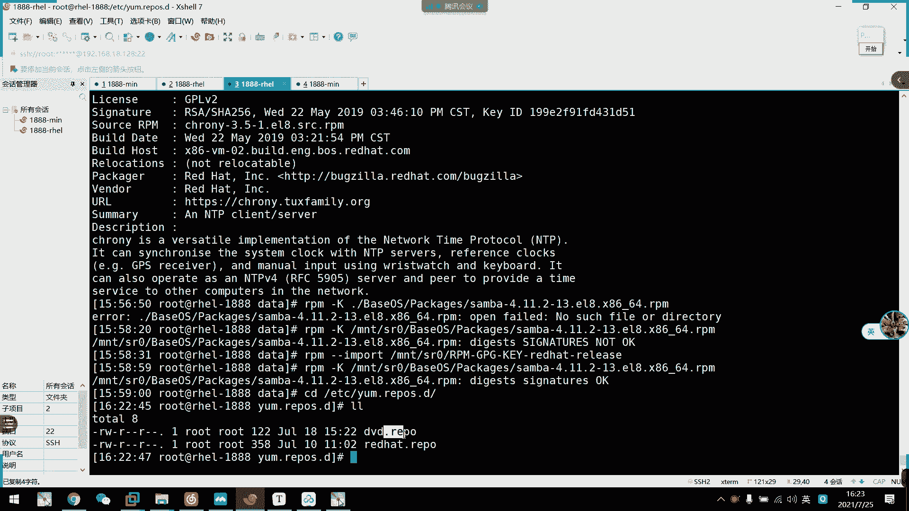
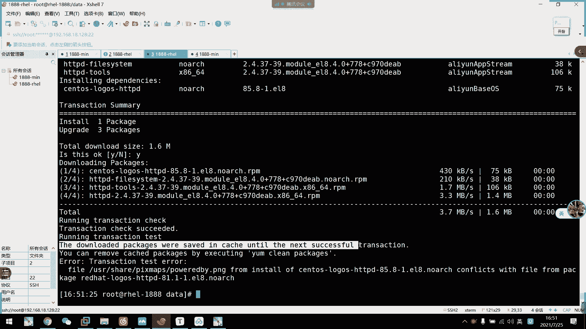
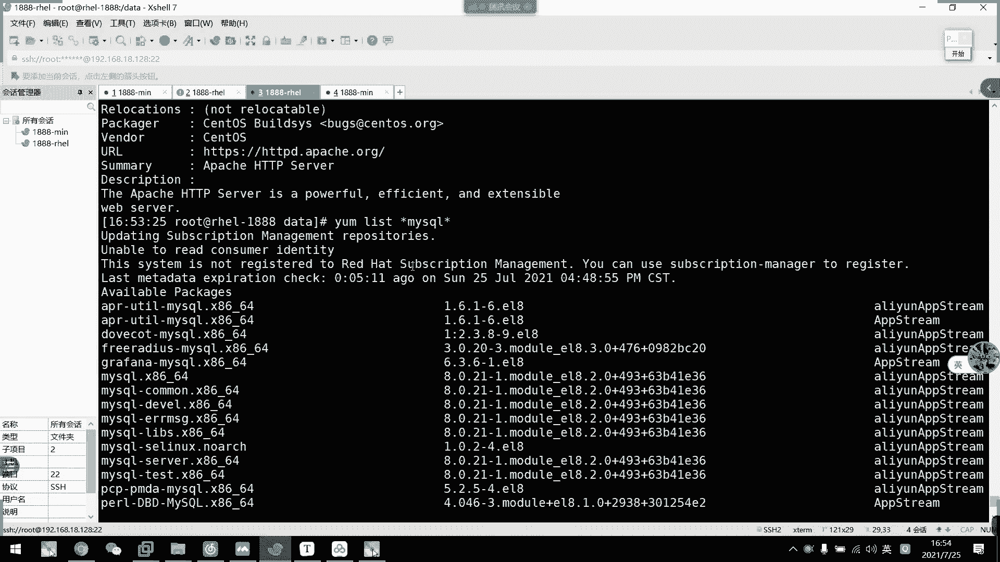

# 2021年7月新版-----RHCE8.2 RH124 RH134 RH294 认证课程 - P34：day6-6 包管理器dnf - bili_15701050454 - BV1Gy4y1T7ug

啊啊，刚才我们上一节课介绍了。RPM包的一个管理。那么。我们留了一个坑啊，叫做包与包之间的依赖，对不对？那么我们红帽就使用了y，还有DNF来解决了我们一个一乐包的一个关系啊。呃，首先那个叫做y啊。

叫做yellow dog update daymod。啊，是我们RBN的一个前入程序啊。可以解决软件包相关的依赖性，可在多个库。之间定位软件包啊，还有一个update的一个代地工具。然后呢。

是我们的1个re8用DF代替的样嘛，不过保留了和的一个兼容性呢，配色也是通用的。啊，所以他。呃。就相当于是DF，相当于是给让啊让让给DF改了一个别名而已啊。然后他们的用法完完全全是一模一样的啊。然后咧。

我们啊一样。或者是这个DNF。啊的一个工作原理。首先我们这一个架构也是基于CS模式的C模式。那么。我们的服务器是存放PM包的一个相关的原数据啊，RPM包以及啊包相关的原数据。然后呢。

我们的一个客户端访问我们样么服务器进行安装或查询的。其实。他这一个实现啊，现的结构。就是这样子啊，我们本地本地的是不是挂了1个MNT？在哪里。呃，SNSRB然后呢啊我们通过编写啊IEPO文件。啊。

来定位到我们的这个SI的这个仓库。啊，我们安装的时候。怎么安装？那么我们是就通过这个仓库啊，通过这个文件连接到我们的仓库，然后再进行一些查询的安装或者卸载的操作啊，这是我们的客户端的，对不对？

那么他这里提供安装包是会服务端啊，所以它也是1个CS加伙。🤧咳。呃，刚刚实验过程啊，刚刚其实那个图已经说了啊说了。好，然后呢。它是怎么解决我们的依赖性呢？啊，就通过我们。

在ps目录同一级别下面有一个目录叫做IPOda。这个目录它存办了我们软件包的一个数据。同时也。我们安装的时候呢，它会查询这个元素是否存在我们的一个相关包的依赖。如果呃查到有了。

它就会安装自动安装相应的一个依赖包。然后安这个依赖包过程中啊，又发现有啊一个依赖关系啊，它继续把。相应依赖安装下来。到了死循环的时候呢，他估计也也是。啊，根据我刚刚说的先强制安装啊，安装完以后呢。

它会自动解决依赖啊。好。然后呢呃我们的一个服务器的一个仓库可以有多种形实存在。然后我们常见的是什么呢？刚刚说的本地啊，本地就是我们的fire。啊，第二个是我们的HTB。

HDPSS啊这三种是最为常见的啊FTP的话呢，现在比较少见，可能只有自己公司内部构建的FTP服务器才有啊。Ylow HD B S， H H TV P。APP的话呢。

可能也是我们公司内部自己建立的一个呃无需安全验证的。任务仓库HTPSS啊现在基本上都。换这啊，这个是相关于我们的一个。网络服务的应用啊，关于关于opSL什的那这边我就不多提。我们知道有这个事情就可以。

好，然后我们来看一下啊。公共的。呃，软件交互啊，我比较喜欢用新华软啊。啊，比如我比较喜欢用球，我们可以看一下啊，比如说这里啊我们没有will的will的。没有的没有re有的一些公开的仓库的。

只有我们的sto。啊，什么什么。那我们点击这个sto。然后呢，这里是我们的一个系统版本啊，系统版本让我们找到对应的耳8。或者是直接点8。2也可以啊。要把两个跳两个跳整到这里的啊，只要把那个。哦。

今日俾东西啊，仲要个 read b 啊。那我们包的话，我们直接就点击这个包就可以了。8。然后呢，这里。啊，跟我们官盘是一样啊，包也是放在我们AP street啊，还有我们的baseOS里面啊。

我们点进去按，然后这里选一个架构就可以了。啊，我们一般水用差不过664啊，要看自己的CPU架构啊，这个还要是OS。我这里。就我们的pic啊，pic就放我们的包。

然后刚刚说的啊IPOdata就放我们的原数据啊，这是我们依赖存方的东西啊，这里还有GPL。东西啊，我拍个时我点开一下啊。啊，里面就有一些相关的包啊，相关的包。好。

这是我们的1个HTVDS服务的一个实现啊。你看HTPSS。现在一般挂在呃互联网上的，一般都是用HTPS啊，需要增速吧，需要增速。这是N次数。是有证书验证的，要买运米的，证明你的网络是安全。

如果他没有的话，可能。会导致你登录上一个钓鱼网站啊。也不不出去了。那么等一下啊HBTS或者是HTPD。ATP的啊，成为我们等一下在讲啊。那么我们。可以看到啊，刚刚介绍了三四种啊。

刚刚是介绍了四种呃实现的。方式啊。好。然后呢，我们仓库指定路径呢，一定要是在我们的这个。不对啊。这个目录所下目录啊。啊，就是他的一个附路。好，然后是关于我们y么仓库的配置啊啊。

这是作为客户端的配置文件啊，其实我们前面也讲过了，首先是我们的ETCys home啊，这是为所有仓库提供的一个公共配置。我们不用管啊，我们主要管的是一个单独的一个配置啊。

叫做啊释放在我们ETC下ym下的一个IPO文件。啊为什么是新理IPO这里什么意思？

呀点IEPOS。第。为什么要新的IEPO呢？它目的就是啊我们这个要识别它这个仓库一定是要用IEPO解入的文件啊，一定用IPO结入的文件，不然的话它仓库就不会生效了，仓库就不会生效。

所以它前面的名字叫什么？不要紧，主要是它的后缀啊，主要是它的后缀要被识别到啊。

O。啊，这里有一个。帮助参考，但是我觉得没什么必要，就几个命令而已啊，就几个命令。有了。它可以使用我们的一个呃内置变量啊，可以使用我们的内置变量。所以是我们的。呃，V server就可以。

自动获取到我们的1个OS的一个发行版本的主版本号，比如是我们的876啊这样子啊，这个是相当于是我们的。

ETC下的。

あやろ。We还。要不等下。不是爱法去要吧。现在是会到这个。这个位置。但然我们现在在这里是一口不了那个变量的啊，这个变量我们一口不了。

它一定要是写在仓库里面，它才会自动加载。你看是空的啊是空的。

啊，然后第二个是我们的二啊，它会自动加载到我们的1个CPU架构啊，CPU架构。呃，然后是啊也可以用我们的BH也可以啊，就基础架构。啊，然后是。肯定。点啊。啊，そ。嗯。

然后还可以用我们的一个亚么0到亚么9或自定一边的啊，在仓库里面等你啊。在成务文件里面定义啊。呃，也可以把它写死，但是我们写死的话呢，对于写脚本来说就不太方便啊。说实话对于写脚本来说不太方便。

小本的时候就用这个变量的话呢，可以更好的扩解到我们17还是8。比如说呃我们这一个。啊，我们这一个地址。他清华园呃，我再开一个啊。再开一个。清华园，比如说我们来拿清华园来说，也是生透士。

要点击生的时后我们再点击7。嗯。这等于OS。到这里到这里为止。他们都是一样的，看到没？前面的呃。学到这里为止。到这里为，因为八它还是分开了啊，八还是分开了。啊，那期我们还有一个OS啊。

他就少了个 string而已啊啊 string。往后退一下。就是到这个目录。你看还是有1个OS，但是他做了个app string啊，做了个app string啊，如果是6的话呢，我们可以直接替换。

对不对？哎，六已经没有了啊，六六六没有六可能没有6手，我看一下。Newu。啊，六没有了，他他撤销了这个产库。呃，6的话可能163元还有吧，可能163元还有。

他这里已经没有了。好了不管了。反正这个就比较方便于我们去切换了，方便于我们去切换。呃，也比如说。呃，发的话我直接用这个，然后到时候我直接改前面的也可以啊啊，比如说阿里云。是阿里。远。Yeah。

他们的后面都是一样的，后面都是一样。那我们直接把它写成变量的话，他就会自动读取了，对不对？啊，然后我们改前面的就可以了。这是很方便的啊。好，O。这里有一个范例啊，就是说我直接写加构也可以啊。

直接让他自己读取也可以。好，然后我们来看一下呃，仓库的一个文件。

🎼纸呃文件纸箱啊，其实我们前面已经给大家截图过了啊，所谓的PPT啊，我直接先拿我们本地的去做一个参考。首先我们第一行。对。定义的是什么呢？啊，我们的仓库。参过名册的。要这里累。是我们的一个仓库苗。

然后这里是我们的一个。仓库地址。然后这里要注意一点是什么呢啊？7、以前。版本。本地。路径。呃，本地仓库吧。需要写。存。Fri右。这样子，然后再加。没问题。S阿里。后面我就不写了啊。

8的话可以把这个忽略掉啊，八的话可以把这个忽略掉。啊有嗰多 g p p check 嘅。这GPU缺的什么了？呃，是否。使用胶液。好，然后有1个GBG。ひ？然后是他的路径。有了啊。如果。使用胶验。嗯。

那么。指定。Keep的。文번째。然后是enable。A able。有没有D来着，忘了。啊，这里是啊。是否。启用。可。默认几录啊默认几录。7。可以不写。啊，基本上我们配置就这么多。我们需要配置就这么多。

啊，这是本地的啊这是本地的。呃，然后这里啊baseUS呃bURL这里要注意一点啊，baseURL。这个注意。啊，base。对呀。一定。要。路径一定。要写到。嗯。8一。飘。Data。そ。这块什么意思啊？

我ba是不是服录啊，我们看一下。呃。这没有。C到我们的LNTSR里。那我们来看一下背OS里面的。啊，这里看到。bease OS我现在看的是bes OS，要么这两个目录就是它的一个子目录，对不对？啊。

刚才说了。写到他的副目录集就包含这里，就其实就是要那个我要写到他那个目录，要包含ps跟呃re data啊。因为我们写到ps那边就用不了这个仓库啊，就用不了了。

好，这就是我们的一个。完整的配置啊完整的配置。呃。这个E啊也可以是用true啊 for啊、yes啊，no啊或者是一或者你该接受不。即系需二一。第一次开启。啊，这就是我们的一个配置啊。

嗯。这里是呃英文英文的介绍啊，这里是英文的介绍。啊，还有一个什么enenable blue啊，这些都不常用的啊，这些不常用的就不管了。这些不用管。啊，这个开销可以设置一下，让它慢一点也可以啊。

设小一点或者设大一层那个呃那个那个那个机器资源可以的话，配置可以的话，可以设大一点，没关系。好，然后我们现在看一下使用变量啊，使用变量。

呃。我先把这个。嗯，是有。

付得出来。其实这个给了你们，我再加也没什么意义。对不对？

那我这个就不保持了。

好，接下来。啊，要讲解的是。呵呵。😊，我懒啊。啊，算了，我再传一遍吧。呃，接下来我们来看一下。呃，我们写网络的呃服务器仓库。呃，以及使用变量啊以及使用变量。好，我来先把这个保存一下，然后写一个。

阿里云的吧啊，写个阿里云的。那么刚刚说的呃，名字随意啊，我来写一个VM阿里云。

点IEPO啊，这里一定IEPO接入。那么还是跟刚才一样啊，这里我就写一个跟它不一样，就标注一下吧，是阿里云的。Base。我。然后是那个。稍等好。呃。阿里云。Face。然后是baseL。没什么了？嗯。

HTVDS。

最会。把我们的仓库地址复制过来就可以了。到S一定要注意啊，我们网络也好啊，一定要注意这个目录啊。一定要写到他的父亲目录啊。

不走了。我就懒得写啊，直接复制啊。然后我刚刚说的用到变量啊，我们用变量，这里用我们的data ARH。所以我们的。多少。呃，一。

什么来着？忘了个变脸了。呃，RELEA。

E， L，E， A， S， E， R，V， E， R， server。🎼然后是。GBG券。啊，没办法，我这里公有的找不到它的一个全88版本我找不到它的一个key啊，所以我直接关掉就关掉。呃。

然后其实到这里我们已经配置完成了。喜欢的话可以加个。把它启用起来。啊，这里写错了。这里改一下。哦这里改上面吧。baseOS等一下再写。那么再写一个啊，叫做阿里云。呃，被。零等于。阿里云的。B。我。좋요。

等于我。直接复制了啊，后面那些直接复制。嗯，这里改一下就好了，对不对？嗯。好，这就写好了。小行。好，然后我们来。先为了演示啊，先把这两个关掉啊。

我不启动了。要不啊我们这样子就配好仓库了。

呃。

那么我们看一下。一样的使用。以及他的一个验证啊。嗯。这写好了。啊，我们来看一下一样的一个命令用法。首先是我们样加一个。先看它的一个查询吧。

我们的report呃re啊re可以or尔可以enable或 disable去查啊。

让等我们DF啊。Wepro。有。他这里把开了和没开了都就呃就这样。但是呢他这里enable。啊，不代表我这个仓库已经可以用了啊，不代表并不代表我们这个仓库已经可以用了。

啊，他只是查查我现在有多少个仓库而已。好，那么接下来我们继续往下。写个程序包。行啊，我们可以用一样list。

让你。要看他加起来看出问题了，对不对？啊，抽一点。他说找不到这个。叉8664。哦，这个变量出问题了啊这个变量出问题了，应该写错了。RE L EAS。

12。ERVER吧。看一下这个边量我器都有问题。啊 e l e A S e v啊多 r。

就开下啊。对，这样就可以了。对不对？那他就能读取到我现在是在八下了。

哇这么多包。呵呵。😊。

了吧。🤧好。那我继续往下啊。list然后呢呃他默认是O啊所啊，然后我们可以直接。呃，查一下自己想要的，比如说。嗯。

我要查HDVD搞。那就写HDVD的一个名字就可以啊，它支持通佩服搜索。比如说呃我们一般搜索my系。哎呀，上完之后，他可能只有这个苞米啊，只有这个苞米。哦，他这里。不行啊，马C口他要放在一个特定的啊。

他在他他他共有的一个仓库上面，他放在一个特定目录里面了，这个不行。这个不行。那我就。应该下有没有应该没有。他这里只留了一个模块安装啊，有啊。有啊呃，刚才没有加模菇比配啊，没有加同倍服。

所以它只精确于这个包了啊。我们好像比如说装马斯克，我们一般要装那个serv嘛，对不对？做什么才是他的一个服务端嘛。我们要装这个。虽以然我们要找这个包，我们一般用新啊，然后是马口西和这样子啊。

找一下相关马西口的所有软件包啊，双方所有的软件包。好。

那我们继续往下。嗯，查找的话还有一个主主安装啊，主查找啊，我们啊多了啊在期以后多了一个group的啊group的一个概念啊，group的概。

就是一样不。嗯。直接是list all。因为我也不知道找哪些啊，比如说啊这里它有一些主安装的，什么啊minoinstore啊，什么work station啊，什么vi host啊。啊。

然后是servro with就哎呀，所以我们如果。想装的。就是装命令还没有装图形块，然后后面想装图形块呢，我们可以使用主安装装这个东西啊。啊，什么系on toolss啊啊。

这些啊level service啊这些它这里都有啊。啊，container manager，我们后面也要用到这一个container manager。啊不多没有这么吧。

不管。好，然后呢其实它这里还有一个叫做模块的定义啊，模块我们等一下再讲。他也是一样的，其实呃可以说到我们的一个模块啊，也是一样，等一下再讲。因为它是一个清断性，我把它拆开了，切性，我把它拆开。好。

然后刚才我们啊是写了程序包，那么我们怎么安装呢？啊，安装也很简单啊，直接是用ym或者是DNFinsstore啊，然后指定的报名。然后他可以批除理啊，是可以装多个包啊，pix1Pix2P3啊。

比如说我现在要做一个。第二次。先锋敢杠歪了啊。呃，比如我要做一个eng啊。转下。然后要做一个。什么好了。但这里都有。他这里都有。怎整。他做什么工具好了。你计啊啊三百吧。3把。这样我就可以。上不字评错了。

呀啊他会问我说么装，你看所有一段依赖关系，你看。

他要装这么多东西啊啊他要装这么多东西啊。

是不是很难受，但是我们的呃呃IPOda那里已经帮我帮我解决了他们依赖关系啊，然后他直接说出来，然后我们一个个它会自动帮我们把依赖全装上了，这是我们的样啊，然后呢。那这里呢说。总共要下载多少。

你是否要下载啊？因为它的他们中在网络上的，我们需要下载下来才能安装啊，那么我们就选歪。这个同时可以使用我们min令行。先杠Y啊，就命令行杠Y就可以了，这样取消掉。如果直接同意的话，我们再弄个杠Y。

或者在结尾弄个杠Y也可以啊。那就自动同意了。

把它下载了下载。呃。他这个就V缺个f了。关了嘛。哦呃，有为呃刚刚我有一个仓库啊，就有用了本地仓库，然后他有一个款存在这里啊，反是我们先清一下。他刚刚用了本地的。直接。说的清的说的清。

然后我们再重新安装一次看一下行不行。我们不需要自己手动去再创建一个缓存的，直接安装的时候，它就会这这种东西还是不行。不行。他的三0有问题啊。他不装三保，这个装。P。哦，我知道了。重启一下。

刚刚用的那个什么了？你碰了他导入了那个密呃公密钥，它自己。去交易了，估计。

好烦了。

哦吼。

我。来事情呢。

卡死了哎，进去了。还好进来啦。哎，刚好我现在没挂在上。等我转一下。呃，是DF杠Y。St entrance。还有我们的三把服务。看下能不能装。嗯。为什么呢？我说呃。关了呀，这PT全关了呀。

谁能告诉我为什么。Who can tell me。喂hy。哦，可能他。进用不了，老也打错了。那打说了。哦， g p g check嘅变咗了吗 g p g check 写住啊 e c k 啊。

有为是我打错了。唉。失误了。太丑了太丑了。好，那就装上了啊，两个服务都装上了，看到没有？然后我们可以看一下。Stues and drink。三0不是。多了。서로。啊BM他应该是服啊，Q。

看下他有没有大元文件。有啊哦叫做SMB啊，叫做SMB。好那我这边也不开啊，这个演示一下啊，这个演示一下。啊，他的一个安装。

啊，这是我们的一个安装。然后我们看一下啊。嗯。还有一个升级或者是降级。

呃，那么我们现在看一下。DF。Eest。呃，在去KTV抵啊。我看一下他这里的1个HPD是什么版本的。啊，这是我本啊，这里有1个37。39。ちにか単。我维修服务。不知道什么行。嗯。应该可以啊。开一下吧。

他这个明量工具提不提供不了帮助吗？呃。我们看一下。把这个产务启动起来。先把这个全部求起来啊。还我们的目的达到了吧。好，然后我们现在让miss跟。

什么鬼。我特又不行。问下是哪一个base with。From Donald met datata  for。没事我哦，没挂仔没挂仔。

问下现在有什么。

版本在这里。啊，他比较新啊。我比较新，我们镜呃镜像里面那个版本都是1。19。嗯，看一下三档吧。

三把只有这里有。嗯。

看一下app均用。那先有这个doabout。没用啊。而且他的版本。Coect。那我这边就做不了那个。还是DVD吧。它只有这里有区别啊只有这里有区别。然后我们看一下。

嗯。在下。他这里看不到我已经安装了的。啊，我可以用RBN啊RBN杠QI。我们看一下我们现在当前装的一个版本是来个版吗。是2。4。37啊，然后是2一的小本。让我们看一下。二一的。嗯，然后这个是在哪里啊？

这是39啊，那行，我们用这个升级啊，我用这个升级。其实我们现在是用2一啊，因我们用upate嘛。嗯，啊对的。啊，我们就装3739啊，这里啊已经有指定了。What you stop。哎呦。什么鬼？

Instore to。不上啊，架播不对呀。唉。没理我之前做这个实验都可以讲课的时候。我讲课的时候都可以装的呀。

那我先把这个幕辅掉吧，我觉得它安装也有点问题。卸载了。用语 both卸就可以啦。

第个水你木。啊，什我些的恶意版本的。那我先看一下能不能装。啊，他摸位是装最新的。嗯。那这样就能装上。我们看一下我做的哪个版本。啊，你看三9的。啊，对，好委屈啊。之前。好像76还是62的时候。

我用这个仓库它是没问题的，它是可以随意切换两个版本的。

啊，然后我们开一下降级啊。看一下证子。降级我们用呃downgrade。

但これ。要4HTV。啊，战机可以用啊。再你佢。你好，我们现在又装了呃21啊，我们刚刚上面装的是3呃444439嘛，对不对？是不是39，你看是39，那我们现在将交回来21啊。就会可已啊。

这是我们的一个战绩。那么我们升级还可以吗？再试一试升级行不行啊？好。Date。啊，果然是我们之前安卓个问题，我是说它启动起来有点慢啊，启动起来有点慢啊，这是升级了就变成39了。我们看一下RBN杠QI。

那么列出来的就是我们当前安装的文39啊，没错啊。好，这也是我们升级相机，以及我们的一个卸载操作啊。

然后呢，新缓存就刚刚的那个Quen啊，我一般直接把哦全都清掉就可以了。它什么插件语面数据啊什么的。然后呢呃构建缓存的话，这边其实我们不用管啊不用管啊，安装的时候，如果你连接没问题的话。

它会自动重新构建缓存的啊。

到时候你也可以手动直接这样子会用。啊，比如说我们现在把它清掉。呃，先不清呃，比如说我们现在list随便一个啊新。口径啊这样子他直接把仓部列出来，然后都把它对应的一些包都列出来，对不对？

因为我们先把缓存清掉啊，D。

呃，P。

直接把所有的清掉就好。好，停掉了，然后我们再重新搜索一遍啊。呀它会自动构建款的，这就所谓的构建款就不做啊。

不见。然后这个本地是比较快啊，本地就比较快。

啊，OK就搞定了啊，然后我们下一次再list，它就直接列出来啊，走这么快，那我们再清一次，然后手动呃，接下来就手动过键款是吧，就直接DF。点。Make。CACHE。这个 수嗰种朋。

我觉得这个没什么好讲的。

我觉得让他自动过去肯定会最好了嘛。

对不对？这有高几块速。

呃，反正我们要切换仓库以后啊，比如说我从阿里云。我把阿里云改成是清华云啊，那时候就要重新。清你这长度了啊。比如说。比如说我这里啊要改其他的地址。

夫亲本过来。新华的。这个是阿里的。我这是阿。清华。直接说个吧。嗯。

复制这个就好，他们前面都是一样。真一下。收的。那我们这个时候就要清缓。啊，就是我们一般切放仓库。上我哋整好，我之家签十发出。让他重新构建啊。他们的包其实基本上都应该是差不多的。这都是开源的。哎呦出事了。

做点。哦。嗯他会置哎。不还有事情啊，baaseOS没什么问题吗？嗯呃TP。嗯。神头8 bases。差不多54。我有 tPS哦少了都更好。三多大。

他会自动重新构建款的。

啊，我们通常就切换的时候记得要清房军啊，要清款。

就这样。好，最后一个小点就是我们的一个模块流啊模块流。模块流呃，就就是直接一个modode历史可以了。

他跟主其实差不多，他只是把主变成一个模块而已。

Moel missed。

他跟我们的不是差不多。配成一个模块给我一。比如说嗯PHPHP啊。呃，什么N的一个模块呀。让他作作为we呃wes的一个啊，然后是作为呃这个是版本的，一。1版版本的。啊，目前1到1。18是稳定版了。

最新的稳定版。嗯，然后肯定的兔子啊，我们到时候也要装这个肯定兔子，然后他会说里面有什么呢，就是说呃。滚动更新里面的一个什么bo man啊，标啊，然后什么win啊winC啊。

com on啊等等之类的东西啊，这是模块流啊，这就是我们的一个模块流。

这里也不多做啊，安装的话就直接让。

model installstore 我说一下 e家 l o d。ULE installsstore我们就装刚刚的con。透死。

嗯。他就这么多东西啊。它跟主不一样啊。组的话。还是那个东西哈礼物的话呢呃是对应的一些所谓依赖啊什么之类的，乱七八糟的全部帮它集成在一起啊。

看一下这里装的是什么版本的，不怎么样。系噶。应该是。3。0。所你挺好。那我们看一下。呃，那个先按他安装啊，然后我们最后看一下它的一个啊。样的一个输例子啊。梳例，然后呢呃这里有1个RBNlog。

还有1个DNFlog。啊，然后我们。

查看的话呢，直接用我们的一个呃yngHE啊，用央ngHE。我看一下啊。羊。可据。然后我们就可以看到我们装的什么东西啊，最近。啊，我这个系统到现在我就做了这么点东西。

怎么战机要卸载。做那么久，讲那么久就弄了这些东西啊。

还在这边做咩。可以in货也可以啊，加一些小游匙啊啊，装了什么东西啊，装了什么东西。嗯，还有其他啊什么pggest list啊，你看一下，直接先list吧。就跟刚才差不多的。表示。P K A G S。

不对。均意は。嗯。P C K A G S needs没错。不说不是的。都补全不了。p a c机。

Picage。公试一下看下。

到我这里。有问题啊。哦。不对呀。

嗯，他应该是要对包。对包然后。

也不对呀。啊，那不管了。big is in。

看一下跳。拖几分钟呢。嗯。小楼一去。呃IBO。仓库的。好像是没有。Great。啊，你看这有这个in风啊。嗯度。

Inform is the I。他应该删了啊，这个可能在7里面才有啊这些。而其也不用管。啊，我这里就不删了，他那个7里面可能有啊。

那么我们样这边就讲完了啊，样这边也讲完了。呃，回去大家写一下一个。

仓库啊就写三个仓库吧，互相切换啊，互相切换写一个阿里云的，写一个清华的啊，写1个163的啊。呃，不要看我这里啊不要看我这里。啊，这里他可能有更新啊，他可能地址有有所不同的啊，已经有所不同。啊。

还有提一点啊，还有1个EPR园啊，EPL是我们的一个商业园啊。商业的话它有两种啊，只有阿里云有呃，163也有啊。163应该也有啊，反正6的EPR语呢在阿里云已经商个啊，商个找过啊，只有163是有的。

就6版本的啊6版本的啊，然后这里fa的话呢是比较新的啊，比较新的。我们这里直接转啊，到时候我们。啊，S5也是从这个圆上面装的啊，也是从这个圆上面装的。然后回去写一下吧啊，写一下。清华有E批要园吗？

新款问我。我还是。

啊啊有啊。没说过。怪这里有疤的啊，终于找到有疤的密钥了我。啊，但是它是对应的EP语。到时。腊八有呃，腊青华也有啊。清蛙的我没说过出来。

我反正这个把它改成是这个。

嗯透。那行啊，其实一BR员也不用。呃，我喜欢用E装了1个EPR源，然后装个SL啊，装个SL给我看一下什么叫SL啊。

是SL啊不是SL啊。呃，我装个肥多少吧。

看他做什么东西。不斐尔的话就有点慢啊，因为它是国外的。啊，这个安装的话直接。集成成1个包1，其实它里面都是我们的一个。呃，IPO文件来的，我们A要看一下EBC一样。点他一标。

他要装这些啊什么EBL的一个对应的仓果啊，让我们装一下DNF杠Y。呃，阿里的更新没所谓啊，他其实他背后没问题的。但是有时候有点挂，但是清华他们之间都有点问题。我跟你们说，他们之间都有问题。

阿里有有有可能连不上啊，清华有可能解释不了啊。因为他是走学信网。啊，小学性晚，他有时候解析不掉了清华的。呃，这个一标有的吗？呃，所以有时候这两个元用不了，我就用163元，我一般都是用这三个元。呃。

有兴趣的可以留一下，没兴趣的可以先下课啊。没关系啊，我就装1个E标1，装个SL给你们看一下。啊，就庆祝一下。请举证。啊，好，下课开个火车庆祝一下啊，就玩一下吧啊，童心未泯啊，童心未泯啊。

就是我们后面啊学了一个服务啊，学了一个应用部署起来啊，步署成功了啊，就弄个火车庆祝一下啊。那么我们今天的课就到此结束啊。那么我下周再见了，下次再见，同学们，拜拜。

