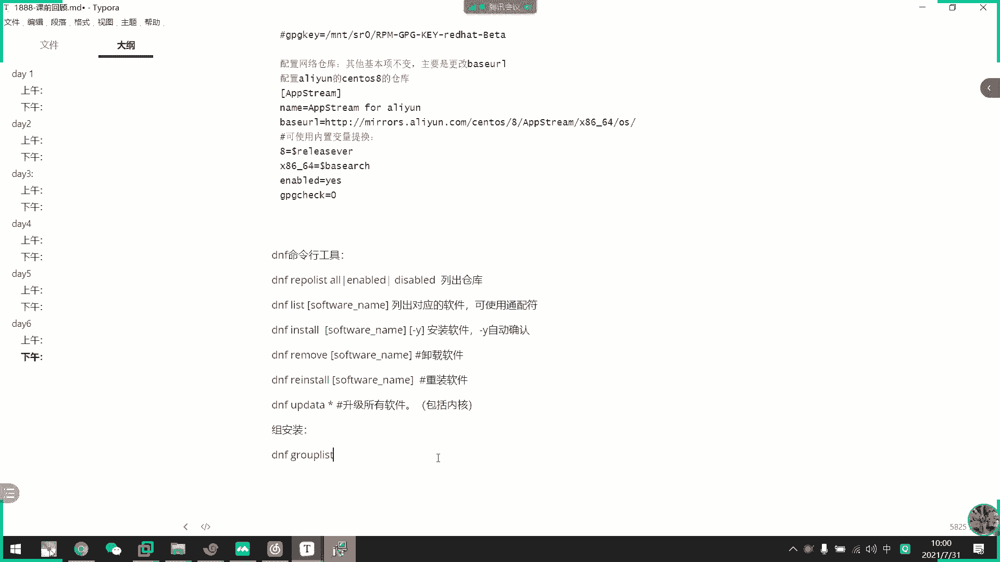
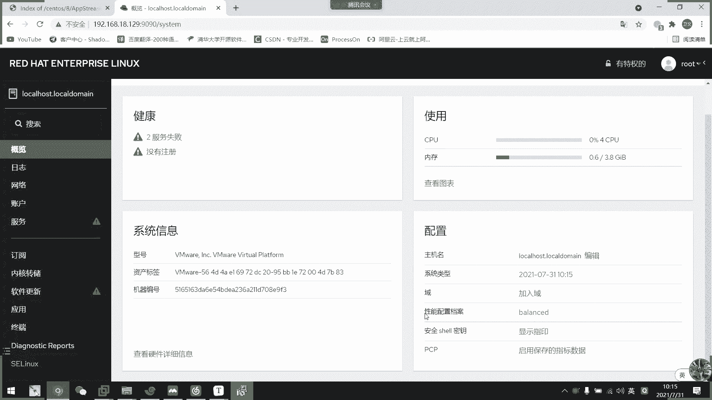

# 2021年7月新版-----RHCE8.2 RH124 RH134 RH294 认证课程 - P35：day7-1 系统调优 - bili_15701050454 - BV1Gy4y1T7ug

好，我们先回顾一下上周的内容。好，上个下午啊主要是。第一个是我们的一个通过命令啊。嗯，配置网络。咪密还工具。迷你航空就是什么？MMCOI。好，然后呢。查看链接。这是MNCLI。eleelection。

说可靓的。啊，收啊，这样可以看到链接啊，然后是查看。🤧设备与。连接。坐们他。点咩 c i。Devicice。Stium。好。通过命令行。配置。The。M I。deeleion modify。

然后是dvis啊。另外。比如说我们的。160这样子。选择160。就我他明确啊。设备名称。啊，然后是。配置IP。呃，我这边断开一下吧。好，然后配IP。WV4点ADDRESS。这个是。这次IP与。网络定制。

在后面写。192点168点18点。啊，比如是110啊。然后是24位。🤧嗯。啊，然后是IPV4。一对。呃点168点18。1。配置网关了。好像是IP4。给です。这个是。配置DXS。呃。还有一个。啊。

这个比如是manu。Manliu。或者是。老总。或是。bo放在后面吧。把静菜的放前面。然后顺序是。🤧嗯。Qian。两个是。尽快获取。I p。欧洲是。DH c p。自动。获取。好，基本上就这4个啊。啊。

然后是。我们的一个。连路剧本。电啊。啊，然后那个方式啊，自己看比记。这边不细讲，因为是破展的。哦。然后第二个是我们的一个。见。我就包。管理工。啊，这个是RBA。一个そ的点学。🤧咳。老边。呃。后边。呃。

查证于。调找。我见。包。当光了。然后。财务选项。调解一下啊呃。杠Q。这里应该加。然后是组合。杠QA。月出。要什吗。这个Q。列出。是定。软件包。啊PM包吧。是不是的。杠qL。可以查看。安装。R。不认。

列出。指定。软件。包。呃，你。安装的。それとじ啊。杠QF。通过包类。其中一个。换只。查找。对应的。包。啊基本上采用的就这些啊。然后。安装的话其实。不不采用了。依赖关系比较难解决啊。所以我们要引入。

亚子或者。第二组。通过。目录。保存。软件包。的。相关信息。以及。依赖关系啊。所以。呃，应。啊，没声音吗？没有声音吗？有没有声音？哎，我们50多个同学。然后发了60多个同学啊，正常是吧O。好。

所以DF或者是y吧。啊，可以。不如过。数据中。对。依赖。关系啊自动。安装前。依赖的。呵呵。😊，好。我觉得这句话应该。放项面比较好，还算了，就这里。DNF。啊D f。或者是亚麻。是。c s 记录。那么呃。

诶。嗯。作为。服端。嗯。可以。三发 use HPPP。呃，一个是HTTPS。算了，写他照面吧。这个无需配置啊，也不是说无需配置啊，这是通过呃。Weber。我。提供。一要。ちんと。啊，然后是我们的f。

关盘。提高。差不多。都交下仓库了。就有就个。啊，还有1个FTP啊。啊，也是一样的，也是。文件服务吧，这。啊，这个没什么好说的，因为它作为这个服务端啊，无论它是作为什么，他都是由第三方应用来提供的。

他只是把呃我们。把它那个包下载到本地，然后通过呃we博服务提供，或者是我们本地。光盘挂载以后就直接提供啊，还有1个FTV也是一个文件服务，本地提供啊。好，然后是。作为客户端。

这个是重点了啊啊就是说我们的一个配置。没超过。🤧好，也是那。算以啊，主要配置文件啊。是ETC下的样点。reper点D下的新点。答一。A票。啊，名字不重要啊。重要的是要。IPO。🤧那么。配置啊。

我这个配置我上周去过。呃，比如说呃。又没有声音。这么突然吗？是我网络问题，还是你这己网络问题啊？嗯，有声音吗？好。嗯。好，O。我叫DVD啊，这文件啊啊EPO。啊，不要了不要这样写不要这样写。算了。

直接写配字吧啊。然后8。同。八八贝。提高。系徒。拆封。喂。两个应用三挂。两个仓库。啊，一个是我们的base。OS啊。这个基础系统应用。啊，然后APP。均。啊，这个是咱们的。呃。相当于是应用商成业的。

这个是薄面的啊。呃。然后配置啊，咱们分开配啊，比如说。配置。仓库。呃。下载目录。没问题。S阿里个。好，然后呢首先是。被。不会死。这个是。仓库名称。呃，自己。と的。用于区分啊。好，然后是我们的那。

另等于比如说也是BA。被走了是。也是自定义啊。啊，此为。仓库描述啊。啊，然后是face斯。这个是就不能自定啊。呃，比如说我是本地的，我就挂到。IT下的SR0下的。Bace。不会死啊。此为。财不陆地。

一定就。呃。Data。葫芦啊。然后是我们的enable。啊，这个接受。或者。啊，什么叫报汁？2，11号。0。你。或者一。然后。Yes。Hello。或者你不然那里夜死啊路又反过来了。哎有这里是处。

或者是forse。呃，默认子。错。啊，如果。直接打开。可以。忽略了。不来不写了。啊，然后是我们的GPG券。啊，也是我们的一个果子啊。这边就不获展了啊。呃。🤧咳。是否。启用公药。宵夜。好。如果启动了。

那么这里就要加一个。呃。GBGK指定路径。

每月呃，一般是放在。啊，一般是放在。我发表一下啊。嗯。🤧好，一般是放在我们这里MTSR0下的两个啊，一个是呃。公作老板啊。一个是我的版本，一个是公作版本的。呃，就这两个吧，我写下来吧。

这写一下啊ANT。SR下的。或是。BATE是吧，被版。BETA。🤧好。啊，然后是。配置。网络。那我差不多。呃，其他基本。值不变。嗯。主要是。这下。更改。好。呃，比如是我们的一个。这次打底熨的。8。

直接复制一份。说了不复制的。这里直接写一个。这边写APP均。🤧咳。然后我们改这里啊。这是ABS。呃。Memory。要是生头是吧？六十八。我死。不对。算了，我是找找一下。阿里云。然后我们找到8。

然后再找到。There is drink。最后陈是OS啊。多对。然后。可。可使用内置。变量。提款。比如呃8啊，可以改成是我们的多。Release。S我。算了，我还是开下好了，拼这个东西。被类似。

对 it。R e l e a。LEA。SER。SEVR。他也不是说我的意思。啊，然后这里插。86。64啊可以改成是我们的。那你去。架购。啊，或者是改成我们的金融呃系统金融平台也可以啊啊，但是。

用这个吧啊，那就用这个吧。你知吧。Based安全。啊，O。然后其他都一样的。那就直接关掉啊。ok。FDP我就不演示了。ok。然后。关于。呃。啊ANF。啊，EPO。你。哦啊。连一部。可是。

Disableable。查看。列出。仓库。然后是DF。Nextast。啊，然后是。Rja。我这边撤了。可。列出。对应的。和。使用。吞佩服。都是安装。安装。更位。自动确认。We can到啊。很多的。呃。

再补一下啊。呃，我们还有一个d update。update啊，然后是新啊升级。这个是。包括。呃。安装了彻底差不多了啊，然后还有一个。错。AF。Gru。ブイリす。

是不是他下。

粉是啊。列出。好。然后是DF。有。ずすと。呃。安装书包。然后还有一个模块。啊模块啊，叫DF。model都。列出所有。おっぱる。啊，然后安装。我说你到了。我都。あどうも。基本上这些啊。就他这些。

那么我们哎呀。有借你都以。测一下这个。呵呵测一下这个。😊，还有他有有名字，我就可以直接知道是谁写的。好OK。那么我们。对。啊，笔记上面还有提供的I呃EPL员啊啊或者是其他的一个。

都有员啊公共的一个软件源。啊，这里都有刚刚说过的。呃，还有一个提款权啊提款权。点一下吧。呃DF print。O。那我们呃直接往下讲啊。有冇西。呃，15分钟讲完笑用调友啊。好。系统调优。呃。

他这个系统条优呢是我们。是统中提供的一个叫衬的的服务来提供的啊。然后呢，它这个。他这个。用法啊其实很简单，但是说实话的啊，他对调优的话可能没太大帮助，他有着一个制定方案制定方案。我来看一下啊。

首先我们那个t的首护进程呢，可利用我们的一个特动特定的一个工作负载。要求来。调优配置文件啊，或者是我们用户啊，可以啊我们管理员啊可以以静态或者是动态的两种方式来进行我们的一个调优调整啊。然后呢。

这里就列出了我们那个调优的一个。呃，配置就是系统已经配置好的。首先是我们的balance啊，就均衡啊均衡就是相当于是我们这里。笔记本这里选择电源，这里不是有一个性能或者是电源呃呃呃对要续航吗？

然后我现在在中间这个就叫be了，对不对？Hao。啊，黑屏了。怎么你们今天这么多情况呢？听了吗？啊，有没有黑啊？啊，好，可以。那么啊第二个是我们的distop。

distop呃是从我们的一个be培训文件来衍示而来的，可以加快交互式应用的一个响应响应速度啊。啊，就这里就相当于是吸牲性能吧，吧吸牲吸牲吸牲电量吧啊，然后把吸尘调高嘛。然后呢，这里就说。Ft。

put performance啊就。获取最大的一个投吐量。他头量。呃，就相当于是这里最强呃最强续航嘛，就是最少续航嘛啊，然后这里是我们的一个lins啊。performance啊。

然后这里是牺牲的一个性能。呃，它会最低延迟的一个服务器系统啊，那就是把我们这里的一个啊最佳性能调高了嘛。好，节节下是我们的一个网络延延迟啊啊是在我们这个。呃。

fruit put啊 performance上面进行啊延伸了啊，就是说它。牺牲了我们的一个。啊，从从从这里。呃，就是续航，然后再吸车我们的一个网络而延迟啊，就把这个网络提提高了。啊，然后降低了个延迟啊。

然后这里一个网络特有量也是从这里一个也是出来的。呃，就是说所有性呢都调到调到最低，然后呃网络特有量这里呃网网络网络延迟这里调调到最高，然后使得我们的一个网络的一个特有量加大。然后是节能啊。

节能就这个是这个了啊，这是这个最强续航了，把所有都调到最低了。然是oracle啊。Oac口这个是呃为了。是我们服务器是专用的一个oracle设置的一个配置啊。啊。

就这个如果这个服务器它整个系统都是用于我们的一个on和数据库的话，那它就直接选择这个就可以了。好，然后是呃两个洗理机啊，一个是。gueest一个是ho啊，他两种给。就是说一个是我们的。物呃。

虚拟机一个是我们的物理机啊，如果他说的是物理机啊，然后他就用我们的housese啊。如果他是虚拟机的话，我就不用 guest啊。我们等一下看一下我们现在用的或者是推荐的是哪一个就知道了。然后呢。

我退了可以。都带调优或者是接调优啊。啊，我们这样调优就是通过这个首复寄存，然后选择配置文件就可以了。动态调优的话呢是啊让他自己去监控我们的一个。系统活动啊，然后自动变化。其实就在这。好，然后。

这边的话应该自带安装了，我们看一下啊，看一下它有没有装，就是用我们的inall turn就可以了。

看一下有没有啊。啊，一般都是自动呃系统自带安装的啊。

好，然后看一下他有没有启动啊。

Stads。啊，已经启动起来了，他已经设定了开始开始自前了。一般没有做的话，我们就按照这里重动安装一下就可以了啊。然后他就是从我们这个提供的一个服务啊。呃，以特者为所谓机程提供了一个服务。

啊，然后这里呢可以列出我们的一个调级别的一个配置文件啊。

叫 to amin list。好。哎，不好意思啊啊，然后到这里。

这些列出了就是我刚才。呃，图片上的啊，这是课本提供的图片啊，然后这里是列出来的一个英文，只是只是英文翻译而已，它还有一些其他的。

还有下呃，其实也不是啊。有一些其他的啊，大家可以看一下，关关于interpeed啊，或者是什么。其他之类的。啊，但是这个不采用了，我们就按照课本列出的去看一下就好了。

其实这个东西嘢。用途不大啊，但是它课本上有的内容啊，我就给你们说一下。嗯。好，我就往上。好，我们通过特了的命啊，就可以看到这些。然后呢。呃，我们通过 chip可以看到我们当家使用的一个调配置文件啊。

有一个D。AC t iV。他去啊，你看。那么我们当前使用的就是我们的一个作为虚拟机的啊系统配置方案啊。

是没有方案，然后我们继续往下。啊，我们可以通过recount啊，可以获取到我们的一个汽有推荐啊，汽有推荐。

诶。

啊，我这里没有装那个。播 m e d 啊。

嗯。😊，Si。

ADM哦哦这里评错了。收嘅一。好。呀这里就是我们的一个信用推荐的信用推荐的。

然后呢，手动更改啊，我们这里可以用。

profile，然后加我们的配置方案就可以了。proide啊，比如说我现在。把它改成。Bes。

B， A L A C。有错吗？

差了找个D。哦，先把它改了这个，那么我们现在去服的看一下。对呀啊我们现在当前使用的就是我们的一个平均负载。平均负载的话呢，我们再看一下它呃系统配件会不会更改。啊，你看啊。

他还是推荐我们使用这个作为虚拟机时候的一个系统优化方案啊。然后呢，这个题啊这个题就这几个步骤的话呢，可能啊考试会卡啊。作为一个体。

好，然后呃。不不启用。动态。动态好像是选择第一个吧。这个吧。动态关了关了，它就直接不调，又不是不并不是说自动调又。

我看一下。

有没有？相关的。太哦。六个 level日든지지。Yeah。Off， provide， right info。

啊，你看这里不就有个auto profile吗，选择这个就可以自动调用了啊。这里讲的主要还是讲一个静态的，因为它这个。很饥乐的一个东西来的。很饥肋的一个东西。如果不是课本用，我都要跟位讲。

没有原理可讲的，他都内置配定好了。然后呢啊这里是通过我们命令卡的。

呃，然后。紧接着我们看一下。嗯，没有开。好，这里应该开了。

这边就离开了，然后。

防火墙真的？

把它关一下，然，我们看一下啊。18。129吧。

啊，可以。我进来看一下。

好啊我们上次讲过了他的一个。啊，这是我们8的新特性，它就多了一个叫做bookki的一个啊网页配置啊，web console吧，网页控制页面吧。因然它这里也可以对我们的一个刚刚的一个系统调优。

这里也有的啊啊，比如说你看这里有一个性能配置档案，我们点一下啊。

然后这里可以更改。这个更改，你看连推荐都能看到，但是考试时候，我不知道有没有这个东西啊。没试过啊，你们可以试一下，然后进入啊就是这我们的一个off。好，我这里选一下，然后跟变啊变更它就可以了。

好，我可以看一下现在的一个achie啊。

啊。什么企业用怎样做，直接选就可以了，直接选就可以了。呃。算了，给你看一下。不用了不用了。Propri。对呀我这里直接开啊，然后我们开一下。ACDIV一。后他就直接开了啊。或者是我再关了。

对看他这里就没有配置文件，它off的话就直接没有用到我们的配置文件，然后直接选择配置文件的话，它就会自动选择了嘛。

好，我们这里再点一下啊。

好。他off的话，其实就是不选择配置文件而已。呃，我们再看一下。那我这里就通过页面来更改了啊，通过页面更改呃，okK啊，这是我们的一个turn。

呃，体验者有一个叫做A。进程的一个优先级调优啊。即系有写字条。呃，我们前面讲金的时候说到了一个叫注优先级，那时候就说呃先不讲这个东西啊，因为我们在这里秀条优那里呃可以讲到啊。然后呢，其实这个也没什么用。

就是调整了一下我们的一个。呃。非实时继承的一个呃优先级啊的一个就是就进入进入进入呃分配资源的一个优先级啊。啊，比如说我们这里啊0到99，其实我们是调不了的，因为它是我们的一个实进出来的，是系统控制的。

啊，拖销我们自己启动的那些进程，就是我们的一个非实时进程啊，就是我们可以手动来调整。然后呢，我们主要是要关心我们的一个nice值就可以了。nice值呢就是从我们的1个100到139。啊。

它优先级一共是0到13911呃140个值啊，140个值要0到99调调不了呃，然后是100到139，这里是4个值可以调，所以它。变成是我们的一个n优先级的话呢，是相当于100对着我们的一个-20。

0的话是120。19的话是啊139，刚好40个数字啊。然后怎么调怎么调？呃。调的话，我们可以使用ns跟命令啊来指定优先级启动我们的一个进程啊。就是说呃比如说。

我这里liice。P啊，不对。嗯嗯。比如是把那有C提到最高。啊，然后我们看一下它一个优先级啊。呃，我找一下拼啊，你看。他有些急。

看一下。他就看不到哎。呃。啊我知道佢嘢话诶 you guess。So没有 last。I， S， P， I D。这个没有啊，我用EF开一下吧。这里吧。您。你这个是也不是。

哦我记得这里可以显示last值的呀。那不我开泡泡吧。top呃，这里有个AI值啊，AI值就是我们的赖啊，我看一下我们的拼。找不到皮了。Ping。你有看到吗？他一直在动态跳走，我找不到。说了。PS。哦。

我记得这里有个last了呀。A。其他这个有这个箭头，已经代表它的优先级是最高了。

唉，看一下怎么看啊哦，HRO啊。

HO加1个AI值啊。

呃。谁说不是干K吗？

不加蓝て。A叉 o。

看不到了，AI值。PID。

看一下发例。应该 c e。那就NI值吗？哦。这个か。我是感听。他现在把我这里的字加到后面去了。

A叉 o。PID command哦，很慢，不用买封号啊哦，我的错了。

啊，可啊。佢把股一摆分啊，只有只有 c p u 跟 lE a又。百分好，我们找一下我们的P啊。P百度啊，你看啊，刚刚指定的它是-20啊，这就是右星级最高了，右级最高。好，然后还可以给他呃rease啊。

我看一下米la怎么走啊。

呃，直接relaase刚，然后指定它的1个PID就可以了。呃。我看一下。rease，然后。把它改成名额。嗯。再看一下，你看我们这个P就变成零了啊。0。要我们HROK。AX看一下。

因为他那个箭头已经没有了，看到没有？啊，就变成一个普通的一个。呃，提呃。设备胎的。睡美胎的一个。切多计存。OK这就是我们的一个通过调整拉值来呃指定我们的一个计车优先级啊。啊。

或者是呃top的也可以给他调的啊。我看一下top的怎么做，看一下这里有没有没有写啊，top。

啊，输入R啊输入R，然后是进行我们的reus处理啊。比如说啊我现在还没退出，对吧？啊，我们来top一下。

啊，要说啊。啊。为什么默认的是我们的6219的这个top，我调他干嘛？找一下那个记得是多少来着。设备有吗。啊，这个。是6156啊6156。我先这里输61。成，然后这里改成是1几万。啊，把它调到最低啊。

找一下有没有19的。好，这里。哎，改出了吧。不是这个。6156。6156。啊，这里P。啊，你看它的AI值就是我们的一个需求了。然后呢与与之对对的上的叫做PR值啊，PR值，但是我们命定不会更改PR值。

但是它的一个值啊了解一下就可以了。我们看一下啊。

PR纸啊PR纸。然后呢，它的离呢是对应着我们的-20啊，然后是39，对应着我们19啊，它是相当于是呃。飞丝寄存的1个0到3940个数字，它就按按照我们的一个。数轴的真相啊数州的真相啊。啊。

OK这就是我们的一个last。啊，通过调整我们那个技础优先值来作为系系统调用啊O。那么我先休息15分钟啊，然后我们再讲那个计划任务啊。呃，直接按发呃按发键下就可以了。

但是。他进来之前，我们可以干逼来显示所有的技程，他就不会这样子刷刷刷刷刷，我是懒得搞而已。O我现在休息15分钟啊。

40分3克吧。