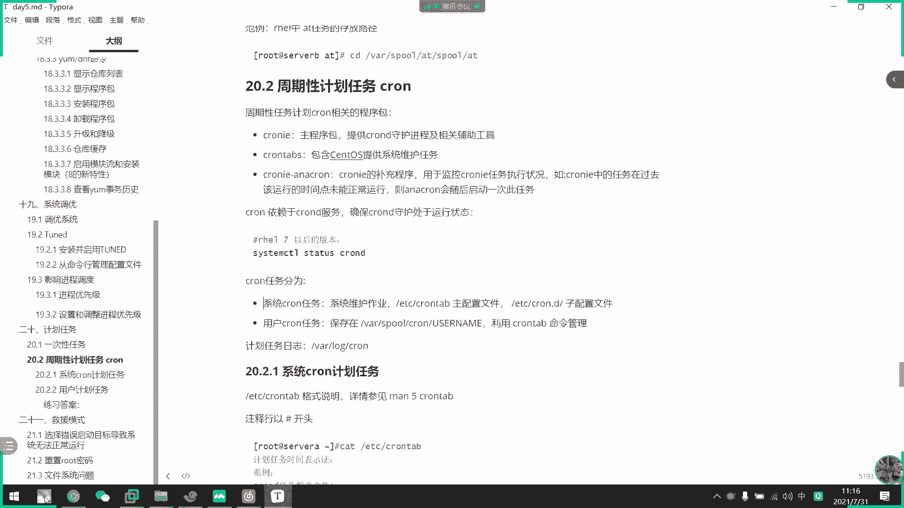
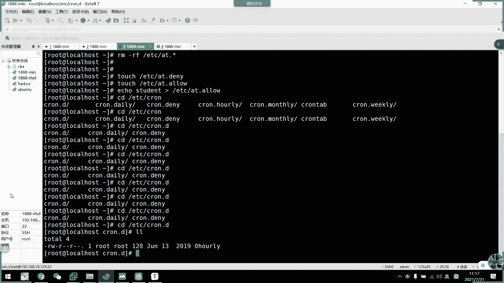

# 2021年7月新版-----RHCE8.2 RH124 RH134 RH294 认证课程 - P36：day7-2 计划任务 - bili_15701050454 - BV1Gy4y1T7ug

半露皮子。到时候把。艾的那个录屏啊，找回给你吗？太浪费时间了。😊，没事啊，还有上一期的啊。还有3一期的。啊，56分了啊，他现在应该啊你看啊，我们可以说以后就可以看到我们这里啊。有一个。呃。

有一个邮件的啊。然我们来看一下啊，喵。啊，要我们读邮件，你看它就可以读出我们的一个S变量的一个值啊，S变量的一个值。啊，就是说如果他只有输出，没有工作的话呢，他啊要通过邮件来通知的。那么我们看一下。

そこた三点。那么我先看一下呃。好，我们现在在这个。嗯。🤧。他学个文件啊，在我们的data下的ATP下的。再错这一个呃艾特。🎼看一下他这里有这些结果，我们看一下他这种是没有标准输出的啊，不行。

他这种没有标要输出。没什么意义啊。他就直接错认出来。也行吧，看一下他有没有统计。刚用N个DIR可能比较好一点。我们用我们用PV，它有一个输出嘛，对不对？他，应该执行了58分了。连蛆这个都没有。啊。

很明显的我们当前是没有。没有那个输出啊，所以我没有邮件了。呃，没有邮件。那我们看一下啊我FDA啊。既有工作啊既有工作又有。看一下他会怎样。NKDR啊，我们data下的1个ADD下的T一再创一。呃，T1。

S2要杠PV。差点白着带了。啊家好十几分。我们11点11点之后有两个工作啊，一个是呃。一个是想。啊，富明啊，一个是我们的呃创建这个目录。

过来看一下，等待一下。没办法这个东西它精确到分钟。啊，所以我要没次行让要等待一下。听一下啊。喂。

没有蜂鸣了。为什么没有蜂鸣？他应该响一响一个声音才对啊。我我看一下啊，看一下6点。啊，两个邮件。呃。这个是风鸣的，应该是。这个是分屏的啊，然后看一下第二个啊，你看他就把我们的一个输入结果啊。

说到这里啊说到这里。那我们再看一下。没有邮件啊。好，然后我们再看一下。🎼呃，如果他这个直接结果有没有输出，我们不想让他输出怎么怎么办呢啊，我们啊就重新下之前说过的。把它。丢到我们的。浪s way。好。

我的哎呀。Well你肉份 New肉份。我还要仔习办了。

那感觉这个课都在卖家的等待呀。是不是？

他应该执行的。啊，并没有有电动车啊，你看但是他已经执行掉了。啊，已经执行了。啊，所以说我们不想让它输出，我们就直接把它丢到我们的一个那设备就可以了。好，这就是我们的ATDD啊啊这是我们的ATD啊。

这是我们的AT。

那么接下来是它这个AP如果。

啊，我这边用的普通用户它。可以创建我们对应的一个。呃，对应了一个。说了吧哎。任务吗啊，他可以执行吗？他可以写吗？哦，我不用干复了，直接写一个啊。呃。这可以做加，这个可以啊。呃。

我们在d下面创建一个stuud的目录啊。他可以用吗？8。啊，不对，我都我都我都输到这里，那肯定可一个不对不对。好，我们看一下这结果啊啊，已经仔息了。嗯。他们权限啊都有他们权限。有邮件吗？我看一下。

ASt。佢咪食点啊。睇有啲反馈啊 ok k。就是说意味着他可以执行。呃，AT这个已是已是新计划任务，但是它的这些结果啊还是跟我们明天还是一样的啊，它有权限就能创建啊，没有权限就创建不了。好。

那么我现在先那个啊。呃。先把它删掉。A载 w。呃。Bei。没有追意权限的。啊，我先把这个改成是码权限啊。啊，对呃，那个是邮件的一个序列编号啊。啊，一的话就看第一封，二的话就看第二封啊。13也是一样。

可以有范围啊。好，然后我们现在。大家看到了普通户也是可以执行我们的AT的，对不对？🎼啊可以直用回P。呃，而且它。啊，而且他。说了，还再再做一遍啊。直接唠啊直接唠吧。那就不要等待了。还是。穿这个啊隔底。

然我们这边看一下有没有邮件到。标呃创建起来了啊，因为它创建这里啊没有没有标准输出的啊。他这个这张创间面也没有出舍，我们没有邮件啊，没有收到邮件，但是他已经创建了，而而且是他以他自己的一个身份来创建的啊。

啊，这就是说我们那个机关任务啊，普通任务是可以用的啊。那么我们现在看一下。创建一个哎，算了，这边直接贴过来吧啊，后面的操作我们在这边操作啊。会不被小有的个。好，那么我们现在呢。编辑一个。A米拉。好。好。

那么我们现在。student啊在黑名单当中，那他正常的一个情况下是不可以使用我们的一个一一次性计划任务，对不对？啊，对不对？Yeah他。被拒绝了被拒绝了。好，那么。我不接在。写一个。白名单啊。

它默认是没有白名单的，没有没有白名单的，只有黑名单。写一个漏。呃。这边的话我看一下啊。啊，我们还有一个user应用户啊，user应用户。呃，那么我写一下啊，这边写个排名单。6十一。啊。

也有一个student。那么同学们呃，我现在。这个修ilden可以用这个。可以用这个机外物吗？啊，同学们。那后我们可以用at吗？st可以用吗？你们又不跟着思考了吗？来个思考，我来回答一下吧。可用吗？

同时在黑白名单应该不行是吧？有同有其他同学有意见吗？啊。哇，今天有71个同学，那么多人请假还要71个。71个同学只有一个同学在回答吗？啊，其他人都在发呆还是干嘛？呃，既然你们不回答，我就直接讲啊。

可以是吧啊，好，两个答案，一个可以一个不可以，我们开一下可不可以啊？系呀。这大是可以的，它可以执行到我们的一个呃。啊，可以执行我们的一个银核计划任务啊，它在白名单当中的话就可以使用了。好。那么我们ro。

这个用户不在我们白名单，也不在黑名单。那么root卡可以用吗？啊，root可以用吗？默认就是可以，我看一下呀啊，对它是可以。好，没错啊呃。我们木头是可以用啊。那么我们第三个要做什么呢？我们现在把。

黑名单跟白名单都删掉啊，黑名单跟白名单都消掉。那么他默的情况是什么呢？啊，我们的root可以用吗？你们觉得what可以用吗？我现在啊没有一个白名单，也没有个黑名单的一个限制啊。你们觉得可以用吗？啊。

我root是可以。那么我们再看。studen这个任务可以用吗？啊。不的可以前来不不行是吧？有没有其他意见？啊，我黑黑名单把名单都删掉了啊。那么。其他用户可以用吗？已经验证了啊，root不是可以用的。

那么普通裤可以吗？嗯。可有。两个意见啊。好，那我们看一下可不可以。好。当然是不可以的。

好，这有上个情况啊。这边有总结啊，稍后情况。呃，通过我们的一个。啊，通作我的一个。黑白名单极制，如呃我们的这个黑名单是默认存在的啊，默认存在。那么我们现在把它创建出来。

呃。直接什么都不写。稍有机会啊。第一种情况，存在黑名单，但是黑名单内没有任何东西。那么我们所有用户都可以使用我们的AT。啊，收入过多的使用AT啊。第二种情况。好。黑黑名单跟白名单同时存在呢。

只有白名单类的用户，还有wot可以使用我们的一个。呃，艾就是可以无视掉我们的这个黑皮单优先级再耳。那么我们现在应该是不能用的，看一下。是不是？那么只有我们的word可以用啊。

那么我们现在呃写个任务到里面去。啊，第二去。啊，就是说第二种计划只有白名单类的用户可啊以及root可以使用啊。他本来就是要手动错件，他本来就是要手动创件。白米到是。默认不存在啊，反比它默认不存在。好。

如果他两个同时存在以白名单优先级啊为高。后味到有性就会高。那么第三种情况是。两两者都不在啊，两者都不存在，没有黑名单，也没有白名单。啊，文件啊啊文件都不在啊，肯定是文件都不在啊。

那么只有root用户可以使用我们的计换任务啊，只有root可以使用我们的计换任务。

好，这上句话啊，这里可以。看一下大家回去可以仔询一下，看一下。好，这就是我们的一个呃一次性的计划任务啊，一次性计划任务。啊，这里还有一些其他格式，大家可以回去试一下。好，那么我们一次性计款任务呢，呃。

没什么要讲的，然后它还有一个输入设立项可以使用啊。

我看一下叔叔理想，比如说。看一下这样子行不行。啊，你看这样子是可以脱节了啊。让我们看一下这个任务啊。🎼13个分已执行了，已经执行了，要么他现在在这里应该有一个软件啊。这个有这。这些输入处理下。

我们通过管道来做这个输讼权力下的呃实验。那他已经我邮件来，然后是由我stuton来发给root的。然后我们看一下这个结果，对这是我们的。student跨级面量对不对啊？stdent跨级面量。好。

这就是我们的一个。

呃，所 at the上方式。那么我们接下来。看一下我们的一个周期期的替换任务啊。讲完一次性，我们再讲周期性。那么我们周期性呢？所我 the come。cl啊嚟提供啊唔得嗰考噶。

设我的count啊cloud来提供我们的一个追中心的一个相关。要过几块。但是呢我们这里要注意一点啊我们这里要注意一点呃，我们的cloud中期新任务啊分为两种，一种是我们的系统的新任务啊。

一种是我们的一个用户自己的一个智地金任务。那么我们。看一下两者之间的区别啊。首先我们看一下这个包啊，这个包我们要装一下啊，看一下有没有。

ok看下有没有。呃。Cloud。这是他的一个主播提车。然后呢呃他这里就有了。呃，什么说将会执行我们的一个代理啊，在41份啊啊61分的 week里啊啊一周执行一次，一天执行一次的啊一个提换任务。啊。

是在我41点01分的时候有的，他这些已经执行掉了。我再讲等一下再讲这个。那我现在看一下啊。它是由我们的这个club来提供一个手护集团的一个周期性息关用务。然后我刚才说了啊，分为两种啊。

一有是我们的一个系统监关任务，一有是我们的一个用户制定的周期性计关任务。那我们看一下。他不直接区别。Clud。啊，这是它的一个主持序吧。我不开胶？

它的用部呢也是全部在我们的这个哇 through呃superly下边啊。要后他的目录是我的clo啊 cloud。啊，然后这个是它的一个子配置啊，一般有低的都是一个包含的意思啊。然后看一下呃。

这个是它的一个密令函工具。啊，也识么下工具。也没有他的一个配送文件，ETC下的。

我们看一下有没有。

嗯，谁错了。我看一下有没有。在E地之下。这个应该是一个目录来的。啊，这是他应该没有时执行的，好不好有啥？秒针执行的一个。雪纺。

不好意思不好意思。那我们看一下它的一个主配置在哪啊啊，就是我们这个EDC开堂里啊。So it is accountable啊。说错了，不好意思啊。啊，是我们的一个稀有机外，我们看一下啊。

VM以下。🎼好，这里可以看到。啊，这是我们的一个系统器关任务。啊，它在我们的s度s呃或者是6系统啊，下面还好一点啊，它会有一个呃写法放例。

我们计划用务呢。做期新机冠任务呢，不管它是系统的还是。呃，还是用过个人的啊，我们都要注意啊，前面的一务格式。就是这五个星号啊这5个星号。他们没打表什么了。啊，特别代表我们的一个第一个心心。位置啊。

分开一点。其它上面有注释啊，第一个星代表我们的分钟啊。分钟。还是太掰开来。好。第二个啊，这里要写啊our。快就小时了。然后呢，de of month啊就是。日。主是慢子。慢死了，1到12月啊。月。

🎼然后最后啊是我们day of week啊，就是呃。周一到周日啊，所以我们叫星期啊。啊，可以把它想叫做啊技法是什么呢？就分时日月星起啊，分时日月星起。然后呢，我0或者7都可以代表我们的星期天啊。

可以是1到7或者是0到6啊。大，看一下自己喜欢的用法。啊，或者是直接写写写成我们的一个英文缩写啊，英文缩写。啊，这是我们周期期用的一个主要标志。有了。新。代表是美啊啊是美。啊，如果是全部形成什么呢？啊。

就是。直接每。分钟都执行啊，所有都是美啊，所有都是美，都是新的话，所有都是美。那么我们是不是可以忽略掉其他。那相当于是。每个月每天每个小时，每一分钟都执行。那相当于是呃从这一分钟开始。

如果我制定了计关任务，他是不是每一分钟都要执行掉啊？啊，同学们。能个理解吧。所有东西的话就每一分钟都会执行啊。好，然后。先我们现在讲的是系统计划入务啊，先讲系统计划入务啊。

然后它的格式啊是我们的1个U3类。因为类似我们的一个。用户名啊指定执行这个旧任务的用户啊。Y， come to be。SQ的啊就是我们的一个。任务啊。但是这里要注意一点啊这里要注意一点啊。

比如说我现在在这里写一个。mail to邮件发给谁？user识别OK啊，没有没问题。那么我们现在写一个啊。呃，在bo。有病。错建一个。我者屏幕。不。我们说过了，我们当前的环境命量是有这个word病。

对不对？有这个word病。那么我们在这里写一个脚本的。嗯。我再写个脚本。水开麦了，换一下。不是。关上麦关上麦。啊，杨杰同学，你这边尽量在我们的微信群上面发言啊，因为你在这里发言，我这里看不到的。

很少打开这个，因为它要点开比较麻烦。好，我们现在是弄个hello出来就可以了。然后是。然后我们执行一下看一下。好，O。好，有啊，这个命令我们当前是可以执行，对不对？那么我现在在这里。谢。有个绝对路径。

不用写不是。他呃可以直接，对不对？我们直直接执行，那么直接保存退出，它就可以啊。呃，保存到我们的这个机关任务了。然后呢，我们看一下，等待一下，他每一分钟执行啊，每一分钟执行。我们等待一下。

看到有没有邮件，应该没有邮件的。依co hello。正常情况下，他应该有邮件，但是。我们看一下吧。然后看一下24分有没有什么其他变化了。或者我们先确认一下吧。呃。这の。然是。做什么了？没邮件呢。

因他应该可以执行小队。嗯。他这个不好弄了。呃。啊，这个是外部命令啊。就是个外部命令。他不是外部内部的问题啊。他放在哪里了？现在在我们的user beamADIR。It a be。这个能用。

怎么会没有邮件呢？执行我们的。呃，刚刚我按错了。啊，有邮件了，刚才我按错了，按按了取消，不是不是按的字体啊，你看啊，它现在是有一个输出，对不对啊，有一个输出。

好，然后诶。已经没有约。那么我们刚才呃确认到了他执行这个任务，他是有一个邮件通知的。那么我们现在这个任务已经制定了。那么。他没有邮件通知是怎么回事呢？啊，是怎么回事呢？啊。

他没有没有没有没有我我们的一个任务反馈啊，是什么意思？那么他这个计划任务到底执行有没有成功呢？啊，同学们，你们觉得他有没有成功呢？应该执行过了啊，你看他依然没有反馈，这原因是什么呢？啊，原因。

是我们追到这里。它并不是走我们的一个全局面料的。啊，它并不是走我们的一个全球环境变量啊，它是由这里定义了我们的一个当前环境变量的路径啊。因为它没有啊root啊，没有我们的个root。冰啊。

所以它就没有了。那我们现在加一下看一下啊。看一下他能不能执行。判一婚之后，他能不能执行？啊，27分了。诶。怎还没有。再等他一下，看一下28分，他有没有。把中文注释掉。那个应该没关系啊。

因为他们不是同一行。看一下28分会不会执行。还是我空格太多了。这个应该没关系。这个先不开，没必要用两台。

嗰首咩游玩啊。诶几点钟。

他不下一次性计换任务，他不一定打点就会。执行啊，你看E呀没有执行。那么我们这里应该出了问题啊。那我这里改成绝对路径看一下。

唉。头大。啊，这里翻你。我的天呀，我的天啊。

还是没有邮件哦。没理由啊。出事了吗。我想搞一下都不行哦。销售文兵变。我这边。改一下吧。没理由会这样啊。对呀。

🎼我去不用重置的。

这样么我写两个啊，再加一个。没有这些。呃，我们再写一个。St的。这个hello。嗯。うん。

我看一下这个实验。

哦，我知道了哦，我知道我知道。嗯。之前也出现这个问题啊。还是没有。那个邮件啊，我记得不知道是邮件服务问题，还是这个计划任务的。手序问题啊。他要重启一下了。The接。好，我们等待下一分钟。看下有没有？

啊，上一期也是啊，一直做一直做，他都没有邮件到，然后我忘记我重启哪个服务啊，不是邮件，就是这个对。啊，有了，看到没有？啊有了。然后我们第一个他执行了，然后再看。第二个。对，就这样啊。啊，我 the啊。

我现在干。把它杀掉啊。好，然后我们再改改一下。把这个杀了，然后我们这个继续杀。还是这样子。好，我们等待一下。呃，这次反应算快了，反应到这个psefu有问题啊。上一期也是一直作业说我怎么没有留件到？😊。

坑死。好要有时候会这样。啊，你看啊已经有了啊已经有了啊，看到没有？好，我现在执行掉了。呃呃。法们现在执行了哎。那我接下改一下啊。把这个改了，就是我们刚开始他默认的。好久没了。先把这些。都删掉啊。

我看一下他有没有资金。反正我两次都是这个问题。艾的话可以收到，然后卡到你的话搜不到。系走だ。你看我现在重启来就收到了嘛，对不对？你看我现在就没有执行了啊，这个就没有执行了。

所以呢我们搞计划任务要注意一个pas变量啊，papa是读这个pas的，并不是我们的一个环境环境变量的pa。呃。两种方式啊，这个对于这个有两种方式，一个是我们更改指定的pas别量啊，就是把这个。

写下来就就像刚才我把那个ro。并。写下来。第二种方式。使用决斗路径。啊，第二种方式使用绝对录径啊，刚才我们这个已经演示过了，它的成功了，对不对？然后第二种方式我们就绝对路径了。好，我们的绝对路径啊。

要不要直行可，已经有。啊，对。也就有。我看一下35分有没有啊。啊，目前这个。哎啊哦他也执行了啊，只是他说这个com法，这个找不到，他执行是执行的。但是他由于直接的开始变量。

没搜索到我们的一个rote B啊，所以它。就是说这个命令不存在了，有一个标呃标准错误输出反馈啊。好，我们看一下啊，你看第二条也也来了，我们看一下2，你看。啊，用角度路径就可以了。所以说我们写计关任务呢。

啊，一般来说不管他什么情况，我们先把决呃决斗路径写上啊。这些命例的话呢，我们直接把计块呃把把决斗路径写上就可以了。把它烧掉。那么我们现在把那个计划任务都删掉了。啊，所以大家要注意一点啊。系统的计划任务。

🎼确实UI我要加一个us色令啊，加一个入色令。到时候我们一般。啊，现在。

不希望大家去写我们的是有计划任务啊，我们一般都是要写我们的一个呃任户的计划任务啊。如过这关任务，我们等一下休息过后再来讲啊，我们先休息15分钟。第三个。他们介绍来我看一下啊。呃。🤧咳。呃。

我们都要多写一下自己的一个用户的计会任务啊，用户计划任务怎么写呢？它有一个密蜡工具啊，叫做cloown tableClown table，然后呢。

面料工就这个，然后我们要写机会任务啊，我们要写机会任务，就直接一个。关机啊。啊，这些是edit的啊，然后呢它的格式也是一样的啊，比如说分时日月星期啊，然后呢，我们这边就不用指定用户了啊，不用指定用户。

因为我们用从cloud table啊，这里打开的话呢，它默认是我们哪个用户打开就是哪一个用户的一个计划用户了。啊，比如说我这边呃。依co。这个hello吧。好，你看啊。

这里就有一个intstore new color table了。好，然后接着我们来看一下啊。呃，密量差不多的杠L可以列出我们的一个。

呃，交外部啊。然后。杠R可以删除所有啊，然后杠I的话呢，它是交互交互室的一个删除所有而已。然后杠U的话呢，只有不可以执行啊，若可以指定是谁来执行这个任务啊，我等一下再看。然后我们看一下现在有没有邮件到。

还没有。

啊，是分开看。

怎么又没有？呃，52份啊，刚刚到了啊，刚刚到了，我们看一下读一下。这就是我们刚刚执行的那个计关任务了啊啊，这相当于啊这就是我们的一个任户的计关任务啊。好，然后我们现在把这个。删删掉啊。

他就全部移移出了啊，看到没有啊，移除了。那我现在再写一下。一口。Hello。多谢几下啊。啊，主要还是一口像我们的一个。他别了啊。啊，这个就算了，不要了，不要那么多了。我们先执行这么多。呃，我们看一下啊。

看到那L可以列出我们的一个。任务，然后呢，这个是存放向哪里，我们看一下。哇。手下的一个课clud。你看这里就有有ro了，我们看一下。这也是我们刚才定义了一个呃。用户的。925吧。用户的机会任务。

25三份。应该还没有好，为啥会要54分才会执行啊？

去等他一会儿。可没那么快。直接进来吧。好，你看。他就有了分别啊hello啊、沃啊，然后是pas啊，坦克、hello啊这样子。嗯。让我们看一下。第三个邮件。你看它这里读取我们的一个pas变量啊。

它默认的配置变量更小更小啊，就只有一个us色B还有B啊。然后一口由于它是一个内内部命令啊，所以它不受这个环境变量的限制啊。啊，这一点要注意啊，如果是类似备量的话呢，它不受我们的开始来限制的。

所以呢我们计划任务。弄库的机会任务，它的一个paspen更是更更加小啊更加小。非较小的话呢，那么也可以像刚才一样啊，可以指定一下啊，可以指定。我先把这个删掉。好，我们杠。干啊哎啊。

可以看他就是不是说要是否清楚了，他又多了一个交互室呀，就是没什么意义啊，也是全新的啊。对他就一个教不室问水。要我先把这个删掉啊。不し。不。所以又开麦啦，为什么？为什么可以开麦呀？呃。还没杀掉。

那我记得可以放微商的呀。输个31到200都可以的，为什么不行？好，现在没有邮件了啊没有邮件了。啊，全都删掉了。然后。

这几个选项我们刚刚都用过了啊，然后啊还有个杠U啊，还有一个杠油，我们可以。

クラ tableが有。不后是。呃丢的。证据。谢。然后是分。17。啊，然后是我们的一个还是一口哈o吧。啊，到时候我这里要改一下啊。啊，首先是m to。我就。Stillud。然后这里我们在。啊，对。

上面那个必须要带写，因为它是呃定义变量的。呃，开始吧。我这里再写一个。嗯。食什么好啊？呃。好，就这样吧。好。Still okay。这里就有两个任务了，然后我再看一下。

你看这里就有一个student机会任务，然后他是57分，他应该。保存啊按照保存时间不一定。我等一下再看一下啊。58分了，刚好超了，所以他得59分才可以。不对啊。说。现在有没有邮件啊？啊，已经有了啊。

其实他已经执行58分的时候执行了。啊，按照C态啊。然后我们看一下，先看啊，直接看这个吧，pa这个就可以了。行看啊，就按照我们定义的那个pas去执行了啊。喝了。啊，同样的我们做一下这个。没有。可以。😊。

然后我们来看一下。总体啊。刚刚说了他可能有问题啊。先把它杀掉啊，然后是妙。删掉啊。好，现在我在我们的。student啊，这里写错了啊。我现在在这里。写一个B目录吧，然后呢还是写一个。呃。

一样的输出哈lo的一个。mm。Can not pay only links or real I in the format。不执行这个。嗰时。i。O然后我们给他一个职业权限啊。好，可以了。然后我们。

目前的。好这边啊。诶，还有点到个边啊。不管他了啊，这里有啊这里有。student，那么我们现在应该可以。可以自接啊，这跟我一样的。真要少啊。啊。呃，分时。17。一口我们的一个pa啊。还要加一个啊。

We are two student。好。那我等一下等到执行啊。

还有8分钟。

哎，事情过得真慢啊。

好。

有了，然后我看一下，你看它默认的话还是啊以我们那个金融户的一个。好吧，啊，按照我们这个默认的一个pa别量啊，那么我们这边要更改一下。先删掉了。啊协商掉。那么我写一下。呃。加一个。嗯。试一下行不行吧？

试下行不行？我也没试过。这是约升期，然后是我们的一个。一头。然后是。Yeah这 sorry。他不。执行我们的一个student。给个下去。看一下行不行啊。

🤧嗯。

然后我们看一下邮件。有没有啊啊，应该有了。好，这里已经按照我们定义了啊。啊，哆拉哆拉 pass它没有没有识别出来没有识别出来。然后呢，我们看一下第三个有件，它已经可以执行掉啊。啊。

所以我们这里不用不能不能这样写，只能只能把那个pas备给写全啊，把pa备给写全了。好，OK那么我们啊这个实验就差不多了啊。好，那么。刚才我们都是通过我们的一个root用户来指定的啊。然后呢。

我们普通用户要创业自己的一个交换用户呢也是一样的。先把它删掉啊。都删掉。啊，我们也是直接cloud table开机就可以了啊。cloud table关机你看大家打开这个文件啊。呃，刚刚说的这个用不了。

啊，我这里指定就这样子就可以了。做他的一个就业部就这样子。那么我们那个自定计划任务的方式已经讲了呃，包括它的一个特性，还有它一个读取的一个。款境变量我都说了，那我接下来我说一下那个啊时间定义啊。

时间定义格适。

刚才说了五个星。心代表美的意思啊心代表美的意思。那么我们看一下。啊，它的一个表示法有多有什么了啊，首先。因为我们这个。特地值啊特地值。就是啊给特定的一个时间点，有效的一个取值范围内的值啊。

比如说啊我们这里。

呃，用root了吧啊。写个啊，首先我们把格式都写出来啊。啊，要他执行什么呢？啊，就走hel楼吧。好，然后我们改一下啊，这里我们改成特定值啊。比如说呃08分。哦，不对。这写个八。有谁吧。

嗯。哎呀，每次写完都有30秒，好吧。

对啊，这是每个小时的淋8分执行。从0到59啊要注意啊，没有60的，是0到59啊。

啊，我这里有一个范围啊，0到59。

啊，你把分了，我看一下有没有。啊，你看那不就有吗？啊，OK那我问。等一下再看一下李九芬有没有啊。我现在是定了，他的意思是呃。我们每个小时的礼包会呃会执行一次啊。那么。我们继续往下啊。第二种。叫做。

第二种啊叫做啊这个美不用说了，美啊美。但是呢他这里。呃。我看下。哦，这个是复查了，那就等他复查再说。那就是美了美。然后这个还有一个离沙取值啊，离沙取值。比如说我这里。

还是一样的写呃。十分吧。啊，然后是10啊，这是1012点到13点啊，然后是。每天的啊。1509分的，我看一下有没有啊。对呀，我们利水分就没有执行了，对不对？历水分并没有执行。然后等一下看一下啊。呃。

我们这里定了啊。12点。到1点12点到1点的一个。呃，十分。就12点10分，还有13点10分的意思啊，能理解吗？这个。12点10分到12点10分。好，看一下有没有执行。啊，已经执行了，对不对？

这些的要到11分是不会预习的。好，然后我们看第三组。

隔第三组。

第二是什么了？啊，离沙取值啊离沙取值。比如说我这边。呃。是希望他在。啊，我们的一个。我按照11分不来打，12分到15分，这是步长，对不对？然后是12点到15点。然后。到日了啊，我这边选择。呃，13。

731。每个月。这里改一下吧。我开下。然依然没有啊，11分是没有的。对。诶。干你的锤子。这里注意啊，13731啊，这里代表什么呢？每个月的一号、3号、7号、31号的12点。12分到15分。都执行。

然后还是这些天啊，每个月的一号、3号、7号、31号，哎，反正12点到15点啊，这里一共是3个小时，每个小时它中间12分到15分都要执行。是这个意思啊。要看12分有没有之前。12分了。啊。

E个 world。啊，这不是一口出来吗？啊，因为今天是31号，为了为了实验，我这边就把31号写上，这是啊理场就值啊，这是步计啊，这是布计。我等一下看一下13分还会不会有啊，看一下1分钟13分还会不会有。

呃，我们继续往下写啊。

这个是我查下。啊，然后下一种啊下一种叫做。啊，连续曲这已经讲了啊，连续曲子。好，然后是我们的一个布长，布长的话呢就是。

啊，每多少分钟执行一次。呃，比如说。🎼算了，还是等这个13分以后我再写。确认一下吧。我看下13份会不会再执行一次啊？好，13分了。然我看一下有没有新的邮件啊，已经有了，看到没有？实在不能。

这是连续曲证啊，连续曲证。好，然后是我们的一个布径啊。不进。可以这样设。估计呃，比如说嗯。我这边。先代表美，对不对？然后我除10。太强了。初二吧。啊，然后其他都新嘛。一口。附径吧。不知道能不能识别。

加个说引号吧。他代表他是一个字服。啊，刚刚那个是代表。啊，每两分钟执行一次啊每两分钟执行一次。那它不是我们定义的时间开始啊，它是从呃时间开始，从零，然后。12就。两分呃，02分的时候执行。

04分的时候执行啊，这样子啊。就双数执息嘛，相当于是。那我现在刚刚定义的是什么时候？啊，已经有了14分他已经执行过一次了，不紧啊，看到没有？在这里吧。OK啊，这是不计的意思。

好，那么我们继续。往下啊，这是我们呃一些取值啊，怎么写取值，然后呢。啊，有我们那个特定关键字啊，特别关键字有这些啊有这些。呃，首先是月底啊，就是每年执行一次啊，每年执行一次。

那么他就定义在我们的啊1月1日，对不对？1月1日的一个临时零分。就是我们啊一踏进11月1日，它就会执行一次。啊，这个也是一样的啊。啊，也是每月执行一次呃，然后是每个月执行一次啊。

每个月那么我就在月定义嘛，对不对啊，然后是每周啊，每周这里就改个理嘛，就每星期天执行一次嘛。然后然后是每天啊每天就00嘛啊，然后是每小时就这里。就一他进你他就执行。好，像是重启以后执行。

然后呢这些特定关键字呢，它要怎么写啊啊，就ad加我们的关键字就可以了。那么我们这些呃演示不了的话，我们直接演是一个重启啊，我们也是一个重启。

呃。嗯。写一个。我这里改一下pass啊。等于我们的。road听一下啊。🎼然我们这里执行一个。嗯。We both。重启以后执行我们的一个hello。S下去。好，然后我们改一下这个。呃。交给他。啊。

这里我再改一下。要做什么好了，创建一个目录吧。在电脑上重启一个rebro目录啊。看他有没有执行掉。看一下确认一下。确认一下啊，直接运行我们的helloSH。然后呢，它的变量是我们的rooting啊。

然后我们现在重启一下。啊，这也是我特定关键者。好，重启了。要我们看一下。对了。诶。没有了好，在 road啊。也没有了。嗯，没有执行。呃。看一下有没有邮件。他执行了呃hello点H取没错啊。

M K DR come落饭。哦，对哦啊，我环境变成变成这个了。所以他没有他执行了，重启以后执行了。呃，这里改一下啊。哎，为什么你不能开麦呢？奇怪。明明关掉了。有。并。Sスピ。好，再改一下。

那么再重启一下。

这里设的镜镜子。

在你们没事，干嘛要长按风格键？这里。弄的不允许的。呃，后我们再看啊。诶。怎么还是没有？看一下。执行掉了。呃。他应该有有做。呃，然后是什么来着？啊，在D塔下啊是在D塔下。这要重启以后执行啊。关键字啊。

我们用关键字啊，就ad。

加保键字就可以了。再重启以后。呃，表解放例啊，什么晚上9点10分执行。那就21点10分，对不对？指定时间啊特定时间。啊，然后是每三个小时执行一次，那就每三，对不对？这个估镜嘛，刚才说的一个估镜。好。

那么同学们问一下。有两个要注意的事事情啊，这里有两个要注意的。

呃，我看一下。好，首先是我们的一个布局呃布局问题啊。不清问题。那么。呃，我这里是。呃，随便写一个吧。然后是。好，就这样。啊，那同学们你觉得这里它意义是什么呢？啊。我这里加一个吧。它的意义是什么呢？

它这一个命令啊，他这个计划任务的写法。能不能读出来啊，每5小时运行一次。啊，对啊，的确是5小时执行一次。但是呢。他这个是无法执行的哈。为什么说他这里啊，我刚刚说了有两点要注意的啊，这是其中一点步径。

我们设定部径。设定部径啊，一定要能整除能整除啊，或能整除的话，它有另外一一一种。哼。复杂的一个脚本写法啊，这边就不说，但是跟你们说啊，布机的话一定要能整除啊。就是说我一个一天是不是10个小时？

一天12个小时。12个小时，然后呢，它除以我们的一个固进值。啊，要能整除才可以啊。他五的话他折行不了啊，五的话折行不了。啊，这里要注意一点，六的话就可以了，6就可以了。因为它整出等于2了，对不对？

可以执行啊，第二个第二个，我这边再写一个啊，你。31号。然是。这里的一个。有。好，这个读一下。可以啊，刚刚说了他有一种脚本写法的。但在这里不讲，太复杂了，这个东西。啊，我们来读一下这个什么意思啊。

能不能解读出来？啊，他是怎样的？啊，大家要注意分时预约信息啊。写一下。这个是什么意义啊？啊，培员啊这接。每月31号。周五。12点15分临时执行。那么我问一下大家，如果我这样写的话，他。预上一年里面。

31号不是周五的话，他直播这些。不执情，大家都觉得不执行，对吧？啊，所以我说为什么要注意这一点啊？我们可以看一下。啊，其实它这个意义什么呢？呃，我们看一下这里有没有翻力啊啊，这里有布件啊，那些的翻利啊。

呃。看一下有没有刚刚写的范例呢？啊，这里有。这里有。啊，大家注意啊，解读一下这句话是什么意思啊。好，他说呃。将会在这里运行。呃，在我们的一个早上4点半。一号到15号啊，一号和15号对不对？一号15号。

然后呢，在我们的每个月执行这个。然后他这里加了个5的话，变成pas every fri。什么意思？你们明白什么意思吗？有明白什么意思吗？没有明白。我看一下有没有周圈，明白这句话什么意思啊。pass。啊。

对啊。每个周五。他这里直接呢发了两个，第一个是呃每个月。啊，每个月。呃，一号还有15号的4点30分。执行。啊，是每个月他都执行啊。然后呢，并且如果遇到中午就被。Zhuu。的一个试点。30分之前。啊。

所以这也要注意啊。就他如果信息跟月啊跟日期对不上的话，他就分开。两个都执行啊两个都执行。变成每个周五都执行啊，每个周五都执行。好嘅 。好，可以这样这么想可以这么想。😊。

好，O。那我相信大家都呃。几位跟得上的同学啊，几位跟得上同学，我相信他们已经把这个节目成功了啊，就理解上了啊，已经理解上了。好，那么我们这里啊还有一个呃一些。不用写到这块用务啊。

这它这个相当于是我们的系统机划用务啊，就是说把这个脚本丢到里面去就可以了啊丢到里面去就可以了啊，这是我们基有用户的那个啊手动配置嘛。然后这里是它的一个包括嘛，include意思嘛。

inlude然后呢它里面有什么呢啊有outly啊有 daily里有 weeklyly啊，然后有放时点把脚本丢在这里面呢就每个小时执行啊。所以每天执行每周执行啊每个月执行啊。掉里面啊。

它这个是作为我们的一个系统计分任务的，所以它的写法。呃。作为我们那个弱用户执行的。O。那么我们现在做一个练习啊。呃，做练习就这个啊，我写一个。我写一个。11月。每天。6点到12点之间。

每隔两个小时执行一个脚本啊，你们在群上面写一下，然后发发发发上来啊发上来。啊，看你们是不是真的掌握了啊。看一下你们是不是真的找握了，这样吧，我截图下来，然后你们下午上课的时候把结果给我啊。发到。哎呀。

截不了图，唉，你们截一下啊，哪位同学截一下，发到群上面啊。把这个题解一下，然后下午上课的时候答案给我啊。不能偷看啊不能偷看把这个笔记给了你们，你们也不要偷看啊，自己写一下，写不写出来不是重要的啊。

写出来就自己掌握了啊，自己掌握了，不要看它，下午下午再对啊，下午再对。下午再见。然后呢呃我们这里继续看一下一些无关重要的东西啊，就是说。啊，我们这里啊切换任务，无论是一次性切换任务还是这些切换任务。

它有输出的他都会丢给我们的一个呃邮通知呃，邮邮件通知给我们用务，对不对？啊，那么我还是像刚才一样，直接把它重新下到我们那设备，它就不会输出，然后它会执行啊会执行。一些重药的话。

我还是建议重要的用户还是建议所有邮件通知啊，看他有没有真正的知行啊。好，然后呢。这里啊还有一点要注意的啊。阿姨得要注意了。在计划任务呃计划任务当中呢啊重一性计划任务当中呢，尽量不要写百分比啊。

尽量不要不要写百分比。呃，因为它摆放它有其他用法的，但是。具体是收有法规的啊，但是他。怎么说呃。不支持把摆发号放在我们单银号中，这个是有问题的啊，这个是有问题。然后呢这个就没问题。

他这个执行的结果是什么呢啊？就是说呃每天的2点30分去备份一下我们的EDC，然后他记录和时间啊。第个时间我做一下给你们看一下。

拖一分钟啊。呃。好，拖一分钟。这些都全商到了。呃。我们这里就写每分钟吧。就。说了每分钟吧。未买。都写美吧。啊，分时一个信息，然后是我们的一个copy3A。你不是。然后是保存到ETC上线，改个名字。第皮。

啊，记得要摆放套。🤧咳。

我觉得可以直接百分之分到T。

8巴巴F阿8巴T。它做出来这个复合起来了啊，就会把那个时间。啊，命名为我们的世家。放在哪里，放在我们的d塔下吧。我看一下让他执行一下。🤧咳。

那么趁现个点我跟大家说一下，它呃这个。也有我们的一个黑白名单啊，黑白名单它有cloud。命名啊，cloud点daily或者cloud点啊，然后它的那个规则跟我们艾是一样啊。如果它呃两者的存在啊。

就以allowlow。为优先啊，如果俄罗不成这这个代理的话呢，就。在黑名单中的用户不能使用。然后如果两个文件的不成需的，这种后可以使用啊。

那个意义是一样的。这里应该。诶。出示了。这里哪里有问题啊？Date。啊，少了个加号。

这里就可以了看一下是不是找了个加号，看一下。嗯哎呀哎呀。啊，是少个加啊，一个加就可以了。

这d datata用法data。买不透。行我先。他就按照我这这个第一的格式啊。连连月日时分秒啊。看一下。这里多了个价，什一下。我们再看一下。你经吧，这他就多了个加了已，那不管，先删了啊。啊。

这样子复合使用的话呢，就可以直接备吧啊，你看我们又用到了第一天的内容了，对不对啊，所以前面的内容很多都是呃一些。呃，比较。快捷使用的一些方式啊。不然我们这个啊让它自动控制时间。不用不用命令。

我们怎么怎么取啊，不行了嘛，对不对？呃。其实都一样啊其实都一样啊，现维护的作业的话，一般写在系统任户啊。啊，系统维护的作业啊，一般是写在我们的一个系统任务。其实都一样啊，就直接看他一个执行。

执勤的入库而已。一样的，因为他写在系统用户啊吧，系统系统系有专业。谢谢今晚任务。这里的快乐。不好定义他每个用库的那些作业啊，而且他这里也只有我们的root可以写，对不对？然后呢，如果是个人的啊。

我就可以定义自己的一个作业。就不需要登录到我们的wordot优酷了，对不对？啊，如果他有熟度啊，是更好了，对不对？啊，这个疑问其实是没必要的啊。🎼其实看个人吧，看个人喜欢吧。

你喜欢把所有任务都写在这里的话，直接把所有都写在这里，一写写写也写全写到这里啊。也没问题啊。就维护起来不好维护而已。啊，写到个人里面的话就比较好啊，就分配到个人的一个任务啊。对不对？好。

那我我们下午上到上到这里啊，上午上到这里。呃，如果觉得早上讲的不好的话，呃，我还是把上一期的那个视频也发给大家看一下吧。

下课啊。