# 2021年7月新版-----RHCE8.2 RH124 RH134 RH294 认证课程 - P37：day7-3 救援模式 - bili_15701050454 - BV1Gy4y1T7ug

好，我们先回顾一下上上文内容啊。好。第次噶。So。来，我们上午主要是两个点啊，一个是系统优化。一个是。计划人物。下周话我们有QN trend啊。🤧然后退的了。呃。提供 some呃。货方案啊。

要我们来选择我们的一个优化方案啊。首先是我们的迷令行啊turn的。这呢边。退 aM。然后。查看当前。优化。AM achieved。A T， IV trip。然后是。系统推荐优化方案。呃。

然后是你com慢。Com慢。体G是更改。优化方案。Fry，然后是。嗯。就是关闭。有块。OK啊，然后是。通过。修改。进程优先级。优化。我们有什么呢？Nice。然后盖恩指定n机选T别。主体。呃，然后是科曼。

即要食边啲啊。啊，比如说我们的lessice当然。表示-20。Jia。可吧这个。真的。范围是-20到我们的19啊。啊，然后是重置。进程优先级。It lies。在L嗯，你要是。有先至。Pia。Right。

呃然后食个啊。PID啊。ok啊，这是我们的一个新有优化啊。好，主要是计划任务啊，计划任务有两种啊，一个是。一次性计划任务。And。啊，这个是周期性。切块任务。是道。啊，艾特。它的执行方式啊有三种啊。

也有是胶互式。呃，一个是。输入。重定下。呃，第三种是通过刚F。给定文件。好。一次性计划任务。指定时间点。执行一次任务。执行结束后。任务。文件。啊，然后我们的一个。呃，查务选下啊艾。杠L杠。列出当前。

155列表。对，是等于我们的ATQ啊。呃。一杠。A加RM吧，删除。是不是？看一下。忘记了删除。啊，啲啊很低。然后是装。Number。等于我们的ADRM。Ss。删除指定任务编号。诶A。

有没有干鱼我他忘记了。啊，没有干我。指定他的呃杠C。嗯，这里不行。呃。详细列出。指定。有。利个。AP杠。指定接收。邮件通知。对。啊，刚提我就不讲了。然后这就是我们的一个一次性计划任务啊。

发力我就不写了啊，然后是周期新息计划任务，所以新计划任务两种啊，一个是叫做系统计划任务。一个是用户。计块人务。无论是哪一个。说吧。呃，制定。系统。计段任务时候。只要。指定。那么呃，共同。啊，就是我们的。

我个哎。123。分别是我们的。Fen。10。是。え气啊。然后是0到59。Ling。能到。23。11到31的。1到1。都是0到6。或者是我们的1到7。贴什么那里？呃ling。或者。7、代表。欠款。

也可以使用。说是。延し？我这里应该有一个。嗯。要它高亮的，看一下有没有。现在哪里。在这里。让他用VM改成是我们的一个。彩色的。等一下啊。Is product。

You you throw yeah yeah。还要写到我口发里面去啊。我看一下。

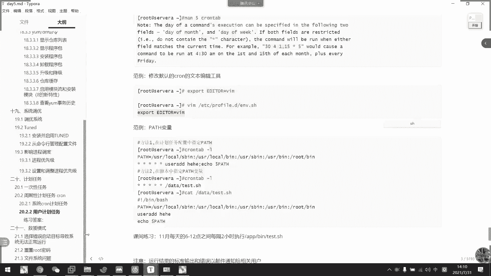

呃，一。ED c。Profi。更啲。Yeah， we。啊，这里没有。怎么有邮件呢？哦，对哦，我这里。呃龙老师。那个啥。还有8个。可呀。没有了啊，相关了。然后呢。诶。そす。唔是。Can be we。

S O U R C。硕实啊，然后我们现在写一下。哎呀啊这就可以高量显示啊。哎呦这里还在执行。呃，要命了要命的。把这个机删掉了啊。啊，知道就可以了。嗯。哦吼吼可怕。😊，忘了取消这个任务了。没事了。好。

这里就可以高粱小丝啊。所以指指定于VIM为它的一个。特定的。

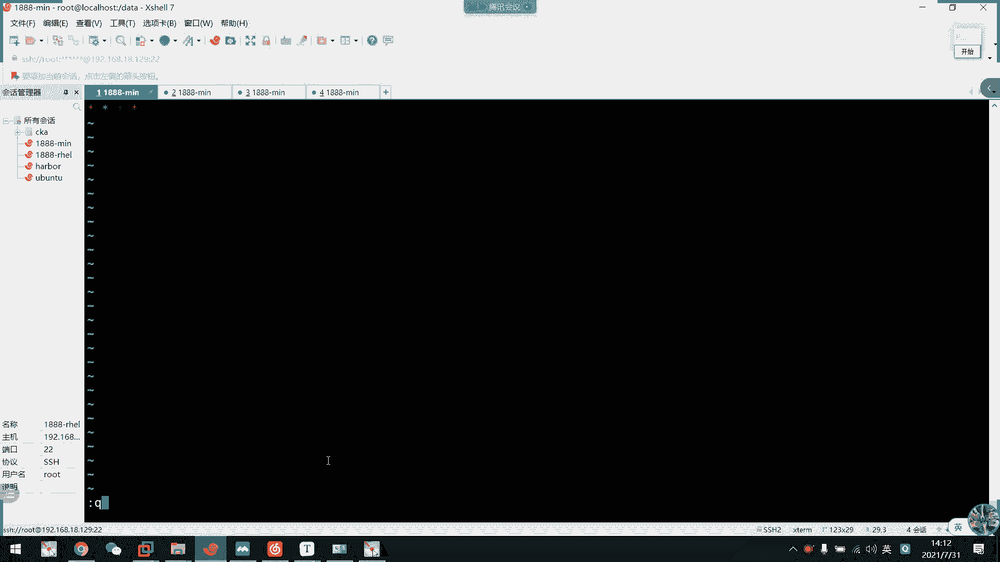

啊，编辑工具就可以了，可这。好。然后继续往下就是。中午留给你们的作业呀，有多少个同学做出来了？啊，你不用管别人家样的答案是对的，不是不对的啊，但是自己有没有思考过啊，自己有没有思考过？嗯。

为什么动了个心哦，没有没有。11月的每天啊。10月的每天。其他同学有没有做呢？好，我不管了啊。呃，这边的话呃。小军的话也是理解的差不多，但是还是差一点点啊。因为我这边题目要求是是吧？啊。

不是每分钟执行啊，只是他每隔两呃在这个时间点里面啊，两个小时做一次啊，执行一次。所以呢第一个分钟不要用心啊用名啊，这有答案。啊用0啊。嗯你。差不多了，应该理解的也差不多了啊，就注意一下那个读题就好了。

呃。要继续往下回顾。呃，然后是时间的。应有的。首先是。指定。比如说是。0。しing。那就。每天的。一点。然后是。理想。取值。呃，比如说是。Ling。15。20。30。事实。这子。然后是一点。日月是几啊？

每天。的一点。0分15分、20分。30分。45分。就读到。是谁。就开5。然后是。范围取折。0到15这里。Yi。每天一点。0到15分。未。分钟执行。然后是不计取折。不会举证。是。你边。的一点。从。

零分开始。每2分钟。执行一次计划。啊，然后是。关键字。特定。啊，所以是我们的app。Yeah。美联。1月1日。零食。年本。执行。D。好像Y不要我看下day。我忘第个照片啊。每ianian。

Meitian。有没有打那个外部药啊？0点。执行一次啊。然后是。嗯。贴取。Mouse。month每个月LLOMTH。L why。每月。一号。0。0吨。Weickly。呃。By so Pima。

所以 e可L啊没错啊。每周日。0。事情一。还有一个是。奥0。没。小时。零分。そ信です。最后一个是哎。Re vote。每次重启。事实。好，OK就是这些。然后是。黑白名单机致啊。呃，一个计会任务。

还有看来他们的机制都是一样的，一个是艾特。Yeah。E c。下的。no或者是dmi。还有EPC。可ello。晓的。ello。对的。默认存在。呃，当没有。白名单。的时候。黑名单。用户不能。计划人民。

然后是新的lo。默认不存在。当。白名单类。存在的且。你没。没有入库。只有ro可以。希望。白名单。类有。优户列表。则。只有列表中。そこ？可以。喜欢如果。第三种是若。黑白。名单。都不存在。则。使用。可以。

7000。ok。啊，这就是我们上午的内容啊，上午的一个。比较重点的东西啊。呃，我看一下下午的内啊。首然是我们的一个。嗯。重置密码。好吧好的啊。😊，下午我们先看一下就业模式啊，就业模式呃上呃两三种情况吧。

上种情况吧。第一个是我们使用的错误的。启动目标导致系统无法正常运行啊。啊，它跟修改密码是类似的啊，我们前面都一起加了。呃，第二种是我们重资运码。第三种是我们那个轻救援模式啊，轻救援模式等一直再讲。啊。

它一般都是我们挂脚问题啊，一般都是挂脚问题。没得没得救我那个呃硬盘的话，如果严重性比较强的话，没得救，我们等一下再详细来讲，我先看一下啊。啊，选择一个错误的启动目标，导致系统无法生行运行。

什么叫错误的一个启动目标呢？啊，我们前面说了啊，我们前面说了啊，就是说在我们的。

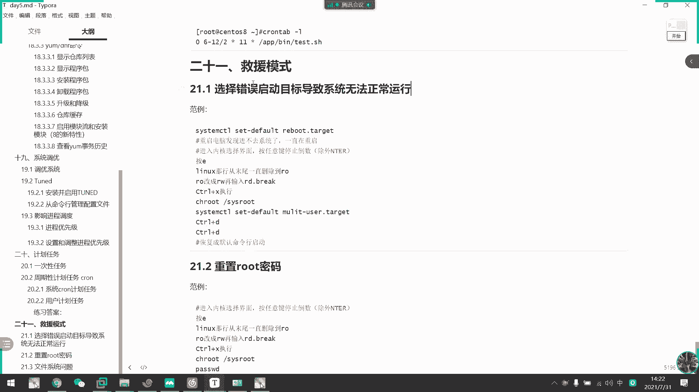

ED c。下啊。嗯。没有这个目录吧。这不是在。呃，看一下。优势。老。好。从这里啊可以看到。我们的启动目标有这几种啊，一个是power off，一个是rescue啊，然后三个是我们的一个。哦。

面条格模式啊，一个是我们的一个图形化模式啊，还有最后一个是我们的一个。重启啊重启。啊，什么叫错误的启动目标呢？比如说我把它默认设为重启了，或者是设为power off了啊，或者是我们的wescu了。

这边的话我们看一下。嘅地方。看一下行下，我目目呃目前默认的话是呃命令模式啊。那我先改一下。把它改成。sty four。呃，改成withca吧。好，然后我们现在重启啊。我们观察一下。啊，对对对对。

你看他进入了我们的一个就业模式。啊，是一个比较轻的救援模司啊。他这个。呃。可能可以不需要。不需要不需要我们进进去真正的一个救援模式改，我们这里给他密码就可以了。可以进来啊。所以我们不要用这个吧。啊。

虽然进来这里这种可以直接改啊，然后可以直接敲命令啊。74。呃，比如这里改成re报吧，严重一点。啊，然后我们现在重启。这样子。也是一样的。好丑的，会不会？这好丑，对不对？还是让他。这样吧，这样应该好点。

对不对？行，我现在这TT在无线重启啊。看到吗？你再不记楚你。那我们遇到这个情况怎么办呢？如果这个情况就好翻啦。但是很难看。说先这样吧。好，那么我们遇到这个情况呢，呃首先要了解一下它的一个读取顺序啊。

多少是。好，刚才。这里啊我们先按数字把它停止掉啊。啊，他这样是这样的。呃，他一该都有兴趣，是由我们的一个。呃，内核的一个启动顺序啊，所要是这样子，我们开机。开机。然后。到。我们的一个boat。

或者下面呢它有一个group。That problem。啊，如果他然后指向一个。boot的。啊，不对，写错了。啊所个star。啊，然后是我们的一个group。然后再到我们的boat引导啊，这个是引导。

我前面不是给他1个EEGB的。容量吗？记得吗？1后在pro7呢，它通过g呢可以启动一个比较呃比这个。是一个虚拟的。我s。啊，然后这个梳理的OS呢指向我们的真正的内核，就是这个啊。只剩我们那个。

就是我们的RHE。然后再开机啊。再修起来。开机。好，那么我们现在的情况呢就到这里，他选择了这个内核。然后呢，我们这个内核。啊，我这个列啊选择了report target。啊。

we were talking他所以他在无线攻击。那么我们要阻止这个情况发生。那么我是不是要从这个位置给他打断？啊，我们是通过虚拟的OS，然后再启动我们的一个真实的内核的。

所以我们要从这个位置给它给停止掉。要他不选这类个啊，就是说这一步骤不选。然后我们把它停掉。怎么说啊，我现在。等到他到了这个界面以后呢，我们按。呃，用一键啊，除了空格除了空格啊。把它停掉啊。

完了倒数停掉啊，不然它就删不秒自动选择默认的启动内核。然后呢，它这里我们注意一下底下啊。呃，有一个一啊。up输入一，然后去编写我们的一个艾特。啊，或者是苏学西数学个可慢啊，但是一般这个很少用。

我们用E啊，我们用E来。我们挑一下一啊，然后让它挑到这里。好，这里就是我们的一个一动数序。刚刚。啊，这里就是我说的那个啊在book下的那个虚伪的OS啊。它是启先启动这个序列会。

然后呢再让它去启动我们的这个。内核你看这里我们LVN。不是。我们我们安装安装不是安装在我们的1个IVI里面吗？前面。就是这这这个是根嘛，所以我们的内核是存放在根里面嘛啊，所以一直到这里。就到这里。有啊。

啊，他指定了一个路径，然后就读取嘛RD嘛，LDRVM嘛。对不对？所以说我们现在要阻短它怎么做呢？直接改。直接改直接就。我们跳到啊注意光标啊，看到光标吗？啊，也是这一行，因为我们要阻挡的只是这里。

我们这里。把它删掉。好。啊，还没有。在这里啊地点。不re。好，然后我们这里啊。他说。啊，这里有一个叫做。啊，输入我们ctrorl X去执行啊去执行啊，可能是啊也可以输入命令啊。

那我们cttrol加S执行啊。然后再就接主打，然后它会进入到我们的那个moote下的虚拟呃，虚拟虚拟。系统啊需求，然后我们可以从这个系统呢。这也可以看到啊。对它就进入我们的bot的一个虚拟系统了。

看到没有？我 but。当然也可以通过USB也可以啊。就是通过我们进啊IS手也可以进入这里面来。那我们怎么做呢？啊，到这里，然后我们要选择呃。这个当前这个还没有根的啊，没有根，要了它里面有很多根啊。

里为有很多根啊，是用我们bot的一个序据用户提供的。但是我们要切换到我们的一个真正内合的根，怎么做呢？就个我们选择啊，选什么叫选择，选择就是CHH嘛，是不是处嘛。呃，些许。OS也 choose嘛。

对不对？啊，然后是。根怎么是word。然后是我们的。SYSROD啊。好，这就切过来了，看到没有？okK看到啊IPA不行。那么怎么确定我们大田的那个是我们要进入的呢？看 rulingling是不时呢？啊。

这里看一下啊。应该可以的是吧？啊，这里显示了我们的一个主机名额。然后呢，这里是我们的内核，对不对？4018那就没错了，对不对？呃，然后再看这里是64位的架构啊。到时那就没问题了啊，就确认了啊就确认了。

好，那么到这里我们就可以直接改。CTL呃，这里没有指命你补全，我记得。啊，然后是gety four。对呀虽然是rebo target，对不对？然后我们直接在这里改。呃， set。Before。

把它改为正确的就可以了。LTI吧。啊他げ。啊，写错了。啊，不是写错了。是因为我们现在刚刚现虽然是主打的，但是我们进到这里只能。读啊read欧了。我们我们虽然主打啊break把它给断开了。

进入到我们的bot里面去。但是我们目前的一个职业权限啊是只有。可读缺陷啊。那么怎么做呢？我们先退出啊，退出的话可以用EXID也可以contrlD啊。标底先退出，要后让他再进来。要要他再倒数分嘛。算了。

或L选择E啊。那怎么做呢？我们在这里啊RD点break。Break。就是停止了，中断嘛，对不对？然后我们为了能读写啊，这里改成RW。然后直接可住X。又进来了。啊，然后是我们的系统的根。打出来了。

然后试一下行不行。Said before。然后是。改了对不对？那我们现在看一下能不能起啊。是不这个改了。好，你看积起来了积起来了。接起来。对不对。我这里应该可以连回来了。啊等医下。嗯。诶。

大就是说没有地址啊。为什么没有地址？S T A。呃，我也说。Let what manager。MA m a。这应该几好。还是没有了。没找到对应的。哦，我知道了。他把我这个。

更改了他现在啊没要EES160了，对不对？Yeah yes ya。那我改一下吧。先不管他那个什么了，因为他这里。呃，把我们的group改了把我们的group改了。CDCDM。Mufu。

ETH您改成我们的。EX160。后写一下。嗯。呃。Ling。160。然后是device。好吧。佢能水 we漏啊。给他说啊。也可以了。啊，可以了。我这边看一下的裂没有。啊他。X好了。啊，这就说完了。好。

那么。我们竞面模式。的强大支处强烈支处就是只要我能进入到我们的就业模式啊，并且有可多个写的。权限。那么。系统我就快了。呃，如果你知道是哪一个文件坏了的话呢，可以。通过光盘启用啊，通过光盘启动。

然后把那个对应的文件给它修复过来就可以了。然，给你看一下。然后那我们现在第二次，比如我现在忘记了木头密码啊，忘记了word头密码。那么我们现在。这样吧。PASWA。啊，随便啊。都这个的。打一口。随便打。

好，现在改了沃头密码了，那这么复杂，我肯定不记得，对不对啊。随机的。😊，啊，如果进得去就有鬼啊。好，那么我第二次啊，这次我们就不按。呃，厂理来进入我们的区援模式啊，我们试一下光盘启用啊。

我试一下刮刮使用。

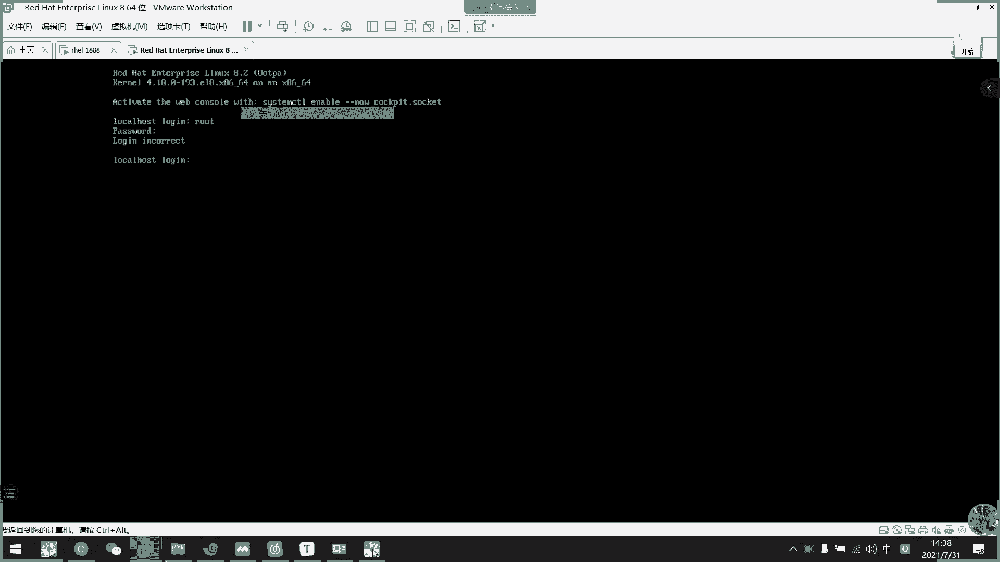

先把它关机。然后光盘这里我要设一下。启动是连接，应该可以啊，那我们这里选择啊。

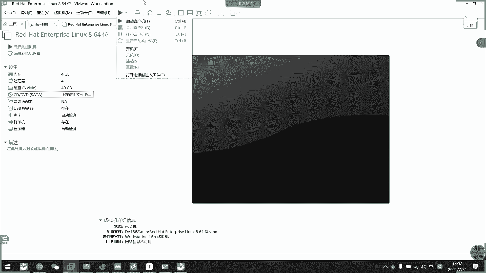

呃，打开电源池进入固件啊。可以。😀Yeah呵。😊，过分了啊，然后我们这里有一个boatbo，然后我们把这个移到最高。上仪是哪一个来的？加号。啊，这就是以光驱启动我们的一个引导，然后F10保证退出。

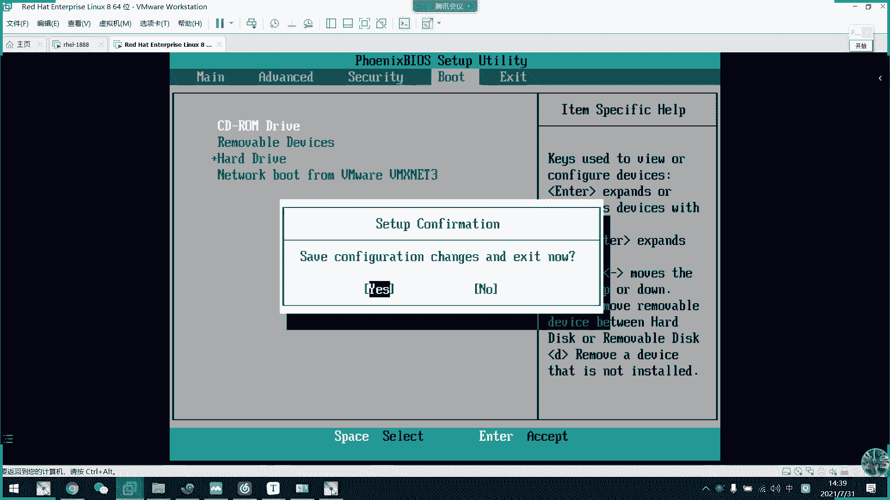

好。然后呢呃。这里有一个。不刷题吧，应该。啊，第二个救援模式啊，这里有个就援模式。第一个就是重做呃安装意思啊。第二个是我们的一个。呃。卷不是我回事。

所以有个光盘在手里面的系统系统内部的一个错误是没什么所谓的。好，你看呃这里是正在启用我们的默认他给。好，可以了。好，然后这里呢有几个选项啊。呃，一个是我们的一个完直接退出。然后是。呃，只读方式挂载。

然后退出就直接重启了。啊，这里有一个笑啊，我们要选择笑啊。sk下而就跳过到我们的下。然后我就觉得像，然后直接他这里让你去去输那个获取效啊或者效，或者我们可以下试一下啊，直接回车吧，算了。好。

然后呢我们看一下当前是否是我系统里面的啊。应该是的啊应该是。Get before。啊，应该是诶。Acor target。呃，当前是不是？你们应该是没说应该是没说，我们看一下faswo吧。看了。你啲先。

懂啊当前。但是这个不是啊但是这个不是我们的真正的根啊，还是要改。但这个不是。嗯。怎么感觉好像狮一样？我看一下。ETC下的宣le。啊又来啊。root没有密码的，这个应该不是啊。哎，那不怎么切过去啊？

坑爹了这回。我们现在是在intstore这里。Acro的。Bing besh， low such。F。Therey。应该是的。我们看一下行不行吧。呃。更改预码。パソワ吧。这个不是。

你看他连这个命令都没有。怎么切过去，光盘忘记了。我这是 a可的。然后是at table。行，我现在是在acclo里面。我刚刚切不了啊。捞上去。哦，直接CHROT试一下。Missing。看一下这里是啥了。

呃。Liu wrote room command， which with route diva that。To Liu road。切不了了。奇怪了。这个没什么所谓。哦，我忘记这个怎么切了。肯爹啦。

挂咗文件系统。那我这个不用了。挂盘。我讲个没用。Si。突然间。记不起来。不关盘，直接重新挂载。我现在大家就在我们的一个应达应达系统里面。呃。

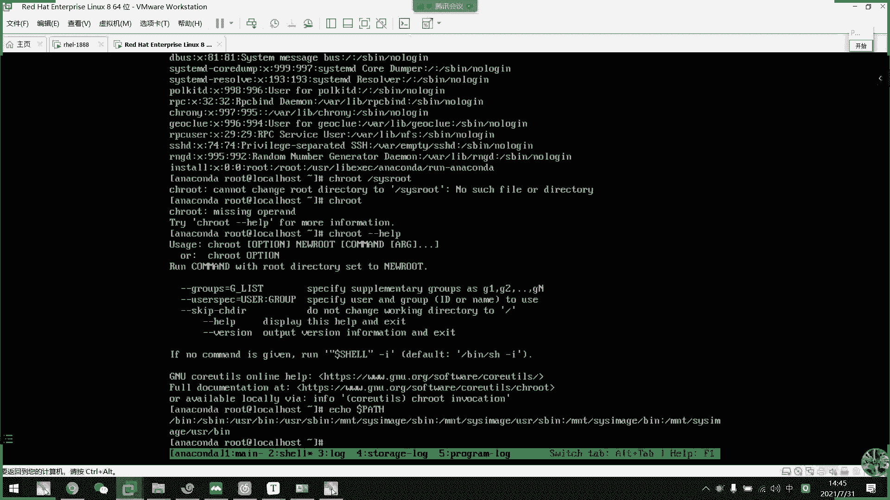

这里也。没记录啊，这里都是我们里面的。直接就油模式的，是用里面的就油模式的。

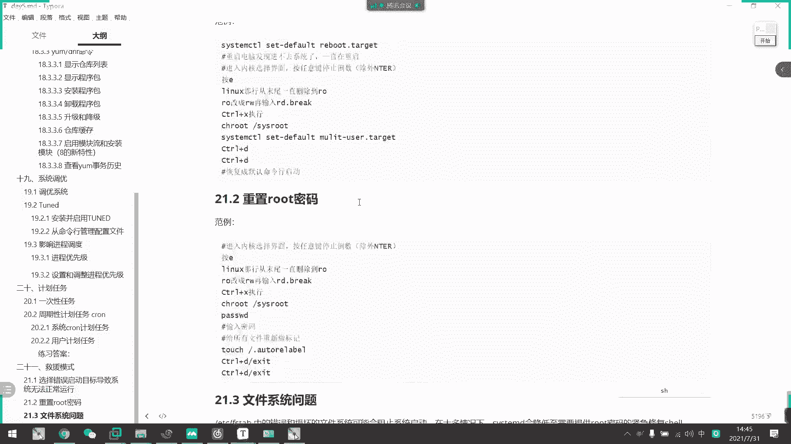

嗯。看一下我们DITA就知道了，你看没有的。是。我知道。现在是看那个。没有这个。啊，忘记这个要切什么来着。呃。哦，应该这个。啊，应该是跟。感觉也不是。😀呵呵呵。😊，这个是CD的。要挂载原来的文件系统。

对啊。挂仔。他切过去就可以了。呃。目前还没切过去啊。慢的。不是慢的。不是吗。哎，我忘记这个。没有。

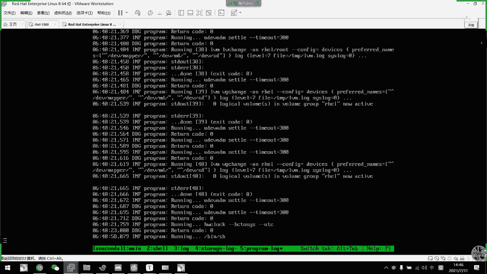

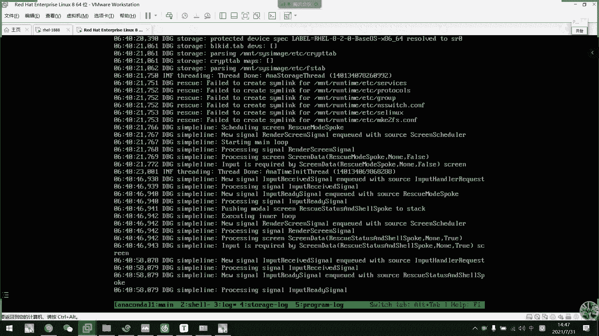

睇下流星果流星果。You your size。诶。就退出了。还是看一下帮助吧。骂的佳音应该不行。Sletter。She。这样吗？我这个没有那么复杂的。他这里增根。对啊，不行啊，就是。我记得是这样子啊。

是不是能看到原来的根看一下吧。不行啊。那为他这里还是没有我们的。对他就肯定是不行的。我看一下，稍等我一下。放在哪里了？是。这里等我一下下。是。或者你们上网找一下，看一下有没有对应的。哎，我这里要找东西。

好烦啊，都不知道全放哪里去了。F breakout。妈做么嘅。睡觉。我这得没那么复杂。RW然后是。Does look east。会不。啊，模式进错了吗？试一下。模式进错了。哦哦，对。哦，对对对对对。

他那个挑过了。哦，知道了。他选择的东西是一样的，搞了我。以为他我我进队了。肯定得完成，不用选。好。在这里写着 if for some reason。

 this process does not work。 Choose free to skip。啊，然后我看一下一什么呢？ choose一with the step啊 this step。

这里才是跳过下啊，然后它自动挂载了，自动挂载。刚刚那里是用我们手动挂载，所以啊前面呃。啊，真是真是真正同学那，你说对了啊。我肯定给他是自动挂载这个啊，我说哎有这么麻烦呢。我们现在看一下。呃，目前还不是。

嗯，怎么还不行呢？呃。怎么还不行呢？我们当前的效还是不对啊。大家的效还是不对的。看一下。救援模式。呃。对啊，忘记切过去。它是可以正常的系用操作。的确是正常的系统操作。不是我们的系统而已。对不对？

怎么切过去？看我空了的，还在应达街道这里。我看下文档，等我一下。我跑在哪里了？真的是要命的，所以要找他。14。Okay it。光盘启动。这修复 group不对。光盘启动。这里没有啊。

这修 group还有加密。啊，这里有。哦。神to1 spa。啊，这是。是不是进错了？刚才看一下这里不能往回滚啊，应该是。CHROTMNT下的。里面举。啊，可以了。切过来了。是这个啊。

是这个LT下的里面啊。我们看一下是不是啊。IPAA看不到。直接看一下有没有贝塔。有呀有，对不对？对不对？啊，我们现在就在我们呃这里啊。是切到这个。啊。MADSY image啊，我是说一个命令而已啊。

没那么复杂的。选一，然后输入这个MND。这个啊。你们那些应该也没错，但是他应该不是8。啊，是以前版本的不一样的。啊，这是八的这是八的啊。啊，选择这个啊。OK那么我们现在可以改密码了啊，直接PASSW。

然后密码是改回wifi就可以了。啊，然后改完这里要注意一点啊。稍后提示。哦，那个提示啊，我以为他切到了里，我没看。呃，我们CD奎加目录啊。诶。是tap吗？应该没关系，看一下行不行。

touch一个哦再跟一下的relaable啊。reable。啊，这个为什么要这样做，等一下讲，那我看下行不行。我 label有有拼错诶。这里要改一下。食关节。嗯。

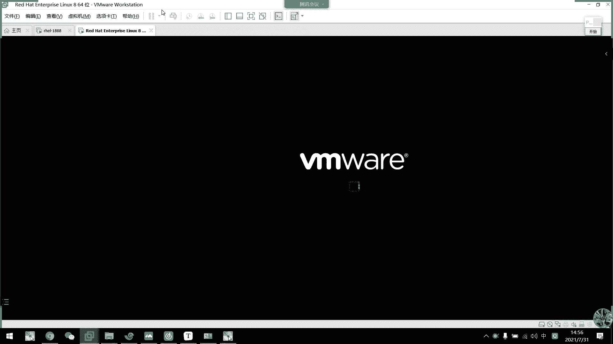

要把那个光盘启动关掉啊。

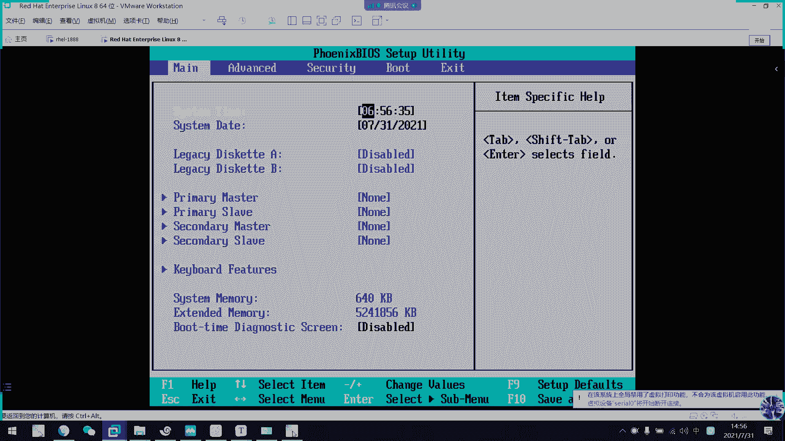

看一下有没有问题。其实他那里是体是有，我以为他选择一就切到那里去了。这里时间比较长，我等一下。啊，这里现在已经可可以看到了。呃，像我刚才用pass墨去改密码也可以，或者是把那个噱斗的那个段给删掉也行。

就星空密码，我这里是直接改密码。好。他那里我刚才为什么要做relabel，他就是做这一步啊。做这一步，所以他时间比较久啊，所以他时间比较久，这是什么呢？他是在重写。S Linux啊。我们启用S6。

所以它。一定要有这个东西啊，考试时候也是，但是生产中把ICD的给关掉了，就不需要这一个。laable也不需要啊。因我们学习那个习那个是不关掉啊。挂掉就可以不用。因为我们刚刚是进入到那个。就援模式。

就业模式。这样模式的话呢。啊，它的SClinux是花掉的啊。啊，我们看理一下思路啊，这个是关掉的关掉的。然后呢，我刚刚修改的文件，对不对？啊，修改文件。我们改密码是不是修改我们的衰罗啊？呃。

我们改它摔抖吧，所以它标签会变啊，标签会改变，它标改变了。我们开机。如果。他没有重写，那么我们修改就无效，然后就他读不取读读读取不了这个文件了，读取不了这个文件了。那我们现在可以。所以拿到光盘。

什么事都能做。呀登录进来了登录进来了。啊，所以一定要记住这个relab这一步骤啊，这是因为我开启了Ilim啊这个。

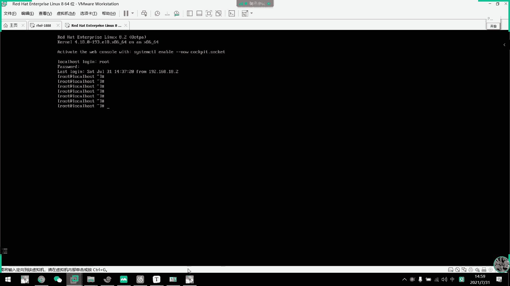

呃。这里有一个呃auto re。啊，我直接relaable了。诶 auto洲会 label 啊。这是重做SC Linuxux标记的啊。

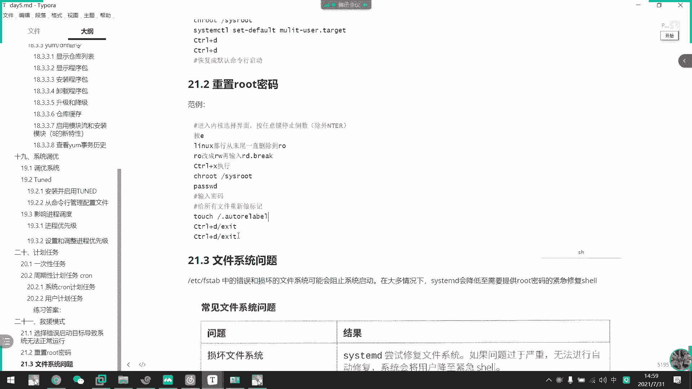

然后我现在REDHAT已经连进来了。😀呵呵。😊，好，那么我们现在再做一遍。啊，这是我们不用不用挂盘了啊，不用挂盘，直接从系统做，怎么做呢？呃。还是。乱敲一串啊，快点截图。passport尴尬。好。

现在又重置密码。那么我们。直接进入我们系统中的救援模式。也是一。然后还是改这里。这里改成RW。表示阿D。Yeah， break。让他还真的截图。😊，太过分了，你就不能让我忘记密码吗？好。

OK然后我们这里呃再写一下。呃。切到这里啊，然后呢我们可以使用命令还改也可以啊。这样吧，我给你们看一下。一话 c。你看它在我们救援模式中S6个是关掉的啊，S6是关掉的。哦，我们看一下正常正常是怎样的。

因为我们开了。默认开了。我们来get。我们C里可还没假，说你们听不懂也正常，你要知道他开了就可以了啊，他开了。我们是默认开了，但是它这里是关了，所以我们一这里是看不到那个标签的。呃。

比如说ETC下的噱斗。对，他关关掉，看不到的，看到没有问号，然后我们这边呢。呃，ETC下的薛龙。这边开了啊，你看它是有一个标签的啊，它是个标签的。如果我们在关了的情况下。把它给修改了。

那么他那个标签这个文件的。标价就会被修改。啊，刚刚说了把它清空密码也可以，不重置密码，清空也可以啊。少了个8号啊。补一下。八号。是出了点问题啊，这里先不保存。说了点问题。然后这里可以删除。其实没问题啊。

好，OK然后把它退出。啊，如果现在。不打标签，直接重启。哎，按错了。啊，直接重结。不代表你直接同知。他这里应该不会做重写的动作，你看直接跳过来了。然后呢，我们看一下。直接进不了。我切的密码都进不了。

是不是？

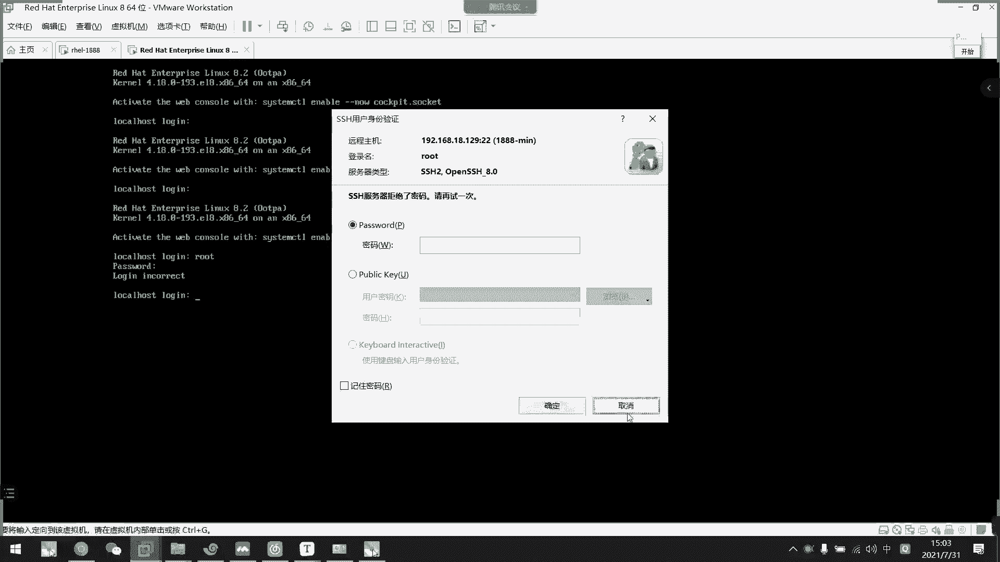

其都明白了。进不了。哦，要命了要命了要命了。

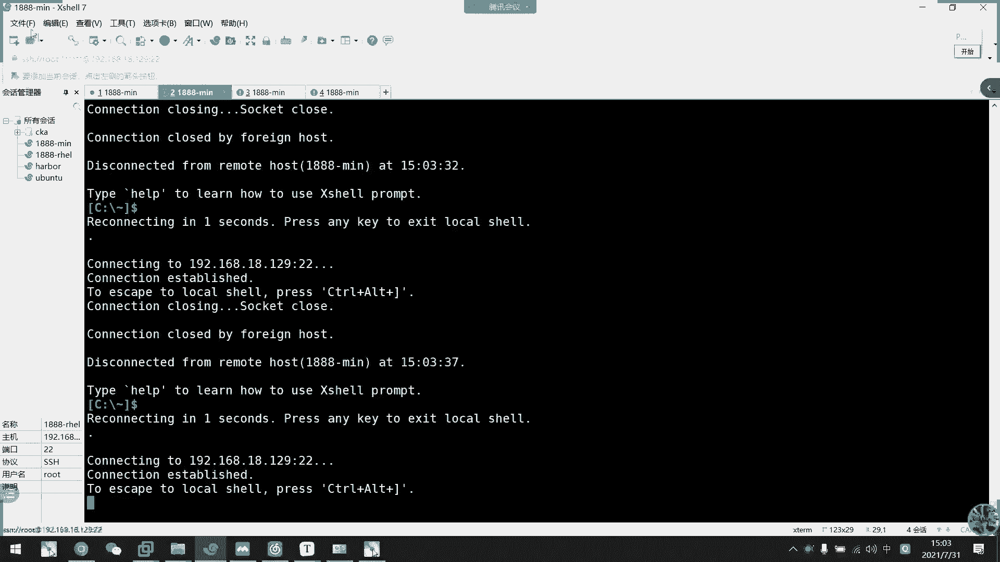

喂呀。

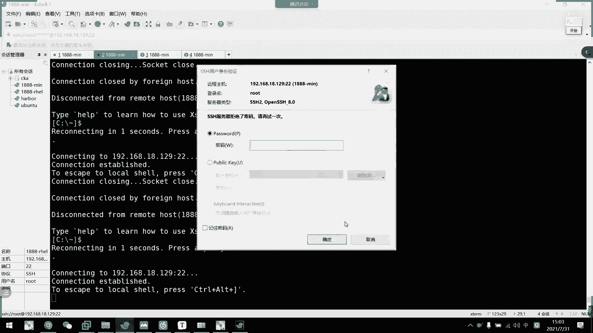

他会发现发现网络但是连不起来，所以他一直弹这个。

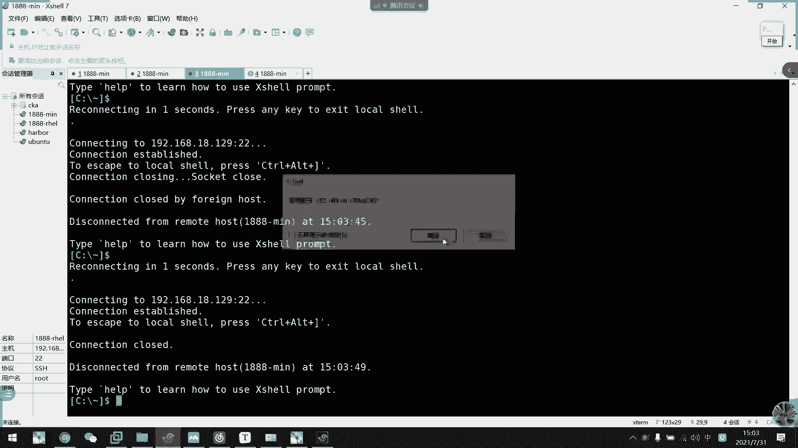

的密码验证失效啊。好，那么。这就是我们刚刚的SED那个是做怪呀。

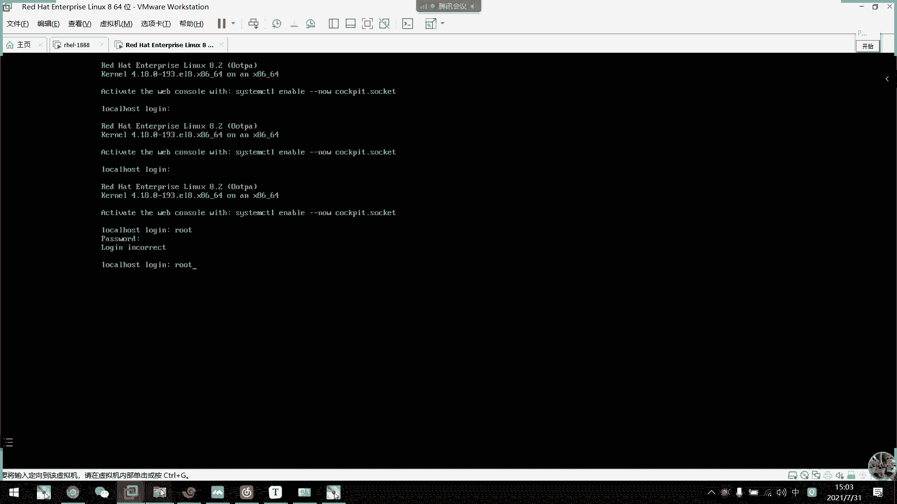

我多没有这里还有一个。

好。一呀登不进啊。那我们就再进去。让他 re我一下就可以了。你没发现那个光盘的强大之处吗？呵呵。😊，他这种哎呀。我刚刚没进去啊。它这种启用这个救援模式，系统中启用救援模式。

它有一个可以设定一个呃GROB密码的。它可以设定1个GIUB密码，然后也不知道密码的话，你进不了就业模式的，但是光盘可以直接进入啊。是来了。啊，这里这个SYROT一定要这样写啊。

这是切换到我们的系统的根啊。如果你直接切换到ROT的话，它是另一个根来的啊，这个要注意啊，要我们现在直接重写我们的标签就可以了。回车。等到我们讲到心那个时，就就知道什么。呃，他的一个安全管理啊。啊。

这节课时间有点长了。是。好，你看这里不要花时间，它在重重写标签。把所有都重写了把所有都重写了。就是一个安全标签啊。讲到SClin你就知道了，现在没讲，所以还不知道怎么叫标钱。就这个东西啊，刚刚列出来啊。

就这个东西。system什么U啊ob啊，大啊shale。啊，这是他所有的文件的一个标签啊。充写好久啊。是。不过其实现在这个救援模式。可能很少用上，现在很多企业都是用云服务器的。对不对？好，可以的。

开机了。我看一下密码行不行。还是进不了。还是寄不了。咋整啊，还像进不了。这边把密码也改一下，它还是进不了。没有吧。开车。咩话两个妈开啊。算了，直接改密我。18199。那个没关系啊。

我这里零的话是它的一个密码策略啊。直接改密码吧。Password。改码，然后是touch。AOTO。releable。也有可能是刚刚在这里拼错了啊。开一张。H。还真的吗。不一样的。但他策略又没有灵了。

这个是18039，这个是改密码。那个时间啊。减去1970年1月1日嘛，应该是这个时间啊。那没关系啊。那我们就重启了啊。两个可坐地啊。又要等待他漫长的写这个东西。系文件快了都说了，你就激关盘。

然后找到那个文件拷贝过去啊。只能这样做啊。没有其他方式了。什么。换区文件什么意思啊？一般是从另一个系统拷过来。对，看了啊，我已经登上来了。啊。

这个是有auto available跟没有auto available的一个区别啊。啊，这是我们的一个。你用不要IP 呢？唉，他又变成ETH0了，真的是受不了了。嗯，这样。我得。不要了。

G啊平车G要UB。呃。然后是。bookot下的。GRUB2下的。有两个吗。大睇啫。它是文件错误，一般都是从其他正常的系统给拷过来。啊，比如说我这边。分呃那个什么来着？分区表坏了。一般就是这样做了。啊。

回来了啊。吓你生。O那么。😊，我们讲完最后一总在休息啊。讲州一种。

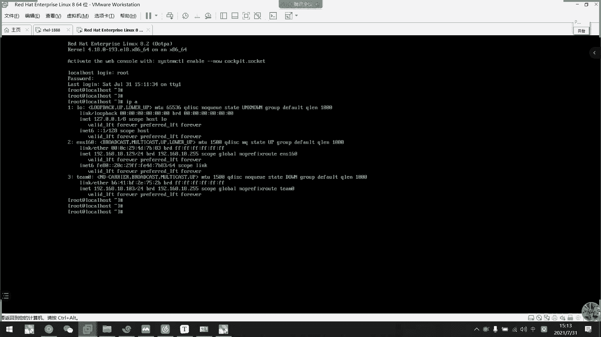

第三种。文件系统损坏啊。我应键是有手怪。它有几个级别啊？一个是。自动挂载写错了它的一个挂要点错误，一个是挂要点不存在。啊，就是说他没有没有对象啊，没有对象，他会进我们紧急校，就是我们刚刚输密码的那个。

啊，然后这里UID其实也是挂在不上而已啊，其实。就是我这些种问题只能说是这个。挂着问题，如果他损坏的文件系统啊，那就只能换光盘啊啊，换硬盘，那个是没没办法救了啊，没得救了，这个没得救了。

如果没有备份的话呢，就。跑跑路吧啊，没有必要就跑路吧啊，所以他这个就啊所所谓的文件系统问题的话呢，人救的只有这三种啊，而且都是人为的问题而已啊，人为的问题啊。

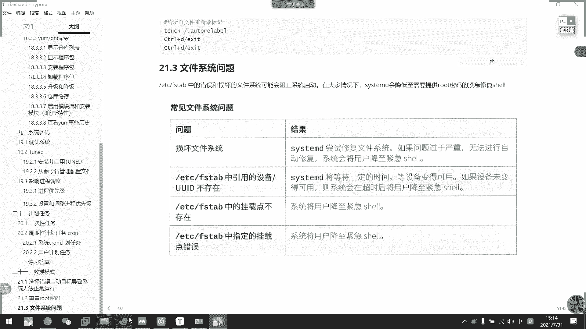

什么意思？我们看一下啊。🎼自动挂载啊，虽以我们没收到啊，我们这边也看一下啊，通过FFST这个文件它来指定一个自定挂载。比如说我这边要挂载我们的。弯区啊。这边输入设备，然后是挂脚点。啊。

然后是我们的类型啊。弯区是ISO9660啊，然后这是挂在选项。Before错。啊，这里先不用管它后面的是什么标准格式啊，直到这个前面就可以了。后面的到时候我们讲挂载的时候再再讲。好。

这个是我们的正常挂载啊，正常的啊，你看。他现在自动挂载上了。啊，这挂也上了。那么我们现在出个问题啊。就说比如说我这里写错了。坏了点不存在，然后我们重启电脑。好这看脑，他这里是连不了网啊，我们要到这边来。

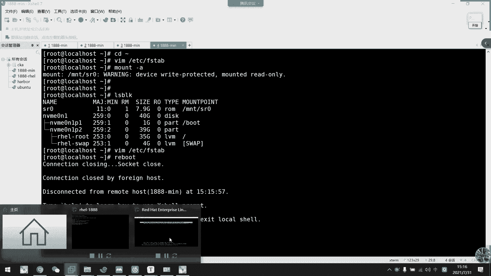

好。诶。怎么进来了？嗯。他怎么挂上呢？😀hu呵。😊，什么时候有个SR的目录了，我这里。不是你是不时候有个SR的侮录了。说到这里继续改。亏送修复吗？我这里又不是O to FS，为什么会自动修复？好奇怪。

挂着点不存在也也是吗？可能光盘不行。

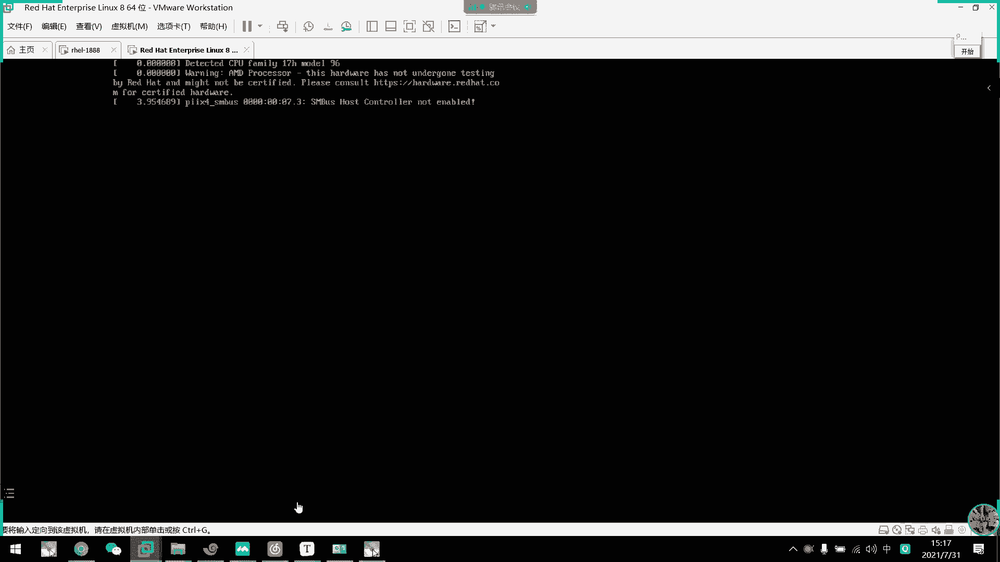

有可能是光网不了。对，关键点不存在嘛，对不对？或者是怪一点错误嘛。

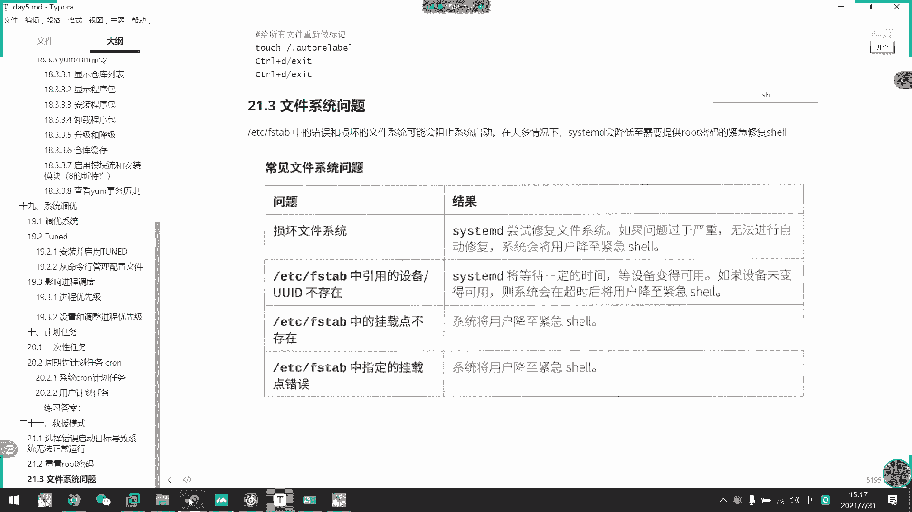

两个都是。你要关去不行。他自动创建了这个目录。呵他自动创建了。这样吧呃，我改其他的。改这个。啊，不行。我dta没有创建出来。呃，文件类型改了也可以。昨天那型改了也可以。之前上一期就有同学这样子。

他写错了，写了挨挨ol。呃。他写这样。这肯定不行。他还微信上面问我了，他还在微信上面问我了。这个情况是真实不行的啊。看到没有啊，然后输密码就可以了。啊，要我们解决。啊，一般出现这个都是挂载问题啊。

一般出现这个都是挂载问题，不用想。有其他问题的话。都是要进就业模式。ISO9660。Okay。这就没没问题了。然后我们再重启确认就可以。所以我挂载这个东西啊，如我说下那个情况。

考试的时候要注意啊考试的时候要注意。如果。挂载你觉得可以，然后换了盖音也觉得没问题，然后必须要重启一下电脑，看一下它到底有没有起来。如果系统没起来的话，检查问题啊。啊，不是这样子的。

要检查别要要你输密码的，一定要检查啊一定要检查，不然没有分的啊。对岸帽的盖A一下。但最好也是重启看一下情况啊。可以了。但是没问题了。啊，只有只有只有光光驱，它是自自动创建啊。

其他正常情况下它不会自动创建的。所以我真的是我现在也没有太多时间去创建一个新的硬盘去做试验。

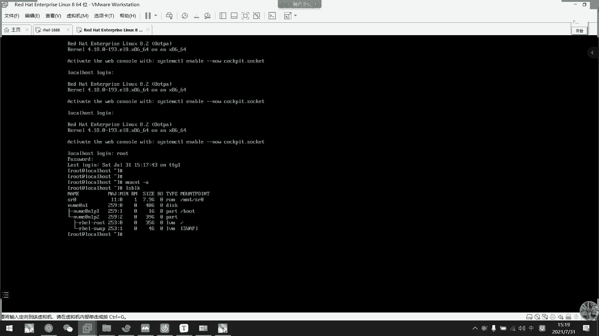

好。啊，那么这就是我们的呃就业模式啊。确不是。三种情况啊，一个是呃无线重启的。啊，一个是我们的一个更改密码的啊，一个是文I系统问题啊。清洁业模式啊，直接输入密码解决。都是挂载的问题啊，挂在学校问题。

这个这个。如果在这种情况下，过作情况下，你说一码要检查的这个没问题，它可能就文件系统出问题了啊，这个真的是没没没法救了啊，没法修复的啊，没法修复的。好，所以大家要注意一下。那我现在休息啊，休休息。

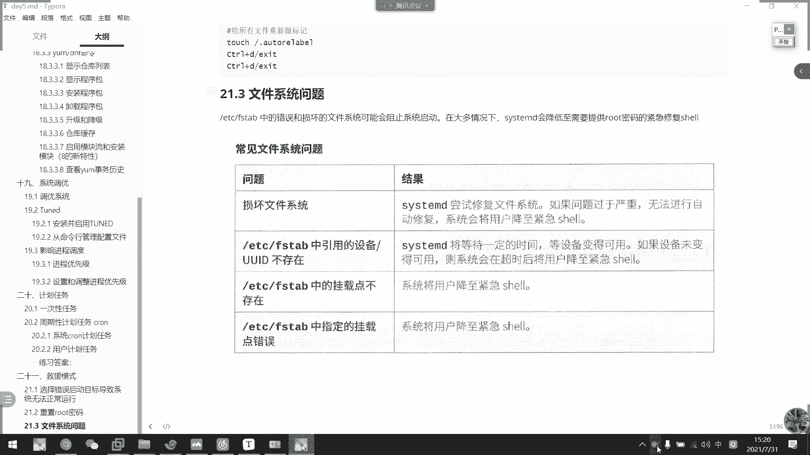

休20分钟吧，这那么久。