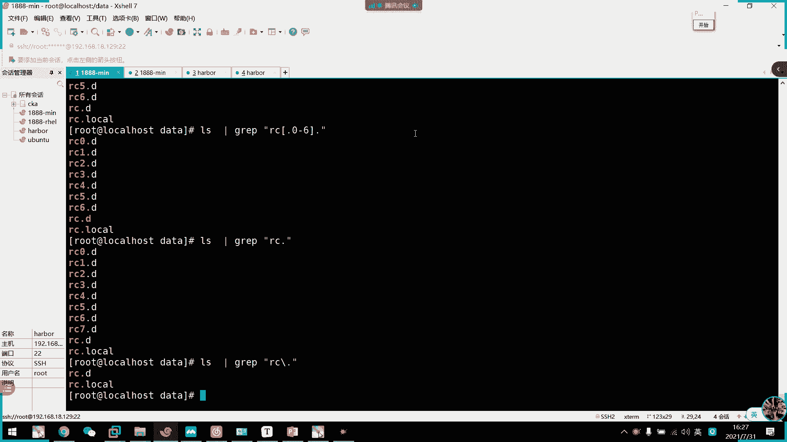
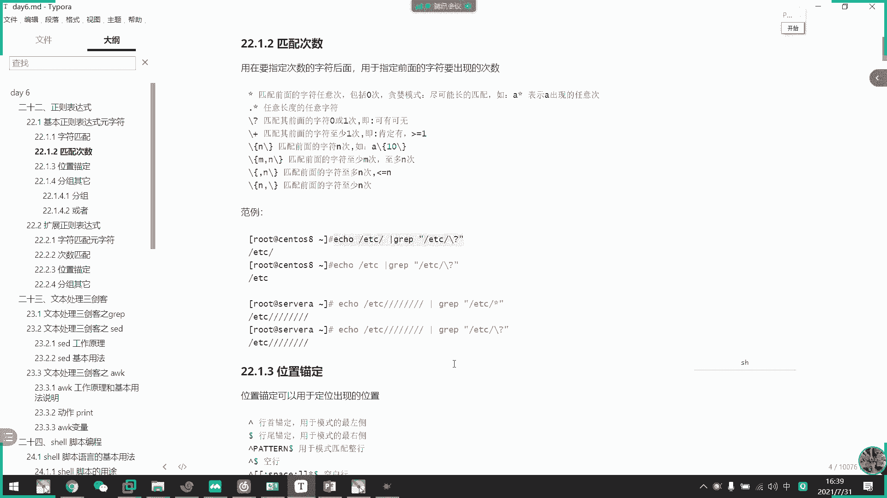
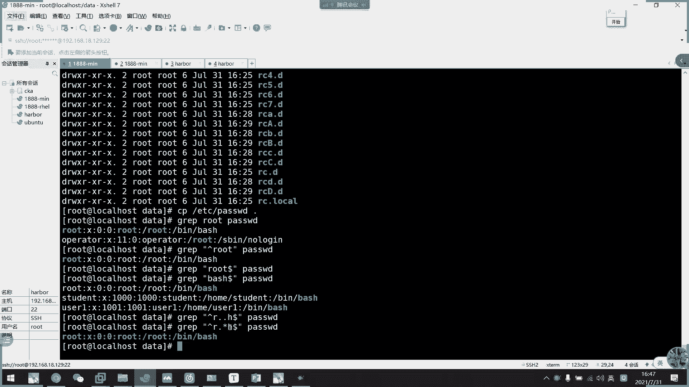

# 2021年7月新版-----RHCE8.2 RH124 RH134 RH294 认证课程 - P38：day7-4 grep和正则表达式 - bili_15701050454 - BV1Gy4y1T7ug

好。😊，啊，这个本来是应该在呃，他真真正的应该是在队伍前面讲的这个东西啊。那我现在。没关系啊，你们说要从简单开始啊，我们也就从简单开始了。好，正略表达式。这个呢我们在看正略表达式之前，我们先看gra啊。

先看我们我们三0节课之间的gra啊。因为不讲gra的话，我很难掩示我们的一个正面表达式的使用啊。我们先看一下bra。c啊它是一个过滤工具啊，过滤工具。它是一个过滤工具，然后呢。

他的一个工作模式是怎样的呢？我们来看一下呃，我这里应该有个图。啊，这以说我们不。好。首先我们看一下这位左边是我们的。啊，左边是我们的文本文件啊，然后我们文本里面呢有很多个行啊。

比如我这里啊只列出个六行出来啊，然后还有很多啊，后面还有很多。啊，然グ。就要EP啊不。🤧咳。加一个匹配条件，然后呢，他会按照这个条件呢，先把赖衣移过来这里。看一下。皮不匹配我们这一个条件。

如果匹配的话呢，就会打印到终端。然后再处理第二行啊，也是移到这里。然后看一下屏肤匹配，如果不匹配丢弃。如此类推，赖上也是啊，意时一行一行处理啊，逐行处理工具啊，这个叫主行处理工具。到外山。

打印出来到中端啊，然后他那个匹配工作呢是在我们内存中。作用的，所以呢它那个速度是比较快的啊，是很快的。啊，这就是我们的一个gra的一个工作逻辑啊，工作逻辑啊，它是一个组行处理工具啊。

那么我们现在看一下c。

啊，これ。呃。我们copy一下pa货吧。好。比如说呃我现在password。啊，有这么多内容。然后呢，我想要里面的一些。包括。ROOT这个字符串的行。那我们就可以用bra。算了，先不装不做这个例子。

我们等一下做这个例子啊，我们先看一下grarave的工作啊，刚刚说的他是通过一个类文间，我们看一下grave。这个命令我们直接敲。对，诶诶诶。哦哦，我知道了。🎼是我们的pass啊，他要接文件啊。

我们现在没有接体条件啊，你看。我们接了一个文件。然后它就一直卡在这里了，卡在这里。还这里有光标，什么意思？这不就是我们的一个标准输入吗？等待标准输入嘛，对不对？因为我们刚才说了，我要搜索这个文件中。

拥有。root的这个字符串的行，那么我们直接输一个root就好了。诶。啊，不对不对。讲错了，不好意思啊。找错了啊。它是这样子啊，刚刚讲错了，刚刚讲多了，他不会接文件啊，它不会接文件，我们看一下bra。

他后面接的是我们的一个条件啊啊，我们要收这个字符串，我们就这个啊，然后再等待输入啊，等待输入。那么我们现在输一个ro。呀他要打印了，而且高亮显示。啊，比如说呃ro。a b c d嘢诶浪超移通啊睇下第噶。

啊，他会把整行都打印出来。把符合条件的都整合条打印出来。啊，这里要更正啊，刚才说了cra后面接的是啊我们的一个匹配条件啊，这也是我们的一个匹配条件啊。啊，我现在是以ROT这个字符串啊。

注意它不是一个单词啊，它是一个字符串啊，连续的字符串就可以了，是一个连续的字符串。看它就会啊给截取出来了啊，作案处理。大家等待我们的一个输入内容，然后再处理啊。比如说我现在写一个腾科。

你看它没有包括我们的ROT，对不对？所以它不会再打印出来啊。不会打印出来。他这个作用就是下我们的一个组要处理啊。啊。目前这个模式啊是在等待我们输入文本。啊，但是如果像我们刚才的啊，是通过文本文件的话呢。

它是自动输入啊，按主行处理。

啊，目前我们也是主碍处理啊，他是把它拆成一行一行，自己丢到匹配通间中。

他这样子的话呢，是等待我们的一个。呃，用户输入而已。你看我们现在腾客就没有打印了，对不对啊？如果有商品配，他就会打印一一出来，然后把它搞点处理啊啊，比如说继续啊123LOTABCD这样子。

它会整行输出啊，注意啊，是整行输出。okK这就是我们的break的一个工作。frameme加条条件啊，然后是从那里搜索啊。

他从哪里匹配啊？好，然后接着我们看一下它的一个常用选项啊。首先呢它这bra为什么刚才显示的？是因为它有一个c跟我们OS1样，是一个别名来的啊，我们可以看一下。

开一下 grape。grape啊，对啊，有一个高点啊高点。但这个没没啊，正常来说它不会高亮的啊。

他只会把那个匹配的打印出来啊，然后是M。

啊，所以匹配多少时后停止了。啊，比如说我这里。真的这是真的。要匹配这个pas了啊。啊，可以接对下啊，可以接吻起来。然后我们现在有4次，对不对啊，可以打一4次，要我们加一个杠M。3。诶。

怎么拦截不了了？

啊，佢。啊，他刚刚匹配的话，他由于是一行，他直接忽滤掉了。三的话，他呃直接到下面，这里才算是第二次啊，这里才算第二次啊。看一下是不是。这里才要第二次啊，下面才是第二次。

好，OK然后是呃杠V就是显示不被匹配到的，就反选嘛。

相当于是防雪啊，这里就比较多内容了。啊，到时候绝对没有我们的w。

绝对没有我们的root。即系绝对没有我的么。好，要是杠I可以忽略大小节。

呃，这里的话我们要改一下吧。啊，大小写。呃，这样吧我们直接在这里插入一行。就这啊超异哈，然后我们来加个杠癌。我们现在不加，你看他是不会找出来啊，再要看看。

啊，过来打小姐啊过来大小姐。

好，当然的话可以显示我们匹配的行号啊。

再来一行啊，它都可以写的出来。继续往下啊，要是杠C可以统计我们的函数。

啊，你又是三痕啊，匹配了三痕。

注意啊，我这里是国乐大小姐的啊啊注意啊。我这里是两个学校一起使用啊。

呃，杠O的话呢，它就可以截取了啊，截取只显示我们。

匹配到的内容。看到没有？这就把它截出来了。

好。然后是杠Q啊寂末模式步骤输出信息。

啊，这等于我们的一个这样子。相当于是这个。啊，他相当于是这个啊，我看一下。啊，是不一样的。啊，是不一样的。干Q啊干Q寂寞模式。啊，虽然他说什么都找不到啊，但是这这个呢。也不是说他没用啊。

他一般是做判断的啊，做判断的。就是说呃我们。通过他这个返回执啊，我们每次执行这个命令啊，它都有一个返回值的啊啊，比如说我们来一口。多了。我操。看了调有返回制的。然后呢，我随了gra一个。呃。

没有的这么刷。然后再看它返回值，你看一啊，我们通常是啊看它返回值去判断它是否有这个东西。因为我没有我们这要更改它的配置之类的啊，或者是呃。有没有这个目录等等啊，有没有这个文件和目录啊，如果没有的话。

通过这个去判断它是否存在啊。啊，然后这多少万号这个备量呢我们等呃后面明天讲到。呃，明天讲到这个。笑的时候我们再来讲这个边量啊。啊，这里执照就可以了啊，有防位置的。虽然它是基本模式不能出。

但是它不代表他没用啊。

好，然后是杠A啊，这三个啊这三个很重要啊这三个。

啊，就是说。杠A我们说啊是叫after啊。After。然后。我们这样情况下，他列出来，然后我们加一个杠A。啊，上来。什么意思？啊，他就说我匹配到内容，然后。从这行开始再往下输出三行。嗯。

我们这样子啊通然是要看配置的啊，我只有那个配置的关键字啊。啊，做配置关键字，然后我要看它一个详细配置，我们是不是要加个杠A多少行，然后把它列出来啊。啊，这个是我们的一个。呃，杠A摇后杠B啊是上向上上行。

比如说我现在截一下这个student啊。好，是的，然后呢。我们可以看一下他的上痕。从这里是这个开始，往上显示三痕。啊，然后是杠C啊，杠C就上下投时显示上。上下都显示啊上下都显示。

就一个输入器行吧，我现在啊选了3。

诶有个似候。好，要是杠一啊。啊，是可以。

多个啊多个条件。呃，而且他们是破的关系啊，不是并情的关系啊啊，我们看一下。呃，哥个，然后呢。这里加一个概役吧。1四的这里引起来。这是一个条件啊。然后我们再加一个条件，杠一。Ro吧。

那么我们两个条件一个root，一个student，他都能识别出来啊，多少个条件就多少个杠一啊，多少个条件就多少个杠一啊。

好。1W啊是匹配整个单词啊整个单词。

啊，比如说我这里。就有点那个了。啊，这里是一个单词。这里不好。演示我们来。写一个文件啊。可。啊，应该差不多了。我们的鼓励。杠W腾科。啊，然后是我们开始。那么同学们，我这样子匹配。他能匹配出几行啊。

你们觉得他能匹配出几行？我那个文件啊。我不那个文件。啊，一共三行，你觉得我按照腾科为单词来匹配，他能列出多少个行？啊，同学们三行是吧，有没有其他意见呢？都觉为是萨卡是吧？啊。不对。四出反常必有1，对吧？

一航。老是这样问，肯定伤还是不对是吧？是不是？😊，我看一下是不上啊啊，我觉得是不是有答对啊。😊，最后是两行啊。就是两行四出反船逼我1是吧？啊，不对，三肯定受不了。好。呀别说来个，为什么呢？啊。

为什么我们这个腾科下划线123没有列出来呢？不对。并不是啊。并不是。那么我没有加W了。你2要出啥函吗？这里啊。讲到了我们的一个概念啊，我们来概念什么叫单词？什么叫单词？同学们。什么叫大紫？不是。

什么单时？在我们计算机中的单词。是、连续。连续的字母。下划线。还有数字。唯一个档次啊。字母下划线数字为一个单词。那么我们W指定了这个单词。那么。我们这一个作为一个大师就不符了，对不对？能理解吗？

我们是以腾科为单词来匹配。它这个整体是一个单词。所以他就不符合。能理解吗？能理解扣1。能不能理解？咁你哋可以。打英文。😊，啊，证人能理解吗？证人。Good对。只有两个同学能理解吗？对啊。

只要有下划线连接，它整一个都是单词啊。然后我们这里是指定的这个为单词啊，这个为单词。所以他这个是不符合的这个是不符合。是两个单词来的，这里是两个单词，所以它不符合。啊这样能理解吗？

好，那我们继续往下。呃，但你。啊，是大一啊，相当于是我们一柜一管啊，这里是使用我们的扩展帧的表示，这个等一下再讲啊。然后该辅是不使用这在表达式。啊，这个是不实这个表示啊。

然后该F根据我们的一个模式文件的处理啊，就是。

这个这个呃我们就直接写一个。文件啊叫bl。ふん。我们把root写下来啊。好，然后这里gra。该付。🤧哼。不好意思啊。哎，要是怕死我。你看他就以我文件里面的。错内为条件来搜索，我们改一下。给要加一行。

不要写在一起啊。你看我分行写，它就作为两个条件啊，作为两个条件。如果写一级啊。嗯，这里写1个FTP吧。看一下行不行。你看不行啊，他会把同一行里面作为同一个条件啊，所以它不行了。

所以他只能识别到我们student。

玩什么水，我要打喷嚏啊。好，然后是杠R。定位目录啊定位目录。

我们看一下啊。gat呃，比如说我要找一些。扣分内容啊，然后是在EDC下搜所。我们来加个盖啊。

啊。主要他是说文件而不是目录名啊，这里要注意啊，他是说文件里面的内容。太多了。改一下。嗯。还是太多了，感觉哦，不对。走远了啊，这里啊就有这么多啊，他输的是文件里面的内容吗？是我输这个目录啊，输这个目录。

啊，说这个目录。然后呢，这个目录下的文本下的内容。啊，这里要注意啊。干R啊不处理网链接。不处理件件。然后我们用大R试一下。啊，这里没有容量接，这就有点尴尬了。哪里有软件器，我看一下有没有翻力啊。

我看看有没有防利。还没有放力呢，我去。嗯。

没有放力。这样吧，收其他东西。呃。我们的。呃，不是从这个为父目录，它是递归的啊，地归。地柜你看到没有？这里还有一个目录啊。递规处理里面的文件啊。递柜处理里面的文件，当然也是啊，都是递柜处理的啊。

我们改下呃。如何。Live。🤧叫什么好了？呃，第一个字段是什么来着？系啊。嗯。😊，啊，不对。啊，不对不对不对不对。啊，这里有没有啊？好像还是没有哎。我们K一下。就是。5。就是那本。然后是。

指定在哪个文件内搜索，没有指定啊。他是会。在这个目录下。它的所有文本文件去搜索我们的APP呃。呃，那个匹配条件如果符合它打印出来，看这些都是文件啊，这些都是文件，它递归的啊，递归，然后往下下一级目录啊。

看一下下级目录有没有文件符合啊，搜索内容啊，它输出的都是文件的内容啊。呃。哦，UNIT啊。

大家有没有问那种。好多啊。看一下没有特定。嗯。应该没有。说这个知道吗？看一下行不行。看一下会不会少一点。十分多啊几啊。啊，他这里把我们的win level都处理了，win level。

然后我们现在用杠小R看一下小R。Yeah。是不是少了两个少了3个。的，他不清理软链接了啊，不取软链件。家兴哦。该言的话，我又不知道他有没有链接出来嘛，对不对？啊，这个不行。

概面的话我主要现在要列出我是否有软链接啊。V level这里是软链接啊，然后我们刚刚是不处理软链接。

都是真实的，这个都是真实的。然后这里是有软链接的。

小R跟大的区别啊。好，然后b的一些巧学生我这里以讲讲的啊。一且采用了。然后这里有一些饭店呃，其实跟我差不多的。啊后 break啊，通过文件预备啊，通过文件预备。诶然后这里。啊，是反向输出啊反向输出啊。

然后这里是用智能表达示的啊，然后呢我们学完那个gra的，基本使用，我们来看一下智能表达式啊。我们需要用到gra去配合使用。我们先休息10分钟啊，先休息10分钟。然后bra我们还有两三个没有讲啊。

就是相关于这略表示的。然后我们现在就看一下什么叫真略表示啊。这表示呢他。有计算的这略表达式，和有一个扩展的这略表达式。但是。啊，但是也不要觉得扩展的很难扩，其实扩展的比基本的还要简单啊。

我们看一下先看一下基本的这边的说的一个原子符。啊，所以是我们是5匹V啊，座5杯呢有大部分。大家有没有印象？啊，有大部分有没有意见？有啊有没有啊？啊，这些有没有印象，是像什么东西啊？

有没有觉得像什么东西啊？啊，没有人反馈吗？啊，没印象吗？😊，好像看过啊。啊，不行，你们再回去看啊，看第二天的视频。对啊，通配符没错没错没错啊，那就有一个答上来啊啊，它是类似于通配符。

但是它不是一个东西啊，通配符。呃，它是作用于我们的文件名啊，这是作用于我们的一个文本内容啊。是类似啊，但是不一样。是类似，但是我们记住它这些其实它是得出来的是一个东西啊，是的得出来是一个东西。

就是说我们的啊A那么是代表我们的一个。啊，字母数字啊，然后是L pen是忽略大小写的字母，然后low小写字母啊，uper大写字母啊，然后是。呃，back空白字符啊，就是我们空格和制表服务啊。

然后spriice啊是代表我们的一个回车。然后这是不可打印字符，然后十进制、十六进制。啊，非空呃可打印的非空白字符啊，有没有可打印字符啊，还有标的符号。啊，然后这里啊放在呃放在放在里面呢是不匹配。

对不对？然后我们还有一个呃。在同佩服里面还有一个叹号代表不违白，对不对？啊，然后中号里面的啊匹配他们里面的字符啊，匹配里面的字符啊，也是可以。定义方面也是一个字符，一个字符的区分的啊，这里要注意啊。

一个字符这个一个字符区分啊，要是点。代表人地自付啊代表人力自付。别。然后呢，我们先看一下这个啊。呃，用这个翻地板啊。

好，那么我们来看一下啊呃我们用re。哦，不对。什么来着？😊，呃呃呃呃呃呃呃。都 e d c。

不对，干嘛来着？我忘记啊LCDC没错LCDC啊，L后是gra。

这个匹配条件啊。Yeah。0到6。不对啊，我在点击当中哦。不好意思啊。阿C啊。嗯，看可看了。什么意思？这里往后匹配一个字符。是不是跟我们头佩服有点像？然后回配一个字符。但是它是处理文本啊。

我们I出来的是不是文本格式啊？啊，L出来的结果。相当于是我们的一个文本格式啊，然后它组何处理啊。1杀こ。前面是阿RC啊前面是RC，然后呢。可以是任意字符啊，不对啊，它这里面的点不是任意字符啊。

它不是任意字符，我们看一下是不是。

呃。它在里面的点不是代表任人字符啊。他就是代表点啊，他就是代表点这一个字符啊，不是一个字符啊。

呃，这个不好搞哎。这这样吧，我在这里。把它删光啊，然后我们在这里建一下。都不用还有他。给DI吧。再给点啊。然后是阿RC。0到6。点滴。然后是。阿RC点D。啊，logo我就。错了。啊。

目前我这里是跟EDC一样，对不对？啊，跟EDC是一样的。我就L。一模一样对不对？然后我们现在看一下。弄一个7出来啊。看一下他能不能识别。Yeah。我们气就不出来了呗。所以呢我们这个点。

它的意义就是这一个点啊，并不是说代表人员字符啊，那我先改一下啊。先改一下，把它改成这一点，这里加一个双引号吧。2。好。那么我们看一下结果。啊，不对。两点。这里有点代表任意字符啊，这个就代表任识字符了。

然后呢它就会把7。就是阿RC后面接一个字符的都会列出来。好，然后我们这里改一下啊，改成。加个转机。转以后它就是作为一个点啊作为一个点，然后它就这样子了。就只有点可以识别出来。这三个例子。

括号呢跟我们通配通配符是一样啊，它又作为一个字符嘛，它又作为点这一个字符啊，不需要转移，它就是转移后的结果啊，跟这个是一样的啊，跟这个是一样的。他跟我们通配服一样啊，只要是在中号里面。他说代表一个字符。

就我们内容都是代表一个字符。能理解没有？啊，这三个例子。这三个例子。能理解没有？这三个例子。其实这个不要啊这个不要是这个。这个还有这个能理解吗？呃，这是代表。

能不能理解？啊，就呃这个例子就讲到这两个啊讲到这两个。

好，然后我们看一下飞啊。那就出了个7嘛，对不对？不就出了个7吗？啊。投支服。呃，代表。放在里面啊，注意啊放在里面大表。不是这些的内容啊。不过这些类外。试一项叹号行不行？啊，他不行啊，他不行。

他只有波呃波s服啊。他叫拖着代表飞啊代表飞。就。呃，不匹配里面的内容。投明啲面的量。

然后是字母和数字啊字母数字。

那我们就直接来个。再创一个。啊是。被。可以啊。OK然后我们这边。用字母数字。叫什么AL那么多不对。你看字母的数字。

他要列出来了啊。这模式都列出来了。

然后是。有。再弄个大写的。PH a。忽略大小姐。的字母。对，是不是跟我们的特别服很像啊？啊，跟我们汇复一下。

啊，然后是小写字母带字母这边不演示了。啊，其他都。不想演色了。呃，然后这里是空白字符呃。

空白制符。我这样呃。哪里？固定格式啊啊这个外面这个框，外面这个中括号是我们的这个匹配里面任意字符。

然后呢，这里面的一个中括号加双报号，再加这个apply是代表我们的哭。26个字母的大小写。你可这样想它里面。是等于这样子啊。这个我把它复制出来。等于。里面是写的。A到ZA到Z。

52个字符。Okay。

呃，space哦，我刚刚被装了。スト。装了多。那我们来看一下。喂。Space。嗯。他好像全打印出来了。呃。哦，不对。他把有空格的函都打印出来了。他把空格的还能打出来。这这样并不好。

然后我们这里呃在外Y加个投资服给你看一下。等一下这个再讲吧。反正我们呃刚刚是识别到空格啊，识别到空格，但是我们现在并不是空格啊。好晒边护室讲啦。啊，这个条件并不是中格。第一次我不加。

直接这里的话呢是把里面包含空格的函都打印出来了，所以它描下去是红色的啊。

这里要注意到好，O。呃。其他的都是差不多的啊其他都是差不多的。要是实进制数字，这边我就不一一演示了，我们直接。啊，这是我们的原始符啊，我们要学的是它更加深奥的一些东西啊，匹配次数啊，所谓的匹配次数。啊。

这是更加深要的东西啊。原束服这些大家回去练一下，它跟通配服是类似的啊，通配服是类似的。然后呢，我这里要看它那个匹配次素。比就说我们有心。新代表是匹配前面的一个字符的音义次啊，包括零次啊，就有或者没有啊。

然后呢，他。有我们的一个踏拉模式啊，踏拉模式它会尽可能的匹配啊。

比如说呃我这里要c一个。对不对？一口。AA c诶。好，然后我们来。回复一下。啊，这个AC。🤧咳。这里可以看到。这是匹配到了啊，对不对？这匹配到了，要不们再来一个一口C。喂。8s。嗯。这一行也匹配出来了。

对不对？啊，同学们觉得对不对？这句话能不能理解什么意思？有或者没有。他都打印出来。大家注意啊。🤧这个是有匹配的啊，匹配的0次啊就是不存在匹配的。如果它不符合条件的话，它是不会打印出来的啊。

比如说我们这里看一下。它是不会打印的，有了新零次都包括了，所以它匹配出来了啊，这叫匹配了啊，这并不是没有匹配。只要它有条它有输出，它都匹配啊，那个那个条件都是相符合的啊。这个代表它的名次。

然后这个代表他的无数次啊，贪婪模式只要你有。我就有啊，只要你有，我就一直往下匹配下去啊，一直往下匹配下去。

O。好，然后是点C啊，任义长度的一个任音字符。

比如说我这里直接点心。就这个吧，就这个这典型。他说只要有字符，他都会匹备。可人只要制足。不管你什么制度，我就一直往下走啊一直往下走。

电信。这个点型好用的啊，大家注意一下。好，然后是啊。斜杠问号斜杠问号。它是匹配前面的字符0次或者一次啊，就是说可有可无。

我们看一下。给。嗯。Yeah。呃，大家这里要注意一下，它不是他拉姆斯呃不是他拉姆斯。因为他。是一个一个匹配啊，这里一个这里一个这里一个这里一个这样子一个个匹配下去啊，这并不是他的模式啊。

我们看一下CCCCCC这个。A。问他。0次他一样。你说他要。

然后呃。🤧嗯。加号就是至少一次啊。

至少一次，比如说我这里。可以加他就不匹配了，对不对？然后我们这里改一下。录个A出来。诶。哦，我知道啊，我弄错了，不好意思。我们来看一下啊，等样啊，现在是匹配不了A加，就至少有一个啊至少有一个。

就要我们再输个A，他就符合了。

等一下下面有一个发递啊等一下下面有个发递啊。我先别了。好，然后。啊，M里面只有一个L中呃括括号里面有一个N啊，就是我要呃匹配多少次啊，匹配多少次。比如说我这里改一下啊。

12345CC123CC。12345。🤧好，我们这里改一下啊，叫做。5次。那么我们可以看一下。诶。啊又要转片。做啦做嘢啊咩啊。它中间不够5次的就不匹配出来了。是的呃，理解吗？同学。啊。

不过5次就没有图没有没有没有没有识别出来啊，到是他超过5次了，我们看一下。一样不会约出来了，就是说。连续的字符。出现5次。它才是符合规则啊，它才是符合我们的一个匹配规则啊。

就这。啊，那就是说至少匹配多少次啊，至多匹配多少次啊。

比如说。呃。这里6个。我加一个二就可以了。对啊。最少两次。最多5次，所以呢它这里。单独一个啊，他又不够饿。加起来又超过5，对不对？12到53符合，对不对啊，5个也符合，对不对？这6个它这里。啊。

5个连续了，然后他这里又不够。🤧咳。所以他啊不在我们匹配条件内啊，不在我们匹配条件。

好，继续往下。然4X啊然后4就最多多少次嘛啊，最多多少次。

最了5次。比如说。其实这里断不开啊，断不开。我觉得我吃。我试一下。那就没办法。觉得不是。因为他就要断开了，他。其实这里5个，然后它最少小于5，这里也是少于5，对不对？大家觉得不是。

好，然后这里是最少最少多少次啊，最少多少次。

啊，比如说我这里改觉死啊。啊，你看这里就不符规则嘛，那就三次嘛，对不对啊，这是我们的一个。匹配次数啊匹配次数这个回去好好理解一下，回去好好理解一下。

然后刚刚同学们问到了他那个跟点心有什么区别啊啊，就是这个问号跟心有什么区别啊，我们看一下下面这个方例啊。好，所以我们来看一下啊，一口EDC。

他以这个字符对不对？整以减上字符为匹配规则啊，然后是啊不对，它是对前面的一个符号。

做匹配的。让我们看一下。嗯。🤧嗯。不要。

多少。呃，这是诶。他把它作为整体了这里面。作为把把前面的字符都匹配啊，这叫做把前面的字符都匹配啊。啊，所以它作为一个整体的。啊，然后我靠有或者没有，它都识别出来啊，这个有或者没有它都作为P配条件。

要不继续往下啊，看这个。新的啊。啊，这可以看到。是这样子的，要我们改成。我操。啊你看。他是把这个作为一个整体。🤧新。的话呢，他会把最后一个字符作为整体。明白吗？他的他的模式是对于这个的。啊。

新代表月是吧？他说他是接了这个字符的。能明白吗？然后问套呢是把前面作为一个整体的，我们这里改一下啊。比如说我这里再加一个。ETC。能明白区别了没有？啊。啊，张同学啊能明白区别了吧，其他同学能理解吗？

新的话呢啊首先是我这里符合条件，对不对啊，它这里啊没错，它依然是对于这一个啊都是对于这一个。啊。😮，不是，其实他不是把它当成整体是他把它把把它当成整体是因为我写在这里，他符合匹配条件。

是因为我把它写在这里。超过百时嘅先。刚刚我说错了，这里是我说错了啊，他只是对这个字符啊，他所有都是对这个字符而已啊，都是对这个字符而已。因为我们这里问号是0或者。无线他都。符合嘛，对不对？

所以他这个就算这个根号没有。它都符合EDC前面这个匹配条件吗？啊，然后我们这个心。啊，就是它列出来啊，然后先匹配EDC，然后到这个根号，然后新是对这个根号无限的啊，就真的是前一个字符了。

这真的是前一个字符了啊，无限的匹配。哎呀，问好了啊，说对这个。🤧整体。一直无00备。反正知道差区别就可以了，我也说不清楚。它到底是不是一个整体？啊，我也说不清楚。啊，对，看一下他效果就知道了。

反正新的话，我是对对他最后一个字符出现了字符。进行无线无线的套螂匹配啊，然后这里。就并不是了。这就并不是了。他应该这里是作为一个整体的。这个实体。哇，你这个。什么来着？这个可能很好理解一点，对吧？对呀。

所以我就再写多两个嘛，直接在这里写到一个。这些。他就匹配了。然后如果不加根号，这里直接写ETC它都不匹配的。能这能能看能看清楚吗。佢 b b。

所以它的每一次匹配是代表这个呃EDC跟号要匹配一次EDC跟号要匹配一次EDC跟号要匹配一次这样子。比如说我这里。这里加个根号，把最个取消了，你看它依然是B。它这样子匹配顺去啊。

首先EDC刚号EDC更号EDC号EDC更好啊。要从这里开始啊，要要从这里开始。然后新的话呢啊它直接从最后一个开始啊，从最后一个开始。我，这里。改成。那就不一样了，他只只只对他最后一个啊。

只对他最后一个进行匹配。啊，然后再重新第二轮啊，再重新第二轮。再做啲啦。第二轮的话呢，它又缺少了一个根，所以它个就不不呃不符合规则，对不对？然后从根开始啊，根接上一定性，它就符合规规则嘛，对不对？啊。

OK这里大家反复去研究一下，就能理解他什么意思了。反复理解一下。啊，对啊，他就是对他最后一个作为符合规则啊。啊ok。反正他匹配条件其实都是这样作为身体啊，其实都是作为身体啊。啊，但是新的话。

呢他他对于如果他连续出现的最后一个，他就会直直接匹配啊。问号的话，它就整体啊它要整体重新匹配才会无无无线的匹配下去啊啊OK。

啊，这就是我们的一个。匹配次速。好，然后就是我们这个。多敲就可以啊，不信秒顶啊，微信秒顶。😊，其实这两个没什么所谓的，一般都是用于它有或者没有。这种用法。这边区分。我都很少用啊。我见都还是很少很少用啊。

知道这个就可以啊，一般都是用点心什么的呃，或者是呃问号，我看看有没有或者是加呃至少一个这样子。就是用于它是有零或者是一。而已好，然后说位置没有定啊，为要没定。啊，首先是我们的一个。投资服啊是。

函数标定啊按锁标定。所以啊。比如说我这里。哎呦，刚刚删掉了copy。呃，PVC password。到这里。要我们来grave。你 shall wrote。是password的。系りた。

有这里有一个这里有一个这里有一个，对不对？这里没用到这个表示啊，然后我们现在用一个这个表示。放在开头。不知楚。那么我们就只匹配到家在行手的这一个了啊，其他三个都不匹配了。所以这个叫做。嗯。

含锁标地。啊，然后是行尾描定啊，行尾标定。

呃。这里可以注意到啊，一个都回背不出来，一个都回不出来。呃。这里改成be水。那就可以了，看到没有？那个罗洛几之咩有表会出嚟噶。这个是以be结尾啊，以be结尾。的行。

你被水写为了行所谓项目。好，然后是。呃。匹配者行啊，一般我们都是匹配工行的。

그走。这样吧。直接来个。啊，9点H。诶，就没有了。好不嘞。点心啊R点心H就是说R到以R开头的行以H结尾，然后里面有任意字符。啊，你看点心就这样用了。点心。

好，然后是空盘就是。

呃，这个。投资服多少？我们来看一下呃。然后是。ETC下的。也拷贝过来。ED7下HDDPD。喂。嗯m。好的。啊，输错了，不好意思啊。啊，这是里面的空行啊。啊，我们给个喊号看一下吧。这是它里面的空行啊。

这些都是空行。我们来看一下啊。呀，他是不是很多注释或者是空寒？那么我们现在排除掉混合。睇佢话。那么我现在这样子读是不是舒服很多了？没有空行啊没有空行，但是它呃依然有一些。几号的哈啊，我们刚刚学了。干一。

然后再来。要当你。几号开头的函，对不对？又把几号开头他给去掉了。那么这里还有一些。呃。空格和几号，我等一下再讲啊，我们一步一步来啊。我们现在自最起码把空行还有。几几号开头的糖给杀掉了，对不对？啊。

我们讲下讲讲就可以知道怎么去读取我们的一个干货了啊，真正有用的配置啊。

然后啊这里空白行啊其已经差不多啊，空白行跟空行不一样啊。空行它是没有东西的啊，只有一个do了啊只有一个do了。大空行啊空白行的话，它是有空格的啊，这里要注意啊，有空格的。好，然后是单词啊。

这里是磁手描顶啊，这个是石木描顶啊，我们来看一下吧。

呃，比如说grape。然后是。啊。这是厕手。呃，我要修改一下。随便写一个吧。好，我叫brare啊，可以看到。🤧咳。刚刚我是不是加了两个啊啊，一个是我们的呃root123，还有1个123root啊。

🎼他们刚刚说过了，他们都是一个单呃单独的单词啊，都是一个单独单词啊，不要拆分来看啊。所以我现在死手描定啊，他只能描描定了这一个啊，并描描定不了这一个。因为它的词数是123啊，这个主要词数是123。啊。

所以我们gra啊，你看只有这个啊root123出来了啊，并没有呃123root啊。那我们现在改一下啊。啊，这个叫词尾描定啊词尾描定。所以他出现这个好，然后呢。整体一起用。

我就以这个作为一个单词啊作为一个单词。所以它123321呃root123，还有123root，它都识别不出来的。

这说我单词秒定啊。别配这个单词啊别这个单词。🤧。好。呃呃。然后这里排除掉扣行呃，和几号开头的，他他是做了两次。我刚刚用的杠衣而已，刚才是用干衣而已。两合条件。其实呢我们不呃在这个表达式中呢。

是不需要用到杠一的不需要用到杠一的。啊，他这里把那个空白就就是把我刚才那个都个取消了。

呃，这个啊他把这个都都都都删掉了，怎么做啊？他直接再加一个条件啊。第毕。行。佢觉得。啊，我们剩下的都是干货了啊，真真正的配置啊，真正的配置啊这些。都是真正的配置了。通过3个。把他们截取出来啊。干货慢嘛。

对不对？干货慢嘛。

好，那么。🤧咳。呃。互上引用这个好像讲不了。嗯。我看一下手息。分组。分组。啊，分组可以讲。不行。哎呀，杠V是排除啊。排除显示。显示不包括这个。的糖。就反向显示啊反向显示啊。分组看看怎么给你们讲好吧。

说则好像在这里讲不了唉。问一下，我之前怎么讲的。哦，我借就讲。

分组看一下。只用破吧。咁咪。然后。

我们这里。有货号。

有那个。要转移啊。呃，有个括号，然后比如说我刚才的一个叫什么来着？空白。Jin。要我们加一个。4。好像不行啊。然后还要再加一个。这里。改谢。这个啊。哎有。这个不行啊，他把那个都排除了，这个不行。啊。

这个是扩的。分组，我们明天再讲，我们讲课啊，先讲课啊，还是跟刚才一样。我们想办法。我想办法。was it。他少了一个。我想问法。嗯。通过一个分组来把他们。那些都排污掉，什么叫分组啊？我们先看一下。

其实就是一个扩的条件啊啊不啊什么什么叫扩呃条件扩，其实就是这个。通过这个描述。把这个三个条件整合在一起啊啊，我们用括号破解。好，然后第一个条件。以几号开头的啊。🤧把9块了，然后晃。破含。然后再扣。

我想把那个加起来。我想想这个怎么加，好像加不了。So。啊，然后是。我们的空行加几号。空空格到几合啊，空到几合。好，然后呢进行转移啊。咳同意。合公司 h t v v。这不出来了吗？啊。

那么我就不不需要写三个杠一，我们直接呃用括去把它给。弄起来就可以了啊。有阔。那你就买一个。🤧く。

啊，这就是破。啊，这里有一个更加简单的，就A括B啊，就A括B然后C还有K就大C或者ca啊，然后是。大细小细开的啊大型小细开的。所以他这里还是要做两次啊。我这里直接把它做一次。哦，不对哦。

他也是一样啊他也是一样。不过他这里改成space会比比较好一点，改成space会好一点。

他就把那个如果是制表符都取掉了啊，制表符取掉了，我们也改一下啊，这也改成space。两个啊。

也是一样分组，这是分组。这个小实验可以回去做一下。好，然后这里有一些证接表达是练习。呃，这里我先不讲，你们回头练一下啊，回头练一下。🤧咳。好。我们的一个基本政策表达式它出了分组。嗯，可以啊。

我刚才不是用了吗？

我这里刚才不是用了吗？这不就是一个空格吗？这不是有酷狗吗？🤧嗯。当然这样子会规范一点点啊。这样子规范一点点啊。这个。space它不仅仅代表是空格啊，这个要注意啊，spacespace不仅仅代表是空格。

如果他是这表蝠的，是如果他是table了，对不对？啊，这个是保守一点啊。好，然后我们刚才讲完那个基本的这些表示，除了分组没有讲，分组我们明天讲到后效以后再讲啊。

其实他也没什么的。它分组用过略好像分组不了。回れ我封制不了。

啊，分总明天再讲。🤧嗯。啊，其实也可以，它就是把它作为一个整体啊，他用root加这样子。去嗰啫。嗯。算了还是明天讲的分组。用 set的讲会好一点啊，这个用 set的脚会讲好一点。🤧嗯。🤧好，我们讲完了。

😊，基本的证向表示。那么我们来看一下扩展正向表示啊。大家不要怀疑啊，我本来是看了59分，还有一点时间啊，我们一分钟能讲完啊。啊一分钟那钟，他那个原字符是一模一样的啊，原字符是一模一样的，然后匹配次速。

啊，有没有注意到什么？那些转移的符号全都没有了，转移的符号全都没有。位置么定啊，也是一样啊，行手行尾啊，然后是只手十位啊，只有势位。啊，测思尾这个不用说了，还是一模一样啊。呃。

这里这里为什秒定还是一样的，为什秒定跟上面是一样的啊，为什么描定。这些还是能用的。啊，然后。是分组或耳期的啊。

或。你看。我们基本的这个表达是是不是很麻烦啊？那么我这边。我们的一个获奖率这个表是啊，但是大家要注意啊，不是说我的。工具都能用。扩展的这个表示。🤧咳。好，一回。

我们刚才说了。贵。一啊是这个就是已经呃是用了扩展的这尾了，说它等于Egra啊等于Egra。所以我这里直接用了Egra啊，一个也是杠一啊。

啊呢个。是不是啊很好，他没有了转衣服，是不是看的更加清晰啊？嗯。是看到这个情形。啊，这是我们或者这个表示讲完了。是不是？😊，所以不要觉得扩展的真的没有是很难。他这他。他就不是所有都适用啊。

不是所有都适用。啊，不会错过试用。啊，有一些应用它可以用我们的扩展的设表师就可以用啊，而且它要启用起来了，它有一个特定的选项。grab跟我们的一个。呃，也不是啊，反正他有扩展的，我都会用扩展。啊。

实在不行，再用这个。反正gra set它都能不用扩展，反正这两个都能弄扩都能用扩展。其实最主要是查在一定的里面的采用率还是在这些工具而已啊。还有。区别没有区别啊，区别就在于它不需要转移啊。还没注意到吗？

啊补咗作业。然后就是一些应用它里面的一些匹配位置了。啊，比如我们ag的一个location了啊，这些我就不讲了。啊，这个表示还是可以用到很多地方了啊。但是我们运维的。

就是说我们系统运维啊就这这些啊系统运维就是这些。都是用blboard，用s的去用用这表拉师啊，然后他们都支持扩展。对啊，没错啊，都支持扩展。

现在整个gra都支持扩扩展的啊，好像AWK也支持啊。It都不。明天再说吧，明天再看吧。啊，行，那我们啊今天就上到这里啊啊，break跟这家表示都做完了啊，大家回去的话呢可以去做一下这些题目啊。

我也可以做一下这个题目。啊，如果这个没有的话呢，我们要装一个。他装。叫做亮。兔子。

应该是let兔s吧。

，是这个啊let兔啊。好。我这边把这个给你们啊。把笔记跟录屏给你们啊。

S。